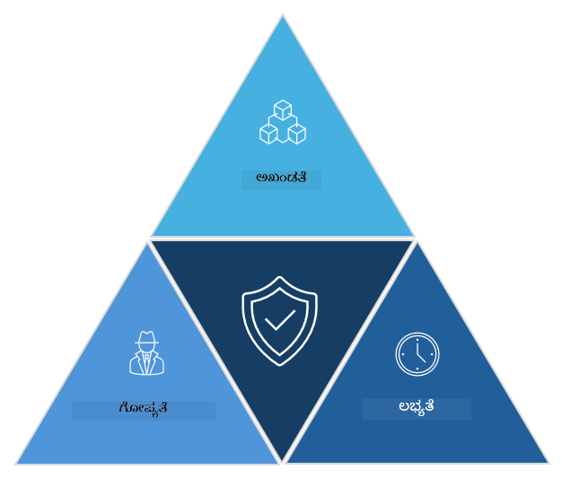

<!--
CO_OP_TRANSLATOR_METADATA:
{
  "original_hash": "16a76f9fa372fb63cffb6d76b855f023",
  "translation_date": "2025-12-19T12:50:00+00:00",
  "source_file": "1.1 The CIA triad and other key concepts.md",
  "language_code": "kn"
}
-->
# ಸಿಐಎ ತ್ರಯ ಮತ್ತು ಇತರ ಪ್ರಮುಖ ಪರಿಕಲ್ಪನೆಗಳು

## ಪರಿಚಯ

ಈ ಪಾಠದಲ್ಲಿ ನಾವು ಕವರ್ ಮಾಡುತ್ತೇವೆ:

 - ಸೈಬರ್‌ಸುರಕ್ಷತೆ ಎಂದರೇನು?
   
 
 - ಸೈಬರ್‌ಸುರಕ್ಷತೆ ಸಿಐಎ ತ್ರಯ ಎಂದರೇನು?

   

 - ಸೈಬರ್‌ಸುರಕ್ಷತೆ ಸಂದರ್ಭದಲ್ಲಿ ಪ್ರಾಮಾಣಿಕತೆ, ನಿರಾಕರಣಾ ಅಸಾಧ್ಯತೆ ಮತ್ತು ಗೌಪ್ಯತೆ ಎಂದರೇನು?

## ಸೈಬರ್‌ಸುರಕ್ಷತೆ ಎಂದರೇನು?

ಸೈಬರ್‌ಸುರಕ್ಷತೆ, ಮಾಹಿತಿಯ ಸುರಕ್ಷತೆ ಎಂದೂ ಕರೆಯಲ್ಪಡುವುದು, ಕಂಪ್ಯೂಟರ್ ವ್ಯವಸ್ಥೆಗಳು, ಜಾಲಗಳು, ಸಾಧನಗಳು ಮತ್ತು ಡೇಟಾವನ್ನು ಡಿಜಿಟಲ್ ದಾಳಿಗಳು, ಅನುಮತಿಸದ ಪ್ರವೇಶ, ಹಾನಿ ಅಥವಾ ಕಳ್ಳತನದಿಂದ ರಕ್ಷಿಸುವ ಅಭ್ಯಾಸವಾಗಿದೆ. ಸೈಬರ್‌ಸುರಕ್ಷತೆಯ ಪ್ರಾಥಮಿಕ ಗುರಿ ಡಿಜಿಟಲ್ ಆಸ್ತಿಗಳು ಮತ್ತು ಮಾಹಿತಿಯ ಗೌಪ್ಯತೆ, ಅಖಂಡತೆ ಮತ್ತು ಲಭ್ಯತೆಯನ್ನು ಖಚಿತಪಡಿಸುವುದು. ಸೈಬರ್‌ಸುರಕ್ಷತಾ ವೃತ್ತಿಪರರು ಆಸ್ತಿಗಳು, ಡೇಟಾ ಮತ್ತು ಮಾಹಿತಿಯನ್ನು ರಕ್ಷಿಸಲು ಸುರಕ್ಷತಾ ನಿಯಂತ್ರಣಗಳನ್ನು ವಿನ್ಯಾಸಗೊಳಿಸುತ್ತಾರೆ ಮತ್ತು ಜಾರಿಗೆ ತರುತ್ತಾರೆ. ನಮ್ಮ ಜೀವನದ ಹೆಚ್ಚಿನ ಭಾಗಗಳು ಡಿಜಿಟಲ್ ಮತ್ತು ಆನ್‌ಲೈನ್ ಆಗಿರುವಂತೆ, ಸೈಬರ್‌ಸುರಕ್ಷತೆ ಖಾಸಗಿ ವ್ಯಕ್ತಿಗಳು ಮತ್ತು ಸಂಸ್ಥೆಗಳಿಗಾಗಿ ಪ್ರಮುಖ ಚಿಂತೆ ಆಗಿದೆ.

## ಸೈಬರ್‌ಸುರಕ್ಷತೆ ಸಿಐಎ ತ್ರಯ ಎಂದರೇನು?

ಸೈಬರ್‌ಸುರಕ್ಷತಾ ತ್ರಯವು ಯಾವುದೇ ಸೈಬರ್‌ಸುರಕ್ಷತಾ ಕೆಲಸ ಅಥವಾ ವ್ಯವಸ್ಥೆ/ಪರಿಸರವನ್ನು ವಿನ್ಯಾಸಗೊಳಿಸುವಾಗ ಮೂರು ಮುಖ್ಯ ಪರಿಗಣನೆಗಳನ್ನು ಒಳಗೊಂಡ ಮಾದರಿಯನ್ನು ಸೂಚಿಸುತ್ತದೆ:

### ಗೌಪ್ಯತೆ

ಇದು "ಸೈಬರ್‌ಸುರಕ್ಷತೆ" ಎಂದು ಯೋಚಿಸಿದಾಗ ಹೆಚ್ಚಿನ ಜನರಿಗೆ ಪರಿಚಿತವಾಗಿರುವ ಪರಿಗಣನೆಯಾಗಿದೆ: ಗೌಪ್ಯತೆ ಎಂದರೆ ಡೇಟಾ ಮತ್ತು ಮಾಹಿತಿಯನ್ನು ಅನುಮತಿಸದ ಪ್ರವೇಶ ಪ್ರಯತ್ನಗಳಿಂದ ರಕ್ಷಿಸುವ ಪ್ರಕ್ರಿಯೆ, ಅಂದರೆ ಮಾಹಿತಿಯನ್ನು ನೋಡಬೇಕಾದವರು ಮಾತ್ರ ಅದನ್ನು ಪ್ರವೇಶಿಸಲು ಸಾಧ್ಯವಾಗುತ್ತದೆ. ಎಲ್ಲಾ ಡೇಟಾ ಸಮಾನವಾಗಿ ರಚಿಸಲ್ಪಟ್ಟಿಲ್ಲ, ಮತ್ತು ಡೇಟಾವನ್ನು ಸಾಮಾನ್ಯವಾಗಿ ತಪ್ಪು ವ್ಯಕ್ತಿಗಳಿಂದ ಪ್ರವೇಶಿಸಿದರೆ ಎಷ್ಟು ಹಾನಿ ಉಂಟಾಗುತ್ತದೆ ಎಂಬುದರ ಆಧಾರದ ಮೇಲೆ ವರ್ಗೀಕರಿಸಲಾಗುತ್ತದೆ ಮತ್ತು ರಕ್ಷಿಸಲಾಗುತ್ತದೆ.

### ಅಖಂಡತೆ

ಪರಿಸರಗಳಲ್ಲಿ ಒಳಗೊಂಡಿರುವ ಡೇಟಾದ ನಿಖರತೆ ಮತ್ತು ವಿಶ್ವಾಸಾರ್ಹತೆಯನ್ನು ರಕ್ಷಿಸುವುದು ಮತ್ತು ಅನುಮತಿಸದ ವ್ಯಕ್ತಿಗಳು ಡೇಟಾವನ್ನು ಬದಲಾಯಿಸಲು ಅಥವಾ ತಿದ್ದುಪಡಿ ಮಾಡಲು ಅವಕಾಶ ನೀಡದಿರುವುದು. ಉದಾಹರಣೆಗೆ, ವಿದ್ಯಾರ್ಥಿಯು ಡಿಎಮ್‌ವಿ‌ನಲ್ಲಿ ತಮ್ಮ ಚಾಲಕ ದಾಖಲೆಗಳಲ್ಲಿ ತಮ್ಮ ಜನ್ಮ ದಿನಾಂಕವನ್ನು ಬದಲಾಯಿಸಿ, ತಮ್ಮ ಜನ್ಮ ದಿನಾಂಕವನ್ನು ಮುಂಚಿನ ದಿನಾಂಕದೊಂದಿಗೆ ಮರುಮುದ್ರಿಸಲು ಮತ್ತು ಮದ್ಯವನ್ನು ಖರೀದಿಸಲು ತಮ್ಮನ್ನು ಹಿರಿಯರಾಗಿ ತೋರಿಸಲು ಪ್ರಯತ್ನಿಸುತ್ತಾರೆ.

### ಲಭ್ಯತೆ

ಇದು ಕಾರ್ಯಾಚರಣಾ ಐಟಿ ಅಡಿಯಲ್ಲಿ ಪರಿಗಣನೆಯಾಗಿದೆ, ಆದರೆ ಲಭ್ಯತೆ ಸೈಬರ್‌ಸುರಕ್ಷತೆಯಲ್ಲೂ ಮುಖ್ಯವಾಗಿದೆ. ಲಭ್ಯತೆಯನ್ನು ಗುರಿಯಾಗಿಸಿಕೊಂಡು ನಿರ್ದಿಷ್ಟ ರೀತಿಯ ದಾಳಿಗಳು ನಡೆಯುತ್ತವೆ, ಮತ್ತು ಸುರಕ್ಷತಾ ವೃತ್ತಿಪರರು ಅವುಗಳನ್ನು ತಡೆಯಬೇಕು (ಉದಾ. ವಿತರಿತ ನಿರಾಕರಣಾ ಸೇವೆ – ಡಿಡಿಒಎಸ್ – ದಾಳಿಗಳು).

**ಸೈಬರ್‌ಸುರಕ್ಷತೆ ಸಿಐಎ ತ್ರಯ**

## ಸೈಬರ್‌ಸುರಕ್ಷತೆ ಸಂದರ್ಭದಲ್ಲಿ ಪ್ರಾಮಾಣಿಕತೆ, ನಿರಾಕರಣಾ ಅಸಾಧ್ಯತೆ ಮತ್ತು ಗೌಪ್ಯತೆ ಎಂದರೇನು?

ಇವು ವ್ಯವಸ್ಥೆಗಳು ಮತ್ತು ಡೇಟಾದ ಸುರಕ್ಷತೆ ಮತ್ತು ವಿಶ್ವಾಸಾರ್ಹತೆಯನ್ನು ಖಚಿತಪಡಿಸಲು ಸಂಬಂಧಿಸಿದ ಹೆಚ್ಚುವರಿ ಪ್ರಮುಖ ಪರಿಕಲ್ಪನೆಗಳಾಗಿವೆ:

**ಪ್ರಾಮಾಣಿಕತೆ** - ನೀವು ಸಂವಹನ ಮಾಡುತ್ತಿರುವ ಮಾಹಿತಿ, ಸಂವಹನ ಅಥವಾ ಘಟಕವು ನಿಜವಾದದ್ದು ಮತ್ತು ಅನುಮತಿಸದ ಪಕ್ಷಗಳಿಂದ ತೊಂದರೆಗೊಳಿಸಲಾಗಿಲ್ಲ ಅಥವಾ ಬದಲಾಯಿಸಲಾಗಿಲ್ಲ ಎಂಬ ಭರವಸೆ.

**ನಿರಾಕರಣಾ ಅಸಾಧ್ಯತೆ** - ಇದು ಒಂದು ಪಕ್ಷವು ತಮ್ಮ ಭಾಗವಹಿಸುವಿಕೆ ಅಥವಾ ಸಂವಹನದ ಪ್ರಾಮಾಣಿಕತೆಯನ್ನು ನಿರಾಕರಿಸಲು ಸಾಧ್ಯವಾಗದಂತೆ ಮಾಡುವ ಪರಿಕಲ್ಪನೆ. ಇದು ಯಾರಾದರೂ ಸಂದೇಶವನ್ನು ಕಳುಹಿಸಿಲ್ಲ ಅಥವಾ ನಿರ್ದಿಷ್ಟ ಕ್ರಿಯೆಯನ್ನು ಮಾಡಿಲ್ಲ ಎಂದು ಹೇಳುವುದನ್ನು ತಡೆಯುತ್ತದೆ, ಇದಕ್ಕೆ ವಿರುದ್ಧವಾದ ಸಾಕ್ಷಿ ಇದ್ದಾಗ.

**ಗೌಪ್ಯತೆ** - ಇದು ಸಂವೇದನಶೀಲ ಮತ್ತು ವೈಯಕ್ತಿಕವಾಗಿ ಗುರುತಿಸಬಹುದಾದ ಮಾಹಿತಿಯನ್ನು ಅನುಮತಿಸದ ಪ್ರವೇಶ, ಬಳಕೆ, ಬಹಿರಂಗಪಡಿಸುವಿಕೆ ಅಥವಾ ತೊಂದರೆಗಳಿಂದ ರಕ್ಷಿಸುವುದನ್ನು ಸೂಚಿಸುತ್ತದೆ. ಇದು ವೈಯಕ್ತಿಕ ಡೇಟಾವನ್ನು ಯಾರು ಪ್ರವೇಶಿಸುತ್ತಾರೆ ಮತ್ತು ಆ ಡೇಟಾವನ್ನು ಹೇಗೆ ಸಂಗ್ರಹಿಸಲಾಗುತ್ತದೆ, ಸಂಗ್ರಹಿಸಲಾಗುತ್ತದೆ ಮತ್ತು ಹಂಚಲಾಗುತ್ತದೆ ಎಂಬುದನ್ನು ನಿಯಂತ್ರಿಸುವುದನ್ನು ಒಳಗೊಂಡಿದೆ.

## ಹೆಚ್ಚುವರಿ ಓದು

[ಮಾಹಿತಿ ಸುರಕ್ಷತೆ (ಇನ್ಫೋಸೆಕ್) ಎಂದರೇನು? | ಮೈಕ್ರೋಸಾಫ್ಟ್ ಸುರಕ್ಷತೆ](https://www.microsoft.com/security/business/security-101/what-is-information-security-infosec#:~:text=Three%20pillars%20of%20information%20security%3A%20the%20CIA%20triad,as%20guiding%20principles%20for%20implementing%20an%20InfoSec%20plan.)

---

<!-- CO-OP TRANSLATOR DISCLAIMER START -->
**ಅಸಮಾಕ್ಷ್ಯತೆ**:  
ಈ ದಸ್ತಾವೇಜನ್ನು AI ಅನುವಾದ ಸೇವೆ [Co-op Translator](https://github.com/Azure/co-op-translator) ಬಳಸಿ ಅನುವಾದಿಸಲಾಗಿದೆ. ನಾವು ನಿಖರತೆಯನ್ನು ಸಾಧಿಸಲು ಪ್ರಯತ್ನಿಸುತ್ತಿದ್ದರೂ, ದಯವಿಟ್ಟು ಗಮನಿಸಿ, ಸ್ವಯಂಚಾಲಿತ ಅನುವಾದಗಳಲ್ಲಿ ತಪ್ಪುಗಳು ಅಥವಾ ಅಸಮಾಕ್ಷ್ಯತೆಗಳು ಇರಬಹುದು. ಮೂಲ ಭಾಷೆಯಲ್ಲಿರುವ ಮೂಲ ದಸ್ತಾವೇಜು ಪ್ರಾಮಾಣಿಕ ಮೂಲವೆಂದು ಪರಿಗಣಿಸಬೇಕು. ಮಹತ್ವದ ಮಾಹಿತಿಗಾಗಿ, ವೃತ್ತಿಪರ ಮಾನವ ಅನುವಾದವನ್ನು ಶಿಫಾರಸು ಮಾಡಲಾಗುತ್ತದೆ. ಈ ಅನುವಾದವನ್ನು ಬಳಸುವ ಮೂಲಕ ಉಂಟಾಗುವ ಯಾವುದೇ ತಪ್ಪು ಅರ್ಥಗಳು ಅಥವಾ ತಪ್ಪು ವ್ಯಾಖ್ಯಾನಗಳಿಗೆ ನಾವು ಹೊಣೆಗಾರರಲ್ಲ.
<!-- CO-OP TRANSLATOR DISCLAIMER END -->