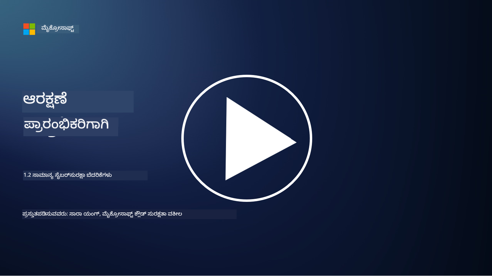

<!--
CO_OP_TRANSLATOR_METADATA:
{
  "original_hash": "6fc3030323139d7134a4ca9d03eccac9",
  "translation_date": "2025-12-19T13:33:21+00:00",
  "source_file": "1.2 Common cybersecurity threats.md",
  "language_code": "kn"
}
-->
# ಸಾಮಾನ್ಯ ಸೈಬರ್ ಸುರಕ್ಷತಾ ಬೆದರಿಕೆಗಳು

## ಪರಿಚಯ

ಈ ಪಾಠದಲ್ಲಿ ನಾವು ಈ ವಿಷಯಗಳನ್ನು ಒಳಗೊಂಡಿದ್ದೇವೆ:

- ಸೈಬರ್ ಸುರಕ್ಷತಾ ಬೆದರಿಕೆ ಎಂದರೇನು?

- ದುಷ್ಟ ವ್ಯಕ್ತಿಗಳು ಡೇಟಾ ಮತ್ತು ಐಟಿ ವ್ಯವಸ್ಥೆಗಳನ್ನು ಹಾನಿಗೊಳಿಸಲು ಏಕೆ ಬಯಸುತ್ತಾರೆ?

- ಸಾಮಾನ್ಯ ಸೈಬರ್ ಸುರಕ್ಷತಾ ಬೆದರಿಕೆಗಳ ಪ್ರಕಾರಗಳು ಯಾವುವು?

- MITRE ATT&CK ಫ್ರೇಮ್‌ವರ್ಕ್ ಎಂದರೇನು?

- ಸೈಬರ್ ಸುರಕ್ಷತಾ ಬೆದರಿಕೆಗಳ ಪರಿಸರವನ್ನು ನವೀಕರಿಸಲು ನಾನು ಎಲ್ಲಿ ಮಾಹಿತಿ ಪಡೆಯಬಹುದು?

## ಸೈಬರ್ ಸುರಕ್ಷತಾ ಬೆದರಿಕೆ ಎಂದರೇನು?

ಸೈಬರ್ ಸುರಕ್ಷತಾ ಬೆದರಿಕೆ ಎಂದರೆ ಡೇಟಾ ಅಥವಾ ಐಟಿ ವ್ಯವಸ್ಥೆಗಳ ಗೌಪ್ಯತೆ, ಅಖಂಡತೆ ಅಥವಾ ಲಭ್ಯತೆಯನ್ನು ಹಾನಿಗೊಳಿಸುವ ಸಾಧ್ಯತೆಯಿರುವ ಯಾವುದೇ ಅಪಾಯ ಅಥವಾ ಅಪಾಯವನ್ನು ಸೂಚಿಸುತ್ತದೆ. ಈ ಬೆದರಿಕೆಗಳನ್ನು ದುಷ್ಟ ವ್ಯಕ್ತಿಗಳು ಉಂಟುಮಾಡುತ್ತಾರೆ, ಅವರು ಅಕ್ರಮ ಪ್ರವೇಶ ಪಡೆಯಲು, ಸಂವೇದನಾಶೀಲ ಮಾಹಿತಿಯನ್ನು ಕದಿಯಲು, ಕಾರ್ಯಾಚರಣೆಗಳನ್ನು ಅಡಚಣೆಗೆ ಒಳಪಡಿಸಲು ಅಥವಾ ವ್ಯಕ್ತಿಗಳು, ಸಂಸ್ಥೆಗಳು ಅಥವಾ ದೇಶಗಳಿಗೆ ಹಾನಿ ಉಂಟುಮಾಡಲು ದುರ್ಬಲತೆಯನ್ನು ಬಳಸಲು ಪ್ರಯತ್ನಿಸುತ್ತಾರೆ. ಸೈಬರ್ ಸುರಕ್ಷತಾ ಬೆದರಿಕೆಗಳು ವಿವಿಧ ರೂಪಗಳನ್ನು ಹೊಂದಿರುತ್ತವೆ ಮತ್ತು ಡಿಜಿಟಲ್ ವ್ಯವಸ್ಥೆಗಳು ಮತ್ತು ಡೇಟಾದ ವಿವಿಧ ಅಂಶಗಳನ್ನು ಗುರಿಯಾಗಿಸುತ್ತವೆ.

## ದುಷ್ಟ ವ್ಯಕ್ತಿಗಳು ಡೇಟಾ ಮತ್ತು ಐಟಿ ವ್ಯವಸ್ಥೆಗಳನ್ನು ಹಾನಿಗೊಳಿಸಲು ಏಕೆ ಬಯಸುತ್ತಾರೆ?

ದುಷ್ಟ ವ್ಯಕ್ತಿಗಳು ವೈಯಕ್ತಿಕ ಲಾಭ, ತತ್ವಶಾಸ್ತ್ರೀಯ ಉದ್ದೇಶಗಳು ಅಥವಾ ಅಡಚಣೆ ಉಂಟುಮಾಡುವ ಇಚ್ಛೆಯಿಂದ ಡೇಟಾ ಮತ್ತು ಐಟಿ ವ್ಯವಸ್ಥೆಗಳನ್ನು ಹಾನಿಗೊಳಿಸುತ್ತಾರೆ. ಈ ಪ್ರೇರಣೆಗಳನ್ನು ಅರ್ಥಮಾಡಿಕೊಳ್ಳುವುದರಿಂದ ಸಂಸ್ಥೆಗಳು ಮತ್ತು ವ್ಯಕ್ತಿಗಳು ಸೈಬರ್ ಬೆದರಿಕೆಗಳ ವಿರುದ್ಧ ಉತ್ತಮವಾಗಿ ರಕ್ಷಿಸಿಕೊಳ್ಳಬಹುದು. ದುಷ್ಟ ವ್ಯಕ್ತಿಗಳು ಸೈಬರ್ ದಾಳೆಗಳಲ್ಲಿ ತೊಡಗಿಸಿಕೊಳ್ಳುವ ಕೆಲವು ಸಾಮಾನ್ಯ ಕಾರಣಗಳು:

1. **ಆರ್ಥಿಕ ಲಾಭ**: ಅನೇಕ ದಾಳೆಗಳು ಆರ್ಥಿಕ ಲಾಭಕ್ಕಾಗಿ ಪ್ರೇರಿತವಾಗಿರುತ್ತವೆ. ದುಷ್ಟ ವ್ಯಕ್ತಿಗಳು ಕ್ರೆಡಿಟ್ ಕಾರ್ಡ್ ಸಂಖ್ಯೆಗಳು, ಬ್ಯಾಂಕ್ ಖಾತೆ ವಿವರಗಳು ಅಥವಾ ವೈಯಕ್ತಿಕ ಗುರುತಿನ ಮಾಹಿತಿಯನ್ನು ಕದಿಯಬಹುದು, ಇದನ್ನು ವಂಚನೆ, ಗುರುತಿನ ಕಳ್ಳತನ, ರ್ಯಾನ್ಸಮ್ ಅಥವಾ ಡಾರ್ಕ್ ವೆಬ್‌ನಲ್ಲಿ ಮಾರಾಟ ಮಾಡಲು ಬಳಸಬಹುದು.

2. **ಗೂಢಚಾರಿಕೆ**: ರಾಷ್ಟ್ರಗಳು, ಸ್ಪರ್ಧಿಗಳು ಅಥವಾ ಇತರ ಸಂಸ್ಥೆಗಳು ರಾಜಕೀಯ, ಆರ್ಥಿಕ ಅಥವಾ ಸೈನಿಕ ಲಾಭಕ್ಕಾಗಿ ಸಂವೇದನಾಶೀಲ ಸರ್ಕಾರ, ಕಾರ್ಪೊರೇಟ್ ಅಥವಾ ಸಂಶೋಧನಾ ಡೇಟಾವನ್ನು ಕದಿಯಲು ಸೈಬರ್ ಗೂಢಚಾರಿಕೆಯಲ್ಲಿ ತೊಡಗಿಸಿಕೊಳ್ಳಬಹುದು.

3. **ಅಡಚಣೆ ಮತ್ತು ಧ್ವಂಸ**: ಕೆಲವು ದಾಳೆಗಳು ರಾಜಕೀಯ ಅಥವಾ ತತ್ವಶಾಸ್ತ್ರೀಯ ಕಾರಣಗಳಿಂದ ಪ್ರಮುಖ ಮೂಲಸೌಕರ್ಯ, ಸೇವೆಗಳು ಅಥವಾ ಕಾರ್ಯಾಚರಣೆಗಳನ್ನು ಅಡಚಣೆಗೆ ಒಳಪಡಿಸಲು ಉದ್ದೇಶಿಸುತ್ತವೆ. ಈ ದಾಳೆಗಳು ವ್ಯಾಪಕ ಗೊಂದಲ, ಆರ್ಥಿಕ ನಷ್ಟ ಮತ್ತು ಕೀರ್ತಿಗೆ ಹಾನಿ ಉಂಟುಮಾಡಬಹುದು.

4. **ತತ್ವಶಾಸ್ತ್ರೀಯ ಪ್ರೇರಣೆಗಳು**: ಹ್ಯಾಕ್ಟಿವಿಸ್ಟ್‌ಗಳು ಮತ್ತು ತತ್ವಶಾಸ್ತ್ರೀಯ ಅಥವಾ ರಾಜಕೀಯ ಪ್ರೇರಣೆ ಹೊಂದಿರುವ ಗುಂಪುಗಳು ನಿರ್ದಿಷ್ಟ ವಿಷಯಗಳ ಬಗ್ಗೆ ಜಾಗೃತಿ ಮೂಡಿಸಲು, ತಮ್ಮ ನಂಬಿಕೆಗಳನ್ನು ಪ್ರಚಾರ ಮಾಡಲು ಅಥವಾ ನಿರ್ದಿಷ್ಟ ಕ್ರಿಯೆಗಳು ಅಥವಾ ಸಂಸ್ಥೆಗಳ ವಿರುದ್ಧ ಪ್ರತಿಭಟಿಸಲು ವ್ಯವಸ್ಥೆಗಳನ್ನು ಹಾನಿಗೊಳಿಸಬಹುದು.

5. **ಅಜಾಗರೂಕ ಕ್ರಿಯೆಗಳು**: ಎಲ್ಲಾ ದುಷ್ಟ ಕ್ರಿಯೆಗಳು ಉದ್ದೇಶಿತವಾಗಿರುವುದಿಲ್ಲ; ಕೆಲವು ವ್ಯಕ್ತಿಗಳು ಸಾಮಾಜಿಕ ಇಂಜಿನಿಯರಿಂಗ್‌ಗೆ ಬಲಿಯಾಗುವುದರಿಂದ ಅಥವಾ ಹಾನಿಗೊಳಗಾದ ನೆಟ್‌ವರ್ಕ್‌ನ ಭಾಗವಾಗುವುದರಿಂದ ಸೈಬರ್ ಬೆದರಿಕೆಗಳಿಗೆ ಅಜಾಗರೂಕವಾಗಿ ಸಹಾಯ ಮಾಡಬಹುದು.

ಅಂತಿಮವಾಗಿ, ಡೇಟಾ ಮತ್ತು ಐಟಿ ವ್ಯವಸ್ಥೆಗಳನ್ನು ಹಾನಿಗೊಳಿಸುವ ಪ್ರೇರಣೆಗಳು ವ್ಯಾಪಕವಾಗಿರುತ್ತವೆ, ಮತ್ತು ಈ ದಾಳೆಗಳ ಪರಿಣಾಮಗಳು ಗಂಭೀರವಾಗಿರಬಹುದು. ವ್ಯಕ್ತಿಗಳು, ಸಂಸ್ಥೆಗಳು ಮತ್ತು ಸರ್ಕಾರಗಳು ಸೈಬರ್ ಸುರಕ್ಷತೆಯನ್ನು ಗಂಭೀರವಾಗಿ ಪರಿಗಣಿಸಿ, ಈ ಬೆದರಿಕೆಗಳ ವಿರುದ್ಧ ರಕ್ಷಣೆಗಾಗಿ ಕ್ರಮಗಳನ್ನು ಜಾರಿಗೆ ತರುವ ಅಗತ್ಯವಿದೆ.

## ಸಾಮಾನ್ಯ ಸೈಬರ್ ಸುರಕ್ಷತಾ ಬೆದರಿಕೆಗಳ ಪ್ರಕಾರಗಳು ಯಾವುವು?

ದುಷ್ಟ ವ್ಯಕ್ತಿಗಳು ವ್ಯವಸ್ಥೆಗಳನ್ನು ಹಾನಿಗೊಳಿಸಲು, ಡೇಟಾವನ್ನು ಕದಿಯಲು ಮತ್ತು ಅಡಚಣೆ ಉಂಟುಮಾಡಲು ಬಳಸುವ ಹಲವಾರು ಸಾಮಾನ್ಯ ಸೈಬರ್ ದಾಳೆಗಳ ಪ್ರಕಾರಗಳಿವೆ. ಈ ಪಾಠವನ್ನು ಬರೆಯುವ ಸಮಯದಲ್ಲಿ ಕೆಲವು ಪ್ರಮುಖ ಪ್ರಕಾರಗಳು:

1. **ಫಿಷಿಂಗ್**:

ಫಿಷಿಂಗ್ ಎಂದರೆ ನಂಬಿಸುವ ಇಮೇಲ್‌ಗಳು ಅಥವಾ ಸಂದೇಶಗಳನ್ನು ಕಳುಹಿಸುವುದು, ಇದು ಸ್ವೀಕರಿಸುವವರನ್ನು ಪಾಸ್ವರ್ಡ್‌ಗಳು, ಕ್ರೆಡಿಟ್ ಕಾರ್ಡ್ ಸಂಖ್ಯೆಗಳು ಅಥವಾ ವೈಯಕ್ತಿಕ ವಿವರಗಳನ್ನು ಬಹಿರಂಗಪಡಿಸಲು ಮೋಸಗೊಳಿಸುತ್ತದೆ. ಫಿಷಿಂಗ್ ದಾಳೆಗಳು ಹಾನಿಕಾರಕ ವೆಬ್‌ಸೈಟ್‌ಗಳಿಗೆ ಅಥವಾ ಮಾಲ್ವೇರ್ ಡೌನ್‌ಲೋಡ್ ಮಾಡಲು ಬಲವಂತಪಡಿಸಬಹುದು.

2. **ಮಾಲ್ವೇರ್**:

ಮಾಲ್ವೇರ್ (ಹಾನಿಕಾರಕ ಸಾಫ್ಟ್‌ವೇರ್) ವ್ಯವಸ್ಥೆಗಳನ್ನು ಹಾನಿಗೊಳಿಸಲು, ಡೇಟಾವನ್ನು ಕದಿಯಲು ಅಥವಾ ಹಾನಿ ಉಂಟುಮಾಡಲು ವಿನ್ಯಾಸಗೊಳಿಸಲಾದ ಹಾನಿಕಾರಕ ಪ್ರೋಗ್ರಾಮ್‌ಗಳ ಶ್ರೇಣಿಯನ್ನು ಒಳಗೊಂಡಿದೆ. ಮಾಲ್ವೇರ್‌ನ ಪ್ರಕಾರಗಳು:

- **ರ್ಯಾನ್ಸಮ್‌ವೇರ್**: ಫೈಲ್‌ಗಳನ್ನು ಎನ್‌ಕ್ರಿಪ್ಟ್ ಮಾಡುತ್ತದೆ ಮತ್ತು ಡಿಕ್ರಿಪ್ಷನ್‌ಗಾಗಿ ಹಣದ ಬೇಡಿಕೆ ಮಾಡುತ್ತದೆ.

- **ಟ್ರೋಜನ್‌ಗಳು**: ನಂಬಿಗಸ್ತ ಸಾಫ್ಟ್‌ವೇರ್‌ನಂತೆ ಕಾಣುತ್ತವೆ, ಆದರೆ ದುಷ್ಟ ಪ್ರವೇಶವನ್ನು ನೀಡುತ್ತವೆ.

- **ವೈರಸ್‌ಗಳು**: ಸ್ವಯಂ-ಪ್ರತಿಕೃತ ಪ್ರೋಗ್ರಾಮ್‌ಗಳು, ಫೈಲ್‌ಗಳಿಗೆ ಅಂಟಿಕೊಳ್ಳುತ್ತವೆ ಮತ್ತು ಹರಡುತ್ತವೆ.

- **ವಾರ್ಮ್‌ಗಳು**: ಸ್ವಯಂ-ಪ್ರತಿಕೃತ ಪ್ರೋಗ್ರಾಮ್‌ಗಳು, ನೆಟ್‌ವರ್ಕ್‌ಗಳ ಮೂಲಕ ಹರಡುತ್ತವೆ.

3. **ಡಿನೈಯಲ್ ಆಫ್ ಸರ್ವೀಸ್ (DoS) ಮತ್ತು ಡಿಸ್ಟ್ರಿಬ್ಯೂಟೆಡ್ ಡಿನೈಯಲ್ ಆಫ್ ಸರ್ವೀಸ್ (DDoS)**:

DoS ದಾಳೆಗಳು ಗುರಿ ವ್ಯವಸ್ಥೆಯನ್ನು ಓವರ್‌ಲೋಡ್ ಮಾಡುತ್ತವೆ, ಇದರಿಂದ ಬಳಕೆದಾರರಿಗೆ ಲಭ್ಯವಿಲ್ಲ. DDoS ದಾಳೆಗಳು ಸಂಚಾರದಿಂದ ಗುರಿಯನ್ನು ತುಂಬಲು ಹಾನಿಗೊಳಗಾದ ಸಾಧನಗಳ ನೆಟ್‌ವರ್ಕ್ ಅನ್ನು ಬಳಸುತ್ತವೆ, ಇದು ವ್ಯವಸ್ಥೆಯನ್ನು ಸರಿಯಾಗಿ ಕಾರ್ಯನಿರ್ವಹಿಸಲು ಕಷ್ಟಪಡಿಸುತ್ತದೆ ಅಥವಾ ಸಂಪೂರ್ಣವಾಗಿ ನಿಲ್ಲಿಸುತ್ತದೆ.

4. **SQL ಇಂಜೆಕ್ಷನ್**:

ಈ ದಾಳೆಯಲ್ಲಿ, ದಾಳಿಕೋರರು ವೆಬ್ ಅಪ್ಲಿಕೇಶನ್‌ನ ಇನ್‌ಪುಟ್ ಫೀಲ್ಡ್‌ಗಳನ್ನು ದುರುಪಯೋಗಪಡಿಸಿ ಹಾನಿಕಾರಕ SQL ಕ್ವೆರಿಗಳನ್ನು ಸೇರಿಸುತ್ತಾರೆ, ಇದರಿಂದ ಡೇಟಾಬೇಸ್‌ಗಳಿಗೆ ಮತ್ತು ಸಂವೇದನಾಶೀಲ ಡೇಟಾಗೆ ಅಕ್ರಮ ಪ್ರವೇಶ ಪಡೆಯಬಹುದು.

5. **ಕ್ರಾಸ್-ಸೈಟ್ ಸ್ಕ್ರಿಪ್ಟಿಂಗ್ (XSS)**:

ದಾಳಿಕೋರರು ವೆಬ್ ಅಪ್ಲಿಕೇಶನ್‌ಗಳಿಗೆ ಹಾನಿಕಾರಕ ಸ್ಕ್ರಿಪ್ಟ್‌ಗಳನ್ನು ಸೇರಿಸುತ್ತಾರೆ, ಅವು ಅನೇಕ ಬಳಕೆದಾರರ ಬ್ರೌಸರ್‌ಗಳಲ್ಲಿ ಕಾರ್ಯಗತಗೊಳ್ಳುತ್ತವೆ. ಇದು ಬಳಕೆದಾರರ ಡೇಟಾ ಕಳ್ಳತನ ಅಥವಾ ಮಾಲ್ವೇರ್ ಹರಡುವಿಕೆಗೆ ಕಾರಣವಾಗಬಹುದು.

6. **ಸೋಶಿಯಲ್ ಇಂಜಿನಿಯರಿಂಗ್**:

ಸೋಶಿಯಲ್ ಇಂಜಿನಿಯರಿಂಗ್ ಮಾನವ ಮನೋವಿಜ್ಞಾನವನ್ನು ದುರುಪಯೋಗಪಡಿಸಿ, ವ್ಯಕ್ತಿಗಳನ್ನು ರಹಸ್ಯ ಮಾಹಿತಿಯನ್ನು ಬಹಿರಂಗಪಡಿಸಲು ಅಥವಾ ಭದ್ರತೆಯನ್ನು ಹಾನಿಗೊಳಿಸುವ ಕ್ರಿಯೆಗಳನ್ನು ಮಾಡಲು ಪ್ರೇರೇಪಿಸುತ್ತದೆ.

7. **ಜಿರೋ-ಡೇ (0day) ಎಕ್ಸ್‌ಪ್ಲಾಯಿಟ್‌ಗಳು**:

ಈ ದಾಳೆಗಳು ಸಾಫ್ಟ್‌ವೇರ್ ಅಥವಾ ಹಾರ್ಡ್‌ವೇರ್‌ನಲ್ಲಿನ ದುರ್ಬಲತೆಯನ್ನು ಗುರಿಯಾಗಿಸುತ್ತವೆ, ಅವುಗಳನ್ನು ವಿತರಕರು ಅಥವಾ ಸಾರ್ವಜನಿಕರು ಇನ್ನೂ ಗುರುತಿಸಿಲ್ಲ. ಪ್ಯಾಚ್‌ಗಳನ್ನು ಅಭಿವೃದ್ಧಿಪಡಿಸುವ ಮೊದಲು ದಾಳಿಕೋರರು ಈ ದುರ್ಬಲತೆಯನ್ನು ಬಳಸುತ್ತಾರೆ. ಜಿರೋ-ಡೇ ದಾಳೆಗಳು ಅಪರೂಪವಾಗಿದ್ದರೂ, ಅವುಗಳು ಪ್ಯಾಚ್‌ಗಳಿಲ್ಲದ ಕಾರಣ ಸಂಸ್ಥೆಗಳಿಗೆ ಹೆಚ್ಚು ಆತಂಕವನ್ನು ಉಂಟುಮಾಡುತ್ತವೆ. ಜಿರೋ-ಡೇ ಕಂಡುಹಿಡಿಯಲ್ಪಟ್ಟ ನಂತರ, ಭದ್ರತಾ ಸಂಶೋಧಕರು ಶೀಘ್ರದಲ್ಲೇ ಪ್ಯಾಚ್ ಅಭಿವೃದ್ಧಿಪಡಿಸುತ್ತಾರೆ, ಆದ್ದರಿಂದ ಅವು ಸಾಮಾನ್ಯವಾಗಿ ಕಡಿಮೆ ಅವಧಿಯವಷ್ಟೇ ಇರುತ್ತವೆ.

8. **ಕ್ರೆಡೆನ್ಷಿಯಲ್ ದಾಳೆಗಳು**:

ಈ ದಾಳೆಗಳಲ್ಲಿ ಬ್ರೂಟ್ ಫೋರ್ಸ್ ದಾಳೆಗಳು ಸೇರಿವೆ, ಅಲ್ಲಿ ದಾಳಿಕೋರರು ಪಾಸ್ವರ್ಡ್‌ಗಳನ್ನು ಪುನಃ ಪುನಃ ಊಹಿಸುತ್ತಾರೆ, ಮತ್ತು ಕ್ರೆಡೆನ್ಷಿಯಲ್ ಸ್ಟಫಿಂಗ್ ದಾಳೆಗಳು, ಅಲ್ಲಿ ಒಂದು ಸೈಟ್‌ನಿಂದ ಕದಿಯಲಾದ ಕ್ರೆಡೆನ್ಷಿಯಲ್‌ಗಳನ್ನು ಇತರ ಸೈಟ್‌ಗಳಲ್ಲಿ ಪ್ರವೇಶಿಸಲು ಪ್ರಯತ್ನಿಸುತ್ತಾರೆ.

## MITRE ATT&CK ಫ್ರೇಮ್‌ವರ್ಕ್ ಎಂದರೇನು?

[MITRE ATT&CK ಫ್ರೇಮ್‌ವರ್ಕ್](https://attack.mitre.org/) (Adversarial Tactics, Techniques, and Common Knowledge) ಎಂಬುದು ದಾಳಿಕೋರರು ಸೈಬರ್ ದಾಳೆಗಳಲ್ಲಿ ಬಳಸುವ ತಂತ್ರಗಳು, ತಂತ್ರಗಳು ಮತ್ತು ವಿಧಾನಗಳನ್ನು ವರ್ಗೀಕರಿಸುವ ಮತ್ತು ವರ್ಗೀಕರಿಸುವ ಫ್ರೇಮ್‌ವರ್ಕ್ ಆಗಿದೆ. ಈ ಫ್ರೇಮ್‌ವರ್ಕ್ ಅನ್ನು MITRE ಕಾರ್ಪೊರೇಷನ್, ವಿವಿಧ ಸರ್ಕಾರಿ ಸಂಸ್ಥೆಗಳಿಗೆ ಸಂಶೋಧನೆ ಮತ್ತು ಅಭಿವೃದ್ಧಿ ಕೇಂದ್ರಗಳನ್ನು ನಿರ್ವಹಿಸುವ ಲಾಭರಹಿತ ಸಂಸ್ಥೆ, ರಚಿಸಿದೆ.

MITRE ATT&CK ಫ್ರೇಮ್‌ವರ್ಕ್ ಸೈಬರ್ ಬೆದರಿಕೆಗಳನ್ನು ವಿವರಿಸಲು ಮತ್ತು ವಿಶ್ಲೇಷಿಸಲು ಮಾನಕೀಕೃತ ಮಾರ್ಗವನ್ನು ಒದಗಿಸುತ್ತದೆ, ಇದರಿಂದ ಸೈಬರ್ ಸುರಕ್ಷತಾ ವೃತ್ತಿಪರರು ವಿವಿಧ ದಾಳಿಯ ತಂತ್ರಗಳನ್ನು ಉತ್ತಮವಾಗಿ ಅರ್ಥಮಾಡಿಕೊಳ್ಳಲು ಮತ್ತು ರಕ್ಷಿಸಲು ಸಾಧ್ಯವಾಗುತ್ತದೆ. ಇದು ಭದ್ರತಾ ತಂಡಗಳು, ಬೆದರಿಕೆ ಹಂಟರ್‌ಗಳು ಮತ್ತು ಘಟನೆ ಪ್ರತಿಕ್ರಿಯಾಕಾರರು ಬಳಸುವ ಪ್ರಮುಖ ಸಂಪತ್ತಾಗಿದೆ:

1. **ವೈರೋಧಿ ವರ್ತನೆ ಅರ್ಥಮಾಡಿಕೊಳ್ಳಿ**: ಫ್ರೇಮ್‌ವರ್ಕ್ ನೈಜ-ಜಗತ್ತಿನ ದಾಳಿಯ ವರ್ತನೆಗಳನ್ನು ದಾಖಲಿಸುತ್ತದೆ, ದಾಳಿಕೋರರು ಪ್ರಾರಂಭಿಕ ಪ್ರವೇಶದಿಂದ ತಮ್ಮ ಉದ್ದೇಶಗಳನ್ನು ಸಾಧಿಸುವವರೆಗೆ ತೆಗೆದುಕೊಳ್ಳುವ ಹಂತಗಳನ್ನು ವಿವರಿಸುತ್ತದೆ. ಇದು ವಿವಿಧ ಬೆದರಿಕೆ ಗುಂಪುಗಳು ಬಳಸುವ ದಾಳಿಯ ತಂತ್ರಗಳನ್ನು ವ್ಯಾಪಕವಾಗಿ ಒಳಗೊಂಡಿದೆ.

2. **ರಕ್ಷಣಾ ತಂತ್ರಗಳನ್ನು ಯೋಜಿಸಿ ಮತ್ತು ಜಾರಿಗೆ ತರುವುದು**: ಭದ್ರತಾ ತಂಡಗಳು ಫ್ರೇಮ್‌ವರ್ಕ್ ಅನ್ನು ಬಳಸಿಕೊಂಡು ದಾಳಿಕೋರರು ಬಳಸಬಹುದಾದ ನಿರ್ದಿಷ್ಟ ತಂತ್ರಗಳಿಗೆ ಹೊಂದಾಣಿಕೆಯ ಪ್ರೊ-ಆಕ್ಟಿವ್ ರಕ್ಷಣಾ ತಂತ್ರಗಳನ್ನು ಅಭಿವೃದ್ಧಿಪಡಿಸಬಹುದು.

3. **ಘಟನೆ ಪ್ರತಿಕ್ರಿಯೆ ಮತ್ತು ಬೆದರಿಕೆ ಹಂಟಿಂಗ್**: ಘಟನೆಗಳನ್ನು ತನಿಖೆ ಮಾಡುವಾಗ ಅಥವಾ ಬೆದರಿಕೆ ಹಂಟಿಂಗ್ ನಡೆಸುವಾಗ, ಭದ್ರತಾ ವೃತ್ತಿಪರರು ಫ್ರೇಮ್‌ವರ್ಕ್ ಅನ್ನು ಉಲ್ಲೇಖಿಸಿ ದಾಳಿಕೋರರು ಬಳಸಿದ ನಿರ್ದಿಷ್ಟ ತಂತ್ರಗಳನ್ನು ಗುರುತಿಸಲು ಮತ್ತು ತಡೆಗಟ್ಟಲು ಸಾಧ್ಯ.

MITRE ATT&CK ಫ್ರೇಮ್‌ವರ್ಕ್ ವಿಂಡೋಸ್, ಮ್ಯಾಕ್‌ಒಎಸ್, ಲಿನಕ್ಸ್ ಮತ್ತು ಕ್ಲೌಡ್ ಸೇವೆಗಳಂತಹ ನಿರ್ದಿಷ್ಟ ವೇದಿಕೆಗಳು ಮತ್ತು ಪರಿಸರಗಳ ಆಧಾರದ ಮೇಲೆ ದಾಳಿಯ ತಂತ್ರಗಳನ್ನು ಗುಂಪುಮಾಡುವ ಮೆಟ್ರಿಕ್ಸ್‌ಗಳಲ್ಲಿ ಸಂಘಟಿತವಾಗಿದೆ. ಪ್ರತಿ ಮೆಟ್ರಿಕ್ಸ್ ಅನ್ನು ತಂತ್ರಗಳು (ಉದ್ದೇಶಗಳು) ಮತ್ತು ತಂತ್ರಗಳು (ಆ ಉದ್ದೇಶಗಳನ್ನು ಸಾಧಿಸಲು ಬಳಸುವ ನಿರ್ದಿಷ್ಟ ವಿಧಾನಗಳು) ಎಂದು ವಿಭಜಿಸಲಾಗಿದೆ. ಪ್ರತಿ ತಂತ್ರಕ್ಕಾಗಿ, ಫ್ರೇಮ್‌ವರ್ಕ್ ಅದು ಹೇಗೆ ಕಾರ್ಯನಿರ್ವಹಿಸುತ್ತದೆ, ಸಾಧ್ಯವಾದ ತಡೆಗಟ್ಟುವಿಕೆಗಳು ಮತ್ತು ಆ ತಂತ್ರವನ್ನು ಬಳಸಿದ ನೈಜ-ಜಗತ್ತಿನ ಬೆದರಿಕೆ ನಟರ ಸಂಬಂಧಿತ ಉಲ್ಲೇಖಗಳ ಬಗ್ಗೆ ಮಾಹಿತಿಯನ್ನು ಒದಗಿಸುತ್ತದೆ.

ಸೈಬರ್ ಸುರಕ್ಷತಾ ಪರಿಸರವು ಅಭಿವೃದ್ಧಿ ಹೊಂದಿದಂತೆ ಹೊಸ ಬೆದರಿಕೆ ಗುಪ್ತಚರವನ್ನು ಸಂಗ್ರಹಿಸುವಂತೆ ಫ್ರೇಮ್‌ವರ್ಕ್ ನಿರಂತರವಾಗಿ ನವೀಕರಿಸಲಾಗುತ್ತದೆ ಮತ್ತು ವಿಸ್ತರಿಸಲಾಗುತ್ತದೆ. ದಾಳಿಕೋರರು ಹೇಗೆ ಕಾರ್ಯನಿರ್ವಹಿಸುತ್ತಾರೆ ಮತ್ತು ಅವರ ತಂತ್ರಗಳ ವಿರುದ್ಧ ರಕ್ಷಣೆ ಹೇಗೆ ಮಾಡಬೇಕು ಎಂಬುದರ ಬಗ್ಗೆ ಆಳವಾದ ಅರ್ಥವನ್ನು ಸೈಬರ್ ಸುರಕ್ಷತಾ ಸ್ಥಿತಿಯನ್ನು ಹೆಚ್ಚಿಸಲು ಇದು ಅಮೂಲ್ಯ ಸಂಪತ್ತಾಗಿದೆ.

## ಸೈಬರ್ ಸುರಕ್ಷತಾ ಬೆದರಿಕೆಗಳ ಪರಿಸರವನ್ನು ನವೀಕರಿಸಲು ನಾನು ಎಲ್ಲಿ ಮಾಹಿತಿ ಪಡೆಯಬಹುದು?

ಸೈಬರ್ ಸುರಕ್ಷತಾ ಬೆದರಿಕೆಗಳ ಬಗ್ಗೆ ನವೀಕರಿಸಲು ಬಳಸಬಹುದಾದ ಅನೇಕ ಮೂಲಗಳಿವೆ, ಇಲ್ಲಿವೆ ಕೆಲವು ಆಯ್ಕೆಗಳು:

- [ಓಪನ್ ವೆಬ್ ಅಪ್ಲಿಕೇಶನ್ ಸೆಕ್ಯುರಿಟಿ ಪ್ರಾಜೆಕ್ಟ್ (OWASP) ಟಾಪ್ 10 ದುರ್ಬಲತೆಗಳು](https://owasp.org/Top10/)
- [ಕಾಮನ್ ವಲ್ನರಬಿಲಿಟೀಸ್ ಅಂಡ್ ಎಕ್ಸ್‌ಪೋಶರ್‌ಗಳು (CVEs)](https://www.bing.com/ck/a?!&&p=53df6007f017bca2JmltdHM9MTY5MjU3NjAwMCZpZ3VpZD0zYmY4N2RiYS1jYWI1LTYwMDgtMWY1YS02ZmYyY2JjNjYxZWUmaW5zaWQ9NTc2OQ&ptn=3&hsh=3&fclid=3bf87dba-cab5-6008-1f5a-6ff2cbc661ee&psq=cve&u=a1aHR0cHM6Ly9iaW5nLmNvbS9hbGluay9saW5rP3VybD1odHRwcyUzYSUyZiUyZmN2ZS5taXRyZS5vcmclMmYmc291cmNlPXNlcnAtcnImaD1BZXN4S0VBWTNnbGhNZEFpd3daMlNSZkZQNTlrODhIUnYxRUtlSkY1RTk0JTNkJnA9a2NvZmZjaWFsd2Vic2l0ZQ&ntb=1 "ಕಾಮನ್ ವಲ್ನರಬಿಲಿಟೀಸ್ ಅಂಡ್ ಎಕ್ಸ್‌ಪೋಶರ್‌ಗಳು")
- [ಮೈಕ್ರೋಸಾಫ್ಟ್ ಸೆಕ್ಯುರಿಟಿ ರೆಸ್ಪಾನ್ಸ್ ಸೆಂಟರ್ ಬ್ಲಾಗ್‌ಗಳು](https://msrc.microsoft.com/blog/)
- [ನ್ಯಾಷನಲ್ ಇನ್‌ಸ್ಟಿಟ್ಯೂಟ್ ಆಫ್ ಸ್ಟ್ಯಾಂಡರ್ಡ್ಸ್ ಅಂಡ್ ಟೆಕ್ನಾಲಜಿ (NIST)](https://www.dhs.gov/topics/cybersecurity): NIST ಸಂಪತ್ತುಗಳು, ಎಚ್ಚರಿಕೆಗಳು ಮತ್ತು ಸೈಬರ್ ಸುರಕ್ಷತಾ ಬೆದರಿಕೆಗಳ ಬಗ್ಗೆ ತಾಜಾ ಮಾಹಿತಿಯನ್ನು ಒದಗಿಸುತ್ತದೆ.
- [ಸೈಬರ್ ಸುರಕ್ಷತಾ ಮತ್ತು ಮೂಲಸೌಕರ್ಯ ಸುರಕ್ಷತಾ ಏಜೆನ್ಸಿ (CISA)](https://www.cisa.gov/resources-tools/resources/free-cybersecurity-services-and-tools): CISA ವ್ಯಾಪಾರಗಳು, ಸರ್ಕಾರಿ ಸಂಸ್ಥೆಗಳು ಮತ್ತು ಇತರ ಸಂಸ್ಥೆಗಳಿಗೆ ಸೈಬರ್ ಸುರಕ್ಷತಾ ಸಂಪತ್ತುಗಳು ಮತ್ತು ಉತ್ತಮ ಅಭ್ಯಾಸಗಳನ್ನು ಒದಗಿಸುತ್ತದೆ. CISA ಸಮುದಾಯದ ಮೇಲೆ ಪರಿಣಾಮ ಬೀರುವ ಉನ್ನತ-ಪ್ರಭಾವದ ಭದ್ರತಾ ಚಟುವಟಿಕೆಗಳ ಬಗ್ಗೆ ನವೀಕರಿತ ಮಾಹಿತಿಯನ್ನು ಹಂಚಿಕೊಳ್ಳುತ್ತದೆ ಮತ್ತು ಹೊಸ ಮತ್ತು ಅಭಿವೃದ್ಧಿಯಲ್ಲಿರುವ ಸೈಬರ್ ಬೆದರಿಕೆಗಳ ಆಳವಾದ ವಿಶ್ಲೇಷಣೆಯನ್ನು ಒದಗಿಸುತ್ತದೆ.
- [ನ್ಯಾಷನಲ್ ಸೈಬರ್‌ಸುರಕ್ಷತಾ ಸೆಂಟರ್ ಆಫ್ ಎಕ್ಸಲೆನ್ಸ್ (NCCoE)](https://www.dhs.gov/topics/cybersecurity): NCCoE ನೈಜ-ಜಗತ್ತಿನ ಪರಿಸ್ಥಿತಿಗಳಲ್ಲಿ ಅನ್ವಯಿಸಬಹುದಾದ ಪ್ರಾಯೋಗಿಕ ಸೈಬರ್ ಸುರಕ್ಷತಾ ಪರಿಹಾರಗಳನ್ನು ಒದಗಿಸುವ ಕೇಂದ್ರವಾಗಿದೆ.
- [US-CERT](https://www.cisa.gov/resources-tools/resources/free-cybersecurity-services-and-tools): ಯುನೈಟೆಡ್ ಸ್ಟೇಟ್ಸ್ ಕಂಪ್ಯೂಟರ್ ಎಮರ್ಜೆನ್ಸಿ ರೆಡಿನೆಸ್ ಟೀಮ್ (US-CERT) ಎಚ್ಚರಿಕೆಗಳು, ಸಲಹೆಗಳು ಮತ್ತು ಇನ್ನಷ್ಟು ಸೇರಿದಂತೆ ವಿವಿಧ ಸೈಬರ್ ಸುರಕ್ಷತಾ ಸಂಪತ್ತುಗಳನ್ನು ಒದಗಿಸುತ್ತದೆ.
- ನಿಮ್ಮ ದೇಶದ ಸೈಬರ್ ಎಮರ್ಜೆನ್ಸಿ ರೆಸ್ಪಾನ್ಸ್ ಟೀಮ್ (CERT)

---

<!-- CO-OP TRANSLATOR DISCLAIMER START -->
**ಅಸಮೀಕ್ಷೆ**:  
ಈ ದಸ್ತಾವೇಜನ್ನು AI ಅನುವಾದ ಸೇವೆ [Co-op Translator](https://github.com/Azure/co-op-translator) ಬಳಸಿ ಅನುವಾದಿಸಲಾಗಿದೆ. ನಾವು ನಿಖರತೆಯನ್ನು ಸಾಧಿಸಲು ಪ್ರಯತ್ನಿಸುತ್ತಿದ್ದರೂ, ದಯವಿಟ್ಟು ಗಮನಿಸಿ, ಸ್ವಯಂಚಾಲಿತ ಅನುವಾದಗಳಲ್ಲಿ ದೋಷಗಳು ಅಥವಾ ಅಸಮರ್ಪಕತೆಗಳು ಇರಬಹುದು. ಮೂಲ ಭಾಷೆಯಲ್ಲಿರುವ ಮೂಲ ದಸ್ತಾವೇಜನ್ನು ಪ್ರಾಮಾಣಿಕ ಮೂಲವೆಂದು ಪರಿಗಣಿಸಬೇಕು. ಪ್ರಮುಖ ಮಾಹಿತಿಗಾಗಿ, ವೃತ್ತಿಪರ ಮಾನವ ಅನುವಾದವನ್ನು ಶಿಫಾರಸು ಮಾಡಲಾಗುತ್ತದೆ. ಈ ಅನುವಾದದ ಬಳಕೆಯಿಂದ ಉಂಟಾಗುವ ಯಾವುದೇ ತಪ್ಪುಅರ್ಥಗಳು ಅಥವಾ ತಪ್ಪುಅರ್ಥೈಸುವಿಕೆಗಳಿಗೆ ನಾವು ಹೊಣೆಗಾರರಲ್ಲ.
<!-- CO-OP TRANSLATOR DISCLAIMER END -->