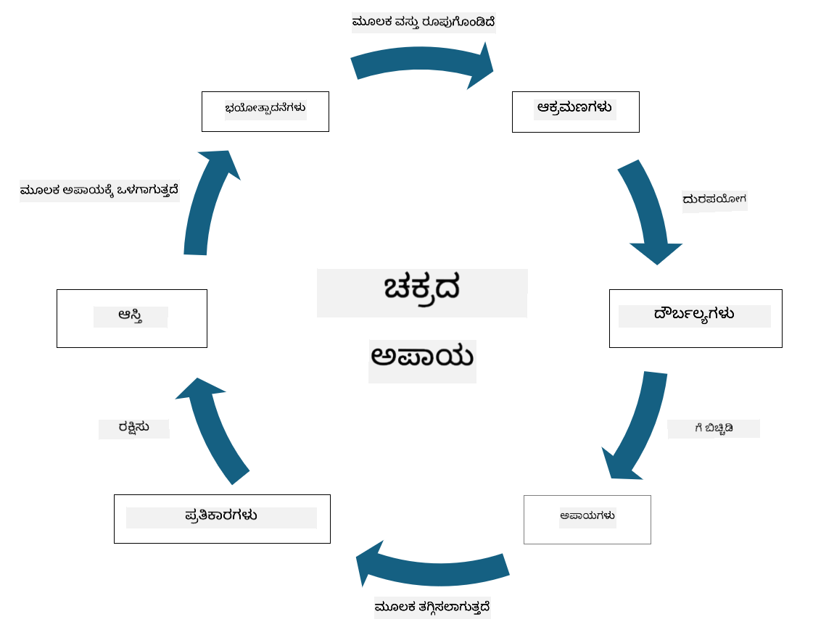

<!--
CO_OP_TRANSLATOR_METADATA:
{
  "original_hash": "fcca304f072cabf206388199e8e2e578",
  "translation_date": "2025-12-19T13:19:31+00:00",
  "source_file": "1.3 Understanding risk management.md",
  "language_code": "kn"
}
-->
# ಅಪಾಯ ನಿರ್ವಹಣೆಯನ್ನು ಅರ್ಥಮಾಡಿಕೊಳ್ಳುವುದು

## ಪರಿಚಯ

ಈ ಪಾಠದಲ್ಲಿ ನಾವು ಕವರ್ ಮಾಡುತ್ತೇವೆ:

 - ಸಾಮಾನ್ಯವಾಗಿ ಬಳಸುವ ಭದ್ರತಾ ಪದಗಳ ವ್ಯಾಖ್ಯಾನಗಳು
   
 - ಭದ್ರತಾ ನಿಯಂತ್ರಣಗಳ ಪ್ರಕಾರಗಳು

 - ಭದ್ರತಾ ಅಪಾಯಗಳನ್ನು ಅಂದಾಜಿಸುವುದು

## ಸಾಮಾನ್ಯವಾಗಿ ಬಳಸುವ ಭದ್ರತಾ ಪದಗಳ ವ್ಯಾಖ್ಯಾನಗಳು

ಈ ಪದಗಳು ಸೈಬರ್ ಭದ್ರತೆ ಮತ್ತು ಅಪಾಯ ನಿರ್ವಹಣೆಯ ಕ್ಷೇತ್ರದಲ್ಲಿ ಮೂಲಭೂತ ಪರಿಕಲ್ಪನೆಗಳಾಗಿವೆ. ಪ್ರತಿಯೊಂದು ಪದವನ್ನು ಮತ್ತು ಅವು ಪರಸ್ಪರ ಹೇಗೆ ಸಂಬಂಧಿಸುತ್ತವೆ ಎಂಬುದನ್ನು ವಿವರಿಸೋಣ:

1. **ಅಪಾಯ ಏಜೆಂಟ್**:

ಅಪಾಯ ಏಜೆಂಟ್ ಎಂದರೆ ವ್ಯಕ್ತಿ, ಗುಂಪು, ಸಂಸ್ಥೆ ಅಥವಾ ಸ್ವಯಂಚಾಲಿತ ವ್ಯವಸ್ಥೆ, ಇದು ವ್ಯವಸ್ಥೆ ಅಥವಾ ಜಾಲದ ದೌರ್ಬಲ್ಯಗಳನ್ನು ದುರುಪಯೋಗಪಡಿಸಿಕೊಳ್ಳಲು ಮತ್ತು ಹಾನಿ ಅಥವಾ ನಷ್ಟವನ್ನು ಉಂಟುಮಾಡಲು ಸಾಮರ್ಥ್ಯ ಹೊಂದಿರುತ್ತದೆ. ಅಪಾಯ ಏಜೆಂಟ್‌ಗಳು ಹ್ಯಾಕರ್‌ಗಳು, ಮಾಲ್ವೇರ್ ರಚನೆಗಾರರು, ಅಸಮಾಧಾನಿತ ಉದ್ಯೋಗಿಗಳು ಅಥವಾ ಮಾಹಿತಿ ಮತ್ತು ತಂತ್ರಜ್ಞಾನ ವ್ಯವಸ್ಥೆಗಳಿಗೆ ಅಪಾಯವನ್ನು ಉಂಟುಮಾಡುವ ಯಾವುದೇ ಘಟಕವಾಗಿರಬಹುದು.

2. **ಅಪಾಯ**:

ಅಪಾಯ ಎಂದರೆ ಒಂದು ಸಂಭವನೀಯ ಘಟನೆ ಅಥವಾ ಕ್ರಿಯೆ, ಇದು ವ್ಯವಸ್ಥೆಯ ದೌರ್ಬಲ್ಯಗಳನ್ನು ದುರುಪಯೋಗಪಡಿಸಿಕೊಳ್ಳಲು ಮತ್ತು ಆಸ್ತಿ ಮೇಲೆ ಹಾನಿ ಉಂಟುಮಾಡಲು ಸಾಧ್ಯವಾಗುತ್ತದೆ. ಹ್ಯಾಕಿಂಗ್, ಡೇಟಾ ಉಲ್ಲಂಘನೆಗಳು, ಡಿನೈಯಲ್-ಆಫ್-ಸರ್ವೀಸ್ ದಾಳಿಗಳು ಮತ್ತು ಇನ್ನಷ್ಟು ಕ್ರಿಯೆಗಳು ಅಪಾಯಗಳಾಗಿರಬಹುದು. ಅಪಾಯಗಳು ಸಂಸ್ಥೆಯ ಆಸ್ತಿಗಳ ಮೇಲೆ ಹಾನಿ ಉಂಟುಮಾಡುವ ಸಾಧ್ಯತೆಯ "ಏನು" ಆಗಿವೆ.

3. **ದೌರ್ಬಲ್ಯ**:

ದೌರ್ಬಲ್ಯ ಎಂದರೆ ವ್ಯವಸ್ಥೆಯ ವಿನ್ಯಾಸ, ಅನುಷ್ಠಾನ ಅಥವಾ ಸಂರಚನೆಯಲ್ಲಿನ ದೌರ್ಬಲ್ಯ ಅಥವಾ ದೋಷ, ಇದನ್ನು ಅಪಾಯ ಏಜೆಂಟ್ ದುರುಪಯೋಗಪಡಿಸಿಕೊಳ್ಳಬಹುದು. ದೌರ್ಬಲ್ಯಗಳು ಸಾಫ್ಟ್‌ವೇರ್, ಹಾರ್ಡ್‌ವೇರ್, ಪ್ರಕ್ರಿಯೆಗಳು ಅಥವಾ ಮಾನವೀಯ ವರ್ತನೆಗಳಲ್ಲಿ ಇರಬಹುದು. ದೌರ್ಬಲ್ಯಗಳನ್ನು ಗುರುತಿಸುವುದು ಮತ್ತು ಪರಿಹರಿಸುವುದು ಯಶಸ್ವಿ ದಾಳಿಗಳನ್ನು ಕಡಿಮೆ ಮಾಡಲು ಅಗತ್ಯವಾಗಿದೆ.

4. **ಅಪಾಯ**:

ಅಪಾಯ ಎಂದರೆ ಅಪಾಯ ಮತ್ತು ದೌರ್ಬಲ್ಯಗಳ ನಡುವಿನ ಪರಸ್ಪರ ಕ್ರಿಯೆಯಿಂದ ಉಂಟಾಗುವ ನಷ್ಟ, ಹಾನಿ ಅಥವಾ ಹಾನಿಯ ಸಾಧ್ಯತೆ. ಇದು ಅಪಾಯ ಏಜೆಂಟ್ ದೌರ್ಬಲ್ಯವನ್ನು ದುರುಪಯೋಗಪಡಿಸಿ ನಕಾರಾತ್ಮಕ ಪರಿಣಾಮವನ್ನು ಉಂಟುಮಾಡುವ ಸಾಧ್ಯತೆಯಾಗಿದೆ. ಅಪಾಯಗಳನ್ನು ಸಾಮಾನ್ಯವಾಗಿ ಅವುಗಳ ಸಾಧ್ಯತೆಯ ಪ್ರಭಾವ ಮತ್ತು ಸಂಭವನೀಯತೆಯ ಆಧಾರದ ಮೇಲೆ ಅಂದಾಜಿಸಲಾಗುತ್ತದೆ.

5. **ಆಸ್ತಿ**:

ಆಸ್ತಿ ಎಂದರೆ ಸಂಸ್ಥೆ ರಕ್ಷಿಸಲು ಬಯಸುವ ಯಾವುದೇ ಮೌಲ್ಯಯುತ ವಸ್ತು. ಆಸ್ತಿಗಳಲ್ಲಿ ಭೌತಿಕ ವಸ್ತುಗಳು (ಕಂಪ್ಯೂಟರ್‌ಗಳು ಮತ್ತು ಸರ್ವರ್‌ಗಳು), ಡೇಟಾ (ಗ್ರಾಹಕರ ಮಾಹಿತಿ, ಹಣಕಾಸು ದಾಖಲೆಗಳು), ಬೌದ್ಧಿಕ ಆಸ್ತಿ (ವ್ಯಾಪಾರ ರಹಸ್ಯಗಳು, ಪೇಟೆಂಟ್‌ಗಳು) ಮತ್ತು ಮಾನವ ಸಂಪತ್ತು (ಉದ್ಯೋಗಿಗಳ ಕೌಶಲ್ಯ ಮತ್ತು ಜ್ಞಾನ) ಸೇರಿರಬಹುದು. ಆಸ್ತಿಗಳನ್ನು ರಕ್ಷಿಸುವುದು ಸೈಬರ್ ಭದ್ರತೆಯ ಪ್ರಮುಖ ಗುರಿಯಾಗಿದೆ.

6. **ಎಕ್ಸ್‌ಪೋಶರ್**:

ಎಕ್ಸ್‌ಪೋಶರ್ ಎಂದರೆ ಸಂಭವನೀಯ ಅಪಾಯಗಳಿಗೆ ದೌರ್ಬಲ್ಯವಾಗಿರುವ ಸ್ಥಿತಿ. ಇದು ದೌರ್ಬಲ್ಯವಿರುವಾಗ ಸಂಭವಿಸುತ್ತದೆ, ಇದನ್ನು ಅಪಾಯ ಏಜೆಂಟ್ ದುರುಪಯೋಗಪಡಿಸಿಕೊಳ್ಳಬಹುದು. ಎಕ್ಸ್‌ಪೋಶರ್ ವ್ಯವಸ್ಥೆ ಅಥವಾ ಜಾಲದಲ್ಲಿ ದೌರ್ಬಲ್ಯಗಳಿರುವುದರಿಂದ ಉಂಟಾಗುವ ಅಪಾಯವನ್ನು ಹೈಲೈಟ್ ಮಾಡುತ್ತದೆ.

7. **ನಿಯಂತ್ರಣ**:

ನಿಯಂತ್ರಣ ಎಂದರೆ ದೌರ್ಬಲ್ಯಗಳು ಮತ್ತು ಅಪಾಯಗಳೊಂದಿಗೆ ಸಂಬಂಧಿಸಿದ ಅಪಾಯವನ್ನು ಕಡಿಮೆ ಮಾಡಲು ಜಾರಿಗೆ ತರಲಾದ ಕ್ರಮ. ನಿಯಂತ್ರಣಗಳು ತಾಂತ್ರಿಕ, ಪ್ರಕ್ರಿಯಾತ್ಮಕ ಅಥವಾ ಆಡಳಿತಾತ್ಮಕ ಸ್ವರೂಪದಲ್ಲಿರಬಹುದು. ಅವುಗಳು ಸಂಭವನೀಯ ಅಪಾಯಗಳು ಮತ್ತು ದೌರ್ಬಲ್ಯಗಳನ್ನು ತಡೆಯಲು, ಪತ್ತೆಹಚ್ಚಲು ಅಥವಾ ಶಮನಗೊಳಿಸಲು ವಿನ್ಯಾಸಗೊಳಿಸಲಾಗಿದೆ. ಉದಾಹರಣೆಗಳಿಗೆ ಫೈರ್‌ವಾಲ್‌ಗಳು, ಪ್ರವೇಶ ನಿಯಂತ್ರಣಗಳು, ಎನ್‌ಕ್ರಿಪ್ಷನ್, ಭದ್ರತಾ ನೀತಿಗಳು ಮತ್ತು ಉದ್ಯೋಗಿ ತರಬೇತಿ ಸೇರಿವೆ.

ಈ ಪದಗಳ ನಡುವಿನ ಸಂಬಂಧವನ್ನು ಸಂಕ್ಷಿಪ್ತವಾಗಿ ಹೇಳುವುದಾದರೆ: ಅಪಾಯ ಏಜೆಂಟ್‌ಗಳು ದೌರ್ಬಲ್ಯಗಳನ್ನು ದುರುಪಯೋಗಪಡಿಸಿ ಅಪಾಯಗಳನ್ನು ಉಂಟುಮಾಡುತ್ತವೆ, ಇದು ಮೌಲ್ಯಯುತ ಆಸ್ತಿಗಳಿಗೆ ಹಾನಿ ಉಂಟುಮಾಡುವ ಅಪಾಯವನ್ನು ಹೊಂದಿರುತ್ತದೆ. ದೌರ್ಬಲ್ಯಗಳು ಇದ್ದಾಗ ಎಕ್ಸ್‌ಪೋಶರ್ ಸಂಭವಿಸುತ್ತದೆ, ಮತ್ತು ನಿಯಂತ್ರಣಗಳನ್ನು ಅಪಾಯವನ್ನು ಕಡಿಮೆ ಮಾಡಲು ಅಥವಾ ಆಸ್ತಿಗಳ ಮೇಲೆ ಅಪಾಯಗಳ ಪರಿಣಾಮವನ್ನು ತಡೆಯಲು ಜಾರಿಗೆ ತರಲಾಗುತ್ತದೆ. ಈ ಚೌಕಟ್ಟು ಸೈಬರ್ ಭದ್ರತಾ ಅಪಾಯ ನಿರ್ವಹಣೆಯ ಆಧಾರವನ್ನು ರೂಪಿಸುತ್ತದೆ, ಸಂಸ್ಥೆಗಳಿಗೆ ಅವರ ಮಾಹಿತಿ ವ್ಯವಸ್ಥೆಗಳು ಮತ್ತು ಆಸ್ತಿಗಳಿಗೆ ಸಂಭವನೀಯ ಅಪಾಯಗಳನ್ನು ಗುರುತಿಸಲು, ಅಂದಾಜಿಸಲು ಮತ್ತು ಪರಿಹರಿಸಲು ಮಾರ್ಗದರ್ಶನ ನೀಡುತ್ತದೆ.

## ಭದ್ರತಾ ನಿಯಂತ್ರಣಗಳ ಪ್ರಕಾರಗಳು

ಭದ್ರತಾ ನಿಯಂತ್ರಣಗಳು ವಿವಿಧ ಅಪಾಯಗಳು ಮತ್ತು ದೌರ್ಬಲ್ಯಗಳಿಂದ ಮಾಹಿತಿ ವ್ಯವಸ್ಥೆಗಳು ಮತ್ತು ಆಸ್ತಿಗಳನ್ನು ರಕ್ಷಿಸಲು ಜಾರಿಗೆ ತರಲಾದ ಕ್ರಮಗಳು ಅಥವಾ ರಕ್ಷಣೆಗಳಾಗಿವೆ. ಅವುಗಳನ್ನು ಅವುಗಳ ಕೇಂದ್ರೀಕರಣ ಮತ್ತು ಉದ್ದೇಶದ ಆಧಾರದ ಮೇಲೆ ಹಲವು ವರ್ಗಗಳಲ್ಲಿ ವಿಂಗಡಿಸಬಹುದು. ಇಲ್ಲಿವೆ ಸಾಮಾನ್ಯ ಭದ್ರತಾ ನಿಯಂತ್ರಣಗಳ ಕೆಲವು ಪ್ರಕಾರಗಳು:

1. **ಆಡಳಿತಾತ್ಮಕ ನಿಯಂತ್ರಣಗಳು**:

ಈ ನಿಯಂತ್ರಣಗಳು ಸಂಸ್ಥೆಯ ಭದ್ರತಾ ಅಭ್ಯಾಸಗಳು ಮತ್ತು ಬಳಕೆದಾರರ ವರ್ತನೆಯನ್ನು ನಿಯಂತ್ರಿಸುವ ನೀತಿಗಳು, ಪ್ರಕ್ರಿಯೆಗಳು ಮತ್ತು ಮಾರ್ಗಸೂಚಿಗಳೊಂದಿಗೆ ಸಂಬಂಧಿತವಾಗಿವೆ.

- ಭದ್ರತಾ ನೀತಿಗಳು ಮತ್ತು ಪ್ರಕ್ರಿಯೆಗಳು: ಸಂಸ್ಥೆಯೊಳಗೆ ಭದ್ರತೆಯನ್ನು ಹೇಗೆ ನಿರ್ವಹಿಸಲಾಗುತ್ತದೆ ಎಂಬುದನ್ನು ವ್ಯಾಖ್ಯಾನಿಸುವ ದಾಖಲೆ ಮಾರ್ಗಸೂಚಿಗಳು.

- ಭದ್ರತಾ ಜಾಗೃತಿ ಮತ್ತು ತರಬೇತಿ: ಉದ್ಯೋಗಿಗಳಿಗೆ ಭದ್ರತಾ ಉತ್ತಮ ಅಭ್ಯಾಸಗಳು ಮತ್ತು ಸಂಭವನೀಯ ಅಪಾಯಗಳ ಬಗ್ಗೆ ಶಿಕ್ಷಣ ನೀಡುವ ಕಾರ್ಯಕ್ರಮಗಳು.

- ಘಟನೆ ಪ್ರತಿಕ್ರಿಯೆ ಮತ್ತು ನಿರ್ವಹಣೆ: ಭದ್ರತಾ ಘಟನೆಗಳಿಗೆ ಪ್ರತಿಕ್ರಿಯಿಸಲು ಮತ್ತು ಶಮನಗೊಳಿಸಲು ಯೋಜನೆಗಳು.

2. **ತಾಂತ್ರಿಕ ನಿಯಂತ್ರಣಗಳು**:

ತಾಂತ್ರಿಕ ನಿಯಂತ್ರಣಗಳು ಭದ್ರತಾ ಕ್ರಮಗಳನ್ನು ಜಾರಿಗೆ ತರಲು ಮತ್ತು ವ್ಯವಸ್ಥೆಗಳು ಮತ್ತು ಡೇಟಾವನ್ನು ರಕ್ಷಿಸಲು ತಂತ್ರಜ್ಞಾನವನ್ನು ಬಳಸುವಲ್ಲಿ ತೊಡಗಿವೆ. ತಾಂತ್ರಿಕ ನಿಯಂತ್ರಣಗಳ ಉದಾಹರಣೆಗಳು:

- ಪ್ರವೇಶ ನಿಯಂತ್ರಣಗಳು: ಬಳಕೆದಾರರ ಪಾತ್ರಗಳು ಮತ್ತು ಅನುಮತಿಗಳ ಆಧಾರದ ಮೇಲೆ ಸಂಪತ್ತಿಗೆ ಪ್ರವೇಶವನ್ನು ನಿರ್ಬಂಧಿಸುವ ಕ್ರಮಗಳು.

- ಎನ್‌ಕ್ರಿಪ್ಷನ್: ಡೇಟಾವನ್ನು ಅಸುರಕ್ಷಿತ ಪ್ರವೇಶವನ್ನು ತಡೆಯಲು ಸುರಕ್ಷಿತ ಸ್ವರೂಪಕ್ಕೆ ಪರಿವರ್ತಿಸುವುದು.

- ಫೈರ್‌ವಾಲ್‌ಗಳು: ಒಳಬರುವ ಮತ್ತು ಹೊರಹೋಗುವ ಸಂಚಾರವನ್ನು ಫಿಲ್ಟರ್ ಮಾಡುವ ಮತ್ತು ನಿಯಂತ್ರಿಸುವ ಜಾಲ ಭದ್ರತಾ ಸಾಧನಗಳು.

- ಆಕ್ರಮಣ ಪತ್ತೆ ಮತ್ತು ತಡೆ ವ್ಯವಸ್ಥೆಗಳು (IDPS): ಸಂಶಯಾಸ್ಪದ ಚಟುವಟಿಕೆಗಾಗಿ ಜಾಲ ಸಂಚಾರವನ್ನು ಮೇಲ್ವಿಚಾರಣೆ ಮಾಡುವ ಸಾಧನಗಳು.

- ಆಂಟಿವೈರಸ್ ಮತ್ತು ಆಂಟಿ-ಮಾಲ್ವೇರ್ ಸಾಫ್ಟ್‌ವೇರ್: ದುಷ್ಟ ಸಾಫ್ಟ್‌ವೇರ್ ಅನ್ನು ಪತ್ತೆಹಚ್ಚಿ ತೆಗೆದುಹಾಕುವ ಕಾರ್ಯಕ್ರಮಗಳು.

- ದೃಢೀಕರಣ ಯಂತ್ರಗಳು: ಬಳಕೆದಾರರ ಗುರುತನ್ನು ಪರಿಶೀಲಿಸಲು ಪಾಸ್ವರ್ಡ್‌ಗಳು, ಬಯೋಮೆಟ್ರಿಕ್ಸ್ ಮತ್ತು ಬಹು-ಘಟಕ ದೃಢೀಕರಣದಂತಹ ವಿಧಾನಗಳು.

- ಪ್ಯಾಚ್ ನಿರ್ವಹಣೆ: ತಿಳಿದಿರುವ ದೌರ್ಬಲ್ಯಗಳನ್ನು ಪರಿಹರಿಸಲು ಸಾಫ್ಟ್‌ವೇರ್ ಅನ್ನು ನಿಯಮಿತವಾಗಿ ನವೀಕರಿಸುವುದು.

3. **ಭೌತಿಕ ನಿಯಂತ್ರಣಗಳು**:

ಭೌತಿಕ ನಿಯಂತ್ರಣಗಳು ಭೌತಿಕ ಆಸ್ತಿಗಳು ಮತ್ತು ಸೌಲಭ್ಯಗಳನ್ನು ರಕ್ಷಿಸಲು ಕ್ರಮಗಳಾಗಿವೆ.

- ಭದ್ರತಾ ಗಾರ್ಡ್‌ಗಳು ಮತ್ತು ಪ್ರವೇಶ ನಿಯಂತ್ರಣ ಸಿಬ್ಬಂದಿ: ಭೌತಿಕ ಆವರಣಗಳಿಗೆ ಪ್ರವೇಶವನ್ನು ಮೇಲ್ವಿಚಾರಣೆ ಮಾಡುವ ಮತ್ತು ನಿಯಂತ್ರಿಸುವ ಸಿಬ್ಬಂದಿ.

- ಸರ್ವೇಲ್ಯಾನ್ಸ್ ಕ್ಯಾಮೆರಾಗಳು: ಚಟುವಟಿಕೆಗಳನ್ನು ಮೇಲ್ವಿಚಾರಣೆ ಮಾಡಲು ಮತ್ತು ದಾಖಲು ಮಾಡಲು ವೀಡಿಯೊ ಮೇಲ್ವಿಚಾರಣೆ ವ್ಯವಸ್ಥೆಗಳು.

- ತಾಳೆಗಳು ಮತ್ತು ಭೌತಿಕ ಅಡ್ಡಿಗಳು: ಸಂವೇದನಾಶೀಲ ಪ್ರದೇಶಗಳಿಗೆ ಪ್ರವೇಶವನ್ನು ನಿರ್ಬಂಧಿಸಲು ಭೌತಿಕ ಕ್ರಮಗಳು.

- ಪರಿಸರ ನಿಯಂತ್ರಣಗಳು: ಉಪಕರಣಗಳು ಮತ್ತು ಡೇಟಾ ಕೇಂದ್ರಗಳಿಗೆ ಪರಿಣಾಮ ಬೀರುವ ತಾಪಮಾನ, ತೇವಾಂಶ ಮತ್ತು ಇತರ ಪರಿಸರೀಯ ಅಂಶಗಳನ್ನು ನಿಯಂತ್ರಿಸಲು ಕ್ರಮಗಳು.

4. **ಆಪರೇಷನಲ್ ನಿಯಂತ್ರಣಗಳು**:

ಈ ನಿಯಂತ್ರಣಗಳು ದಿನನಿತ್ಯದ ಕಾರ್ಯಾಚರಣೆಗಳು ಮತ್ತು ವ್ಯವಸ್ಥೆಗಳ ನಿರಂತರ ಭದ್ರತೆಯನ್ನು ಖಚಿತಪಡಿಸಿಕೊಳ್ಳುವ ಚಟುವಟಿಕೆಗಳಿಗೆ ಸಂಬಂಧಿಸಿದವು.

- ಬದಲಾವಣೆ ನಿರ್ವಹಣೆ: ವ್ಯವಸ್ಥೆಗಳು ಮತ್ತು ಸಂರಚನೆಗಳಿಗೆ ಬದಲಾವಣೆಗಳನ್ನು ಟ್ರ್ಯಾಕ್ ಮಾಡಲು ಮತ್ತು ಅನುಮೋದಿಸಲು ಪ್ರಕ್ರಿಯೆಗಳು.

- ಬ್ಯಾಕಪ್ ಮತ್ತು ವಿಪತ್ತು ಪುನಃಪ್ರಾಪ್ತಿ: ವ್ಯವಸ್ಥೆ ವೈಫಲ್ಯಗಳು ಅಥವಾ ವಿಪತ್ತುಗಳ ಸಂದರ್ಭದಲ್ಲಿ ಡೇಟಾ ಬ್ಯಾಕಪ್ ಮತ್ತು ಪುನಃಪ್ರಾಪ್ತಿಗಾಗಿ ಯೋಜನೆಗಳು.

- ಲಾಗಿಂಗ್ ಮತ್ತು ಆಡಿಟಿಂಗ್: ಭದ್ರತೆ ಮತ್ತು ಅನುಕೂಲತೆ ಉದ್ದೇಶಗಳಿಗಾಗಿ ವ್ಯವಸ್ಥೆಯ ಚಟುವಟಿಕೆಗಳನ್ನು ಮೇಲ್ವಿಚಾರಣೆ ಮತ್ತು ದಾಖಲು ಮಾಡುವುದು.

- ಸುರಕ್ಷಿತ ಕೋಡಿಂಗ್ ಅಭ್ಯಾಸಗಳು: ದೌರ್ಬಲ್ಯಗಳನ್ನು ಕಡಿಮೆ ಮಾಡಲು ಸಾಫ್ಟ್‌ವೇರ್ ಬರೆಯುವ ಮಾರ್ಗಸೂಚಿಗಳು.

5. **ಕಾನೂನು ಮತ್ತು ನಿಯಂತ್ರಣ ನಿಯಂತ್ರಣಗಳು**:

ಈ ನಿಯಂತ್ರಣಗಳು ಸಂಬಂಧಿತ ಕಾನೂನುಗಳು, ನಿಯಮಗಳು ಮತ್ತು ಉದ್ಯಮದ ಮಾನದಂಡಗಳಿಗೆ ಅನುಸಾರತೆಯನ್ನು ಖಚಿತಪಡಿಸುತ್ತವೆ. ಸಂಸ್ಥೆ ಅನುಸರಿಸಬೇಕಾದ ಮಾನದಂಡಗಳು ನ್ಯಾಯವ್ಯವಸ್ಥೆ, ಉದ್ಯಮ ಕ್ಷೇತ್ರ ಮತ್ತು ಇತರ ಅಂಶಗಳ ಮೇಲೆ ಅವಲಂಬಿತವಾಗಿರುತ್ತವೆ.

- ಡೇಟಾ ರಕ್ಷಣೆ ನಿಯಮಗಳು: GDPR, HIPAA, ಮತ್ತು CCPA ಮುಂತಾದ ಕಾನೂನುಗಳಿಗೆ ಅನುಸಾರತೆ.

- ಉದ್ಯಮ-ನಿರ್ದಿಷ್ಟ ಮಾನದಂಡಗಳು: ಪಾವತಿ ಕಾರ್ಡ್ ಡೇಟಾ ಭದ್ರತೆಯಿಗಾಗಿ PCI DSS ಮುಂತಾದ ಮಾನದಂಡಗಳಿಗೆ ಅನುಸಾರತೆ.

ಈ ಭದ್ರತಾ ನಿಯಂತ್ರಣಗಳ ವರ್ಗಗಳು ಸಂಸ್ಥೆಗಳಿಗೆ ಸಮಗ್ರ ಭದ್ರತಾ ಸ್ಥಿತಿಯನ್ನು ರಚಿಸಲು ಸಹಾಯ ಮಾಡುತ್ತವೆ, ಅವರ ವ್ಯವಸ್ಥೆಗಳು, ಡೇಟಾ ಮತ್ತು ಆಸ್ತಿಗಳನ್ನು ವಿವಿಧ ಅಪಾಯಗಳಿಂದ ರಕ್ಷಿಸುತ್ತವೆ.

## ಭದ್ರತಾ ಅಪಾಯಗಳನ್ನು ಅಂದಾಜಿಸುವುದು

ಕೆಲವು ಭದ್ರತಾ ವೃತ್ತಿಪರರು ಅಪಾಯ ನಿರ್ವಹಣೆಯನ್ನು ಅಪಾಯ ವೃತ್ತಿಪರರಿಗೆ ಬಿಟ್ಟುಕೊಡುತ್ತಾರೆ ಎಂದು ಭಾವಿಸುತ್ತಾರೆ, ಆದರೆ ಭದ್ರತಾ ಅಪಾಯವನ್ನು ನಿರ್ವಹಿಸುವ ಪ್ರಕ್ರಿಯೆಯನ್ನು ಅರ್ಥಮಾಡಿಕೊಳ್ಳುವುದು ಯಾವುದೇ ಭದ್ರತಾ ವೃತ್ತಿಪರರಿಗೆ ಮುಖ್ಯವಾಗಿದೆ, ಏಕೆಂದರೆ ಇದು ಭದ್ರತಾ ಅಪಾಯವನ್ನು ಸಂಸ್ಥೆಯ ಉಳಿದ ಭಾಗವು ಅರ್ಥಮಾಡಿಕೊಳ್ಳಲು ಮತ್ತು ಕ್ರಮ ಕೈಗೊಳ್ಳಲು ಸಾಧ್ಯವಾಗುವ ಭಾಷೆಯಲ್ಲಿ ವ್ಯಕ್ತಪಡಿಸಲು ಸಹಾಯ ಮಾಡುತ್ತದೆ.

ಸಂಸ್ಥೆಗಳು ಭದ್ರತಾ ಅಪಾಯಗಳನ್ನು ನಿರಂತರವಾಗಿ ಅಂದಾಜಿಸಬೇಕು ಮತ್ತು ವ್ಯವಹಾರಕ್ಕೆ ಅಪಾಯಗಳ ವಿರುದ್ಧ ಯಾವ ಕ್ರಮವನ್ನು (ಅಥವಾ ಕ್ರಮವಿಲ್ಲದೆ) ತೆಗೆದುಕೊಳ್ಳಬೇಕೆಂದು ನಿರ್ಧರಿಸಬೇಕು. ಕೆಳಗಿನವು ಸಾಮಾನ್ಯವಾಗಿ ಇದು ಹೇಗೆ ಮಾಡಲಾಗುತ್ತದೆ ಎಂಬುದರ ಅವಲೋಕನವಾಗಿದೆ. ಈ ಪ್ರಕ್ರಿಯೆಯನ್ನು ಸಾಮಾನ್ಯವಾಗಿ ಸಂಸ್ಥೆಯ ವಿವಿಧ ತಂಡಗಳಲ್ಲಿ ನಡೆಸಲಾಗುತ್ತದೆ, ಒಂದು ತಂಡವು ಅಪಾಯದ ಸಂಪೂರ್ಣ ನಿರ್ವಹಣೆಗೆ ಹೊಣೆಗಾರರಾಗಿರುವುದು ಅಪರೂಪ.

1. **ಆಸ್ತಿಗಳು ಮತ್ತು ಅಪಾಯಗಳನ್ನು ಗುರುತಿಸುವುದು**:

ಸಂಸ್ಥೆ ರಕ್ಷಿಸಲು ಬಯಸುವ ಆಸ್ತಿಗಳನ್ನು ಗುರುತಿಸುತ್ತದೆ. ಇದರಲ್ಲಿ ಡೇಟಾ, ವ್ಯವಸ್ಥೆಗಳು, ಹಾರ್ಡ್‌ವೇರ್, ಸಾಫ್ಟ್‌ವೇರ್, ಬೌದ್ಧಿಕ ಆಸ್ತಿ ಮತ್ತು ಇನ್ನಷ್ಟು ಸೇರಿರಬಹುದು. ನಂತರ, ಈ ಆಸ್ತಿಗಳನ್ನು ಗುರಿಯಾಗಿಸಬಹುದಾದ ಸಂಭವನೀಯ ಅಪಾಯಗಳನ್ನು ಗುರುತಿಸುತ್ತವೆ.

2. **ದೌರ್ಬಲ್ಯಗಳನ್ನು ಅಂದಾಜಿಸುವುದು**:

ಸಂಸ್ಥೆಗಳು ನಂತರ ದೌರ್ಬಲ್ಯಗಳನ್ನು ಅಥವಾ ಪ್ರಕ್ರಿಯೆಗಳಲ್ಲಿ ಅಥವಾ ವ್ಯವಸ್ಥೆಗಳಲ್ಲಿ ಇರುವ ದೌರ್ಬಲ್ಯಗಳನ್ನು ಗುರುತಿಸುತ್ತವೆ, ಇದನ್ನು ಅಪಾಯಗಳು ದುರುಪಯೋಗಪಡಿಸಿಕೊಳ್ಳಬಹುದು. ಈ ದೌರ್ಬಲ್ಯಗಳು ಸಾಫ್ಟ್‌ವೇರ್ ದೋಷಗಳು, ತಪ್ಪಾದ ಸಂರಚನೆಗಳು, ಭದ್ರತಾ ನಿಯಂತ್ರಣಗಳ ಕೊರತೆ ಮತ್ತು ಮಾನವೀಯ ದೋಷಗಳಿಂದ ಉಂಟಾಗಬಹುದು.

3. **ಸಂಭವನೀಯತೆಯ ಅಂದಾಜು**:

ಸಂಸ್ಥೆ ನಂತರ ಪ್ರತಿ ಅಪಾಯ ಸಂಭವಿಸುವ ಸಾಧ್ಯತೆಯನ್ನು ಅಂದಾಜಿಸುತ್ತದೆ. ಇದರಲ್ಲಿ ಐತಿಹಾಸಿಕ ಡೇಟಾ, ಅಪಾಯ ಬುದ್ಧಿವಂತಿಕೆ, ಉದ್ಯಮದ ಪ್ರವೃತ್ತಿಗಳು ಮತ್ತು ಆಂತರಿಕ ಅಂಶಗಳನ್ನು ಪರಿಗಣಿಸುವುದು ಒಳಗೊಂಡಿದೆ. ಸಂಭವನೀಯತೆಯನ್ನು ಕಡಿಮೆ, ಮಧ್ಯಮ ಅಥವಾ ಹೆಚ್ಚಿನದಾಗಿ ವರ್ಗೀಕರಿಸಬಹುದು.

4. **ಪ್ರಭಾವದ ಅಂದಾಜು**:

ನಂತರ, ಪ್ರತಿ ಅಪಾಯವು ದೌರ್ಬಲ್ಯವನ್ನು ದುರುಪಯೋಗಪಡಿಸಿದರೆ ಉಂಟಾಗುವ ಸಾಧ್ಯತೆಯ ಪ್ರಭಾವವನ್ನು ಸಂಸ್ಥೆ ನಿರ್ಧರಿಸುತ್ತದೆ. ಪ್ರಭಾವದಲ್ಲಿ ಹಣಕಾಸು ನಷ್ಟ, ಕಾರ್ಯಾಚರಣಾ ವ್ಯತ್ಯಯಗಳು, ಕೀರ್ತಿಗೆ ಹಾನಿ, ಕಾನೂನು ಪರಿಣಾಮಗಳು ಮತ್ತು ಇನ್ನಷ್ಟು ಸೇರಿರಬಹುದು. ಪ್ರಭಾವವನ್ನು ಕಡಿಮೆ, ಮಧ್ಯಮ ಅಥವಾ ಹೆಚ್ಚಿನದಾಗಿ ವರ್ಗೀಕರಿಸಬಹುದು.

5. **ಅಪಾಯ ಲೆಕ್ಕಾಚಾರ**:

ಸಂಭವನೀಯತೆ ಮತ್ತು ಪ್ರಭಾವದ ಅಂದಾಜುಗಳನ್ನು ಸಂಯೋಜಿಸಿ ಪ್ರತಿ ಗುರುತಿಸಲಾದ ಅಪಾಯದ ಒಟ್ಟು ಅಪಾಯ ಮಟ್ಟವನ್ನು ಲೆಕ್ಕಹಾಕಲಾಗುತ್ತದೆ. ಇದು ಸಾಮಾನ್ಯವಾಗಿ ಅಪಾಯ ಮ್ಯಾಟ್ರಿಕ್ಸ್ ಅನ್ನು ಬಳಸಿಕೊಂಡು ಮಾಡಲಾಗುತ್ತದೆ, ಇದು ಸಂಭವನೀಯತೆ ಮತ್ತು ಪ್ರಭಾವ ಮಟ್ಟಗಳಿಗೆ ಸಂಖ್ಯಾತ್ಮಕ ಮೌಲ್ಯಗಳನ್ನು ಅಥವಾ ಗುಣಾತ್ಮಕ ವಿವರಣೆಗಳನ್ನು ನಿಯೋಜಿಸುತ್ತದೆ. ಫಲಿತಾಂಶದ ಅಪಾಯ ಮಟ್ಟವು ತಕ್ಷಣದ ಗಮನವನ್ನು ಅಗತ್ಯವಿರುವ ಅಪಾಯಗಳನ್ನು ಆದ್ಯತೆಯಾಗಿ ಗುರುತಿಸಲು ಸಹಾಯ ಮಾಡುತ್ತದೆ.

6. **ಆದ್ಯತೆಯ ಮತ್ತು ನಿರ್ಧಾರ-ಮೇಕಿಂಗ್**:

ಸಂಸ್ಥೆ ನಂತರ ಅತ್ಯಂತ ಹೆಚ್ಚಿನ ಸಂಭವನೀಯತೆ ಮತ್ತು ಪ್ರಭಾವ ಮೌಲ್ಯಗಳನ್ನು ಹೊಂದಿರುವ ಅಪಾಯಗಳಿಗೆ ಗಮನಹರಿಸುವ ಮೂಲಕ ಅಪಾಯಗಳನ್ನು ಆದ್ಯತೆಯಾಗಿ ಗುರುತಿಸುತ್ತದೆ. ಇದು ಸಂಪತ್ತನ್ನು ಹಂಚಿಕೆ ಮಾಡಲು ಮತ್ತು ನಿಯಂತ್ರಣಗಳನ್ನು ಪರಿಣಾಮಕಾರಿಯಾಗಿ ಜಾರಿಗೆ ತರಲು ಅವರಿಗೆ ಅನುಮತಿಸುತ್ತದೆ. ಹೆಚ್ಚಿನ ಅಪಾಯಗಳು ತಕ್ಷಣದ ಗಮನವನ್ನು ಅಗತ್ಯವಿರುತ್ತದೆ, ಆದರೆ ಕಡಿಮೆ ಅಪಾಯಗಳನ್ನು ದೀರ್ಘಾವಧಿಯ ಅವಧಿಯಲ್ಲಿ ಪರಿಹರಿಸಬಹುದು.

7. **ಅಪಾಯ ಚಿಕಿತ್ಸೆ**:

ಅಪಾಯ ಅಂದಾಜಿನ ಆಧಾರದ ಮೇಲೆ, ಸಂಸ್ಥೆ ಪ್ರತಿ ಅಪಾಯವನ್ನು ಶಮನಗೊಳಿಸಲು ಅಥವಾ ನಿರ್ವಹಿಸಲು ಹೇಗೆ ನಿರ್ಧರಿಸುತ್ತದೆ. ಇದರಲ್ಲಿ ಭದ್ರತಾ ನಿಯಂತ್ರಣಗಳನ್ನು ಜಾರಿಗೆ ತರುವುದು, ವಿಮೆಯ ಮೂಲಕ ಅಪಾಯವನ್ನು ವರ್ಗಾವಣೆ ಮಾಡುವುದು ಅಥವಾ ನಿರ್ವಹಿಸಬಹುದಾದ/ಅತಿಯಾಗಿ ವೆಚ್ಚದಾಯಕವಾಗಿರುವ ಇತ್ಯಾದಿ ಉಳಿದ ಅಪಾಯ ಮಟ್ಟಗಳನ್ನು ಸ್ವೀಕರಿಸುವುದು ಸೇರಿರಬಹುದು.

8. **ನಿರಂತರ ಮೇಲ್ವಿಚಾರಣೆ ಮತ್ತು ವಿಮರ್ಶೆ**:

ಅಪಾಯ ಅಂದಾಜು ಒಂದು ಬಾರಿ ನಡೆಯುವ ಪ್ರಕ್ರಿಯೆಯಲ್ಲ. ಇದು ನಿಯಮಿತವಾಗಿ ಅಥವಾ ಸಂಸ್ಥೆಯ ಪರಿಸರದಲ್ಲಿ ಪ್ರಮುಖ ಬದಲಾವಣೆಗಳಾಗುವಾಗ ನಡೆಸಬೇಕು. ನಿರಂತರ ಮೇಲ್ವಿಚಾರಣೆ ಹೊಸ ಅಪಾಯಗಳು, ದೌರ್ಬಲ್ಯಗಳು ಅಥವಾ ವ್ಯವಹಾರ ಪರಿಸರದಲ್ಲಿ ಬದಲಾವಣೆಗಳನ್ನು ಪರಿಗಣಿಸುತ್ತದೆ.

ಈ ರಚನೆಯ ಪ್ರಕಾರ ಭದ್ರತಾ ಅಪಾಯಗಳನ್ನು ಅಂದಾಜಿಸುವ ಮೂಲಕ, ಸಂಸ್ಥೆಗಳು ಸಂಪತ್ತಿನ ಹಂಚಿಕೆ, ಭದ್ರತಾ ನಿಯಂತ್ರಣಗಳು ಮತ್ತು ಒಟ್ಟಾರೆ ಅಪಾಯ ನಿರ್ವಹಣಾ ತಂತ್ರಗಳ ಬಗ್ಗೆ ತಿಳಿದ ನಿರ್ಧಾರಗಳನ್ನು ತೆಗೆದುಕೊಳ್ಳಬಹುದು. ಉದ್ದೇಶವು ಸಂಸ್ಥೆಯ ಒಟ್ಟಾರೆ ಅಪಾಯ ಎಕ್ಸ್‌ಪೋಶರ್ ಅನ್ನು ಕಡಿಮೆ ಮಾಡುವುದು ಮತ್ತು ಭದ್ರತಾ ಪ್ರಯತ್ನಗಳನ್ನು ಸಂಸ್ಥೆಯ ವ್ಯವಹಾರ ಗುರಿಗಳು ಮತ್ತು ಉದ್ದೇಶಗಳಿಗೆ ಹೊಂದಾಣಿಕೆ ಮಾಡುವುದು.

---

<!-- CO-OP TRANSLATOR DISCLAIMER START -->
**ಅಸ್ವೀಕಾರ**:  
ಈ ದಾಖಲೆ AI ಅನುವಾದ ಸೇವೆ [Co-op Translator](https://github.com/Azure/co-op-translator) ಬಳಸಿ ಅನುವಾದಿಸಲಾಗಿದೆ. ನಾವು ನಿಖರತೆಯನ್ನು ಸಾಧಿಸಲು ಪ್ರಯತ್ನಿಸುತ್ತಿದ್ದರೂ, ದಯವಿಟ್ಟು ಗಮನಿಸಿ, ಸ್ವಯಂಚಾಲಿತ ಅನುವಾದಗಳಲ್ಲಿ ದೋಷಗಳು ಅಥವಾ ಅಸಮರ್ಪಕತೆಗಳು ಇರಬಹುದು. ಮೂಲ ಭಾಷೆಯಲ್ಲಿರುವ ಮೂಲ ದಾಖಲೆ ಪ್ರಾಮಾಣಿಕ ಮೂಲವಾಗಿ ಪರಿಗಣಿಸಬೇಕು. ಮಹತ್ವದ ಮಾಹಿತಿಗಾಗಿ, ವೃತ್ತಿಪರ ಮಾನವ ಅನುವಾದವನ್ನು ಶಿಫಾರಸು ಮಾಡಲಾಗುತ್ತದೆ. ಈ ಅನುವಾದದ ಬಳಕೆಯಿಂದ ಉಂಟಾಗುವ ಯಾವುದೇ ತಪ್ಪುಅರ್ಥಗಳು ಅಥವಾ ತಪ್ಪುಅರ್ಥೈಸುವಿಕೆಗೆ ನಾವು ಹೊಣೆಗಾರರಲ್ಲ.
<!-- CO-OP TRANSLATOR DISCLAIMER END -->