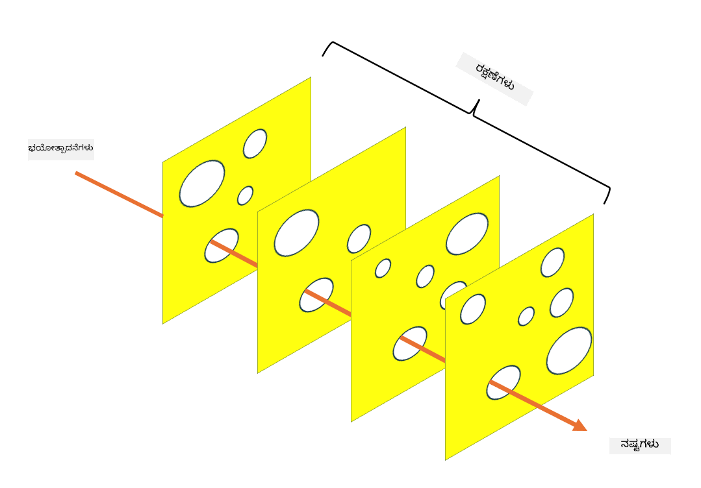

<!--
CO_OP_TRANSLATOR_METADATA:
{
  "original_hash": "75f77f972d2233c584f87c1eb96c983b",
  "translation_date": "2025-12-19T13:09:24+00:00",
  "source_file": "1.5 Zero trust.md",
  "language_code": "kn"
}
-->
# ಶೂನ್ಯ ನಂಬಿಕೆ

“ಶೂನ್ಯ ನಂಬಿಕೆ” ಎಂಬ ಪದವನ್ನು ಇತ್ತೀಚಿನ ದಿನಗಳಲ್ಲಿ ಭದ್ರತಾ ವಲಯಗಳಲ್ಲಿ ಬಹಳವಾಗಿ ಬಳಸಲಾಗುತ್ತಿದೆ. ಆದರೆ ಇದರ ಅರ್ಥವೇನು, ಇದು ಕೇವಲ ಒಂದು ಬಜ್‌ವರ್ಡ್ ಮಾತ್ರವೇ? ಈ ಪಾಠದಲ್ಲಿ, ಶೂನ್ಯ ನಂಬಿಕೆ ಎಂದರೇನು ಎಂಬುದನ್ನು ನಾವು ಆಳವಾಗಿ ತಿಳಿದುಕೊಳ್ಳೋಣ.

## ಪರಿಚಯ

 - ಈ ಪಾಠದಲ್ಲಿ ನಾವು ಈ ವಿಷಯಗಳನ್ನು ಆವರಿಸುತ್ತೇವೆ:
   
   
 - ಶೂನ್ಯ ನಂಬಿಕೆ ಎಂದರೇನು?

   
  

 - ಶೂನ್ಯ ನಂಬಿಕೆ ಹೇಗೆ ಪರಂಪರागत ಭದ್ರತಾ ಆರ್ಕಿಟೆಕ್ಚರ್‌ಗಳಿಂದ ಭಿನ್ನವಾಗಿದೆ?

   
   

 - ಆಳವಾದ ರಕ್ಷಣಾ ತತ್ವ (Defense in Depth) ಎಂದರೇನು?

## ಶೂನ್ಯ ನಂಬಿಕೆ

ಶೂನ್ಯ ನಂಬಿಕೆ ಎಂಬುದು "ನಂಬಿಕೆ ಮತ್ತು ಪರಿಶೀಲನೆ" ಎಂಬ ಪರಂಪರागत ತತ್ವವನ್ನು ಪ್ರಶ್ನಿಸುವ ಸೈಬರ್‌ಸಿಕ್ಯೂರಿಟಿ ವಿಧಾನವಾಗಿದೆ. ಇದು ಸಂಸ್ಥೆಯ ಜಾಲದ ಒಳಗೋ ಹೊರಗೋ ಇರುವ ಯಾವುದೇ ಘಟಕವನ್ನು ಸ್ವಾಭಾವಿಕವಾಗಿ ನಂಬಬಾರದು ಎಂದು ಪರಿಗಣಿಸುತ್ತದೆ. ಬದಲಿಗೆ, ಶೂನ್ಯ ನಂಬಿಕೆ ಪ್ರತಿಯೊಂದು ಬಳಕೆದಾರ, ಸಾಧನ, ಮತ್ತು ಅಪ್ಲಿಕೇಶನ್‌ಗಳನ್ನು, ಅವುಗಳ ಸ್ಥಳವನ್ನು ಲೆಕ್ಕಹಾಕದೆ, ಸಂಪತ್ತಿಗೆ ಪ್ರವೇಶಿಸಲು ಪ್ರಯತ್ನಿಸುವಾಗ ಪರಿಶೀಲಿಸಲು ಒತ್ತಾಯಿಸುತ್ತದೆ. ಶೂನ್ಯ ನಂಬಿಕೆಯ ಮುಖ್ಯ ತತ್ವವು "ಆಕ್ರಮಣದ ಮೇಲ್ಮೈ" ಅನ್ನು ಕಡಿಮೆ ಮಾಡುವುದು ಮತ್ತು ಭದ್ರತಾ ಉಲ್ಲಂಘನೆಗಳ ಪರಿಣಾಮವನ್ನು ತಗ್ಗಿಸುವುದು.

ಶೂನ್ಯ ನಂಬಿಕೆ ಮಾದರಿಯಲ್ಲಿ ಈ ಕೆಳಗಿನ ತತ್ವಗಳಿಗೆ ಪ್ರಾಮುಖ್ಯತೆ ನೀಡಲಾಗುತ್ತದೆ:

1. **ಗುರುತನ್ನು ಪರಿಶೀಲಿಸಿ**: ಪ್ರತಿ ಬಳಕೆದಾರ ಮತ್ತು ಸಾಧನದ ಪ್ರಾಮಾಣೀಕರಣ ಮತ್ತು ಅನುಮೋದನೆ, ಅವುಗಳ ಸ್ಥಳವನ್ನು ಲೆಕ್ಕಹಾಕದೆ, ಕಟ್ಟುನಿಟ್ಟಾಗಿ ಅನ್ವಯಿಸಲಾಗುತ್ತದೆ. ಗುರುತಿನ ಅರ್ಥ ಕೇವಲ ಮಾನವ ಮಾತ್ರವಲ್ಲ: ಇದು ಸಾಧನ, ಅಪ್ಲಿಕೇಶನ್‌ ಇತ್ಯಾದಿಯಾಗಿರಬಹುದು.

2. **ಕನಿಷ್ಠ ಹಕ್ಕು**: ಬಳಕೆದಾರರು ಮತ್ತು ಸಾಧನಗಳಿಗೆ ಅವರ ಕಾರ್ಯಗಳನ್ನು ನಿರ್ವಹಿಸಲು ಅಗತ್ಯವಿರುವ ಕನಿಷ್ಠ ಪ್ರವೇಶವನ್ನು ಮಾತ್ರ ನೀಡಲಾಗುತ್ತದೆ, ಇದರಿಂದ ಉಲ್ಲಂಘನೆಯಾಗಿದೆಯಾದರೆ ಸಂಭವನೀಯ ಹಾನಿಯನ್ನು ತಗ್ಗಿಸಲಾಗುತ್ತದೆ.

3. **ಮೈಕ್ರೋ-ಸೆಗ್ಮೆಂಟೇಶನ್**: ಜಾಲ ಸಂಪತ್ತನ್ನು ಸಣ್ಣ ವಿಭಾಗಗಳಾಗಿ ವಿಭಜಿಸಲಾಗುತ್ತದೆ, ಇದರಿಂದ ಉಲ್ಲಂಘನೆಯಾಗಿದೆಯಾದರೆ ಜಾಲದ ಒಳಗೆ ಹೋರಾಟವನ್ನು ನಿರ್ಬಂಧಿಸಲಾಗುತ್ತದೆ.

4. **ನಿರಂತರ ನಿಗಾವಹಣೆ**: ಬಳಕೆದಾರ ಮತ್ತು ಸಾಧನದ ವರ್ತನೆಯ ನಿರಂತರ ನಿಗಾವಹಣೆ ಮತ್ತು ವಿಶ್ಲೇಷಣೆ ನಡೆಸಲಾಗುತ್ತದೆ, ಅಸಾಮಾನ್ಯತೆಗಳು ಮತ್ತು ಸಾಧ್ಯತೆಯ ಬೆದರಿಕೆಗಳನ್ನು ಪತ್ತೆಹಚ್ಚಲು. ಆಧುನಿಕ ನಿಗಾವಹಣ ತಂತ್ರಗಳು ಯಂತ್ರ ಕಲಿಕೆ, AI ಮತ್ತು ಬೆದರಿಕೆ ಬುದ್ಧಿಮತ್ತೆಯನ್ನು ಬಳಸುತ್ತವೆ.

5. **ಡೇಟಾ ಎನ್‌ಕ್ರಿಪ್ಷನ್**: ಡೇಟಾವನ್ನು ಸಂಚಾರದಲ್ಲೂ ಮತ್ತು ಸಂಗ್ರಹದಲ್ಲೂ ಎನ್‌ಕ್ರಿಪ್ಟ್ ಮಾಡಲಾಗುತ್ತದೆ, ಅನಧಿಕೃತ ಪ್ರವೇಶವನ್ನು ತಡೆಯಲು.

6. **ಕಠಿಣ ಪ್ರವೇಶ ನಿಯಂತ್ರಣ**: ಬಳಕೆದಾರರ ಪಾತ್ರಗಳು, ಸಾಧನದ ಆರೋಗ್ಯ, ಮತ್ತು ಜಾಲ ಸ್ಥಳ ಇತ್ಯಾದಿ ಸಂದರ್ಭವನ್ನು ಆಧರಿಸಿ ಪ್ರವೇಶ ನಿಯಂತ್ರಣಗಳನ್ನು ಜಾರಿಗೊಳಿಸಲಾಗುತ್ತದೆ.

ಮೈಕ್ರೋಸಾಫ್ಟ್ ಶೂನ್ಯ ನಂಬಿಕೆಯನ್ನು ಐದು ಸ್ತಂಭಗಳಾಗಿ ವಿಭಜಿಸುತ್ತದೆ, ಇದನ್ನು ನಾವು ಮುಂದಿನ ಪಾಠದಲ್ಲಿ ಚರ್ಚಿಸುತ್ತೇವೆ.

## ಪರಂಪರागत ಭದ್ರತಾ ಆರ್ಕಿಟೆಕ್ಚರ್‌ಗಳಿಂದ ವ್ಯತ್ಯಾಸ

ಶೂನ್ಯ ನಂಬಿಕೆ ಪರಂಪರागत ಭದ್ರತಾ ಆರ್ಕಿಟೆಕ್ಚರ್‌ಗಳಿಂದ, ಉದಾಹರಣೆಗೆ ಪೆರಿಮೀಟರ್ ಆಧಾರಿತ ಮಾದರಿಗಳಿಂದ, ಹಲವಾರು ರೀತಿಯಲ್ಲಿ ಭಿನ್ನವಾಗಿದೆ:

1. **ಪೆರಿಮೀಟರ್ ವಿರುದ್ಧ ಗುರುತಿನ ಕೇಂದ್ರಿತ**: ಪರಂಪರागत ಮಾದರಿಗಳು ಜಾಲದ ಪೆರಿಮೀಟರ್ ಅನ್ನು ಭದ್ರಗೊಳಿಸಲು ಮತ್ತು ಒಳಗಿನ ಬಳಕೆದಾರರು ಮತ್ತು ಸಾಧನಗಳನ್ನು ನಂಬಲು ಒತ್ತಾಯಿಸುತ್ತವೆ. ಶೂನ್ಯ ನಂಬಿಕೆ, ಮತ್ತೊಂದೆಡೆ, ಬೆದರಿಕೆಗಳು ಜಾಲದ ಒಳಗಿನಿಂದಲೂ ಹೊರಗಿನಿಂದಲೂ ಉಂಟಾಗಬಹುದು ಎಂದು ಪರಿಗಣಿಸುತ್ತದೆ ಮತ್ತು ಕಠಿಣ ಗುರುತಿನ ಆಧಾರಿತ ನಿಯಂತ್ರಣಗಳನ್ನು ಜಾರಿಗೊಳಿಸುತ್ತದೆ.

2. **ಅವ್ಯಕ್ತ ನಂಬಿಕೆ ವಿರುದ್ಧ ಸ್ಪಷ್ಟ ನಂಬಿಕೆ**: ಪರಂಪರागत ಮಾದರಿಗಳು ಜಾಲದೊಳಗಿನ ಸಾಧನಗಳು ಮತ್ತು ಬಳಕೆದಾರರನ್ನು ಅವ್ಯಕ್ತವಾಗಿ ನಂಬುತ್ತವೆ. ಶೂನ್ಯ ನಂಬಿಕೆ ಸ್ಪಷ್ಟವಾಗಿ ಗುರುತನ್ನು ಪರಿಶೀಲಿಸುತ್ತದೆ ಮತ್ತು ನಿರಂತರವಾಗಿ ಅಸಾಮಾನ್ಯತೆಗಳನ್ನು ನಿಗಾವಹಿಸುತ್ತದೆ.

3. **ಫ್ಲಾಟ್ ಜಾಲ ವಿರುದ್ಧ ವಿಭಾಗೀಕೃತ ಜಾಲ**: ಪರಂಪರागत ಆರ್ಕಿಟೆಕ್ಚರ್‌ಗಳಲ್ಲಿ ಸಾಮಾನ್ಯವಾಗಿ ಫ್ಲಾಟ್ ಜಾಲಗಳು ಇರುತ್ತವೆ, ಅಲ್ಲಿ ಒಳಗಿನ ಬಳಕೆದಾರರಿಗೆ ವ್ಯಾಪಕ ಪ್ರವೇಶವಿರುತ್ತದೆ. ಶೂನ್ಯ ನಂಬಿಕೆ ಜಾಲವನ್ನು ಸಣ್ಣ, ಪ್ರತ್ಯೇಕ ವಲಯಗಳಾಗಿ ವಿಭಜಿಸಲು ಒತ್ತಾಯಿಸುತ್ತದೆ.

4. **ಪ್ರತಿಕ್ರಿಯಾತ್ಮಕ ವಿರುದ್ಧ ಪ್ರೊಆಕ್ಟಿವ್**: ಪರಂಪರागत ಭದ್ರತೆ ಸಾಮಾನ್ಯವಾಗಿ ಪೆರಿಮೀಟರ್ ಫೈರ್‌ವಾಲ್‌ಗಳು ಮತ್ತು ಉಲ್ಲಂಘನೆ ಪತ್ತೆ ವ್ಯವಸ್ಥೆಗಳಂತಹ ಪ್ರತಿಕ್ರಿಯಾತ್ಮಕ ಕ್ರಮಗಳ ಮೇಲೆ ಅವಲಂಬಿತವಾಗಿರುತ್ತದೆ. ಶೂನ್ಯ ನಂಬಿಕೆ ಉಲ್ಲಂಘನೆಗಳು ಸಂಭವಿಸಬಹುದು ಎಂದು ಪರಿಗಣಿಸಿ, ಅವುಗಳ ಪರಿಣಾಮವನ್ನು ತಗ್ಗಿಸಲು ಪ್ರೊಆಕ್ಟಿವ್ ವಿಧಾನವನ್ನು ಅನುಸರಿಸುತ್ತದೆ.

## ಆಳವಾದ ರಕ್ಷಣಾ ತತ್ವ (Defense in Depth)

ಆಳವಾದ ರಕ್ಷಣಾ ತತ್ವ, ಅಥವಾ ಲೇಯರ್ಡ್ ಸಿಕ್ಯೂರಿಟಿ, ಒಂದು ಸೈಬರ್‌ಸಿಕ್ಯೂರಿಟಿ ತಂತ್ರವಾಗಿದೆ, ಇದು ಸಂಸ್ಥೆಯ ಸಂಪತ್ತನ್ನು ರಕ್ಷಿಸಲು ಹಲವಾರು ಹಂತದ ಭದ್ರತಾ ನಿಯಂತ್ರಣಗಳು ಮತ್ತು ಕ್ರಮಗಳನ್ನು ಜಾರಿಗೊಳಿಸುವುದನ್ನು ಒಳಗೊಂಡಿದೆ. ಉದ್ದೇಶವೆಂದರೆ, ಒಂದು ಹಂತ ಉಲ್ಲಂಘನೆಯಾದರೂ, ಇತರ ಹಂತಗಳು ಇನ್ನೂ ರಕ್ಷಣೆ ಒದಗಿಸಬೇಕು. ಪ್ರತಿ ಹಂತವು ಭದ್ರತೆಯ ವಿಭಿನ್ನ ಅಂಶದ ಮೇಲೆ ಕೇಂದ್ರೀಕೃತವಾಗಿರುತ್ತದೆ ಮತ್ತು ಸಂಸ್ಥೆಯ ಒಟ್ಟಾರೆ ಭದ್ರತಾ ಸ್ಥಿತಿಯನ್ನು ಹೆಚ್ಚಿಸುತ್ತದೆ.

ಆಳವಾದ ರಕ್ಷಣಾ ತತ್ವವು ತಾಂತ್ರಿಕ, ಪ್ರಕ್ರಿಯಾತ್ಮಕ, ಮತ್ತು ಭೌತಿಕ ಭದ್ರತಾ ಕ್ರಮಗಳ ಸಂಯೋಜನೆಯನ್ನು ಒಳಗೊಂಡಿರುತ್ತದೆ. ಇದರಲ್ಲಿ ಫೈರ್‌ವಾಲ್‌ಗಳು, ಉಲ್ಲಂಘನೆ ಪತ್ತೆ ವ್ಯವಸ್ಥೆಗಳು, ಪ್ರವೇಶ ನಿಯಂತ್ರಣಗಳು, ಎನ್‌ಕ್ರಿಪ್ಷನ್, ಬಳಕೆದಾರರ ತರಬೇತಿ, ಭದ್ರತಾ ನೀತಿಗಳು, ಮತ್ತು ಇನ್ನಷ್ಟು ಸೇರಬಹುದು. ಉದ್ದೇಶವೆಂದರೆ, ಹಲವಾರು ಅಡೆತಡೆಗಳನ್ನು ರಚಿಸುವುದು, ಇದು ಒಟ್ಟಾಗಿ ಆಕ್ರಮಣಕಾರರು ಸಂಸ್ಥೆಯ ವ್ಯವಸ್ಥೆಗಳನ್ನು ಮತ್ತು ಜಾಲಗಳನ್ನು ಪ್ರವೇಶಿಸಲು ಕಷ್ಟವಾಗುವಂತೆ ಮಾಡುತ್ತದೆ. ಇದನ್ನು "ಸ್ವಿಸ್ ಚೀಸ್" ಮಾದರಿಯೆಂದು ಕರೆಯಲಾಗುತ್ತದೆ, ಇದು ಇತರ ಉದ್ಯಮಗಳಲ್ಲಿ (ಉದಾ. ಸಾರಿಗೆ) ಅಪಘಾತ ತಡೆಗಟ್ಟಲು ಬಳಸಲಾಗುತ್ತದೆ.

## ಹೆಚ್ಚಿನ ಓದು

[ಶೂನ್ಯ ನಂಬಿಕೆ ಎಂದರೇನು?](https://learn.microsoft.com/security/zero-trust/zero-trust-overview?WT.mc_id=academic-96948-sayoung)

[ಶೂನ್ಯ ನಂಬಿಕೆಯ ಪ್ರಗತಿ – ಮೈಕ್ರೋಸಾಫ್ಟ್ ಸ್ಥಾನದ ಪತ್ರ](https://query.prod.cms.rt.microsoft.com/cms/api/am/binary/RWJJdT?WT.mc_id=academic-96948-sayoung)

[ಶೂನ್ಯ ನಂಬಿಕೆ ಮತ್ತು ಬಿಯಾಂಡ್‌ಕಾರ್ಪ್ ಗೂಗಲ್ ಕ್ಲೌಡ್ | ಗೂಗಲ್ ಕ್ಲೌಡ್ ಬ್ಲಾಗ್](https://cloud.google.com/blog/topics/developers-practitioners/zero-trust-and-beyondcorp-google-cloud)

---

<!-- CO-OP TRANSLATOR DISCLAIMER START -->
**ಅಸ್ವೀಕಾರ**:  
ಈ ದಾಖಲೆ [Co-op Translator](https://github.com/Azure/co-op-translator) ಎಂಬ AI ಅನುವಾದ ಸೇವೆಯನ್ನು ಬಳಸಿಕೊಂಡು ಅನುವಾದಿಸಲಾಗಿದೆ. ನಾವು ನಿಖರತೆಯನ್ನು ಸಾಧಿಸಲು ಪ್ರಯತ್ನಿಸುತ್ತಿದ್ದರೂ, ದಯವಿಟ್ಟು ಗಮನಿಸಿ, ಸ್ವಯಂಚಾಲಿತ ಅನುವಾದಗಳಲ್ಲಿ ದೋಷಗಳು ಅಥವಾ ಅಸಮರ್ಪಕತೆಗಳು ಇರಬಹುದು. ಮೂಲ ಭಾಷೆಯಲ್ಲಿರುವ ಮೂಲ ದಾಖಲೆ ಪ್ರಾಮಾಣಿಕ ಮೂಲವಾಗಿ ಪರಿಗಣಿಸಬೇಕು. ಪ್ರಮುಖ ಮಾಹಿತಿಗಾಗಿ, ವೃತ್ತಿಪರ ಮಾನವ ಅನುವಾದವನ್ನು ಶಿಫಾರಸು ಮಾಡಲಾಗುತ್ತದೆ. ಈ ಅನುವಾದದ ಬಳಕೆಯಿಂದ ಉಂಟಾಗುವ ಯಾವುದೇ ತಪ್ಪುಅರ್ಥಗಳು ಅಥವಾ ತಪ್ಪುಅರ್ಥೈಸುವಿಕೆಗೆ ನಾವು ಹೊಣೆಗಾರರಾಗುವುದಿಲ್ಲ.
<!-- CO-OP TRANSLATOR DISCLAIMER END -->