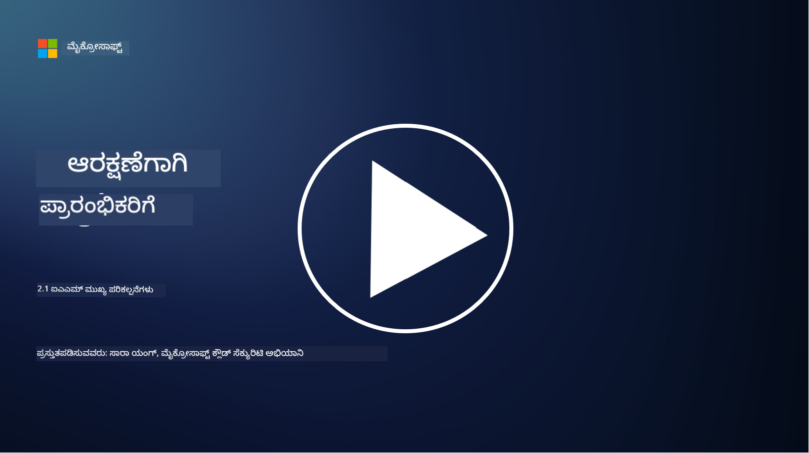

<!--
CO_OP_TRANSLATOR_METADATA:
{
  "original_hash": "2e3864e3d579f0dbb4ac2ec8c5f82acf",
  "translation_date": "2025-12-19T13:23:14+00:00",
  "source_file": "2.1 IAM key concepts.md",
  "language_code": "kn"
}
-->
# IAM ಮುಖ್ಯ ಪರಿಕಲ್ಪನೆಗಳು

ನೀವು ಯಾವಾಗಲಾದರೂ ಕಂಪ್ಯೂಟರ್ ಅಥವಾ ವೆಬ್‌ಸೈಟ್‌ಗೆ ಲಾಗಿನ್ ಮಾಡಿದ್ದೀರಾ? ಖಂಡಿತವಾಗಿಯೂ ಮಾಡಿದ್ದೀರಿ! ಅಂದರೆ ನೀವು ದಿನನಿತ್ಯದ ಜೀವನದಲ್ಲಿ ಈಗಾಗಲೇ ಗುರುತಿನ ನಿಯಂತ್ರಣಗಳನ್ನು ಬಳಸಿದ್ದೀರಿ. ಗುರುತಿನ ಮತ್ತು ಪ್ರವೇಶ ನಿರ್ವಹಣೆ (IAM) ಭದ್ರತೆಯ ಪ್ರಮುಖ ಅಂಶವಾಗಿದೆ, ಮುಂದಿನ ಪಾಠಗಳಲ್ಲಿ ನಾವು ಇದರ ಬಗ್ಗೆ ಹೆಚ್ಚು ತಿಳಿಯುತ್ತೇವೆ.

**ಪರಿಚಯ**

ಈ ಪಾಠದಲ್ಲಿ ನಾವು ಕವರ್ ಮಾಡುತ್ತೇವೆ:

 - ಸೈಬರ್‌ಸುರಕ್ಷೆಯ ಸಂದರ್ಭದಲ್ಲಿ ಗುರುತಿನ ಮತ್ತು ಪ್ರವೇಶ ನಿರ್ವಹಣೆ (IAM) ಎಂದರೇನು?
   
 - ಕನಿಷ್ಠ ಹಕ್ಕುಗಳ ತತ್ವ ಎಂದರೇನು?
   
 - ಕರ್ತವ್ಯಗಳ ವಿಭಜನೆ ಎಂದರೇನು?
 - ದೃಢೀಕರಣ ಮತ್ತು ಅನುಮೋದನೆ ಎಂದರೇನು?

## ಸೈಬರ್‌ಸುರಕ್ಷೆಯ ಸಂದರ್ಭದಲ್ಲಿ ಗುರುತಿನ ಮತ್ತು ಪ್ರವೇಶ ನಿರ್ವಹಣೆ (IAM) ಎಂದರೇನು?

ಗುರುತಿನ ಮತ್ತು ಪ್ರವೇಶ ನಿರ್ವಹಣೆ (IAM) ಎಂಬುದು ಪ್ರಕ್ರಿಯೆಗಳು, ತಂತ್ರಜ್ಞಾನಗಳು ಮತ್ತು ನೀತಿಗಳ ಸಮೂಹವನ್ನು ಸೂಚಿಸುತ್ತದೆ, ಇದು ಸಂಸ್ಥೆಯ ಡಿಜಿಟಲ್ ಪರಿಸರದಲ್ಲಿ ಸರಿಯಾದ ವ್ಯಕ್ತಿಗಳು ಸೂಕ್ತವಾದ ಪ್ರವೇಶವನ್ನು ಹೊಂದಿರುವುದನ್ನು ಖಚಿತಪಡಿಸಲು ಜಾರಿಗೆ ತರಲಾಗುತ್ತದೆ. IAM ಡಿಜಿಟಲ್ ಗುರುತಿಗಳನ್ನು (ಬಳಕೆದಾರರು, ಉದ್ಯೋಗಿಗಳು, ಪಾಲುದಾರರು) ಮತ್ತು ವ್ಯವಸ್ಥೆಗಳು, ಅಪ್ಲಿಕೇಶನ್‌ಗಳು, ಡೇಟಾ ಮತ್ತು ನೆಟ್‌ವರ್ಕ್‌ಗಳಿಗೆ ಅವರ ಪ್ರವೇಶವನ್ನು ನಿರ್ವಹಿಸುವುದರಲ್ಲಿ ತೊಡಗಿಸಿಕೊಂಡಿದೆ. IAM ನ ಪ್ರಾಥಮಿಕ ಗುರಿ ಭದ್ರತೆಯನ್ನು ಹೆಚ್ಚಿಸುವುದು, ಬಳಕೆದಾರರ ಪ್ರವೇಶವನ್ನು ಸುಗಮಗೊಳಿಸುವುದು ಮತ್ತು ಸಂಸ್ಥೆಯ ನೀತಿಗಳು ಮತ್ತು ನಿಯಮಗಳಿಗೆ ಅನುಗುಣವಾಗಿರುವುದನ್ನು ಖಚಿತಪಡಿಸುವುದು. IAM ಪರಿಹಾರಗಳು ಸಾಮಾನ್ಯವಾಗಿ ಬಳಕೆದಾರ ದೃಢೀಕರಣ, ಅನುಮೋದನೆ, ಗುರುತಿನ ಒದಗಿಸುವಿಕೆ, ಪ್ರವೇಶ ನಿಯಂತ್ರಣ ಮತ್ತು ಬಳಕೆದಾರರ ಜೀವನಚಕ್ರ ನಿರ್ವಹಣೆಯನ್ನು ಒಳಗೊಂಡಿರುತ್ತವೆ (ಖಾತೆಗಳು ಬಳಸಲಾಗದಾಗ ಅವುಗಳನ್ನು ಅಳಿಸುವುದನ್ನು ಖಚಿತಪಡಿಸುವುದು).

## ಕನಿಷ್ಠ ಹಕ್ಕುಗಳ ತತ್ವ ಎಂದರೇನು?

ಕನಿಷ್ಠ ಹಕ್ಕುಗಳ ತತ್ವವು ಬಳಕೆದಾರರು ಮತ್ತು ವ್ಯವಸ್ಥೆಗಳಿಗೆ ಅವರ ಉದ್ದೇಶಿತ ಕಾರ್ಯಗಳು ಅಥವಾ ಪಾತ್ರಗಳನ್ನು ನಿರ್ವಹಿಸಲು ಅಗತ್ಯವಿರುವ ಕನಿಷ್ಠ ಹಕ್ಕುಗಳನ್ನು ಮಾತ್ರ ನೀಡುವಂತೆ ಪ್ರೋತ್ಸಾಹಿಸುವ ಮೂಲಭೂತ ಪರಿಕಲ್ಪನೆಯಾಗಿದೆ. ಈ ತತ್ವವು ಭದ್ರತಾ ಉಲ್ಲಂಘನೆ ಅಥವಾ ಒಳಗಿನ ಅಪಾಯದ ಸಂದರ್ಭದಲ್ಲಿ ಸಂಭವಿಸಬಹುದಾದ ಹಾನಿಯನ್ನು ಮಿತಿಗೊಳಿಸಲು ಸಹಾಯ ಮಾಡುತ್ತದೆ. ಕನಿಷ್ಠ ಹಕ್ಕುಗಳ ತತ್ವವನ್ನು ಪಾಲಿಸುವ ಮೂಲಕ, ಸಂಸ್ಥೆಗಳು ದಾಳಿ ಮೇಲ್ಮೈಯನ್ನು ಕಡಿಮೆ ಮಾಡುತ್ತವೆ ಮತ್ತು ಅನಧಿಕೃತ ಪ್ರವೇಶ, ಡೇಟಾ ಉಲ್ಲಂಘನೆಗಳು ಮತ್ತು ಹಕ್ಕುಗಳ ಅಜಾಗರೂಕ ಬಳಕೆಯ ಅಪಾಯವನ್ನು ಕಡಿಮೆ ಮಾಡುತ್ತವೆ. ಪ್ರಾಯೋಗಿಕವಾಗಿ, ಇದು ಬಳಕೆದಾರರಿಗೆ ಅವರ ಕೆಲಸದ ಪಾತ್ರಗಳಿಗೆ ಅಗತ್ಯವಿರುವ ನಿರ್ದಿಷ್ಟ ಸಂಪತ್ತುಗಳು ಮತ್ತು ಕಾರ್ಯಕ್ಷಮತೆಗಳಿಗೆ ಮಾತ್ರ ಪ್ರವೇಶವನ್ನು ನೀಡಲಾಗುತ್ತದೆ ಎಂಬುದನ್ನು ಅರ್ಥೈಸುತ್ತದೆ, ಅದಕ್ಕಿಂತ ಹೆಚ್ಚು ಅಲ್ಲ. ಉದಾಹರಣೆಗೆ, ನೀವು ಕೇವಲ ಒಂದು ಡಾಕ್ಯುಮೆಂಟ್ ಅನ್ನು ಓದಲು ಅಗತ್ಯವಿದ್ದರೆ, ಆ ಡಾಕ್ಯುಮೆಂಟ್‌ಗೆ ಸಂಪೂರ್ಣ ಆಡಳಿತ ಹಕ್ಕುಗಳನ್ನು ನೀಡುವುದು ಅತಿಯಾಗಿ ಕಾಣುತ್ತದೆ.

## ಕರ್ತವ್ಯಗಳ ವಿಭಜನೆ ಎಂದರೇನು?

ಕರ್ತವ್ಯಗಳ ವಿಭಜನೆ ಎಂಬುದು ಸಂಘಟನೆಯೊಳಗಿನ ವಿವಿಧ ವ್ಯಕ್ತಿಗಳಲ್ಲಿ ಪ್ರಮುಖ ಕಾರ್ಯಗಳು ಮತ್ತು ಜವಾಬ್ದಾರಿಗಳನ್ನು ಹಂಚುವ ಮೂಲಕ ಹಿತಾಸಕ್ತಿಗಳ ಸಂಘರ್ಷವನ್ನು ತಡೆಯುವುದು ಮತ್ತು ವಂಚನೆ ಮತ್ತು ದೋಷಗಳ ಅಪಾಯವನ್ನು ಕಡಿಮೆ ಮಾಡುವ ತತ್ವವಾಗಿದೆ. ಸೈಬರ್‌ಸುರಕ್ಷೆಯ ಸಂದರ್ಭದಲ್ಲಿ, ಕರ್ತವ್ಯಗಳ ವಿಭಜನೆ ಎಂದರೆ ಯಾವುದೇ ಒಬ್ಬ ವ್ಯಕ್ತಿಯು ಪ್ರಮುಖ ಪ್ರಕ್ರಿಯೆ ಅಥವಾ ವ್ಯವಸ್ಥೆಯ ಎಲ್ಲಾ ಅಂಶಗಳ ಮೇಲೆ ನಿಯಂತ್ರಣ ಹೊಂದಿರುವುದನ್ನು ತಡೆಯುವುದು. ಗುರಿಯು ಪ್ರಕ್ರಿಯೆಯ ಸ್ಥಾಪನೆ ಮತ್ತು ಅನುಮೋದನೆ ಹಂತಗಳನ್ನು ನಿರ್ವಹಿಸಲು ಸಾಮರ್ಥ್ಯವನ್ನು ಹೊಂದಿರುವ ಯಾವುದೇ ಒಬ್ಬ ವ್ಯಕ್ತಿಯನ್ನು ತಡೆಯುವ ತಪಾಸಣೆ ಮತ್ತು ಸಮತೋಲನಗಳ ವ್ಯವಸ್ಥೆಯನ್ನು ರಚಿಸುವುದು. ಉದಾಹರಣೆಗೆ, ಹಣಕಾಸು ವ್ಯವಸ್ಥೆಗಳಲ್ಲಿ, ಇದು ವ್ಯವಸ್ಥೆಗೆ ವ್ಯವಹಾರಗಳನ್ನು ನಮೂದಿಸುವ ವ್ಯಕ್ತಿ ಆ ವ್ಯವಹಾರಗಳನ್ನು ಅನುಮೋದಿಸುವ ವ್ಯಕ್ತಿಯೇ ಆಗಿರಬಾರದು ಎಂದು ಸೂಚಿಸಬಹುದು. ಇದು ಅನಧಿಕೃತ ಅಥವಾ ವಂಚನೆಗೊಳಗಾದ ಕ್ರಿಯೆಗಳು ಪತ್ತೆಯಾಗದೆ ಹೋಗುವ ಅಪಾಯವನ್ನು ಕಡಿಮೆ ಮಾಡುತ್ತದೆ.

## ದೃಢೀಕರಣ ಮತ್ತು ಅನುಮೋದನೆ ಎಂದರೇನು?

ದೃಢೀಕರಣ ಮತ್ತು ಅನುಮೋದನೆ ಎಂಬುದು ಕಂಪ್ಯೂಟರ್ ವ್ಯವಸ್ಥೆಗಳು ಮತ್ತು ಡೇಟಾದ ಭದ್ರತೆ ಮತ್ತು ಅಖಂಡತೆಯನ್ನು ಖಚಿತಪಡಿಸಲು ಪ್ರಮುಖ ಪಾತ್ರವನ್ನು ವಹಿಸುವ ಸೈಬರ್‌ಸುರಕ್ಷೆಯ ಎರಡು ಮೂಲಭೂತ ಪರಿಕಲ್ಪನೆಗಳಾಗಿವೆ. ಸಂಪತ್ತುಗಳಿಗೆ ಪ್ರವೇಶವನ್ನು ನಿಯಂತ್ರಿಸಲು ಮತ್ತು ಸಂವೇದನಶೀಲ ಮಾಹಿತಿಯನ್ನು ರಕ್ಷಿಸಲು ಅವು ಸಾಮಾನ್ಯವಾಗಿ ಒಟ್ಟಿಗೆ ಬಳಸಲಾಗುತ್ತದೆ.

**1. ದೃಢೀಕರಣ**: ದೃಢೀಕರಣವು ಕಂಪ್ಯೂಟರ್ ವ್ಯವಸ್ಥೆ ಅಥವಾ ನಿರ್ದಿಷ್ಟ ಸಂಪತ್ತಿಗೆ ಪ್ರವೇಶಿಸಲು ಪ್ರಯತ್ನಿಸುತ್ತಿರುವ ಬಳಕೆದಾರ, ವ್ಯವಸ್ಥೆ ಅಥವಾ ಘಟಕದ ಗುರುತನ್ನು ಪರಿಶೀಲಿಸುವ ಪ್ರಕ್ರಿಯೆಯಾಗಿದೆ. ಇದು ಹೇಳಲಾದ ಗುರುತಿನು ನಿಜವಾದ ಮತ್ತು ನಿಖರವಾಗಿದೆ ಎಂಬುದನ್ನು ಖಚಿತಪಡಿಸುತ್ತದೆ. ದೃಢೀಕರಣ ವಿಧಾನಗಳು ಸಾಮಾನ್ಯವಾಗಿ ಕೆಳಗಿನ ಅಂಶಗಳಲ್ಲಿ ಒಂದನ್ನು ಅಥವಾ ಹೆಚ್ಚು ಬಳಸುವ ಪ್ರಕ್ರಿಯೆಯನ್ನು ಒಳಗೊಂಡಿರುತ್ತವೆ:
    
    a. ನೀವು ತಿಳಿದಿರುವುದು: ಇದರಲ್ಲಿ ಪಾಸ್ವರ್ಡ್‌ಗಳು, ಪಿನ್‌ಗಳು ಅಥವಾ ಅನುಮೋದಿತ ಬಳಕೆದಾರರು ಹೊಂದಿರಬೇಕಾದ ಇತರ ರಹಸ್ಯ ಜ್ಞಾನವನ್ನು ಒಳಗೊಂಡಿರುತ್ತದೆ.
    
    b. ನೀವು ಹೊಂದಿರುವುದು: ಇದು ಸ್ಮಾರ್ಟ್ ಕಾರ್ಡ್‌ಗಳು, ಭದ್ರತಾ ಟೋಕನ್‌ಗಳು ಅಥವಾ ಬಳಕೆದಾರರ ಗುರುತನ್ನು ದೃಢೀಕರಿಸಲು ಬಳಸುವ ಮೊಬೈಲ್ ಫೋನ್‌ಗಳಂತಹ ಭೌತಿಕ ಟೋಕನ್‌ಗಳು ಅಥವಾ ಸಾಧನಗಳನ್ನು ಒಳಗೊಂಡಿರುತ್ತದೆ.
    
    c. ನೀವು ಯಾರು: ಇದು ಬೆರಳಚ್ಚುಗಳು, ಮುಖ ಗುರುತಿಸುವಿಕೆ ಅಥವಾ ರೆಟಿನಲ್ ಸ್ಕ್ಯಾನ್‌ಗಳಂತಹ ಜೀವವೈಜ್ಞಾನಿಕ ಅಂಶಗಳನ್ನು ಸೂಚಿಸುತ್ತದೆ, ಅವು ವ್ಯಕ್ತಿಗೆ ವಿಶಿಷ್ಟವಾಗಿರುತ್ತವೆ.
    

ದೃಢೀಕರಣ ಯಂತ್ರಗಳು ಬಳಕೆದಾರರು ತಮ್ಮನ್ನು ತಾವು ಹೇಳಿದಂತೆ ಎಂದು ದೃಢೀಕರಿಸಲು ಬಳಸಲಾಗುತ್ತದೆ, ನಂತರ ವ್ಯವಸ್ಥೆ ಅಥವಾ ಸಂಪತ್ತಿಗೆ ಪ್ರವೇಶವನ್ನು ಅನುಮತಿಸಲಾಗುತ್ತದೆ. ಇದು ಅನಧಿಕೃತ ಪ್ರವೇಶವನ್ನು ತಡೆಯಲು ಸಹಾಯ ಮಾಡುತ್ತದೆ ಮತ್ತು ಕೇವಲ ಕಾನೂನುಬದ್ಧ ಬಳಕೆದಾರರು ಮಾತ್ರ ವ್ಯವಸ್ಥೆಯೊಳಗೆ ಕ್ರಿಯೆಗಳನ್ನು ನಿರ್ವಹಿಸಲು ಅನುಮತಿಸುತ್ತದೆ.

**2. ಅನುಮೋದನೆ**: ಅನುಮೋದನೆವು ದೃಢೀಕರಿಸಿದ ಬಳಕೆದಾರರು ಅಥವಾ ಘಟಕಗಳಿಗೆ ನಿರ್ದಿಷ್ಟ ಅನುಮತಿಗಳು ಮತ್ತು ಹಕ್ಕುಗಳನ್ನು ನೀಡುವ ಅಥವಾ ನಿರಾಕರಿಸುವ ಪ್ರಕ್ರಿಯೆಯಾಗಿದೆ, ಅವರ ಗುರುತನ್ನು ದೃಢೀಕರಿಸಿದ ನಂತರ. ಇದು ಬಳಕೆದಾರರು ವ್ಯವಸ್ಥೆಯೊಳಗೆ ಅಥವಾ ನಿರ್ದಿಷ್ಟ ಸಂಪತ್ತಿನ ಮೇಲೆ ನಿರ್ವಹಿಸಲು ಅನುಮತಿಸಲಾದ ಕ್ರಿಯೆಗಳು ಅಥವಾ ಕಾರ್ಯಾಚರಣೆಗಳನ್ನು ನಿರ್ಧರಿಸುತ್ತದೆ. ಅನುಮೋದನೆ ಸಾಮಾನ್ಯವಾಗಿ ಪೂರ್ವನಿರ್ಧರಿತ ನೀತಿಗಳು, ಪ್ರವೇಶ ನಿಯಂತ್ರಣ ನಿಯಮಗಳು ಮತ್ತು ಬಳಕೆದಾರರಿಗೆ ನೀಡಲಾದ ಪಾತ್ರಗಳ ಆಧಾರದ ಮೇಲೆ ನಡೆಯುತ್ತದೆ.

ಅನುಮೋದನೆಯನ್ನು "ದೃಢೀಕರಿಸಿದ ಬಳಕೆದಾರರು ಏನು ಮಾಡಬಹುದು?" ಎಂಬ ಪ್ರಶ್ನೆಗೆ ಉತ್ತರಿಸುವಂತೆ ಪರಿಗಣಿಸಬಹುದು. ಇದು ಸಂವೇದನಶೀಲ ಡೇಟಾ ಮತ್ತು ಸಂಪತ್ತನ್ನು ಅನಧಿಕೃತ ಪ್ರವೇಶ ಅಥವಾ ತಿದ್ದುಪಡಿಗಳಿಂದ ರಕ್ಷಿಸಲು ಪ್ರವೇಶ ನಿಯಂತ್ರಣ ನೀತಿಗಳನ್ನು ವ್ಯಾಖ್ಯಾನಿಸುವ ಮತ್ತು ಜಾರಿಗೊಳಿಸುವುದನ್ನು ಒಳಗೊಂಡಿರುತ್ತದೆ.

**ಸಾರಾಂಶ:**

- ದೃಢೀಕರಣವು ಬಳಕೆದಾರರ ಅಥವಾ ಘಟಕಗಳ ಗುರುತನ್ನು ಸ್ಥಾಪಿಸುತ್ತದೆ.
- ಅನುಮೋದನೆ ದೃಢೀಕರಿಸಿದ ಬಳಕೆದಾರರು ಪ್ರವೇಶಿಸಲು ಅಥವಾ ತಿದ್ದುಪಡಿ ಮಾಡಲು ಅನುಮತಿಸಲಾದ ಕ್ರಿಯೆಗಳು ಮತ್ತು ಸಂಪತ್ತನ್ನು ನಿರ್ಧರಿಸುತ್ತದೆ.

## ಹೆಚ್ಚಿನ ಓದು

- [ಗುರುತಿನ ಪರಿಕಲ್ಪನೆಗಳನ್ನು ವಿವರಿಸಿ - ತರಬೇತಿ | Microsoft Learn](https://learn.microsoft.com/training/modules/describe-identity-principles-concepts/?WT.mc_id=academic-96948-sayoung)
- [ಗುರುತಿಗೆ ಪರಿಚಯ - Microsoft Entra | Microsoft Learn](https://learn.microsoft.com/azure/active-directory/fundamentals/identity-fundamental-concepts?WT.mc_id=academic-96948-sayoung)
- [ಗುರುತಿನ ಪ್ರವೇಶ ನಿರ್ವಹಣೆ (IAM) ಎಂದರೇನು? | Microsoft Security](https://www.microsoft.com/security/business/security-101/what-is-identity-access-management-iam?WT.mc_id=academic-96948-sayoung)
- [IAM ಎಂದರೇನು? ಗುರುತಿನ ಮತ್ತು ಪ್ರವೇಶ ನಿರ್ವಹಣೆ ವಿವರಿಸಲಾಗಿದೆ | CSO Online](https://www.csoonline.com/article/518296/what-is-iam-identity-and-access-management-explained.html)
- [IAM ಎಂದರೇನು? (auth0.com)](https://auth0.com/blog/what-is-iam/)
- [Security+: ಗುರುತಿನ ಮತ್ತು ಪ್ರವೇಶ ನಿರ್ವಹಣೆ (IAM) ನಿಯಂತ್ರಣಗಳನ್ನು ಜಾರಿಗೆ ತರುವುದು [ಅಪ್ಡೇಟೆಡ್ 2021] | Infosec (infosecinstitute.com)](https://resources.infosecinstitute.com/certifications/securityplus/security-implementing-identity-and-access-management-iam-controls/)
- [ಕನಿಷ್ಠ ಹಕ್ಕುಗಳು - ಶಬ್ದಕೋಶ | CSRC (nist.gov)](https://csrc.nist.gov/glossary/term/least_privilege)
- [ಭದ್ರತೆ: ಕನಿಷ್ಠ ಹಕ್ಕುಗಳ ತತ್ವ (POLP) - Microsoft Community Hub](https://techcommunity.microsoft.com/t5/azure-sql-blog/security-the-principle-of-least-privilege-polp/ba-p/2067390?WT.mc_id=academic-96948-sayoung)
- [ಕನಿಷ್ಠ ಹಕ್ಕುಗಳ ತತ್ವ | CERT NZ](https://www.cert.govt.nz/it-specialists/critical-controls/principle-of-least-privilege/)
- [NIST 800-171 ಮತ್ತು CMMC ಯಿಂದ ಕರ್ತವ್ಯಗಳ ವಿಭಜನೆ ಏಕೆ ಅಗತ್ಯವಿದೆ? - (totem.tech)](https://www.totem.tech/cmmc-separation-of-duties/)

---

<!-- CO-OP TRANSLATOR DISCLAIMER START -->
**ಅಸಮೀಕ್ಷೆ**:  
ಈ ದಾಖಲೆ AI ಅನುವಾದ ಸೇವೆ [Co-op Translator](https://github.com/Azure/co-op-translator) ಬಳಸಿ ಅನುವಾದಿಸಲಾಗಿದೆ. ನಾವು ಖಚಿತತೆಯನ್ನು ಸಾಧಿಸಲು ಪ್ರಯತ್ನಿಸುತ್ತಿದ್ದರೂ, ದಯವಿಟ್ಟು ಗಮನಿಸಿ, ಸ್ವಯಂಚಾಲಿತ ಅನುವಾದಗಳಲ್ಲಿ ದೋಷಗಳು ಅಥವಾ ಅಸತ್ಯತೆಗಳು ಇರಬಹುದು. ಮೂಲ ಭಾಷೆಯಲ್ಲಿರುವ ಮೂಲ ದಾಖಲೆ ಪ್ರಾಮಾಣಿಕ ಮೂಲವಾಗಿ ಪರಿಗಣಿಸಬೇಕು. ಪ್ರಮುಖ ಮಾಹಿತಿಗಾಗಿ, ವೃತ್ತಿಪರ ಮಾನವ ಅನುವಾದವನ್ನು ಶಿಫಾರಸು ಮಾಡಲಾಗುತ್ತದೆ. ಈ ಅನುವಾದದ ಬಳಕೆಯಿಂದ ಉಂಟಾಗುವ ಯಾವುದೇ ತಪ್ಪುಅರ್ಥಗಳು ಅಥವಾ ತಪ್ಪುಅರ್ಥೈಸುವಿಕೆಗೆ ನಾವು ಹೊಣೆಗಾರರಾಗುವುದಿಲ್ಲ.
<!-- CO-OP TRANSLATOR DISCLAIMER END -->