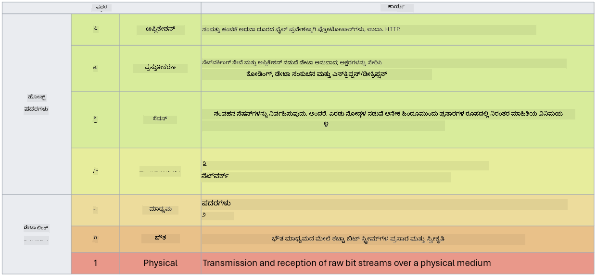

<!--
CO_OP_TRANSLATOR_METADATA:
{
  "original_hash": "252724eceeb183fb9018f88c5e1a3f0c",
  "translation_date": "2025-12-19T12:48:44+00:00",
  "source_file": "3.1 Networking key concepts.md",
  "language_code": "kn"
}
-->
# ನೆಟ್‌ವರ್ಕಿಂಗ್ ಪ್ರಮುಖ ತತ್ವಗಳು

ನೀವು ಐಟಿ ಕ್ಷೇತ್ರದಲ್ಲಿ ಕೆಲಸ ಮಾಡಿದ್ದರೆ, ನೀವು ನೆಟ್‌ವರ್ಕಿಂಗ್ ತತ್ವಗಳಿಗೆ ಪರಿಚಿತರಾಗಿರುವ ಸಾಧ್ಯತೆ ಇದೆ. ಆಧುನಿಕ ಪರಿಸರಗಳಲ್ಲಿ ನಾವು ಗುರುತನ್ನು ನಮ್ಮ ಪ್ರಾಥಮಿಕ ಪರಿಧಿ ನಿಯಂತ್ರಣವಾಗಿ ಬಳಸಿದರೂ, ಇದು ನೆಟ್‌ವರ್ಕ್ ನಿಯಂತ್ರಣಗಳು ಅನಾವಶ್ಯಕವೆಂದು ಅರ್ಥವಿಲ್ಲ. ಇದು ದೊಡ್ಡ ವಿಷಯವಾದರೂ, ಈ ಪಾಠದಲ್ಲಿ ನಾವು ಕೆಲವು ಪ್ರಮುಖ ನೆಟ್‌ವರ್ಕಿಂಗ್ ತತ್ವಗಳನ್ನು ಆವರಿಸುತ್ತೇವೆ.

ಈ ಪಾಠದಲ್ಲಿ ನಾವು ಈ ವಿಷಯಗಳನ್ನು ಆವರಿಸುತ್ತೇವೆ:

 - IP ವಿಳಾಸ ಏನು?

 - OSI ಮಾದರಿ ಏನು?

 - TCP/UDP ಏನು?

 - ಪೋರ್ಟ್ ಸಂಖ್ಯೆಗಳು ಏನು?

 - ವಿಶ್ರಾಂತ ಮತ್ತು ಸಂಚಾರದ ಎನ್‌ಕ್ರಿಪ್ಷನ್ ಏನು?

## IP ವಿಳಾಸ ಏನು?

IP ವಿಳಾಸ ಅಥವಾ ಇಂಟರ್ನೆಟ್ ಪ್ರೋಟೋಕಾಲ್ ವಿಳಾಸವು ಇಂಟರ್ನೆಟ್ ಪ್ರೋಟೋಕಾಲ್ ಅನ್ನು ಸಂವಹನಕ್ಕಾಗಿ ಬಳಸುವ ಕಂಪ್ಯೂಟರ್ ನೆಟ್‌ವರ್ಕ್‌ಗೆ ಸಂಪರ್ಕಗೊಂಡಿರುವ ಪ್ರತಿ ಸಾಧನಕ್ಕೆ ನಿಯೋಜಿಸಲಾದ ಸಂಖ್ಯಾತ್ಮಕ ಲೇಬಲ್ ಆಗಿದೆ. ಇದು ನೆಟ್‌ವರ್ಕ್‌ನೊಳಗಿನ ಸಾಧನಗಳಿಗೆ ವಿಶಿಷ್ಟ ಗುರುತಿನ ಚಿಹ್ನೆಯಾಗಿ ಕಾರ್ಯನಿರ್ವಹಿಸುತ್ತದೆ, ಅವುಗಳಿಗೆ ಇಂಟರ್ನೆಟ್ ಅಥವಾ ಇತರ ಪರಸ್ಪರ ಸಂಪರ್ಕಿತ ನೆಟ್‌ವರ್ಕ್‌ಗಳಾದ್ಯಂತ ಡೇಟಾವನ್ನು ಕಳುಹಿಸಲು ಮತ್ತು ಸ್ವೀಕರಿಸಲು ಅನುಮತಿಸುತ್ತದೆ. IP ವಿಳಾಸದ ಎರಡು ಮುಖ್ಯ ಆವೃತ್ತಿಗಳಿವೆ: IPv4 (ಇಂಟರ್ನೆಟ್ ಪ್ರೋಟೋಕಾಲ್ ಆವೃತ್ತಿ 4) ಮತ್ತು IPv6 (ಇಂಟರ್ನೆಟ್ ಪ್ರೋಟೋಕಾಲ್ ಆವೃತ್ತಿ 6). IP ವಿಳಾಸವನ್ನು ಸಾಮಾನ್ಯವಾಗಿ IPv4 ಸ್ವರೂಪದಲ್ಲಿ (ಉದಾ., 192.168.1.1) ಅಥವಾ IPv6 ಸ್ವರೂಪದಲ್ಲಿ (ಉದಾ., 2001:0db8:85a3:0000:0000:8a2e:0370:7334) ಪ್ರತಿನಿಧಿಸಲಾಗುತ್ತದೆ.

## OSI ಮಾದರಿ ಏನು?

OSI (ಓಪನ್ ಸಿಸ್ಟಮ್ಸ್ ಇಂಟರ್‌ಕನೆಕ್ಷನ್) ಮಾದರಿಯು ಸಂವಹನ ವ್ಯವಸ್ಥೆಯ ಕಾರ್ಯಗಳನ್ನು ಏಳು ವಿಭಿನ್ನ ಹಂತಗಳಲ್ಲಿ ಮಾನಕಗೊಳಿಸುವ ಕಲ್ಪಿತ ಚೌಕಟ್ಟಾಗಿದೆ. ಪ್ರತಿ ಹಂತವು ನಿರ್ದಿಷ್ಟ ಕಾರ್ಯಗಳನ್ನು ನಿರ್ವಹಿಸುತ್ತದೆ ಮತ್ತು ಸಾಧನಗಳ ನಡುವೆ ಪರಿಣಾಮಕಾರಿ ಮತ್ತು ವಿಶ್ವಾಸಾರ್ಹ ಡೇಟಾ ಸಂವಹನವನ್ನು ಖಚಿತಪಡಿಸಲು ಹತ್ತಿರದ ಹಂತಗಳೊಂದಿಗೆ ಸಂವಹನ ಮಾಡುತ್ತದೆ. ಹಂತಗಳು, ಕೆಳಗಿನಿಂದ ಮೇಲಿನವರೆಗೆ, ಈ ಕೆಳಗಿನಂತಿವೆ:

 1. ಫಿಸಿಕಲ್ ಲೇಯರ್

 2. ಡೇಟಾ ಲಿಂಕ್ ಲೇಯರ್

 3. ನೆಟ್‌ವರ್ಕ್ ಲೇಯರ್

 4. ಟ್ರಾನ್ಸ್‌ಪೋರ್ಟ್ ಲೇಯರ್

 5. ಸೆಷನ್ ಲೇಯರ್

 6. ಪ್ರೆಸೆಂಟೇಶನ್ ಲೇಯರ್

 7. ಅಪ್ಲಿಕೇಶನ್ ಲೇಯರ್

OSI ಮಾದರಿಯು ನೆಟ್‌ವರ್ಕಿಂಗ್ ಪ್ರೋಟೋಕಾಲ್‌ಗಳು ಮತ್ತು ತಂತ್ರಜ್ಞಾನಗಳು ಪರಸ್ಪರ ಹೇಗೆ ಸಂವಹನ ಮಾಡುತ್ತವೆ ಎಂಬುದನ್ನು ಅರ್ಥಮಾಡಿಕೊಳ್ಳಲು ಸಾಮಾನ್ಯ ಉಲ್ಲೇಖವನ್ನು ಒದಗಿಸುತ್ತದೆ, ನಿರ್ದಿಷ್ಟ ಹಾರ್ಡ್‌ವೇರ್ ಅಥವಾ ಸಾಫ್ಟ್‌ವೇರ್ ಅನುಷ್ಠಾನಗಳಿಗಿಂತ ಹೊರತಾಗಿ.

_ಮೂಲ: https://en.wikipedia.org/wiki/OSI_model_

## TCP/UDP ಏನು?

TCP (ಟ್ರಾನ್ಸ್‌ಮಿಷನ್ ಕಂಟ್ರೋಲ್ ಪ್ರೋಟೋಕಾಲ್) ಮತ್ತು UDP (ಯೂಸರ್ ಡೇಟಾಗ್ರಾಮ್ ಪ್ರೋಟೋಕಾಲ್) ಇಂಟರ್ನೆಟ್ ಅಥವಾ ಸ್ಥಳೀಯ ನೆಟ್‌ವರ್ಕ್‌ನಲ್ಲಿ ಸಾಧನಗಳ ನಡುವೆ ಸಂವಹನವನ್ನು ಸುಗಮಗೊಳಿಸಲು ಕಂಪ್ಯೂಟರ್ ನೆಟ್‌ವರ್ಕ್‌ಗಳಲ್ಲಿ ಬಳಸುವ ಎರಡು ಮೂಲಭೂತ ಟ್ರಾನ್ಸ್‌ಪೋರ್ಟ್ ಲೇಯರ್ ಪ್ರೋಟೋಕಾಲ್‌ಗಳಾಗಿವೆ. ಇವು ಡೇಟಾವನ್ನು ಪ್ಯಾಕೆಟ್‌ಗಳಲ್ಲಿ ವಿಭಜಿಸಲು ಮತ್ತು ಸ್ವೀಕರಿಸುವ ತುದಿಯಲ್ಲಿ ಆ ಪ್ಯಾಕೆಟ್‌ಗಳನ್ನು ಮೂಲ ಡೇಟಾವಾಗಿ ಪುನಃ ಸಂಯೋಜಿಸಲು ಹೊಣೆ ಹೊರುತ್ತವೆ. ಆದರೆ, ಅವುಗಳ ಗುಣಲಕ್ಷಣಗಳು ಮತ್ತು ಬಳಕೆ ಪ್ರಕರಣಗಳಲ್ಲಿ ವ್ಯತ್ಯಾಸವಿದೆ.

**TCP (ಟ್ರಾನ್ಸ್‌ಮಿಷನ್ ಕಂಟ್ರೋಲ್ ಪ್ರೋಟೋಕಾಲ್)**:

TCP ಒಂದು ಸಂಪರ್ಕ-ಆಧಾರಿತ ಪ್ರೋಟೋಕಾಲ್ ಆಗಿದ್ದು, ಸಾಧನಗಳ ನಡುವೆ ವಿಶ್ವಾಸಾರ್ಹ ಮತ್ತು ಕ್ರಮಬದ್ಧ ಡೇಟಾ ವಿತರಣೆಯನ್ನು ಒದಗಿಸುತ್ತದೆ. ಡೇಟಾ ವಿನಿಮಯ ಪ್ರಾರಂಭವಾಗುವ ಮೊದಲು ಇದು ಕಳುಹಿಸುವವರ ಮತ್ತು ಸ್ವೀಕರಿಸುವವರ ನಡುವೆ ಸಂಪರ್ಕವನ್ನು ಸ್ಥಾಪಿಸುತ್ತದೆ. TCP ಡೇಟಾ ಪ್ಯಾಕೆಟ್‌ಗಳು ಸರಿಯಾದ ಕ್ರಮದಲ್ಲಿ ತಲುಪುವುದನ್ನು ಖಚಿತಪಡಿಸುತ್ತದೆ ಮತ್ತು ಡೇಟಾ ಅಖಂಡತೆ ಮತ್ತು ಸಂಪೂರ್ಣತೆಯನ್ನು ಖಚಿತಪಡಿಸಲು ಕಳೆದುಹೋದ ಪ್ಯಾಕೆಟ್‌ಗಳ ಪುನಃ ಪ್ರಸರಣವನ್ನು ನಿರ್ವಹಿಸಬಹುದು. ಇದು ವೆಬ್ ಬ್ರೌಸಿಂಗ್, ಇಮೇಲ್, ಫೈಲ್ ಟ್ರಾನ್ಸ್‌ಫರ್ (FTP), ಮತ್ತು ಡೇಟಾಬೇಸ್ ಸಂವಹನದಂತಹ ವಿಶ್ವಾಸಾರ್ಹ ಡೇಟಾ ವಿತರಣೆಯನ್ನು ಅಗತ್ಯವಿರುವ ಅಪ್ಲಿಕೇಶನ್‌ಗಳಿಗೆ TCP ಅನ್ನು ಸೂಕ್ತವಾಗಿಸುತ್ತದೆ.

**UDP (ಯೂಸರ್ ಡೇಟಾಗ್ರಾಮ್ ಪ್ರೋಟೋಕಾಲ್)**:

UDP ಒಂದು ಸಂಪರ್ಕರಹಿತ ಪ್ರೋಟೋಕಾಲ್ ಆಗಿದ್ದು, ವೇಗವಾದ ಡೇಟಾ ಪ್ರಸರಣವನ್ನು ಒದಗಿಸುತ್ತದೆ ಆದರೆ TCP ನಂತಹ ವಿಶ್ವಾಸಾರ್ಹತೆಯನ್ನು ಒದಗಿಸುವುದಿಲ್ಲ. ಇದು ಡೇಟಾವನ್ನು ಕಳುಹಿಸುವ ಮೊದಲು ಅಧಿಕೃತ ಸಂಪರ್ಕವನ್ನು ಸ್ಥಾಪಿಸುವುದಿಲ್ಲ ಮತ್ತು ಕಳೆದುಹೋದ ಪ್ಯಾಕೆಟ್‌ಗಳ ಸ್ವೀಕೃತಿ ಅಥವಾ ಪುನಃ ಪ್ರಸರಣಕ್ಕಾಗಿ ಯಂತ್ರಗಳನ್ನು ಒಳಗೊಂಡಿಲ್ಲ. UDP ವೇಗ ಮತ್ತು ದಕ್ಷತೆಯನ್ನು ವಿಶ್ವಾಸಾರ್ಹ ವಿತರಣೆಯಿಗಿಂತ ಹೆಚ್ಚು ಪ್ರಾಮುಖ್ಯತೆಯನ್ನು ನೀಡುವ ಅಪ್ಲಿಕೇಶನ್‌ಗಳಿಗೆ ಸೂಕ್ತವಾಗಿದೆ, ಉದಾ., ರಿಯಲ್-ಟೈಮ್ ಸಂವಹನ, ಸ್ಟ್ರೀಮಿಂಗ್ ಮೀಡಿಯಾ, ಆನ್‌ಲೈನ್ ಗೇಮಿಂಗ್, ಮತ್ತು DNS ಕ್ವೆರಿಗಳು.

ಸಾರಾಂಶವಾಗಿ, TCP ವಿಶ್ವಾಸಾರ್ಹತೆ ಮತ್ತು ಕ್ರಮಬದ್ಧ ವಿತರಣೆಗೆ ಆದ್ಯತೆ ನೀಡುತ್ತದೆ, ಇದು ಡೇಟಾ ಶುದ್ಧತೆಯನ್ನು ಅಗತ್ಯವಿರುವ ಅಪ್ಲಿಕೇಶನ್‌ಗಳಿಗೆ ಸೂಕ್ತವಾಗುತ್ತದೆ, ಆದರೆ UDP ವೇಗ ಮತ್ತು ದಕ್ಷತೆಯನ್ನು ಒತ್ತಿಹೇಳುತ್ತದೆ, ಇದು ಕಡಿಮೆ ವಿಳಂಬಕ್ಕಾಗಿ ಸಣ್ಣ ಡೇಟಾ ನಷ್ಟ ಅಥವಾ ಕ್ರಮ ಬದಲಾವಣೆಯನ್ನು ಸ್ವೀಕರಿಸಬಹುದಾದ ಅಪ್ಲಿಕೇಶನ್‌ಗಳಿಗೆ ಸೂಕ್ತವಾಗಿದೆ. TCP ಮತ್ತು UDP ನಡುವಿನ ಆಯ್ಕೆ ಬಳಸುವ ಅಪ್ಲಿಕೇಶನ್ ಅಥವಾ ಸೇವೆಯ ನಿರ್ದಿಷ್ಟ ಅಗತ್ಯತೆಗಳ ಮೇಲೆ ಅವಲಂಬಿತವಾಗಿದೆ.

## ಪೋರ್ಟ್ ಸಂಖ್ಯೆಗಳು ಏನು?

ನೆಟ್‌ವರ್ಕಿಂಗ್‌ನಲ್ಲಿ, ಪೋರ್ಟ್ ಸಂಖ್ಯೆವು ಒಂದು ನೆಟ್‌ವರ್ಕ್‌ನೊಳಗಿನ ಒಂದೇ ಸಾಧನದಲ್ಲಿ ಕಾರ್ಯನಿರ್ವಹಿಸುತ್ತಿರುವ ವಿಭಿನ್ನ ಸೇವೆಗಳು ಅಥವಾ ಅಪ್ಲಿಕೇಶನ್‌ಗಳನ್ನು ವಿಭಜಿಸಲು ಬಳಸುವ ಸಂಖ್ಯಾತ್ಮಕ ಗುರುತಾಗಿದೆ. ಪೋರ್ಟ್‌ಗಳು ಒಳಬರುವ ಡೇಟಾವನ್ನು ಸೂಕ್ತ ಅಪ್ಲಿಕೇಶನ್‌ಗೆ ಮಾರ್ಗೀಕರಿಸಲು ಸಹಾಯ ಮಾಡುತ್ತವೆ. ಪೋರ್ಟ್ ಸಂಖ್ಯೆಗಳು 16-ಬಿಟ್ ಅಸೈನ್ ಮಾಡಲಾದ ಪೂರ್ಣಾಂಕಗಳಾಗಿದ್ದು, ಅವು 0 ರಿಂದ 65535 ರವರೆಗೆ ವ್ಯಾಪಿಸುತ್ತವೆ. ಅವುಗಳನ್ನು ಮೂರು ಶ್ರೇಣಿಗಳಲ್ಲಿ ವಿಭಜಿಸಲಾಗಿದೆ:

- ವೆಲ್-ನೋನ್ ಪೋರ್ಟ್‌ಗಳು (0-1023): HTTP (ಪೋರ್ಟ್ 80) ಮತ್ತು FTP (ಪೋರ್ಟ್ 21) ಮುಂತಾದ ಮಾನಕ ಸೇವೆಗಳಿಗೆ ಮೀಸಲಾಗಿವೆ.

- ರಿಜಿಸ್ಟರ್ಡ್ ಪೋರ್ಟ್‌ಗಳು (1024-49151): ವೆಲ್-ನೋನ್ ಶ್ರೇಣಿಯ ಭಾಗವಾಗದ ಅಪ್ಲಿಕೇಶನ್‌ಗಳು ಮತ್ತು ಸೇವೆಗಳಿಗೆ ಬಳಸಲಾಗುತ್ತದೆ ಆದರೆ ಅಧಿಕೃತವಾಗಿ ನೋಂದಾಯಿಸಲಾಗಿದೆ.

- ಡೈನಾಮಿಕ್/ಪ್ರೈವೇಟ್ ಪೋರ್ಟ್‌ಗಳು (49152-65535): ತಾತ್ಕಾಲಿಕ ಅಥವಾ ಖಾಸಗಿ ಬಳಕೆಗೆ ಅಪ್ಲಿಕೇಶನ್‌ಗಳಿಂದ ಲಭ್ಯವಿದೆ.

## ವಿಶ್ರಾಂತ ಮತ್ತು ಸಂಚಾರದ ಎನ್‌ಕ್ರಿಪ್ಷನ್ ಏನು?

ಎನ್‌ಕ್ರಿಪ್ಷನ್ ಎಂದರೆ ಡೇಟಾವನ್ನು ಅಸಮರ್ಥ ಪ್ರವೇಶ ಅಥವಾ ತೊಂದರೆಗಳಿಂದ ರಕ್ಷಿಸಲು ಸುರಕ್ಷಿತ ಸ್ವರೂಪಕ್ಕೆ ಪರಿವರ್ತಿಸುವ ಪ್ರಕ್ರಿಯೆ. ಎನ್‌ಕ್ರಿಪ್ಷನ್ ಅನ್ನು "ವಿಶ್ರಾಂತ" (ಸಾಧನ ಅಥವಾ ಸರ್ವರ್‌ನಲ್ಲಿ ಸಂಗ್ರಹಿತವಾಗಿರುವಾಗ) ಮತ್ತು "ಸಂಚಾರದಲ್ಲಿ" (ಸಾಧನಗಳ ನಡುವೆ ಅಥವಾ ನೆಟ್‌ವರ್ಕ್‌ಗಳಾದ್ಯಂತ ಪ್ರಸಾರವಾಗುವಾಗ) ಡೇಟಾದ ಮೇಲೆ ಅನ್ವಯಿಸಬಹುದು.

**ವಿಶ್ರಾಂತದಲ್ಲಿ ಎನ್‌ಕ್ರಿಪ್ಷನ್**: ಇದು ಸಾಧನಗಳು, ಸರ್ವರ್‌ಗಳು ಅಥವಾ ಸಂಗ್ರಹಣಾ ವ್ಯವಸ್ಥೆಗಳಲ್ಲಿ ಸಂಗ್ರಹಿತ ಡೇಟಾವನ್ನು ಎನ್‌ಕ್ರಿಪ್ಟ್ ಮಾಡುವುದನ್ನು ಒಳಗೊಂಡಿದೆ. ದಾಳಿಗಾರರು ಸಂಗ್ರಹಣಾ ಮಾಧ್ಯಮವನ್ನು ಭೌತಿಕವಾಗಿ ಪ್ರವೇಶಿಸಿದರೂ, ಎನ್‌ಕ್ರಿಪ್ಷನ್ ಕೀಗಳಿಲ್ಲದೆ ಅವರು ಡೇಟಾವನ್ನು ಪ್ರವೇಶಿಸಲು ಸಾಧ್ಯವಿಲ್ಲ. ಸಾಧನದ ಕಳ್ಳತನ, ಡೇಟಾ ಉಲ್ಲಂಘನೆಗಳು ಅಥವಾ ಅನಧಿಕೃತ ಪ್ರವೇಶದ ಸಂದರ್ಭಗಳಲ್ಲಿ ಸಂವೇದನಾಶೀಲ ಡೇಟಾವನ್ನು ರಕ್ಷಿಸಲು ಇದು ಅತ್ಯಂತ ಮುಖ್ಯವಾಗಿದೆ.

**ಸಂಚಾರದಲ್ಲಿ ಎನ್‌ಕ್ರಿಪ್ಷನ್**: ಇದು ಸಾಧನಗಳ ನಡುವೆ ಅಥವಾ ನೆಟ್‌ವರ್ಕ್‌ಗಳಾದ್ಯಂತ ಪ್ರಯಾಣಿಸುವಾಗ ಡೇಟಾವನ್ನು ಎನ್‌ಕ್ರಿಪ್ಟ್ ಮಾಡುವುದನ್ನು ಒಳಗೊಂಡಿದೆ. ಇದು ಡೇಟಾ ಪ್ರಸರಣದ ಸಮಯದಲ್ಲಿ ಕಿವಿಗೊಡುವಿಕೆ ಮತ್ತು ಅನಧಿಕೃತ ಅಡಚಣೆಯನ್ನು ತಡೆಯುತ್ತದೆ. ಸಂಚಾರದಲ್ಲಿ ಎನ್‌ಕ್ರಿಪ್ಷನ್‌ಗಾಗಿ ಸಾಮಾನ್ಯ ಪ್ರೋಟೋಕಾಲ್‌ಗಳಲ್ಲಿ ವೆಬ್ ಸಂವಹನಕ್ಕಾಗಿ HTTPS ಮತ್ತು ವಿವಿಧ ರೀತಿಯ ನೆಟ್‌ವರ್ಕ್ ಟ್ರಾಫಿಕ್ ಅನ್ನು ಸುರಕ್ಷಿತಗೊಳಿಸಲು TLS/SSL ಅನ್ನು ಒಳಗೊಂಡಿವೆ.

## ಹೆಚ್ಚಿನ ಓದು
- [IP ವಿಳಾಸಗಳು ಹೇಗೆ ಕಾರ್ಯನಿರ್ವಹಿಸುತ್ತವೆ? (howtogeek.com)](https://www.howtogeek.com/341307/how-do-ip-addresses-work/)
- [IP ವಿಳಾಸವನ್ನು ಅರ್ಥಮಾಡಿಕೊಳ್ಳುವುದು: ಪರಿಚಯಾತ್ಮಕ ಮಾರ್ಗದರ್ಶಿ (geekflare.com)](https://geekflare.com/understanding-ip-address/)
- [OSI ಮಾದರಿ ಏನು? OSI ಯ 7 ಹಂತಗಳು ವಿವರಿಸಲಾಗಿದೆ (techtarget.com)](https://www.techtarget.com/searchnetworking/definition/OSI)
- [OSI ಮಾದರಿ – 7 ಹಂತಗಳನ್ನು ಸರಳ ಇಂಗ್ಲಿಷ್‌ನಲ್ಲಿ ವಿವರಿಸಲಾಗಿದೆ (freecodecamp.org)](https://www.freecodecamp.org/news/osi-model-networking-layers-explained-in-plain-english/)
- [TCP/IP ಪ್ರೋಟೋಕಾಲ್‌ಗಳು - IBM ಡಾಕ್ಯುಮೆಂಟೇಶನ್](https://www.ibm.com/docs/en/aix/7.3?topic=protocol-tcpip-protocols)
- [ಸಾಮಾನ್ಯ ಪೋರ್ಟ್‌ಗಳ ಚೀಟ್ ಶೀಟ್: ಪರಿಪೂರ್ಣ ಪೋರ್ಟ್‌ಗಳು ಮತ್ತು ಪ್ರೋಟೋಕಾಲ್‌ಗಳ ಪಟ್ಟಿ (stationx.net)](https://www.stationx.net/common-ports-cheat-sheet/)
- [ಅಜೂರ್ ಡೇಟಾ ಎನ್‌ಕ್ರಿಪ್ಷನ್-ಎಟ್-ರೆಸ್ಟ್ - ಅಜೂರ್ ಸೆಕ್ಯುರಿಟಿ | Microsoft Learn](https://learn.microsoft.com/azure/security/fundamentals/encryption-atrest?WT.mc_id=academic-96948-sayoung)

---

<!-- CO-OP TRANSLATOR DISCLAIMER START -->
**ಅಸಮೀಕ್ಷೆ**:  
ಈ ದಾಖಲೆ AI ಅನುವಾದ ಸೇವೆ [Co-op Translator](https://github.com/Azure/co-op-translator) ಬಳಸಿ ಅನುವಾದಿಸಲಾಗಿದೆ. ನಾವು ಖಚಿತತೆಯನ್ನು ಸಾಧಿಸಲು ಪ್ರಯತ್ನಿಸುತ್ತಿದ್ದರೂ, ದಯವಿಟ್ಟು ಗಮನಿಸಿ, ಸ್ವಯಂಚಾಲಿತ ಅನುವಾದಗಳಲ್ಲಿ ದೋಷಗಳು ಅಥವಾ ಅಸಮರ್ಪಕತೆಗಳು ಇರಬಹುದು. ಮೂಲ ಭಾಷೆಯಲ್ಲಿರುವ ಮೂಲ ದಾಖಲೆ ಪ್ರಾಮಾಣಿಕ ಮೂಲವೆಂದು ಪರಿಗಣಿಸಬೇಕು. ಪ್ರಮುಖ ಮಾಹಿತಿಗಾಗಿ, ವೃತ್ತಿಪರ ಮಾನವ ಅನುವಾದವನ್ನು ಶಿಫಾರಸು ಮಾಡಲಾಗುತ್ತದೆ. ಈ ಅನುವಾದದ ಬಳಕೆಯಿಂದ ಉಂಟಾಗುವ ಯಾವುದೇ ತಪ್ಪುಅರ್ಥಗಳು ಅಥವಾ ತಪ್ಪುಅನುವಾದಗಳಿಗೆ ನಾವು ಹೊಣೆಗಾರರಾಗುವುದಿಲ್ಲ.
<!-- CO-OP TRANSLATOR DISCLAIMER END -->