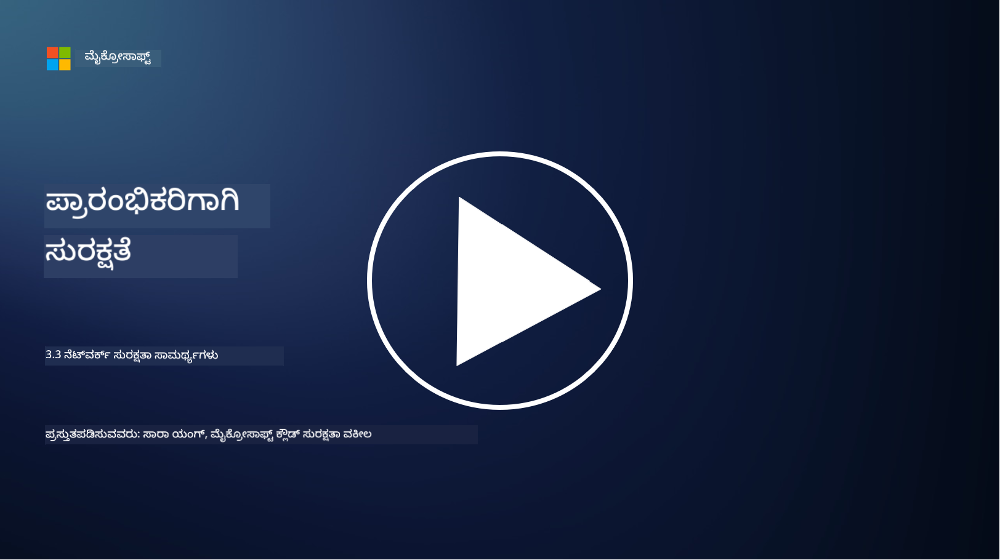

<!--
CO_OP_TRANSLATOR_METADATA:
{
  "original_hash": "c3aba077bb98eebc925dd58d870229ab",
  "translation_date": "2025-12-19T13:36:39+00:00",
  "source_file": "3.3 Network security capabilities.md",
  "language_code": "kn"
}
-->
# ನೆಟ್‌ವರ್ಕ್ ಭದ್ರತಾ ಸಾಮರ್ಥ್ಯಗಳು

ಈ ಪಾಠದಲ್ಲಿ ನಾವು ನೆಟ್‌ವರ್ಕ್ ಅನ್ನು ಭದ್ರಪಡಿಸಲು ಬಳಸಬಹುದಾದ ಕೆಳಗಿನ ಸಾಮರ್ಥ್ಯಗಳ ಬಗ್ಗೆ ಕಲಿಯುತ್ತೇವೆ:

 - ಪರಂಪರागत ಫೈರ್‌ವಾಲ್‌ಗಳು
 - ವೆಬ್ ಅಪ್ಲಿಕೇಶನ್ ಫೈರ್‌ವಾಲ್‌ಗಳು
 - ಕ್ಲೌಡ್ ಸೆಕ್ಯುರಿಟಿ ಗ್ರೂಪ್ಸ್
 - CDN
 - ಲೋಡ್ ಬ್ಯಾಲೆನ್ಸರ್‌ಗಳು
 - ಬ್ಯಾಸ್ಟಿಯನ್ ಹೋಸ್ಟ್‌ಗಳು
 - VPNಗಳು
 - DDoS ರಕ್ಷಣೆ

## ಪರಂಪರागत ಫೈರ್‌ವಾಲ್‌ಗಳು

ಪರಂಪರागत ಫೈರ್‌ವಾಲ್‌ಗಳು ನಿರ್ದಿಷ್ಟ ಭದ್ರತಾ ನಿಯಮಗಳ ಆಧಾರದ ಮೇಲೆ ಒಳಬರುವ ಮತ್ತು ಹೊರಹೋಗುವ ನೆಟ್‌ವರ್ಕ್ ಟ್ರಾಫಿಕ್ ಅನ್ನು ನಿಯಂತ್ರಿಸುವ ಮತ್ತು ಮೇಲ್ವಿಚಾರಣೆ ಮಾಡುವ ಭದ್ರತಾ ಸಾಧನಗಳಾಗಿವೆ. ಇವು ವಿಶ್ವಾಸಾರ್ಹ ಆಂತರಿಕ ನೆಟ್‌ವರ್ಕ್ ಮತ್ತು ವಿಶ್ವಾಸಾರ್ಹವಲ್ಲದ ಬಾಹ್ಯ ನೆಟ್‌ವರ್ಕ್‌ಗಳ ನಡುವೆ ತಡೆಗೋಡೆಯಂತೆ ಕಾರ್ಯನಿರ್ವಹಿಸುತ್ತವೆ, ಅನಧಿಕೃತ ಪ್ರವೇಶ ಮತ್ತು ಸಾಧ್ಯವಾದ ಅಪಾಯಗಳನ್ನು ತಡೆಯಲು ಟ್ರಾಫಿಕ್ ಅನ್ನು ಫಿಲ್ಟರ್ ಮಾಡುತ್ತವೆ.

## ವೆಬ್ ಅಪ್ಲಿಕೇಶನ್ ಫೈರ್‌ವಾಲ್‌ಗಳು

ವೆಬ್ ಅಪ್ಲಿಕೇಶನ್ ಫೈರ್‌ವಾಲ್‌ಗಳು (WAFs) SQL ಇಂಜೆಕ್ಷನ್, ಕ್ರಾಸ್-ಸೈಟ್ ಸ್ಕ್ರಿಪ್ಟಿಂಗ್ ಮತ್ತು ಇತರ ಅಪಾಯಗಳಂತಹ ದಾಳಿಗಳಿಂದ ವೆಬ್ ಅಪ್ಲಿಕೇಶನ್‌ಗಳನ್ನು ರಕ್ಷಿಸಲು ವಿನ್ಯಾಸಗೊಳಿಸಲಾದ ವಿಶೇಷ ಫೈರ್‌ವಾಲ್‌ಗಳಾಗಿವೆ. ಇವು HTTP ವಿನಂತಿಗಳು ಮತ್ತು ಪ್ರತಿಕ್ರಿಯೆಗಳನ್ನು ವಿಶ್ಲೇಷಿಸಿ, ವೆಬ್ ಅಪ್ಲಿಕೇಶನ್‌ಗಳನ್ನು ಗುರಿಯಾಗಿಸಿದ ದುಷ್ಟ ಟ್ರಾಫಿಕ್ ಅನ್ನು ಗುರುತಿಸಿ ತಡೆಯುತ್ತವೆ.

## ಕ್ಲೌಡ್ ಸೆಕ್ಯುರಿಟಿ ಗ್ರೂಪ್ಸ್

ಸೆಕ್ಯುರಿಟಿ ಗ್ರೂಪ್ಸ್ ಕ್ಲೌಡ್ ಸೇವಾ ಪೂರೈಕೆದಾರರು ಒದಗಿಸುವ ಮೂಲಭೂತ ನೆಟ್‌ವರ್ಕ್ ಭದ್ರತಾ ವೈಶಿಷ್ಟ್ಯವಾಗಿದೆ. ಇವು ವರ್ಚುವಲ್ ಫೈರ್‌ವಾಲ್‌ಗಳಂತೆ ಕಾರ್ಯನಿರ್ವಹಿಸುತ್ತವೆ, ವರ್ಚುವಲ್ ಮೆಷಿನ್‌ಗಳು (VMs) ಮತ್ತು ಇನ್‌ಸ್ಟಾನ್ಸ್‌ಗಳಂತಹ ಕ್ಲೌಡ್ ಸಂಪತ್ತಿಗೆ ಒಳಬರುವ ಮತ್ತು ಹೊರಹೋಗುವ ಟ್ರಾಫಿಕ್ ಅನ್ನು ನಿಯಂತ್ರಿಸುತ್ತವೆ. ಸೆಕ್ಯುರಿಟಿ ಗ್ರೂಪ್ಸ್ ಸಂಸ್ಥೆಗಳಿಗೆ ಯಾವ ರೀತಿಯ ಟ್ರಾಫಿಕ್ ಅನ್ನು ಅನುಮತಿಸಬೇಕು ಮತ್ತು ತಡೆಯಬೇಕು ಎಂಬುದನ್ನು ನಿರ್ಧರಿಸಲು ನಿಯಮಗಳನ್ನು ವ್ಯಾಖ್ಯಾನಿಸಲು ಅವಕಾಶ ನೀಡುತ್ತವೆ, ಕ್ಲೌಡ್ ನಿಯೋಜನೆಗಳಿಗೆ ಹೆಚ್ಚುವರಿ ರಕ್ಷಣಾ ಪದರವನ್ನು ಸೇರಿಸುತ್ತವೆ.

## ಕಂಟೆಂಟ್ ಡೆಲಿವರಿ ನೆಟ್‌ವರ್ಕ್ (CDN)

ಕಂಟೆಂಟ್ ಡೆಲಿವರಿ ನೆಟ್‌ವರ್ಕ್ ವಿವಿಧ ಭೌಗೋಳಿಕ ಸ್ಥಳಗಳಲ್ಲಿ ಇರುವ ವಿತರಿತ ಸರ್ವರ್‌ಗಳ ನೆಟ್‌ವರ್ಕ್ ಆಗಿದೆ. CDNs ವೆಬ್‌ಸೈಟ್‌ಗಳ ಕಾರ್ಯಕ್ಷಮತೆ ಮತ್ತು ಲಭ್ಯತೆಯನ್ನು ಸುಧಾರಿಸಲು ವಿಷಯವನ್ನು ಕ್ಯಾಶ್ ಮಾಡುವುದು ಮತ್ತು ಬಳಕೆದಾರನಿಗೆ ಹತ್ತಿರದ ಸರ್ವರ್‌ಗಳಿಂದ ಸೇವೆ ಸಲ್ಲಿಸುವ ಮೂಲಕ ಸಹಾಯ ಮಾಡುತ್ತವೆ. ಇವು DDoS ದಾಳಿಗಳ ವಿರುದ್ಧ ಕೆಲವು ಮಟ್ಟದ ರಕ್ಷಣೆಯನ್ನು ಒದಗಿಸುತ್ತವೆ, ಟ್ರಾಫಿಕ್ ಅನ್ನು ಅನೇಕ ಸರ್ವರ್ ಸ್ಥಳಗಳಲ್ಲಿ ವಿತರಿಸುವ ಮೂಲಕ.

## ಲೋಡ್ ಬ್ಯಾಲೆನ್ಸರ್‌ಗಳು

ಲೋಡ್ ಬ್ಯಾಲೆನ್ಸರ್‌ಗಳು ಒಳಬರುವ ನೆಟ್‌ವರ್ಕ್ ಟ್ರಾಫಿಕ್ ಅನ್ನು ಅನೇಕ ಸರ್ವರ್‌ಗಳಲ್ಲಿ ವಿತರಿಸುತ್ತವೆ, ಸಂಪತ್ತಿನ ಬಳಕೆಯನ್ನು ಆಪ್ಟಿಮೈಸ್ ಮಾಡಲು, ಹೆಚ್ಚಿನ ಲಭ್ಯತೆಯನ್ನು ಖಚಿತಪಡಿಸಲು ಮತ್ತು ಅಪ್ಲಿಕೇಶನ್ ಕಾರ್ಯಕ್ಷಮತೆಯನ್ನು ಸುಧಾರಿಸಲು. ಇವು ಸರ್ವರ್ ಓವರ್‌ಲೋಡ್ ಅನ್ನು ತಡೆಯಲು ಮತ್ತು ಪರಿಣಾಮಕಾರಿ ಪ್ರತಿಕ್ರಿಯಾ ಸಮಯವನ್ನು ನಿರ್ವಹಿಸಲು ಸಹಾಯ ಮಾಡುತ್ತವೆ, ನೆಟ್‌ವರ್ಕ್‌ನ ಸ್ಥಿರತೆಯನ್ನು ಹೆಚ್ಚಿಸುತ್ತವೆ.

## ಬ್ಯಾಸ್ಟಿಯನ್ ಹೋಸ್ಟ್‌ಗಳು

ಬ್ಯಾಸ್ಟಿಯನ್ ಹೋಸ್ಟ್‌ಗಳು ಅತ್ಯಂತ ಭದ್ರ ಮತ್ತು ಪ್ರತ್ಯೇಕಿತ ಸರ್ವರ್‌ಗಳಾಗಿದ್ದು, ಬಾಹ್ಯ, ವಿಶ್ವಾಸಾರ್ಹವಲ್ಲದ ನೆಟ್‌ವರ್ಕ್ (ಉದಾಹರಣೆಗೆ, ಇಂಟರ್ನೆಟ್) ನಿಂದ ನೆಟ್‌ವರ್ಕ್‌ಗೆ ನಿಯಂತ್ರಿತ ಪ್ರವೇಶವನ್ನು ಒದಗಿಸುತ್ತವೆ. ಇವು ಆಡಳಿತಗಾರರು ಆಂತರಿಕ ವ್ಯವಸ್ಥೆಗಳಿಗೆ ಸುರಕ್ಷಿತವಾಗಿ ಪ್ರವೇಶಿಸಲು ಪ್ರವೇಶದ್ವಾರಗಳಾಗಿ ಕಾರ್ಯನಿರ್ವಹಿಸುತ್ತವೆ. ಬ್ಯಾಸ್ಟಿಯನ್ ಹೋಸ್ಟ್‌ಗಳನ್ನು ಸಾಮಾನ್ಯವಾಗಿ ದಾಳಿಯ ಮೇಲ್ಮೈಯನ್ನು ಕಡಿಮೆ ಮಾಡಲು ಬಲವಾದ ಭದ್ರತಾ ಕ್ರಮಗಳೊಂದಿಗೆ ಸಂರಚಿಸಲಾಗುತ್ತದೆ.

## ವರ್ಚುವಲ್ ಪ್ರೈವೇಟ್ ನೆಟ್‌ವರ್ಕ್‌ಗಳು (VPNs)

VPNಗಳು ಬಳಕೆದಾರರ ಸಾಧನ ಮತ್ತು ದೂರದ ಸರ್ವರ್ ನಡುವೆ ಎನ್‌ಕ್ರಿಪ್ಟ್ ಮಾಡಿದ ಸುರಂಗಗಳನ್ನು ರಚಿಸುತ್ತವೆ, ಇಂಟರ್ನೆಟ್‌ನಂತಹ ಭದ್ರತೆಯಿಲ್ಲದ ನೆಟ್‌ವರ್ಕ್‌ಗಳಲ್ಲಿ ಸುರಕ್ಷಿತ ಮತ್ತು ಖಾಸಗಿ ಸಂವಹನವನ್ನು ಖಚಿತಪಡಿಸುತ್ತವೆ. VPNಗಳನ್ನು ಸಾಮಾನ್ಯವಾಗಿ ಆಂತರಿಕ ನೆಟ್‌ವರ್ಕ್‌ಗಳಿಗೆ ದೂರ ಪ್ರವೇಶವನ್ನು ಒದಗಿಸಲು ಬಳಸಲಾಗುತ್ತದೆ, ಬಳಕೆದಾರರು ಶಾರೀರಿಕವಾಗಿ ಅದೇ ನೆಟ್‌ವರ್ಕ್‌ನಲ್ಲಿ ಇದ್ದಂತೆ ಸಂಪತ್ತಿಗೆ ಪ್ರವೇಶಿಸಲು ಅನುಮತಿಸುತ್ತವೆ.

## DDoS ರಕ್ಷಣೆ ಸಾಧನಗಳು

DDoS (ಡಿಸ್ಟ್ರಿಬ್ಯೂಟೆಡ್ ಡಿನೈಯಲ್ ಆಫ್ ಸರ್ವಿಸ್) ರಕ್ಷಣೆ ಸಾಧನಗಳು ಮತ್ತು ಸೇವೆಗಳು DDoS ದಾಳಿಗಳ ಪರಿಣಾಮವನ್ನು ತಗ್ಗಿಸಲು ವಿನ್ಯಾಸಗೊಳಿಸಲಾಗಿದೆ, ಅಲ್ಲಿ ಅನೇಕ ಕಬಳಿಸಲ್ಪಟ್ಟ ಸಾಧನಗಳು ಒಂದು ನೆಟ್‌ವರ್ಕ್ ಅಥವಾ ಸೇವೆಯನ್ನು ಮೀರಿಸಲು ಟ್ರಾಫಿಕ್ ಅನ್ನು ತುಂಬಿಸುತ್ತವೆ. DDoS ರಕ್ಷಣೆ ಪರಿಹಾರಗಳು ದುಷ್ಟ ಟ್ರಾಫಿಕ್ ಅನ್ನು ಗುರುತಿಸಿ ಫಿಲ್ಟರ್ ಮಾಡುತ್ತವೆ, ನಿಜವಾದ ಟ್ರಾಫಿಕ್ ತನ್ನ ಉದ್ದೇಶಿತ ಗಮ್ಯಸ್ಥಾನವನ್ನು ತಲುಪಲು ಖಚಿತಪಡಿಸುತ್ತವೆ.

## ಹೆಚ್ಚಿನ ಓದು

- [ಫೈರ್‌ವಾಲ್ ಎಂದರೇನು? - Cisco](https://www.cisco.com/c/en/us/products/security/firewalls/what-is-a-firewall.html#~types-of-firewalls)
- [ಫೈರ್‌ವಾಲ್ ನಿಜವಾಗಿ ಏನು ಮಾಡುತ್ತದೆ? (howtogeek.com)](https://www.howtogeek.com/144269/htg-explains-what-firewalls-actually-do/)
- [ಫೈರ್‌ವಾಲ್ ಎಂದರೇನು? ಫೈರ್‌ವಾಲ್‌ಗಳು ಹೇಗೆ ಕಾರ್ಯನಿರ್ವಹಿಸುತ್ತವೆ ಮತ್ತು ಅವುಗಳ ಪ್ರಕಾರಗಳು (kaspersky.com)](https://www.kaspersky.com/resource-center/definitions/firewall)
- [ನೆಟ್‌ವರ್ಕ್ ಸೆಕ್ಯುರಿಟಿ ಗ್ರೂಪ್ - ಇದು ಹೇಗೆ ಕಾರ್ಯನಿರ್ವಹಿಸುತ್ತದೆ | Microsoft Learn](https://learn.microsoft.com/azure/virtual-network/network-security-group-how-it-works)
- [Azure ಕಂಟೆಂಟ್ ಡೆಲಿವರಿ ನೆಟ್‌ವರ್ಕ್ (CDN) ಗೆ ಪರಿಚಯ - ತರಬೇತಿ | Microsoft Learn](https://learn.microsoft.com/training/modules/intro-to-azure-content-delivery-network/?WT.mc_id=academic-96948-sayoung)
- [ಕಂಟೆಂಟ್ ಡೆಲಿವರಿ ನೆಟ್‌ವರ್ಕ್ (CDN) ಎಂದರೇನು? - Azure | Microsoft Learn](https://learn.microsoft.com/azure/cdn/cdn-overview?WT.mc_id=academic-96948-sayoung)
- [ಲೋಡ್ ಬ್ಯಾಲೆನ್ಸಿಂಗ್ ಎಂದರೇನು? ಲೋಡ್ ಬ್ಯಾಲೆನ್ಸರ್‌ಗಳು ಹೇಗೆ ಕಾರ್ಯನಿರ್ವಹಿಸುತ್ತವೆ (nginx.com)](https://www.nginx.com/resources/glossary/load-balancing/)
- [ಬ್ಯಾಸ್ಟಿಯನ್ ಹೋಸ್ಟ್‌ಗಳು vs. VPNಗಳು · Tailscale](https://tailscale.com/learn/bastion-hosts-vs-vpns/)
- [VPN ಎಂದರೇನು? ಇದು ಹೇಗೆ ಕಾರ್ಯನಿರ್ವಹಿಸುತ್ತದೆ, VPN ಪ್ರಕಾರಗಳು (kaspersky.com)](https://www.kaspersky.com/resource-center/definitions/what-is-a-vpn)
- [Azure DDoS ರಕ್ಷಣೆಗೆ ಪರಿಚಯ - ತರಬೇತಿ | Microsoft Learn](https://learn.microsoft.com/training/modules/introduction-azure-ddos-protection/?WT.mc_id=academic-96948-sayoung)
- [DDoS ದಾಳಿ ಎಂದರೇನು? | Microsoft Security](https://www.microsoft.com/security/business/security-101/what-is-a-ddos-attack?WT.mc_id=academic-96948-sayoung)

---

<!-- CO-OP TRANSLATOR DISCLAIMER START -->
**ಅಸಮೀಕ್ಷೆ**:  
ಈ ದಾಖಲೆ [Co-op Translator](https://github.com/Azure/co-op-translator) ಎಂಬ AI ಅನುವಾದ ಸೇವೆಯನ್ನು ಬಳಸಿಕೊಂಡು ಅನುವಾದಿಸಲಾಗಿದೆ. ನಾವು ನಿಖರತೆಯನ್ನು ಸಾಧಿಸಲು ಪ್ರಯತ್ನಿಸುತ್ತಿದ್ದರೂ, ದಯವಿಟ್ಟು ಗಮನಿಸಿ, ಸ್ವಯಂಚಾಲಿತ ಅನುವಾದಗಳಲ್ಲಿ ದೋಷಗಳು ಅಥವಾ ಅಸಮಂಜಸತೆಗಳು ಇರಬಹುದು. ಮೂಲ ಭಾಷೆಯಲ್ಲಿರುವ ಮೂಲ ದಾಖಲೆ ಪ್ರಾಮಾಣಿಕ ಮೂಲವೆಂದು ಪರಿಗಣಿಸಬೇಕು. ಪ್ರಮುಖ ಮಾಹಿತಿಗಾಗಿ, ವೃತ್ತಿಪರ ಮಾನವ ಅನುವಾದವನ್ನು ಶಿಫಾರಸು ಮಾಡಲಾಗುತ್ತದೆ. ಈ ಅನುವಾದದ ಬಳಕೆಯಿಂದ ಉಂಟಾಗುವ ಯಾವುದೇ ತಪ್ಪುಅರ್ಥಗಳು ಅಥವಾ ತಪ್ಪುಅನುವಾದಗಳಿಗೆ ನಾವು ಹೊಣೆಗಾರರಲ್ಲ.
<!-- CO-OP TRANSLATOR DISCLAIMER END -->