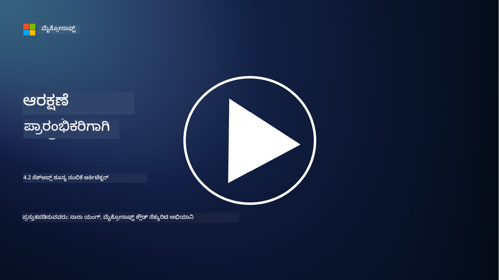

<!--
CO_OP_TRANSLATOR_METADATA:
{
  "original_hash": "45bbdc114e70936816b0b3e7c40189cf",
  "translation_date": "2025-12-19T13:30:55+00:00",
  "source_file": "4.2 SecOps zero trust architecture.md",
  "language_code": "kn"
}
-->
# SecOps ಶೂನ್ಯ ನಂಬಿಕೆ ಆರ್ಕಿಟೆಕ್ಚರ್

ಸುರಕ್ಷತಾ ಕಾರ್ಯಾಚರಣೆಗಳು ಶೂನ್ಯ ನಂಬಿಕೆ ಆರ್ಕಿಟೆಕ್ಚರ್‌ನ ಎರಡು ಭಾಗಗಳನ್ನು ರೂಪಿಸುತ್ತವೆ ಮತ್ತು ಈ ಪಾಠದಲ್ಲಿ ನಾವು ಎರಡರ ಬಗ್ಗೆ ಕಲಿಯುತ್ತೇವೆ:

- ಕೇಂದ್ರೀಕೃತ ಲಾಗ್ ಸಂಗ್ರಹಣೆಯನ್ನು ಅನುಮತಿಸಲು ಐಟಿ ಆರ್ಕಿಟೆಕ್ಚರ್‌ಗಳನ್ನು ಹೇಗೆ ನಿರ್ಮಿಸಬೇಕು?

- ಆಧುನಿಕ ಐಟಿ ಪರಿಸರಗಳಲ್ಲಿ ಸುರಕ್ಷತಾ ಕಾರ್ಯಾಚರಣೆಗಳ ಉತ್ತಮ ಅಭ್ಯಾಸಗಳು ಯಾವುವು?

## ಕೇಂದ್ರೀಕೃತ ಲಾಗ್ ಸಂಗ್ರಹಣೆಯನ್ನು ಅನುಮತಿಸಲು ಐಟಿ ಆರ್ಕಿಟೆಕ್ಚರ್‌ಗಳನ್ನು ಹೇಗೆ ನಿರ್ಮಿಸಬೇಕು?

ಕೇಂದ್ರೀಕೃತ ಲಾಗ್ ಸಂಗ್ರಹಣೆ ಆಧುನಿಕ ಸುರಕ್ಷತಾ ಕಾರ್ಯಾಚರಣೆಗಳ ಪ್ರಮುಖ ಅಂಶವಾಗಿದೆ. ಇದು ಸಂಸ್ಥೆಗಳಿಗೆ ಸರ್ವರ್‌ಗಳು, ಅಪ್ಲಿಕೇಶನ್‌ಗಳು, ನೆಟ್‌ವರ್ಕ್ ಸಾಧನಗಳು ಮತ್ತು ಸುರಕ್ಷತಾ ಸಾಧನಗಳು ಸೇರಿದಂತೆ ವಿವಿಧ ಮೂಲಗಳಿಂದ ಲಾಗ್‌ಗಳು ಮತ್ತು ಡೇಟಾವನ್ನು ಸಂಗ್ರಹಿಸಲು, ವಿಶ್ಲೇಷಿಸಲು, ನಿಗಾವಹಿಸಲು ಮತ್ತು ಘಟನೆಗಳಿಗೆ ಪ್ರತಿಕ್ರಿಯಿಸಲು ಕೇಂದ್ರೀಕೃತ ಸಂಗ್ರಹಣೆಗೆ ಒದಗಿಸುತ್ತದೆ. ಕೇಂದ್ರೀಕೃತ ಲಾಗ್ ಸಂಗ್ರಹಣೆಯನ್ನು ಬೆಂಬಲಿಸಲು ಐಟಿ ಆರ್ಕಿಟೆಕ್ಚರ್‌ಗಳನ್ನು ನಿರ್ಮಿಸಲು ಕೆಲವು ಉತ್ತಮ ಅಭ್ಯಾಸಗಳು ಇಲ್ಲಿವೆ:

1. **ಲಾಗ್ ಮೂಲಗಳ ಏಕೀಕರಣ**:

- ಎಲ್ಲಾ ಸಂಬಂಧಿತ ಸಾಧನಗಳು ಮತ್ತು ವ್ಯವಸ್ಥೆಗಳು ಲಾಗ್‌ಗಳನ್ನು ರಚಿಸಲು ಕಾನ್ಫಿಗರ್ ಮಾಡಲಾಗುವಂತೆ ಖಚಿತಪಡಿಸಿಕೊಳ್ಳಿ. ಇದರಲ್ಲಿ ಸರ್ವರ್‌ಗಳು, ಫೈರ್‌ವಾಲ್‌ಗಳು, ರೌಟರ್‌ಗಳು, ಸ್ವಿಚ್‌ಗಳು, ಅಪ್ಲಿಕೇಶನ್‌ಗಳು ಮತ್ತು ಸುರಕ್ಷತಾ ಸಾಧನಗಳು ಸೇರಿವೆ.

- ಲಾಗ್ ಮೂಲಗಳನ್ನು ಕೇಂದ್ರೀಕೃತ ಲಾಗ್ ಸಂಗ್ರಹಕ ಅಥವಾ ನಿರ್ವಹಣಾ ವ್ಯವಸ್ಥೆಗೆ ಲಾಗ್‌ಗಳನ್ನು ಫಾರ್ವರ್ಡ್ ಮಾಡಲು ಕಾನ್ಫಿಗರ್ ಮಾಡಿ.

2. **ಸರಿಯಾದ SIEM (ಸುರಕ್ಷತಾ ಮಾಹಿತಿ ಮತ್ತು ಘಟನೆ ನಿರ್ವಹಣೆ) ಸಾಧನವನ್ನು ಆಯ್ಕೆಮಾಡಿ**:

- ನಿಮ್ಮ ಸಂಸ್ಥೆಯ ಅಗತ್ಯಗಳು ಮತ್ತು ಪ್ರಮಾಣಕ್ಕೆ ಹೊಂದುವ SIEM ಪರಿಹಾರವನ್ನು ಆಯ್ಕೆಮಾಡಿ.

- ಆಯ್ಕೆಮಾಡಿದ ಪರಿಹಾರವು ಲಾಗ್ ಸಂಗ್ರಹಣೆ, ಏಕೀಕರಣ, ವಿಶ್ಲೇಷಣೆ ಮತ್ತು ವರದಿಗಳನ್ನು ಬೆಂಬಲಿಸುವುದನ್ನು ಖಚಿತಪಡಿಸಿಕೊಳ್ಳಿ.

3. **ಪ್ರಮಾಣವರ್ಧನೆ ಮತ್ತು ಅತಿರೇಕ**:

- ಹೆಚ್ಚುತ್ತಿರುವ ಲಾಗ್ ಮೂಲಗಳ ಸಂಖ್ಯೆಯನ್ನು ಮತ್ತು ಹೆಚ್ಚಿದ ಲಾಗ್ ಪ್ರಮಾಣವನ್ನು ಹೊಂದಿಸಲು ಆರ್ಕಿಟೆಕ್ಚರ್ ಅನ್ನು ಪ್ರಮಾಣವರ್ಧನೆಗೆ ವಿನ್ಯಾಸಗೊಳಿಸಿ.

- ಹಾರ್ಡ್‌ವೇರ್ ಅಥವಾ ನೆಟ್‌ವರ್ಕ್ ವೈಫಲ್ಯಗಳಿಂದ ಉಂಟಾಗುವ ವ್ಯತ್ಯಯಗಳನ್ನು ತಡೆಯಲು ಹೆಚ್ಚಿನ ಲಭ್ಯತೆಯ ಅತಿರೇಕವನ್ನು ಅನುಷ್ಠಾನಗೊಳಿಸಿ.

4. **ಲಾಗ್‌ಗಳನ್ನು ಸುರಕ್ಷಿತವಾಗಿ ಸಾರಾಟ ಮಾಡುವುದು**:

- ಮೂಲಗಳಿಂದ ಕೇಂದ್ರೀಕೃತ ಸಂಗ್ರಹಣೆಗೆ ಲಾಗ್‌ಗಳನ್ನು ಸಾರಾಟ ಮಾಡಲು TLS/SSL ಅಥವಾ IPsec ಮುಂತಾದ ಸುರಕ್ಷಿತ ಪ್ರೋಟೋಕಾಲ್‌ಗಳನ್ನು ಬಳಸಿ.

- ಲಾಗ್‌ಗಳನ್ನು ಕಳುಹಿಸಲು ಮಾತ್ರ ಅನುಮೋದಿತ ಸಾಧನಗಳು ಸಾಧ್ಯವಾಗುವಂತೆ ದೃಢೀಕರಣ ಮತ್ತು ಪ್ರವೇಶ ನಿಯಂತ್ರಣಗಳನ್ನು ಅನುಷ್ಠಾನಗೊಳಿಸಿ.

5. **ಸಾಮಾನ್ಯೀಕರಣ**:

- ಲಾಗ್ ಸ್ವರೂಪಗಳನ್ನು ಮಾನಕಗೊಳಿಸಿ ಮತ್ತು ಡೇಟಾವನ್ನು ಸಾಮಾನ್ಯೀಕರಿಸಿ, ವಿಶ್ಲೇಷಣೆಯ ಸುಲಭತೆಯನ್ನು ಖಚಿತಪಡಿಸಿಕೊಳ್ಳಿ.

6. **ಸಂಗ್ರಹಣೆ ಮತ್ತು ನಿರ್ವಹಣೆ**:

- ಅನುಮತಿ ಮತ್ತು ಸುರಕ್ಷತಾ ಅಗತ್ಯತೆಗಳ ಆಧಾರದ ಮೇಲೆ ಲಾಗ್‌ಗಳ ಸರಿಯಾದ ನಿರ್ವಹಣಾ ಅವಧಿಯನ್ನು ನಿರ್ಧರಿಸಿ.

- ಲಾಗ್‌ಗಳನ್ನು ಸುರಕ್ಷಿತವಾಗಿ ಸಂಗ್ರಹಿಸಿ, ಅವುಗಳನ್ನು ಅನುಮೋದಿತ ಪ್ರವೇಶ ಮತ್ತು ತಿದ್ದುಪಡಿಗಳಿಂದ ರಕ್ಷಿಸಿ.

## ಆಧುನಿಕ ಐಟಿ ಪರಿಸರಗಳಲ್ಲಿ ಸುರಕ್ಷತಾ ಕಾರ್ಯಾಚರಣೆಗಳ ಉತ್ತಮ ಅಭ್ಯಾಸಗಳು ಯಾವುವು?

ಕೇಂದ್ರೀಕೃತ ಲಾಗ್ ಸಂಗ್ರಹಣೆಯ ಜೊತೆಗೆ, ಆಧುನಿಕ ಐಟಿ ಪರಿಸರಗಳಲ್ಲಿ ಸುರಕ್ಷತಾ ಕಾರ್ಯಾಚರಣೆಗಳ ಉತ್ತಮ ಅಭ್ಯಾಸಗಳು ಇಲ್ಲಿವೆ:

1. **ನಿರಂತರ ನಿಗಾವಹಿಸುವಿಕೆ**: ನೆಟ್‌ವರ್ಕ್ ಮತ್ತು ವ್ಯವಸ್ಥಾ ಚಟುವಟಿಕೆಗಳ ನಿರಂತರ ನಿಗಾವಹಿಸುವಿಕೆಯನ್ನು ಅನುಷ್ಠಾನಗೊಳಿಸಿ, ಬೆದರಿಕೆಗಳನ್ನು ತಕ್ಷಣವೇ ಪತ್ತೆಹಚ್ಚಿ ಮತ್ತು ಪ್ರತಿಕ್ರಿಯಿಸಲು.

2. **ಬೆದರಿಕೆ ಬುದ್ಧಿಮತ್ತೆ**: ಬೆದರಿಕೆ ಮತ್ತು ದುರ್ಬಲತೆಗಳ ಬಗ್ಗೆ ಮಾಹಿತಿ ಪಡೆಯಲು ಬೆದರಿಕೆ ಬುದ್ಧಿಮತ್ತೆ ಫೀಡ್‌ಗಳು ಮತ್ತು ಸೇವೆಗಳನ್ನು ಬಳಸಿಕೊಳ್ಳಿ.

3. **ಬಳಕೆದಾರರ ತರಬೇತಿ**: ಸಾಮಾಜಿಕ ಇಂಜಿನಿಯರಿಂಗ್ ಮತ್ತು ಫಿಷಿಂಗ್ ದಾಳಿಗಳ ಸಂಬಂಧಿತ ಅಪಾಯಗಳನ್ನು ಕಡಿಮೆ ಮಾಡಲು ಉದ್ಯೋಗಿಗಳಿಗೆ ನಿಯಮಿತ ಸುರಕ್ಷತಾ ಜಾಗೃತತಾ ತರಬೇತಿಯನ್ನು ನಡೆಸಿ.

4. **ಘಟನೆ ಪ್ರತಿಕ್ರಿಯಾ ಯೋಜನೆ**: ಸುರಕ್ಷತಾ ಘಟನೆಗಳಿಗೆ ತ್ವರಿತ ಮತ್ತು ಪರಿಣಾಮಕಾರಿ ಪ್ರತಿಕ್ರಿಯೆಯನ್ನು ಖಚಿತಪಡಿಸಲು ಘಟನೆಯ ಪ್ರತಿಕ್ರಿಯಾ ಯೋಜನೆಯನ್ನು ಅಭಿವೃದ್ಧಿಪಡಿಸಿ ಮತ್ತು ಪರೀಕ್ಷಿಸಿ.

5. **ಸುರಕ್ಷತಾ ಸ್ವಯಂಚಾಲಿತತೆ**: ಘಟನೆಯ ಪ್ರತಿಕ್ರಿಯೆ ಮತ್ತು ಪುನರಾವೃತ್ತ ಕಾರ್ಯಗಳನ್ನು ಸುಗಮಗೊಳಿಸಲು ಸುರಕ್ಷತಾ ಸ್ವಯಂಚಾಲಿತ ಮತ್ತು ಆರ್ಕೆಸ್ಟ್ರೇಷನ್ ಸಾಧನಗಳನ್ನು ಬಳಸಿಕೊಳ್ಳಿ.

6. **ಬ್ಯಾಕಪ್ ಮತ್ತು ಪುನಃಪ್ರಾಪ್ತಿ**: ಡೇಟಾ ನಷ್ಟ ಅಥವಾ ರಾನ್ಸಮ್‌ವೇರ್ ದಾಳಿಗಳ ಸಂದರ್ಭದಲ್ಲಿ ಡೇಟಾ ಲಭ್ಯತೆಯನ್ನು ಖಚಿತಪಡಿಸಲು ಬಲವಾದ ಬ್ಯಾಕಪ್ ಮತ್ತು ವಿಪತ್ತು ಪುನಃಪ್ರಾಪ್ತಿ ಪರಿಹಾರಗಳನ್ನು ಅನುಷ್ಠಾನಗೊಳಿಸಿ.

## ಹೆಚ್ಚಿನ ಓದು

- [Microsoft Security Best Practices module: Security operations | Microsoft Learn](https://learn.microsoft.com/security/operations/security-operations-videos-and-decks?WT.mc_id=academic-96948-sayoung)
- [Security operations - Cloud Adoption Framework | Microsoft Learn](https://learn.microsoft.com/azure/cloud-adoption-framework/secure/security-operations?WT.mc_id=academic-96948-sayoung)
- [What is Security Operations and Analytics Platform Architecture? A Definition of SOAPA, How It Works, Benefits, and More (digitalguardian.com)](https://www.digitalguardian.com/blog/what-security-operations-and-analytics-platform-architecture-definition-soapa-how-it-works#:~:text=All%20in%20all%2C%20security%20operations%20and%20analytics%20platform,become%20more%20efficient%20and%20operative%20with%20your%20security.)

---

<!-- CO-OP TRANSLATOR DISCLAIMER START -->
**ಅಸ್ವೀಕಾರ**:  
ಈ ದಾಖಲೆ AI ಅನುವಾದ ಸೇವೆ [Co-op Translator](https://github.com/Azure/co-op-translator) ಬಳಸಿ ಅನುವಾದಿಸಲಾಗಿದೆ. ನಾವು ನಿಖರತೆಯನ್ನು ಸಾಧಿಸಲು ಪ್ರಯತ್ನಿಸುತ್ತಿದ್ದರೂ, ದಯವಿಟ್ಟು ಗಮನಿಸಿ, ಸ್ವಯಂಚಾಲಿತ ಅನುವಾದಗಳಲ್ಲಿ ದೋಷಗಳು ಅಥವಾ ಅಸಮರ್ಪಕತೆಗಳು ಇರಬಹುದು. ಮೂಲ ಭಾಷೆಯಲ್ಲಿರುವ ಮೂಲ ದಾಖಲೆ ಪ್ರಾಮಾಣಿಕ ಮೂಲವಾಗಿ ಪರಿಗಣಿಸಬೇಕು. ಪ್ರಮುಖ ಮಾಹಿತಿಗಾಗಿ, ವೃತ್ತಿಪರ ಮಾನವ ಅನುವಾದವನ್ನು ಶಿಫಾರಸು ಮಾಡಲಾಗುತ್ತದೆ. ಈ ಅನುವಾದದ ಬಳಕೆಯಿಂದ ಉಂಟಾಗುವ ಯಾವುದೇ ತಪ್ಪುಅರ್ಥಗಳು ಅಥವಾ ತಪ್ಪುಅರ್ಥೈಸುವಿಕೆಗೆ ನಾವು ಹೊಣೆಗಾರರಾಗಿರುವುದಿಲ್ಲ.
<!-- CO-OP TRANSLATOR DISCLAIMER END -->