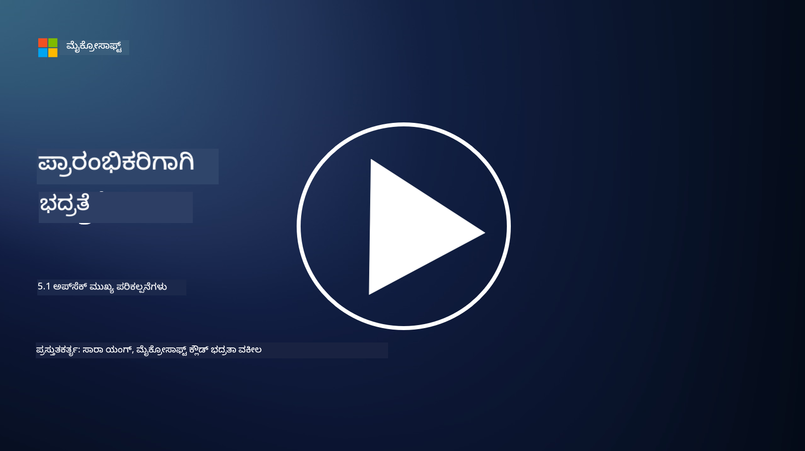

<!--
CO_OP_TRANSLATOR_METADATA:
{
  "original_hash": "e4b56bb23078d3ffb7ad407d280b0c36",
  "translation_date": "2025-12-19T13:00:58+00:00",
  "source_file": "5.1 AppSec key concepts.md",
  "language_code": "kn"
}
-->
# AppSec ಮುಖ್ಯ ತತ್ವಗಳು

ಅಪ್ಲಿಕೇಶನ್ ಭದ್ರತೆ ತನ್ನದೇ ಆದ ವಿಶೇಷತೆಯಾಗಿದೆ. ಈ ಪಾಠದಲ್ಲಿ ನಾವು ಅಪ್ಲಿಕೇಶನ್ ಭದ್ರತೆಯ ಬಗ್ಗೆ ಹೆಚ್ಚು ತಿಳಿದುಕೊಳ್ಳುತ್ತೇವೆ.

## ಪರಿಚಯ

ಈ ಪಾಠದಲ್ಲಿ ನಾವು ಈ ವಿಷಯಗಳನ್ನು ಆವರಿಸುತ್ತೇವೆ:

- ಅಪ್ಲಿಕೇಶನ್ ಭದ್ರತೆ ಎಂದರೇನು?

- ಅಪ್ಲಿಕೇಶನ್ ಭದ್ರತೆಯ ಪ್ರಮುಖ ತತ್ವಗಳು/ಸಿದ್ಧಾಂತಗಳು ಯಾವುವು?

## ಅಪ್ಲಿಕೇಶನ್ ಭದ್ರತೆ ಎಂದರೇನು?

ಅಪ್ಲಿಕೇಶನ್ ಭದ್ರತೆ, ಸಾಮಾನ್ಯವಾಗಿ "AppSec" ಎಂದು ಸಂಕ್ಷಿಪ್ತವಾಗಿ ಕರೆಯಲಾಗುತ್ತದೆ, ಇದು ಸಾಫ್ಟ್‌ವೇರ್ ಅಪ್ಲಿಕೇಶನ್‌ಗಳನ್ನು ಭದ್ರತಾ ಬೆದರಿಕೆಗಳು, ದುರ್ಬಲತೆಗಳು ಮತ್ತು ದಾಳಿಗಳಿಂದ ರಕ್ಷಿಸುವ ಅಭ್ಯಾಸವನ್ನು ಸೂಚಿಸುತ್ತದೆ. ಇದು ಅಪ್ಲಿಕೇಶನ್‌ನ ಅಭಿವೃದ್ಧಿ, ನಿಯೋಜನೆ ಮತ್ತು ನಿರ್ವಹಣಾ ಜೀವನಚಕ್ರದಾದ್ಯಂತ ಭದ್ರತಾ ಅಪಾಯಗಳನ್ನು ಗುರುತಿಸಲು, ತಡೆಗಟ್ಟಲು ಮತ್ತು ತಡೆಯಲು ಬಳಸುವ ಪ್ರಕ್ರಿಯೆಗಳು, ತಂತ್ರಗಳು ಮತ್ತು ಸಾಧನಗಳನ್ನು ಒಳಗೊಂಡಿದೆ.

ಅಪ್ಲಿಕೇಶನ್ ಭದ್ರತೆ ಅತ್ಯಂತ ಮುಖ್ಯವಾಗಿದೆ ಏಕೆಂದರೆ ಅಪ್ಲಿಕೇಶನ್‌ಗಳು ಸೈಬರ್ ದಾಳಿಗಳಿಗೆ ಸಾಮಾನ್ಯ ಗುರಿಯಾಗಿರುತ್ತವೆ. ದುಷ್ಕೃತ್ಯಕಾರರು ಸಾಫ್ಟ್‌ವೇರ್‌ನ ದುರ್ಬಲತೆಗಳು ಮತ್ತು ದೌರ್ಬಲ್ಯಗಳನ್ನು ದುರುಪಯೋಗಪಡಿಸಿಕೊಂಡು ಅನಧಿಕೃತ ಪ್ರವೇಶ ಪಡೆಯಲು, ಡೇಟಾವನ್ನು ಕದಿಯಲು, ಸೇವೆಗಳನ್ನು ಅಡಚಣೆಗೊಳಿಸಲು ಅಥವಾ ಇತರ ದುಷ್ಕೃತ್ಯಗಳನ್ನು ನಡೆಸಲು ಪ್ರಯತ್ನಿಸುತ್ತಾರೆ. ಪರಿಣಾಮಕಾರಿ ಅಪ್ಲಿಕೇಶನ್ ಭದ್ರತೆ ಅಪ್ಲಿಕೇಶನ್ ಮತ್ತು ಅದರ ಸಂಬಂಧಿತ ಡೇಟಾದ ಗೌಪ್ಯತೆ, ಅಖಂಡತೆ ಮತ್ತು ಲಭ್ಯತೆಯನ್ನು ಖಚಿತಪಡಿಸುತ್ತದೆ.

## ಅಪ್ಲಿಕೇಶನ್ ಭದ್ರತೆಯ ಪ್ರಮುಖ ತತ್ವಗಳು/ಸಿದ್ಧಾಂತಗಳು ಯಾವುವು?

ಅಪ್ಲಿಕೇಶನ್ ಭದ್ರತೆಯನ್ನು ಆಧರಿಸುವ ಪ್ರಮುಖ ತತ್ವಗಳು ಮತ್ತು ಸಿದ್ಧಾಂತಗಳು:

1. **ಡಿಸೈನ್‌ನಿಂದಲೇ ಭದ್ರತೆ**:

- ಭದ್ರತೆಯನ್ನು ಅಪ್ಲಿಕೇಶನ್‌ನ ವಿನ್ಯಾಸ ಮತ್ತು ಆರ್ಕಿಟೆಕ್ಚರ್‌ನಲ್ಲಿ ಪ್ರಾರಂಭದಿಂದಲೇ ಅಳವಡಿಸಬೇಕು, ನಂತರದ ಹಂತದಲ್ಲಿ ಸೇರಿಸುವ ಬದಲು.

2. **ಇನ್‌ಪುಟ್ ಮಾನ್ಯತೆ**:

- ಎಲ್ಲಾ ಬಳಕೆದಾರರ ಇನ್‌ಪುಟ್‌ಗಳನ್ನು ಪರಿಶೀಲಿಸಿ, ಅವು ನಿರೀಕ್ಷಿತ ಸ್ವರೂಪಗಳಿಗೆ ಅನುಗುಣವಾಗಿರುವುದನ್ನು ಮತ್ತು ದುಷ್ಕೃತ್ಯ ಕೋಡ್ ಅಥವಾ ಡೇಟಾವಿಲ್ಲದಿರುವುದನ್ನು ಖಚಿತಪಡಿಸಿಕೊಳ್ಳಿ.

3. **ಔಟ್‌ಪುಟ್ ಎನ್‌ಕೋಡಿಂಗ್**:

- ಕ್ಲೈಂಟ್‌ಗೆ ಕಳುಹಿಸುವ ಡೇಟಾವನ್ನು ಸರಿಯಾಗಿ ಎನ್‌ಕೋಡ್ ಮಾಡಿ, ಕ್ರಾಸ್-ಸೈಟ್ ಸ್ಕ್ರಿಪ್ಟಿಂಗ್ (XSS) ಮುಂತಾದ ದುರ್ಬಲತೆಗಳನ್ನು ತಡೆಯಲು.

4. **ಪ್ರಮಾಣೀಕರಣ ಮತ್ತು ಅನುಮತಿ**:

- ಬಳಕೆದಾರರನ್ನು ಪ್ರಮಾಣೀಕರಿಸಿ ಮತ್ತು ಅವರ ಪಾತ್ರಗಳು ಮತ್ತು ಅನುಮತಿಗಳ ಆಧಾರದ ಮೇಲೆ ಸಂಪತ್ತಿಗೆ ಪ್ರವೇಶವನ್ನು ಅನುಮತಿಸಿ.

5. **ಡೇಟಾ ರಕ್ಷಣೆ**:

- ಸಂವೇದನಶೀಲ ಡೇಟಾವನ್ನು ಸಂಗ್ರಹಿಸುವಾಗ, ಪ್ರಸಾರ ಮಾಡುವಾಗ ಮತ್ತು ಪ್ರಕ್ರಿಯೆಗೊಳಿಸುವಾಗ ಎನ್‌ಕ್ರಿಪ್ಟ್ ಮಾಡಿ, ಅನಧಿಕೃತ ಪ್ರವೇಶವನ್ನು ತಡೆಯಲು.

6. **ಸೆಷನ್ ನಿರ್ವಹಣೆ**:

- ಸುರಕ್ಷಿತ ಸೆಷನ್ ನಿರ್ವಹಣೆ ಬಳಕೆದಾರರ ಸೆಷನ್‌ಗಳನ್ನು ಹೈಜಾಕ್ ಮತ್ತು ಅನಧಿಕೃತ ಪ್ರವೇಶದಿಂದ ರಕ್ಷಿಸುತ್ತದೆ.

7. **ಭದ್ರತೆಯ ಅವಲಂಬನೆಗಳು**:

- ಎಲ್ಲಾ ಸಾಫ್ಟ್‌ವೇರ್ ಅವಲಂಬನೆಗಳನ್ನು ಭದ್ರತಾ ಪ್ಯಾಚ್‌ಗಳೊಂದಿಗೆ ನವೀಕರಿಸಿ, ದುರ್ಬಲತೆಗಳನ್ನು ತಡೆಯಲು.

8. **ದೋಷ ನಿರ್ವಹಣೆ ಮತ್ತು ಲಾಗಿಂಗ್**:

- ಸಂವೇದನಶೀಲ ಮಾಹಿತಿಯನ್ನು ಬಹಿರಂಗಪಡಿಸದಂತೆ ಸುರಕ್ಷಿತ ದೋಷ ನಿರ್ವಹಣೆಯನ್ನು ಜಾರಿಗೆ ತಂದು, ಸುರಕ್ಷಿತ ಲಾಗಿಂಗ್ ಅಭ್ಯಾಸಗಳನ್ನು ಅನುಸರಿಸಿ.

9. **ಭದ್ರತಾ ಪರೀಕ್ಷೆ**:

- ಪೆನೆಟ್ರೇಶನ್ ಟೆಸ್ಟಿಂಗ್, ಕೋಡ್ ವಿಮರ್ಶೆಗಳು ಮತ್ತು ಸ್ವಯಂಚಾಲಿತ ಸ್ಕ್ಯಾನಿಂಗ್ ಸಾಧನಗಳಂತಹ ವಿಧಾನಗಳನ್ನು ಬಳಸಿಕೊಂಡು ಅಪ್ಲಿಕೇಶನ್‌ಗಳನ್ನು ನಿಯಮಿತವಾಗಿ ಪರೀಕ್ಷಿಸಿ.

10. **ಭದ್ರ ಸಾಫ್ಟ್‌ವೇರ್ ಅಭಿವೃದ್ಧಿ ಜೀವನಚಕ್ರ (SDLC)**:

- ಸಾಫ್ಟ್‌ವೇರ್ ಅಭಿವೃದ್ಧಿ ಜೀವನಚಕ್ರದ ಪ್ರತಿಯೊಂದು ಹಂತದಲ್ಲಿ, ಅಗತ್ಯಗಳಿಂದ ನಿಯೋಜನೆ ಮತ್ತು ನಿರ್ವಹಣೆವರೆಗೆ, ಭದ್ರತಾ ಅಭ್ಯಾಸಗಳನ್ನು ಅಳವಡಿಸಿ.

## ಹೆಚ್ಚಿನ ಓದು

- [SheHacksPurple: What is Application Security? - YouTube](https://www.youtube.com/watch?v=eNmccQNzSSY)
- [What Is Application Security? - Cisco](https://www.cisco.com/c/en/us/solutions/security/application-first-security/what-is-application-security.html#~how-does-it-work)
- [What is application security? A process and tools for securing software | CSO Online](https://www.csoonline.com/article/566471/what-is-application-security-a-process-and-tools-for-securing-software.html)
- [OWASP Cheat Sheet Series | OWASP Foundation](https://owasp.org/www-project-cheat-sheets/)

---

<!-- CO-OP TRANSLATOR DISCLAIMER START -->
**ಅಸಮೀಕ್ಷೆ**:  
ಈ ದಾಖಲೆ [Co-op Translator](https://github.com/Azure/co-op-translator) ಎಂಬ AI ಅನುವಾದ ಸೇವೆಯನ್ನು ಬಳಸಿಕೊಂಡು ಅನುವಾದಿಸಲಾಗಿದೆ. ನಾವು ನಿಖರತೆಯನ್ನು ಸಾಧಿಸಲು ಪ್ರಯತ್ನಿಸುತ್ತಿದ್ದರೂ, ದಯವಿಟ್ಟು ಗಮನಿಸಿ, ಸ್ವಯಂಚಾಲಿತ ಅನುವಾದಗಳಲ್ಲಿ ದೋಷಗಳು ಅಥವಾ ಅಸಮರ್ಪಕತೆಗಳು ಇರಬಹುದು. ಮೂಲ ಭಾಷೆಯಲ್ಲಿರುವ ಮೂಲ ದಾಖಲೆ ಪ್ರಾಮಾಣಿಕ ಮೂಲವಾಗಿ ಪರಿಗಣಿಸಬೇಕು. ಪ್ರಮುಖ ಮಾಹಿತಿಗಾಗಿ, ವೃತ್ತಿಪರ ಮಾನವ ಅನುವಾದವನ್ನು ಶಿಫಾರಸು ಮಾಡಲಾಗುತ್ತದೆ. ಈ ಅನುವಾದದ ಬಳಕೆಯಿಂದ ಉಂಟಾಗುವ ಯಾವುದೇ ತಪ್ಪುಅರ್ಥಗಳು ಅಥವಾ ತಪ್ಪುಅನುವಾದಗಳಿಗೆ ನಾವು ಹೊಣೆಗಾರರಾಗುವುದಿಲ್ಲ.
<!-- CO-OP TRANSLATOR DISCLAIMER END -->