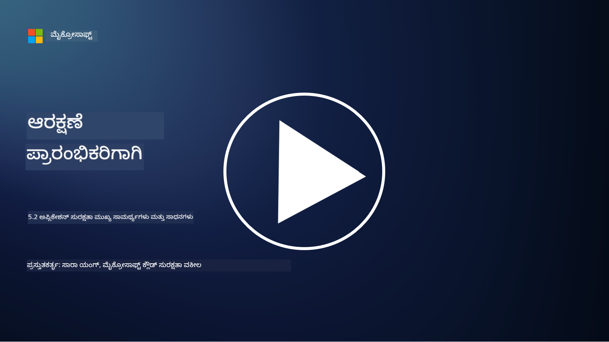

<!--
CO_OP_TRANSLATOR_METADATA:
{
  "original_hash": "790a3fa7e535ec60bb51bde13e759781",
  "translation_date": "2025-12-19T13:40:14+00:00",
  "source_file": "5.2 AppSec key capabilities.md",
  "language_code": "kn"
}
-->
ಈ ವಿಭಾಗದಲ್ಲಿ, ಅಪ್ಲಿಕೇಶನ್ ಭದ್ರತೆಯಲ್ಲಿ ಬಳಸುವ ಪ್ರಮುಖ ಸಾಧನಗಳು ಮತ್ತು ಸಾಮರ್ಥ್ಯಗಳ ಬಗ್ಗೆ ಹೆಚ್ಚಿನ ವಿವರಗಳನ್ನು ನಾವು ಚರ್ಚಿಸುತ್ತೇವೆ:

## ಪರಿಚಯ

ಈ ಪಾಠದಲ್ಲಿ, ಅಪ್ಲಿಕೇಶನ್ ಭದ್ರತೆಯಲ್ಲಿ ಬಳಸುವ ಪ್ರಮುಖ ಸಾಮರ್ಥ್ಯಗಳು ಮತ್ತು ಸಾಧನಗಳು ಯಾವುವು ಎಂಬುದನ್ನು ನಾವು ಚರ್ಚಿಸುತ್ತೇವೆ.

## ಅಪ್ಲಿಕೇಶನ್ ಭದ್ರತೆಯ ಪ್ರಮುಖ ಸಾಮರ್ಥ್ಯಗಳು ಮತ್ತು ಸಾಧನಗಳು

ಅಪ್ಲಿಕೇಶನ್ ಭದ್ರತೆಯಲ್ಲಿ ಬಳಸುವ ಪ್ರಮುಖ ಸಾಮರ್ಥ್ಯಗಳು ಮತ್ತು ಸಾಧನಗಳು ಸಾಫ್ಟ್‌ವೇರ್ ಅಪ್ಲಿಕೇಶನ್‌ಗಳಲ್ಲಿ ಭದ್ರತಾ ದುರ್ಬಲತೆಗಳು ಮತ್ತು ಬೆದರಿಕೆಗಳನ್ನು ಗುರುತಿಸಲು, ತಡೆಗಟ್ಟಲು ಮತ್ತು ತಡೆಹಿಡಿಯಲು ಅಗತ್ಯವಿದೆ. ಇಲ್ಲಿವೆ ಕೆಲವು ಪ್ರಮುಖವುಗಳು:

**1. ಸ್ಟ್ಯಾಟಿಕ್ ಅಪ್ಲಿಕೇಶನ್ ಸೆಕ್ಯುರಿಟಿ ಟೆಸ್ಟಿಂಗ್ (SAST):**

- **ಸಾಮರ್ಥ್ಯಗಳು**: ಅಪ್ಲಿಕೇಶನ್‌ನ ಕೋಡ್‌ಬೇಸ್‌ನಲ್ಲಿ ಭದ್ರತಾ ದುರ್ಬಲತೆಗಳನ್ನು ಗುರುತಿಸಲು ಮೂಲ ಕೋಡ್, ಬೈಟ್‌ಕೋಡ್ ಅಥವಾ ಬೈನರಿ ಕೋಡ್ ಅನ್ನು ವಿಶ್ಲೇಷಿಸುತ್ತದೆ.

- **ಸಾಧನಗಳು**: ಉದಾಹರಣೆಗಳು: Fortify, Checkmarx, Veracode.

**2. ಡೈನಾಮಿಕ್ ಅಪ್ಲಿಕೇಶನ್ ಸೆಕ್ಯುರಿಟಿ ಟೆಸ್ಟಿಂಗ್ (DAST):**

- **ಸಾಮರ್ಥ್ಯಗಳು**: ರನ್ನಿಂಗ್ ಅಪ್ಲಿಕೇಶನ್ ಅನ್ನು ಸ್ಕ್ಯಾನ್ ಮಾಡಿ, ಇನ್‌ಪುಟ್ ವಿನಂತಿಗಳನ್ನು ಕಳುಹಿಸುವ ಮೂಲಕ ಮತ್ತು ಪ್ರತಿಕ್ರಿಯೆಗಳನ್ನು ವಿಶ್ಲೇಷಿಸುವ ಮೂಲಕ ದುರ್ಬಲತೆಗಳನ್ನು ಗುರುತಿಸುತ್ತದೆ.

- **ಸಾಧನಗಳು**: ಉದಾಹರಣೆಗಳು: ZAP, Burp Suite, Qualys Web Application Scanning.

**3. ಇಂಟರಾಕ್ಟಿವ್ ಅಪ್ಲಿಕೇಶನ್ ಸೆಕ್ಯುರಿಟಿ ಟೆಸ್ಟಿಂಗ್ (IAST):**

- **ಸಾಮರ್ಥ್ಯಗಳು**: SAST ಮತ್ತು DAST ಅಂಶಗಳನ್ನು ಸಂಯೋಜಿಸಿ, ರನ್‌ಟೈಮ್‌ನಲ್ಲಿ ಕೋಡ್ ಅನ್ನು ವಿಶ್ಲೇಷಿಸುತ್ತದೆ, ಹೆಚ್ಚು ನಿಖರವಾದ ಫಲಿತಾಂಶಗಳನ್ನು ಒದಗಿಸುತ್ತದೆ ಮತ್ತು ತಪ್ಪು ಪಾಸಿಟಿವ್‌ಗಳನ್ನು ಕಡಿಮೆ ಮಾಡುತ್ತದೆ.

- **ಸಾಧನಗಳು**: ಉದಾಹರಣೆಗಳು: Contrast Security, HCL AppScan.

**4. ರನ್‌ಟೈಮ್ ಅಪ್ಲಿಕೇಶನ್ ಸೆಲ್ಫ್-ಪ್ರೊಟೆಕ್ಷನ್ (RASP):**

- **ಸಾಮರ್ಥ್ಯಗಳು**: ಅಪ್ಲಿಕೇಶನ್‌ಗಳನ್ನು ರಿಯಲ್-ಟೈಮ್‌ನಲ್ಲಿ ಮೇಲ್ವಿಚಾರಣೆ ಮಾಡುತ್ತದೆ ಮತ್ತು ರಕ್ಷಿಸುತ್ತದೆ, ಭದ್ರತಾ ಬೆದರಿಕೆಗಳನ್ನು ಸಂಭವಿಸುವಾಗಲೇ ಪತ್ತೆಹಚ್ಚಿ ಪ್ರತಿಕ್ರಿಯಿಸುತ್ತದೆ.

- **ಸಾಧನಗಳು**: ಉದಾಹರಣೆಗಳು: Veracode Runtime Protection, F5 Advanced WAF with RASP.

**5. ವೆಬ್ ಅಪ್ಲಿಕೇಶನ್ ಫೈರ್‌ವಾಲ್‌ಗಳು (WAFs):**

- **ಸಾಮರ್ಥ್ಯಗಳು**: ಅಪ್ಲಿಕೇಶನ್ ಮತ್ತು ಇಂಟರ್ನೆಟ್ ನಡುವೆ ರಕ್ಷಣೆ ಲೇಯರ್ ಒದಗಿಸುತ್ತದೆ, ಒಳಬರುವ ಟ್ರಾಫಿಕ್ ಅನ್ನು ಫಿಲ್ಟರ್ ಮಾಡುತ್ತದೆ ಮತ್ತು ದುಷ್ಟ ವಿನಂತಿಗಳನ್ನು ತಡೆಹಿಡಿಯುತ್ತದೆ.

- **ಸಾಧನಗಳು**: ಉದಾಹರಣೆಗಳು: ModSecurity, AWS WAF, Akamai Kona Site Defender.

**6. ಡಿಪೆಂಡೆನ್ಸಿ ಸ್ಕ್ಯಾನಿಂಗ್:**

- **ಸಾಮರ್ಥ್ಯಗಳು**: ಅಪ್ಲಿಕೇಶನ್‌ನಲ್ಲಿ ಬಳಸುವ ತೃತೀಯ-ಪಕ್ಷದ ಲೈಬ್ರರಿಗಳು ಮತ್ತು ಘಟಕಗಳಲ್ಲಿ ದುರ್ಬಲತೆಗಳನ್ನು ಗುರುತಿಸುತ್ತದೆ.

- **ಸಾಧನಗಳು**: ಉದಾಹರಣೆಗಳು: OWASP Dependency-Check, Snyk.

**7. ಪೆನೆಟ್ರೇಶನ್ ಟೆಸ್ಟಿಂಗ್ (ಪೆನ್ ಟೆಸ್ಟಿಂಗ್):**

- **ಸಾಮರ್ಥ್ಯಗಳು**: ನಿಜಜೀವನದ ದಾಳಿಗಳನ್ನು ಅನುಕರಿಸಿ, ದುರ್ಬಲತೆಗಳನ್ನು ಪತ್ತೆಹಚ್ಚಲು ಮತ್ತು ಅಪ್ಲಿಕೇಶನ್‌ನ ಭದ್ರತೆಯನ್ನು ಮೌಲ್ಯಮಾಪನ ಮಾಡಲು.

- **ಸಾಧನಗಳು**: ಪ್ರಮಾಣಿತ ಎಥಿಕಲ್ ಹ್ಯಾಕರ್‌ಗಳು ಮತ್ತು ಭದ್ರತಾ ತಜ್ಞರು Metasploit, Nmap ಮುಂತಾದ ಸಾಧನಗಳನ್ನು ಬಳಸುತ್ತಾರೆ.

**8. ಭದ್ರತಾ ಸ್ಕ್ಯಾನಿಂಗ್ ಮತ್ತು ವಿಶ್ಲೇಷಣೆ:**

- **ಸಾಮರ್ಥ್ಯಗಳು**: ಪರಿಚಿತ ದುರ್ಬಲತೆಗಳು, ಕಾನ್ಫಿಗರೇಶನ್ ದೋಷಗಳು ಮತ್ತು ಭದ್ರತಾ ತಪ್ಪು ಕಾನ್ಫಿಗರೇಶನ್‌ಗಳನ್ನು ಸ್ಕ್ಯಾನ್ ಮಾಡುತ್ತದೆ.

- **ಸಾಧನಗಳು**: ಉದಾಹರಣೆಗಳು: Nessus, Qualys Vulnerability Management, OpenVAS.

**9. ಕಂಟೈನರ್ ಭದ್ರತಾ ಸಾಧನಗಳು:**

- **ಸಾಮರ್ಥ್ಯಗಳು**: ಕಂಟೈನರ್‌ಗೊಳಿಸಿದ ಅಪ್ಲಿಕೇಶನ್‌ಗಳು ಮತ್ತು ಅವುಗಳ ಪರಿಸರಗಳನ್ನು ಭದ್ರಗೊಳಿಸಲು ಕೇಂದ್ರೀಕರಿಸುತ್ತದೆ.

- **ಸಾಧನಗಳು**: ಉದಾಹರಣೆಗಳು: Docker Security Scanning, Aqua Security.

**10. ಭದ್ರ ಅಭಿವೃದ್ಧಿ ತರಬೇತಿ:**

- **ಸಾಮರ್ಥ್ಯಗಳು**: ಅಭಿವೃದ್ಧಿ ತಂಡಗಳಿಗೆ ಭದ್ರ ಕೋಡಿಂಗ್ ಅಭ್ಯಾಸಗಳನ್ನು ಉತ್ತೇಜಿಸಲು ತರಬೇತಿ ಮತ್ತು ಜಾಗೃತಿಯ ಕಾರ್ಯಕ್ರಮಗಳನ್ನು ಒದಗಿಸುತ್ತದೆ.

- **ಸಾಧನಗಳು**: ಕಸ್ಟಮೈಸ್ ಮಾಡಿದ ತರಬೇತಿ ಕಾರ್ಯಕ್ರಮಗಳು ಮತ್ತು ವೇದಿಕೆಗಳು.

**11. ಭದ್ರತಾ ಪರೀಕ್ಷಾ ಫ್ರೇಮ್‌ವರ್ಕ್‌ಗಳು:**

- **ಸಾಮರ್ಥ್ಯಗಳು**: ವಿಭಿನ್ನ ಅಪ್ಲಿಕೇಶನ್ ಭದ್ರತಾ ಪರೀಕ್ಷಾ ಅಗತ್ಯಗಳಿಗೆ ಸಮಗ್ರ ಪರೀಕ್ಷಾ ಫ್ರೇಮ್‌ವರ್ಕ್‌ಗಳನ್ನು ಒದಗಿಸುತ್ತದೆ.

- **ಸಾಧನಗಳು**: OWASP Amass, OWASP OWTF, FrAppSec.

**12. ಭದ್ರ ಕೋಡ್ ವಿಮರ್ಶಾ ಸಾಧನಗಳು:**

- **ಸಾಮರ್ಥ್ಯಗಳು**: ಮೂಲ ಕೋಡ್ ಅನ್ನು ಭದ್ರತಾ ದುರ್ಬಲತೆಗಳು ಮತ್ತು ಕೋಡಿಂಗ್ ಉತ್ತಮ ಅಭ್ಯಾಸಗಳಿಗಾಗಿ ವಿಮರ್ಶಿಸುತ್ತದೆ.

- **ಸಾಧನಗಳು**: ಉದಾಹರಣೆಗಳು: SonarQube, Checkmarx.

**13. ಭದ್ರ APIಗಳು ಮತ್ತು ಮೈಕ್ರೋಸರ್ವಿಸ್‌ಗಳ ಸಾಧನಗಳು:**

- **ಸಾಮರ್ಥ್ಯಗಳು**: APIಗಳು ಮತ್ತು ಮೈಕ್ರೋಸರ್ವಿಸ್‌ಗಳನ್ನು ಭದ್ರಗೊಳಿಸಲು ಕೇಂದ್ರೀಕರಿಸುತ್ತದೆ, ಇದರಲ್ಲಿ ಪ್ರಾಮಾಣೀಕರಣ, ಅನುಮತಿ ಮತ್ತು ಡೇಟಾ ರಕ್ಷಣೆ ಸೇರಿವೆ.

- **ಸಾಧನಗಳು**: ಉದಾಹರಣೆಗಳು: Apigee, AWS API Gateway, Istio.

## ಹೆಚ್ಚಿನ ಓದು

- [ಅಪ್ಲಿಕೇಶನ್ ಭದ್ರತೆ ಎಂದರೇನು? ಪರಿಕಲ್ಪನೆಗಳು, ಸಾಧನಗಳು ಮತ್ತು ಉತ್ತಮ ಅಭ್ಯಾಸಗಳು | HackerOne](https://www.hackerone.com/knowledge-center/what-application-security-concepts-tools-best-practices)
- [IAST ಎಂದರೇನು? (ಇಂಟರಾಕ್ಟಿವ್ ಅಪ್ಲಿಕೇಶನ್ ಸೆಕ್ಯುರಿಟಿ ಟೆಸ್ಟಿಂಗ್) (comparitech.com)](https://www.comparitech.com/net-admin/what-is-iast/)
- [ಅಪ್ಲಿಕೇಶನ್ ಭದ್ರತಾ ಪರೀಕ್ಷಾ ಸಾಧನಗಳ 10 ಪ್ರಕಾರಗಳು: ಯಾವಾಗ ಮತ್ತು ಹೇಗೆ ಬಳಸುವುದು (cmu.edu)](https://insights.sei.cmu.edu/blog/10-types-of-application-security-testing-tools-when-and-how-to-use-them/)
- [ಸೈಬರ್ ಭದ್ರತಾ ಅಪಾಯದ ಸಮತೋಲನವನ್ನು ಬದಲಾಯಿಸುವುದು: ಡಿಸೈನ್ ಮತ್ತು ಡೀಫಾಲ್ಟ್ ಮೂಲಕ ಭದ್ರತೆಯ ತತ್ವಗಳು ಮತ್ತು ವಿಧಾನಗಳು | Cyber.gov.au](https://www.cyber.gov.au/about-us/view-all-content/publications/principles-and-approaches-for-security-by-design-and-default)

---

<!-- CO-OP TRANSLATOR DISCLAIMER START -->
**ಅಸ್ವೀಕಾರ**:  
ಈ ದಸ್ತಾವೇಜು AI ಅನುವಾದ ಸೇವೆ [Co-op Translator](https://github.com/Azure/co-op-translator) ಬಳಸಿ ಅನುವಾದಿಸಲಾಗಿದೆ. ನಾವು ನಿಖರತೆಯಿಗಾಗಿ ಪ್ರಯತ್ನಿಸುತ್ತಿದ್ದರೂ, ದಯವಿಟ್ಟು ಗಮನಿಸಿ, ಸ್ವಯಂಚಾಲಿತ ಅನುವಾದಗಳಲ್ಲಿ ದೋಷಗಳು ಅಥವಾ ಅಸಡ್ಡೆಗಳು ಇರಬಹುದು. ಮೂಲ ಭಾಷೆಯಲ್ಲಿರುವ ಮೂಲ ದಸ್ತಾವೇಜು ಪ್ರಾಮಾಣಿಕ ಮೂಲವೆಂದು ಪರಿಗಣಿಸಬೇಕು. ಮಹತ್ವದ ಮಾಹಿತಿಗಾಗಿ, ವೃತ್ತಿಪರ ಮಾನವ ಅನುವಾದವನ್ನು ಶಿಫಾರಸು ಮಾಡಲಾಗುತ್ತದೆ. ಈ ಅನುವಾದವನ್ನು ಬಳಸುವ ಮೂಲಕ ಉಂಟಾಗುವ ಯಾವುದೇ ತಪ್ಪು ಅರ್ಥಗಳು ಅಥವಾ ತಪ್ಪು ವ್ಯಾಖ್ಯಾನಗಳಿಗೆ ನಾವು ಹೊಣೆಗಾರರಲ್ಲ.
<!-- CO-OP TRANSLATOR DISCLAIMER END -->