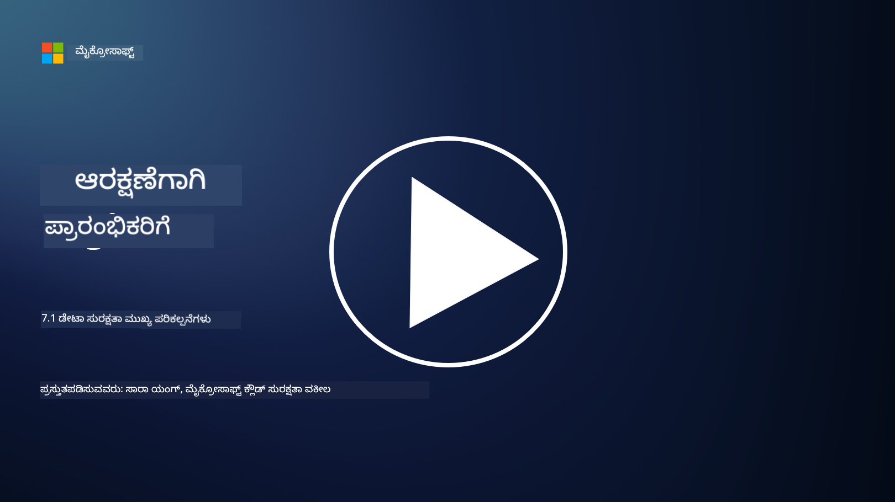

<!--
CO_OP_TRANSLATOR_METADATA:
{
  "original_hash": "983ca582b7177c02947bb0803fc362d4",
  "translation_date": "2025-12-19T12:28:31+00:00",
  "source_file": "7.1 Data security key concepts.md",
  "language_code": "kn"
}
-->
# ಡೇಟಾ ಭದ್ರತಾ ಮುಖ್ಯ ತತ್ವಗಳು

ಈ ಪಾಠದಲ್ಲಿ ನಾವು ಡೇಟಾ ಭದ್ರತೆಯನ್ನು ಹಲವು ಬಾರಿ ಉಲ್ಲೇಖಿಸಿದ್ದೇವೆ ಮತ್ತು ಸ್ಪರ್ಶಿಸಿದ್ದೇವೆ. ಈಗ, ಈ ವಿಷಯವನ್ನು ಹೆಚ್ಚು ಆಳವಾಗಿ ತಿಳಿಯೋಣ. ಈ ಪಾಠದಲ್ಲಿ ನೀವು ಕಲಿಯುವಿರಿ:

- ಡೇಟಾ ಭದ್ರತೆ ಎಂದರೇನು?

- ಡೇಟಾ ವರ್ಗೀಕರಣ ಎಂದರೇನು?

- ಡೇಟಾ ಜೀವನಚಕ್ರ ನಿರ್ವಹಣೆ ಎಂದರೇನು?

- ಡೇಟಾ ನಷ್ಟ ತಡೆಗಟ್ಟುವಿಕೆ (DLP) ಎಂದರೇನು?

- ಡೇಟಾ ಭದ್ರತೆ ಒಂದು ಸಂಸ್ಥೆಗೆ ಏಕೆ ಮುಖ್ಯ?

## ಡೇಟಾ ಭದ್ರತೆ ಎಂದರೇನು?

**ಡೇಟಾ ಭದ್ರತೆ** ಎಂದರೆ ಡಿಜಿಟಲ್ ಡೇಟಾ, ಉದಾಹರಣೆಗೆ ಡೇಟಾಬೇಸ್‌ಗಳು, ಫೈಲ್‌ಗಳು ಮತ್ತು ಸಂವೇದನಾಶೀಲ ಮಾಹಿತಿಯನ್ನು ಅನಧಿಕೃತ ಪ್ರವೇಶ, ಬಹಿರಂಗಪಡಿಸುವಿಕೆ, ಬದಲಾವಣೆ ಅಥವಾ ನಾಶದಿಂದ ರಕ್ಷಿಸುವ ಅಭ್ಯಾಸ. ಡೇಟಾ ಭದ್ರತೆಯ ಪ್ರಾಥಮಿಕ ಉದ್ದೇಶವು ಡೇಟಾದ ಗೌಪ್ಯತೆ, ಅಖಂಡತೆ ಮತ್ತು ಲಭ್ಯತೆಯನ್ನು ಖಚಿತಪಡಿಸಿಕೊಳ್ಳುವುದು. ಇದರಲ್ಲಿ ತಾಂತ್ರಿಕ, ಆಡಳಿತಾತ್ಮಕ ಮತ್ತು ಭೌತಿಕ ಭದ್ರತಾ ಕ್ರಮಗಳನ್ನು ಜಾರಿಗೆ ತಂದು ಸೈಬರ್ ದಾಳಿ, ಒಳಗಿನಿಂದ ಉಂಟಾಗುವ ಅಪಾಯಗಳು ಮತ್ತು ಡೇಟಾ ಉಲ್ಲಂಘನೆಗಳಂತಹ ವಿವಿಧ ಅಪಾಯಗಳು ಮತ್ತು ದುರ್ಬಲತೆಗಳಿಂದ ಡೇಟಾವನ್ನು ರಕ್ಷಿಸುವುದು ಒಳಗೊಂಡಿದೆ. ಡೇಟಾ ಭದ್ರತಾ ಕ್ರಮಗಳಲ್ಲಿ ಎನ್‌ಕ್ರಿಪ್ಷನ್, ಪ್ರವೇಶ ನಿಯಂತ್ರಣಗಳು, ದೃಢೀಕರಣ, ಆಡಿಟ್ ಟ್ರೇಲ್‌ಗಳು ಮತ್ತು ಭದ್ರತಾ ನೀತಿಗಳು ಸೇರಿರಬಹುದು.

## ಡೇಟಾ ವರ್ಗೀಕರಣ ಎಂದರೇನು?

**ಡೇಟಾ ವರ್ಗೀಕರಣ** ಎಂದರೆ ಡೇಟಾವನ್ನು ಅದರ ಸಂವೇದನಾಶೀಲತೆ, ಮೌಲ್ಯ ಮತ್ತು ಸಂಸ್ಥೆಗೆ ಇರುವ ಮಹತ್ವದ ಆಧಾರದ ಮೇಲೆ ವರ್ಗೀಕರಿಸುವ ಪ್ರಕ್ರಿಯೆ. ಡೇಟಾ ವರ್ಗೀಕರಣದ ಉದ್ದೇಶವು ಸಂಸ್ಥೆಗಳಿಗೆ ವಿಭಿನ್ನ ಪ್ರಕಾರದ ಡೇಟಾವನ್ನು ಗುರುತಿಸಲು ಮತ್ತು ರಕ್ಷಣೆ ಮತ್ತು ನಿರ್ವಹಣೆಗೆ ಆದ್ಯತೆ ನೀಡಲು ಸಹಾಯ ಮಾಡುವುದು. ಸಾಮಾನ್ಯ ಡೇಟಾ ವರ್ಗೀಕರಣ ವರ್ಗಗಳು "ಸಾರ್ವಜನಿಕ," "ಆಂತರಿಕ," "ಗೌಪ್ಯ," ಮತ್ತು "ನಿಯಂತ್ರಿತ" ಅಥವಾ "ಅತ್ಯಂತ ಗೌಪ್ಯ" ಅನ್ನು ಒಳಗೊಂಡಿರುತ್ತವೆ. ಡೇಟಾವನ್ನು ವರ್ಗೀಕರಿಸಿದ ನಂತರ, ಸಂಸ್ಥೆಗಳು ಸೂಕ್ತ ಭದ್ರತಾ ನಿಯಂತ್ರಣಗಳು ಮತ್ತು ಪ್ರವೇಶ ನಿರ್ಬಂಧಗಳನ್ನು ಅನ್ವಯಿಸಬಹುದು, ಇದರಿಂದ ಸಂವೇದನಾಶೀಲ ಡೇಟಾ ಸಮರ್ಪಕವಾಗಿ ರಕ್ಷಿತವಾಗಿರುತ್ತದೆ ಮತ್ತು ನಿಯಮಾತ್ಮಕ ಅವಶ್ಯಕತೆಗಳಿಗೆ ಅನುಗುಣವಾಗಿರುತ್ತದೆ.

## ಡೇಟಾ ಜೀವನಚಕ್ರ ನಿರ್ವಹಣೆ ಎಂದರೇನು?

**ಡೇಟಾ ಜೀವನಚಕ್ರ ನಿರ್ವಹಣೆ** ಎಂದರೆ ಡೇಟಾವನ್ನು ಅದರ ಸಂಪೂರ್ಣ ಜೀವನಚಕ್ರದಾದ್ಯಂತ ನಿರ್ವಹಿಸಲು ರಚನೆಯಾದ ವಿಧಾನ, ಸೃಷ್ಟಿ ಅಥವಾ ಸ್ವೀಕಾರದಿಂದ ಹಿಡಿದು ಆರ್ಕೈವ್ ಅಥವಾ ಅಳಿಸುವಿಕೆಯವರೆಗೆ. ಡೇಟಾ ಜೀವನಚಕ್ರವು ಸಾಮಾನ್ಯವಾಗಿ ಸೃಷ್ಟಿ, ಸಂಗ್ರಹಣೆ, ಪ್ರಕ್ರಿಯೆ, ಪ್ರಸರಣ, ಆರ್ಕೈವ್ ಮತ್ತು ವಿಲೇವಾರಿ ಹಂತಗಳನ್ನು ಒಳಗೊಂಡಿರುತ್ತದೆ. ಡೇಟಾ ಜೀವನಚಕ್ರ ನಿರ್ವಹಣೆ ಪ್ರತಿ ಹಂತದ ನೀತಿಗಳು ಮತ್ತು ಪ್ರಕ್ರಿಯೆಗಳನ್ನು ವ್ಯಾಖ್ಯಾನಿಸುವುದನ್ನು ಒಳಗೊಂಡಿರುತ್ತದೆ, ಇದರಲ್ಲಿ ಡೇಟಾ ಸಂಗ್ರಹಣೆ, ಪ್ರವೇಶ ನಿಯಂತ್ರಣಗಳು, ಬ್ಯಾಕಪ್‌ಗಳು ಮತ್ತು ಡೇಟಾ ಶುದ್ಧೀಕರಣ ಸೇರಿವೆ. ಪರಿಣಾಮಕಾರಿ ಡೇಟಾ ಜೀವನಚಕ್ರ ನಿರ್ವಹಣೆ ಸಂಸ್ಥೆಗಳಿಗೆ ಡೇಟಾ ಸಂಗ್ರಹಣೆಯನ್ನು ಆಪ್ಟಿಮೈಸ್ ಮಾಡಲು, ಡೇಟಾ ಗುಣಮಟ್ಟವನ್ನು ಸುಧಾರಿಸಲು ಮತ್ತು ಡೇಟಾ ರಕ್ಷಣೆ ನಿಯಮಾವಳಿಗಳಿಗೆ ಅನುಗುಣವಾಗಲು ಸಹಾಯ ಮಾಡುತ್ತದೆ.

## ಡೇಟಾ ನಷ್ಟ ತಡೆಗಟ್ಟುವಿಕೆ (DLP) ಎಂದರೇನು?

**ಡೇಟಾ ನಷ್ಟ ತಡೆಗಟ್ಟುವಿಕೆ (DLP)** ಎಂದರೆ ಸಂವೇದನಾಶೀಲ ಅಥವಾ ಗೌಪ್ಯ ಡೇಟಾದ ಅನಧಿಕೃತ ಪ್ರವೇಶ, ಹಂಚಿಕೆ ಅಥವಾ ಸೋರಿಕೆಯನ್ನು ತಡೆಯಲು ವಿನ್ಯಾಸಗೊಳಿಸಿದ ತಂತ್ರಜ್ಞಾನಗಳು, ನೀತಿಗಳು ಮತ್ತು ಅಭ್ಯಾಸಗಳ ಸಮೂಹ. DLP ಪರಿಹಾರಗಳು ವಿಷಯ ಪರಿಶೀಲನೆ ಮತ್ತು ಸಂದರ್ಭ ವಿಶ್ಲೇಷಣೆಯನ್ನು ಬಳಸಿಕೊಂಡು ಚಲನೆಯಲ್ಲಿರುವ ಡೇಟಾ (ಉದಾ., ಇಮೇಲ್, ವೆಬ್ ಟ್ರಾಫಿಕ್), ವಿಶ್ರಾಂತ ಡೇಟಾ (ಉದಾ., ಸಂಗ್ರಹಿತ ಫೈಲ್‌ಗಳು ಮತ್ತು ಡೇಟಾಬೇಸ್‌ಗಳು), ಮತ್ತು ಬಳಕೆಯಲ್ಲಿರುವ ಡೇಟಾ (ಉದಾ., ಬಳಕೆದಾರರು ಪ್ರವೇಶಿಸುತ್ತಿರುವ ಅಥವಾ ಹೇರಳಗೊಳಿಸುತ್ತಿರುವ ಡೇಟಾ) ಅನ್ನು ನಿಗಾ ಮತ್ತು ನಿಯಂತ್ರಣ ಮಾಡುತ್ತವೆ. DLP ನ ಉದ್ದೇಶವು ಡೇಟಾ ಉಲ್ಲಂಘನೆಗಳನ್ನು ತಡೆಯಲು, ಡೇಟಾ ರಕ್ಷಣೆ ನಿಯಮಾವಳಿಗಳಿಗೆ ಅನುಗುಣವಾಗಲು ಮತ್ತು ಸಂಸ್ಥೆಯ ಖ್ಯಾತಿಯನ್ನು ರಕ್ಷಿಸಲು ಸಂವೇದನಾಶೀಲ ಡೇಟಾವನ್ನು ಗುರುತಿಸಿ ತಡೆಯುವುದು ಅಥವಾ ಎನ್‌ಕ್ರಿಪ್ಟ್ ಮಾಡುವುದು.

## ಡೇಟಾ ಭದ್ರತೆ ಒಂದು ಸಂಸ್ಥೆಗೆ ಏಕೆ ಮುಖ್ಯ?

ಡೇಟಾ ಭದ್ರತೆ ಸಂಸ್ಥೆಗಳಿಗೆ ಹಲವು ಕಾರಣಗಳಿಗೆ ಅತ್ಯಂತ ಮುಖ್ಯವಾಗಿದೆ:

- **ಸಂವೇದನಾಶೀಲ ಮಾಹಿತಿಯ ರಕ್ಷಣೆ**: ಸಂಸ್ಥೆಗಳು ಸಾಮಾನ್ಯವಾಗಿ ಗ್ರಾಹಕರ ದಾಖಲೆಗಳು, ಬೌದ್ಧಿಕ ಆಸ್ತಿ, ಹಣಕಾಸು ಡೇಟಾ ಮತ್ತು ಉದ್ಯೋಗಿಗಳ ಮಾಹಿತಿಯಂತಹ ಸಂವೇದನಾಶೀಲ ಡೇಟಾವನ್ನು ಸಂಗ್ರಹಿಸುತ್ತವೆ. ಡೇಟಾ ಭದ್ರತೆ ಈ ಸಂವೇದನಾಶೀಲ ಮಾಹಿತಿಯನ್ನು ಅನಧಿಕೃತ ಪ್ರವೇಶ ಅಥವಾ ಕಳ್ಳತನದಿಂದ ರಕ್ಷಿಸುತ್ತದೆ.

- **ಅನುಗುಣತೆ**: ಅನೇಕ ಉದ್ಯಮಗಳು ಮತ್ತು ಪ್ರಾದೇಶಿಕ ಪ್ರದೇಶಗಳಲ್ಲಿ ಕಠಿಣ ಡೇಟಾ ರಕ್ಷಣೆ ಮತ್ತು ಗೌಪ್ಯತಾ ನಿಯಮಾವಳಿಗಳು ಇವೆ. ಡೇಟಾ ಭದ್ರತೆ ಈ ಕಾನೂನುಗಳಿಗೆ ಅನುಗುಣವಾಗಲು, ಕಾನೂನು ದಂಡ ಮತ್ತು ಖ್ಯಾತಿ ಹಾನಿಯನ್ನು ತಪ್ಪಿಸಲು ಸಹಾಯ ಮಾಡುತ್ತದೆ.

- **ಡೇಟಾ ಉಲ್ಲಂಘನೆಗಳನ್ನು ತಡೆಯುವುದು**: ಡೇಟಾ ಉಲ್ಲಂಘನೆಗಳು ಹಣಕಾಸು ನಷ್ಟ, ಖ್ಯಾತಿಗೆ ಹಾನಿ ಮತ್ತು ಕಾನೂನು ಪರಿಣಾಮಗಳಿಗೆ ಕಾರಣವಾಗಬಹುದು. ಪರಿಣಾಮಕಾರಿ ಡೇಟಾ ಭದ್ರತಾ ಕ್ರಮಗಳು ಡೇಟಾ ಉಲ್ಲಂಘನೆಗಳನ್ನು ತಡೆಯಲು ಅಥವಾ ಅವುಗಳ ಪರಿಣಾಮವನ್ನು ಮಿತಿಗೊಳಿಸಲು ಸಹಾಯ ಮಾಡುತ್ತವೆ.

- **ನಂಬಿಕೆಯನ್ನು ಉಳಿಸುವುದು**: ಗ್ರಾಹಕರು ಮತ್ತು ಹಿತಾಸಕ್ತಿಗಳು ಸಂಸ್ಥೆಗಳಿಗೆ ತಮ್ಮ ಡೇಟಾವನ್ನು ನಂಬುತ್ತಾರೆ. ಡೇಟಾ ಭದ್ರತಾ ಉಲ್ಲಂಘನೆಗಳು ನಂಬಿಕೆಯನ್ನು ಹಾಳುಮಾಡುತ್ತವೆ. ಬಲವಾದ ಡೇಟಾ ಭದ್ರತೆಯನ್ನು ನಿರ್ವಹಿಸುವುದು ನಂಬಿಕೆ ಮತ್ತು ಗ್ರಾಹಕರ ವಿಶ್ವಾಸವನ್ನು ಉಳಿಸಲು ಸಹಾಯ ಮಾಡುತ್ತದೆ.

- **ಸ್ಪರ್ಧಾತ್ಮಕ ಲಾಭ**: ಡೇಟಾ ಭದ್ರತೆಯ ಬಗ್ಗೆ ಬದ್ಧತೆಯನ್ನು ತೋರಿಸುವುದು ಸ್ಪರ್ಧಾತ್ಮಕ ಲಾಭವಾಗಬಹುದು. ಗ್ರಾಹಕರು ಮತ್ತು ಪಾಲುದಾರರು ಡೇಟಾ ಭದ್ರತೆಯನ್ನು ಗಂಭೀರವಾಗಿ ಪರಿಗಣಿಸುವ ಸಂಸ್ಥೆಗಳಲ್ಲಿ ಕೆಲಸ ಮಾಡಲು ಹೆಚ್ಚು ಇಚ್ಛಿಸುತ್ತಾರೆ.

- **ಆಪರೇಷನಲ್ ನಿರಂತರತೆ**: ಡೇಟಾ ಬ್ಯಾಕಪ್‌ಗಳು ಮತ್ತು ವಿಪತ್ತು ಪುನಃಪ್ರಾರಂಭ ಯೋಜನೆಗಳನ್ನು ಒಳಗೊಂಡ ಡೇಟಾ ಭದ್ರತಾ ಕ್ರಮಗಳು ಡೇಟಾ ನಷ್ಟ ಅಥವಾ ವಿಪತ್ತುಗಳ ಸಂದರ್ಭದಲ್ಲಿ ಪ್ರಮುಖ ಡೇಟಾ ಲಭ್ಯತೆ ಮತ್ತು ವ್ಯವಹಾರ ನಿರಂತರತೆಯನ್ನು ಖಚಿತಪಡಿಸುತ್ತವೆ.

- **ಆಂತರಿಕ ಅಪಾಯಗಳಿಂದ ರಕ್ಷಣೆ**: ಡೇಟಾ ಭದ್ರತಾ ಕ್ರಮಗಳು ಉದ್ಯೋಗಿಗಳಿಂದ ಉಂಟಾಗುವ ಆಕಸ್ಮಿಕ ಡೇಟಾ ಬಹಿರಂಗಪಡಿಸುವಿಕೆ ಮತ್ತು ಒಳಗಿನಿಂದ ಉಂಟಾಗುವ ದುರುದ್ದೇಶಿತ ಕ್ರಿಯೆಗಳಂತಹ ಸಂಸ್ಥೆಯ ಒಳಗಿನ ಅಪಾಯಗಳನ್ನು ಸಹ ಪರಿಹರಿಸುತ್ತವೆ.

ಸಾರಾಂಶವಾಗಿ, ಡೇಟಾ ಭದ್ರತೆ ಸಂವೇದನಾಶೀಲ ಮಾಹಿತಿಯನ್ನು ರಕ್ಷಿಸಲು, ನಿಯಮಾವಳಿಗಳಿಗೆ ಅನುಗುಣವಾಗಲು, ಡೇಟಾ ಉಲ್ಲಂಘನೆಗಳನ್ನು ತಡೆಯಲು, ನಂಬಿಕೆಯನ್ನು ಉಳಿಸಲು ಮತ್ತು ಸಂಸ್ಥೆಯ ನಿರಂತರ ಯಶಸ್ಸು ಮತ್ತು ಖ್ಯಾತಿಯನ್ನು ಖಚಿತಪಡಿಸಲು ಅಗತ್ಯವಾಗಿದೆ.

## ಹೆಚ್ಚಿನ ಓದು

- [What Is Data Security? | Microsoft Security](https://www.microsoft.com/security/business/security-101/what-is-data-security?WT.mc_id=academic-96948-sayoung)
- [Automatically Classify & Protect Documents & Data | Microsoft Purview Information Protection](https://youtu.be/v8LqmzBUaOo)
- [Example data classification policy](https://www.cmu.edu/data/guidelines/data-classification.html)
- [What is Data Security? Data Security Definition and Overview | IBM](https://www.ibm.com/topics/data-security)
- [Data Lifecycle Management: A 2023 Guide for Your Business (cloudwards.net)](https://www.cloudwards.net/data-lifecycle-management/)
- [What is data loss prevention (DLP)? | Microsoft Security](https://www.microsoft.com/security/business/security-101/what-is-data-loss-prevention-dlp?WT.mc_id=academic-96948-sayoung)
- [What is DLP? How data loss prevention software works and why you need it | CSO Online](https://www.csoonline.com/article/569559/what-is-dlp-how-data-loss-prevention-software-works-and-why-you-need-it.html)

---

<!-- CO-OP TRANSLATOR DISCLAIMER START -->
**ಅಸ್ವೀಕಾರ**:  
ಈ ದಾಖಲೆ AI ಅನುವಾದ ಸೇವೆ [Co-op Translator](https://github.com/Azure/co-op-translator) ಬಳಸಿ ಅನುವಾದಿಸಲಾಗಿದೆ. ನಾವು ಶುದ್ಧತೆಯಿಗಾಗಿ ಪ್ರಯತ್ನಿಸುತ್ತಿದ್ದರೂ, ದಯವಿಟ್ಟು ಗಮನಿಸಿ, ಸ್ವಯಂಚಾಲಿತ ಅನುವಾದಗಳಲ್ಲಿ ದೋಷಗಳು ಅಥವಾ ಅಸತ್ಯತೆಗಳು ಇರಬಹುದು. ಮೂಲ ಭಾಷೆಯಲ್ಲಿರುವ ಮೂಲ ದಾಖಲೆ ಪ್ರಾಮಾಣಿಕ ಮೂಲವಾಗಿ ಪರಿಗಣಿಸಬೇಕು. ಪ್ರಮುಖ ಮಾಹಿತಿಗಾಗಿ, ವೃತ್ತಿಪರ ಮಾನವ ಅನುವಾದವನ್ನು ಶಿಫಾರಸು ಮಾಡಲಾಗುತ್ತದೆ. ಈ ಅನುವಾದದ ಬಳಕೆಯಿಂದ ಉಂಟಾಗುವ ಯಾವುದೇ ತಪ್ಪುಅರ್ಥಗಳು ಅಥವಾ ತಪ್ಪುಅರ್ಥೈಸುವಿಕೆಗೆ ನಾವು ಹೊಣೆಗಾರರಾಗುವುದಿಲ್ಲ.
<!-- CO-OP TRANSLATOR DISCLAIMER END -->