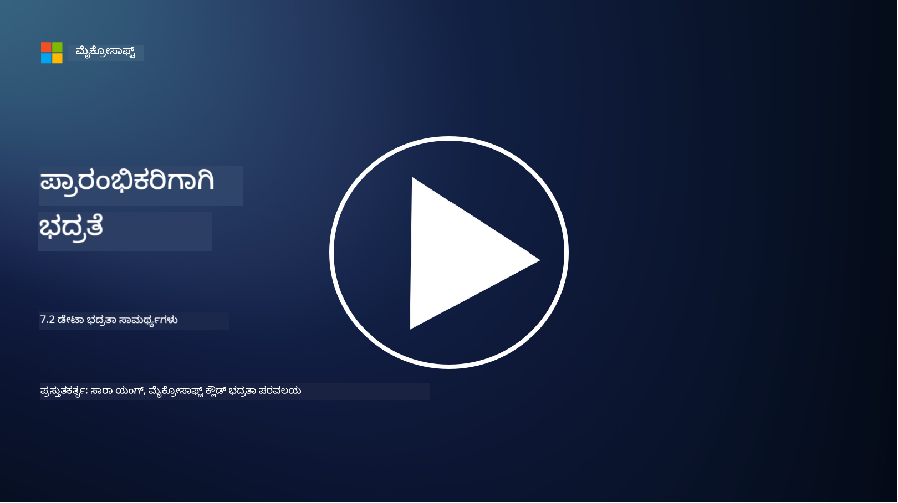

<!--
CO_OP_TRANSLATOR_METADATA:
{
  "original_hash": "50697add9758e54693442d502d2d5f8a",
  "translation_date": "2025-12-19T13:12:02+00:00",
  "source_file": "7.2 Data security capabilities.md",
  "language_code": "kn"
}
-->
# ಡೇಟಾ ಭದ್ರತಾ ಸಾಮರ್ಥ್ಯಗಳು

ಈ ವಿಭಾಗದಲ್ಲಿ, ಡೇಟಾ ಭದ್ರತೆಯಲ್ಲಿ ಬಳಸುವ ಪ್ರಮುಖ ಸಾಧನಗಳು ಮತ್ತು ಸಾಮರ್ಥ್ಯಗಳ ಬಗ್ಗೆ ಹೆಚ್ಚಿನ ವಿವರಗಳನ್ನು ನಾವು ಕವರ್ ಮಾಡುತ್ತೇವೆ:

**ಪರಿಚಯ**

ಈ ಪಾಠದಲ್ಲಿ ನಾವು ಕವರ್ ಮಾಡುತ್ತೇವೆ:

- ಡೇಟಾ ನಷ್ಟ ತಡೆ ಸಾಧನಗಳು ಏನು?

- ಒಳಗಿನ ಅಪಾಯ ನಿರ್ವಹಣಾ ಸಾಧನಗಳು ಏನು?

- ಡೇಟಾ ಸಂಗ್ರಹಣೆ ಸಾಧನಗಳು ಯಾವುವು ಲಭ್ಯವಿದೆ?

## ಡೇಟಾ ನಷ್ಟ ತಡೆ ಸಾಧನಗಳು ಏನು?

ಡೇಟಾ ನಷ್ಟ ತಡೆ (DLP) ಸಾಧನಗಳು ಎಂದರೆ ಸಂಸ್ಥೆಯೊಳಗೆ ಸಂವೇದನಶೀಲ ಅಥವಾ ರಹಸ್ಯ ಡೇಟಾವನ್ನು ಅನಧಿಕೃತ ಪ್ರವೇಶ, ಹಂಚಿಕೆ ಅಥವಾ ಸೋರಿಕೆಯನ್ನು ತಡೆಯಲು ವಿನ್ಯಾಸಗೊಳಿಸಿದ ಸಾಫ್ಟ್‌ವೇರ್ ಪರಿಹಾರಗಳು ಮತ್ತು ತಂತ್ರಜ್ಞಾನಗಳ ಸಮೂಹ. ಈ ಸಾಧನಗಳು ವಿಷಯ ಪರಿಶೀಲನೆ, ನೀತಿ ಜಾರಿಮಾಡುವಿಕೆ ಮತ್ತು ನಿಗಾವಹಿಸುವಿಕೆಯನ್ನು ಬಳಸಿಕೊಂಡು ಸಂವೇದನಶೀಲ ಡೇಟಾವನ್ನು ಗುರುತಿಸಿ, ರಕ್ಷಿಸಲು ಸಹಾಯ ಮಾಡುತ್ತವೆ. ಉದಾಹರಣೆಯಾಗಿ DLP ಉತ್ಪನ್ನಗಳು: Symantec Data Loss Prevention, McAfee Total Protection for Data Loss Prevention, Microsoft 365 DLP**: Microsoft 365 ಅಪ್ಲಿಕೇಶನ್‌ಗಳೊಂದಿಗೆ ಸಂಯೋಜನೆ ಮಾಡುತ್ತದೆ, ಸಂಸ್ಥೆಗಳಿಗೆ ಇಮೇಲ್‌ಗಳು, ಡಾಕ್ಯುಮೆಂಟ್‌ಗಳು ಮತ್ತು ಸಂದೇಶಗಳಲ್ಲಿ ಸಂವೇದನಶೀಲ ಡೇಟಾವನ್ನು ಗುರುತಿಸಿ ರಕ್ಷಿಸಲು ಸಹಾಯ ಮಾಡುತ್ತದೆ.

## ಒಳಗಿನ ಅಪಾಯ ನಿರ್ವಹಣಾ ಸಾಧನಗಳು ಏನು?

ಒಳಗಿನ ಅಪಾಯ ನಿರ್ವಹಣಾ ಸಾಧನಗಳು ಸಂಸ್ಥೆಗಳಿಗೆ ಉದ್ಯೋಗಿಗಳು, ಗುತ್ತಿಗೆದಾರರು ಅಥವಾ ಪಾಲುದಾರರು ಉದ್ದೇಶಪೂರ್ವಕವಾಗಿ ಅಥವಾ ಅನೈಚ್ಛಿಕವಾಗಿ ಡೇಟಾ ಭದ್ರತೆಯನ್ನು ಅಪಾಯಕ್ಕೆ ಒಳಪಡಿಸಬಹುದಾದ ಅಪಾಯಗಳನ್ನು ಗುರುತಿಸಿ, ತಡೆಯಲು ಸಹಾಯ ಮಾಡುತ್ತದೆ. ಈ ಸಾಧನಗಳು ಬಳಕೆದಾರರ ವರ್ತನೆ, ಪ್ರವೇಶ ಮಾದರಿಗಳು ಮತ್ತು ಡೇಟಾ ಬಳಕೆಯನ್ನು ನಿಗಾವಹಿಸಿ ಅನುಮಾನಾಸ್ಪದ ಚಟುವಟಿಕೆಗಳು ಮತ್ತು ಒಳಗಿನ ಅಪಾಯಗಳನ್ನು ಪತ್ತೆಹಚ್ಚುತ್ತವೆ. ಉದಾಹರಣೆಯಾಗಿ ಒಳಗಿನ ಅಪಾಯ ನಿರ್ವಹಣಾ ಉತ್ಪನ್ನಗಳು: Microsoft Insider Risk Management (Microsoft 365 ಭಾಗ), Forcepoint Insider Threat Data Protection, Varonis Insider Threat Detection.

## ಡೇಟಾ ಸಂಗ್ರಹಣೆ ಸಾಧನಗಳು ಯಾವುವು ಲಭ್ಯವಿದೆ?

ಡೇಟಾ ಸಂಗ್ರಹಣೆ ಸಾಧನಗಳು ಎಂದರೆ ಸಂಸ್ಥೆಯ ಡೇಟಾ ಸಂಗ್ರಹಣೆ ನೀತಿಗಳು ಮತ್ತು ಕಾನೂನು ಅಗತ್ಯತೆಗಳಿಗೆ ಅನುಗುಣವಾಗಿ ಡೇಟಾವನ್ನು ಸಂಗ್ರಹಿಸುವ ಮತ್ತು ಅಳಿಸುವ ನಿರ್ವಹಣೆಗೆ ವಿನ್ಯಾಸಗೊಳಿಸಿದ ಸಾಫ್ಟ್‌ವೇರ್ ಮತ್ತು ಪರಿಹಾರಗಳು. ಈ ಸಾಧನಗಳು ಡೇಟಾವನ್ನು ನಿರ್ದಿಷ್ಟ ಅವಧಿಗಳಲ್ಲಿ ಸಂಗ್ರಹಿಸುವ ಪ್ರಕ್ರಿಯೆಯನ್ನು ಸ್ವಯಂಚಾಲಿತಗೊಳಿಸಲು ಮತ್ತು ಅದು ಅಗತ್ಯವಿಲ್ಲದಾಗ ಸುರಕ್ಷಿತವಾಗಿ ಅಳಿಸಲು ಸಹಾಯ ಮಾಡುತ್ತವೆ. ಉದಾಹರಣೆಯಾಗಿ ಡೇಟಾ ಸಂಗ್ರಹಣೆ ಉತ್ಪನ್ನಗಳು: Veritas Enterprise Vault, Commvault Complete Data Protection, Microsoft data lifecycle management. ಈ ಸಾಧನ ಪರಿಹಾರಗಳು ಸಂಸ್ಥೆಗಳಿಗೆ ಡೇಟಾ ಸಂಗ್ರಹಣೆ ಮತ್ತು ಅಳಿಸುವಿಕೆಯನ್ನು ನಿಯಂತ್ರಿಸಲು, ಡೇಟಾ ರಕ್ಷಣೆ ನಿಯಮಾವಳಿಗಳಿಗೆ ಅನುಗುಣವಾಗಿ ಡೇಟಾವನ್ನು ಅದರ ಜೀವನಚಕ್ರದಾದ್ಯಂತ ಪರಿಣಾಮಕಾರಿಯಾಗಿ ನಿರ್ವಹಿಸಲು ಸಹಾಯ ಮಾಡುತ್ತದೆ.

## ಹೆಚ್ಚಿನ ಓದು

- [ಡೇಟಾ ಭದ್ರತಾ ಸ್ಥಿತಿ ನಿರ್ವಹಣೆಗೆ ಮಾರ್ಗದರ್ಶಿ (DSPM) | CSA (cloudsecurityalliance.org)](https://cloudsecurityalliance.org/blog/2023/03/31/the-big-guide-to-data-security-posture-management-dspm/)
- [ಎಂಡ್ಪಾಯಿಂಟ್‌ಗಳು, ಅಪ್ಲಿಕೇಶನ್‌ಗಳು ಮತ್ತು ಸೇವೆಗಳಾದ್ಯಂತ ಡೇಟಾ ನಷ್ಟ ತಡೆ | Microsoft Purview](https://youtu.be/hvqq8L_0kgI)
- [2023ರ 18 ಉತ್ತಮ ಡೇಟಾ ನಷ್ಟ ತಡೆ ಸಾಫ್ಟ್‌ವೇರ್ ಸಾಧನಗಳು (ಉಚಿತ + ಪೈಡ್) (comparitech.com)](https://www.comparitech.com/data-privacy-management/data-loss-prevention-tools-software/)
- [ಡೇಟಾ ನಷ್ಟ ತಡೆ (nist.gov)](https://tsapps.nist.gov/publication/get_pdf.cfm?pub_id=904672)
- [ಒಳಗಿನ ಅಪಾಯ ನಿರ್ವಹಣೆಯ ಬಗ್ಗೆ ತಿಳಿಯಿರಿ | Microsoft Learn](https://learn.microsoft.com/purview/insider-risk-management?WT.mc_id=academic-96948-sayoung)
- [ಡೇಟಾ ಜೀವನಚಕ್ರ ನಿರ್ವಹಣೆ | IBM](https://www.ibm.com/topics/data-lifecycle-management)
- [ಡೇಟಾ ಜೀವನಚಕ್ರ ನಿರ್ವಹಣೆ (DLM) ಏನು? | 2023 ಉತ್ತಮ ಅಭ್ಯಾಸಗಳು (selecthub.com)](https://www.selecthub.com/big-data-analytics/data-lifecycle-management/)

---

<!-- CO-OP TRANSLATOR DISCLAIMER START -->
**ಅಸಮೀಕ್ಷೆ**:  
ಈ ದಸ್ತಾವೇಜನ್ನು AI ಅನುವಾದ ಸೇವೆ [Co-op Translator](https://github.com/Azure/co-op-translator) ಬಳಸಿ ಅನುವಾದಿಸಲಾಗಿದೆ. ನಾವು ನಿಖರತೆಯನ್ನು ಸಾಧಿಸಲು ಪ್ರಯತ್ನಿಸುತ್ತಿದ್ದರೂ, ದಯವಿಟ್ಟು ಗಮನಿಸಿ, ಸ್ವಯಂಚಾಲಿತ ಅನುವಾದಗಳಲ್ಲಿ ದೋಷಗಳು ಅಥವಾ ಅಸಮರ್ಪಕತೆಗಳು ಇರಬಹುದು. ಮೂಲ ಭಾಷೆಯಲ್ಲಿರುವ ಮೂಲ ದಸ್ತಾವೇಜನ್ನು ಪ್ರಾಮಾಣಿಕ ಮೂಲವೆಂದು ಪರಿಗಣಿಸಬೇಕು. ಮಹತ್ವದ ಮಾಹಿತಿಗಾಗಿ, ವೃತ್ತಿಪರ ಮಾನವ ಅನುವಾದವನ್ನು ಶಿಫಾರಸು ಮಾಡಲಾಗುತ್ತದೆ. ಈ ಅನುವಾದದ ಬಳಕೆಯಿಂದ ಉಂಟಾಗುವ ಯಾವುದೇ ತಪ್ಪುಅರ್ಥಗಳು ಅಥವಾ ತಪ್ಪುಅರ್ಥೈಸುವಿಕೆಗೆ ನಾವು ಹೊಣೆಗಾರರಲ್ಲ.
<!-- CO-OP TRANSLATOR DISCLAIMER END -->