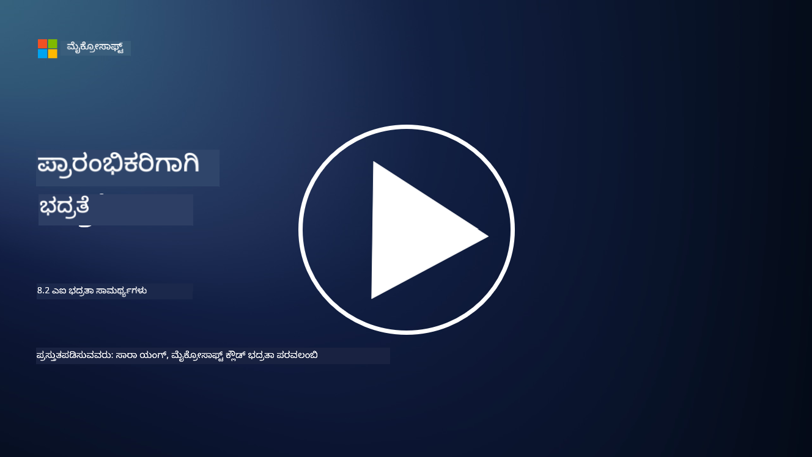

<!--
CO_OP_TRANSLATOR_METADATA:
{
  "original_hash": "b6bb7175672298d1e2f73ba7e0006f95",
  "translation_date": "2025-12-19T13:26:21+00:00",
  "source_file": "8.2 AI security capabilities.md",
  "language_code": "kn"
}
-->
# AI ಭದ್ರತಾ ಸಾಮರ್ಥ್ಯಗಳು

## AI ವ್ಯವಸ್ಥೆಗಳನ್ನು ಭದ್ರಗೊಳಿಸಲು ನಾವು ಈಗಾಗಲೇ ಯಾವ ಸಾಧನಗಳು ಮತ್ತು ಸಾಮರ್ಥ್ಯಗಳನ್ನು ಹೊಂದಿದ್ದೇವೆ?

ಪ್ರಸ್ತುತ, AI ವ್ಯವಸ್ಥೆಗಳನ್ನು ಭದ್ರಗೊಳಿಸಲು ಹಲವಾರು ಸಾಧನಗಳು ಮತ್ತು ಸಾಮರ್ಥ್ಯಗಳು ಲಭ್ಯವಿವೆ:

-   **Counterfit**: AI ವ್ಯವಸ್ಥೆಗಳ ಭದ್ರತಾ ಪರೀಕ್ಷೆಗಾಗಿ ವಿನ್ಯಾಸಗೊಳಿಸಲಾದ ಓಪನ್-ಸೋರ್ಸ್ ಸ್ವಯಂಚಾಲಿತ ಸಾಧನ, ಇದು ಸಂಸ್ಥೆಗಳಿಗೆ AI ಭದ್ರತಾ ಅಪಾಯ ಮೌಲ್ಯಮಾಪನಗಳನ್ನು ನಡೆಸಲು ಮತ್ತು ಅವರ ಅಲ್ಗಾರಿದಮ್‌ಗಳ ದೃಢತೆಯನ್ನು ಖಚಿತಪಡಿಸಲು ಸಹಾಯ ಮಾಡುತ್ತದೆ.
-   **Adversarial Machine Learning Tools**: ಈ ಸಾಧನಗಳು ಯಾಂತ್ರಿಕ ಕಲಿಕೆಯ ಮಾದರಿಗಳ ದೃಢತೆಯನ್ನು ವಿರೋಧಾತ್ಮಕ ದಾಳಿಗಳ ವಿರುದ್ಧ ಮೌಲ್ಯಮಾಪನ ಮಾಡುತ್ತವೆ, ಅಪಾಯಗಳನ್ನು ಗುರುತಿಸಲು ಮತ್ತು ತಡೆಗಟ್ಟಲು ಸಹಾಯ ಮಾಡುತ್ತವೆ.
-   **AI Security Toolkits**: AI ವ್ಯವಸ್ಥೆಗಳನ್ನು ಭದ್ರಗೊಳಿಸಲು ಸಂಪತ್ತನ್ನು ಒದಗಿಸುವ ಓಪನ್-ಸೋರ್ಸ್ ಟೂಲ್‌ಕಿಟ್‌ಗಳು ಲಭ್ಯವಿವೆ, ಇದರಲ್ಲಿ ಭದ್ರತಾ ಕ್ರಮಗಳನ್ನು ಜಾರಿಗೆ ತರಲು ಗ್ರಂಥಾಲಯಗಳು ಮತ್ತು ಫ್ರೇಮ್‌ವರ್ಕ್‌ಗಳು ಸೇರಿವೆ.
-   **Collaborative Platforms**: ಕಂಪನಿಗಳು ಮತ್ತು AI ಸಮುದಾಯಗಳ ನಡುವಿನ ಸಹಭಾಗಿತ್ವಗಳು, AI ಸರಬರಾಜು ಶೃಂಖಲೆಯನ್ನು ಭದ್ರಗೊಳಿಸಲು AI-ನಿರ್ದಿಷ್ಟ ಭದ್ರತಾ ಸ್ಕ್ಯಾನರ್‌ಗಳು ಮತ್ತು ಇತರ ಸಾಧನಗಳನ್ನು ಅಭಿವೃದ್ಧಿಪಡಿಸಲು.

ಈ ಸಾಧನಗಳು ಮತ್ತು ಸಾಮರ್ಥ್ಯಗಳು ವಿವಿಧ ಅಪಾಯಗಳ ವಿರುದ್ಧ AI ವ್ಯವಸ್ಥೆಗಳ ಭದ್ರತೆಯನ್ನು ಹೆಚ್ಚಿಸಲು ಮೀಸಲಾಗಿರುವ ಬೆಳೆಯುತ್ತಿರುವ ಕ್ಷೇತ್ರದ ಭಾಗವಾಗಿದೆ. ಇವು ಸಂಶೋಧನೆ, ಪ್ರಾಯೋಗಿಕ ಸಾಧನಗಳು ಮತ್ತು ಕೈಗಾರಿಕಾ ಸಹಭಾಗಿತ್ವದ ಸಂಯೋಜನೆಯಾಗಿದೆ, AI ತಂತ್ರಜ್ಞಾನಗಳಿಂದ ಉಂಟಾಗುವ ವಿಶಿಷ್ಟ ಸವಾಲುಗಳನ್ನು ಪರಿಹರಿಸಲು ಉದ್ದೇಶಿಸಲಾಗಿದೆ.

## AI ರೆಡ್ ಟೀಮಿಂಗ್ ಬಗ್ಗೆ ಏನು? ಇದು ಪರಂಪರागत ಭದ್ರತಾ ರೆಡ್ ಟೀಮಿಂಗ್‌ನಿಂದ ಹೇಗೆ ವಿಭಿನ್ನವಾಗಿದೆ?

AI ರೆಡ್ ಟೀಮಿಂಗ್ ಪರಂಪರागत ಭದ್ರತಾ ರೆಡ್ ಟೀಮಿಂಗ್‌ನಿಂದ ಕೆಲವು ಪ್ರಮುಖ ಅಂಶಗಳಲ್ಲಿ ವಿಭಿನ್ನವಾಗಿದೆ:

-   **AI ವ್ಯವಸ್ಥೆಗಳ ಮೇಲೆ ಕೇಂದ್ರೀಕೃತವಾಗಿದೆ**: AI ರೆಡ್ ಟೀಮಿಂಗ್ ವಿಶೇಷವಾಗಿ ಯಾಂತ್ರಿಕ ಕಲಿಕೆಯ ಮಾದರಿಗಳು ಮತ್ತು ಡೇಟಾ ಪೈಪ್‌ಲೈನ್‌ಗಳಂತಹ AI ವ್ಯವಸ್ಥೆಗಳ ವಿಶಿಷ್ಟ ಅಪಾಯಗಳನ್ನು ಗುರಿಯಾಗಿಸುತ್ತದೆ, ಪರಂಪರागत IT ಮೂಲಸೌಕರ್ಯವನ್ನು ಅಲ್ಲ.
-   **AI ನ ವರ್ತನೆ ಪರೀಕ್ಷೆ**: ಇದು AI ವ್ಯವಸ್ಥೆಗಳು ಅಸಾಮಾನ್ಯ ಅಥವಾ ನಿರೀಕ್ಷಿತವಲ್ಲದ ಇನ್‌ಪುಟ್‌ಗಳಿಗೆ ಹೇಗೆ ಪ್ರತಿಕ್ರಿಯಿಸುತ್ತವೆ ಎಂಬುದನ್ನು ಪರೀಕ್ಷಿಸುವುದನ್ನು ಒಳಗೊಂಡಿರುತ್ತದೆ, ಇದು ದಾಳಿಕಾರರು ದುರುಪಯೋಗಪಡಿಸಿಕೊಳ್ಳಬಹುದಾದ ಅಪಾಯಗಳನ್ನು ಬಹಿರಂಗಪಡಿಸಬಹುದು.
-   **AI ವೈಫಲ್ಯಗಳನ್ನು ಅನ್ವೇಷಣೆ**: AI ರೆಡ್ ಟೀಮಿಂಗ್ ದುರುದ್ದೇಶಿತ ಮತ್ತು ನಿರ್ದೋಷಿ ವೈಫಲ್ಯಗಳನ್ನು ಎರಡನ್ನೂ ಪರಿಗಣಿಸುತ್ತದೆ, ಭದ್ರತಾ ಉಲ್ಲಂಘನೆಗಳಷ್ಟೇ ಅಲ್ಲದೆ, ವ್ಯಾಪಕವಾದ ವ್ಯಕ್ತಿತ್ವಗಳು ಮತ್ತು ಸಾಧ್ಯತೆಯ ವ್ಯವಸ್ಥಾ ವೈಫಲ್ಯಗಳನ್ನು ಪರಿಗಣಿಸುತ್ತದೆ.
-   **ಪ್ರಾಂಪ್ಟ್ ಇಂಜೆಕ್ಷನ್ ಮತ್ತು ವಿಷಯ ರಚನೆ**: AI ರೆಡ್ ಟೀಮಿಂಗ್ ಪ್ರಾಂಪ್ಟ್ ಇಂಜೆಕ್ಷನ್‌ನಂತಹ ವೈಫಲ್ಯಗಳನ್ನು ಪರೀಕ್ಷಿಸುವುದನ್ನು ಒಳಗೊಂಡಿರುತ್ತದೆ, ಅಲ್ಲಿ ದಾಳಿಕಾರರು AI ವ್ಯವಸ್ಥೆಗಳನ್ನು ಹಾನಿಕಾರಕ ಅಥವಾ ಅಸಂಬದ್ಧ ವಿಷಯವನ್ನು ಉತ್ಪಾದಿಸಲು ಪ್ರೇರೇಪಿಸುತ್ತಾರೆ.
-   **ನೈತಿಕ ಮತ್ತು ಜವಾಬ್ದಾರಿಯುತ AI**: ಇದು ಜವಾಬ್ದಾರಿಯುತ AI ವಿನ್ಯಾಸದ ಭಾಗವಾಗಿದೆ, AI ವ್ಯವಸ್ಥೆಗಳು ಅವುಗಳನ್ನು ಉದ್ದೇಶಿತವಲ್ಲದ ರೀತಿಯಲ್ಲಿ ವರ್ತಿಸಲು ಪ್ರೇರೇಪಿಸಲು ಪ್ರಯತ್ನಗಳನ್ನು ಎದುರಿಸಲು ದೃಢವಾಗಿರುವುದನ್ನು ಖಚಿತಪಡಿಸುತ್ತದೆ.

ಒಟ್ಟಾರೆ, AI ರೆಡ್ ಟೀಮಿಂಗ್ ಭದ್ರತಾ ಅಪಾಯಗಳನ್ನು ಪರೀಕ್ಷಿಸುವುದನ್ನು ಮಾತ್ರವಲ್ಲದೆ, AI ತಂತ್ರಜ್ಞಾನಗಳಿಗೆ ವಿಶೇಷವಾದ ಇತರ ರೀತಿಯ ವ್ಯವಸ್ಥಾ ವೈಫಲ್ಯಗಳನ್ನು ಪರೀಕ್ಷಿಸುವುದನ್ನೂ ಒಳಗೊಂಡಿರುವ ವಿಸ್ತೃತ ಅಭ್ಯಾಸವಾಗಿದೆ. ಇದು AI ನಿಯೋಜನೆಯೊಂದಿಗೆ ಸಂಬಂಧಿಸಿದ ಹೊಸ ಅಪಾಯಗಳನ್ನು ಅರ್ಥಮಾಡಿಕೊಳ್ಳುವ ಮತ್ತು ತಡೆಗಟ್ಟುವ ಮೂಲಕ ಸುರಕ್ಷಿತ AI ವ್ಯವಸ್ಥೆಗಳನ್ನು ಅಭಿವೃದ್ಧಿಪಡಿಸುವ ಪ್ರಮುಖ ಭಾಗವಾಗಿದೆ.

## ಹೆಚ್ಚಿನ ಓದು

 - [Microsoft AI Red Team building future of safer AI | Microsoft Security Blog](https://www.microsoft.com/en-us/security/blog/2023/08/07/microsoft-ai-red-team-building-future-of-safer-ai/?WT.mc_id=academic-96948-sayoung)
 - [Announcing Microsoft’s open automation framework to red team generative AI Systems | Microsoft Security Blog](https://www.microsoft.com/en-us/security/blog/2024/02/22/announcing-microsofts-open-automation-framework-to-red-team-generative-ai-systems/?WT.mc_id=academic-96948-sayoung)
 - [AI Security Tools: The Open-Source Toolkit | Wiz](https://www.wiz.io/academy/ai-security-tools)

---

<!-- CO-OP TRANSLATOR DISCLAIMER START -->
**ಅಸ್ವೀಕಾರ**:  
ಈ ದಸ್ತಾವೇಜನ್ನು AI ಅನುವಾದ ಸೇವೆ [Co-op Translator](https://github.com/Azure/co-op-translator) ಬಳಸಿ ಅನುವಾದಿಸಲಾಗಿದೆ. ನಾವು ನಿಖರತೆಯನ್ನು ಸಾಧಿಸಲು ಪ್ರಯತ್ನಿಸುತ್ತಿದ್ದರೂ, ದಯವಿಟ್ಟು ಗಮನಿಸಿ, ಸ್ವಯಂಚಾಲಿತ ಅನುವಾದಗಳಲ್ಲಿ ದೋಷಗಳು ಅಥವಾ ಅಸಡ್ಡೆಗಳು ಇರಬಹುದು. ಮೂಲ ಭಾಷೆಯಲ್ಲಿರುವ ಮೂಲ ದಸ್ತಾವೇಜು ಪ್ರಾಮಾಣಿಕ ಮೂಲವೆಂದು ಪರಿಗಣಿಸಬೇಕು. ಮಹತ್ವದ ಮಾಹಿತಿಗಾಗಿ, ವೃತ್ತಿಪರ ಮಾನವ ಅನುವಾದವನ್ನು ಶಿಫಾರಸು ಮಾಡಲಾಗುತ್ತದೆ. ಈ ಅನುವಾದವನ್ನು ಬಳಸುವ ಮೂಲಕ ಉಂಟಾಗುವ ಯಾವುದೇ ತಪ್ಪು ಅರ್ಥಗಳ ಅಥವಾ ತಪ್ಪು ವ್ಯಾಖ್ಯಾನಗಳ ಬಗ್ಗೆ ನಾವು ಹೊಣೆಗಾರರಲ್ಲ.
<!-- CO-OP TRANSLATOR DISCLAIMER END -->