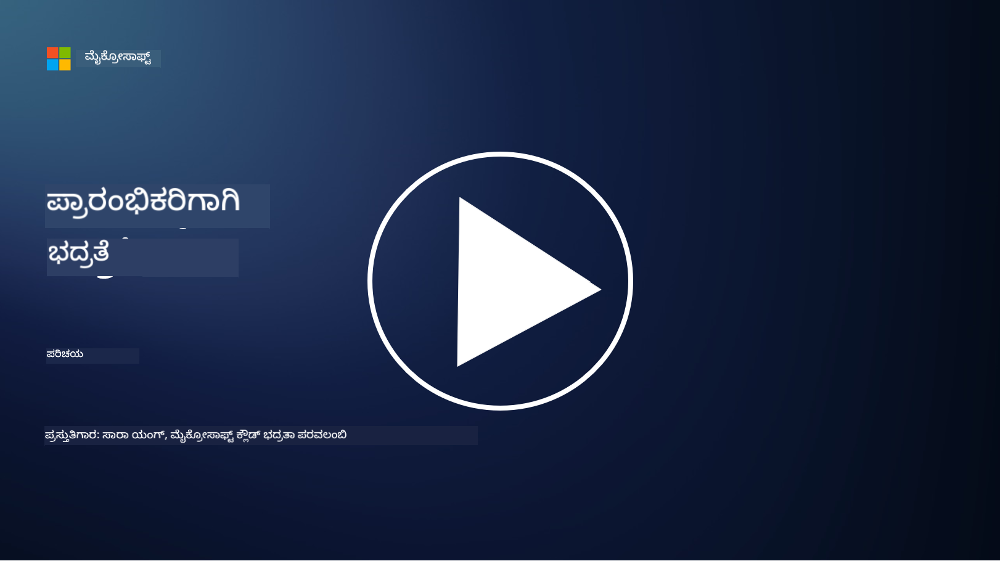

<!--
CO_OP_TRANSLATOR_METADATA:
{
  "original_hash": "7d957a4948cfe27c91ec137f6a6e2988",
  "translation_date": "2025-12-19T12:52:47+00:00",
  "source_file": "README.md",
  "language_code": "kn"
}
-->

### 🌐 ಬಹುಭಾಷಾ ಬೆಂಬಲ

#### GitHub Action ಮೂಲಕ ಬೆಂಬಲಿತ (ಸ್ವಯಂಚಾಲಿತ ಮತ್ತು ಸದಾ ನವೀಕರಿತ)

<!-- CO-OP TRANSLATOR LANGUAGES TABLE START -->
[ಅರೇಬಿಕ್](../ar/README.md) | [ಬಂಗಾಳಿ](../bn/README.md) | [ಬಲ್ಗೇರಿಯನ್](../bg/README.md) | [ಬರ್ಮೀಸ್ (ಮ್ಯಾನ್ಮಾರ್)](../my/README.md) | [ಚೈನೀಸ್ (ಸರಳೀಕೃತ)](../zh/README.md) | [ಚೈನೀಸ್ (ಪಾರಂಪರಿಕ, ಹಾಂಗ್ ಕಾಂಗ್)](../hk/README.md) | [ಚೈನೀಸ್ (ಪಾರಂಪರಿಕ, ಮಕಾವ್)](../mo/README.md) | [ಚೈನೀಸ್ (ಪಾರಂಪರಿಕ, ತೈವಾನ್)](../tw/README.md) | [ಕ್ರೊಯೇಶಿಯನ್](../hr/README.md) | [ಚೆಕ್](../cs/README.md) | [ಡ್ಯಾನಿಶ್](../da/README.md) | [ಡಚ್](../nl/README.md) | [ಎಸ್ಟೋನಿಯನ್](../et/README.md) | [ಫಿನ್ನಿಷ್](../fi/README.md) | [ಫ್ರೆಂಚ್](../fr/README.md) | [ಜರ್ಮನ್](../de/README.md) | [ಗ್ರೀಕ್](../el/README.md) | [ಹೀಬ್ರೂ](../he/README.md) | [ಹಿಂದಿ](../hi/README.md) | [ಹಂಗೇರಿಯನ್](../hu/README.md) | [ಇಂಡೋನೇಷಿಯನ್](../id/README.md) | [ಇಟಾಲಿಯನ್](../it/README.md) | [ಜಪಾನೀಸ್](../ja/README.md) | [ಕನ್ನಡ](./README.md) | [ಕೊರಿಯನ್](../ko/README.md) | [ಲಿಥುವೇನಿಯನ್](../lt/README.md) | [ಮಲಯ್](../ms/README.md) | [ಮಲಯಾಳಂ](../ml/README.md) | [ಮರಾಠಿ](../mr/README.md) | [ನೇಪಾಳಿ](../ne/README.md) | [ನೈಜೀರಿಯನ್ ಪಿಡ್ಜಿನ್](../pcm/README.md) | [ನಾರ್ವೇಜಿಯನ್](../no/README.md) | [ಪರ್ಶಿಯನ್ (ಫಾರ್ಸಿ)](../fa/README.md) | [ಪೋಲಿಷ್](../pl/README.md) | [ಪೋರ್ಚುಗೀಸ್ (ಬ್ರೆಜಿಲ್)](../br/README.md) | [ಪೋರ್ಚುಗೀಸ್ (ಪೋರ್ಚುಗಲ್)](../pt/README.md) | [ಪಂಜಾಬಿ (ಗುರ್ಮುಖಿ)](../pa/README.md) | [ರೊಮೇನಿಯನ್](../ro/README.md) | [ರಷ್ಯನ್](../ru/README.md) | [ಸರ್ಬಿಯನ್ (ಸಿರಿಲಿಕ್)](../sr/README.md) | [ಸ್ಲೋವಾಕ್](../sk/README.md) | [ಸ್ಲೋವೇನಿಯನ್](../sl/README.md) | [ಸ್ಪ್ಯಾನಿಷ್](../es/README.md) | [ಸ್ವಾಹಿಲಿ](../sw/README.md) | [ಸ್ವೀಡಿಷ್](../sv/README.md) | [ಟಗಾಲೊಗ್ (ಫಿಲಿಪಿನೋ)](../tl/README.md) | [ತಮಿಳು](../ta/README.md) | [ತೆಲುಗು](../te/README.md) | [ಥಾಯ್](../th/README.md) | [ಟರ್ಕಿಷ್](../tr/README.md) | [ಉಕ್ರೇನಿಯನ್](../uk/README.md) | [ಉರ್ದು](../ur/README.md) | [ವಿಯೆಟ್ನಾಮೀಸ್](../vi/README.md)
<!-- CO-OP TRANSLATOR LANGUAGES TABLE END -->

**ನೀವು ಹೆಚ್ಚುವರಿ ಭಾಷಾ ಅನುವಾದಗಳನ್ನು ಬೆಂಬಲಿಸಲು ಬಯಸಿದರೆ, [ಇಲ್ಲಿ](https://github.com/Azure/co-op-translator/blob/main/getting_started/supported-languages.md) ಪಟ್ಟಿ ಮಾಡಲಾಗಿದೆ.**

#### ನಮ್ಮ ಸಮುದಾಯಕ್ಕೆ ಸೇರಿ 

# 🚀 ಪ್ರಾರಂಭಿಕರಿಗಾಗಿ ಸೈಬರ್‌ಸಿಕ್ಯುರಿಟಿ – ಒಂದು ಪಠ್ಯಕ್ರಮ

AI ತಂತ್ರಜ್ಞಾನವನ್ನು ಅಳವಡಿಸಿಕೊಳ್ಳುವ ಈ ವೇಗವಾಗಿ ಬದಲಾಗುತ್ತಿರುವ ಯುಗದಲ್ಲಿ, IT ವ್ಯವಸ್ಥೆಗಳನ್ನು ಸುರಕ್ಷಿತಗೊಳಿಸುವುದು ಹೇಗೆ ಎಂಬುದನ್ನು ಅರ್ಥಮಾಡಿಕೊಳ್ಳುವುದು ಇನ್ನೂ ಹೆಚ್ಚು ಮುಖ್ಯವಾಗಿದೆ. ಈ ಕೋರ್ಸ್ ನಿಮ್ಮ ಭದ್ರತಾ ಕಲಿಕೆಯನ್ನು ಪ್ರಾರಂಭಿಸಲು ಮೂಲಭೂತ ಸೈಬರ್‌ಸಿಕ್ಯುರಿಟಿ ಪರಿಕಲ್ಪನೆಗಳನ್ನು ಕಲಿಸಲು ವಿನ್ಯಾಸಗೊಳಿಸಲಾಗಿದೆ. ಇದು ಯಾವುದೇ ನಿರ್ದಿಷ್ಟ ಮಾರಾಟಗಾರರ ಮೇಲೆ ಅವಲಂಬಿತವಿಲ್ಲ ಮತ್ತು 30-60 ನಿಮಿಷಗಳಲ್ಲಿ ಪೂರ್ಣಗೊಳ್ಳುವ ಚಿಕ್ಕ ಪಾಠಗಳಲ್ಲಿ ವಿಭಜಿಸಲಾಗಿದೆ. ಪ್ರತಿ ಪಾಠವು ಚಿಕ್ಕ ಪ್ರಶ್ನೋತ್ತರ ಮತ್ತು ವಿಷಯವನ್ನು ಇನ್ನಷ್ಟು ಆಳವಾಗಿ ಅಧ್ಯಯನ ಮಾಡಲು ಲಿಂಕ್‌ಗಳನ್ನು ಹೊಂದಿರುತ್ತದೆ.

ಈ ಕೋರ್ಸ್ ಏನನ್ನು ಒಳಗೊಂಡಿದೆ 📚

- 🔐 ಮೂಲಭೂತ ಸೈಬರ್‌ಸಿಕ್ಯುರಿಟಿ ಪರಿಕಲ್ಪನೆಗಳು, ಉದಾ: CIA ತ್ರಯ, ಅಪಾಯಗಳು, ಬೆದರಿಕೆಗಳು ಇತ್ಯಾದಿಗಳ ನಡುವಿನ ವ್ಯತ್ಯಾಸ.
- 🛡️ ಭದ್ರತಾ ನಿಯಂತ್ರಣವೆಂದರೇನು ಮತ್ತು ಅವು ಯಾವ ರೂಪದಲ್ಲಿ ಇರುತ್ತವೆ ಎಂಬುದರ ಅರಿವು.
- 🌐 ಶೂನ್ಯ ನಂಬಿಕೆ (Zero Trust) ಎಂದರೇನು ಮತ್ತು ಆಧುನಿಕ ಸೈಬರ್‌ಸಿಕ್ಯುರಿಟಿಯಲ್ಲಿ ಇದು ಏಕೆ ಮುಖ್ಯ ಎಂಬುದರ ಅರಿವು.
- 🔑 ಗುರುತಿನ, ನೆಟ್‌ವರ್ಕಿಂಗ್, ಭದ್ರತಾ ಕಾರ್ಯಾಚರಣೆಗಳು, ಮೂಲಸೌಕರ್ಯ ಮತ್ತು ಡೇಟಾ ಭದ್ರತೆಯಾದ್ಯಂತ ಪ್ರಮುಖ ಪರಿಕಲ್ಪನೆಗಳು ಮತ್ತು ಥೀಮ್‌ಗಳ ಅರಿವು.
- 🔧 ಭದ್ರತಾ ನಿಯಂತ್ರಣಗಳನ್ನು ಜಾರಿಗೆ ತರಲು ಬಳಸುವ ಕೆಲವು ಸಾಧನಗಳ ಉದಾಹರಣೆಗಳನ್ನು ನೀಡುವುದು.

ಈ ಕೋರ್ಸ್ ಏನನ್ನು ಒಳಗೊಂಡಿಲ್ಲ 🙅‍♂️

- 🚫 ನಿರ್ದಿಷ್ಟ ಭದ್ರತಾ ಸಾಧನಗಳನ್ನು ಹೇಗೆ ಬಳಸುವುದು ಎಂಬುದು.
- 🚫 "ಹ್ಯಾಕ್" ಮಾಡುವುದು ಅಥವಾ ರೆಡ್ ಟೀಮಿಂಗ್/ಆಫೆನ್ಸಿವ್ ಭದ್ರತೆಯನ್ನು ಹೇಗೆ ಮಾಡುವುದು ಎಂಬುದು.
- 🚫 ನಿರ್ದಿಷ್ಟ ಅನುಕೂಲತೆ ಮಾನದಂಡಗಳ ಬಗ್ಗೆ ಕಲಿಯುವುದು.

ಈ ಕೋರ್ಸ್ ಮುಗಿಸಿದ ನಂತರ, ನೀವು ನಮ್ಮ Microsoft Learn ಮಾದರಿಗಳಲ್ಲಿ ಕೆಲವು ಮುಂದುವರಿಯಬಹುದು. ನಾವು ನಿಮಗೆ [Microsoft Security, Compliance, and Identity Fundamentals](https://learn.microsoft.com/training/paths/describe-concepts-of-security-compliance-identity/?WT.mc_id=academic-96948-sayoung) ಮೂಲಕ ನಿಮ್ಮ ಕಲಿಕೆಯನ್ನು ಮುಂದುವರಿಸಲು ಶಿಫಾರಸು ಮಾಡುತ್ತೇವೆ.

ಅಂತಿಮವಾಗಿ, ನೀವು [ಪರೀಕ್ಷೆ SC-900: Microsoft Security, Compliance, and Identity Fundamentals](https://learn.microsoft.com/credentials/certifications/exams/sc-900/?WT.mc_id=academic-96948-sayoung) ಪರೀಕ್ಷೆಯನ್ನು ತೆಗೆದುಕೊಳ್ಳಲು ಪರಿಗಣಿಸಬಹುದು.

> 💁 ಈ ಕೋರ್ಸ್ ಮತ್ತು ನಾವು ಮಿಸ್ ಮಾಡಿದ ಯಾವುದೇ ವಿಷಯದ ಬಗ್ಗೆ ನಿಮ್ಮ ಪ್ರತಿಕ್ರಿಯೆ ಅಥವಾ ಸಲಹೆಗಳನ್ನು ಹೊಂದಿದ್ದರೆ, ನಾವು ಕೇಳಲು ಇಚ್ಛಿಸುತ್ತೇವೆ!

## ಪಾಠಕ್ರಮದ ಅವಲೋಕನ 📝 
| **ಮಾಡ್ಯೂಲ್ ಸಂಖ್ಯೆ** | **ಮಾಡ್ಯೂಲ್ ಹೆಸರು**                           | **ಪರಿಕಲ್ಪನೆಗಳು ಕಲಿಸಲಾಗುತ್ತದೆ**                  | **ಕಲಿಕೆಯ ಉದ್ದೇಶಗಳು**                                                                                          |
|-------------------|-------------------------------------------|--------------------------------------|-----------------------------------------------------------------------------------------------------------------|
| **1.1**           | ಮೂಲಭೂತ ಭದ್ರತಾ ಪರಿಕಲ್ಪನೆಗಳು                   | [CIA ತ್ರಯ](https://github.com/microsoft/Security-101/blob/main/1.1%20The%20CIA%20triad%20and%20other%20key%20concepts.md)                        | ಗೌಪ್ಯತೆ, ಲಭ್ಯತೆ ಮತ್ತು ಅಖಂಡತೆಯ ಬಗ್ಗೆ ಕಲಿಯಿರಿ. ಪ್ರಾಮಾಣಿಕತೆ, ನಿರಾಕರಣೀಯತೆ ಮತ್ತು ಗೌಪ್ಯತೆಯನ್ನೂ ಸಹ. |
| **1.2**           | ಮೂಲಭೂತ ಭದ್ರತಾ ಪರಿಕಲ್ಪನೆಗಳು                   | [ಸಾಮಾನ್ಯ ಸೈಬರ್‌ಸಿಕ್ಯುರಿಟಿ ಬೆದರಿಕೆಗಳು](https://github.com/microsoft/Security-101/blob/main/1.2%20Common%20cybersecurity%20threats.md)        | ವ್ಯಕ್ತಿಗಳು ಮತ್ತು ಸಂಸ್ಥೆಗಳನ್ನು ಎದುರಿಸುತ್ತಿರುವ ಸಾಮಾನ್ಯ ಸೈಬರ್‌ಸಿಕ್ಯುರಿಟಿ ಬೆದರಿಕೆಗಳ ಬಗ್ಗೆ ಕಲಿಯಿರಿ.                             |
| **1.3**           | ಮೂಲಭೂತ ಭದ್ರತಾ ಪರಿಕಲ್ಪನೆಗಳು                   | [ಅಪಾಯ ನಿರ್ವಹಣೆಯನ್ನು ಅರ್ಥಮಾಡಿಕೊಳ್ಳುವುದು](https://github.com/microsoft/Security-101/blob/main/1.3%20Understanding%20risk%20management.md)       | ಅಪಾಯವನ್ನು ಅಂದಾಜಿಸುವುದು ಮತ್ತು ಅರ್ಥಮಾಡಿಕೊಳ್ಳುವುದು – ಪರಿಣಾಮ/ಸಾಧ್ಯತೆ ಮತ್ತು ನಿಯಂತ್ರಣಗಳನ್ನು ಜಾರಿಗೆ ತರುವುದು.                                                                                                               | |
| **1.4**           | ಮೂಲಭೂತ ಭದ್ರತಾ ಪರಿಕಲ್ಪನೆಗಳು                   | [ಭದ್ರತಾ ಅಭ್ಯಾಸಗಳು ಮತ್ತು ಡಾಕ್ಯುಮೆಂಟೇಶನ್](https://github.com/microsoft/Security-101/blob/main/1.4%20Security%20practices%20and%20documentation.md) | ನೀತಿಗಳು, ಪ್ರಕ್ರಿಯೆಗಳು, ಮಾನದಂಡಗಳು ಮತ್ತು ನಿಯಮಗಳು/ಕಾನೂನುಗಳ ನಡುವಿನ ವ್ಯತ್ಯಾಸವನ್ನು ಕಲಿಯಿರಿ.                         |
| **1.5**           | ಮೂಲಭೂತ ಭದ್ರತಾ ಪರಿಕಲ್ಪನೆಗಳು                   | [ಶೂನ್ಯ ನಂಬಿಕೆ](https://github.com/microsoft/Security-101/blob/main/1.5%20Zero%20trust.md)                           | ಶೂನ್ಯ ನಂಬಿಕೆ ಎಂದರೇನು ಮತ್ತು ಇದು ಆರ್ಕಿಟೆಕ್ಚರ್ ಅನ್ನು ಹೇಗೆ ಪ್ರಭಾವಿಸುತ್ತದೆ ಎಂಬುದರ ಬಗ್ಗೆ ಕಲಿಯಿರಿ? ಆಳವಾದ ರಕ್ಷಣೆಯೆಂದರೇನು?                   |
| **1.6**           | ಮೂಲಭೂತ ಭದ್ರತಾ ಪರಿಕಲ್ಪನೆಗಳು                   | [ಹಂಚಿದ ಜವಾಬ್ದಾರಿ ಮಾದರಿ](https://github.com/microsoft/Security-101/blob/main/1.6%20Shared%20responsibility%20model.md)                           | ಹಂಚಿದ ಜವಾಬ್ದಾರಿ ಮಾದರಿಯು ಏನು ಮತ್ತು ಇದು ಸೈಬರ್‌ಸಿಕ್ಯುರಿಟಿಯನ್ನು ಹೇಗೆ ಪ್ರಭಾವಿಸುತ್ತದೆ?                  |
| **1.7**           | [ಮಾಡ್ಯೂಲ್ ಅಂತ್ಯದ ಪ್ರಶ್ನೋತ್ತರ](https://github.com/microsoft/Security-101/blob/main/1.7%20End%20of%20module%20quiz.md)                        |                                      |                                                                                                                 |
| **2.1**           | ಗುರುತು ಮತ್ತು ಪ್ರವೇಶ ನಿರ್ವಹಣೆಯ ಮೂಲಭೂತಗಳು | [IAM ಪ್ರಮುಖ ಪರಿಕಲ್ಪನೆಗಳು](https://github.com/microsoft/Security-101/blob/main/2.1%20IAM%20key%20concepts.md)                     | ಕನಿಷ್ಠ ಹಕ್ಕುಧಾರಿತ್ವದ ತತ್ವ, ಕರ್ತವ್ಯದ ವಿಭಜನೆ, IAM ಶೂನ್ಯ ನಂಬಿಕೆಯನ್ನು ಹೇಗೆ ಬೆಂಬಲಿಸುತ್ತದೆ ಎಂಬುದರ ಬಗ್ಗೆ ಕಲಿಯಿರಿ.               |
| **2.2**           | ಗುರುತು ಮತ್ತು ಪ್ರವೇಶ ನಿರ್ವಹಣೆಯ ಮೂಲಭೂತಗಳು | [IAM ಶೂನ್ಯ ನಂಬಿಕೆ ಆರ್ಕಿಟೆಕ್ಚರ್](https://github.com/microsoft/Security-101/blob/main/2.2%20IAM%20zero%20trust%20architecture.md)          | ಗುರುತಿನ ಆಧುನಿಕ IT ಪರಿಸರಗಳ ಹೊಸ ಪರಿಧಿಯಾಗಿದೆ ಮತ್ತು ಇದು ತಡೆಗಟ್ಟುವ ಬೆದರಿಕೆಗಳ ಬಗ್ಗೆ ಕಲಿಯಿರಿ.          |
| **2.3**           | ಗುರುತು ಮತ್ತು ಪ್ರವೇಶ ನಿರ್ವಹಣೆಯ ಮೂಲಭೂತಗಳು | [IAM ಸಾಮರ್ಥ್ಯಗಳು](https://github.com/microsoft/Security-101/blob/main/2.3%20IAM%20capabilities.md)                     | ಗುರುತುಗಳನ್ನು ಸುರಕ್ಷಿತಗೊಳಿಸಲು IAM ಸಾಮರ್ಥ್ಯಗಳು ಮತ್ತು ನಿಯಂತ್ರಣಗಳ ಬಗ್ಗೆ ಕಲಿಯಿರಿ                                                  |
| **2.4**           | [ಮಾಡ್ಯೂಲ್ ಅಂತ್ಯದ ಪ್ರಶ್ನೋತ್ತರ](https://github.com/microsoft/Security-101/blob/main/2.4%20End%20of%20module%20quiz.md)                        |                                      |                                                                                                                 |
| **3.1**           | ನೆಟ್‌ವರ್ಕ್ ಭದ್ರತೆಯ ಮೂಲಭೂತಗಳು             | [ನೆಟ್‌ವರ್ಕಿಂಗ್ ಪ್ರಮುಖ ಪರಿಕಲ್ಪನೆಗಳು](https://github.com/microsoft/Security-101/blob/main/3.1%20Networking%20key%20concepts.md)              | ನೆಟ್‌ವರ್ಕಿಂಗ್ ಪರಿಕಲ್ಪನೆಗಳು (IP ವಿಳಾಸಗಳು, ಪೋರ್ಟ್ ಸಂಖ್ಯೆಗಳು, ಎನ್‌ಕ್ರಿಪ್ಷನ್, ಇತ್ಯಾದಿ) ಬಗ್ಗೆ ಕಲಿಯಿರಿ.                                 |
| **3.2**           | ನೆಟ್‌ವರ್ಕ್ ಭದ್ರತೆಯ ಮೂಲಭೂತಗಳು             | [ನೆಟ್‌ವರ್ಕಿಂಗ್ ಶೂನ್ಯ ನಂಬಿಕೆ ಆರ್ಕಿಟೆಕ್ಚರ್](https://github.com/microsoft/Security-101/blob/main/3.2%20Networking%20zero%20trust%20architecture.md)   | ನೆಟ್‌ವರ್ಕಿಂಗ್ E2E ZT ಆರ್ಕಿಟೆಕ್ಚರ್‌ಗೆ ಹೇಗೆ ಕೊಡುಗೆ ನೀಡುತ್ತದೆ ಮತ್ತು ಇದು ತಡೆಗಟ್ಟುವ ಬೆದರಿಕೆಗಳ ಬಗ್ಗೆ ಕಲಿಯಿರಿ.                  |
| **3.3**           | ನೆಟ್‌ವರ್ಕ್ ಭದ್ರತೆಯ ಮೂಲಭೂತಗಳು             | [ನೆಟ್‌ವರ್ಕ್ ಭದ್ರತಾ ಸಾಮರ್ಥ್ಯಗಳು](https://github.com/microsoft/Security-101/blob/main/3.3%20Network%20security%20capabilities.md)        | ನೆಟ್‌ವರ್ಕ್ ಭದ್ರತಾ ಸಾಧನಗಳು – ಫೈರ್‌ವಾಲ್‌ಗಳು, WAF, DDoS ರಕ್ಷಣೆ, ಇತ್ಯಾದಿ ಬಗ್ಗೆ ಕಲಿಯಿರಿ.                                    |
| **3.4**           | [ಮಾಡ್ಯೂಲ್ ಅಂತ್ಯದ ಪ್ರಶ್ನೋತ್ತರ](https://github.com/microsoft/Security-101/blob/main/3.4%20End%20of%20module%20quiz.md)                        |                                      |                                                                                                                 |
| **4.1**           | ಭದ್ರತಾ ಕಾರ್ಯಾಚರಣೆಗಳ ಮೂಲಭೂತಗಳು          | [SecOps ಪ್ರಮುಖ ಪರಿಕಲ್ಪನೆಗಳು](https://github.com/microsoft/Security-101/blob/main/4.1%20SecOps%20key%20concepts.md)                  | ಭದ್ರತಾ ಕಾರ್ಯಾಚರಣೆಗಳು ಏಕೆ ಮುಖ್ಯವಾಗಿವೆ ಮತ್ತು ಇದು ಸಾಮಾನ್ಯ IT ಕಾರ್ಯಾಚರಣೆ ತಂಡಗಳಿಂದ ಹೇಗೆ ಭಿನ್ನವಾಗಿದೆ ಎಂಬುದರ ಬಗ್ಗೆ ಕಲಿಯಿರಿ.                  |
| **4.2**           | ಭದ್ರತಾ ಕಾರ್ಯಾಚರಣೆಗಳ ಮೂಲಭೂತಗಳು          | [SecOps ಶೂನ್ಯ ನಂಬಿಕೆ ಆರ್ಕಿಟೆಕ್ಚರ್](https://github.com/microsoft/Security-101/blob/main/4.2%20SecOps%20zero%20trust%20architecture.md)       | SecOps E2E ZT ಆರ್ಕಿಟೆಕ್ಚರ್‌ಗೆ ಹೇಗೆ ಕೊಡುಗೆ ನೀಡುತ್ತದೆ ಮತ್ತು ಇದು ತಡೆಗಟ್ಟುವ ಬೆದರಿಕೆಗಳ ಬಗ್ಗೆ ಕಲಿಯಿರಿ.                      |
| **4.3**           | ಭದ್ರತಾ ಕಾರ್ಯಾಚರಣೆಗಳ ಮೂಲಭೂತಗಳು          | [SecOps ಸಾಮರ್ಥ್ಯಗಳು](https://github.com/microsoft/Security-101/blob/main/4.3%20SecOps%20capabilities.md)                  | SecOps ಸಾಧನಗಳು – SIEM, XDR, ಇತ್ಯಾದಿ ಬಗ್ಗೆ ಕಲಿಯಿರಿ.                                                                    |
| **4.4**           | [ಮಾಡ್ಯೂಲ್ ಅಂತ್ಯದ ಪ್ರಶ್ನೋತ್ತರ](https://github.com/microsoft/Security-101/blob/main/4.4%20End%20of%20module%20quiz.md)                        |                                      |                                                                                                                 |
| **5.1**           | ಅಪ್ಲಿಕೇಶನ್ ಭದ್ರತಾ ಮೂಲಭೂತಗಳು         | [AppSec ಮುಖ್ಯ ತತ್ವಗಳು](https://github.com/microsoft/Security-101/blob/main/5.1%20AppSec%20key%20concepts.md)                  | AppSec ತತ್ವಗಳ ಬಗ್ಗೆ ತಿಳಿಯಿರಿ, ಉದಾಹರಣೆಗೆ ಸುರಕ್ಷಿತ ವಿನ್ಯಾಸ, ಇನ್‌ಪುಟ್ ಮಾನ್ಯತೆ, ಇತ್ಯಾದಿ.                                    |
| **5.2**           | ಅಪ್ಲಿಕೇಶನ್ ಭದ್ರತಾ ಮೂಲಭೂತಗಳು         | [AppSec ಸಾಮರ್ಥ್ಯಗಳು](https://github.com/microsoft/Security-101/blob/main/5.2%20AppSec%20key%20capabilities.md)                  | AppSec ಸಾಧನಗಳ ಬಗ್ಗೆ ತಿಳಿಯಿರಿ: ಪೈಪ್‌ಲೈನ್ ಭದ್ರತಾ ಸಾಧನಗಳು, ಕೋಡ್ ಸ್ಕ್ಯಾನಿಂಗ್, ಸೀಕ್ರೆಟ್ ಸ್ಕ್ಯಾನಿಂಗ್, ಇತ್ಯಾದಿ.                       |
| **5.3**           | [ಮಾಡ್ಯೂಲ್ ಕೊನೆ ಕ್ವಿಜ್](https://github.com/microsoft/Security-101/blob/main/5.3%20End%20of%20module%20quiz.md)                        |                                      |                                                                                                                 |
| **6.1**           | ಮೂಲಸೌಕರ್ಯ ಭದ್ರತಾ ಮೂಲಭೂತಗಳು      | [ಮೂಲಸೌಕರ್ಯ ಭದ್ರತಾ ಮುಖ್ಯ ತತ್ವಗಳು](https://github.com/microsoft/Security-101/blob/main/6.1%20Infrastructure%20security%20key%20concepts.md) | ವ್ಯವಸ್ಥೆಗಳನ್ನು ಹಾರ್ಡನ್ ಮಾಡುವುದು, ಪ್ಯಾಚಿಂಗ್, ಭದ್ರತಾ ಹೈಜೀನ್, ಕಂಟೈನರ್ ಭದ್ರತೆ ಬಗ್ಗೆ ತಿಳಿಯಿರಿ.                                  |
| **6.2**           | ಮೂಲಸೌಕರ್ಯ ಭದ್ರತಾ ಮೂಲಭೂತಗಳು      | [ಮೂಲಸೌಕರ್ಯ ಭದ್ರತಾ ಸಾಮರ್ಥ್ಯಗಳು](https://github.com/microsoft/Security-101/blob/main/6.2%20Infrastructure%20security%20capabilities.md) | ಮೂಲಸೌಕರ್ಯ ಭದ್ರತೆಯನ್ನು ಸಹಾಯ ಮಾಡುವ ಸಾಧನಗಳ ಬಗ್ಗೆ ತಿಳಿಯಿರಿ, ಉದಾಹರಣೆಗೆ CSPM, ಕಂಟೈನರ್ ಭದ್ರತೆ, ಇತ್ಯಾದಿ.            |
| **6.3**           | [ಮಾಡ್ಯೂಲ್ ಕೊನೆ ಕ್ವಿಜ್](https://github.com/microsoft/Security-101/blob/main/6.3%20End%20of%20module%20quiz.md)                        |                                      |                                                                                                                 |
| **7.1**           | ಡೇಟಾ ಭದ್ರತಾ ಮೂಲಭೂತಗಳು                | [ಡೇಟಾ ಭದ್ರತಾ ಮುಖ್ಯ ತತ್ವಗಳು](https://github.com/microsoft/Security-101/blob/main/7.1%20Data%20security%20key%20concepts.md)           | ಡೇಟಾ ವರ್ಗೀಕರಣ ಮತ್ತು ಸಂಗ್ರಹಣೆ ಮತ್ತು ಇದು ಸಂಸ್ಥೆಗೆ ಏಕೆ ಮುಖ್ಯ ಎಂಬುದರ ಬಗ್ಗೆ ತಿಳಿಯಿರಿ.                     |
| **7.2**           | ಡೇಟಾ ಭದ್ರತಾ ಮೂಲಭೂತಗಳು                | [ಡೇಟಾ ಭದ್ರತಾ ಸಾಮರ್ಥ್ಯಗಳು](https://github.com/microsoft/Security-101/blob/main/7.2%20Data%20security%20capabilities.md)           | ಡೇಟಾ ಭದ್ರತಾ ಸಾಧನಗಳ ಬಗ್ಗೆ ತಿಳಿಯಿರಿ – DLP, ಒಳಗಿನ ಅಪಾಯ ನಿರ್ವಹಣೆ, ಡೇಟಾ ಆಡಳಿತ, ಇತ್ಯಾದಿ.                          |
| **7.3**           | [ಮಾಡ್ಯೂಲ್ ಕೊನೆ ಕ್ವಿಜ್](https://github.com/microsoft/Security-101/blob/main/7.3%20End%20of%20module%20quiz.md)                        |
| **8.1**           | AI ಭದ್ರತಾ ಮೂಲಭೂತಗಳು                | [AI ಭದ್ರತಾ ಮುಖ್ಯ ತತ್ವಗಳು](https://github.com/microsoft/Security-101/blob/main/8.1%20AI%20security%20key%20concepts.md)          | ಪರಂಪರागत ಭದ್ರತೆ ಮತ್ತು AI ಭದ್ರತೆಯ ನಡುವಿನ ವ್ಯತ್ಯಾಸಗಳು ಮತ್ತು ಸಾಮ್ಯತೆಗಳ ಬಗ್ಗೆ ತಿಳಿಯಿರಿ.                 |
| **8.2**           | AI ಭದ್ರತಾ ಮೂಲಭೂತಗಳು                | [AI ಭದ್ರತಾ ಸಾಮರ್ಥ್ಯಗಳು](https://github.com/microsoft/Security-101/blob/main/8.2%20AI%20security%20capabilities.md)           | AI ಅನ್ನು ಸುರಕ್ಷಿತಗೊಳಿಸಲು ಬಳಸಬಹುದಾದ AI ಭದ್ರತಾ ಸಾಧನಗಳು ಮತ್ತು ನಿಯಂತ್ರಣಗಳ ಬಗ್ಗೆ ತಿಳಿಯಿರಿ.                         |
| **8.3**           | AI ಭದ್ರತಾ ಮೂಲಭೂತಗಳು                | [ಜವಾಬ್ದಾರಿಯುತ AI](https://github.com/microsoft/Security-101/blob/main/8.3%20Responsible%20AI.md)          | ಜವಾಬ್ದಾರಿಯುತ AI ಎಂದರೇನು ಮತ್ತು ಭದ್ರತಾ ವೃತ್ತಿಪರರು ತಿಳಿದಿರಬೇಕಾದ AI ವಿಶೇಷ ಹಾನಿಗಳ ಬಗ್ಗೆ ತಿಳಿಯಿರಿ.                          |
| **8.4**           | [ಮಾಡ್ಯೂಲ್ ಕೊನೆ ಕ್ವಿಜ್](https://github.com/microsoft/Security-101/blob/main/8.4%20End%20of%20module%20quiz.md)     

## 🎒 ಇತರ ಕೋರ್ಸ್‌ಗಳು 

ನಮ್ಮ ತಂಡ ಇತರ ಕೋರ್ಸ್‌ಗಳನ್ನು ಉತ್ಪಾದಿಸುತ್ತದೆ! ನೋಡಿ:

### LangChain

---

### Azure / Edge / MCP / Agents

---

### ಜನರೇಟಿವ್ AI ಸರಣಿ

[-9333EA?style=for-the-badge&labelColor=E5E7EB&color=9333EA)](https://github.com/microsoft/Generative-AI-for-beginners-dotnet?WT.mc_id=academic-105485-koreyst)
[-C084FC?style=for-the-badge&labelColor=E5E7EB&color=C084FC)](https://github.com/microsoft/generative-ai-for-beginners-java?WT.mc_id=academic-105485-koreyst)
[-E879F9?style=for-the-badge&labelColor=E5E7EB&color=E879F9)](https://github.com/microsoft/generative-ai-with-javascript?WT.mc_id=academic-105485-koreyst)

---

### ಕೋರ್ ಲರ್ನಿಂಗ್

---

### Copilot ಸರಣಿ

## ಸಹಾಯ ಪಡೆಯುವುದು

ನೀವು AI ಅಪ್ಲಿಕೇಶನ್‌ಗಳನ್ನು ನಿರ್ಮಿಸುವಲ್ಲಿ ಅಡಚಣೆಗೊಳಗಾದರೆ ಅಥವಾ ಯಾವುದೇ ಪ್ರಶ್ನೆಗಳಿದ್ದರೆ, MCP ಬಗ್ಗೆ ಚರ್ಚೆಗಳಲ್ಲಿ fellow learners ಮತ್ತು ಅನುಭವಿ ಡೆವಲಪರ್‌ಗಳೊಂದಿಗೆ ಸೇರಿ. ಇದು ಬೆಂಬಲಾತ್ಮಕ ಸಮುದಾಯವಾಗಿದ್ದು, ಪ್ರಶ್ನೆಗಳನ್ನು ಸ್ವಾಗತಿಸಲಾಗುತ್ತದೆ ಮತ್ತು ಜ್ಞಾನವನ್ನು ಮುಕ್ತವಾಗಿ ಹಂಚಲಾಗುತ್ತದೆ.

ನೀವು ಉತ್ಪನ್ನದ ಪ್ರತಿಕ್ರಿಯೆ ಅಥವಾ ನಿರ್ಮಾಣದ ಸಮಯದಲ್ಲಿ ದೋಷಗಳನ್ನು ಹೊಂದಿದ್ದರೆ, ಭೇಟಿ ನೀಡಿ:

---

<!-- CO-OP TRANSLATOR DISCLAIMER START -->
**ಅಸಮೀಕ್ಷೆ**:  
ಈ ದಾಖಲೆ [Co-op Translator](https://github.com/Azure/co-op-translator) ಎಂಬ AI ಅನುವಾದ ಸೇವೆಯನ್ನು ಬಳಸಿಕೊಂಡು ಅನುವಾದಿಸಲಾಗಿದೆ. ನಾವು ನಿಖರತೆಯನ್ನು ಸಾಧಿಸಲು ಪ್ರಯತ್ನಿಸುತ್ತಿದ್ದರೂ, ದಯವಿಟ್ಟು ಗಮನಿಸಿ, ಸ್ವಯಂಚಾಲಿತ ಅನುವಾದಗಳಲ್ಲಿ ದೋಷಗಳು ಅಥವಾ ಅಸಮರ್ಪಕತೆಗಳು ಇರಬಹುದು. ಮೂಲ ಭಾಷೆಯಲ್ಲಿರುವ ಮೂಲ ದಾಖಲೆ ಪ್ರಾಮಾಣಿಕ ಮೂಲವಾಗಿ ಪರಿಗಣಿಸಬೇಕು. ಮಹತ್ವದ ಮಾಹಿತಿಗಾಗಿ, ವೃತ್ತಿಪರ ಮಾನವ ಅನುವಾದವನ್ನು ಶಿಫಾರಸು ಮಾಡಲಾಗುತ್ತದೆ. ಈ ಅನುವಾದದ ಬಳಕೆಯಿಂದ ಉಂಟಾಗುವ ಯಾವುದೇ ತಪ್ಪುಅರ್ಥಗಳು ಅಥವಾ ತಪ್ಪುಅರ್ಥೈಸುವಿಕೆಗೆ ನಾವು ಹೊಣೆಗಾರರಾಗಿರುವುದಿಲ್ಲ.
<!-- CO-OP TRANSLATOR DISCLAIMER END -->