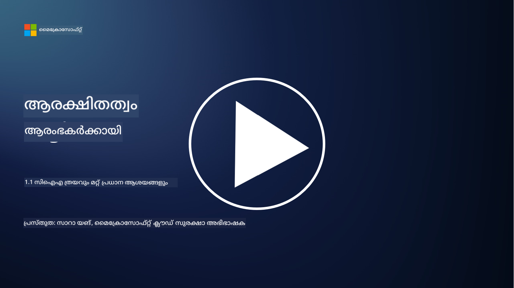
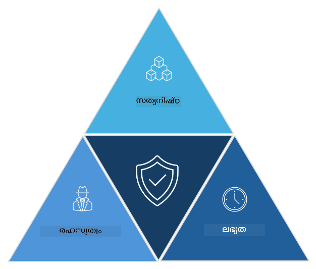

<!--
CO_OP_TRANSLATOR_METADATA:
{
  "original_hash": "16a76f9fa372fb63cffb6d76b855f023",
  "translation_date": "2025-12-19T12:49:40+00:00",
  "source_file": "1.1 The CIA triad and other key concepts.md",
  "language_code": "ml"
}
-->
# സിഐഎ ത്രയവും മറ്റ് പ്രധാന ആശയങ്ങളും

## പരിചയം

ഈ പാഠത്തിൽ, നാം ചർച്ച ചെയ്യുന്നത്:

 - സൈബർസുരക്ഷയെന്നത് എന്താണ്?
   
 - സൈബർസുരക്ഷ സിഐഎ ത്രയം എന്താണ്?

 - സൈബർസുരക്ഷയുടെ പശ്ചാത്തലത്തിൽ പ്രാമാണികത, നിഷേധാത്മകത, സ്വകാര്യത എന്നിവ എന്താണ്?

## സൈബർസുരക്ഷയെന്നത് എന്താണ്?

സൈബർസുരക്ഷ, അല്ലെങ്കിൽ വിവരസുരക്ഷ, കമ്പ്യൂട്ടർ സിസ്റ്റങ്ങൾ, നെറ്റ്വർക്കുകൾ, ഉപകരണങ്ങൾ, ഡാറ്റ എന്നിവ ഡിജിറ്റൽ ആക്രമണങ്ങളിൽ നിന്ന്, അനധികൃത പ്രവേശനത്തിൽ നിന്ന്, നാശനഷ്ടങ്ങളിൽ നിന്ന്, അല്ലെങ്കിൽ മോഷണത്തിൽ നിന്ന് സംരക്ഷിക്കുന്ന പ്രക്രിയയാണ്. സൈബർസുരക്ഷയുടെ പ്രധാന ലക്ഷ്യം ഡിജിറ്റൽ ആസ്തികളും വിവരങ്ങളും രഹസ്യത, അഖണ്ഡത, ലഭ്യത എന്നിവ ഉറപ്പാക്കുക എന്നതാണ്. സൈബർസുരക്ഷാ വിദഗ്ധർ ആസ്തികളും ഡാറ്റയും വിവരങ്ങളും സംരക്ഷിക്കാൻ സുരക്ഷാ നിയന്ത്രണങ്ങൾ രൂപകൽപ്പന ചെയ്യുകയും നടപ്പിലാക്കുകയും ചെയ്യുന്നു. നമ്മുടെ ജീവിതത്തിന്റെ കൂടുതൽ ഭാഗങ്ങളും ഡിജിറ്റലായി മാറിയതോടെ, സൈബർസുരക്ഷ സ്വകാര്യ വ്യക്തികൾക്കും സ്ഥാപനങ്ങൾക്കും പ്രധാന പ്രശ്നമായി മാറിയിരിക്കുന്നു.

## സൈബർസുരക്ഷ സിഐഎ ത്രയം എന്താണ്?

സൈബർസുരക്ഷ ത്രയം സൈബർസുരക്ഷാ പ്രവർത്തനങ്ങൾക്കോ ഒരു സിസ്റ്റം/പരിസ്ഥിതി രൂപകൽപ്പന ചെയ്യുന്നതിനോ ഉള്ള മൂന്ന് പ്രധാന പരിഗണനകളെ ഉൾക്കൊള്ളുന്ന മാതൃകയാണ്:

### രഹസ്യത

"സൈബർസുരക്ഷ" എന്ന് കേൾക്കുമ്പോൾ പലർക്കും പരിചിതമായ പരിഗണനയാണിത്: രഹസ്യത എന്നത് ഡാറ്റയും വിവരങ്ങളും അനധികൃത പ്രവേശന ശ്രമങ്ങളിൽ നിന്ന് സംരക്ഷിക്കുന്ന പ്രക്രിയയാണ്, അഥവാ വിവരങ്ങൾ കാണേണ്ട ആളുകൾക്ക് മാത്രമേ അതിൽ പ്രവേശിക്കാൻ കഴിയൂ. എല്ലാ ഡാറ്റയും ഒരുപോലെ സൃഷ്ടിക്കപ്പെട്ടിട്ടില്ല, ഡാറ്റ സാധാരണയായി തെറ്റായ ആളുകൾക്ക് ലഭിച്ചാൽ ഉണ്ടാകുന്ന നാശനഷ്ടത്തിന്റെ അടിസ്ഥാനത്തിൽ വർഗ്ഗീകരിക്കുകയും സംരക്ഷിക്കുകയും ചെയ്യുന്നു.

### അഖണ്ഡത

പരിസ്ഥിതികളിൽ അടങ്ങിയിരിക്കുന്ന ഡാറ്റയുടെ കൃത്യതയും വിശ്വസ്തതയും സംരക്ഷിക്കുകയും അനധികൃത വ്യക്തികൾക്ക് ഡാറ്റ മാറ്റാനോ തിരുത്താനോ അനുവദിക്കാതിരിക്കുകയും ചെയ്യുന്നതാണ് അഖണ്ഡത. ഉദാ: ഒരു വിദ്യാർത്ഥി അവരുടെ ജനനത്തീയതി DMV-യിലെ ഡ്രൈവർ റെക്കോർഡിൽ തിരുത്തി, അവർക്ക് മദ്യങ്ങൾ വാങ്ങാൻ പ്രായം കൂടിയതായി കാണിക്കാൻ ലൈസൻസ് പുനഃമുദ്രണം ചെയ്യാൻ കഴിയുന്ന earlier date of birth നൽകുന്നു.

### ലഭ്യത

ഓപ്പറേഷണൽ ഐടി മുഴുവൻ പരിഗണിക്കേണ്ട വിഷയമാണിത്, എന്നാൽ ലഭ്യത സൈബർസുരക്ഷയ്ക്കും പ്രധാനമാണ്. ലഭ്യത ലക്ഷ്യമാക്കി പ്രത്യേക തരം ആക്രമണങ്ങൾ ഉണ്ടാകാം, അവയിൽ നിന്ന് സുരക്ഷാ വിദഗ്ധർ സംരക്ഷണം നൽകണം (ഉദാ: ഡിസ്‌ട്രിബ്യൂട്ടഡ് ഡിനയൽ ഓഫ് സർവീസ് – DDoS – ആക്രമണങ്ങൾ).

**സൈബർസുരക്ഷ സിഐഎ ത്രയം**

## സൈബർസുരക്ഷയുടെ പശ്ചാത്തലത്തിൽ പ്രാമാണികത, നിഷേധാത്മകത, സ്വകാര്യത എന്നിവ എന്താണ്?

സിസ്റ്റങ്ങളും ഡാറ്റയും സുരക്ഷിതവും വിശ്വസനീയവുമാക്കാൻ സഹായിക്കുന്ന മറ്റ് പ്രധാന ആശയങ്ങളാണ് ഇവ:

**പ്രാമാണികത** - നിങ്ങൾ ഇടപഴകുന്ന വിവരങ്ങൾ, ആശയവിനിമയം, അല്ലെങ്കിൽ സബ്ജക്റ്റ് യഥാർത്ഥമാണെന്നും അനധികൃത പാർട്ടികൾ അത് കൈകാര്യം ചെയ്തിട്ടില്ലെന്നും ഉറപ്പാക്കുന്നതാണ് പ്രാമാണികത.

**നിഷേധാത്മകത** - ഒരു പാർട്ടി അവരുടെ പങ്കാളിത്തം അല്ലെങ്കിൽ ഒരു ഇടപാടിന്റെ അല്ലെങ്കിൽ ആശയവിനിമയത്തിന്റെ യാഥാർത്ഥ്യം നിഷേധിക്കാൻ കഴിയാത്തതിന്റെ ആശയമാണ്. ഒരു സന്ദേശം അയച്ചിട്ടില്ല, അല്ലെങ്കിൽ ഒരു പ്രത്യേക പ്രവർത്തനം ചെയ്തിട്ടില്ല എന്ന് അവകാശപ്പെടുന്നത് തടയുന്നു, എതിർ തെളിവുകൾ ഉള്ളപ്പോൾ.

**സ്വകാര്യത** - അനധികൃത പ്രവേശനത്തിൽ നിന്ന്, ഉപയോഗത്തിൽ നിന്ന്, വെളിപ്പെടുത്തലിൽ നിന്ന്, അല്ലെങ്കിൽ കൈകാര്യം ചെയ്യലിൽ നിന്ന് സംവേദനശേഷിയുള്ള വ്യക്തിഗത വിവരങ്ങളെ സംരക്ഷിക്കുന്നതിനെ സൂചിപ്പിക്കുന്നു. വ്യക്തിഗത ഡാറ്റയിലേക്ക് ആരെ പ്രവേശിപ്പിക്കണം, ആ ഡാറ്റ എങ്ങനെ ശേഖരിക്കപ്പെടുന്നു, സംഭരിക്കപ്പെടുന്നു, പങ്കിടപ്പെടുന്നു എന്നിവ നിയന്ത്രിക്കുന്നതും ഇതിൽ ഉൾപ്പെടുന്നു.

## കൂടുതൽ വായനയ്ക്ക്

[What Is Information Security (InfoSec)? | Microsoft Security](https://www.microsoft.com/security/business/security-101/what-is-information-security-infosec#:~:text=Three%20pillars%20of%20information%20security%3A%20the%20CIA%20triad,as%20guiding%20principles%20for%20implementing%20an%20InfoSec%20plan.)

---

<!-- CO-OP TRANSLATOR DISCLAIMER START -->
**അറിയിപ്പ്**:  
ഈ രേഖ AI പരിഭാഷാ സേവനം [Co-op Translator](https://github.com/Azure/co-op-translator) ഉപയോഗിച്ച് പരിഭാഷപ്പെടുത്തിയതാണ്. ഞങ്ങൾ കൃത്യതയ്ക്കായി ശ്രമിക്കുന്നുവെങ്കിലും, ഓട്ടോമേറ്റഡ് പരിഭാഷകളിൽ പിഴവുകൾ അല്ലെങ്കിൽ തെറ്റായ വിവരങ്ങൾ ഉണ്ടാകാൻ സാധ്യതയുണ്ട്. അതിന്റെ സ്വാഭാവിക ഭാഷയിലുള്ള മൗലിക രേഖയാണ് പ്രാമാണികമായ ഉറവിടമായി പരിഗണിക്കേണ്ടത്. നിർണായകമായ വിവരങ്ങൾക്ക്, പ്രൊഫഷണൽ മനുഷ്യ പരിഭാഷ ശുപാർശ ചെയ്യുന്നു. ഈ പരിഭാഷ ഉപയോഗിച്ച് ഉണ്ടാകുന്ന തെറ്റിദ്ധാരണകൾ അല്ലെങ്കിൽ തെറ്റായ വ്യാഖ്യാനങ്ങൾക്കായി ഞങ്ങൾ ഉത്തരവാദികളല്ല.
<!-- CO-OP TRANSLATOR DISCLAIMER END -->