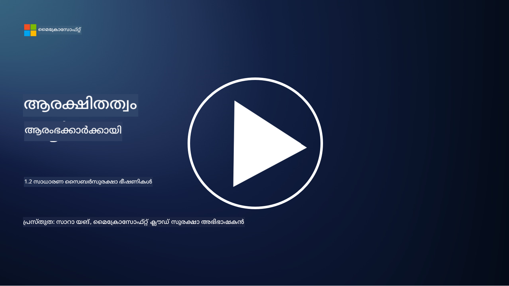

<!--
CO_OP_TRANSLATOR_METADATA:
{
  "original_hash": "6fc3030323139d7134a4ca9d03eccac9",
  "translation_date": "2025-12-19T13:32:23+00:00",
  "source_file": "1.2 Common cybersecurity threats.md",
  "language_code": "ml"
}
-->
# സാധാരണ സൈബർസുരക്ഷാ ഭീഷണികൾ

## പരിചയം

ഈ പാഠത്തിൽ, നമുക്ക് ചർച്ച ചെയ്യാം:

 - സൈബർസുരക്ഷാ ഭീഷണിയെന്നത് എന്താണ്?
   
 - ദുഷ്ടപ്രവർത്തകർ ഡാറ്റയും ഐടി സിസ്റ്റങ്ങളും തകർക്കാൻ ആഗ്രഹിക്കുന്നതെന്തുകൊണ്ട്?

 - ഏറ്റവും സാധാരണമായ സൈബർസുരക്ഷാ ഭീഷണികളുടെ തരം എന്തൊക്കെയാണ്?

 - MITRE ATT&CK ഫ്രെയിംവർക്ക് എന്താണ്?

 - സൈബർസുരക്ഷാ ഭീഷണികളുടെ സ്ഥിതിഗതികൾ അറിയാൻ എവിടെ നിന്നാണ് അപ്‌ഡേറ്റുകൾ ലഭിക്കുക?

## സൈബർസുരക്ഷാ ഭീഷണിയെന്നത് എന്താണ്?

സൈബർസുരക്ഷാ ഭീഷണിയെന്നത് ഡാറ്റയുടെയോ ഐടി സിസ്റ്റങ്ങളുടെയോ രഹസ്യത, സമഗ്രത, ലഭ്യത എന്നിവയെ ബാധിക്കാനുള്ള സാധ്യതയുള്ള ഏതെങ്കിലും അപകടമോ അപകടസാധ്യതയോ ആണ്. ദുഷ്ടപ്രവർത്തകർ സിസ്റ്റങ്ങളിലെ ദൗർബല്യങ്ങൾ ഉപയോഗിച്ച് അനധികൃതമായി പ്രവേശനം നേടാനും, സംവേദനാത്മകമായ വിവരങ്ങൾ മോഷ്ടിക്കാനും, പ്രവർത്തനങ്ങൾ തടസ്സപ്പെടുത്താനും, വ്യക്തികൾക്കും സ്ഥാപനങ്ങൾക്കും രാജ്യങ്ങൾക്കുമെതിരെ ഹാനികരമായ പ്രവർത്തനങ്ങൾ നടത്താനും ശ്രമിക്കുന്നു. സൈബർസുരക്ഷാ ഭീഷണികൾ വിവിധ രൂപങ്ങളിലായും ഡിജിറ്റൽ സിസ്റ്റങ്ങളും ഡാറ്റയും ലക്ഷ്യമാക്കിയും വരാം.

## ദുഷ്ടപ്രവർത്തകർ ഡാറ്റയും ഐടി സിസ്റ്റങ്ങളും തകർക്കാൻ ആഗ്രഹിക്കുന്നതെന്തുകൊണ്ട്?

ദുഷ്ടപ്രവർത്തകർ പല കാരണങ്ങളാലാണ് ഡാറ്റയും ഐടി സിസ്റ്റങ്ങളും തകർക്കുന്നത്. പലപ്പോഴും വ്യക്തിപരമായ ലാഭം, ആശയപരമായ ഉദ്ദേശങ്ങൾ, അല്ലെങ്കിൽ അക്രമം സൃഷ്ടിക്കാനുള്ള ആഗ്രഹം എന്നിവയാണ് ഇതിന് പിന്നിൽ. ഈ ഉദ്ദേശങ്ങൾ മനസ്സിലാക്കുന്നത് വ്യക്തികൾക്കും സ്ഥാപനങ്ങൾക്കും സൈബർ ഭീഷണികളിൽ നിന്ന് പ്രതിരോധം മെച്ചപ്പെടുത്താൻ സഹായകരമാണ്. ദുഷ്ടപ്രവർത്തകർ സൈബർ ആക്രമണങ്ങളിൽ ഏർപ്പെടുന്ന ചില സാധാരണമായ കാരണങ്ങൾ:

1. **സാമ്പത്തിക ലാഭം**: പല ആക്രമണങ്ങളും സാമ്പത്തിക ലാഭത്തിനായാണ് നടത്തുന്നത്. ക്രെഡിറ്റ് കാർഡ് നമ്പറുകൾ, ബാങ്ക് അക്കൗണ്ട് വിവരങ്ങൾ, വ്യക്തിഗത തിരിച്ചറിയൽ വിവരങ്ങൾ എന്നിവ മോഷ്ടിച്ച് തട്ടിപ്പ് നടത്താനും, തിരിച്ചറിയൽ മോഷണം നടത്താനും, റാൻസം ആവശ്യപ്പെടാനും, അല്ലെങ്കിൽ മോഷ്ടിച്ച ഡാറ്റ ഡാർക്ക് വെബിൽ വിൽക്കാനുമാണ് ശ്രമം.

2. **ജാസൂസ്യം**: രാജ്യങ്ങൾ, മത്സരക്കാർ, അല്ലെങ്കിൽ മറ്റ് സബ്ജക്ടുകൾ രാഷ്ട്രീയ, സാമ്പത്തിക, സൈനിക നേട്ടങ്ങൾക്കായി സർക്കാർ, കോർപ്പറേറ്റ്, അല്ലെങ്കിൽ ഗവേഷണ ഡാറ്റ മോഷ്ടിക്കാൻ സൈബർ ജാസൂസ്യത്തിൽ ഏർപ്പെടാം.

3. **തകരാറും നാശവും**: ചില ആക്രമണങ്ങൾ രാഷ്ട്രീയമോ ആശയപരമോ ആയ ഉദ്ദേശ്യങ്ങൾക്കായി നിർണായകമായ അടിസ്ഥാനസൗകര്യങ്ങൾ, സേവനങ്ങൾ, അല്ലെങ്കിൽ പ്രവർത്തനങ്ങൾ തകർക്കാൻ ലക്ഷ്യമിടുന്നു. ഇത് വ്യാപകമായ കലാപം, സാമ്പത്തിക നഷ്ടം, പ്രതിഷ്ഠാ നാശം എന്നിവയ്ക്ക് കാരണമാകും.

4. **ആശയപരമായ ഉദ്ദേശങ്ങൾ**: ഹാക്ടിവിസ്റ്റുകളും ആശയപരമോ രാഷ്ട്രീയമോ ആയ ഉദ്ദേശ്യങ്ങളുള്ള ഗ്രൂപ്പുകളും ചില വിഷയങ്ങളെക്കുറിച്ച് അവബോധം ഉയർത്താനും, അവരുടെ വിശ്വാസങ്ങൾ പ്രചരിപ്പിക്കാനും, പ്രത്യേക പ്രവർത്തനങ്ങൾക്കോ സ്ഥാപനങ്ങൾക്കോ എതിരായി പ്രതിഷേധിക്കാനുമാണ് സിസ്റ്റങ്ങൾ തകർക്കുന്നത്.

5. **അനാവശ്യ പ്രവർത്തനങ്ങൾ**: എല്ലാ ദുഷ്ടപ്രവർത്തനങ്ങളും ഉദ്ദേശ്യപൂർവ്വമല്ല; ചില വ്യക്തികൾ സാമൂഹിക എഞ്ചിനീയറിംഗിന് ഇരയാകുന്നതിലൂടെയോ ഒരു തകരാറിലായ നെറ്റ്വർക്കിന്റെ ഭാഗമാകുന്നതിലൂടെയോ അനാവശ്യമായി സൈബർ ഭീഷണികളിൽ പങ്കാളികളാകാം.

അവസാനമായി, ഡാറ്റയും ഐടി സിസ്റ്റങ്ങളും തകർക്കാനുള്ള ഉദ്ദേശങ്ങൾ വ്യത്യസ്തമായിരിക്കും, എന്നാൽ ഈ ആക്രമണങ്ങളുടെ പ്രഭാവം ഗുരുതരമായിരിക്കും. വ്യക്തികളും സ്ഥാപനങ്ങളും സർക്കാരുകളും സൈബർസുരക്ഷയെ ഗൗരവത്തോടെ കാണുകയും ഈ ഭീഷണികളിൽ നിന്ന് സംരക്ഷിക്കാൻ നടപടികൾ സ്വീകരിക്കുകയും ചെയ്യുന്നത് അത്യാവശ്യമാണ്.

## ഏറ്റവും സാധാരണമായ സൈബർസുരക്ഷാ ഭീഷണികളുടെ തരം എന്തൊക്കെയാണ്?

സിസ്റ്റങ്ങൾ തകർക്കാനും, ഡാറ്റ മോഷ്ടിക്കാനും, തടസ്സങ്ങൾ സൃഷ്ടിക്കാനുമുള്ള നിരവധി സാധാരണ സൈബർ ആക്രമണങ്ങൾ ഉണ്ട്. ഇവിടെ ചില പ്രധാന തരം ഭീഷണികൾ:

1. **ഫിഷിംഗ്**:

ഫിഷിംഗ് എന്നത് വിശ്വസനീയമായ ഉറവിടങ്ങളിൽ നിന്നുള്ളതുപോലെ തോന്നിക്കുന്ന കള്ളമെയിലുകളോ സന്ദേശങ്ങളോ അയച്ച്, പാസ്വേഡുകൾ, ക്രെഡിറ്റ് കാർഡ് നമ്പറുകൾ, വ്യക്തിഗത വിവരങ്ങൾ എന്നിവ വെളിപ്പെടുത്താൻ ആളുകളെ വഞ്ചിക്കുന്ന പ്രക്രിയയാണ്. ഫിഷിംഗ് ആക്രമണങ്ങൾ ആളുകളെ ദുഷ്ട വെബ്സൈറ്റുകളിലേക്ക് നയിക്കാനോ മാൽവെയർ ഡൗൺലോഡ് ചെയ്യാനോ കാരണമാകാം.

2. **മാൽവെയർ**:

മാൽവെയർ (ദുഷ്ട സോഫ്റ്റ്‌വെയർ) സിസ്റ്റങ്ങൾ ബാധിക്കാനും, ഡാറ്റ മോഷ്ടിക്കാനും, നാശം സൃഷ്ടിക്കാനുമുള്ള വിവിധ ദുഷ്ട പ്രോഗ്രാമുകൾ ഉൾക്കൊള്ളുന്നു. മാൽവെയറിന്റെ ചില തരം:

- **റാൻസംവെയർ**: ഫയലുകൾ എൻക്രിപ്റ്റ് ചെയ്ത് ഡീക്രിപ്ഷനായി റാൻസം ആവശ്യപ്പെടുന്നു.

- **ട്രോജൻസ്**: വിശ്വസനീയമായ സോഫ്റ്റ്‌വെയറായാണ് തോന്നിക്കുന്നത്, എന്നാൽ അനധികൃത പ്രവേശനം നൽകുന്നു.

- **വൈറസുകൾ**: ഫയലുകളിൽ ചേർന്ന് സ്വയം പകർന്നെടുക്കുന്ന പ്രോഗ്രാമുകൾ.

- **വേർമ്മുകൾ**: നെറ്റ്വർക്കുകൾ വഴി സ്വയം പകർന്നെടുക്കുന്ന പ്രോഗ്രാമുകൾ.

3. **ഡിനയൽ ഓഫ് സർവീസ് (DoS) & ഡിസ്‌ട്രിബ്യൂട്ടഡ് ഡിനയൽ ഓഫ് സർവീസ് (DDoS)**:

DoS ആക്രമണങ്ങൾ ഒരു ലക്ഷ്യ സിസ്റ്റത്തെ ഓവർലോഡ് ചെയ്ത് ഉപയോക്താക്കൾക്ക് ലഭ്യമാകാതാക്കുന്നു. DDoS ആക്രമണങ്ങൾ ഒരു നെറ്റ്വർക്കിലെ തകരാറിലായ ഉപകരണങ്ങൾ ഉപയോഗിച്ച് ലക്ഷ്യത്തെ ട്രാഫിക്കിൽ മുക്കി സിസ്റ്റം ശരിയായി പ്രവർത്തിക്കാൻ കഴിയാത്തവിധം തടസ്സപ്പെടുത്തുന്നു.

4. **SQL Injection**:

ഈ ആക്രമണത്തിൽ, ആക്രമണകർ വെബ് ആപ്ലിക്കേഷന്റെ ഇൻപുട്ട് ഫീൽഡുകൾ ഉപയോഗിച്ച് ദുഷ്ട SQL ക്വെറികൾ ചേർത്ത് ഡാറ്റാബേസുകളിലേക്കും സംവേദനാത്മക ഡാറ്റയിലേക്കും അനധികൃത പ്രവേശനം നേടുന്നു.

5. **ക്രോസ്-സൈറ്റ് സ്ക്രിപ്റ്റിംഗ് (XSS)**:

ആക്രമണകർ ദുഷ്ട സ്ക്രിപ്റ്റുകൾ വെബ് ആപ്ലിക്കേഷനുകളിൽ ചേർക്കുന്നു, അവ ഉപയോക്താക്കളുടെ ബ്രൗസറുകളിൽ പ്രവർത്തിക്കുന്നു. ഇത് ഉപയോക്തൃ ഡാറ്റ മോഷ്ടിക്കാനും മാൽവെയർ പ്രചരിപ്പിക്കാനും കാരണമാകാം.

6. **സോഷ്യൽ എഞ്ചിനീയറിംഗ്**:

സോഷ്യൽ എഞ്ചിനീയറിംഗ് മനുഷ്യ മനശ്ശാസ്ത്രത്തെ ഉപയോഗിച്ച് വ്യക്തികളെ രഹസ്യ വിവരങ്ങൾ വെളിപ്പെടുത്താനോ സുരക്ഷയെ ബാധിക്കുന്ന പ്രവർത്തനങ്ങൾ ചെയ്യാനോ പ്രേരിപ്പിക്കുന്നു.

7. **സീറോ-ഡേ (0day) എക്സ്പ്ലോയിറ്റുകൾ**:

ഇവ സോഫ്റ്റ്‌വെയറിലോ ഹാർഡ്‌വെയറിലോ ഉള്ള, വിൽപ്പനക്കാരനോ പൊതുജനങ്ങളോ അറിയാത്ത ദൗർബല്യങ്ങളെ ലക്ഷ്യമിടുന്നു. പാച്ചുകൾ വികസിപ്പിക്കുന്നതിന് മുമ്പ് ആക്രമണകർ ഈ ദൗർബല്യങ്ങൾ ഉപയോഗിക്കുന്നു. സീറോ-ഡേ ആക്രമണങ്ങൾ അപൂർവമാണെങ്കിലും, കണ്ടെത്തിയാൽ സുരക്ഷാ ഗവേഷകർ പെട്ടെന്ന് പാച്ച് വികസിപ്പിക്കും, അതിനാൽ ഇവ സാധാരണയായി ദീർഘകാലം നിലനിൽക്കില്ല.

8. **ക്രെഡൻഷ്യൽ ആക്രമണങ്ങൾ**:

ഇവയിൽ ബ്രൂട്ട് ഫോഴ്‌സ് ആക്രമണങ്ങൾ ഉൾപ്പെടുന്നു, അതിൽ ആക്രമണകർ പാസ്വേഡുകൾ ആവർത്തിച്ച് ഗസ് ചെയ്യുന്നു, കൂടാതെ ഒരു സൈറ്റിൽ നിന്ന് മോഷ്ടിച്ച ക്രെഡൻഷ്യലുകൾ മറ്റൊരു സൈറ്റിൽ ഉപയോഗിക്കുന്ന ക്രെഡൻഷ്യൽ സ്റ്റഫിംഗ് ആക്രമണങ്ങളും.

## MITRE ATT&CK ഫ്രെയിംവർക്ക് എന്താണ്?

[MITRE ATT&CK ഫ്രെയിംവർക്ക്](https://attack.mitre.org/) (Adversarial Tactics, Techniques, and Common Knowledge) സൈബർ ആക്രമണങ്ങൾക്കിടെ എതിരാളികൾ ഉപയോഗിക്കുന്ന തന്ത്രങ്ങൾ, സാങ്കേതികവിദ്യകൾ, പ്രക്രിയകൾ (TTPs) എന്നിവ കാറ്റലോഗ് ചെയ്യുകയും വർഗ്ഗീകരിക്കുകയും ചെയ്യുന്ന ഒരു ഫ്രെയിംവർക്കാണ്. ഇത് MITRE കോർപ്പറേഷൻ എന്ന ഗവേഷണ-വികസന കേന്ദ്രം പ്രവർത്തിപ്പിക്കുന്ന ലാഭേച്ഛയില്ലാത്ത ഒരു സംഘടനയാണ് രൂപകൽപ്പന ചെയ്തത്.

MITRE ATT&CK ഫ്രെയിംവർക്ക് സൈബർ ഭീഷണികളെ വിശകലനം ചെയ്യാനും വിവരിക്കാനും ഒരു സ്റ്റാൻഡേർഡ് മാർഗം നൽകുന്നു, ഇതിലൂടെ സൈബർസുരക്ഷാ വിദഗ്ധർ വിവിധ ആക്രമണ സാങ്കേതികവിദ്യകളെക്കുറിച്ച് കൂടുതൽ മനസ്സിലാക്കുകയും പ്രതിരോധം മെച്ചപ്പെടുത്തുകയും ചെയ്യുന്നു. ഇത് സുരക്ഷാ ടീമുകൾ, ഭീഷണി വേട്ടക്കാരൻമാർ, ഇൻസിഡന്റ് റെസ്പോണ്ടർമാർ എന്നിവരാൽ വ്യാപകമായി ഉപയോഗിക്കുന്നു:

1. **എതിരാളികളുടെ പെരുമാറ്റം മനസ്സിലാക്കുക**: ഫ്രെയിംവർക്ക് യഥാർത്ഥ ലോക ആക്രമണ പെരുമാറ്റങ്ങളെ രേഖപ്പെടുത്തുന്നു, പ്രാരംഭ പ്രവേശനത്തിൽ നിന്ന് അവരുടെ ലക്ഷ്യങ്ങൾ നേടുന്നതുവരെ ആക്രമണകർ സ്വീകരിക്കുന്ന ചുവടുവയ്പ്പുകൾ വിശദീകരിക്കുന്നു.

2. **പ്രതിരോധ തന്ത്രങ്ങൾ ആസൂത്രണം ചെയ്യുക**: സുരക്ഷാ ടീമുകൾ എതിരാളികൾ ഉപയോഗിച്ചേക്കാവുന്ന പ്രത്യേക തന്ത്രങ്ങളുമായി പൊരുത്തപ്പെടുന്ന പ്രതിരോധ തന്ത്രങ്ങൾ വികസിപ്പിക്കാൻ ഫ്രെയിംവർക്ക് ഉപയോഗിക്കാം.

3. **ഇൻസിഡന്റ് റെസ്പോൺസ് & ഭീഷണി വേട്ട**: സംഭവങ്ങൾ അന്വേഷിക്കുമ്പോഴും ഭീഷണികളെ വേട്ടയാടുമ്പോഴും, സുരക്ഷാ വിദഗ്ധർ ഫ്രെയിംവർക്ക് ഉപയോഗിച്ച് ആക്രമണകർ ഉപയോഗിച്ച പ്രത്യേക സാങ്കേതികവിദ്യകളെ തിരിച്ചറിയുകയും കുറയ്ക്കുകയും ചെയ്യാം.

MITRE ATT&CK ഫ്രെയിംവർക്ക് വിൻഡോസ്, മാക്‌ഒഎസ്, ലിനക്സ്, ക്ലൗഡ് സേവനങ്ങൾ എന്നിവ പോലുള്ള പ്രത്യേക പ്ലാറ്റ്‌ഫോമുകളും പരിസ്ഥിതികളും അടിസ്ഥാനമാക്കി ആക്രമണ സാങ്കേതികവിദ്യകളെ ഗ്രൂപ്പ് ചെയ്യുന്നതിന് മാട്രിസുകളായി ക്രമീകരിച്ചിരിക്കുന്നു. ഓരോ മാട്രിസും തന്ത്രങ്ങൾ (ഉയർന്ന തലത്തിലുള്ള ലക്ഷ്യങ്ങൾ) സാങ്കേതികവിദ്യകൾ (ആ ലക്ഷ്യങ്ങൾ നേടാൻ ഉപയോഗിക്കുന്ന പ്രത്യേക രീതികൾ) എന്നിവയാക്കി വിഭജിച്ചിരിക്കുന്നു. ഓരോ സാങ്കേതികവിദ്യയുടെയും പ്രവർത്തന രീതി, സാധ്യതയുള്ള പ്രതിരോധങ്ങൾ, ആ സാങ്കേതികവിദ്യ ഉപയോഗിച്ച യഥാർത്ഥ ലോക ഭീഷണികളുമായി ബന്ധപ്പെട്ട റഫറൻസുകൾ എന്നിവയെക്കുറിച്ചുള്ള വിവരങ്ങൾ ഫ്രെയിംവർക്ക് നൽകുന്നു.

സൈബർസുരക്ഷാ രംഗം വികസിക്കുന്നതനുസരിച്ച് പുതിയ ഭീഷണികളുമായി ബന്ധപ്പെട്ട വിവരങ്ങൾ ശേഖരിച്ച് ഫ്രെയിംവർക്ക് തുടർച്ചയായി അപ്‌ഡേറ്റ് ചെയ്യുകയും വിപുലീകരിക്കുകയും ചെയ്യുന്നു. ആക്രമണകരുടെ പ്രവർത്തന രീതി എങ്ങനെ പ്രതിരോധിക്കാമെന്ന് ആഴത്തിൽ മനസ്സിലാക്കുന്നതിലൂടെ ഒരു സ്ഥാപനത്തിന്റെ സൈബർസുരക്ഷാ നിലപാട് മെച്ചപ്പെടുത്താൻ ഇത് ഒരു വിലപ്പെട്ട വിഭവമാണ്.

## സൈബർസുരക്ഷാ ഭീഷണികളുടെ സ്ഥിതിഗതികൾ അറിയാൻ എവിടെ നിന്നാണ് അപ്‌ഡേറ്റുകൾ ലഭിക്കുക?

സൈബർസുരക്ഷാ ഭീഷണികളെക്കുറിച്ച് അറിയാൻ ഉപയോഗിക്കാവുന്ന നിരവധി ഉറവിടങ്ങൾ ഉണ്ട്, ഇവയിൽ ചിലത്:

 - [ഓപ്പൺ വെബ് ആപ്ലിക്കേഷൻ സെക്യൂരിറ്റി പ്രോജക്റ്റ് (OWASP) ടോപ്പ് 10 ദൗർബല്യങ്ങൾ](https://owasp.org/Top10/)
 - [കോമൺ വൾണറബിലിറ്റീസ് ആൻഡ് എക്സ്പോഷറുകൾ (CVEs)](https://www.bing.com/ck/a?!&&p=53df6007f017bca2JmltdHM9MTY5MjU3NjAwMCZpZ3VpZD0zYmY4N2RiYS1jYWI1LTYwMDgtMWY1YS02ZmYyY2JjNjYxZWUmaW5zaWQ9NTc2OQ&ptn=3&hsh=3&fclid=3bf87dba-cab5-6008-1f5a-6ff2cbc661ee&psq=cve&u=a1aHR0cHM6Ly9iaW5nLmNvbS9hbGluay9saW5rP3VybD1odHRwcyUzYSUyZiUyZmN2ZS5taXRyZS5vcmclMmYmc291cmNlPXNlcnAtcnImaD1BZXN4S0VBWTNnbGhNZEFpd3daMlNSZkZQNTlrODhIUnYxRUtlSkY1RTk0JTNkJnA9a2NvZmZjaWFsd2Vic2l0ZQ&ntb=1 "Common Vulnerabilities and Exposures")
 - [മൈക്രോസോഫ്റ്റ് സെക്യൂരിറ്റി റെസ്പോൺസ് സെന്റർ ബ്ലോഗുകൾ](https://msrc.microsoft.com/blog/)
 - [നാഷണൽ ഇൻസ്റ്റിറ്റ്യൂട്ട് ഓഫ് സ്റ്റാൻഡേർഡ്സ് ആൻഡ് ടെക്നോളജി (NIST)](https://www.dhs.gov/topics/cybersecurity): NIST സൈബർസുരക്ഷാ ഭീഷണികളെക്കുറിച്ചുള്ള വിഭവങ്ങൾ, അലർട്ടുകൾ, ഏറ്റവും പുതിയ അപ്‌ഡേറ്റുകൾ എന്നിവ നൽകുന്നു.
 - [സൈബർസുരക്ഷാ & ഇൻഫ്രാസ്ട്രക്ചർ സെക്യൂരിറ്റി ഏജൻസി (CISA)](https://www.cisa.gov/resources-tools/resources/free-cybersecurity-services-and-tools): CISA ബിസിനസുകൾ, സർക്കാർ ഏജൻസികൾ, മറ്റ് സ്ഥാപനങ്ങൾ എന്നിവയ്ക്കായി സൈബർസുരക്ഷാ വിഭവങ്ങളും മികച്ച രീതികളും നൽകുന്നു. CISA സമൂഹത്തെ ബാധിക്കുന്ന ഉയർന്ന പ്രഭാവമുള്ള സുരക്ഷാ പ്രവർത്തനങ്ങളെയും പുതിയ സൈബർ ഭീഷണികളെയും കുറിച്ചുള്ള വിശദമായ വിശകലനവും പങ്കിടുന്നു.
 - [നാഷണൽ സൈബർസുരക്ഷാ സെന്റർ ഓഫ് എക്സലൻസ് (NCCoE)](https://www.dhs.gov/topics/cybersecurity): NCCoE യഥാർത്ഥ ലോക സാഹചര്യങ്ങളിൽ പ്രയോഗിക്കാവുന്ന പ്രായോഗിക സൈബർസുരക്ഷാ പരിഹാരങ്ങൾ നൽകുന്ന ഒരു കേന്ദ്രമാണ്.
 - [US-CERT](https://www.cisa.gov/resources-tools/resources/free-cybersecurity-services-and-tools): യുണൈറ്റഡ് സ്റ്റേറ്റ്സ് കമ്പ്യൂട്ടർ എമർജൻസി റെഡിനസ് ടീം (US-CERT) അലർട്ടുകൾ, ടിപ്പുകൾ, മറ്റ് വിഭവങ്ങൾ എന്നിവ ഉൾപ്പെടെ വിവിധ സൈബർസുരക്ഷാ വിഭവങ്ങൾ നൽകുന്നു.
 - നിങ്ങളുടെ രാജ്യത്തെ സൈബർ എമർജൻസി റെസ്പോൺസ് ടീം (CERT)

---

<!-- CO-OP TRANSLATOR DISCLAIMER START -->
**അസത്യവാദം**:  
ഈ രേഖ AI വിവർത്തന സേവനമായ [Co-op Translator](https://github.com/Azure/co-op-translator) ഉപയോഗിച്ച് വിവർത്തനം ചെയ്തതാണ്. കൃത്യതയ്ക്കായി ഞങ്ങൾ ശ്രമിക്കുന്നുവെങ്കിലും, ഓട്ടോമേറ്റഡ് വിവർത്തനങ്ങളിൽ പിശകുകൾ അല്ലെങ്കിൽ തെറ്റായ വിവരങ്ങൾ ഉണ്ടാകാൻ സാധ്യതയുണ്ട്. അതിന്റെ മാതൃഭാഷയിലുള്ള മൗലികരേഖയാണ് വിശ്വസനീയമായ ഉറവിടമായി കണക്കാക്കേണ്ടത്. നിർണായകമായ വിവരങ്ങൾക്ക്, പ്രൊഫഷണൽ മനുഷ്യ വിവർത്തനം ശുപാർശ ചെയ്യുന്നു. ഈ വിവർത്തനം ഉപയോഗിക്കുന്നതിൽ നിന്നുണ്ടാകുന്ന തെറ്റിദ്ധാരണകൾക്കോ തെറ്റായ വ്യാഖ്യാനങ്ങൾക്കോ ഞങ്ങൾ ഉത്തരവാദികളല്ല.
<!-- CO-OP TRANSLATOR DISCLAIMER END -->