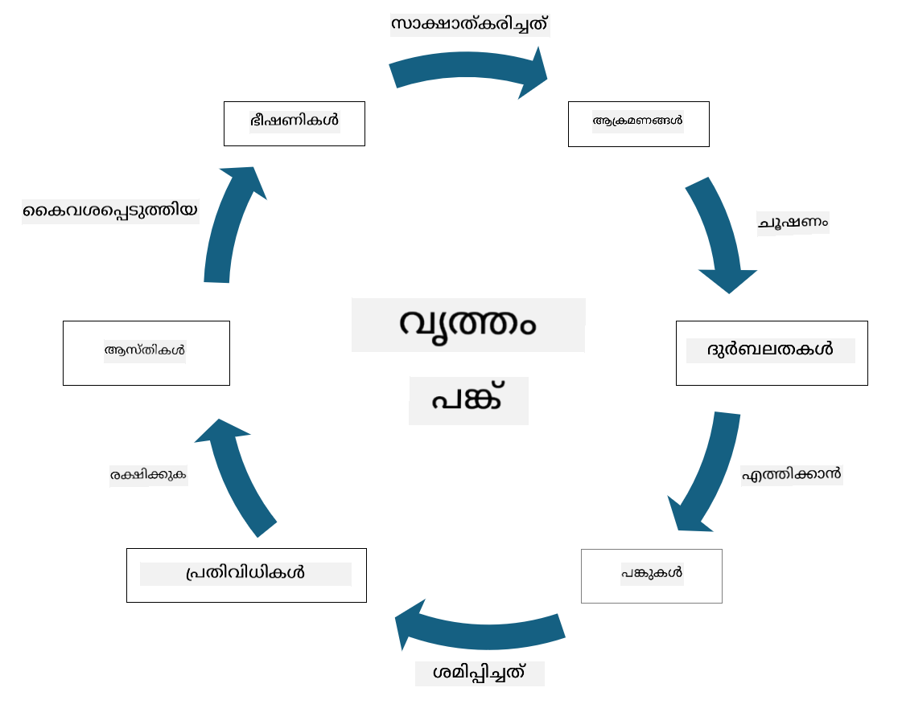

<!--
CO_OP_TRANSLATOR_METADATA:
{
  "original_hash": "fcca304f072cabf206388199e8e2e578",
  "translation_date": "2025-12-19T13:18:36+00:00",
  "source_file": "1.3 Understanding risk management.md",
  "language_code": "ml"
}
-->
# റിസ്ക് മാനേജ്മെന്റ് മനസ്സിലാക്കുക

## പരിചയം

ഈ പാഠത്തിൽ, നാം ചർച്ച ചെയ്യുന്നത്:

 - സാധാരണ ഉപയോഗിക്കുന്ന സുരക്ഷാ പദങ്ങളുടെ വ്യാഖ്യാനങ്ങൾ
   
 - സുരക്ഷാ നിയന്ത്രണങ്ങളുടെ തരം

 - സുരക്ഷാ റിസ്കുകൾ വിലയിരുത്തൽ

## സാധാരണ ഉപയോഗിക്കുന്ന സുരക്ഷാ പദങ്ങളുടെ വ്യാഖ്യാനങ്ങൾ

സൈബർസുരക്ഷയും റിസ്ക് മാനേജ്മെന്റും സംബന്ധിച്ച അടിസ്ഥാന ആശയങ്ങളാണ് ഈ പദങ്ങൾ. ഓരോ പദവും പരസ്പരം എങ്ങനെ ബന്ധപ്പെട്ടിരിക്കുന്നു എന്ന് നോക്കാം:

1. **ത്രീറ്റ് ഏജന്റ്**:

ത്രീറ്റ് ഏജന്റ് എന്നത് ഒരു വ്യക്തി, സംഘം, സംഘടന, അല്ലെങ്കിൽ ഓട്ടോമേറ്റഡ് സിസ്റ്റമാണ്, ഒരു സിസ്റ്റം അല്ലെങ്കിൽ നെറ്റ്‌വർക്കിലെ ദൗർബല്യങ്ങൾ ഉപയോഗിച്ച് ഹാനി അല്ലെങ്കിൽ നാശം വരുത്താനുള്ള സാധ്യതയുള്ളത്. ത്രീറ്റ് ഏജന്റുകളിൽ ഹാക്കർമാർ, മാൽവെയർ രചയിതാക്കൾ, അസന്തുഷ്ടരായ ജീവനക്കാർ, അല്ലെങ്കിൽ വിവര സാങ്കേതിക സിസ്റ്റങ്ങൾക്കും നെറ്റ്‌വർക്കുകൾക്കും ഭീഷണിയുള്ള ഏതെങ്കിലും ഘടകങ്ങൾ ഉൾപ്പെടുന്നു.

2. **ത്രീറ്റ്**:

ത്രീറ്റ് എന്നത് ഒരു സിസ്റ്റത്തിലെ ദൗർബല്യങ്ങൾ ഉപയോഗിച്ച് ഒരു ആസ്തിക്ക് ഹാനി വരുത്താൻ കഴിവുള്ള ഒരു സംഭവമോ പ്രവർത്തനമോ ആണ്. ഹാക്കിംഗ്, ഡാറ്റാ ചോർച്ച, ഡിനയൽ-ഓഫ്-സർവീസ് ആക്രമണങ്ങൾ എന്നിവ ത്രീറ്റുകളുടെ ഉദാഹരണങ്ങളാണ്. ത്രീറ്റുകൾ ഒരു സംഘടനയുടെ ആസ്തികൾക്ക് ഹാനി വരുത്താൻ കഴിവുള്ള "എന്ത്" ആണ്.

3. **വൾണറബിലിറ്റി**:

വൾണറബിലിറ്റി എന്നത് ഒരു സിസ്റ്റത്തിന്റെ രൂപകൽപ്പന, നടപ്പാക്കൽ, അല്ലെങ്കിൽ കോൺഫിഗറേഷനിലെ ദൗർബല്യങ്ങളോ പിഴവുകളോ ആണ്, ഇത് ഒരു ത്രീറ്റ് ഏജന്റിന് സിസ്റ്റത്തിന്റെ സുരക്ഷയെ ബാധിക്കാൻ ഉപയോഗിക്കാനാകും. സോഫ്റ്റ്‌വെയർ, ഹാർഡ്‌വെയർ, പ്രക്രിയകൾ, അല്ലെങ്കിൽ മനുഷ്യന്റെ പെരുമാറ്റം എന്നിവയിൽ വൾണറബിലിറ്റികൾ ഉണ്ടാകാം. വിജയകരമായ ആക്രമണങ്ങളുടെ സാധ്യത കുറയ്ക്കാൻ വൾണറബിലിറ്റികൾ തിരിച്ചറിയുകയും പരിഹരിക്കുകയും ചെയ്യുന്നത് അനിവാര്യമാണ്.

4. **റിസ്ക്**:

റിസ്ക് എന്നത് ഒരു ത്രീറ്റ് ഒരു വൾണറബിലിറ്റി ഉപയോഗിച്ച് ഒരു നെഗറ്റീവ് ഇഫക്റ്റ് ഉണ്ടാക്കാനുള്ള സാധ്യതയാണ്. ഇത് ഒരു ത്രീറ്റ് ഏജന്റ് ഒരു വൾണറബിലിറ്റി ഉപയോഗിച്ച് ഹാനി വരുത്താനുള്ള സാധ്യതയാണ്. റിസ്കുകൾ സാധാരണയായി അവയുടെ സാധ്യതയും പ്രഭാവവും അടിസ്ഥാനമാക്കി വിലയിരുത്തപ്പെടുന്നു.

5. **ആസ്തി**:

ആസ്തി എന്നത് ഒരു സംഘടന സംരക്ഷിക്കാൻ ആഗ്രഹിക്കുന്ന മൂല്യമുള്ള ഏതെങ്കിലും ഒന്നാണ്. ആസ്തികളിൽ ഭൗതിക വസ്തുക്കൾ (കമ്പ്യൂട്ടറുകളും സർവറുകളും പോലുള്ളവ), ഡാറ്റ (ഉപഭോക്തൃ വിവരങ്ങൾ, സാമ്പത്തിക രേഖകൾ), ബൗദ്ധിക സ്വത്തവകാശം (വ്യവസായ രഹസ്യങ്ങൾ, പാറ്റന്റുകൾ), മനുഷ്യ വിഭവങ്ങൾ (ജീവനക്കാരുടെ കഴിവുകളും അറിവും) എന്നിവ ഉൾപ്പെടുന്നു. ആസ്തികളെ സംരക്ഷിക്കുന്നത് സൈബർസുരക്ഷയുടെ പ്രധാന ലക്ഷ്യമാണ്.

6. **എക്സ്പോഷർ**:

എക്സ്പോഷർ എന്നത് ത്രീറ്റുകൾക്ക് എതിരായ ദൗർബല്യങ്ങൾ ഉള്ള അവസ്ഥയാണ്. ഒരു വൾണറബിലിറ്റി നിലവിലുണ്ടെങ്കിൽ അത് ഒരു ത്രീറ്റ് ഏജന്റിന് ഉപയോഗിക്കാനാകും. എക്സ്പോഷർ ഒരു സിസ്റ്റത്തിലോ നെറ്റ്‌വർക്കിലോ ദൗർബല്യങ്ങൾ ഉള്ളതിനാൽ ഉണ്ടാകുന്ന റിസ്ക് ചൂണ്ടിക്കാണിക്കുന്നു.

7. **കൺട്രോൾ**:

കൺട്രോൾ എന്നത് ദൗർബല്യങ്ങളും ത്രീറ്റുകളും ബന്ധപ്പെട്ട റിസ്ക് കുറയ്ക്കാൻ നടപ്പിലാക്കുന്ന ഒരു നടപടിയാണ്. കൺട്രോളുകൾ സാങ്കേതിക, പ്രക്രിയാത്മക, അല്ലെങ്കിൽ ഭരണപരമായ സ്വഭാവമുള്ളവ ആകാം. ത്രീറ്റുകളും വൾണറബിലിറ്റികളും തടയാനും കണ്ടെത്താനും കുറയ്ക്കാനും ഇവ രൂപകൽപ്പന ചെയ്തിരിക്കുന്നു. ഫയർവാളുകൾ, ആക്സസ് കൺട്രോളുകൾ, എൻക്രിപ്ഷൻ, സുരക്ഷാ നയങ്ങൾ, ജീവനക്കാരുടെ പരിശീലനം എന്നിവ ഉദാഹരണങ്ങളാണ്.

ഈ പദങ്ങളുടെ ബന്ധം ചുരുക്കി പറയുകയാണെങ്കിൽ: ത്രീറ്റ് ഏജന്റുകൾ വൾണറബിലിറ്റികൾ ഉപയോഗിച്ച് ത്രീറ്റുകൾ നടപ്പിലാക്കുന്നു, ഇത് മൂല്യമുള്ള ആസ്തികൾക്ക് ഹാനി വരുത്താനുള്ള റിസ്കുകൾക്ക് കാരണമാകുന്നു. വൾണറബിലിറ്റികൾ ഉള്ളപ്പോൾ എക്സ്പോഷർ ഉണ്ടാകുന്നു, ത്രീറ്റുകൾ ആസ്തികളിൽ ഉണ്ടാക്കുന്ന പ്രഭാവം കുറയ്ക്കാൻ കൺട്രോളുകൾ നടപ്പിലാക്കുന്നു. ഈ ഘടന സൈബർസുരക്ഷാ റിസ്ക് മാനേജ്മെന്റിന്റെ അടിസ്ഥാനമാണ്, ഇത് ഒരു സംഘടനയുടെ വിവര സിസ്റ്റങ്ങൾക്കും ആസ്തികൾക്കും സാധ്യതയുള്ള റിസ്കുകൾ തിരിച്ചറിയാനും വിലയിരുത്താനും പരിഹരിക്കാനും മാർഗനിർദ്ദേശം നൽകുന്നു.

## സുരക്ഷാ നിയന്ത്രണങ്ങളുടെ തരം

സുരക്ഷാ നിയന്ത്രണങ്ങൾ വിവിധ ത്രീറ്റുകളും വൾണറബിലിറ്റികളും നിന്ന് വിവര സിസ്റ്റങ്ങളും ആസ്തികളും സംരക്ഷിക്കാൻ നടപ്പിലാക്കുന്ന നടപടികളോ സുരക്ഷാ ഉപാധികളോ ആണ്. ഇവയുടെ ലക്ഷ്യവും ഉദ്ദേശ്യവും അടിസ്ഥാനമാക്കി പല വിഭാഗങ്ങളായി വേർതിരിക്കാം. ഇവിടെ ചില സാധാരണ സുരക്ഷാ നിയന്ത്രണങ്ങൾ ചർച്ച ചെയ്യുന്നു:

1. **അഡ്മിനിസ്ട്രേറ്റീവ് കൺട്രോളുകൾ**:

ഈ നിയന്ത്രണങ്ങൾ ഒരു സംഘടനയുടെ സുരക്ഷാ പ്രാക്ടീസുകളും ഉപയോക്തൃ പെരുമാറ്റവും നിയന്ത്രിക്കുന്ന നയങ്ങൾ, പ്രക്രിയകൾ, മാർഗ്ഗനിർദ്ദേശങ്ങൾ എന്നിവയുമായി ബന്ധപ്പെട്ടതാണ്.

- **സുരക്ഷാ നയങ്ങളും പ്രക്രിയകളും**: ഒരു സംഘടനയിൽ സുരക്ഷ എങ്ങനെ നിലനിർത്തണമെന്ന് നിർവചിക്കുന്ന രേഖാമൂലമായ മാർഗ്ഗനിർദ്ദേശങ്ങൾ.

- **സുരക്ഷാ അവബോധവും പരിശീലനവും**: ജീവനക്കാരെ സുരക്ഷാ മികച്ച പ്രാക്ടീസുകളിലും സാധ്യതയുള്ള ത്രീറ്റുകളിലും വിദ്യാഭ്യാസം നൽകുന്ന പരിപാടികൾ.

- **ഇൻസിഡന്റ് റെസ്പോൺസും മാനേജ്മെന്റും**: സുരക്ഷാ സംഭവങ്ങൾക്ക് പ്രതികരിക്കാനും കുറയ്ക്കാനും ഉള്ള പദ്ധതികൾ.

2. **ടെക്നിക്കൽ കൺട്രോളുകൾ**:

ടെക്നിക്കൽ കൺട്രോളുകൾ സാങ്കേതിക വിദ്യ ഉപയോഗിച്ച് സുരക്ഷാ നടപടികൾ നടപ്പിലാക്കാനും സിസ്റ്റങ്ങളും ഡാറ്റയും സംരക്ഷിക്കാനും ഉദ്ദേശിച്ചിരിക്കുന്നു. ഉദാഹരണങ്ങൾ:

- **ആക്സസ് കൺട്രോളുകൾ**: ഉപയോക്താക്കളുടെ റോളുകളും അനുമതികളും അടിസ്ഥാനമാക്കി റിസോഴ്സുകളിലേക്കുള്ള ആക്സസ് നിയന്ത്രിക്കുന്ന നടപടികൾ.

- **എൻക്രിപ്ഷൻ**: അനധികൃത ആക്സസ് തടയാൻ ഡാറ്റയെ ഒരു സുരക്ഷിത ഫോർമാറ്റിലേക്ക് മാറ്റുക.

- **ഫയർവാളുകൾ**: ഇൻകമിംഗ്, ഔട്ട്‌ഗോയിംഗ് ട്രാഫിക് ഫിൽറ്റർ ചെയ്യാനും നിയന്ത്രിക്കാനും ഉള്ള നെറ്റ്‌വർക്ക് സുരക്ഷാ ഉപകരണങ്ങൾ.

- **ഇൻട്രൂഷൻ ഡിറ്റക്ഷൻ ആൻഡ് പ്രിവൻഷൻ സിസ്റ്റംസ് (IDPS)**: സംശയാസ്പദമായ പ്രവർത്തനങ്ങൾക്കായി നെറ്റ്‌വർക്ക് ട്രാഫിക് നിരീക്ഷിക്കുന്ന ഉപകരണങ്ങൾ.

- **ആന്റിവൈറസ്, ആന്റി-മാൽവെയർ സോഫ്റ്റ്‌വെയർ**: ദോഷകരമായ സോഫ്റ്റ്‌വെയർ കണ്ടെത്താനും നീക്കം ചെയ്യാനും ഉള്ള പ്രോഗ്രാമുകൾ.

- **ഓതന്റിക്കേഷൻ മെക്കാനിസങ്ങൾ**: പാസ്‌വേഡുകൾ, ബയോമെട്രിക്സ്, മൾട്ടി-ഫാക്ടർ ഓതന്റിക്കേഷൻ പോലുള്ള ഉപയോക്താക്കളുടെ തിരിച്ചറിയൽ സ്ഥിരീകരിക്കുന്ന രീതികൾ.

- **പാച്ച് മാനേജ്മെന്റ്**: അറിയപ്പെടുന്ന വൾണറബിലിറ്റികൾ പരിഹരിക്കാൻ സോഫ്റ്റ്‌വെയർ സ്ഥിരമായി അപ്‌ഡേറ്റ് ചെയ്യുക.

3. **ഫിസിക്കൽ കൺട്രോളുകൾ**:

ഫിസിക്കൽ കൺട്രോളുകൾ ഭൗതിക ആസ്തികളും സൗകര്യങ്ങളും സംരക്ഷിക്കുന്നതിനുള്ള നടപടികളാണ്.

- **സുരക്ഷാ ഗാർഡുകളും ആക്സസ് കൺട്രോൾ ജീവനക്കാരും**: ഭൗതിക സ്ഥലങ്ങളിലേക്കുള്ള ആക്സസ് നിരീക്ഷിക്കുകയും നിയന്ത്രിക്കുകയും ചെയ്യുന്ന ജീവനക്കാർ.

- **സർവൈലൻസ് ക്യാമറകൾ**: പ്രവർത്തനങ്ങൾ നിരീക്ഷിക്കാനും റെക്കോർഡ് ചെയ്യാനും ഉള്ള വീഡിയോ നിരീക്ഷണ സിസ്റ്റങ്ങൾ.

- **ലോക്കുകളും ഫിസിക്കൽ തടസ്സങ്ങളും**: സെൻസിറ്റീവ് പ്രദേശങ്ങളിലേക്കുള്ള ആക്സസ് നിയന്ത്രിക്കുന്ന ഭൗതിക ഉപാധികൾ.

- **പരിസ്ഥിതി നിയന്ത്രണങ്ങൾ**: ഉപകരണങ്ങൾക്കും ഡാറ്റാ സെന്ററുകൾക്കും ബാധകമായ താപനില, ഈർപ്പം തുടങ്ങിയ പരിസ്ഥിതി ഘടകങ്ങൾ നിയന്ത്രിക്കുന്ന നടപടികൾ.

4. **ഓപ്പറേഷണൽ കൺട്രോളുകൾ**:

ഈ നിയന്ത്രണങ്ങൾ സിസ്റ്റങ്ങളുടെ തുടർച്ചയായ സുരക്ഷ ഉറപ്പാക്കുന്ന ദിവസേനയുള്ള പ്രവർത്തനങ്ങളുമായി ബന്ധപ്പെട്ടതാണ്.

- **ചേഞ്ച് മാനേജ്മെന്റ്**: സിസ്റ്റങ്ങളിലേക്കും കോൺഫിഗറേഷനുകളിലേക്കും മാറ്റങ്ങൾ ട്രാക്ക് ചെയ്യാനും അംഗീകരിക്കാനും ഉള്ള പ്രക്രിയകൾ.

- **ബാക്കപ്പ്, ദുരന്തനിവാരണ പദ്ധതി**: സിസ്റ്റം തകരാറോ ദുരന്തങ്ങളോ സംഭവിച്ചാൽ ഡാറ്റാ ബാക്കപ്പ്, പുനഃസ്ഥാപനം എന്നിവയ്ക്കുള്ള പദ്ധതികൾ.

- **ലോഗിംഗ്, ഓഡിറ്റിംഗ്**: സുരക്ഷയ്ക്കും അനുസരണത്തിനും വേണ്ടിയുള്ള സിസ്റ്റം പ്രവർത്തനങ്ങൾ നിരീക്ഷിക്കുകയും രേഖപ്പെടുത്തുകയും ചെയ്യുക.

- **സുരക്ഷിത കോഡിംഗ് പ്രാക്ടീസുകൾ**: വൾണറബിലിറ്റികൾ കുറയ്ക്കാൻ സോഫ്റ്റ്‌വെയർ എഴുതാനുള്ള മാർഗ്ഗനിർദ്ദേശങ്ങൾ.

5. **നിയമപരവും റെഗുലേറ്ററി കൺട്രോളുകളും**:

ഈ നിയന്ത്രണങ്ങൾ ബന്ധപ്പെട്ട നിയമങ്ങൾ, ചട്ടങ്ങൾ, വ്യവസായ മാനദണ്ഡങ്ങൾ എന്നിവ പാലിക്കുന്നത് ഉറപ്പാക്കുന്നു. ഒരു സംഘടന പാലിക്കേണ്ട മാനദണ്ഡങ്ങൾ അതിന്റെ നിയമപരമായ പരിധി, വ്യവസായ മേഖല, മറ്റ് ഘടകങ്ങൾ എന്നിവയിൽ ആശ്രയിച്ചിരിക്കുന്നു.

- **ഡാറ്റാ സംരക്ഷണ ചട്ടങ്ങൾ**: GDPR, HIPAA, CCPA പോലുള്ള നിയമങ്ങൾ പാലിക്കുക.

- **വ്യവസായ-നിർദ്ദിഷ്ട മാനദണ്ഡങ്ങൾ**: പെയ്മെന്റ് കാർഡ് ഡാറ്റാ സുരക്ഷയ്ക്കുള്ള PCI DSS പോലുള്ള മാനദണ്ഡങ്ങൾ പാലിക്കുക.

ഈ സുരക്ഷാ നിയന്ത്രണ വിഭാഗങ്ങൾ സംയുക്തമായി പ്രവർത്തിച്ച് ഒരു സംഘടനയുടെ സമഗ്രമായ സുരക്ഷാ നിലപാട് സൃഷ്ടിക്കുന്നു, അവരുടെ സിസ്റ്റങ്ങൾ, ഡാറ്റ, ആസ്തികൾ എന്നിവയെ വിവിധ ത്രീറ്റുകളിൽ നിന്ന് സംരക്ഷിക്കാൻ സഹായിക്കുന്നു.

## സുരക്ഷാ റിസ്കുകൾ വിലയിരുത്തൽ

ചില സുരക്ഷാ വിദഗ്ധർ റിസ്ക് മാനേജ്മെന്റ് റിസ്ക് പ്രൊഫഷണലുകൾക്ക് വിട്ടുകൊടുക്കുന്നതാണ് ഉചിതമെന്ന് കരുതുന്നു. എന്നാൽ, സുരക്ഷാ റിസ്ക് മാനേജ്മെന്റിന്റെ പ്രക്രിയ മനസ്സിലാക്കുന്നത് ഏതൊരു സുരക്ഷാ വിദഗ്ധനും അത്യന്താപേക്ഷിതമാണ്, കാരണം ഇത് സുരക്ഷാ റിസ്ക് ഒരു സംഘടനയുടെ മറ്റ് വിഭാഗങ്ങൾക്കു മനസ്സിലാക്കാനും അതിനെ അടിസ്ഥാനമാക്കി പ്രവർത്തിക്കാനും സഹായിക്കുന്നു.

സംഘടനകൾ സ്ഥിരമായി സുരക്ഷാ റിസ്കുകൾ വിലയിരുത്തുകയും ബിസിനസിന് എതിരായ റിസ്കുകൾക്ക് എങ്ങനെ പ്രതികരിക്കണമെന്ന് (അല്ലെങ്കിൽ പ്രതികരിക്കേണ്ടതില്ല) തീരുമാനിക്കുകയും വേണം. ഇത് സാധാരണയായി എങ്ങനെ ചെയ്യപ്പെടുന്നു എന്നതിന്റെ ഒരു അവലോകനം താഴെ നൽകിയിരിക്കുന്നു. ഈ പ്രക്രിയ സാധാരണയായി ഒരു സംഘടനയിലെ വിവിധ ടീമുകൾക്കിടയിൽ നടത്തപ്പെടുന്നു, ഒരു ടീം മുഴുവൻ റിസ്ക് മാനേജ്മെന്റിനും ഉത്തരവാദികളാകുന്നത് അപൂർവമാണ്.

1. **ആസ്തികളും ത്രീറ്റുകളും തിരിച്ചറിയുക**:

സംഘടന സംരക്ഷിക്കാൻ ആഗ്രഹിക്കുന്ന ആസ്തികൾ തിരിച്ചറിയുന്നു. ഇതിൽ ഡാറ്റ, സിസ്റ്റങ്ങൾ, ഹാർഡ്‌വെയർ, സോഫ്റ്റ്‌വെയർ, ബൗദ്ധിക സ്വത്തവകാശം എന്നിവ ഉൾപ്പെടുന്നു. തുടർന്ന്, ഈ ആസ്തികളെ ലക്ഷ്യമാക്കുന്ന സാധ്യതയുള്ള ത്രീറ്റുകൾ തിരിച്ചറിയുന്നു.

2. **വൾണറബിലിറ്റികൾ വിലയിരുത്തുക**:

ത്രീറ്റുകൾ ഉപയോഗിക്കാൻ കഴിവുള്ള സിസ്റ്റങ്ങളിലോ പ്രക്രിയകളിലോ ഉള്ള ദൗർബല്യങ്ങൾ തിരിച്ചറിയുന്നു. സോഫ്റ്റ്‌വെയർ പിഴവുകൾ, തെറ്റായ കോൺഫിഗറേഷനുകൾ, സുരക്ഷാ നിയന്ത്രണങ്ങളുടെ അഭാവം, മനുഷ്യ പിഴവുകൾ എന്നിവയിൽ നിന്ന് ഈ ദൗർബല്യങ്ങൾ ഉണ്ടാകാം.

3. **സാധ്യത വിലയിരുത്തൽ**:

ഓരോ ത്രീറ്റും സംഭവിക്കാനുള്ള സാധ്യത സംഘടന വിലയിരുത്തുന്നു. ചരിത്ര ഡാറ്റ, ത്രീറ്റ് ഇന്റലിജൻസ്, വ്യവസായ പ്രവണതകൾ, ആഭ്യന്തര ഘടകങ്ങൾ എന്നിവ പരിഗണിക്കുന്നു. സാധ്യത താഴ്ന്നതോ, മധ്യമോ, ഉയർന്നതോ എന്നിങ്ങനെ വർഗ്ഗീകരിക്കാം.

4. **പ്രഭാവം വിലയിരുത്തൽ**:

തുടർന്ന്, ഒരു ത്രീറ്റ് ഒരു വൾണറബിലിറ്റി ഉപയോഗിച്ചാൽ ഉണ്ടാകുന്ന പ്രഭാവം സംഘടന നിർണ്ണയിക്കുന്നു. സാമ്പത്തിക നഷ്ടം, പ്രവർത്തന തടസ്സം, പ്രതിഷ്ഠാ നാശം, നിയമപരമായ പ്രത്യാഘാതങ്ങൾ എന്നിവ ഇതിൽ ഉൾപ്പെടുന്നു. പ്രഭാവം താഴ്ന്നതോ, മധ്യമോ, ഉയർന്നതോ എന്നിങ്ങനെ വർഗ്ഗീകരിക്കാം.

5. **റിസ്ക് കാൽക്കുലേഷൻ**:

സാധ്യതയും പ്രഭാവവും സംയോജിപ്പിച്ച് ഓരോ ത്രീറ്റിനും മൊത്തത്തിലുള്ള റിസ്ക് നില കണക്കാക്കുന്നു. സാധാരണയായി, റിസ്ക് മാട്രിക്സ് ഉപയോഗിച്ച് ഇത് ചെയ്യുന്നു. ഇതിന്റെ ഫലമായ റിസ്ക് നില പ്രാധാന്യക്രമത്തിൽ ഏത് റിസ്കുകൾക്ക് ഉടൻ ശ്രദ്ധ നൽകണമെന്ന് നിർണ്ണയിക്കുന്നു.

6. **പ്രാധാന്യക്രമവും തീരുമാനമെടുക്കലും**:

ഉയർന്ന സാധ്യതയും പ്രഭാവവും ഉള്ള റിസ്കുകൾക്ക് മുൻഗണന നൽകുന്നു. ഇത് റിസോഴ്സുകൾ ഫലപ്രദമായി വിനിയോഗിക്കാനും നിയന്ത്രണങ്ങൾ നടപ്പിലാക്കാനും സഹായിക്കുന്നു. ഉയർന്ന റിസ്ക് ത്രീറ്റുകൾക്ക് ഉടൻ ശ്രദ്ധ നൽകണം, താഴ്ന്ന റിസ്ക് ത്രീറ്റുകൾക്ക് കൂടുതൽ സമയം അനുവദിക്കാം.

7. **റിസ്ക് ട്രീറ്റ്മെന്റ്**:

റിസ്ക് വിലയിരുത്തലിന്റെ അടിസ്ഥാനത്തിൽ, ഓരോ റിസ്കിനും എങ്ങനെ പ്രതികരിക്കണമെന്ന് സംഘടന തീരുമാനിക്കുന്നു. സുരക്ഷാ നിയന്ത്രണങ്ങൾ നടപ്പിലാക്കൽ, ഇൻഷുറൻസ് വഴി റിസ്ക് കൈമാറൽ, അല്ലെങ്കിൽ ചില റിസ്കുകൾ മാനേജബിൾ/വിലകൂടിയതായാൽ സ്വീകരിക്കൽ എന്നിവ ഇതിൽ ഉൾപ്പെടുന്നു.

8. **തുടർച്ചയായ നിരീക്ഷണവും അവലോകനവും**:

റിസ്ക് വിലയിരുത്തൽ ഒരിക്കൽ മാത്രം ചെയ്യേണ്ട പ്രക്രിയയല്ല. ഇത് കാലാനുസൃതമായി അല്ലെങ്കിൽ സംഘടനയുടെ പരിസ്ഥിതിയിൽ പ്രധാന മാറ്റങ്ങൾ സംഭവിക്കുമ്പോൾ നടത്തണം. തുടർച്ചയായ നിരീക്ഷണം പുതിയ ത്രീറ്റുകൾ, വൾണറബിലിറ്റികൾ, അല്ലെങ്കിൽ ബിസിനസ് സാഹചര്യത്തിലെ മാറ്റങ്ങൾ പരിഗണിക്കുന്നതിൽ സഹായിക്കുന്നു.

ഈ ഘടനാപരമായ രീതിയിൽ സുരക്ഷാ റിസ്കുകൾ വിലയിരുത്തുന്നതിലൂടെ, സംഘടനകൾ റിസോഴ്സുകളുടെ വിനിയോഗം, സുരക്ഷാ നിയന്ത്രണങ്ങൾ, മൊത്തത്തിലുള്ള റിസ്ക് മാനേജ്മെന്റ് തന്ത്രങ്ങൾ എന്നിവയെക്കുറിച്ച് അറിയാവുന്ന തീരുമാനങ്ങൾ എടുക്കാൻ കഴിയും. സംഘടനയുടെ മൊത്തത്തിലുള്ള റിസ്ക് എക്സ്പോഷർ കുറയ്ക്കുകയും ബിസിനസ് ലക്ഷ്യങ്ങളുമായി സുരക്ഷാ ശ്രമങ്ങൾ പൊരുത്തപ്പെടുത്തുകയും ചെയ്യുക എന്നതാണ് ലക്ഷ്യം.

---

<!-- CO-OP TRANSLATOR DISCLAIMER START -->
**അസത്യവാദം**:  
ഈ രേഖ AI വിവർത്തന സേവനമായ [Co-op Translator](https://github.com/Azure/co-op-translator) ഉപയോഗിച്ച് വിവർത്തനം ചെയ്തതാണ്. കൃത്യതയ്ക്കായി ഞങ്ങൾ ശ്രമിക്കുന്നുവെങ്കിലും, ഓട്ടോമേറ്റഡ് വിവർത്തനങ്ങളിൽ പിശകുകൾ അല്ലെങ്കിൽ തെറ്റായ വിവരങ്ങൾ ഉണ്ടാകാൻ സാധ്യതയുണ്ട്. അതിന്റെ സ്വാഭാവിക ഭാഷയിലുള്ള മൗലിക രേഖ പ്രാമാണികമായ ഉറവിടമായി കണക്കാക്കണം. നിർണായകമായ വിവരങ്ങൾക്ക്, പ്രൊഫഷണൽ മനുഷ്യ വിവർത്തനം ശുപാർശ ചെയ്യുന്നു. ഈ വിവർത്തനം ഉപയോഗിക്കുന്നതിൽ നിന്നുണ്ടാകുന്ന തെറ്റിദ്ധാരണകൾക്കോ തെറ്റായ വ്യാഖ്യാനങ്ങൾക്കോ ഞങ്ങൾ ഉത്തരവാദികളല്ല.
<!-- CO-OP TRANSLATOR DISCLAIMER END -->