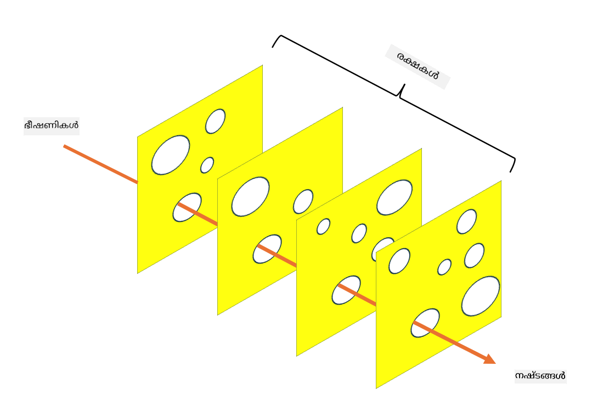

<!--
CO_OP_TRANSLATOR_METADATA:
{
  "original_hash": "75f77f972d2233c584f87c1eb96c983b",
  "translation_date": "2025-12-19T13:08:15+00:00",
  "source_file": "1.5 Zero trust.md",
  "language_code": "ml"
}
-->
# സീറോ ട്രസ്റ്റ്

ഇന്നത്തെ സുരക്ഷാ മേഖലകളിൽ "സീറോ ട്രസ്റ്റ്" എന്ന വാക്ക് വളരെ പ്രചാരത്തിലുണ്ട്. എന്നാൽ ഇതിന്റെ അർത്ഥം എന്താണ്? ഇത് ഒരു മോദി വാക്ക് മാത്രമാണോ? ഈ പാഠത്തിൽ, സീറോ ട്രസ്റ്റ് എന്താണെന്ന് വിശദമായി പരിശോധിക്കാം.

## പരിചയം

 - ഈ പാഠത്തിൽ, നാം ചർച്ച ചെയ്യുന്നത്:
   
   
 - സീറോ ട്രസ്റ്റ് എന്താണ്?

   
  

 - സീറോ ട്രസ്റ്റ് പരമ്പരാഗത സുരക്ഷാ ആർക്കിടെക്ചറുകളിൽ നിന്ന് എങ്ങനെ വ്യത്യസ്തമാണ്?

   
   

 - ഡിഫൻസ് ഇൻ ഡെപ്ത് എന്താണ്?

## സീറോ ട്രസ്റ്റ്

സീറോ ട്രസ്റ്റ് ഒരു സൈബർസെക്യൂരിറ്റി സമീപനമാണ്, "വിശ്വസിക്കുക, എന്നാൽ പരിശോധിക്കുക" എന്ന പരമ്പരാഗത ആശയം ചോദ്യം ചെയ്യുന്നതും ഒരു സ്ഥാപനത്തിന്റെ നെറ്റ്വർക്കിനുള്ളിൽ അല്ലെങ്കിൽ പുറത്തുള്ള ഏതൊരു ഘടകത്തെയും സ്വാഭാവികമായി വിശ്വസിക്കരുത് എന്ന് കരുതുന്നതുമാണ്. പകരം, സീറോ ട്രസ്റ്റ് ഓരോ ഉപയോക്താവിനെയും, ഉപകരണത്തെയും, ആപ്ലിക്കേഷനെയും അവയുടെ സ്ഥാനം എന്തായാലും പരിശോധിക്കുകയും സ്ഥിരീകരിക്കുകയും ചെയ്യണമെന്ന് പ്രോത്സാഹിപ്പിക്കുന്നു. സീറോ ട്രസ്റ്റിന്റെ മുഖ്യ തത്വം "ആക്രമണ ഉപരിതലം" കുറയ്ക്കുകയും സുരക്ഷാ ലംഘനങ്ങളുടെ സാധ്യതയുള്ള ആഘാതം കുറയ്ക്കുകയും ചെയ്യുന്നതാണ്.

സീറോ ട്രസ്റ്റ് മോഡലിൽ, താഴെ പറയുന്ന തത്വങ്ങൾ പ്രാധാന്യമർഹിക്കുന്നു:

1. **ഐഡന്റിറ്റി സ്ഥിരീകരിക്കുക**: ഉപയോക്താക്കളുടെയും ഉപകരണങ്ങളുടെയും പ്രാമാണികതയും അനുമതിയും അവയുടെ സ്ഥാനം എന്തായാലും കർശനമായി പ്രയോഗിക്കുന്നു. ഓർക്കുക, ഐഡന്റിറ്റി മനുഷ്യൻ മാത്രമല്ല: അത് ഒരു ഉപകരണം, ഒരു ആപ്ലിക്കേഷൻ മുതലായവയാകാം.

2. **ലീസ്റ്റ് പ്രിവിലേജ്**: ഉപയോക്താക്കൾക്കും ഉപകരണങ്ങൾക്കും അവരുടെ ജോലികൾ നിർവഹിക്കാൻ ആവശ്യമായ ഏറ്റവും കുറഞ്ഞ ആക്സസ് മാത്രമേ അനുവദിക്കൂ, ഇത് ലംഘിക്കപ്പെട്ടാൽ ഉണ്ടാകുന്ന നാശം കുറയ്ക്കുന്നു.

3. **മൈക്രോ-സെഗ്മെന്റേഷൻ**: നെറ്റ്വർക്ക് വിഭവങ്ങൾ ചെറിയ വിഭാഗങ്ങളായി വിഭജിച്ച് ലംഘനമുണ്ടായാൽ നെറ്റ്വർക്കിനുള്ളിൽ നീങ്ങൽ പരിമിതപ്പെടുത്തുന്നു.

4. **തുടർച്ചയായ നിരീക്ഷണം**: ഉപയോക്താവിന്റെയും ഉപകരണത്തിന്റെയും പെരുമാറ്റത്തിന്റെ തുടർച്ചയായ നിരീക്ഷണവും വിശകലനവും നടത്തുന്നു, അനിഷ്ടതകളും ഭീഷണികളും കണ്ടെത്താൻ. ആധുനിക നിരീക്ഷണ സാങ്കേതികവിദ്യകൾ മെഷീൻ ലേണിംഗ്, AI, ഭീഷണി ബോധം എന്നിവ ഉപയോഗിച്ച് കൂടുതൽ വിശദാംശങ്ങളും പശ്ചാത്തലവും നൽകുന്നു.

5. **ഡാറ്റ എൻക്രിപ്ഷൻ**: ഡാറ്റ ട്രാൻസിറ്റിലും സ്റ്റോറേജിലും എൻക്രിപ്റ്റ് ചെയ്യുന്നു, അനധികൃത ആക്സസ് തടയാൻ.

6. **കർശനമായ ആക്സസ് നിയന്ത്രണം**: ഉപയോക്തൃ റോളുകൾ, ഉപകരണത്തിന്റെ ആരോഗ്യനില, നെറ്റ്വർക്ക് സ്ഥാനം എന്നിവ പോലുള്ള സാഹചര്യങ്ങളുടെ അടിസ്ഥാനത്തിൽ ആക്സസ് നിയന്ത്രണങ്ങൾ പ്രയോഗിക്കുന്നു.

മൈക്രോസോഫ്റ്റ് സീറോ ട്രസ്റ്റിനെ അഞ്ച് പിലറുകളായി വിഭജിക്കുന്നു, ഇത് നാം ഒരു പിന്നീട് പാഠത്തിൽ ചർച്ച ചെയ്യും.

## പരമ്പരാഗത സുരക്ഷാ ആർക്കിടെക്ചറുകളിൽ നിന്ന് വ്യത്യാസങ്ങൾ

സീറോ ട്രസ്റ്റ് പരമ്പരാഗത സുരക്ഷാ ആർക്കിടെക്ചറുകളിൽ നിന്ന്, ഉദാഹരണത്തിന് പെരിമീറ്റർ-അടിസ്ഥാനത്തിലുള്ള മോഡലുകളിൽ നിന്ന്, പല രീതികളിൽ വ്യത്യസ്തമാണ്:

1. **പെരിമീറ്റർ vs. ഐഡന്റിറ്റി-കേന്ദ്രിതം**: പരമ്പരാഗത മോഡലുകൾ നെറ്റ്വർക്കിന്റെ പെരിമീറ്റർ സുരക്ഷിതമാക്കുന്നതിലും, അകത്തുള്ള ഉപയോക്താക്കളെയും ഉപകരണങ്ങളെയും വിശ്വസിക്കുന്നതിലും ശ്രദ്ധ കേന്ദ്രീകരിക്കുന്നു. സീറോ ട്രസ്റ്റ്, മറുവശത്ത്, ഭീഷണികൾ നെറ്റ്വർക്കിന്റെ അകത്തും പുറത്തും നിന്നുണ്ടാകാമെന്ന് കരുതുകയും കർശനമായ ഐഡന്റിറ്റി-അടിസ്ഥാനത്തിലുള്ള നിയന്ത്രണങ്ങൾ പ്രയോഗിക്കുകയും ചെയ്യുന്നു.

2. **ഇംപ്ലിസിറ്റ് vs. എക്സ്പ്ലിസിറ്റ് ട്രസ്റ്റ്**: പരമ്പരാഗത മോഡലുകൾ നെറ്റ്വർക്കിനുള്ളിലെ ഉപകരണങ്ങളെയും ഉപയോക്താക്കളെയും തെളിയിക്കുന്നതുവരെ സ്വാഭാവികമായി വിശ്വസിക്കുന്നു. സീറോ ട്രസ്റ്റ് വ്യക്തമായ ഐഡന്റിറ്റികൾ പരിശോധിക്കുകയും തുടർച്ചയായി അനിഷ്ടതകൾക്കായി നിരീക്ഷിക്കുകയും ചെയ്യുന്നു.

3. **ഫ്ലാറ്റ് vs. സെഗ്മെന്റഡ് നെറ്റ്വർക്ക്**: പരമ്പരാഗത ആർക്കിടെക്ചറുകൾ പലപ്പോഴും ഫ്ലാറ്റ് നെറ്റ്വർക്കുകൾ ഉൾക്കൊള്ളുന്നു, അകത്തുള്ള ഉപയോക്താക്കൾക്ക് വ്യാപകമായ ആക്സസ് നൽകുന്നു. സീറോ ട്രസ്റ്റ് നെറ്റ്വർക്കിനെ ചെറിയ, ഒറ്റപ്പെട്ട മേഖലകളായി വിഭജിക്കാൻ പ്രോത്സാഹിപ്പിക്കുന്നു, സാധ്യതയുള്ള ലംഘനങ്ങൾ അടക്കാൻ.

4. **റിയാക്ടീവ് vs. പ്രോആക്ടീവ്**: പരമ്പരാഗത സുരക്ഷ പലപ്പോഴും പെരിമീറ്റർ ഫയർവാളുകളും ഇൻട്രൂഷൻ ഡിറ്റക്ഷൻ സിസ്റ്റങ്ങളും പോലുള്ള പ്രതികരണ നടപടികളിൽ ആശ്രയിക്കുന്നു. സീറോ ട്രസ്റ്റ് ലംഘനങ്ങൾ സാധ്യതയുള്ളതാണെന്ന് കരുതുകയും അവയുടെ ആഘാതം കുറയ്ക്കാൻ മുൻകരുതലുകൾ സ്വീകരിക്കുകയും ചെയ്യുന്നു.

## ഡിഫൻസ് ഇൻ ഡെപ്ത്

ഡിഫൻസ് ഇൻ ഡെപ്ത്, അല്ലെങ്കിൽ ലെയേർഡ് സെക്യൂരിറ്റി, ഒരു സൈബർസെക്യൂരിറ്റി തന്ത്രമാണ്, ഒരു സ്ഥാപനത്തിന്റെ ആസ്തികളെ സംരക്ഷിക്കാൻ നിരവധി ലെയറുകളുള്ള സുരക്ഷാ നിയന്ത്രണങ്ങളും നടപടികളും വിന്യസിക്കുന്നതിൽ ഉൾപ്പെടുന്നു. ലക്ഷ്യം ഒരു ലെയർ ലംഘിക്കപ്പെട്ടാലും, മറ്റ് ലെയറുകൾ സംരക്ഷണം നൽകാൻ കഴിയുന്ന വിധത്തിൽ ഓവർലാപ്പിംഗ് ലെയറുകൾ സൃഷ്ടിക്കുകയാണ്. ഓരോ ലെയറും സുരക്ഷയുടെ വ്യത്യസ്ത വശങ്ങളിൽ ശ്രദ്ധ കേന്ദ്രീകരിക്കുകയും ഒരു സ്ഥാപനത്തിന്റെ ആകെ സുരക്ഷാ നില മെച്ചപ്പെടുത്തുകയും ചെയ്യുന്നു.

ഡിഫൻസ് ഇൻ ഡെപ്ത് സാങ്കേതിക, പ്രക്രിയാത്മക, ഭൗതിക സുരക്ഷാ നടപടികളുടെ സംയോജനം ഉൾക്കൊള്ളുന്നു. ഇതിൽ ഫയർവാളുകൾ, ഇൻട്രൂഷൻ ഡിറ്റക്ഷൻ സിസ്റ്റങ്ങൾ, ആക്സസ് നിയന്ത്രണങ്ങൾ, എൻക്രിപ്ഷൻ, ഉപയോക്തൃ പരിശീലനം, സുരക്ഷാ നയങ്ങൾ എന്നിവ ഉൾപ്പെടാം. ലക്ഷ്യം നിരവധി തടസ്സങ്ങൾ സൃഷ്ടിക്കുകയാണ്, ഇത് സംയുക്തമായി ആക്രമണകാരികൾക്ക് ഒരു സ്ഥാപനത്തിന്റെ സിസ്റ്റങ്ങളും നെറ്റ്വർക്കുകളും തകർക്കാൻ ബുദ്ധിമുട്ടാക്കുന്നു. ഇത് മറ്റ് വ്യവസായങ്ങളിൽ (ഉദാ: ഗതാഗതം) അപകടം തടയുന്നതിനുള്ള "സ്വിസ് ചീസ്" മോഡലായും അറിയപ്പെടുന്നു.

## കൂടുതൽ വായന

[സീറോ ട്രസ്റ്റ് എന്താണ്?](https://learn.microsoft.com/security/zero-trust/zero-trust-overview?WT.mc_id=academic-96948-sayoung)

[സീറോ ട്രസ്റ്റ് വികസനം – മൈക്രോസോഫ്റ്റ് നിലപാട് പേപ്പർ](https://query.prod.cms.rt.microsoft.com/cms/api/am/binary/RWJJdT?WT.mc_id=academic-96948-sayoung)

[സീറോ ട്രസ്റ്റ് ആൻഡ് ബിയോണ്ട്കോർപ് ഗൂഗിൾ ക്ലൗഡ് | ഗൂഗിൾ ക്ലൗഡ് ബ്ലോഗ്](https://cloud.google.com/blog/topics/developers-practitioners/zero-trust-and-beyondcorp-google-cloud)

---

<!-- CO-OP TRANSLATOR DISCLAIMER START -->
**അറിയിപ്പ്**:  
ഈ പ്രമാണം AI വിവർത്തന സേവനം [Co-op Translator](https://github.com/Azure/co-op-translator) ഉപയോഗിച്ച് വിവർത്തനം ചെയ്തതാണ്. ഞങ്ങൾ കൃത്യതയ്ക്കായി ശ്രമിക്കുന്നുവെങ്കിലും, ഓട്ടോമേറ്റഡ് വിവർത്തനങ്ങളിൽ പിഴവുകൾ അല്ലെങ്കിൽ തെറ്റായ വിവരങ്ങൾ ഉണ്ടാകാൻ സാധ്യതയുണ്ട്. പ്രമാണത്തിന്റെ മാതൃഭാഷയിലുള്ള യഥാർത്ഥ പതിപ്പ് പ്രാമാണികമായ ഉറവിടമായി പരിഗണിക്കണം. നിർണായകമായ വിവരങ്ങൾക്ക്, പ്രൊഫഷണൽ മനുഷ്യ വിവർത്തനം ശുപാർശ ചെയ്യുന്നു. ഈ വിവർത്തനം ഉപയോഗിച്ച് ഉണ്ടാകുന്ന തെറ്റിദ്ധാരണകൾക്കോ തെറ്റായ വ്യാഖ്യാനങ്ങൾക്കോ ഞങ്ങൾ ഉത്തരവാദികളല്ല.
<!-- CO-OP TRANSLATOR DISCLAIMER END -->