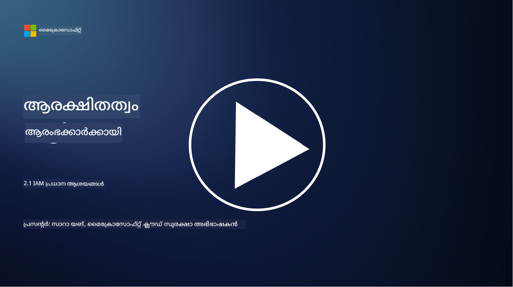

<!--
CO_OP_TRANSLATOR_METADATA:
{
  "original_hash": "2e3864e3d579f0dbb4ac2ec8c5f82acf",
  "translation_date": "2025-12-19T13:21:47+00:00",
  "source_file": "2.1 IAM key concepts.md",
  "language_code": "ml"
}
-->
# IAM പ്രധാന ആശയങ്ങൾ

നിങ്ങൾ ഒരിക്കലെങ്കിലും ഒരു കമ്പ്യൂട്ടറിലോ വെബ്സൈറ്റിലോ ലോഗിൻ ചെയ്തിട്ടുണ്ടോ? തീർച്ചയായും ചെയ്തിട്ടുണ്ടാകും! അതായത്, നിങ്ങൾ നിങ്ങളുടെ ദിവസേനയുള്ള ജീവിതത്തിൽ തന്നെ ഐഡന്റിറ്റി നിയന്ത്രണങ്ങൾ ഉപയോഗിച്ചിട്ടുണ്ട്. ഐഡന്റിറ്റി ആൻഡ് ആക്സസ് മാനേജ്മെന്റ് (IAM) സുരക്ഷയുടെ ഒരു പ്രധാന പാരമ്പര്യമാണ്, ഇതിനെക്കുറിച്ച് അടുത്ത പാഠങ്ങളിൽ കൂടുതൽ പഠിക്കാം.

**പരിചയം**

ഈ പാഠത്തിൽ, നാം ചർച്ച ചെയ്യുന്നത്:

- സൈബർസുരക്ഷയുടെ പശ്ചാത്തലത്തിൽ ഐഡന്റിറ്റി ആൻഡ് ആക്സസ് മാനേജ്മെന്റ് (IAM) എന്നത് എന്താണ്?  
- കുറഞ്ഞ അവകാശങ്ങളുടെ സിദ്ധാന്തം എന്താണ്?  
- ഉത്തരവാദിത്തങ്ങളുടെ വിഭജനം എന്താണ്?  
- ഓതന്റിക്കേഷൻ, ഓതറൈസേഷൻ എന്നിവ എന്താണ്?  

## സൈബർസുരക്ഷയുടെ പശ്ചാത്തലത്തിൽ ഐഡന്റിറ്റി ആൻഡ് ആക്സസ് മാനേജ്മെന്റ് (IAM) എന്നത് എന്താണ്?

ഐഡന്റിറ്റി ആൻഡ് ആക്സസ് മാനേജ്മെന്റ് (IAM) എന്നത് ഒരു സ്ഥാപനത്തിന്റെ ഡിജിറ്റൽ പരിസ്ഥിതിയിൽ ശരിയായ വ്യക്തികൾക്ക് അനുയോജ്യമായ റിസോഴ്സുകളിലേക്ക് ആക്സസ് ഉറപ്പാക്കാൻ നടപ്പിലാക്കുന്ന പ്രക്രിയകൾ, സാങ്കേതികവിദ്യകൾ, നയങ്ങൾ എന്നിവയുടെ ഒരു സമുച്ചയമാണ്. IAM ഡിജിറ്റൽ ഐഡന്റിറ്റികൾ (ഉപയോക്താക്കൾ, ജീവനക്കാർ, പങ്കാളികൾ) എന്നിവയും അവയുടെ സിസ്റ്റങ്ങൾ, ആപ്ലിക്കേഷനുകൾ, ഡാറ്റ, നെറ്റ്വർക്കുകൾ എന്നിവയിലേക്കുള്ള ആക്സസും മാനേജുചെയ്യുന്നു. IAM-ന്റെ പ്രധാന ലക്ഷ്യം സുരക്ഷ വർദ്ധിപ്പിക്കുക, ഉപയോക്തൃ ആക്സസ് ലളിതമാക്കുക, സ്ഥാപന നയങ്ങൾക്കും ചട്ടങ്ങൾക്കും അനുസൃതമായി പ്രവർത്തിക്കുക എന്നിവയാണ്. IAM പരിഹാരങ്ങൾ സാധാരണയായി ഉപയോക്തൃ ഓതന്റിക്കേഷൻ, ഓതറൈസേഷൻ, ഐഡന്റിറ്റി പ്രൊവിഷനിംഗ്, ആക്സസ് നിയന്ത്രണം, ഉപയോക്തൃ ജീവിതചക്ര മാനേജ്മെന്റ് (ഉപയോഗത്തിൽ ഇല്ലാത്ത അക്കൗണ്ടുകൾ നീക്കംചെയ്യൽ) എന്നിവ ഉൾക്കൊള്ളുന്നു.

## കുറഞ്ഞ അവകാശങ്ങളുടെ സിദ്ധാന്തം എന്താണ്?

കുറഞ്ഞ അവകാശങ്ങളുടെ സിദ്ധാന്തം ഒരു അടിസ്ഥാന ആശയമാണ്, ഇത് ഉപയോക്താക്കൾക്കും സിസ്റ്റങ്ങൾക്കും അവരുടെ നിർദ്ദിഷ്ട ജോലികൾ അല്ലെങ്കിൽ പദവികൾ നിർവഹിക്കാൻ ആവശ്യമായ കുറഞ്ഞ അവകാശങ്ങൾ മാത്രം നൽകണമെന്ന് പ്രോത്സാഹിപ്പിക്കുന്നു. ഈ സിദ്ധാന്തം സുരക്ഷാ ലംഘനമോ ഇൻസൈഡർ ഭീഷണിയോ സംഭവിച്ചാൽ ഉണ്ടാകാവുന്ന സാധ്യതയുള്ള നാശം പരിമിതപ്പെടുത്താൻ സഹായിക്കുന്നു. കുറഞ്ഞ അവകാശങ്ങളുടെ സിദ്ധാന്തം പാലിക്കുന്നതിലൂടെ, സ്ഥാപനങ്ങൾ ആക്രമണ സാധ്യത കുറയ്ക്കുകയും അനധികൃത ആക്സസ്, ഡാറ്റാ ലംഘനങ്ങൾ, അവകാശങ്ങളുടെ തെറ്റായ ഉപയോഗം എന്നിവയുടെ അപകടം കുറയ്ക്കുകയും ചെയ്യുന്നു. പ്രായോഗികമായി, ഇത് ഉപയോക്താക്കൾക്ക് അവരുടെ ജോലിയുടെ ആവശ്യങ്ങൾക്കനുസരിച്ച് പ്രത്യേക റിസോഴ്സുകളിലേക്കും പ്രവർത്തനങ്ങളിലേക്കും മാത്രമേ ആക്സസ് അനുവദിക്കൂ. ഉദാഹരണത്തിന്, നിങ്ങൾക്ക് ഒരു ഡോക്യുമെന്റ് വായിക്കേണ്ടതാണെങ്കിൽ, ആ ഡോക്യുമെന്റിന് പൂർണ്ണ അഡ്മിൻ അവകാശങ്ങൾ നൽകുന്നത് അനാവശ്യമായിരിക്കും.

## ഉത്തരവാദിത്തങ്ങളുടെ വിഭജനം എന്താണ്?

ഉത്തരവാദിത്തങ്ങളുടെ വിഭജനം എന്നത് താൽപര്യങ്ങളുടെ സംഘർഷം തടയാനും തട്ടിപ്പിന്റെയും പിഴവുകളുടെയും അപകടം കുറയ്ക്കാനും ലക്ഷ്യമിട്ടുള്ള ഒരു സിദ്ധാന്തമാണ്. ഇത് ഒരു സ്ഥാപനത്തിനുള്ളിൽ നിർണായക ജോലികളും ഉത്തരവാദിത്തങ്ങളും വ്യത്യസ്ത വ്യക്തികളിൽ വിതരണം ചെയ്യുന്നതിലൂടെ നടപ്പിലാക്കുന്നു. സൈബർസുരക്ഷയുടെ പശ്ചാത്തലത്തിൽ, ഉത്തരവാദിത്തങ്ങളുടെ വിഭജനം ഒരു നിർണായക പ്രക്രിയയോ സിസ്റ്റമോ സംബന്ധിച്ച എല്ലാ ഘടകങ്ങളുടെയും നിയന്ത്രണം ഒരൊറ്റ വ്യക്തിക്ക് നൽകാതിരിക്കാൻ ഉറപ്പാക്കുന്നു. ലക്ഷ്യം ഒരു ചെക്ക് ആൻഡ് ബാലൻസ് സംവിധാനം സൃഷ്ടിക്കുകയാണ്, ഇത് ഒരു പ്രക്രിയയുടെ സജ്ജീകരണവും അംഗീകാരവും ഒരേ വ്യക്തിക്ക് നിർവഹിക്കാൻ കഴിയാതിരിക്കാൻ സഹായിക്കുന്നു. ഉദാഹരണത്തിന്, ധനകാര്യ സിസ്റ്റങ്ങളിൽ, ഇടപാടുകൾ സിസ്റ്റത്തിൽ നൽകുന്ന വ്യക്തി ആ ഇടപാടുകൾ അംഗീകരിക്കുന്ന വ്യക്തിയാകരുത്. ഇത് അനധികൃതമായോ തട്ടിപ്പായോ പ്രവർത്തനങ്ങൾ കണ്ടെത്താതെ പോകാനുള്ള അപകടം കുറയ്ക്കുന്നു.

## ഓതന്റിക്കേഷൻ, ഓതറൈസേഷൻ എന്നിവ എന്താണ്?

ഓതന്റിക്കേഷൻ, ഓതറൈസേഷൻ എന്നിവ സൈബർസുരക്ഷയിലെ രണ്ട് അടിസ്ഥാന ആശയങ്ങളാണ്, ഇവ കമ്പ്യൂട്ടർ സിസ്റ്റങ്ങളുടെയും ഡാറ്റയുടെയും സുരക്ഷയും അഖണ്ഡതയും ഉറപ്പാക്കുന്നതിൽ നിർണായകമായ പങ്ക് വഹിക്കുന്നു. റിസോഴ്സുകളിലേക്കുള്ള ആക്സസും സംവേദനാത്മക വിവരങ്ങളുടെ സംരക്ഷണവും നിയന്ത്രിക്കാൻ ഇവയെ ഒരുമിച്ച് ഉപയോഗിക്കുന്നു.

**1. ഓതന്റിക്കേഷൻ**:  
ഓതന്റിക്കേഷൻ എന്നത് ഒരു കമ്പ്യൂട്ടർ സിസ്റ്റത്തിലേക്കോ പ്രത്യേക റിസോഴ്സിലേക്കോ ആക്സസ് നേടാൻ ശ്രമിക്കുന്ന ഉപയോക്താവിന്റെ, സിസ്റ്റത്തിന്റെ, അല്ലെങ്കിൽ സബ്ജക്ടിന്റെ ഐഡന്റിറ്റി സ്ഥിരീകരിക്കുന്ന പ്രക്രിയയാണ്. അവകാശപ്പെട്ട ഐഡന്റിറ്റി യഥാർത്ഥവും കൃത്യവുമാണെന്ന് ഉറപ്പാക്കുന്നു. ഓതന്റിക്കേഷൻ രീതികൾ സാധാരണയായി താഴെ പറയുന്ന ഘടകങ്ങളിൽ ഒന്നോ അതിലധികമോ ഉൾക്കൊള്ളുന്നു:  
   
   a. നിങ്ങൾ അറിയുന്ന എന്തെങ്കിലും: പാസ്‌വേഡുകൾ, പിൻ നമ്പറുകൾ, അല്ലെങ്കിൽ അധികാരമുള്ള ഉപയോക്താവിന് മാത്രമേ അറിയാവൂ എന്ന രഹസ്യ അറിവുകൾ.  
   
   b. നിങ്ങൾക്കുള്ള എന്തെങ്കിലും: സ്മാർട്ട് കാർഡുകൾ, സുരക്ഷാ ടോക്കണുകൾ, മൊബൈൽ ഫോണുകൾ പോലുള്ള ഭൗതിക ടോക്കണുകൾ അല്ലെങ്കിൽ ഉപകരണങ്ങൾ.  
   
   c. നിങ്ങൾ ആരാണെന്ന് തെളിയിക്കുന്ന എന്തെങ്കിലും: വിരലടയാളങ്ങൾ, മുഖം തിരിച്ചറിയൽ, അല്ലെങ്കിൽ വ്യക്തിക്ക് മാത്രമുള്ള ബയോമെട്രിക് ഘടകങ്ങൾ.  

ഓതന്റിക്കേഷൻ ഉപയോക്താവ് അവകാശപ്പെടുന്ന വ്യക്തിയാണെന്ന് സ്ഥിരീകരിക്കാൻ ഉപയോഗിക്കുന്നു, അതിനുശേഷം സിസ്റ്റത്തിലേക്കോ റിസോഴ്സിലേക്കോ ആക്സസ് അനുവദിക്കുന്നു. ഇത് അനധികൃത ആക്സസ് തടയുകയും സിസ്റ്റത്തിൽ നിയമാനുസൃതമായ ഉപയോക്താക്കൾക്ക് മാത്രമേ പ്രവർത്തനങ്ങൾ നടത്താൻ കഴിയൂ എന്നതും ഉറപ്പാക്കുന്നു.

**2. ഓതറൈസേഷൻ**:  
ഓതറൈസേഷൻ എന്നത്, ഒരു ഉപയോക്താവിന്റെ ഐഡന്റിറ്റി സ്ഥിരീകരിച്ചതിന് ശേഷം, ആ ഉപയോക്താവിന് പ്രത്യേക അനുമതികളും അവകാശങ്ങളും അനുവദിക്കുകയോ നിരസിക്കുകയോ ചെയ്യുന്ന പ്രക്രിയയാണ്. ഒരു സിസ്റ്റത്തിനുള്ളിൽ അല്ലെങ്കിൽ പ്രത്യേക റിസോഴ്സുകളിൽ ഉപയോക്താവിന് എന്ത് പ്രവർത്തനങ്ങൾ നടത്താൻ കഴിയുമെന്ന് ഇത് നിർണ്ണയിക്കുന്നു. ഓതറൈസേഷൻ സാധാരണയായി മുൻകൂട്ടി നിർവചിച്ച നയങ്ങൾ, ആക്സസ് നിയന്ത്രണ ചട്ടങ്ങൾ, ഉപയോക്താക്കൾക്ക് നൽകിയ പദവികൾ എന്നിവയെ അടിസ്ഥാനമാക്കിയാണ്.

ഓതറൈസേഷൻ എന്നത് "ഓതന്റിക്കേറ്റ് ചെയ്ത ഉപയോക്താവിന് എന്ത് ചെയ്യാൻ കഴിയും?" എന്ന ചോദ്യത്തിന് ഉത്തരം നൽകുന്നതായി കരുതാം. ഇത് അനധികൃത ആക്സസ് അല്ലെങ്കിൽ മാറ്റം തടയാൻ സംവേദനാത്മക ഡാറ്റയും റിസോഴ്സുകളും സംരക്ഷിക്കുന്നതിന് ആക്സസ് നിയന്ത്രണ നയങ്ങൾ നിർവചിക്കുകയും നടപ്പിലാക്കുകയും ചെയ്യുന്നു.

**സംക്ഷേപത്തിൽ:**

- ഓതന്റിക്കേഷൻ ഉപയോക്താക്കളുടെ അല്ലെങ്കിൽ സബ്ജക്ടുകളുടെ ഐഡന്റിറ്റി സ്ഥാപിക്കുന്നു.  
- ഓതറൈസേഷൻ, ഓതന്റിക്കേറ്റ് ചെയ്ത ഉപയോക്താക്കൾക്ക് എന്ത് പ്രവർത്തനങ്ങളും റിസോഴ്സുകളും ആക്സസ് ചെയ്യാനോ കൈകാര്യം ചെയ്യാനോ കഴിയുമെന്ന് നിർണ്ണയിക്കുന്നു.  

## കൂടുതൽ വായന

- [ഐഡന്റിറ്റി ആശയങ്ങൾ വിശദീകരിക്കുക - പരിശീലനം | Microsoft Learn](https://learn.microsoft.com/training/modules/describe-identity-principles-concepts/?WT.mc_id=academic-96948-sayoung)  
- [ഐഡന്റിറ്റിയിലേക്ക് പരിചയം - Microsoft Entra | Microsoft Learn](https://learn.microsoft.com/azure/active-directory/fundamentals/identity-fundamental-concepts?WT.mc_id=academic-96948-sayoung)  
- [ഐഡന്റിറ്റി ആക്സസ് മാനേജ്മെന്റ് (IAM) എന്താണ്? | Microsoft Security](https://www.microsoft.com/security/business/security-101/what-is-identity-access-management-iam?WT.mc_id=academic-96948-sayoung)  
- [IAM എന്താണ്? ഐഡന്റിറ്റി ആൻഡ് ആക്സസ് മാനേജ്മെന്റ് വിശദീകരണം | CSO Online](https://www.csoonline.com/article/518296/what-is-iam-identity-and-access-management-explained.html)  
- [IAM എന്താണ്? (auth0.com)](https://auth0.com/blog/what-is-iam/)  
- [സുരക്ഷ+: ഐഡന്റിറ്റി ആൻഡ് ആക്സസ് മാനേജ്മെന്റ് (IAM) നിയന്ത്രണങ്ങൾ നടപ്പിലാക്കൽ [അപ്ഡേറ്റുചെയ്ത 2021] | Infosec (infosecinstitute.com)](https://resources.infosecinstitute.com/certifications/securityplus/security-implementing-identity-and-access-management-iam-controls/)  
- [കുറഞ്ഞ അവകാശങ്ങൾ - ഗ്ലോസറി | CSRC (nist.gov)](https://csrc.nist.gov/glossary/term/least_privilege)  
- [സുരക്ഷ: കുറഞ്ഞ അവകാശങ്ങളുടെ സിദ്ധാന്തം (POLP) - Microsoft Community Hub](https://techcommunity.microsoft.com/t5/azure-sql-blog/security-the-principle-of-least-privilege-polp/ba-p/2067390?WT.mc_id=academic-96948-sayoung)  
- [കുറഞ്ഞ അവകാശങ്ങളുടെ സിദ്ധാന്തം | CERT NZ](https://www.cert.govt.nz/it-specialists/critical-controls/principle-of-least-privilege/)  
- [NIST 800-171, CMMC എന്നിവയിൽ ഉത്തരവാദിത്തങ്ങളുടെ വിഭജനം ആവശ്യമായതെന്തുകൊണ്ട്? - (totem.tech)](https://www.totem.tech/cmmc-separation-of-duties/)  

---

<!-- CO-OP TRANSLATOR DISCLAIMER START -->
**അസത്യവാദം**:  
ഈ രേഖ AI വിവർത്തന സേവനമായ [Co-op Translator](https://github.com/Azure/co-op-translator) ഉപയോഗിച്ച് വിവർത്തനം ചെയ്തതാണ്. ഞങ്ങൾ കൃത്യതയ്ക്കായി ശ്രമിക്കുന്നുവെങ്കിലും, ഓട്ടോമേറ്റഡ് വിവർത്തനങ്ങളിൽ പിശകുകൾ അല്ലെങ്കിൽ തെറ്റായ വിവരങ്ങൾ ഉണ്ടാകാമെന്ന് ദയവായി ശ്രദ്ധിക്കുക. അതിന്റെ സ്വാഭാവിക ഭാഷയിലുള്ള മൗലിക രേഖ പ്രാമാണികമായ ഉറവിടമായി കണക്കാക്കണം. നിർണായകമായ വിവരങ്ങൾക്ക്, പ്രൊഫഷണൽ മനുഷ്യ വിവർത്തനം ശുപാർശ ചെയ്യുന്നു. ഈ വിവർത്തനം ഉപയോഗിക്കുന്നതിൽ നിന്നുണ്ടാകുന്ന തെറ്റിദ്ധാരണകൾക്കോ തെറ്റായ വ്യാഖ്യാനങ്ങൾക്കോ ഞങ്ങൾ ഉത്തരവാദികളല്ല.
<!-- CO-OP TRANSLATOR DISCLAIMER END -->