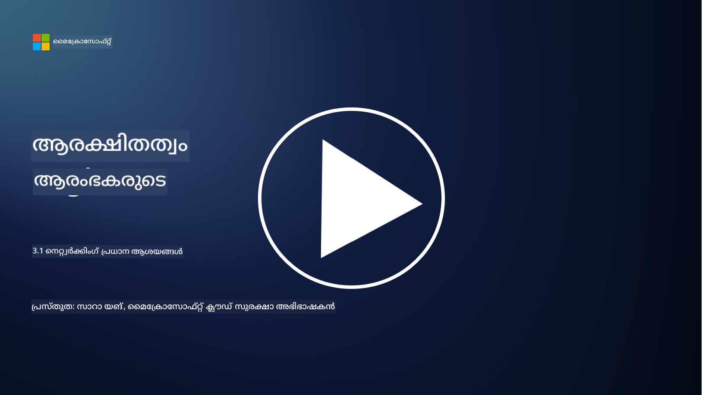
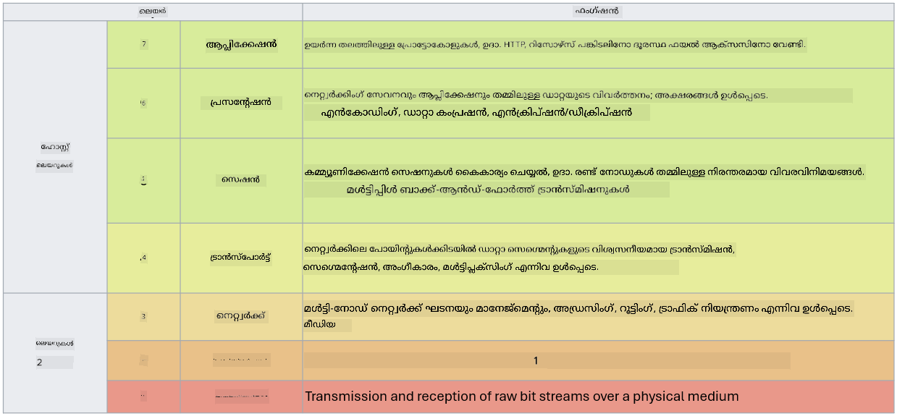

<!--
CO_OP_TRANSLATOR_METADATA:
{
  "original_hash": "252724eceeb183fb9018f88c5e1a3f0c",
  "translation_date": "2025-12-19T12:48:11+00:00",
  "source_file": "3.1 Networking key concepts.md",
  "language_code": "ml"
}
-->
# നെറ്റ്വർക്കിംഗ് പ്രധാന ആശയങ്ങൾ

നിങ്ങൾ ഐ.ടി.യിൽ ഏതെങ്കിലും പ്രവർത്തനം ചെയ്തിട്ടുണ്ടെങ്കിൽ, നെറ്റ്വർക്കിംഗ് ആശയങ്ങളെക്കുറിച്ച് നിങ്ങൾക്ക് പരിചയമുണ്ടാകാൻ സാധ്യതയുണ്ട്. ആധുനിക പരിതസ്ഥിതികളിൽ ഞങ്ങൾ പ്രാഥമിക പരിമിത നിയന്ത്രണമായി ഐഡന്റിറ്റിയെ ഉപയോഗിക്കുന്നുവെങ്കിലും, ഇത് നെറ്റ്വർക്ക് നിയന്ത്രണങ്ങൾ അനാവശ്യമാണെന്ന് അർത്ഥമാക്കുന്നില്ല. ഇത് ഒരു വലിയ വിഷയം ആയതിനാൽ, ഈ പാഠത്തിൽ ചില പ്രധാന നെറ്റ്വർക്കിംഗ് ആശയങ്ങളെക്കുറിച്ച് ചർച്ച ചെയ്യാം.

ഈ പാഠത്തിൽ, ഞങ്ങൾ ചർച്ച ചെയ്യുന്നത്:

 - IP അഡ്രസിംഗ് എന്താണ്?
   
 - OSI മോഡൽ എന്താണ്?

 - TCP/UDP എന്താണ്?

 - പോർട്ട് നമ്പറുകൾ എന്താണ്?

 - വിശ്രമത്തിലും ഗതാഗതത്തിലും എൻക്രിപ്ഷൻ എന്താണ്?

## IP അഡ്രസിംഗ് എന്താണ്?

IP അഡ്രസിംഗ്, അല്ലെങ്കിൽ ഇന്റർനെറ്റ് പ്രോട്ടോക്കോൾ അഡ്രസിംഗ്, ഇന്റർനെറ്റ് പ്രോട്ടോക്കോൾ ഉപയോഗിച്ച് ആശയവിനിമയം നടത്തുന്ന കമ്പ്യൂട്ടർ നെറ്റ്വർക്കുമായി ബന്ധിപ്പിച്ചിരിക്കുന്ന ഓരോ ഉപകരണത്തിനും നൽകുന്ന സംഖ്യാ ലേബലാണ്. ഇത് ഒരു നെറ്റ്വർക്കിനുള്ളിൽ ഉപകരണങ്ങൾക്ക് ഒരു പ്രത്യേക തിരിച്ചറിയൽ നൽകുന്നു, അവയ്ക്ക് ഇന്റർനെറ്റിലോ മറ്റ് ബന്ധിപ്പിച്ച നെറ്റ്വർക്കുകളിലോ ഡാറ്റ അയയ്ക്കാനും സ്വീകരിക്കാനും അനുവദിക്കുന്നു. IP അഡ്രസിംഗിന്റെ രണ്ട് പ്രധാന പതിപ്പുകളുണ്ട്: IPv4 (ഇന്റർനെറ്റ് പ്രോട്ടോക്കോൾ പതിപ്പ് 4) IPv6 (ഇന്റർനെറ്റ് പ്രോട്ടോക്കോൾ പതിപ്പ് 6). ഒരു IP അഡ്രസ് സാധാരണയായി IPv4 ഫോർമാറ്റിൽ (ഉദാ: 192.168.1.1) അല്ലെങ്കിൽ IPv6 ഫോർമാറ്റിൽ (ഉദാ: 2001:0db8:85a3:0000:0000:8a2e:0370:7334) പ്രതിനിധീകരിക്കുന്നു.

## OSI മോഡൽ എന്താണ്?

OSI (ഓപ്പൺ സിസ്റ്റംസ് ഇന്റർകണക്ഷൻ) മോഡൽ ഒരു ആശയപരമായ ഘടനയാണ്, ഇത് ഒരു ആശയവിനിമയ സംവിധാനത്തിന്റെ പ്രവർത്തനങ്ങളെ ഏഴു വ്യത്യസ്ത ലെയറുകളായി സ്റ്റാൻഡേർഡൈസ് ചെയ്യുന്നു. ഓരോ ലെയറും പ്രത്യേക പ്രവർത്തനങ്ങൾ നിർവഹിക്കുകയും, നെറ്റ്വർക്കിലെ ഉപകരണങ്ങൾക്കിടയിൽ കാര്യക്ഷമവും വിശ്വസനീയവുമായ ഡാറ്റ ആശയവിനിമയം ഉറപ്പാക്കാൻ സമീപ ലെയറുകളുമായി ആശയവിനിമയം നടത്തുകയും ചെയ്യുന്നു. ലെയറുകൾ താഴെ നിന്ന് മുകളിലേക്ക് ക്രമീകരിച്ചിരിക്കുന്നു:

 1. ഫിസിക്കൽ ലെയർ
    
 2. ഡാറ്റ ലിങ്ക് ലെയർ

 3. നെറ്റ്വർക്ക് ലെയർ

 4. ട്രാൻസ്പോർട്ട് ലെയർ

 5. സെഷൻ ലെയർ

 6. പ്രെസന്റേഷൻ ലെയർ

 7. ആപ്ലിക്കേഷൻ ലെയർ

OSI മോഡൽ, പ്രത്യേക ഹാർഡ്‌വെയർ അല്ലെങ്കിൽ സോഫ്റ്റ്‌വെയർ നടപ്പാക്കലുകൾക്കു മുകളിലായി, നെറ്റ്വർക്കിംഗ് പ്രോട്ടോക്കോളുകളും സാങ്കേതികവിദ്യകളും എങ്ങനെ പരസ്പരം പ്രവർത്തിക്കുന്നു എന്ന് മനസിലാക്കാൻ ഒരു പൊതുവായ റഫറൻസ് നൽകുന്നു.

_ref: https://en.wikipedia.org/wiki/OSI_model_

## TCP/UDP എന്താണ്?

TCP (ട്രാൻസ്മിഷൻ കൺട്രോൾ പ്രോട്ടോക്കോൾ) UDP (യൂസർ ഡാറ്റാഗ്രാം പ്രോട്ടോക്കോൾ) എന്നിവ കമ്പ്യൂട്ടർ നെറ്റ്വർക്കുകളിൽ ഉപകരണങ്ങൾക്കിടയിൽ ആശയവിനിമയം സജ്ജമാക്കാൻ ഉപയോഗിക്കുന്ന രണ്ട് അടിസ്ഥാന ട്രാൻസ്പോർട്ട് ലെയർ പ്രോട്ടോക്കോളുകളാണ്. ഇവ ഡാറ്റ പാക്കറ്റുകളായി വിഭജിച്ച് അയയ്ക്കുകയും, സ്വീകരിക്കുന്നവയിൽ അവയെ വീണ്ടും ഒറ്റമാക്കുകയും ചെയ്യുന്നു. എന്നാൽ, ഇവയുടെ സ്വഭാവങ്ങളിലും ഉപയോഗ സാഹചര്യങ്ങളിലും വ്യത്യാസമുണ്ട്.

**TCP (ട്രാൻസ്മിഷൻ കൺട്രോൾ പ്രോട്ടോക്കോൾ)**:

TCP ഒരു കണക്ഷൻ-ഓറിയന്റഡ് പ്രോട്ടോക്കോളാണ്, ഇത് ഉപകരണങ്ങൾക്കിടയിൽ വിശ്വസനീയവും ക്രമബദ്ധവുമായ ഡാറ്റ ഡെലിവറി നൽകുന്നു. ഡാറ്റ കൈമാറ്റം ആരംഭിക്കുന്നതിന് മുമ്പ് TCP അയച്ചവനും സ്വീകരിക്കുന്നവനും ഇടയിൽ ഒരു കണക്ഷൻ സ്ഥാപിക്കുന്നു. TCP ഡാറ്റ പാക്കറ്റുകൾ ശരിയായ ക്രമത്തിൽ എത്തുന്നുവെന്ന് ഉറപ്പാക്കുകയും, ഡാറ്റയുടെ സമഗ്രതയും പൂർണ്ണതയും ഉറപ്പാക്കാൻ നഷ്ടപ്പെട്ട പാക്കറ്റുകളുടെ പുനർപ്രക്ഷേപണം കൈകാര്യം ചെയ്യുകയും ചെയ്യുന്നു. വെബ് ബ്രൗസിംഗ്, ഇമെയിൽ, ഫയൽ ട്രാൻസ്ഫർ (FTP), ഡാറ്റാബേസ് ആശയവിനിമയം എന്നിവ പോലുള്ള വിശ്വസനീയമായ ഡാറ്റ ഡെലിവറി ആവശ്യമായ ആപ്ലിക്കേഷനുകൾക്കായി TCP അനുയോജ്യമാണ്.

**UDP (യൂസർ ഡാറ്റാഗ്രാം പ്രോട്ടോക്കോൾ)**:

UDP ഒരു കണക്ഷൻ-ലെസ് പ്രോട്ടോക്കോളാണ്, ഇത് വേഗത്തിലുള്ള ഡാറ്റ ട്രാൻസ്മിഷൻ നൽകുന്നു, TCP പോലെയുള്ള വിശ്വസനീയത നൽകുന്നില്ല. UDP ഡാറ്റ അയയ്ക്കുന്നതിന് മുമ്പ് ഔപചാരികമായ ഒരു കണക്ഷൻ സ്ഥാപിക്കുന്നില്ല, നഷ്ടപ്പെട്ട പാക്കറ്റുകൾ തിരിച്ചറിയുന്നതിനോ പുനർപ്രക്ഷേപിക്കുന്നതിനോ ഉള്ള സംവിധാനങ്ങൾ ഉൾക്കൊള്ളുന്നില്ല. റിയൽ-ടൈം ആശയവിനിമയം, സ്ട്രീമിംഗ് മീഡിയ, ഓൺലൈൻ ഗെയിമിംഗ്, DNS ക്വെറികൾ എന്നിവ പോലുള്ള വേഗതയും കാര്യക്ഷമതയും പ്രധാനമായ ആപ്ലിക്കേഷനുകൾക്കായി UDP അനുയോജ്യമാണ്.

സാരമായി പറഞ്ഞാൽ, TCP വിശ്വസനീയതയും ക്രമബദ്ധമായ ഡെലിവറിയും മുൻഗണന നൽകുന്നു, ഇത് ഡാറ്റയുടെ കൃത്യത ആവശ്യമായ ആപ്ലിക്കേഷനുകൾക്കായി അനുയോജ്യമാണ്, UDP വേഗതയും കാര്യക്ഷമതയും മുൻഗണന നൽകുന്നു, ചെറിയ ഡാറ്റ നഷ്ടം അല്ലെങ്കിൽ ക്രമവ്യത്യാസം അനുവദനീയമായ ആപ്ലിക്കേഷനുകൾക്കായി ഇത് അനുയോജ്യമാണ്. TCP, UDP എന്നിവ തിരഞ്ഞെടുക്കുന്നത് ഉപയോഗിക്കുന്ന ആപ്ലിക്കേഷനോ സേവനത്തിനോ ഉള്ള പ്രത്യേക ആവശ്യകതകളെ ആശ്രയിച്ചിരിക്കുന്നു.

## പോർട്ട് നമ്പറുകൾ എന്താണ്?

നെറ്റ്വർക്കിംഗിൽ, ഒരു പോർട്ട് നമ്പർ ഒരു സംഖ്യാ തിരിച്ചറിയലാണ്, ഇത് ഒരു നെറ്റ്വർക്കിനുള്ളിൽ ഒരു ഉപകരണത്തിൽ പ്രവർത്തിക്കുന്ന വ്യത്യസ്ത സേവനങ്ങളെയോ ആപ്ലിക്കേഷനുകളെയോ വ്യത്യാസപ്പെടുത്താൻ ഉപയോഗിക്കുന്നു. പോർട്ടുകൾ വരുന്ന ഡാറ്റയെ അനുയോജ്യമായ ആപ്ലിക്കേഷനിലേക്ക് റൂട്ടുചെയ്യാൻ സഹായിക്കുന്നു. പോർട്ട് നമ്പറുകൾ 16-ബിറ്റ് അൺസൈൻഡ് ഇന്റിജറുകളാണ്, അതായത് അവ 0 മുതൽ 65535 വരെ ശ്രേണിയിലാണ്. ഇവ മൂന്നു ശ്രേണികളായി വിഭജിച്ചിരിക്കുന്നു:

- വെൽ-നോൺ പോർട്ടുകൾ (0-1023): HTTP (പോർട്ട് 80), FTP (പോർട്ട് 21) പോലുള്ള സ്റ്റാൻഡേർഡ് സേവനങ്ങൾക്ക് സംവരണം ചെയ്തിരിക്കുന്നു.

- രജിസ്റ്റർ ചെയ്ത പോർട്ടുകൾ (1024-49151): വെൽ-നോൺ ശ്രേണിയുടെ ഭാഗമല്ലാത്ത, എന്നാൽ ഔദ്യോഗികമായി രജിസ്റ്റർ ചെയ്ത ആപ്ലിക്കേഷനുകൾക്കും സേവനങ്ങൾക്കും ഉപയോഗിക്കുന്നു.

- ഡൈനാമിക്/പ്രൈവറ്റ് പോർട്ടുകൾ (49152-65535): ആപ്ലിക്കേഷനുകൾക്ക് താൽക്കാലികമായോ സ്വകാര്യമായോ ഉപയോഗത്തിനായി ലഭ്യമാണ്.

## വിശ്രമത്തിലും ഗതാഗതത്തിലും എൻക്രിപ്ഷൻ എന്താണ്?

എൻക്രിപ്ഷൻ എന്നത് ഡാറ്റയെ അനധികൃത ആക്സസ് അല്ലെങ്കിൽ ഇടപെടൽ നിന്ന് സംരക്ഷിക്കുന്നതിന് സുരക്ഷിതമായ ഫോർമാറ്റിലേക്ക് മാറ്റുന്ന പ്രക്രിയയാണ്. ഡാറ്റയ്ക്ക് "വിശ്രമത്തിൽ" (ഒരു ഉപകരണത്തിലോ സെർവറിലോ സൂക്ഷിക്കുമ്പോൾ) "ഗതാഗതത്തിൽ" (ഉപകരണങ്ങൾക്കിടയിലോ നെറ്റ്വർക്കുകളിലോ പ്രക്ഷേപിക്കുമ്പോൾ) എൻക്രിപ്ഷൻ പ്രയോഗിക്കാം.

**വിശ്രമത്തിൽ എൻക്രിപ്ഷൻ**: ഇത് ഉപകരണങ്ങൾ, സെർവറുകൾ, സ്റ്റോറേജ് സിസ്റ്റങ്ങൾ എന്നിവയിൽ സൂക്ഷിക്കുന്ന ഡാറ്റയെ എൻക്രിപ്റ്റ് ചെയ്യുന്നതാണ്. ഒരു ആക്രമകൻ സ്റ്റോറേജ് മീഡിയയ്ക്ക് ശാരീരികമായി ആക്സസ് നേടുന്നുവെങ്കിലും, എൻക്രിപ്ഷൻ കീകൾ ഇല്ലാതെ ഡാറ്റ ആക്സസ് ചെയ്യാൻ കഴിയില്ല. ഉപകരണ മോഷണം, ഡാറ്റ ചോർച്ച, അനധികൃത ആക്സസ് എന്നിവയുടെ സാഹചര്യത്തിൽ സംവേദനശീലമായ ഡാറ്റയെ സംരക്ഷിക്കാൻ ഇത് നിർണായകമാണ്.

**ഗതാഗതത്തിൽ എൻക്രിപ്ഷൻ**: ഇത് ഉപകരണങ്ങൾക്കിടയിലോ നെറ്റ്വർക്കുകളിലോ യാത്ര ചെയ്യുന്ന ഡാറ്റയെ എൻക്രിപ്റ്റ് ചെയ്യുന്നതാണ്. ഇത് ഡാറ്റയുടെ ചോർത്തലും അനധികൃത ഇടപെടലും തടയുന്നു. HTTPS വെബ് ആശയവിനിമയത്തിനും TLS/SSL വിവിധ തരം നെറ്റ്വർക്ക് ട്രാഫിക് സുരക്ഷിതമാക്കുന്നതിനും ഉപയോഗിക്കുന്ന സാധാരണ പ്രോട്ടോക്കോളുകളാണ്.

## കൂടുതൽ വായനയ്ക്ക്
- [How Do IP Addresses Work? (howtogeek.com)](https://www.howtogeek.com/341307/how-do-ip-addresses-work/)
- [Understanding IP Address: An Introductory Guide (geekflare.com)](https://geekflare.com/understanding-ip-address/)
- [What is the OSI model? The 7 layers of OSI explained (techtarget.com)](https://www.techtarget.com/searchnetworking/definition/OSI)
- [The OSI Model – The 7 Layers of Networking Explained in Plain English (freecodecamp.org)](https://www.freecodecamp.org/news/osi-model-networking-layers-explained-in-plain-english/)
- [TCP/IP protocols - IBM Documentation](https://www.ibm.com/docs/en/aix/7.3?topic=protocol-tcpip-protocols)
- [Common Ports Cheat Sheet: The Ultimate Ports & Protocols List (stationx.net)](https://www.stationx.net/common-ports-cheat-sheet/)
- [Azure Data Encryption-at-Rest - Azure Security | Microsoft Learn](https://learn.microsoft.com/azure/security/fundamentals/encryption-atrest?WT.mc_id=academic-96948-sayoung)

---

<!-- CO-OP TRANSLATOR DISCLAIMER START -->
**അസത്യവാദം**:  
ഈ രേഖ AI വിവർത്തന സേവനമായ [Co-op Translator](https://github.com/Azure/co-op-translator) ഉപയോഗിച്ച് വിവർത്തനം ചെയ്തതാണ്. ഞങ്ങൾ കൃത്യതയ്ക്കായി ശ്രമിക്കുന്നുവെങ്കിലും, ഓട്ടോമേറ്റഡ് വിവർത്തനങ്ങളിൽ പിശകുകൾ അല്ലെങ്കിൽ തെറ്റായ വിവരങ്ങൾ ഉണ്ടാകാൻ സാധ്യതയുണ്ട്. അതിന്റെ മാതൃഭാഷയിലുള്ള മൗലികരേഖയാണ് വിശ്വസനീയമായ ഉറവിടമായി കണക്കാക്കേണ്ടത്. നിർണായകമായ വിവരങ്ങൾക്ക്, പ്രൊഫഷണൽ മനുഷ്യ വിവർത്തനം ശുപാർശ ചെയ്യുന്നു. ഈ വിവർത്തനം ഉപയോഗിക്കുന്നതിൽ നിന്നുണ്ടാകുന്ന തെറ്റിദ്ധാരണകൾക്കോ തെറ്റായ വ്യാഖ്യാനങ്ങൾക്കോ ഞങ്ങൾ ഉത്തരവാദികളല്ല.
<!-- CO-OP TRANSLATOR DISCLAIMER END -->