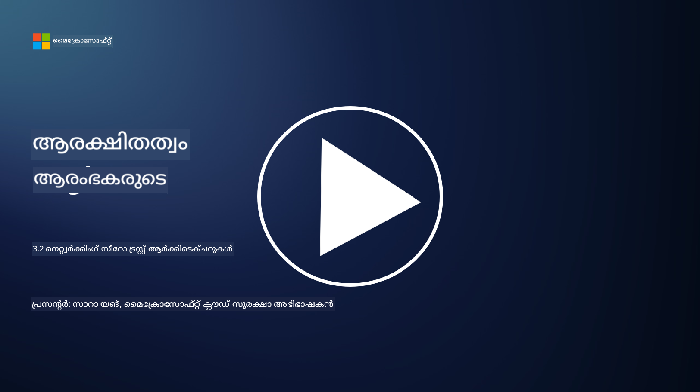

<!--
CO_OP_TRANSLATOR_METADATA:
{
  "original_hash": "680d6e14d9d33fc471c22f44679713f8",
  "translation_date": "2025-12-19T12:55:48+00:00",
  "source_file": "3.2 Networking zero trust architecture.md",
  "language_code": "ml"
}
-->
# നെറ്റ്വർക്കിംഗ് സീറോ ട്രസ്റ്റ് ആർക്കിടെക്ചറുകൾ

സീറോ ട്രസ്റ്റ് നിയന്ത്രണങ്ങളിൽ നെറ്റ്വർക്ക് ഒരു നിർണായക പാളി നൽകുന്നു, ഈ പാഠത്തിൽ ഇതിനെക്കുറിച്ച് കൂടുതൽ പഠിക്കാം:

 - നെറ്റ്വർക്ക് സെഗ്മെന്റേഷൻ എന്താണ്?  
 - നെറ്റ്വർക്ക് സെഗ്മെന്റേഷൻ സീറോ ട്രസ്റ്റ് നടപ്പിലാക്കുന്നതിൽ എങ്ങനെ സഹായിക്കുന്നു?  
 - എന്റു-ടു-എന്റു എൻക്രിപ്ഷൻ എന്താണ്?

## നെറ്റ്വർക്ക് സെഗ്മെന്റേഷൻ എന്താണ്?

നെറ്റ്വർക്ക് സെഗ്മെന്റേഷൻ എന്നത് ഒരു നെറ്റ്വർക്കിനെ ചെറിയ, വേർതിരിച്ച സെഗ്മെന്റുകളിലോ സബ് നെറ്റ്വർക്കുകളിലോ വിഭജിക്കുന്ന പ്രക്രിയയാണ്. ഓരോ സെഗ്മെന്റും മറ്റൊന്നിൽ നിന്ന് വേർതിരിച്ചിരിക്കുന്നു, സെഗ്മെന്റുകൾ തമ്മിലുള്ള ആക്സസ് പ്രത്യേക സുരക്ഷാ നയങ്ങൾ അടിസ്ഥാനമാക്കി നിയന്ത്രിക്കുകയും പരിമിതപ്പെടുത്തുകയും ചെയ്യുന്നു. നെറ്റ്വർക്ക് സെഗ്മെന്റേഷൻ സുരക്ഷ മെച്ചപ്പെടുത്താൻ ഉപയോഗിക്കുന്നു, സാധ്യതയുള്ള ഭേദങ്ങൾ നിയന്ത്രിക്കുകയും ആക്രമികൾക്ക് നെറ്റ്വർക്കിനുള്ളിൽ ലാറ്ററൽ മൂവ്‌മെന്റ് പരിമിതപ്പെടുത്തുകയും ചെയ്യുന്നു.

നെറ്റ്വർക്ക് സെഗ്മെന്റേഷൻ നടപ്പിലാക്കുന്നതിലൂടെ, ഒരു സംഘടന വിവിധ തരം ഉപയോക്താക്കളെ, ആപ്ലിക്കേഷനുകളെ, ഡാറ്റയെ വേർതിരിക്കുന്ന "മേഖലകൾ" സൃഷ്ടിക്കാം. ഇത് ആക്രമണ ഉപരിതലത്തെ കുറയ്ക്കുകയും ഒരു സുരക്ഷാ സംഭവത്തിൽ ഉണ്ടാകാവുന്ന നാശം പരിമിതപ്പെടുത്തുകയും ചെയ്യുന്നു. നെറ്റ്വർക്ക് സെഗ്മെന്റേഷൻ വിർച്വൽ ലാൻ (VLAN), ഫയർവാളുകൾ, ആക്സസ് നിയന്ത്രണങ്ങൾ പോലുള്ള സാങ്കേതികവിദ്യകളിലൂടെ സാധ്യമാക്കാം.

## നെറ്റ്വർക്ക് സെഗ്മെന്റേഷൻ സീറോ ട്രസ്റ്റ് നടപ്പിലാക്കുന്നതിൽ എങ്ങനെ സഹായിക്കുന്നു?

നെറ്റ്വർക്ക് സെഗ്മെന്റേഷൻ സീറോ ട്രസ്റ്റ് മോഡലിന്റെ തത്വങ്ങളുമായി അടുത്ത ബന്ധം പുലർത്തുന്നു. സീറോ ട്രസ്റ്റ് ആർക്കിടെക്ചറിൽ, നെറ്റ്വർക്ക് സെഗ്മെന്റേഷൻ "കുറഞ്ഞ അവകാശം" എന്ന തത്വം പ്രാബല്യത്തിൽ വരുത്താൻ സഹായിക്കുന്നു, ഉപയോക്താക്കൾക്കും ഉപകരണങ്ങൾക്കും അവരുടെ പ്രവർത്തനങ്ങൾ നടത്താൻ ആവശ്യമായ പ്രത്യേക വിഭവങ്ങൾക്കും സേവനങ്ങൾക്കും മാത്രമേ ആക്സസ് ഉണ്ടാകൂ. നെറ്റ്വർക്കിനെ ചെറിയ മേഖലകളായി വിഭജിച്ചതിലൂടെ, സംഘടനകൾ കർശനമായ ആക്സസ് നിയന്ത്രണങ്ങൾ നടപ്പിലാക്കുകയും, നിർണായക ആസ്തികളെ വേർതിരിക്കുകയും, ആക്രമികളുടെ ലാറ്ററൽ മൂവ്‌മെന്റ് തടയുകയും ചെയ്യുന്നു.

നെറ്റ്വർക്ക് സെഗ്മെന്റേഷൻ ഐഡന്റിറ്റി അടിസ്ഥാനമാക്കിയുള്ള ആക്സസ് നിയന്ത്രണങ്ങൾ പ്രാബല്യത്തിൽ വരുത്തുന്നതിലും സഹായിക്കുന്നു, ഉപയോക്താക്കളും ഉപകരണങ്ങളും പ്രത്യേക സെഗ്മെന്റുകളിൽ പ്രവേശിക്കുന്നതിന് മുമ്പ് പൂർണ്ണമായും പ്രാമാണീകരിക്കുകയും അനുമതി നൽകുകയും ചെയ്യുന്നു. ഇത് സംവേദനശീലമായ വിഭവങ്ങളിലേക്ക് അനധികൃത പ്രവേശനം തടയുകയും, കംപ്രോമൈസ് ചെയ്ത ക്രെഡൻഷ്യലുകളുടെ സാധ്യതാ പ്രഭാവം കുറയ്ക്കുകയും ചെയ്യുന്നു.

## എന്റു-ടു-എന്റു എൻക്രിപ്ഷൻ എന്താണ്?

എന്റു-ടു-എന്റു (E2E) എൻക്രിപ്ഷൻ എന്നത് ഡാറ്റ അയച്ചയാളിൽ നിന്ന് സ്വീകരിക്കുന്നയാളിലേക്ക് അതിന്റെ മുഴുവൻ യാത്രയിലും എൻക്രിപ്റ്റ് ചെയ്ത നിലയിൽ തുടരുന്നുവെന്ന് ഉറപ്പാക്കുന്ന ഒരു സുരക്ഷാ നടപടിയാണ്. ഈ പ്രക്രിയയിൽ, ഡാറ്റ അയച്ചയാളുടെ ഭാഗത്ത് എൻക്രിപ്റ്റ് ചെയ്യപ്പെടുകയും, ഡാറ്റ ഡീക്രിപ്റ്റ് ചെയ്ത് വായിക്കാൻ ആവശ്യമായ കീ സ്വീകരിക്കുന്നയാളിൽ മാത്രം ഉണ്ടായിരിക്കുകയും ചെയ്യുന്നു. എൻക്രിപ്ഷൻ, ഡീക്രിപ്ഷൻ പ്രക്രിയകൾ എന്റ്പോയിന്റുകളിൽ നടക്കുന്നതിനാൽ, അനധികൃത പാർട്ടികൾക്ക്, സേവനദാതാക്കളും ഇടനിലക്കാരും ഉൾപ്പെടെ, പ്ലെയിൻടെക്സ്റ്റ് ഡാറ്റയിൽ പ്രവേശനം നേടുക വളരെ പ്രയാസമാണ്.

E2E എൻക്രിപ്ഷൻ ഡാറ്റ ട്രാൻസ്മിഷനിൽ ഉയർന്ന തലത്തിലുള്ള രഹസ്യതയും സുരക്ഷയും നൽകുന്നു, ഡാറ്റ വിവിധ ഇടനില സിസ്റ്റങ്ങളിലോ നെറ്റ്വർക്കുകളിലോ കടന്നുപോകുന്നുവെങ്കിലും. ഇത് സുരക്ഷിത സന്ദേശ ആപ്പുകളിൽ, ഇമെയിൽ സേവനങ്ങളിൽ, മറ്റ് ആശയവിനിമയ പ്ലാറ്റ്ഫോമുകളിൽ സാധാരണയായി ഉപയോഗിക്കുന്നു, സംവേദനശീലമായ വിവരങ്ങൾ തടയലിൽ നിന്ന് സംരക്ഷിക്കാൻ. 

ഈ എൻക്രിപ്ഷൻ രീതി ഉറപ്പാക്കുന്നത്, ആക്രമികൾ ഡാറ്റ ട്രാൻസിറ്റിൽ പ്രവേശനം നേടാൻ സാധിച്ചാലും, അവർക്ക് ഡീക്രിപ്ഷൻ കീ ഇല്ലാതെ അർഥമില്ലാത്ത എൻക്രിപ്റ്റ് ചെയ്ത ഉള്ളടക്കം മാത്രമേ കാണാൻ കഴിയൂ. എന്റു-ടു-എന്റു എൻക്രിപ്ഷൻ ഉപയോക്തൃ സ്വകാര്യത സംരക്ഷിക്കുന്നതിലും, അനധികൃത പാർട്ടികൾക്ക് സംവേദനശീലമായ വിവരങ്ങൾ പുറത്തു വിടുന്നത് തടയുന്നതിലും നിർണായകമായ പങ്ക് വഹിക്കുന്നു.

## SASE എന്താണ്?

SASE എന്നത് "Secure Access Service Edge" എന്നതിന്റെ ചുരുക്കപ്പേരാണ്, ഇത് നെറ്റ്വർക്ക് സുരക്ഷയും വൈഡ്-എരിയ നെറ്റ്വർക്കിംഗ് (WAN) ശേഷികളും ഒരു ക്ലൗഡ് അടിസ്ഥാനമാക്കിയുള്ള സേവനത്തിലേക്ക് സംയോജിപ്പിക്കുന്ന ഒരു സൈബർസുരക്ഷാ ഫ്രെയിംവർക്കും ആർക്കിടെക്ചറും ആണ്. SASE ദൂരസ്ഥവും മൊബൈലും ആയ ഉപയോക്താക്കൾക്ക് നെറ്റ്വർക്ക് വിഭവങ്ങൾ, ആപ്ലിക്കേഷനുകൾ, ഡാറ്റ എന്നിവയിലേക്ക് സുരക്ഷിതവും സ്കെയിലബിളുമായ ആക്സസ് നൽകുന്നതിനൊപ്പം, നെറ്റ്വർക്ക് മാനേജ്മെന്റ് ലളിതമാക്കുകയും പരമ്പരാഗത നെറ്റ്വർക്ക്, സുരക്ഷാ ആർക്കിടെക്ചറുകളുടെ സങ്കീർണ്ണത കുറയ്ക്കുകയും ചെയ്യുന്നു.

SASEയുടെ പ്രധാന സവിശേഷതകളും ഘടകങ്ങളും:

1.  **ക്ലൗഡ് അടിസ്ഥാനമാക്കിയുള്ളത്:** SASE ഒരു ക്ലൗഡ് സേവനമായി നൽകപ്പെടുന്നു, അതിനാൽ സുരക്ഷയും നെറ്റ്വർക്കിംഗ് പ്രവർത്തനങ്ങളും പരമ്പരാഗത ഓൺ-പ്രെമൈസ്സ് ഹാർഡ്‌വെയറിലും ഉപകരണങ്ങളിലും ആശ്രയിക്കുന്നതിനു പകരം ക്ലൗഡിൽ നിന്ന് ലഭിക്കുന്നു.
    
2.  **സുരക്ഷയും നെറ്റ്വർക്കിംഗും സംയോജനം:** SASE വിവിധ സുരക്ഷാ സേവനങ്ങൾ സംയോജിപ്പിക്കുന്നു, ഉദാ: സുരക്ഷിത വെബ് ഗേറ്റ്വേ (SWG), ഫയർവാൾ ആസ് എ സർവീസ് (FWaaS), ഡാറ്റ ലോസ് പ്രിവെൻഷൻ (DLP), സീറോ-ട്രസ്റ്റ് നെറ്റ്വർക്ക് ആക്സസ് (ZTNA), WAN ഓപ്റ്റിമൈസേഷൻ എന്നിവ വൈഡ്-എരിയ നെറ്റ്വർക്കിംഗ് ശേഷികളുമായി സംയോജിപ്പിക്കുന്നു. ഈ സംയോജനം സുരക്ഷയും നെറ്റ്വർക്കിംഗ് പ്രവർത്തനങ്ങളും ലളിതമാക്കാൻ സഹായിക്കുന്നു.
    
3.  **സീറോ ട്രസ്റ്റ്:** SASE സീറോ ട്രസ്റ്റ് തത്വത്തിൽ പ്രവർത്തിക്കുന്നു, അതിനാൽ കർശനമായ ആക്സസ് നിയന്ത്രണങ്ങളും കുറഞ്ഞ അവകാശ ആക്സസ് നയങ്ങളും പ്രാബല്യത്തിൽ വരുത്തുന്നു. ഉപയോക്താക്കളും ഉപകരണങ്ങളും സ്വാഭാവികമായി വിശ്വസിക്കപ്പെടുന്നില്ല, അവർ വിഭവങ്ങളിൽ പ്രവേശിക്കുന്നതിന് മുമ്പ് പ്രാമാണീകരിക്കുകയും അനുമതി നൽകുകയും ചെയ്യണം.
    
4.  **ഐഡന്റിറ്റി-കേന്ദ്രിതം:** SASE ഉപയോക്താവിന്റെയും ഉപകരണത്തിന്റെയും ഐഡന്റിറ്റികളിൽ ആക്സസ് നിയന്ത്രണത്തിന്റെ അടിസ്ഥാനമായി ശ്രദ്ധ കേന്ദ്രീകരിക്കുന്നു. ഐഡന്റിറ്റി, കോൺടെക്സ്റ്റ് അടിസ്ഥാനമാക്കിയുള്ള നയങ്ങൾ ഉപയോഗിച്ച് ആക്സസ് അനുമതികൾ നിർണയിക്കുന്നു, ഈ നയങ്ങൾ ഉപയോക്തൃ പെരുമാറ്റവും കോൺടെക്സ്റ്റും അടിസ്ഥാനമാക്കി ഡൈനാമിക് ആയി മാറുന്നു.
    
5.  **സ്കെയിലബിലിറ്റിയും ഫ്ലെക്സിബിലിറ്റിയും:** SASE ഒരു വലിയ എണ്ണം ഉപയോക്താക്കളെയും ഉപകരണങ്ങളെയും ഉൾക്കൊള്ളാൻ എളുപ്പത്തിൽ സ്കെയിൽ ചെയ്യാൻ കഴിയും, വിവിധവും മാറിവരുന്ന നെറ്റ്വർക്കിംഗ്, സുരക്ഷാ ആവശ്യങ്ങളുള്ള സംഘടനകൾക്ക് ഇത് അനുയോജ്യമാണ്.
   

ദൂരസ്ഥ പ്രവർത്തനത്തിന്റെയും ക്ലൗഡ് സ്വീകരണത്തിന്റെയും ആധുനിക കാലഘട്ടത്തിൽ SASE പ്രത്യേകമായി പ്രസക്തമാണ്, ഇത് നെറ്റ്വർക്ക് ആക്സസ് സുരക്ഷിതമാക്കാനും മാനേജ്മെന്റ് ലളിതമാക്കാനും സമഗ്രവും ചലനാത്മകവുമായ സമീപനം നൽകുന്നു. ഉപയോക്തൃ-കേന്ദ്രിതവും സീറോ-ട്രസ്റ്റ് സുരക്ഷാ മോഡലുകളിലും ശക്തമായ ശ്രദ്ധ നിലനിർത്തുന്നതിനിടെ, മാറ്റം വരുത്തുന്ന സുരക്ഷാ, നെറ്റ്വർക്കിംഗ് ആവശ്യങ്ങൾക്കൊപ്പം സംഘടനകൾക്ക് ഇണങ്ങാൻ ഇത് സഹായിക്കുന്നു.

## കൂടുതൽ വായന

- [What Is Network Segmentation? - Cisco](https://www.cisco.com/c/en/us/products/security/what-is-network-segmentation.html#~benefits)
- [What Is Micro-Segmentation? - Cisco](https://www.cisco.com/c/en/us/products/security/what-is-microsegmentation.html)
- [Implementing Network Segmentation and Segregation | Cyber.gov.au](https://www.cyber.gov.au/resources-business-and-government/maintaining-devices-and-systems/system-hardening-and-administration/network-hardening/implementing-network-segmentation-and-segregation)
- [What Is Network Segmentation and Why It Matters | CompTIA](https://www.comptia.org/blog/security-awareness-training-network-segmentation)
- [Network Segmentation: Concepts and Practices (cmu.edu)](https://insights.sei.cmu.edu/blog/network-segmentation-concepts-and-practices/)
- [Secure networks with Zero Trust | Microsoft Learn](https://learn.microsoft.com/security/zero-trust/deploy/networks?WT.mc_id=academic-96948-sayoung)
- [What is end-to-end encryption? | IBM](https://www.ibm.com/topics/end-to-end-encryption)
- [What Is End-to-End Encryption, and Why Does It Matter? (howtogeek.com)](https://www.howtogeek.com/711656/what-is-end-to-end-encryption-and-why-does-it-matter/)
-  [Definition of Secure Access Service Edge (SASE) - Gartner Information Technology Glossary](https://www.gartner.com/en/information-technology/glossary/secure-access-service-edge-sase)
- [What Is Secure Access Service Edge (SASE)? | Microsoft Security](https://www.microsoft.com/security/business/security-101/what-is-sase?WT.mc_id=academic-96948-sayoung)

---

<!-- CO-OP TRANSLATOR DISCLAIMER START -->
**അസത്യവാദം**:  
ഈ രേഖ AI വിവർത്തന സേവനമായ [Co-op Translator](https://github.com/Azure/co-op-translator) ഉപയോഗിച്ച് വിവർത്തനം ചെയ്തതാണ്. കൃത്യതയ്ക്കായി ഞങ്ങൾ ശ്രമിക്കുന്നുവെങ്കിലും, ഓട്ടോമേറ്റഡ് വിവർത്തനങ്ങളിൽ പിശകുകൾ അല്ലെങ്കിൽ തെറ്റായ വിവരങ്ങൾ ഉണ്ടാകാൻ സാധ്യതയുണ്ട്. അതിന്റെ സ്വാഭാവിക ഭാഷയിലുള്ള മൗലിക രേഖ പ്രാമാണികമായ ഉറവിടമായി കണക്കാക്കണം. നിർണായകമായ വിവരങ്ങൾക്ക്, പ്രൊഫഷണൽ മനുഷ്യ വിവർത്തനം ശുപാർശ ചെയ്യുന്നു. ഈ വിവർത്തനം ഉപയോഗിക്കുന്നതിൽ നിന്നുണ്ടാകുന്ന തെറ്റിദ്ധാരണകൾക്കോ തെറ്റായ വ്യാഖ്യാനങ്ങൾക്കോ ഞങ്ങൾ ഉത്തരവാദികളല്ല.
<!-- CO-OP TRANSLATOR DISCLAIMER END -->