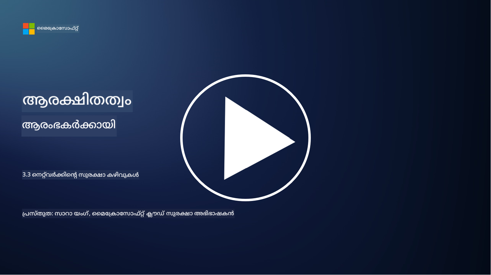

<!--
CO_OP_TRANSLATOR_METADATA:
{
  "original_hash": "c3aba077bb98eebc925dd58d870229ab",
  "translation_date": "2025-12-19T13:35:37+00:00",
  "source_file": "3.3 Network security capabilities.md",
  "language_code": "ml"
}
-->
# നെറ്റ്‌വർക്ക് സുരക്ഷാ ശേഷികൾ

ഈ പാഠത്തിൽ, ഒരു നെറ്റ്‌വർക്ക് സുരക്ഷിതമാക്കാൻ ഉപയോഗിക്കാവുന്ന താഴെപ്പറയുന്ന ശേഷികളെക്കുറിച്ച് പഠിക്കാം:

 - പരമ്പരാഗത ഫയർവാളുകൾ  
 - വെബ് ആപ്ലിക്കേഷൻ ഫയർവാളുകൾ  
 - ക്ലൗഡ് സെക്യൂരിറ്റി ഗ്രൂപ്പുകൾ  
 - CDN  
 - ലോഡ് ബാലൻസറുകൾ  
 - ബാസ്റ്റിയൻ ഹോസ്റ്റുകൾ  
 - VPNs  
 - DDoS സംരക്ഷണം  

## പരമ്പരാഗത ഫയർവാളുകൾ

പരമ്പരാഗത ഫയർവാളുകൾ മുൻകൂട്ടി നിർവചിച്ച സുരക്ഷാ നിയമങ്ങൾ അടിസ്ഥാനമാക്കി നെറ്റ്‌വർക്ക് ട്രാഫിക് നിയന്ത്രിക്കുകയും നിരീക്ഷിക്കുകയും ചെയ്യുന്ന സുരക്ഷാ ഉപകരണങ്ങളാണ്. അവ വിശ്വസനീയമായ ആന്തരിക നെറ്റ്‌വർക്കിനും വിശ്വസനീയമല്ലാത്ത ബാഹ്യ നെറ്റ്‌വർക്കുകൾക്കും ഇടയിൽ ഒരു തടസ്സമായി പ്രവർത്തിക്കുന്നു, അനധികൃത ആക്‌സസും സാധ്യതയുള്ള ഭീഷണികളും തടയാൻ ട്രാഫിക് ഫിൽട്ടർ ചെയ്യുന്നു.

## വെബ് ആപ്ലിക്കേഷൻ ഫയർവാളുകൾ

വെബ് ആപ്ലിക്കേഷൻ ഫയർവാളുകൾ (WAFs) SQL ഇൻജക്ഷൻ, ക്രോസ്-സൈറ്റ് സ്ക്രിപ്റ്റിംഗ്, മറ്റ് സുരക്ഷാ ദൗർബല്യങ്ങൾ എന്നിവ പോലുള്ള വിവിധ ആക്രമണങ്ങളിൽ നിന്ന് വെബ് ആപ്ലിക്കേഷനുകളെ സംരക്ഷിക്കാൻ രൂപകൽപ്പന ചെയ്ത പ്രത്യേക ഫയർവാളുകളാണ്. HTTP അഭ്യർത്ഥനകളും പ്രതികരണങ്ങളും വിശകലനം ചെയ്ത് വെബ് ആപ്ലിക്കേഷനുകളെ ലക്ഷ്യമിടുന്ന ദുഷ്ട ട്രാഫിക് തിരിച്ചറിയുകയും തടയുകയും ചെയ്യുന്നു.

## ക്ലൗഡ് സെക്യൂരിറ്റി ഗ്രൂപ്പുകൾ

സെക്യൂരിറ്റി ഗ്രൂപ്പുകൾ ക്ലൗഡ് സേവന ദാതാക്കൾ നൽകുന്ന അടിസ്ഥാന നെറ്റ്‌വർക്ക് സുരക്ഷാ സവിശേഷതയാണ്. അവ ക്ലൗഡ് വിഭവങ്ങളിലേക്കും (ഉദാ: വെർച്വൽ മെഷീനുകൾ, ഇൻസ്റ്റൻസുകൾ) അവയിൽ നിന്ന് വരുന്ന ഇൻബൗണ്ട്, ഔട്ട്‌ബൗണ്ട് ട്രാഫിക് നിയന്ത്രിക്കുന്ന വെർച്വൽ ഫയർവാളുകളായി പ്രവർത്തിക്കുന്നു. സെക്യൂരിറ്റി ഗ്രൂപ്പുകൾ ഏത് തരത്തിലുള്ള ട്രാഫിക് അനുവദിക്കണം, നിരസിക്കണം എന്നിവ നിർവചിക്കുന്ന നിയമങ്ങൾ നിർവചിക്കാൻ സംഘടനകളെ അനുവദിക്കുന്നു, ക്ലൗഡ് വിന്യാസങ്ങൾക്ക് ഒരു അധിക പ്രതിരോധ പാളി ചേർക്കുന്നു.

## കണ്ടന്റ് ഡെലിവറി നെറ്റ്‌വർക്ക് (CDN)

കണ്ടന്റ് ഡെലിവറി നെറ്റ്‌വർക്ക് (CDN) വിവിധ ഭൗഗോളിക സ്ഥലങ്ങളിൽ സ്ഥിതി ചെയ്യുന്ന സർവറുകളുടെ വിതരണ ശൃംഖലയാണ്. സൈറ്റുകളുടെ പ്രകടനവും ലഭ്യതയും മെച്ചപ്പെടുത്താൻ CDNs ഉള്ളടക്കം കാഷ് ചെയ്യുകയും ഉപയോക്താവിനോട് അടുത്തുള്ള സർവറുകളിൽ നിന്ന് സേവനം നൽകുകയും ചെയ്യുന്നു. കൂടാതെ, ട്രാഫിക് പല സർവർ ലൊക്കേഷനുകളിലായി വിതരണം ചെയ്യുന്നതിലൂടെ DDoS ആക്രമണങ്ങളിൽ നിന്ന് ഒരു പരിധിവരെ സംരക്ഷണം നൽകുന്നു.

## ലോഡ് ബാലൻസറുകൾ

ലോഡ് ബാലൻസറുകൾ വരുന്ന നെറ്റ്‌വർക്ക് ട്രാഫിക് പല സർവറുകളിലായി വിതരണം ചെയ്യുന്നു, വിഭവങ്ങളുടെ ഉപയോഗം മെച്ചപ്പെടുത്താനും ഉയർന്ന ലഭ്യത ഉറപ്പാക്കാനും ആപ്ലിക്കേഷൻ പ്രകടനം മെച്ചപ്പെടുത്താനും. അവ സർവർ ഓവർലോഡ് തടയുകയും ദക്ഷിണമായ പ്രതികരണ സമയം നിലനിർത്തുകയും ചെയ്യുന്നു, നെറ്റ്‌വർക്കിന്റെ പ്രതിരോധശേഷി വർദ്ധിപ്പിക്കുന്നു.

## ബാസ്റ്റിയൻ ഹോസ്റ്റുകൾ

ബാസ്റ്റിയൻ ഹോസ്റ്റുകൾ വളരെ സുരക്ഷിതവും ഒറ്റപ്പെട്ടതുമായ സർവറുകളാണ്, അവ വിശ്വസനീയമല്ലാത്ത ബാഹ്യ നെറ്റ്‌വർക്കിൽ നിന്ന് (ഉദാ: ഇന്റർനെറ്റ്) ഒരു നെറ്റ്‌വർക്കിലേക്ക് നിയന്ത്രിത ആക്‌സസ് നൽകുന്നു. അഡ്മിനിസ്ട്രേറ്റർമാർക്ക് ആന്തരിക സിസ്റ്റങ്ങളിലേക്ക് സുരക്ഷിതമായി ആക്‌സസ് നേടാൻ പ്രവേശന കേന്ദ്രങ്ങളായി പ്രവർത്തിക്കുന്നു. ബാസ്റ്റിയൻ ഹോസ്റ്റുകൾ സാധാരണയായി ശക്തമായ സുരക്ഷാ നടപടികളോടെ ക്രമീകരിച്ചിരിക്കുന്നു, ആക്രമണ സാധ്യത കുറയ്ക്കാൻ.

## വെർച്വൽ പ്രൈവറ്റ് നെറ്റ്‌വർക്കുകൾ (VPNs)

VPNs ഉപയോക്താവിന്റെ ഉപകരണത്തിനും ദൂരസ്ഥ സർവറിനും ഇടയിൽ എൻക്രിപ്റ്റ് ചെയ്ത ടണലുകൾ സൃഷ്ടിക്കുന്നു, ഇന്റർനെറ്റ് പോലുള്ള സുരക്ഷിതമല്ലാത്ത നെറ്റ്‌വർക്കുകളിൽ സുരക്ഷിതവും സ്വകാര്യവുമായ ആശയവിനിമയം ഉറപ്പാക്കുന്നു. VPNs സാധാരണയായി ആന്തരിക നെറ്റ്‌വർക്കുകളിലേക്ക് ദൂരസ്ഥ ആക്‌സസ് നൽകാൻ ഉപയോഗിക്കുന്നു, ഉപയോക്താക്കൾക്ക് അവർ ശാരീരികമായി ഒരേ നെറ്റ്‌വർക്കിൽ ഉള്ളതുപോലെ വിഭവങ്ങൾ ആക്‌സസ് ചെയ്യാൻ അനുവദിക്കുന്നു.

## DDoS സംരക്ഷണ ഉപകരണങ്ങൾ

DDoS (Distributed Denial of Service) സംരക്ഷണ ഉപകരണങ്ങളും സേവനങ്ങളും DDoS ആക്രമണങ്ങളുടെ സ്വാധീനം കുറയ്ക്കാൻ രൂപകൽപ്പന ചെയ്തതാണ്, അവിടെ നിരവധി കംപ്രമൈസ് ചെയ്ത ഉപകരണങ്ങൾ ഒരു നെറ്റ്‌വർക്ക് അല്ലെങ്കിൽ സേവനം മൂടി അതിനെ തകർക്കാൻ ശ്രമിക്കുന്നു. DDoS സംരക്ഷണ പരിഹാരങ്ങൾ ദുഷ്ട ട്രാഫിക് തിരിച്ചറിയുകയും ഫിൽട്ടർ ചെയ്യുകയും ചെയ്യുന്നു, നിയമാനുസൃതമായ ട്രാഫിക് അതിന്റെ ലക്ഷ്യസ്ഥാനത്ത് എത്താൻ കഴിയുന്നുവെന്ന് ഉറപ്പാക്കുന്നു.

## കൂടുതൽ വായനയ്ക്ക്

- [What Is a Firewall? - Cisco](https://www.cisco.com/c/en/us/products/security/firewalls/what-is-a-firewall.html#~types-of-firewalls)  
- [What Does a Firewall Actually Do? (howtogeek.com)](https://www.howtogeek.com/144269/htg-explains-what-firewalls-actually-do/)  
- [What is a Firewall? How Firewalls Work & Types of Firewalls (kaspersky.com)](https://www.kaspersky.com/resource-center/definitions/firewall)  
- [Network security group - how it works | Microsoft Learn](https://learn.microsoft.com/azure/virtual-network/network-security-group-how-it-works)  
- [Introduction to Azure Content Delivery Network (CDN) - Training | Microsoft Learn](https://learn.microsoft.com/training/modules/intro-to-azure-content-delivery-network/?WT.mc_id=academic-96948-sayoung)  
- [What is a content delivery network (CDN)? - Azure | Microsoft Learn](https://learn.microsoft.com/azure/cdn/cdn-overview?WT.mc_id=academic-96948-sayoung)  
- [What Is Load Balancing? How Load Balancers Work (nginx.com)](https://www.nginx.com/resources/glossary/load-balancing/)  
- [Bastion hosts vs. VPNs · Tailscale](https://tailscale.com/learn/bastion-hosts-vs-vpns/)  
- [What is VPN? How It Works, Types of VPN (kaspersky.com)](https://www.kaspersky.com/resource-center/definitions/what-is-a-vpn)  
- [Introduction to Azure DDoS Protection - Training | Microsoft Learn](https://learn.microsoft.com/training/modules/introduction-azure-ddos-protection/?WT.mc_id=academic-96948-sayoung)  
- [What Is a DDoS Attack? | Microsoft Security](https://www.microsoft.com/security/business/security-101/what-is-a-ddos-attack?WT.mc_id=academic-96948-sayoung)  

---

<!-- CO-OP TRANSLATOR DISCLAIMER START -->
**അസത്യവാദം**:  
ഈ രേഖ AI വിവർത്തന സേവനമായ [Co-op Translator](https://github.com/Azure/co-op-translator) ഉപയോഗിച്ച് വിവർത്തനം ചെയ്തതാണ്. കൃത്യതയ്ക്കായി ഞങ്ങൾ ശ്രമിക്കുന്നുവെങ്കിലും, ഓട്ടോമേറ്റഡ് വിവർത്തനങ്ങളിൽ പിശകുകൾ അല്ലെങ്കിൽ തെറ്റായ വിവരങ്ങൾ ഉണ്ടാകാൻ സാധ്യതയുണ്ട്. അതിന്റെ സ്വാഭാവിക ഭാഷയിലുള്ള മൗലിക രേഖ പ്രാമാണികമായ ഉറവിടമായി കണക്കാക്കണം. നിർണായകമായ വിവരങ്ങൾക്ക്, പ്രൊഫഷണൽ മനുഷ്യ വിവർത്തനം ശുപാർശ ചെയ്യുന്നു. ഈ വിവർത്തനം ഉപയോഗിക്കുന്നതിൽ നിന്നുണ്ടാകുന്ന തെറ്റിദ്ധാരണകൾക്കോ തെറ്റായ വ്യാഖ്യാനങ്ങൾക്കോ ഞങ്ങൾ ഉത്തരവാദികളല്ല.
<!-- CO-OP TRANSLATOR DISCLAIMER END -->