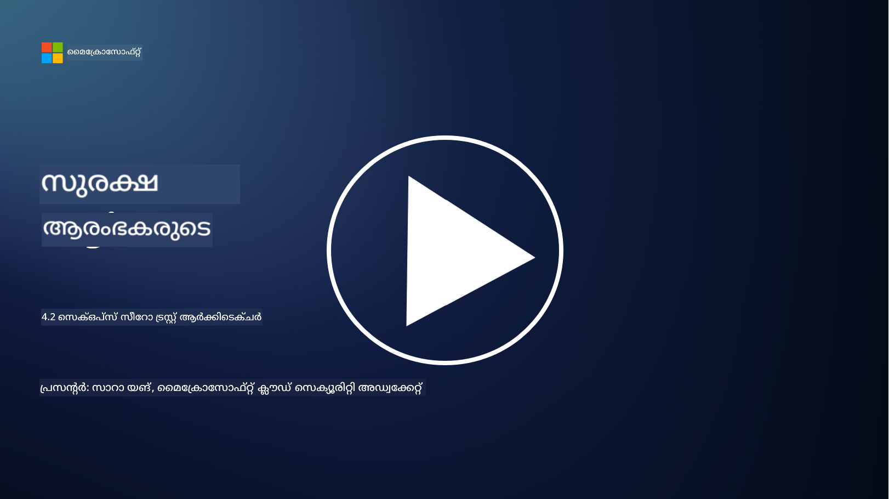

<!--
CO_OP_TRANSLATOR_METADATA:
{
  "original_hash": "45bbdc114e70936816b0b3e7c40189cf",
  "translation_date": "2025-12-19T13:29:53+00:00",
  "source_file": "4.2 SecOps zero trust architecture.md",
  "language_code": "ml"
}
-->
# SecOps സീറോ ട്രസ്റ്റ് ആർക്കിടെക്ചർ

സുരക്ഷാ ഓപ്പറേഷനുകൾ സീറോ ട്രസ്റ്റ് ആർക്കിടെക്ചറിന്റെ രണ്ട് ഭാഗങ്ങളാണ്, ഈ പാഠത്തിൽ നമുക്ക് രണ്ടും കുറിച്ച് പഠിക്കാം:

- കേന്ദ്രഭാവത്തിലുള്ള ലോഗ് ശേഖരണം അനുവദിക്കുന്നതിന് ഐടി ആർക്കിടെക്ചറുകൾ എങ്ങനെ നിർമ്മിക്കണം?

- ആധുനിക ഐടി പരിസ്ഥിതികളിൽ സുരക്ഷാ ഓപ്പറേഷനുകൾക്കുള്ള മികച്ച രീതികൾ എന്തൊക്കെയാണ്?

## കേന്ദ്രഭാവത്തിലുള്ള ലോഗ് ശേഖരണം അനുവദിക്കുന്നതിന് ഐടി ആർക്കിടെക്ചറുകൾ എങ്ങനെ നിർമ്മിക്കണം?

കേന്ദ്രഭാവത്തിലുള്ള ലോഗ് ശേഖരണം ആധുനിക സുരക്ഷാ ഓപ്പറേഷനുകളുടെ നിർണായക ഘടകമാണ്. ഇത് സർവറുകൾ, ആപ്ലിക്കേഷനുകൾ, നെറ്റ്‌വർക്ക് ഉപകരണങ്ങൾ, സുരക്ഷാ ഉപകരണങ്ങൾ എന്നിവ പോലുള്ള വിവിധ ഉറവിടങ്ങളിൽ നിന്ന് ലോഗുകളും ഡാറ്റയും ഒരു കേന്ദ്ര ശേഖരത്തിലേക്ക് ശേഖരിച്ച് വിശകലനം, നിരീക്ഷണം, സംഭവ പ്രതികരണം എന്നിവയ്ക്ക് ഉപയോഗിക്കാൻ സഹായിക്കുന്നു. കേന്ദ്രഭാവത്തിലുള്ള ലോഗ് ശേഖരണത്തെ പിന്തുണയ്ക്കുന്ന ഐടി ആർക്കിടെക്ചറുകൾ നിർമ്മിക്കുന്നതിന് ചില മികച്ച രീതികൾ ഇവയാണ്:

1. **ലോഗ് ഉറവിട സംയോജനം**:

- എല്ലാ അനുയോജ്യമായ ഉപകരണങ്ങളും സിസ്റ്റങ്ങളും ലോഗുകൾ സൃഷ്ടിക്കാൻ ക്രമീകരിച്ചിട്ടുണ്ടെന്ന് ഉറപ്പാക്കുക. ഇതിൽ സർവറുകൾ, ഫയർവാളുകൾ, റൂട്ടറുകൾ, സ്വിച്ചുകൾ, ആപ്ലിക്കേഷനുകൾ, സുരക്ഷാ ഉപകരണങ്ങൾ എന്നിവ ഉൾപ്പെടുന്നു.

- ലോഗ് ഉറവിടങ്ങൾ ലോഗുകൾ ഒരു കേന്ദ്ര ലോഗ് ശേഖരണത്തിലേക്ക് അല്ലെങ്കിൽ മാനേജ്മെന്റ് സിസ്റ്റത്തിലേക്ക് ഫോർവേഡ് ചെയ്യാൻ ക്രമീകരിക്കുക.

2. **ശരിയായ SIEM (സുരക്ഷാ വിവരവും സംഭവ മാനേജ്മെന്റും) ഉപകരണം തിരഞ്ഞെടുക്കുക**:

- നിങ്ങളുടെ സ്ഥാപനത്തിന്റെ ആവശ്യങ്ങൾക്കും വലുപ്പത്തിനും അനുയോജ്യമായ SIEM പരിഹാരം തിരഞ്ഞെടുക്കുക.

- തിരഞ്ഞെടുക്കുന്ന പരിഹാരം ലോഗ് ശേഖരണം, സമാഹരണം, വിശകലനം, റിപ്പോർട്ടിംഗ് എന്നിവ പിന്തുണയ്ക്കുന്നുണ്ടെന്ന് ഉറപ്പാക്കുക.

3. **സ്കെയിലബിലിറ്റിയും റിഡണ്ടൻസിയും**:

- കൂടുതൽ ലോഗ് ഉറവിടങ്ങളും വർദ്ധിച്ച ലോഗ് വോളിയവും കൈകാര്യം ചെയ്യാൻ സ്കെയിലബിലിറ്റിക്ക് അനുയോജ്യമായ ആർക്കിടെക്ചർ രൂപകൽപ്പന ചെയ്യുക.

- ഹാർഡ്‌വെയർ അല്ലെങ്കിൽ നെറ്റ്‌വർക്ക് തകരാറുകൾ മൂലമുള്ള തടസ്സങ്ങൾ ഒഴിവാക്കാൻ ഉയർന്ന ലഭ്യതയ്ക്കായി റിഡണ്ടൻസി നടപ്പിലാക്കുക.

4. **ലോഗുകൾ സുരക്ഷിതമായി കൈമാറുക**:

- TLS/SSL അല്ലെങ്കിൽ IPsec പോലുള്ള സുരക്ഷിത പ്രോട്ടോകോളുകൾ ഉപയോഗിച്ച് ലോഗുകൾ ഉറവിടങ്ങളിൽ നിന്ന് കേന്ദ്ര ശേഖരത്തിലേക്ക് കൈമാറുക.

- ലോഗുകൾ അയയ്ക്കാൻ അധികാരമുള്ള ഉപകരണങ്ങൾ മാത്രമേ ഉപയോഗിക്കൂ എന്ന് ഉറപ്പാക്കാൻ പ്രാമാണീകരണവും ആക്സസ് നിയന്ത്രണങ്ങളും നടപ്പിലാക്കുക.

5. **സാധാരണവൽക്കരണം**:

- ലോഗ് ഫോർമാറ്റുകൾ സ്റ്റാൻഡേർഡൈസ് ചെയ്യുകയും ഡാറ്റ സാധാരണവൽക്കരിക്കുകയും ചെയ്യുക, വിശകലനവും സുതാര്യവുമാക്കാൻ.

6. **സംഭരണംയും നിലനിർത്തലും**:

- അനുസരണവും സുരക്ഷാ ആവശ്യകതകളും അടിസ്ഥാനമാക്കി ലോഗുകളുടെ അനുയോജ്യമായ നിലനിർത്തൽ കാലയളവ് നിർണ്ണയിക്കുക.

- ലോഗുകൾ സുരക്ഷിതമായി സംഭരിക്കുക, അവ അനധികൃത ആക്സസ്, കൈമാറ്റം എന്നിവയിൽ നിന്ന് സംരക്ഷിക്കുക.

## ആധുനിക ഐടി പരിസ്ഥിതികളിൽ സുരക്ഷാ ഓപ്പറേഷനുകൾക്കുള്ള മികച്ച രീതികൾ എന്തൊക്കെയാണ്?

കേന്ദ്രഭാവത്തിലുള്ള ലോഗ് ശേഖരണത്തിന് പുറമെ, ആധുനിക ഐടി പരിസ്ഥിതികളിൽ സുരക്ഷാ ഓപ്പറേഷനുകൾക്കുള്ള ചില മികച്ച രീതികൾ ഇവയാണ്:

1. **തുടർച്ചയായ നിരീക്ഷണം**: നെറ്റ്‌വർക്ക്, സിസ്റ്റം പ്രവർത്തനങ്ങൾ നിരീക്ഷിച്ച് ഭീഷണികളെ യഥാർത്ഥ സമയത്ത് കണ്ടെത്താനും പ്രതികരിക്കാനും തുടർച്ചയായ നിരീക്ഷണം നടപ്പിലാക്കുക.

2. **ഭീഷണി ബോധവൽക്കരണം**: ഭീഷണികളും ദുർബലതകളും സംബന്ധിച്ച പുതിയ വിവരങ്ങൾ ഭീഷണി ബോധവൽക്കരണ ഫീഡുകളും സേവനങ്ങളും ഉപയോഗിച്ച് അറിയുക.

3. **ഉപയോക്തൃ പരിശീലനം**: സോഷ്യൽ എഞ്ചിനീയറിംഗും ഫിഷിംഗ് ആക്രമണങ്ങളും സംബന്ധിച്ച അപകടങ്ങൾ കുറയ്ക്കാൻ ജീവനക്കാർക്ക് സ്ഥിരമായ സുരക്ഷാ ബോധവൽക്കരണ പരിശീലനം നൽകുക.

4. **സംഭവ പ്രതികരണ പദ്ധതി**: സുരക്ഷാ സംഭവങ്ങൾക്ക് വേഗത്തിലും ഫലപ്രദമായും പ്രതികരിക്കാൻ ഒരു സംഭവ പ്രതികരണ പദ്ധതി വികസിപ്പിക്കുകയും പരീക്ഷിക്കുകയും ചെയ്യുക.

5. **സുരക്ഷാ ഓട്ടോമേഷൻ**: സംഭവ പ്രതികരണവും ആവർത്തിക്കുന്ന ജോലികളും ലളിതമാക്കാൻ സുരക്ഷാ ഓട്ടോമേഷൻ, ഓർക്കസ്ട്രേഷൻ ഉപകരണങ്ങൾ ഉപയോഗിക്കുക.

6. **ബാക്കപ്പ്, പുനഃസ്ഥാപനം**: ഡാറ്റ നഷ്ടമോ റാൻസംവെയർ ആക്രമണങ്ങളോ സംഭവിച്ചാൽ ഡാറ്റ ലഭ്യത ഉറപ്പാക്കാൻ ശക്തമായ ബാക്കപ്പ്, ദുരന്ത പുനഃസ്ഥാപന പരിഹാരങ്ങൾ നടപ്പിലാക്കുക.

## കൂടുതൽ വായന

- [Microsoft Security Best Practices module: Security operations | Microsoft Learn](https://learn.microsoft.com/security/operations/security-operations-videos-and-decks?WT.mc_id=academic-96948-sayoung)
- [Security operations - Cloud Adoption Framework | Microsoft Learn](https://learn.microsoft.com/azure/cloud-adoption-framework/secure/security-operations?WT.mc_id=academic-96948-sayoung)
- [What is Security Operations and Analytics Platform Architecture? A Definition of SOAPA, How It Works, Benefits, and More (digitalguardian.com)](https://www.digitalguardian.com/blog/what-security-operations-and-analytics-platform-architecture-definition-soapa-how-it-works#:~:text=All%20in%20all%2C%20security%20operations%20and%20analytics%20platform,become%20more%20efficient%20and%20operative%20with%20your%20security.)

---

<!-- CO-OP TRANSLATOR DISCLAIMER START -->
**അസ്വീകരണം**:  
ഈ രേഖ AI വിവർത്തന സേവനം [Co-op Translator](https://github.com/Azure/co-op-translator) ഉപയോഗിച്ച് വിവർത്തനം ചെയ്തതാണ്. ഞങ്ങൾ കൃത്യതയ്ക്കായി ശ്രമിക്കുന്നുവെങ്കിലും, ഓട്ടോമേറ്റഡ് വിവർത്തനങ്ങളിൽ പിഴവുകൾ അല്ലെങ്കിൽ തെറ്റായ വിവരങ്ങൾ ഉണ്ടാകാൻ സാധ്യതയുണ്ട്. അതിന്റെ സ്വാഭാവിക ഭാഷയിലുള്ള മൂല രേഖയാണ് പ്രാമാണികമായ ഉറവിടമായി കണക്കാക്കേണ്ടത്. നിർണായകമായ വിവരങ്ങൾക്ക്, പ്രൊഫഷണൽ മനുഷ്യ വിവർത്തനം ശുപാർശ ചെയ്യുന്നു. ഈ വിവർത്തനം ഉപയോഗിച്ച് ഉണ്ടാകുന്ന തെറ്റിദ്ധാരണകൾ അല്ലെങ്കിൽ തെറ്റായ വ്യാഖ്യാനങ്ങൾക്കായി ഞങ്ങൾ ഉത്തരവാദികളല്ല.
<!-- CO-OP TRANSLATOR DISCLAIMER END -->