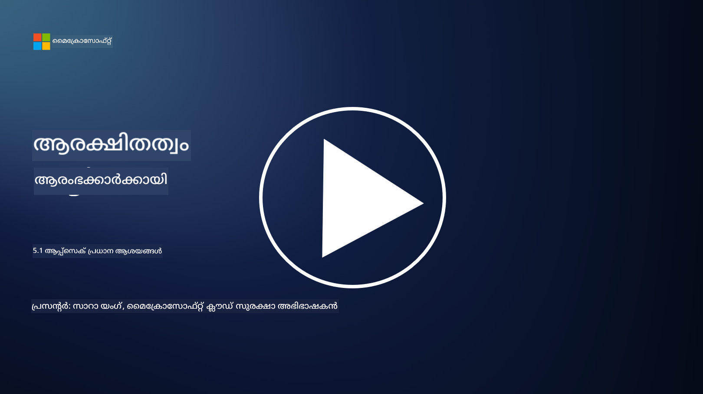

<!--
CO_OP_TRANSLATOR_METADATA:
{
  "original_hash": "e4b56bb23078d3ffb7ad407d280b0c36",
  "translation_date": "2025-12-19T13:00:39+00:00",
  "source_file": "5.1 AppSec key concepts.md",
  "language_code": "ml"
}
-->
# ആപ്പ് സെക്യൂരിറ്റി പ്രധാന ആശയങ്ങൾ

ആപ്ലിക്കേഷൻ സുരക്ഷ സ്വതന്ത്രമായ ഒരു സുരക്ഷാ വിദഗ്ദ്ധതയാണ്. ഈ പാഠത്തിന്റെ ഭാഗത്ത്, ആപ്ലിക്കേഷൻ സുരക്ഷയെ കുറിച്ച് കൂടുതൽ പഠിക്കാം.

## പരിചയം

ഈ പാഠത്തിൽ, നാം ചർച്ച ചെയ്യുന്നത്:

- ആപ്ലിക്കേഷൻ സുരക്ഷ എന്താണ്?

- ആപ്ലിക്കേഷൻ സുരക്ഷയുടെ പ്രധാന ആശയങ്ങൾ/തത്വങ്ങൾ എന്തൊക്കെയാണ്?

## ആപ്ലിക്കേഷൻ സുരക്ഷ എന്താണ്?

"ആപ്പ് സെക്യൂരിറ്റി" എന്നറിയപ്പെടുന്ന ആപ്ലിക്കേഷൻ സുരക്ഷ സോഫ്റ്റ്വെയർ ആപ്ലിക്കേഷനുകളെ സുരക്ഷാ ഭീഷണികളിൽ നിന്നും, ദുർബലതകളിൽ നിന്നും, ആക്രമണങ്ങളിൽ നിന്നും സംരക്ഷിക്കുന്ന പ്രക്രിയയാണ്. ഇത് ആപ്ലിക്കേഷന്റെ വികസനം, വിന്യാസം, പരിപാലനം എന്നിവയുടെ ജീവിതചക്രത്തിൽ സുരക്ഷാ അപകടസാധ്യതകൾ തിരിച്ചറിയാനും, കുറയ്ക്കാനും, തടയാനും ഉപയോഗിക്കുന്ന പ്രക്രിയകൾ, സാങ്കേതിക വിദ്യകൾ, ഉപകരണങ്ങൾ എന്നിവ ഉൾക്കൊള്ളുന്നു.

ആപ്ലിക്കേഷൻ സുരക്ഷ അത്യന്താപേക്ഷിതമാണ്, കാരണം ആപ്ലിക്കേഷനുകൾ സൈബർ ആക്രമണങ്ങൾക്ക് സാധാരണ ലക്ഷ്യങ്ങളാണ്. ദുർബലതകളും വീക്കനസുകളും ഉപയോഗിച്ച് ദുഷ്ട പ്രവർത്തകർ അനധികൃതമായി ആക്സസ് നേടാനും, ഡാറ്റ മോഷ്ടിക്കാനും, സേവനങ്ങൾ തടസ്സപ്പെടുത്താനും, മറ്റ് ദുഷ്ട പ്രവർത്തനങ്ങൾ നടത്താനും ശ്രമിക്കുന്നു. ഫലപ്രദമായ ആപ്ലിക്കേഷൻ സുരക്ഷ ഒരു ആപ്ലിക്കേഷനും അതുമായി ബന്ധപ്പെട്ട ഡാറ്റയും രഹസ്യമായും, അഖണ്ഡമായും, ലഭ്യമായും നിലനിൽക്കുന്നത് ഉറപ്പാക്കുന്നു.

## ആപ്ലിക്കേഷൻ സുരക്ഷയുടെ പ്രധാന ആശയങ്ങൾ/തത്വങ്ങൾ എന്തൊക്കെയാണ്?

ആപ്ലിക്കേഷൻ സുരക്ഷയുടെ അടിസ്ഥാന ആശയങ്ങളും തത്വങ്ങളും ഉൾക്കൊള്ളുന്നു:

1. **ഡിസൈൻ മുതൽ സുരക്ഷ**:

- സുരക്ഷ ആപ്ലിക്കേഷന്റെ രൂപകൽപ്പനയിലും ആർക്കിടെക്ചറിലും തുടക്കത്തിൽ തന്നെ ഉൾപ്പെടുത്തണം, പിന്നീട് ചേർക്കുന്നത് ഒഴിവാക്കണം.

2. **ഇൻപുട്ട് വാലിഡേഷൻ**:

- എല്ലാ ഉപയോക്തൃ ഇൻപുട്ടുകളും പ്രതീക്ഷിക്കുന്ന ഫോർമാറ്റുകൾക്ക് അനുസരിച്ചുള്ളതാണോ എന്ന് ഉറപ്പാക്കുകയും, ദുഷ്ട കോഡോ ഡാറ്റയോ ഇല്ലാതാക്കുകയും വേണം.

3. **ഔട്ട്പുട്ട് എൻകോഡിംഗ്**:

- ക്ലയന്റിലേക്ക് അയക്കുന്ന ഡാറ്റ ശരിയായി എൻകോഡ് ചെയ്യണം, ക്രോസ്-സൈറ്റ് സ്ക്രിപ്റ്റിംഗ് (XSS) പോലുള്ള ദുർബലതകൾ ഒഴിവാക്കാൻ.

4. **ഓതന്റിക്കേഷൻ, ഓതറൈസേഷൻ**:

- ഉപയോക്താക്കളെ ഓതന്റിക്കേറ്റ് ചെയ്യുകയും, അവരുടെ റോളുകൾക്കും അനുമതികൾക്കും അനുസരിച്ച് റിസോഴ്സുകളിലേക്ക് ആക്സസ് അനുവദിക്കുകയും വേണം.

5. **ഡാറ്റ സംരക്ഷണം**:

- സംവേദനാത്മക ഡാറ്റ സംഭരിക്കുമ്പോഴും, പ്രക്ഷേപണം ചെയ്യുമ്പോഴും, പ്രോസസ്സ് ചെയ്യുമ്പോഴും എൻക്രിപ്റ്റ് ചെയ്യണം, അനധികൃത ആക്സസ് തടയാൻ.

6. **സെഷൻ മാനേജ്മെന്റ്**:

- സുരക്ഷിതമായ സെഷൻ മാനേജ്മെന്റ് ഉപയോക്തൃ സെഷനുകൾ ഹിജാക്കിംഗ്, അനധികൃത ആക്സസ് എന്നിവയിൽ നിന്ന് സംരക്ഷിക്കുന്നു.

7. **സുരക്ഷിത ഡിപെൻഡൻസികൾ**:

- സോഫ്റ്റ്വെയർ ഡിപെൻഡൻസികൾ എല്ലാം സുരക്ഷാ പാച്ചുകളോടെ അപ്‌ഡേറ്റ് ചെയ്യണം, ദുർബലതകൾ ഒഴിവാക്കാൻ.

8. **എറർ ഹാൻഡ്ലിംഗ്, ലോഗിംഗ്**:

- സുരക്ഷിതമായ എറർ ഹാൻഡ്ലിംഗ് നടപ്പിലാക്കുക, സംവേദനാത്മക വിവരങ്ങൾ വെളിപ്പെടുത്തുന്നത് ഒഴിവാക്കുക, സുരക്ഷിതമായ ലോഗിംഗ് പ്രാക്ടീസുകൾ ഉറപ്പാക്കുക.

9. **സുരക്ഷാ ടെസ്റ്റിംഗ്**:

- പെനെട്രേഷൻ ടെസ്റ്റിംഗ്, കോഡ് റിവ്യൂ, ഓട്ടോമേറ്റഡ് സ്കാനിംഗ് ടൂളുകൾ എന്നിവ ഉപയോഗിച്ച് ആപ്ലിക്കേഷനുകൾക്ക് സ്ഥിരമായി സുരക്ഷാ പരിശോധന നടത്തുക.

10. **സുരക്ഷിത സോഫ്റ്റ്വെയർ ഡെവലപ്മെന്റ് ലൈഫ്സൈക്കിൾ (SDLC)**:

- സോഫ്റ്റ്വെയർ ഡെവലപ്മെന്റ് ലൈഫ്സൈക്കിളിന്റെ എല്ലാ ഘട്ടങ്ങളിലും, ആവശ്യകതകളിൽ നിന്ന് വിന്യാസം, പരിപാലനം വരെ, സുരക്ഷാ പ്രാക്ടീസുകൾ ഉൾപ്പെടുത്തുക.

## കൂടുതൽ വായനയ്ക്ക്

- [SheHacksPurple: What is Application Security? - YouTube](https://www.youtube.com/watch?v=eNmccQNzSSY)  
- [What Is Application Security? - Cisco](https://www.cisco.com/c/en/us/solutions/security/application-first-security/what-is-application-security.html#~how-does-it-work)  
- [What is application security? A process and tools for securing software | CSO Online](https://www.csoonline.com/article/566471/what-is-application-security-a-process-and-tools-for-securing-software.html)  
- [OWASP Cheat Sheet Series | OWASP Foundation](https://owasp.org/www-project-cheat-sheets/)  

---

<!-- CO-OP TRANSLATOR DISCLAIMER START -->
**അറിയിപ്പ്**:  
ഈ രേഖ AI പരിഭാഷാ സേവനം [Co-op Translator](https://github.com/Azure/co-op-translator) ഉപയോഗിച്ച് പരിഭാഷപ്പെടുത്തിയതാണ്. ഞങ്ങൾ കൃത്യതയ്ക്കായി ശ്രമിക്കുന്നുവെങ്കിലും, ഓട്ടോമേറ്റഡ് പരിഭാഷകളിൽ പിഴവുകൾ അല്ലെങ്കിൽ തെറ്റായ വിവരങ്ങൾ ഉണ്ടാകാൻ സാധ്യതയുണ്ട്. അതിന്റെ സ്വാഭാവിക ഭാഷയിലുള്ള അസൽ രേഖയാണ് പ്രാമാണികമായ ഉറവിടമായി പരിഗണിക്കേണ്ടത്. നിർണായകമായ വിവരങ്ങൾക്ക്, പ്രൊഫഷണൽ മനുഷ്യ പരിഭാഷ ശുപാർശ ചെയ്യുന്നു. ഈ പരിഭാഷ ഉപയോഗിച്ച് ഉണ്ടാകുന്ന തെറ്റിദ്ധാരണകൾ അല്ലെങ്കിൽ തെറ്റായ വ്യാഖ്യാനങ്ങൾക്കായി ഞങ്ങൾ ഉത്തരവാദികളല്ല.
<!-- CO-OP TRANSLATOR DISCLAIMER END -->