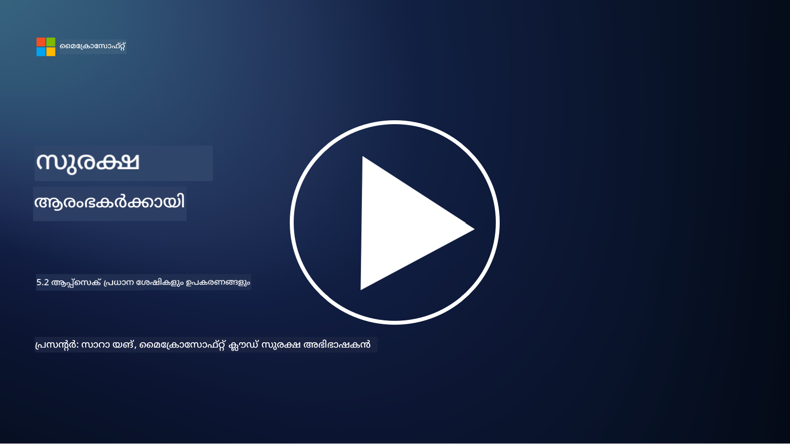

<!--
CO_OP_TRANSLATOR_METADATA:
{
  "original_hash": "790a3fa7e535ec60bb51bde13e759781",
  "translation_date": "2025-12-19T13:39:29+00:00",
  "source_file": "5.2 AppSec key capabilities.md",
  "language_code": "ml"
}
-->
ഈ വിഭാഗത്തിൽ, ആപ്ലിക്കേഷൻ സുരക്ഷയിൽ ഉപയോഗിക്കുന്ന പ്രധാന ഉപകരണങ്ങളും കഴിവുകളും സംബന്ധിച്ച കൂടുതൽ വിശദാംശങ്ങൾ നമുക്ക് പരിശോധിക്കാം:

## പരിചയം

ഈ പാഠത്തിൽ, ആപ്ലിക്കേഷൻ സുരക്ഷയിൽ ഉപയോഗിക്കുന്ന പ്രധാന കഴിവുകളും ഉപകരണങ്ങളും എന്തൊക്കെയാണെന്ന് നമുക്ക് പഠിക്കാം.

## ആപ്ലിക്കേഷൻ സുരക്ഷയുടെ പ്രധാന കഴിവുകളും ഉപകരണങ്ങളും

സോഫ്റ്റ്വെയർ ആപ്ലിക്കേഷനുകളിൽ സുരക്ഷാ ദൗർബല്യങ്ങളും ഭീഷണികളും തിരിച്ചറിയാനും കുറയ്ക്കാനും തടയാനും ആപ്ലിക്കേഷൻ സുരക്ഷയിൽ ഉപയോഗിക്കുന്ന പ്രധാന കഴിവുകളും ഉപകരണങ്ങളും അനിവാര്യമാണ്. ഇവയിൽ ചിലത് താഴെപ്പറയുന്നവയാണ്:

**1. സ്റ്റാറ്റിക് ആപ്ലിക്കേഷൻ സെക്യൂരിറ്റി ടെസ്റ്റിംഗ് (SAST):**

- **കഴിവുകൾ**: ആപ്ലിക്കേഷന്റെ കോഡ്ബേസിൽ സുരക്ഷാ ദൗർബല്യങ്ങൾ കണ്ടെത്താൻ സോഴ്‌സ് കോഡ്, ബൈറ്റ് കോഡ്, അല്ലെങ്കിൽ ബൈനറി കോഡ് വിശകലനം ചെയ്യുന്നു.

- **ഉപകരണങ്ങൾ**: ഉദാഹരണങ്ങൾ: Fortify, Checkmarx, Veracode.

**2. ഡൈനാമിക് ആപ്ലിക്കേഷൻ സെക്യൂരിറ്റി ടെസ്റ്റിംഗ് (DAST):**

- **കഴിവുകൾ**: പ്രവർത്തനക്ഷമമായ ആപ്ലിക്കേഷൻ സ്കാൻ ചെയ്ത്, ഇൻപുട്ട് അഭ്യർത്ഥനകൾ അയച്ച് പ്രതികരണങ്ങൾ വിശകലനം ചെയ്യുന്നതിലൂടെ ദൗർബല്യങ്ങൾ കണ്ടെത്തുന്നു.

- **ഉപകരണങ്ങൾ**: ഉദാഹരണങ്ങൾ: ZAP, Burp Suite, Qualys Web Application Scanning.

**3. ഇന്ററാക്ടീവ് ആപ്ലിക്കേഷൻ സെക്യൂരിറ്റി ടെസ്റ്റിംഗ് (IAST):**

- **കഴിവുകൾ**: SAST, DAST ഘടകങ്ങൾ സംയോജിപ്പിച്ച് റൺടൈമിൽ കോഡ് വിശകലനം ചെയ്യുന്നു, കൂടുതൽ കൃത്യമായ ഫലങ്ങൾ നൽകുകയും തെറ്റായ പോസിറ്റീവുകൾ കുറയ്ക്കുകയും ചെയ്യുന്നു.

- **ഉപകരണങ്ങൾ**: ഉദാഹരണങ്ങൾ: Contrast Security, HCL AppScan.

**4. റൺടൈം ആപ്ലിക്കേഷൻ സെൽഫ്-പ്രൊട്ടക്ഷൻ (RASP):**

- **കഴിവുകൾ**: റിയൽ-ടൈമിൽ ആപ്ലിക്കേഷനുകൾ നിരീക്ഷിക്കുകയും സുരക്ഷാ ഭീഷണികൾ സംഭവിക്കുമ്പോൾ പ്രതികരിക്കുകയും ചെയ്യുന്നു.

- **ഉപകരണങ്ങൾ**: ഉദാഹരണങ്ങൾ: Veracode Runtime Protection, F5 Advanced WAF with RASP.

**5. വെബ് ആപ്ലിക്കേഷൻ ഫയർവാളുകൾ (WAFs):**

- **കഴിവുകൾ**: ആപ്ലിക്കേഷനും ഇന്റർനെറ്റിനും ഇടയിൽ സംരക്ഷണ പാളി നൽകുന്നു, വരുന്ന ട്രാഫിക് ഫിൽട്ടർ ചെയ്യുകയും ദുഷ്ട അഭ്യർത്ഥനകൾ തടയുകയും ചെയ്യുന്നു.

- **ഉപകരണങ്ങൾ**: ഉദാഹരണങ്ങൾ: ModSecurity, AWS WAF, Akamai Kona Site Defender.

**6. ഡിപെൻഡൻസി സ്കാനിംഗ്:**

- **കഴിവുകൾ**: ആപ്ലിക്കേഷനിൽ ഉപയോഗിക്കുന്ന മൂന്നാം കക്ഷി ലൈബ്രറികളിലും ഘടകങ്ങളിലും ദൗർബല്യങ്ങൾ കണ്ടെത്തുന്നു.

- **ഉപകരണങ്ങൾ**: ഉദാഹരണങ്ങൾ: OWASP Dependency-Check, Snyk.

**7. പെനെട്രേഷൻ ടെസ്റ്റിംഗ് (പെൻ ടെസ്റ്റിംഗ്):**

- **കഴിവുകൾ**: യഥാർത്ഥ ലോക ആക്രമണങ്ങൾ അനുകരിച്ച് ദൗർബല്യങ്ങൾ കണ്ടെത്തുകയും ആപ്ലിക്കേഷന്റെ സുരക്ഷ വിലയിരുത്തുകയും ചെയ്യുന്നു.

- **ഉപകരണങ്ങൾ**: Metasploit, Nmap പോലുള്ള ഉപകരണങ്ങൾ ഉപയോഗിച്ച് സർട്ടിഫൈഡ് എഥിക്കൽ ഹാക്കർമാരും സുരക്ഷാ വിദഗ്ധരും നടത്തുന്നു.

**8. സുരക്ഷാ സ്കാനിംഗ്, വിശകലനം:**

- **കഴിവുകൾ**: അറിയപ്പെടുന്ന ദൗർബല്യങ്ങൾ, കോൺഫിഗറേഷൻ പിഴവുകൾ, സുരക്ഷാ തെറ്റായ ക്രമീകരണങ്ങൾ സ്കാൻ ചെയ്യുന്നു.

- **ഉപകരണങ്ങൾ**: ഉദാഹരണങ്ങൾ: Nessus, Qualys Vulnerability Management, OpenVAS.

**9. കണ്ടെയ്‌നർ സുരക്ഷാ ഉപകരണങ്ങൾ:**

- **കഴിവുകൾ**: കണ്ടെയ്‌നർ ആപ്ലിക്കേഷനുകളും അവയുടെ പരിസ്ഥിതികളും സുരക്ഷിതമാക്കുന്നതിൽ ശ്രദ്ധ കേന്ദ്രീകരിക്കുന്നു.

- **ഉപകരണങ്ങൾ**: ഉദാഹരണങ്ങൾ: Docker Security Scanning, Aqua Security.

**10. സുരക്ഷിത വികസന പരിശീലനം:**

- **കഴിവുകൾ**: വികസന ടീമുകൾക്ക് സുരക്ഷിത കോഡിംഗ് പ്രാക്ടീസുകൾ പ്രോത്സാഹിപ്പിക്കുന്ന പരിശീലനവും അവബോധ പരിപാടികളും നൽകുന്നു.

- **ഉപകരണങ്ങൾ**: ഇഷ്ടാനുസൃത പരിശീലന പരിപാടികളും പ്ലാറ്റ്ഫോമുകളും.

**11. സുരക്ഷാ ടെസ്റ്റിംഗ് ഫ്രെയിംവർക്കുകൾ:**

- **കഴിവുകൾ**: വിവിധ ആപ്ലിക്കേഷൻ സുരക്ഷാ ടെസ്റ്റിംഗ് ആവശ്യങ്ങൾക്കായി സമഗ്രമായ ടെസ്റ്റിംഗ് ഫ്രെയിംവർക്കുകൾ നൽകുന്നു.

- **ഉപകരണങ്ങൾ**: OWASP Amass, OWASP OWTF, FrAppSec.

**12. സുരക്ഷിത കോഡ് റിവ്യൂ ഉപകരണങ്ങൾ:**

- **കഴിവുകൾ**: സോഴ്‌സ് കോഡ് സുരക്ഷാ ദൗർബല്യങ്ങൾക്കും കോഡിംഗ് മികച്ച രീതികൾക്കും വേണ്ടി പരിശോധിക്കുന്നു.

- **ഉപകരണങ്ങൾ**: ഉദാഹരണങ്ങൾ: SonarQube, Checkmarx.

**13. സുരക്ഷിത APIകളും മൈക്രോസർവീസുകളും:**

- **കഴിവുകൾ**: APIകളും മൈക്രോസർവീസുകളും സുരക്ഷിതമാക്കുന്നതിൽ ശ്രദ്ധ കേന്ദ്രീകരിക്കുന്നു, അതിൽ ഓതന്റിക്കേഷൻ, ഓതറൈസേഷൻ, ഡാറ്റ സംരക്ഷണം എന്നിവ ഉൾപ്പെടുന്നു.

- **ഉപകരണങ്ങൾ**: ഉദാഹരണങ്ങൾ: Apigee, AWS API Gateway, Istio.

## കൂടുതൽ വായനയ്ക്ക്

- [What Is Application Security? Concepts, Tools & Best Practices | HackerOne](https://www.hackerone.com/knowledge-center/what-application-security-concepts-tools-best-practices)
- [What is IAST? (Interactive Application Security Testing) (comparitech.com)](https://www.comparitech.com/net-admin/what-is-iast/)
- [10 Types of Application Security Testing Tools: When and How to Use Them (cmu.edu)](https://insights.sei.cmu.edu/blog/10-types-of-application-security-testing-tools-when-and-how-to-use-them/)
- [Shifting the Balance of Cybersecurity Risk: Principles and Approaches for Security-by-Design and Default | Cyber.gov.au](https://www.cyber.gov.au/about-us/view-all-content/publications/principles-and-approaches-for-security-by-design-and-default)

---

<!-- CO-OP TRANSLATOR DISCLAIMER START -->
**അസത്യവാദം**:  
ഈ രേഖ AI വിവർത്തന സേവനമായ [Co-op Translator](https://github.com/Azure/co-op-translator) ഉപയോഗിച്ച് വിവർത്തനം ചെയ്തതാണ്. കൃത്യതയ്ക്കായി ഞങ്ങൾ ശ്രമിക്കുന്നുവെങ്കിലും, ഓട്ടോമേറ്റഡ് വിവർത്തനങ്ങളിൽ പിശകുകൾ അല്ലെങ്കിൽ തെറ്റായ വിവരങ്ങൾ ഉണ്ടാകാൻ സാധ്യതയുണ്ട്. അതിന്റെ സ്വാഭാവിക ഭാഷയിലുള്ള മൗലിക രേഖ പ്രാമാണികമായ ഉറവിടമായി കണക്കാക്കണം. നിർണായകമായ വിവരങ്ങൾക്ക്, പ്രൊഫഷണൽ മനുഷ്യ വിവർത്തനം ശുപാർശ ചെയ്യുന്നു. ഈ വിവർത്തനം ഉപയോഗിക്കുന്നതിൽ നിന്നുണ്ടാകുന്ന തെറ്റിദ്ധാരണകൾക്കോ തെറ്റായ വ്യാഖ്യാനങ്ങൾക്കോ ഞങ്ങൾ ഉത്തരവാദികളല്ല.
<!-- CO-OP TRANSLATOR DISCLAIMER END -->