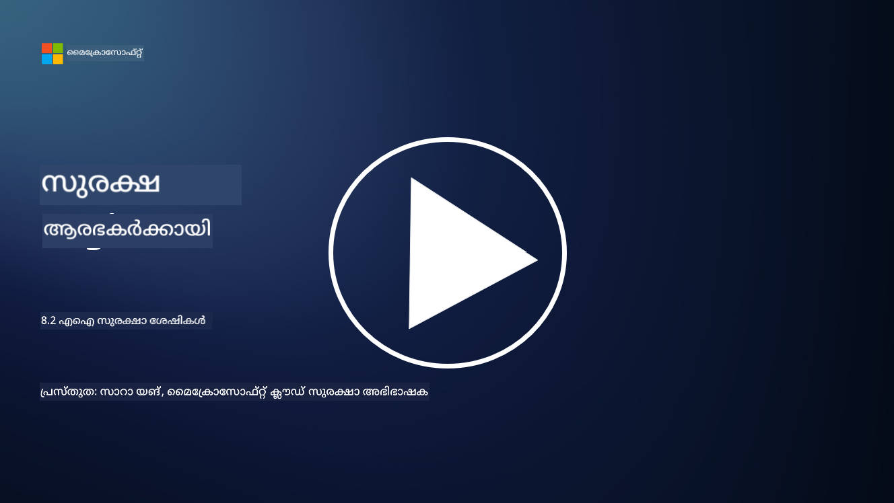

<!--
CO_OP_TRANSLATOR_METADATA:
{
  "original_hash": "b6bb7175672298d1e2f73ba7e0006f95",
  "translation_date": "2025-12-19T13:25:29+00:00",
  "source_file": "8.2 AI security capabilities.md",
  "language_code": "ml"
}
-->
# AI സുരക്ഷാ ശേഷികൾ

## നിലവിൽ AI സിസ്റ്റങ്ങൾ സുരക്ഷിതമാക്കാൻ എന്തെല്ലാം ഉപകരണങ്ങളും ശേഷികളും ഉണ്ട്?

നിലവിൽ AI സിസ്റ്റങ്ങൾ സുരക്ഷിതമാക്കാൻ നിരവധി ഉപകരണങ്ങളും ശേഷികളും ലഭ്യമാണ്:

-   **Counterfit**: AI സിസ്റ്റങ്ങളുടെ സുരക്ഷാ പരിശോധനയ്ക്കുള്ള ഓപ്പൺ-സോഴ്‌സ് ഓട്ടോമേഷൻ ഉപകരണം. ഇത് സംഘടനകൾക്ക് AI സുരക്ഷാ റിസ്ക് വിലയിരുത്തലുകൾ നടത്താനും അവരുടെ ആൽഗോരിതങ്ങൾ ശക്തമാക്കാനും സഹായിക്കുന്നു.
-   **Adversarial Machine Learning Tools**: ഈ ഉപകരണങ്ങൾ മെഷീൻ ലേണിംഗ് മോഡലുകളുടെ ശക്തി എതിരാളി ആക്രമണങ്ങൾക്കെതിരെ വിലയിരുത്തുകയും ദുർബലതകൾ കണ്ടെത്തി പരിഹരിക്കുകയും ചെയ്യുന്നു.
-   **AI Security Toolkits**: AI സിസ്റ്റങ്ങൾ സുരക്ഷിതമാക്കാൻ സഹായിക്കുന്ന ലൈബ്രറികളും ഫ്രെയിംവർക്കുകളും ഉൾപ്പെടുന്ന ഓപ്പൺ-സോഴ്‌സ് ടൂൾകിറ്റുകൾ ലഭ്യമാണ്.
-   **Collaborative Platforms**: AI സപ്ലൈ ചെയിൻ സുരക്ഷിതമാക്കാൻ AI-നിർദ്ദിഷ്ട സുരക്ഷാ സ്കാനറുകളും മറ്റ് ഉപകരണങ്ങളും വികസിപ്പിക്കാൻ കമ്പനികളും AI സമൂഹങ്ങളും തമ്മിലുള്ള പങ്കാളിത്തങ്ങൾ.

AI സിസ്റ്റങ്ങൾ വിവിധ ഭീഷണികളിൽ നിന്ന് സുരക്ഷിതമാക്കാൻ ഉദ്ദേശിച്ചുള്ള വളരുന്ന മേഖലയാണ് ഈ ഉപകരണങ്ങളും ശേഷികളും. AI സാങ്കേതികവിദ്യകൾ സൃഷ്ടിക്കുന്ന പ്രത്യേക വെല്ലുവിളികൾ നേരിടാൻ ഉദ്ദേശിച്ചുള്ള ഗവേഷണം, പ്രായോഗിക ഉപകരണങ്ങൾ, വ്യവസായ സഹകരണം എന്നിവയുടെ സംയോജിത രൂപമാണ് ഇവ.

## AI റെഡ് ടീമിംഗ് എന്താണ്? ഇത് പരമ്പരാഗത സുരക്ഷാ റെഡ് ടീമിംഗിൽ നിന്ന് എങ്ങനെ വ്യത്യസ്തമാണ്?

AI റെഡ് ടീമിംഗ് പരമ്പരാഗത സുരക്ഷാ റെഡ് ടീമിംഗിൽ നിന്ന് ചില പ്രധാന വശങ്ങളിൽ വ്യത്യസ്തമാണ്:

-   **AI സിസ്റ്റങ്ങൾക്കുള്ള ശ്രദ്ധ**: AI റെഡ് ടീമിംഗ് പ്രത്യേകമായി AI സിസ്റ്റങ്ങളുടെ ദുർബലതകളെ ലക്ഷ്യമിടുന്നു, ഉദാഹരണത്തിന് മെഷീൻ ലേണിംഗ് മോഡലുകളും ഡാറ്റ പൈപ്പ്‌ലൈനുകളും, പരമ്പരാഗത IT ഇൻഫ്രാസ്ട്രക്ചറിനേക്കാൾ വ്യത്യസ്തമായി.
-   **AI പെരുമാറ്റം പരിശോധിക്കൽ**: AI സിസ്റ്റങ്ങൾ അസാധാരണമായ അല്ലെങ്കിൽ പ്രതീക്ഷിക്കാത്ത ഇൻപുട്ടുകൾക്ക് എങ്ങനെ പ്രതികരിക്കുന്നു എന്ന് പരിശോധിക്കുന്നതിൽ ഇത് ഉൾപ്പെടുന്നു, ഇത് ആക്രമികൾ ഉപയോഗപ്പെടുത്താവുന്ന ദുർബലതകൾ വെളിപ്പെടുത്തുന്നു.
-   **AI പരാജയങ്ങൾ പരിശോധിക്കൽ**: AI റെഡ് ടീമിംഗ് ദുഷ്ടവും നിഷ്കളങ്കവുമായ പരാജയങ്ങൾ പരിശോധിക്കുന്നു, സുരക്ഷാ ലംഘനങ്ങൾക്കു മാത്രമല്ല, വ്യത്യസ്ത വ്യക്തിത്വങ്ങളും സിസ്റ്റം പരാജയങ്ങളും പരിഗണിക്കുന്നു.
-   **പ്രോംപ്റ്റ് ഇൻജക്ഷൻ, ഉള്ളടക്കം സൃഷ്ടിക്കൽ**: AI റെഡ് ടീമിംഗ് പ്രോംപ്റ്റ് ഇൻജക്ഷൻ പോലുള്ള പരാജയങ്ങൾക്കുള്ള പരിശോധനയും ഉൾപ്പെടുന്നു, അതിൽ ആക്രമികൾ AI സിസ്റ്റങ്ങളെ ഹാനികരമായ അല്ലെങ്കിൽ അടിസ്ഥാനമില്ലാത്ത ഉള്ളടക്കം സൃഷ്ടിക്കാൻ പ്രേരിപ്പിക്കുന്നു.
-   **നൈതികവും ഉത്തരവാദിത്വമുള്ള AI**: AI സിസ്റ്റങ്ങൾ അവശതയില്ലാതെ പ്രവർത്തിക്കുമെന്ന് ഉറപ്പാക്കുന്ന ഉത്തരവാദിത്വമുള്ള AI രൂപകൽപ്പനയുടെ ഭാഗമാണ് ഇത്.

മൊത്തത്തിൽ, AI റെഡ് ടീമിംഗ് സുരക്ഷാ ദുർബലതകൾക്കുള്ള പരിശോധന മാത്രമല്ല, AI സാങ്കേതികവിദ്യകൾക്ക് പ്രത്യേകമായ മറ്റ് സിസ്റ്റം പരാജയങ്ങൾക്കുള്ള പരിശോധനയും ഉൾക്കൊള്ളുന്ന വിപുലമായ പ്രാക്ടീസാണ്. AI വിനിയോഗവുമായി ബന്ധപ്പെട്ട പുതിയ അപകടങ്ങൾ മനസ്സിലാക്കുകയും പരിഹരിക്കുകയും ചെയ്യുന്നതിലൂടെ സുരക്ഷിതമായ AI സിസ്റ്റങ്ങൾ വികസിപ്പിക്കുന്നതിന്റെ നിർണായക ഭാഗമാണ് ഇത്.

## കൂടുതൽ വായന

 - [Microsoft AI Red Team building future of safer AI | Microsoft Security Blog](https://www.microsoft.com/en-us/security/blog/2023/08/07/microsoft-ai-red-team-building-future-of-safer-ai/?WT.mc_id=academic-96948-sayoung)
 - [Announcing Microsoft’s open automation framework to red team generative AI Systems | Microsoft Security Blog](https://www.microsoft.com/en-us/security/blog/2024/02/22/announcing-microsofts-open-automation-framework-to-red-team-generative-ai-systems/?WT.mc_id=academic-96948-sayoung)
 - [AI Security Tools: The Open-Source Toolkit | Wiz](https://www.wiz.io/academy/ai-security-tools)

---

<!-- CO-OP TRANSLATOR DISCLAIMER START -->
**അസത്യവാദം**:  
ഈ രേഖ AI വിവർത്തന സേവനമായ [Co-op Translator](https://github.com/Azure/co-op-translator) ഉപയോഗിച്ച് വിവർത്തനം ചെയ്തതാണ്. കൃത്യതയ്ക്കായി ഞങ്ങൾ ശ്രമിക്കുന്നുവെങ്കിലും, ഓട്ടോമേറ്റഡ് വിവർത്തനങ്ങളിൽ പിശകുകൾ അല്ലെങ്കിൽ തെറ്റായ വിവരങ്ങൾ ഉണ്ടാകാൻ സാധ്യതയുണ്ട്. അതിന്റെ സ്വാഭാവിക ഭാഷയിലുള്ള മൗലിക രേഖ പ്രാമാണികമായ ഉറവിടമായി കണക്കാക്കണം. നിർണായകമായ വിവരങ്ങൾക്ക്, പ്രൊഫഷണൽ മനുഷ്യ വിവർത്തനം ശുപാർശ ചെയ്യുന്നു. ഈ വിവർത്തനം ഉപയോഗിക്കുന്നതിൽ നിന്നുണ്ടാകുന്ന തെറ്റിദ്ധാരണകൾക്കോ തെറ്റായ വ്യാഖ്യാനങ്ങൾക്കോ ഞങ്ങൾ ഉത്തരവാദികളല്ല.
<!-- CO-OP TRANSLATOR DISCLAIMER END -->