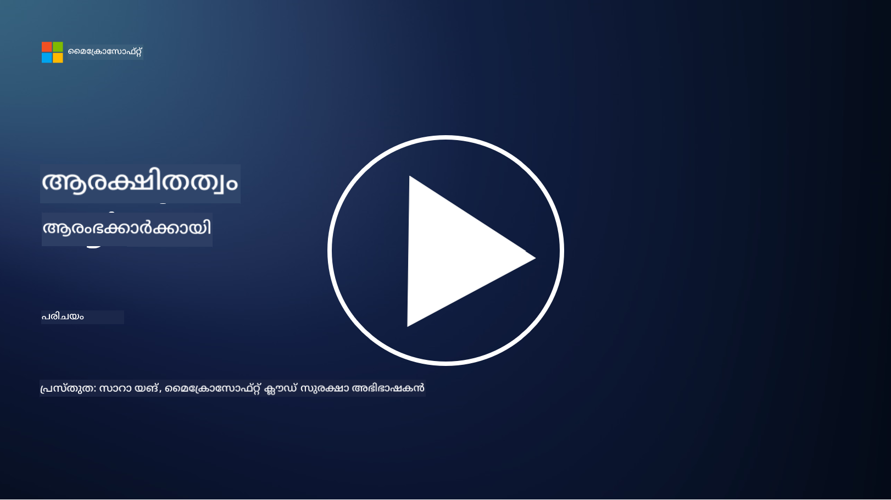

<!--
CO_OP_TRANSLATOR_METADATA:
{
  "original_hash": "7d957a4948cfe27c91ec137f6a6e2988",
  "translation_date": "2025-12-19T12:51:19+00:00",
  "source_file": "README.md",
  "language_code": "ml"
}
-->

### 🌐 ബഹുഭാഷാ പിന്തുണ

#### GitHub Action വഴി പിന്തുണ (സ്വയമേവ പ്രവർത്തിക്കുന്നതും എപ്പോഴും പുതുക്കിയതും)

<!-- CO-OP TRANSLATOR LANGUAGES TABLE START -->
[Arabic](../ar/README.md) | [Bengali](../bn/README.md) | [Bulgarian](../bg/README.md) | [Burmese (Myanmar)](../my/README.md) | [Chinese (Simplified)](../zh/README.md) | [Chinese (Traditional, Hong Kong)](../hk/README.md) | [Chinese (Traditional, Macau)](../mo/README.md) | [Chinese (Traditional, Taiwan)](../tw/README.md) | [Croatian](../hr/README.md) | [Czech](../cs/README.md) | [Danish](../da/README.md) | [Dutch](../nl/README.md) | [Estonian](../et/README.md) | [Finnish](../fi/README.md) | [French](../fr/README.md) | [German](../de/README.md) | [Greek](../el/README.md) | [Hebrew](../he/README.md) | [Hindi](../hi/README.md) | [Hungarian](../hu/README.md) | [Indonesian](../id/README.md) | [Italian](../it/README.md) | [Japanese](../ja/README.md) | [Kannada](../kn/README.md) | [Korean](../ko/README.md) | [Lithuanian](../lt/README.md) | [Malay](../ms/README.md) | [Malayalam](./README.md) | [Marathi](../mr/README.md) | [Nepali](../ne/README.md) | [Nigerian Pidgin](../pcm/README.md) | [Norwegian](../no/README.md) | [Persian (Farsi)](../fa/README.md) | [Polish](../pl/README.md) | [Portuguese (Brazil)](../br/README.md) | [Portuguese (Portugal)](../pt/README.md) | [Punjabi (Gurmukhi)](../pa/README.md) | [Romanian](../ro/README.md) | [Russian](../ru/README.md) | [Serbian (Cyrillic)](../sr/README.md) | [Slovak](../sk/README.md) | [Slovenian](../sl/README.md) | [Spanish](../es/README.md) | [Swahili](../sw/README.md) | [Swedish](../sv/README.md) | [Tagalog (Filipino)](../tl/README.md) | [Tamil](../ta/README.md) | [Telugu](../te/README.md) | [Thai](../th/README.md) | [Turkish](../tr/README.md) | [Ukrainian](../uk/README.md) | [Urdu](../ur/README.md) | [Vietnamese](../vi/README.md)
<!-- CO-OP TRANSLATOR LANGUAGES TABLE END -->

**നിങ്ങൾക്ക് കൂടുതൽ ഭാഷാ പരിഭാഷകൾ ആവശ്യമുണ്ടെങ്കിൽ, [ഇവിടെ](https://github.com/Azure/co-op-translator/blob/main/getting_started/supported-languages.md) ലിസ്റ്റ് ചെയ്തിട്ടുണ്ട്.**

#### ഞങ്ങളുടെ കമ്മ്യൂണിറ്റിയിൽ ചേരുക 

# 🚀 തുടക്കക്കാർക്കുള്ള സൈബർസെക്യൂരിറ്റി – ഒരു പാഠ്യപദ്ധതി

AI സാങ്കേതികവിദ്യയുടെ ദ്രുതഗതിയിലുള്ള ദത്തെടുക്കൽ കാലഘട്ടത്തിൽ, IT സിസ്റ്റങ്ങൾ സുരക്ഷിതമാക്കുന്നത് എങ്ങനെ എന്നത് മനസ്സിലാക്കുന്നത് അത്യന്താപേക്ഷിതമാണ്. നിങ്ങളുടെ സുരക്ഷാ പഠനം ആരംഭിക്കാൻ അടിസ്ഥാന സൈബർസെക്യൂരിറ്റി ആശയങ്ങൾ പഠിപ്പിക്കാൻ ഈ കോഴ്സ് രൂപകൽപ്പന ചെയ്തിരിക്കുന്നു. ഇത് വിൽപ്പനക്കാരനുമായി ബന്ധമില്ലാത്തതാണ്, കൂടാതെ 30-60 മിനിറ്റ് കൊണ്ട് പൂർത്തിയാക്കാവുന്ന ചെറിയ പാഠങ്ങളായി വിഭജിച്ചിരിക്കുന്നു. ഓരോ പാഠത്തിനും ചെറിയ ക്വിസ് ഉണ്ട്, കൂടാതെ വിഷയം കൂടുതൽ ആഴത്തിൽ പഠിക്കാൻ താൽപ്പര്യമുണ്ടെങ്കിൽ കൂടുതൽ വായനയ്ക്കുള്ള ലിങ്കുകളും ഉണ്ട്.

ഈ കോഴ്സ് എന്താണ് ഉൾക്കൊള്ളുന്നത് 📚

- 🔐 CIA ത്രയാംശം പോലുള്ള അടിസ്ഥാന സൈബർസെക്യൂരിറ്റി ആശയങ്ങൾ, റിസ്ക്, ത്രെറ്റുകൾ എന്നിവയുടെ വ്യത്യാസങ്ങൾ.
- 🛡️ സുരക്ഷാ നിയന്ത്രണങ്ങൾ എന്താണെന്ന്, അവ എങ്ങനെ രൂപംകൊള്ളുന്നു എന്ന് മനസ്സിലാക്കുക.
- 🌐 സീറോ ട്രസ്റ്റ് എന്താണെന്ന്, ആധുനിക സൈബർസെക്യൂരിറ്റിയിൽ ഇത് എന്തുകൊണ്ട് പ്രധാനമാണെന്ന് മനസ്സിലാക്കുക.
- 🔑 ഐഡന്റിറ്റി, നെറ്റ്വർക്കിംഗ്, സെക്യൂരിറ്റി ഓപ്പറേഷൻസ്, ഇൻഫ്രാസ്ട്രക്ചർ, ഡാറ്റാ സെക്യൂരിറ്റി എന്നിവയുമായി ബന്ധപ്പെട്ട പ്രധാന ആശയങ്ങളും വിഷയങ്ങളും മനസ്സിലാക്കുക.
- 🔧 സുരക്ഷാ നിയന്ത്രണങ്ങൾ നടപ്പിലാക്കാൻ ഉപയോഗിക്കുന്ന ചില ഉപകരണങ്ങളുടെ ഉദാഹരണങ്ങൾ നൽകുക.

ഈ കോഴ്സ് എന്താണ് ഉൾക്കൊള്ളാത്തത് 🙅‍♂️

- 🚫 പ്രത്യേക സുരക്ഷാ ഉപകരണങ്ങൾ എങ്ങനെ ഉപയോഗിക്കാം എന്നത്.
- 🚫 "ഹാക്ക്" ചെയ്യുന്നത് അല്ലെങ്കിൽ റെഡ് ടീമിംഗ്/ഓഫൻസീവ് സെക്യൂരിറ്റി.
- 🚫 പ്രത്യേക അനുസരണ സ്റ്റാൻഡേർഡുകൾ പഠിക്കുന്നത്.

ഈ കോഴ്സ് പൂർത്തിയാക്കിയ ശേഷം, Microsoft Learn മോഡ്യൂളുകളിൽ ചിലതിലേക്ക് നീങ്ങാം. [Microsoft Security, Compliance, and Identity Fundamentals](https://learn.microsoft.com/training/paths/describe-concepts-of-security-compliance-identity/?WT.mc_id=academic-96948-sayoung) ഉപയോഗിച്ച് നിങ്ങളുടെ പഠനം തുടരാൻ ഞങ്ങൾ ശുപാർശ ചെയ്യുന്നു.

അവസാനമായി, [Exam SC-900: Microsoft Security, Compliance, and Identity Fundamentals exam](https://learn.microsoft.com/credentials/certifications/exams/sc-900/?WT.mc_id=academic-96948-sayoung) എഴുതാൻ പരിഗണിക്കാം.

> 💁 ഈ കോഴ്സിനെക്കുറിച്ചുള്ള നിങ്ങളുടെ അഭിപ്രായങ്ങൾ അല്ലെങ്കിൽ ഞങ്ങൾ നഷ്ടപ്പെടുത്തിയ ഉള്ളടക്കത്തെക്കുറിച്ചുള്ള നിർദ്ദേശങ്ങൾ ഉണ്ടെങ്കിൽ, ഞങ്ങൾ കേൾക്കാൻ ആഗ്രഹിക്കുന്നു!

## മോഡ്യൂളുകളുടെ അവലോകനം 📝 
| **മോഡ്യൂൾ നമ്പർ** | **മോഡ്യൂൾ പേര്**                           | **പഠിപ്പിക്കുന്ന ആശയങ്ങൾ**                  | **പഠന ലക്ഷ്യങ്ങൾ**                                                                                          |
|-------------------|-------------------------------------------|--------------------------------------|-----------------------------------------------------------------------------------------------------------------|
| **1.1**           | അടിസ്ഥാന സുരക്ഷാ ആശയങ്ങൾ                   | [CIA ത്രയാംശം](https://github.com/microsoft/Security-101/blob/main/1.1%20The%20CIA%20triad%20and%20other%20key%20concepts.md)                        | രഹസ്യത, ലഭ്യത, അഖണ്ഡത എന്നിവയെക്കുറിച്ച് പഠിക്കുക. അതുപോലെ തന്നെ പ്രാമാണികത, നിഷേധാത്മകത, സ്വകാര്യത എന്നിവയും. |
| **1.2**           | അടിസ്ഥാന സുരക്ഷാ ആശയങ്ങൾ                   | [സാധാരണ സൈബർസെക്യൂരിറ്റി ഭീഷണികൾ](https://github.com/microsoft/Security-101/blob/main/1.2%20Common%20cybersecurity%20threats.md)        | വ്യക്തികളും സംഘടനകളും നേരിടുന്ന സാധാരണ സൈബർസെക്യൂരിറ്റി ഭീഷണികളെക്കുറിച്ച് പഠിക്കുക.                             |
| **1.3**           | അടിസ്ഥാന സുരക്ഷാ ആശയങ്ങൾ                   | [റിസ്ക് മാനേജ്മെന്റ് മനസ്സിലാക്കുക](https://github.com/microsoft/Security-101/blob/main/1.3%20Understanding%20risk%20management.md)       | റിസ്ക് വിലയിരുത്തൽ, മനസ്സിലാക്കൽ – പ്രഭാവം/സാധ്യത, നിയന്ത്രണങ്ങൾ നടപ്പിലാക്കൽ എന്നിവയെക്കുറിച്ച് പഠിക്കുക.                                                                                                               | |
| **1.4**           | അടിസ്ഥാന സുരക്ഷാ ആശയങ്ങൾ                   | [സുരക്ഷാ പ്രാക്ടീസുകളും ഡോക്യുമെന്റേഷനും](https://github.com/microsoft/Security-101/blob/main/1.4%20Security%20practices%20and%20documentation.md) | നയങ്ങൾ, നടപടിക്രമങ്ങൾ, സ്റ്റാൻഡേർഡുകൾ, ചട്ടങ്ങൾ/നിയമങ്ങൾ എന്നിവയുടെ വ്യത്യാസം മനസ്സിലാക്കുക.                         |
| **1.5**           | അടിസ്ഥാന സുരക്ഷാ ആശയങ്ങൾ                   | [സീറോ ട്രസ്റ്റ്](https://github.com/microsoft/Security-101/blob/main/1.5%20Zero%20trust.md)                           | സീറോ ട്രസ്റ്റ് എന്താണ്, ഇത് ആർക്കിടെക്ചറിനെ എങ്ങനെ ബാധിക്കുന്നു? ഡിഫൻസ് ഇൻ ഡെപ്ത് എന്താണ്?                   |
| **1.6**           | അടിസ്ഥാന സുരക്ഷാ ആശയങ്ങൾ                   | [പങ്കുവഹിക്കുന്ന ഉത്തരവാദിത്ത മോഡൽ](https://github.com/microsoft/Security-101/blob/main/1.6%20Shared%20responsibility%20model.md)                           | പങ്കുവഹിക്കുന്ന ഉത്തരവാദിത്ത മോഡൽ എന്താണ്, ഇത് സൈബർസെക്യൂരിറ്റിയെ എങ്ങനെ ബാധിക്കുന്നു?                  |
| **1.7**           | [മോഡ്യൂൾ അവസാന ക്വിസ്](https://github.com/microsoft/Security-101/blob/main/1.7%20End%20of%20module%20quiz.md)                        |                                      |                                                                                                                 |
| **2.1**           | ഐഡന്റിറ്റി & ആക്സസ് മാനേജ്മെന്റ് അടിസ്ഥാനങ്ങൾ | [IAM പ്രധാന ആശയങ്ങൾ](https://github.com/microsoft/Security-101/blob/main/2.1%20IAM%20key%20concepts.md)                     | ഏറ്റവും കുറഞ്ഞ അവകാശത്തിന്റെ തത്വം, ചുമതലകളുടെ വേർതിരിവ്, IAM സീറോ ട്രസ്റ്റിനെ എങ്ങനെ പിന്തുണയ്ക്കുന്നു എന്നത് പഠിക്കുക.               |
| **2.2**           | ഐഡന്റിറ്റി & ആക്സസ് മാനേജ്മെന്റ് അടിസ്ഥാനങ്ങൾ | [IAM സീറോ ട്രസ്റ്റ് ആർക്കിടെക്ചർ](https://github.com/microsoft/Security-101/blob/main/2.2%20IAM%20zero%20trust%20architecture.md)          | ആധുനിക IT പരിസ്ഥിതികൾക്കുള്ള പുതിയ പരിമിതിയായി ഐഡന്റിറ്റി എങ്ങനെ മാറുന്നു, ഇത് എതിര്‍ഭീഷണികളെ എങ്ങനെ തടയുന്നു എന്നത് പഠിക്കുക.          |
| **2.3**           | ഐഡന്റിറ്റി & ആക്സസ് മാനേജ്മെന്റ് അടിസ്ഥാനങ്ങൾ | [IAM ശേഷികൾ](https://github.com/microsoft/Security-101/blob/main/2.3%20IAM%20capabilities.md)                     | ഐഡന്റിറ്റികളെ സുരക്ഷിതമാക്കാൻ IAM ശേഷികളും നിയന്ത്രണങ്ങളും പഠിക്കുക                                                  |
| **2.4**           | [മോഡ്യൂൾ അവസാന ക്വിസ്](https://github.com/microsoft/Security-101/blob/main/2.4%20End%20of%20module%20quiz.md)                        |                                      |                                                                                                                 |
| **3.1**           | നെറ്റ്വർക്കിംഗ് സുരക്ഷാ അടിസ്ഥാനങ്ങൾ             | [നെറ്റ്വർക്കിംഗ് പ്രധാന ആശയങ്ങൾ](https://github.com/microsoft/Security-101/blob/main/3.1%20Networking%20key%20concepts.md)              | നെറ്റ്വർക്കിംഗ് ആശയങ്ങൾ (IP അഡ്രസിംഗ്, പോർട്ട് നമ്പറുകൾ, എൻക്രിപ്ഷൻ, മുതലായവ) പഠിക്കുക.                                 |
| **3.2**           | നെറ്റ്വർക്കിംഗ് സുരക്ഷാ അടിസ്ഥാനങ്ങൾ             | [നെറ്റ്വർക്കിംഗ് സീറോ ട്രസ്റ്റ് ആർക്കിടെക്ചർ](https://github.com/microsoft/Security-101/blob/main/3.2%20Networking%20zero%20trust%20architecture.md)   | നെറ്റ്വർക്കിംഗ് E2E ZT ആർക്കിടെക്ചറിലേക്ക് എങ്ങനെ സംഭാവന ചെയ്യുന്നു, ഇത് എതിര്‍ഭീഷണികളെ എങ്ങനെ തടയുന്നു എന്നത് പഠിക്കുക.                  |
| **3.3**           | നെറ്റ്വർക്കിംഗ് സുരക്ഷാ അടിസ്ഥാനങ്ങൾ             | [നെറ്റ്വർക്കിംഗ് സുരക്ഷാ ശേഷികൾ](https://github.com/microsoft/Security-101/blob/main/3.3%20Network%20security%20capabilities.md)        | നെറ്റ്വർക്കിംഗ് സുരക്ഷാ ഉപകരണങ്ങൾ – ഫയർവാളുകൾ, WAF, DDoS സംരക്ഷണം, മുതലായവ.                                    |
| **3.4**           | [മോഡ്യൂൾ അവസാന ക്വിസ്](https://github.com/microsoft/Security-101/blob/main/3.4%20End%20of%20module%20quiz.md)                        |                                      |                                                                                                                 |
| **4.1**           | സുരക്ഷാ ഓപ്പറേഷൻസ് അടിസ്ഥാനങ്ങൾ          | [SecOps പ്രധാന ആശയങ്ങൾ](https://github.com/microsoft/Security-101/blob/main/4.1%20SecOps%20key%20concepts.md)                  | സുരക്ഷാ ഓപ്പറേഷൻസ് എന്തുകൊണ്ട് പ്രധാനമാണ്, ഇത് സാധാരണ IT ഓപ്പ്സ് ടീമുകളിൽ നിന്ന് എങ്ങനെ വ്യത്യാസപ്പെടുന്നു എന്നത് പഠിക്കുക.                  |
| **4.2**           | സുരക്ഷാ ഓപ്പറേഷൻസ് അടിസ്ഥാനങ്ങൾ          | [SecOps സീറോ ട്രസ്റ്റ് ആർക്കിടെക്ചർ](https://github.com/microsoft/Security-101/blob/main/4.2%20SecOps%20zero%20trust%20architecture.md)       | SecOps E2E ZT ആർക്കിടെക്ചറിലേക്ക് എങ്ങനെ സംഭാവന ചെയ്യുന്നു, ഇത് എതിര്‍ഭീഷണികളെ എങ്ങനെ തടയുന്നു എന്നത് പഠിക്കുക.                      |
| **4.3**           | സുരക്ഷാ ഓപ്പറേഷൻസ് അടിസ്ഥാനങ്ങൾ          | [SecOps ശേഷികൾ](https://github.com/microsoft/Security-101/blob/main/4.3%20SecOps%20capabilities.md)                  | SecOps ഉപകരണങ്ങൾ – SIEM, XDR, മുതലായവ.                                                                    |
| **4.4**           | [മോഡ്യൂൾ അവസാന ക്വിസ്](https://github.com/microsoft/Security-101/blob/main/4.4%20End%20of%20module%20quiz.md)                        |                                      |                                                                                                                 |
| **5.1**           | ആപ്ലിക്കേഷൻ സുരക്ഷയുടെ അടിസ്ഥാനങ്ങൾ         | [AppSec പ്രധാന ആശയങ്ങൾ](https://github.com/microsoft/Security-101/blob/main/5.1%20AppSec%20key%20concepts.md)                  | സുരക്ഷിതമായ ഡിസൈൻ, ഇൻപുട്ട് വാലിഡേഷൻ തുടങ്ങിയ AppSec ആശയങ്ങളെക്കുറിച്ച് പഠിക്കുക.                                    |
| **5.2**           | ആപ്ലിക്കേഷൻ സുരക്ഷയുടെ അടിസ്ഥാനങ്ങൾ         | [AppSec ശേഷികൾ](https://github.com/microsoft/Security-101/blob/main/5.2%20AppSec%20key%20capabilities.md)                  | പൈപ്പ്‌ലൈൻ സുരക്ഷാ ഉപകരണങ്ങൾ, കോഡ് സ്കാനിംഗ്, സീക്രട്ട് സ്കാനിംഗ് തുടങ്ങിയ AppSec ടൂളിംഗ്‌യെക്കുറിച്ച് പഠിക്കുക.                       |
| **5.3**           | [മോഡ്യൂൾ അവസാന ക്വിസ്](https://github.com/microsoft/Security-101/blob/main/5.3%20End%20of%20module%20quiz.md)                        |                                      |                                                                                                                 |
| **6.1**           | ഇൻഫ്രാസ്ട്രക്ചർ സുരക്ഷയുടെ അടിസ്ഥാനങ്ങൾ      | [ഇൻഫ്രാസ്ട്രക്ചർ സുരക്ഷയുടെ പ്രധാന ആശയങ്ങൾ](https://github.com/microsoft/Security-101/blob/main/6.1%20Infrastructure%20security%20key%20concepts.md) | സിസ്റ്റങ്ങൾ ഹാർഡൻ ചെയ്യൽ, പാച്ചിംഗ്, സുരക്ഷാ ശുചിത്വം, കണ്ടെയ്‌നർ സുരക്ഷ എന്നിവയെക്കുറിച്ച് പഠിക്കുക.                                  |
| **6.2**           | ഇൻഫ്രാസ്ട്രക്ചർ സുരക്ഷയുടെ അടിസ്ഥാനങ്ങൾ      | [ഇൻഫ്രാസ്ട്രക്ചർ സുരക്ഷാ ശേഷികൾ](https://github.com/microsoft/Security-101/blob/main/6.2%20Infrastructure%20security%20capabilities.md) | CSPM, കണ്ടെയ്‌നർ സുരക്ഷ തുടങ്ങിയ ഇൻഫ്രാസ്ട്രക്ചർ സുരക്ഷാ ഉപകരണങ്ങളെക്കുറിച്ച് പഠിക്കുക.            |
| **6.3**           | [മോഡ്യൂൾ അവസാന ക്വിസ്](https://github.com/microsoft/Security-101/blob/main/6.3%20End%20of%20module%20quiz.md)                        |                                      |                                                                                                                 |
| **7.1**           | ഡാറ്റാ സുരക്ഷയുടെ അടിസ്ഥാനങ്ങൾ                | [ഡാറ്റാ സുരക്ഷയുടെ പ്രധാന ആശയങ്ങൾ](https://github.com/microsoft/Security-101/blob/main/7.1%20Data%20security%20key%20concepts.md)           | ഡാറ്റാ ക്ലാസിഫിക്കേഷൻ, റിട്ടൻഷൻ എന്നിവയും അവ ഒരു സ്ഥാപനത്തിന് എത്രത്തോളം പ്രധാനമാണെന്നും പഠിക്കുക.                     |
| **7.2**           | ഡാറ്റാ സുരക്ഷയുടെ അടിസ്ഥാനങ്ങൾ                | [ഡാറ്റാ സുരക്ഷാ ശേഷികൾ](https://github.com/microsoft/Security-101/blob/main/7.2%20Data%20security%20capabilities.md)           | ഡാറ്റാ സുരക്ഷാ ഉപകരണങ്ങൾ – DLP, ഇൻസൈഡ് റിസ്ക് മാനേജ്മെന്റ്, ഡാറ്റാ ഗവേണൻസ് എന്നിവയെക്കുറിച്ച് പഠിക്കുക.                          |
| **7.3**           | [മോഡ്യൂൾ അവസാന ക്വിസ്](https://github.com/microsoft/Security-101/blob/main/7.3%20End%20of%20module%20quiz.md)                        |
| **8.1**           | AI സുരക്ഷയുടെ അടിസ്ഥാനങ്ങൾ                | [AI സുരക്ഷയുടെ പ്രധാന ആശയങ്ങൾ](https://github.com/microsoft/Security-101/blob/main/8.1%20AI%20security%20key%20concepts.md)          | പരമ്പരാഗത സുരക്ഷയും AI സുരക്ഷയും തമ്മിലുള്ള വ്യത്യാസങ്ങളും സാമ്യങ്ങളും പഠിക്കുക.                 |
| **8.2**           | AI സുരക്ഷയുടെ അടിസ്ഥാനങ്ങൾ                | [AI സുരക്ഷാ ശേഷികൾ](https://github.com/microsoft/Security-101/blob/main/8.2%20AI%20security%20capabilities.md)           | AI സുരക്ഷാ ഉപകരണങ്ങളും AI സുരക്ഷിതമാക്കാൻ ഉപയോഗിക്കാവുന്ന നിയന്ത്രണങ്ങളും പഠിക്കുക.                         |
| **8.3**           | AI സുരക്ഷയുടെ അടിസ്ഥാനങ്ങൾ                | [ഉത്തരവാദപ്പെട്ട AI](https://github.com/microsoft/Security-101/blob/main/8.3%20Responsible%20AI.md)          | ഉത്തരവാദപ്പെട്ട AI എന്താണെന്നും സുരക്ഷാ പ്രൊഫഷണലുകൾ ശ്രദ്ധിക്കേണ്ട AI-സംബന്ധമായ ഹാനികൾ എന്തൊക്കെയാണെന്നും പഠിക്കുക.                          |
| **8.4**           | [മോഡ്യൂൾ അവസാന ക്വിസ്](https://github.com/microsoft/Security-101/blob/main/8.4%20End%20of%20module%20quiz.md)     

## 🎒 മറ്റ് കോഴ്സുകൾ 

ഞങ്ങളുടെ ടീം മറ്റ് കോഴ്സുകളും നിർമ്മിക്കുന്നു! പരിശോധിക്കുക:

### LangChain

---

### Azure / Edge / MCP / ഏജന്റുകൾ

---
 
### ജനറേറ്റീവ് AI പരമ്പര

[-9333EA?style=for-the-badge&labelColor=E5E7EB&color=9333EA)](https://github.com/microsoft/Generative-AI-for-beginners-dotnet?WT.mc_id=academic-105485-koreyst)
[-C084FC?style=for-the-badge&labelColor=E5E7EB&color=C084FC)](https://github.com/microsoft/generative-ai-for-beginners-java?WT.mc_id=academic-105485-koreyst)
[-E879F9?style=for-the-badge&labelColor=E5E7EB&color=E879F9)](https://github.com/microsoft/generative-ai-with-javascript?WT.mc_id=academic-105485-koreyst)

---
 
### പ്രാഥമിക പഠനം

---
 
### കോപൈലറ്റ് പരമ്പര

## സഹായം ലഭ്യമാക്കുക

നിങ്ങൾ എവിടെയെങ്കിലും കുടുങ്ങുകയോ AI ആപ്ലിക്കേഷനുകൾ നിർമ്മിക്കുന്നതിനെക്കുറിച്ച് ചോദ്യങ്ങൾ ഉണ്ടാകുകയോ ചെയ്താൽ, അനുഭവസമ്പന്നരായ ഡെവലപ്പർമാരും സഹപാഠികളും പങ്കെടുക്കുന്ന ചർച്ചകളിൽ ചേരുക. ഇത് ഒരു പിന്തുണയുള്ള സമൂഹമാണ്, ചോദ്യങ്ങൾ സ്വാഗതം ചെയ്യപ്പെടുകയും അറിവ് സ്വതന്ത്രമായി പങ്കിടുകയും ചെയ്യുന്നു.

നിങ്ങൾക്ക് പ്രോഡക്റ്റ് ഫീഡ്ബാക്ക് നൽകുകയോ നിർമ്മാണത്തിനിടെ പിഴവുകൾ നേരിടുകയോ ചെയ്താൽ സന്ദർശിക്കുക:

---

<!-- CO-OP TRANSLATOR DISCLAIMER START -->
**അസത്യവാദം**:  
ഈ രേഖ AI വിവർത്തന സേവനമായ [Co-op Translator](https://github.com/Azure/co-op-translator) ഉപയോഗിച്ച് വിവർത്തനം ചെയ്തതാണ്. ഞങ്ങൾ കൃത്യതയ്ക്കായി ശ്രമിക്കുന്നുവെങ്കിലും, ഓട്ടോമേറ്റഡ് വിവർത്തനങ്ങളിൽ പിശകുകൾ അല്ലെങ്കിൽ തെറ്റായ വിവരങ്ങൾ ഉണ്ടാകാൻ സാധ്യതയുണ്ട്. അതിന്റെ മാതൃഭാഷയിലുള്ള മൗലികരേഖയാണ് വിശ്വസനീയമായ ഉറവിടമായി കണക്കാക്കേണ്ടത്. നിർണായകമായ വിവരങ്ങൾക്ക്, പ്രൊഫഷണൽ മനുഷ്യ വിവർത്തനം ശുപാർശ ചെയ്യുന്നു. ഈ വിവർത്തനം ഉപയോഗിക്കുന്നതിൽ നിന്നുണ്ടാകുന്ന തെറ്റിദ്ധാരണകൾക്കോ തെറ്റായ വ്യാഖ്യാനങ്ങൾക്കോ ഞങ്ങൾ ഉത്തരവാദികളല്ല.
<!-- CO-OP TRANSLATOR DISCLAIMER END -->