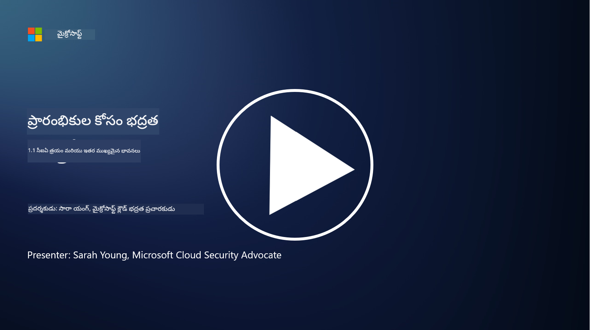
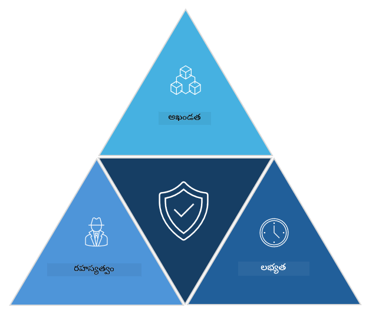

<!--
CO_OP_TRANSLATOR_METADATA:
{
  "original_hash": "16a76f9fa372fb63cffb6d76b855f023",
  "translation_date": "2025-12-19T12:49:19+00:00",
  "source_file": "1.1 The CIA triad and other key concepts.md",
  "language_code": "te"
}
-->
# CIA త్రయం మరియు ఇతర ముఖ్యమైన భావనలు

## పరిచయం

ఈ పాఠంలో, మనం కవర్ చేస్తాము:

 - సైబర్ సెక్యూరిటీ అంటే ఏమిటి?
   
 
 - సైబర్ సెక్యూరిటీ CIA త్రయం అంటే ఏమిటి?

   

 - సైబర్ సెక్యూరిటీ సందర్భంలో ప్రామాణికత, నిరాకరణా అసాధ్యత మరియు గోప్యత అంటే ఏమిటి?

## సైబర్ సెక్యూరిటీ అంటే ఏమిటి?

సైబర్ సెక్యూరిటీ, లేదా సమాచార భద్రతగా కూడా పిలువబడుతుంది, కంప్యూటర్ వ్యవస్థలు, నెట్‌వర్క్‌లు, పరికరాలు మరియు డేటాను డిజిటల్ దాడులు, అనధికార ప్రాప్యత, నష్టం లేదా దొంగతనాల నుండి రక్షించడంలో అనుసరించే విధానం. సైబర్ సెక్యూరిటీ యొక్క ప్రధాన లక్ష్యం డిజిటల్ ఆస్తులు మరియు సమాచారానికి గోప్యత, సమగ్రత మరియు లభ్యతను నిర్ధారించడం. సైబర్ సెక్యూరిటీ నిపుణులు ఆస్తులు, డేటా మరియు సమాచారాన్ని రక్షించడానికి భద్రత నియంత్రణలను రూపొందించి అమలు చేస్తారు. మన జీవితాలు ఎక్కువగా డిజిటలైజ్ చేయబడినప్పుడు మరియు ఆన్‌లైన్‌లోకి మారినప్పుడు, సైబర్ సెక్యూరిటీ వ్యక్తిగత వ్యక్తులు మరియు సంస్థల కోసం అత్యంత ముఖ్యమైన అంశంగా మారింది.

## సైబర్ సెక్యూరిటీ CIA త్రయం అంటే ఏమిటి?

సైబర్ సెక్యూరిటీ త్రయం అనేది ఏదైనా సైబర్ సెక్యూరిటీ పని లేదా వ్యవస్థ/పర్యావరణాన్ని రూపొందించడంలో మూడు ప్రధాన అంశాలను కలిగి ఉండే మోడల్‌ను సూచిస్తుంది:

### గోప్యత

ఇది "సైబర్ సెక్యూరిటీ" గురించి ఆలోచించినప్పుడు ఎక్కువ మంది పరిచయం ఉన్న అంశం: గోప్యత అనేది డేటా మరియు సమాచారాన్ని అనధికార ప్రాప్యత ప్రయత్నాల నుండి రక్షించే ప్రక్రియ, అంటే సమాచారాన్ని చూడాల్సిన అవసరం ఉన్న వ్యక్తులు మాత్రమే దానికి ప్రాప్యత పొందగలరు. అయితే అన్ని డేటా సమానంగా సృష్టించబడదు, మరియు డేటాను సాధారణంగా దాని ప్రాముఖ్యత మరియు దుర్వినియోగం వల్ల కలిగే నష్టాన్ని బట్టి వర్గీకరించి రక్షిస్తారు.

### సమగ్రత

పర్యావరణాల్లోని డేటా యొక్క ఖచ్చితత్వం మరియు నమ్మకాన్ని రక్షించడం మరియు అనధికార వ్యక్తులు డేటాను మార్చడం లేదా సవరించడం నుండి నిరోధించడం. ఉదాహరణకు, ఒక విద్యార్థి DMV వద్ద వారి డ్రైవర్ రికార్డులో వారి పుట్టిన తేదీని సవరించి, పాత తేదీతో లైసెన్స్ ముద్రించడానికి మరియు మద్యం కొనుగోలు చేయడానికి ప్రయత్నించడం.

### లభ్యత

ఇది ఆపరేషనల్ IT అంతటా ఒక ముఖ్యమైన అంశం, కానీ సైబర్ సెక్యూరిటీకి కూడా లభ్యత చాలా ముఖ్యమైనది. భద్రతా నిపుణులు నిరోధించాల్సిన ప్రత్యేకమైన దాడుల రకాలు ఉన్నాయి (ఉదా. డిస్ట్రిబ్యూటెడ్ డినైల్ ఆఫ్ సర్వీస్ – DDoS – దాడులు).

**సైబర్ సెక్యూరిటీ CIA త్రయం**

## సైబర్ సెక్యూరిటీ సందర్భంలో ప్రామాణికత, నిరాకరణా అసాధ్యత మరియు గోప్యత అంటే ఏమిటి?

సిస్టమ్‌లు మరియు డేటా యొక్క భద్రత మరియు నమ్మకాన్ని నిర్ధారించడంలో సంబంధం ఉన్న అదనపు ముఖ్యమైన భావనలు ఇవి:

**ప్రామాణికత** - మీరు పరస్పర చర్య చేస్తున్న సమాచారం, కమ్యూనికేషన్ లేదా ఎంటిటీ నిజమైనదని మరియు అనధికార పార్టీలు దానిని తారుమారు చేయలేదు లేదా మార్చలేదు అని నిర్ధారించడాన్ని సూచిస్తుంది.

**నిరాకరణా అసాధ్యత** - ఒక పార్టీ వారి పాల్గొనడం లేదా కమ్యూనికేషన్ లేదా లావాదేవీ యొక్క ప్రామాణికతను తిరస్కరించలేని భావన. ఇది ఒక వ్యక్తి సందేశం పంపలేదు లేదా ఒక నిర్దిష్ట చర్య చేయలేదు అని చెప్పడం నుండి నిరోధిస్తుంది, దీనికి వ్యతిరేకంగా ఆధారాలు ఉన్నప్పుడు.

**గోప్యత** - అనధికార ప్రాప్యత, ఉపయోగం, వెల్లడింపు లేదా మానిప్యులేషన్ నుండి సున్నితమైన మరియు వ్యక్తిగతంగా గుర్తించగల సమాచారాన్ని రక్షించడాన్ని సూచిస్తుంది. ఇది వ్యక్తిగత డేటాకు ఎవరు ప్రాప్యత పొందగలరో మరియు ఆ డేటా ఎలా సేకరించబడుతుంది, నిల్వ చేయబడుతుంది మరియు పంచబడుతుందో నియంత్రించడాన్ని కలిగి ఉంటుంది.

## అదనపు పఠనం

[What Is Information Security (InfoSec)? | Microsoft Security](https://www.microsoft.com/security/business/security-101/what-is-information-security-infosec#:~:text=Three%20pillars%20of%20information%20security%3A%20the%20CIA%20triad,as%20guiding%20principles%20for%20implementing%20an%20InfoSec%20plan.)

---

<!-- CO-OP TRANSLATOR DISCLAIMER START -->
**విమర్శ**:  
ఈ పత్రాన్ని AI అనువాద సేవ [Co-op Translator](https://github.com/Azure/co-op-translator) ఉపయోగించి అనువదించారు. మేము ఖచ్చితత్వానికి ప్రయత్నిస్తున్నప్పటికీ, ఆటోమేటెడ్ అనువాదాలలో తప్పులు లేదా అసమానతలు ఉండవచ్చు. దయచేసి, మూల భాషలోని అసలు పత్రాన్ని అధికారం కలిగిన మూలంగా పరిగణించండి. ముఖ్యమైన సమాచారం కోసం, ప్రొఫెషనల్ మానవ అనువాదాన్ని సిఫారసు చేస్తాము. ఈ అనువాదాన్ని ఉపయోగించడం వల్ల కలిగే ఏవైనా అపార్థాలు లేదా తప్పుదారులు కోసం మేము బాధ్యత వహించము.
<!-- CO-OP TRANSLATOR DISCLAIMER END -->