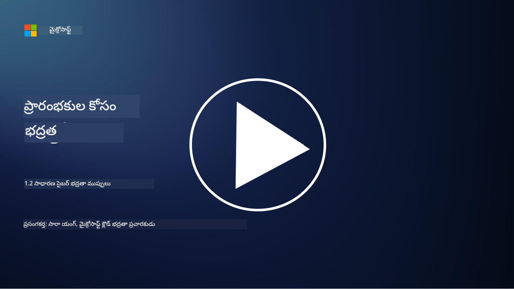

<!--
CO_OP_TRANSLATOR_METADATA:
{
  "original_hash": "6fc3030323139d7134a4ca9d03eccac9",
  "translation_date": "2025-12-19T13:31:22+00:00",
  "source_file": "1.2 Common cybersecurity threats.md",
  "language_code": "te"
}
-->
# సాధారణ సైబర్ భద్రతా ముప్పులు

## పరిచయం

ఈ పాఠంలో మనం చర్చించబోతున్న విషయాలు:

- సైబర్ భద్రతా ముప్పు అంటే ఏమిటి?

- దురుద్దేశ్య వ్యక్తులు డేటా మరియు ఐటీ వ్యవస్థలను ఎందుకు దెబ్బతీయాలని చూస్తారు?

- సాధారణంగా కనిపించే సైబర్ భద్రతా ముప్పుల రకాలు ఏమిటి?

- MITRE ATT&CK ఫ్రేమ్‌వర్క్ అంటే ఏమిటి?

- సైబర్ భద్రతా ముప్పుల పరిసరాలను అప్‌డేట్‌గా ఎలా ఉంచుకోవచ్చు?

## సైబర్ భద్రతా ముప్పు అంటే ఏమిటి?

సైబర్ భద్రతా ముప్పు అనేది డేటా లేదా ఐటీ వ్యవస్థల గోప్యత, సమగ్రత లేదా లభ్యతను దెబ్బతీయగల ప్రమాదం లేదా ప్రమాదం. ఈ ముప్పులు దురుద్దేశ్య వ్యక్తులచే కలుగుతాయి, వీరు అనధికార ప్రాప్యత పొందడానికి, సున్నితమైన సమాచారాన్ని దొంగిలించడానికి, కార్యకలాపాలను భంగం కలిగించడానికి లేదా వ్యక్తులు, సంస్థలు లేదా దేశాలకు హాని కలిగించడానికి భద్రతా లోపాలను ఉపయోగించడానికి ప్రయత్నిస్తారు. సైబర్ భద్రతా ముప్పులు వివిధ రూపాలలో ఉండవచ్చు మరియు డిజిటల్ వ్యవస్థలు మరియు డేటా యొక్క వివిధ అంశాలను లక్ష్యంగా చేసుకుంటాయి.

## దురుద్దేశ్య వ్యక్తులు డేటా మరియు ఐటీ వ్యవస్థలను ఎందుకు దెబ్బతీయాలని చూస్తారు?

దురుద్దేశ్య వ్యక్తులు వ్యక్తిగత లాభం, సిద్ధాంతపరమైన ఉద్దేశాలు లేదా భంగం కలిగించాలనే కోరిక వంటి వివిధ కారణాల కోసం డేటా మరియు ఐటీ వ్యవస్థలను దెబ్బతీయడం జరుగుతుంది. ఈ ప్రేరణలను అర్థం చేసుకోవడం ద్వారా సంస్థలు మరియు వ్యక్తులు సైబర్ ముప్పుల నుండి మెరుగైన రక్షణ పొందవచ్చు. దురుద్దేశ్య వ్యక్తులు సైబర్ దాడులు చేయడానికి కొన్ని సాధారణ కారణాలు:

1. **ఆర్థిక లాభం**: చాలా దాడులు ఆర్థిక లాభం కోసం ప్రేరేపించబడతాయి. దురుద్దేశ్య వ్యక్తులు క్రెడిట్ కార్డ్ నంబర్లు, బ్యాంక్ ఖాతా వివరాలు లేదా వ్యక్తిగత గుర్తింపు సమాచారం వంటి సున్నితమైన సమాచారాన్ని దొంగిలించి మోసం చేయడం, గుర్తింపు దొంగతనం చేయడం, వ్యక్తి లేదా సంస్థను బందీగా ఉంచడం లేదా చీకటి వెబ్‌లో దొంగిలించిన డేటాను అమ్మడం చేస్తారు.

2. **గూఢచర్యం**: దేశాలు, పోటీదారులు లేదా ఇతర సంస్థలు రాజకీయ, ఆర్థిక లేదా సైనిక ప్రయోజనాల కోసం సున్నితమైన ప్రభుత్వ, కార్పొరేట్ లేదా పరిశోధన డేటాను దొంగిలించడానికి సైబర్ గూఢచర్యంలో పాల్గొంటాయి.

3. **భంగం మరియు విధ్వంసం**: కొన్ని దాడులు రాజకీయ లేదా సిద్ధాంతపరమైన కారణాల కోసం కీలక మౌలిక సదుపాయాలు, సేవలు లేదా కార్యకలాపాలను భంగం కలిగించడానికి లక్ష్యంగా ఉంటాయి. ఈ దాడులు విస్తృత స్థాయిలో గందరగోళం, ఆర్థిక నష్టం మరియు ప్రతిష్టకు హాని కలిగించవచ్చు.

4. **సిద్ధాంతపరమైన ఉద్దేశాలు**: హాక్టివిస్టులు మరియు సిద్ధాంతపరమైన లేదా రాజకీయ ఉద్దేశాలు కలిగిన గుంపులు కొన్ని సమస్యలపై అవగాహన పెంచడానికి, తమ నమ్మకాల్ని ప్రోత్సహించడానికి లేదా నిర్దిష్ట చర్యలు లేదా సంస్థలపై నిరసన వ్యక్తం చేయడానికి వ్యవస్థలను దెబ్బతీయవచ్చు.

5. **అనుకోని చర్యలు**: అన్ని దురుద్దేశ్య చర్యలు ఉద్దేశపూర్వకమైనవి కావు; కొంతమంది వ్యక్తులు సామాజిక ఇంజనీరింగ్‌కు బలై లేదా దెబ్బతిన్న నెట్‌వర్క్‌లో భాగంగా ఉండి సైబర్ ముప్పులకు అనుకోకుండా సహకరించవచ్చు.

మొత్తానికి, డేటా మరియు ఐటీ వ్యవస్థలను దెబ్బతీయడానికి ప్రేరణలు విస్తృతంగా మారవచ్చు, మరియు ఈ దాడుల ప్రభావం తీవ్రమైనదిగా ఉండవచ్చు. వ్యక్తులు, సంస్థలు మరియు ప్రభుత్వాలు సైబర్ భద్రతను సీరియస్‌గా తీసుకోవడం మరియు ఈ ముప్పుల నుండి రక్షణ పొందడానికి చర్యలు చేపట్టడం చాలా ముఖ్యం.

## సాధారణంగా కనిపించే సైబర్ భద్రతా ముప్పుల రకాలు ఏమిటి?

సాధారణంగా కనిపించే సైబర్ దాడుల రకాలు అనేకం ఉన్నాయి, ఇవి వ్యవస్థలను దెబ్బతీయడానికి, డేటాను దొంగిలించడానికి మరియు భంగం కలిగించడానికి దురుద్దేశ్య వ్యక్తులు ఉపయోగిస్తారు. ఈ రకాలలో కొన్ని:

1. **ఫిషింగ్**:

ఫిషింగ్ అనేది నమ్మకమైన వనరుల నుండి వచ్చినట్లు కనిపించే మోసపూరిత ఇమెయిల్స్ లేదా సందేశాలను పంపడం ద్వారా పాస్‌వర్డ్‌లు, క్రెడిట్ కార్డ్ నంబర్లు లేదా వ్యక్తిగత వివరాలు వంటి సున్నితమైన సమాచారాన్ని పొందడానికి ప్రయత్నించడం. ఫిషింగ్ బాధితులను దురుద్దేశ్య వెబ్‌సైట్‌లకు లేదా మాల్వేర్‌ను డౌన్‌లోడ్ చేయడానికి కూడా దారితీస్తుంది.

2. **మాల్వేర్**:

మాల్వేర్ (దురుద్దేశ్య సాఫ్ట్‌వేర్) అనేది వ్యవస్థలను సంక్రమించడానికి, డేటాను దొంగిలించడానికి లేదా నష్టం కలిగించడానికి రూపొందించిన దురుద్దేశ్య ప్రోగ్రామ్‌ల శ్రేణిని కలిగి ఉంటుంది. మాల్వేర్ రకాలు:

- **రాన్సమ్‌వేర్**: ఫైళ్లను సంక్రమించి, డీక్రిప్షన్ కోసం రాన్సమ్ డిమాండ్ చేస్తుంది.

- **ట్రోజన్లు**: నమ్మకమైన సాఫ్ట్‌వేర్‌గా ముసుగులో ఉండి, దురుద్దేశ్య వ్యక్తులకు అనధికార ప్రాప్యతను ఇస్తాయి.

- **వైరస్‌లు**: ఫైళ్లకు జతచేసి వ్యాపించే స్వీయ-ప్రతిరూప ప్రోగ్రామ్‌లు.

- **వార్మ్స్**: నెట్‌వర్క్‌ల ద్వారా వ్యాపించే స్వీయ-ప్రతిరూప ప్రోగ్రామ్‌లు.

3. **డినైల్ ఆఫ్ సర్వీస్ (DoS) మరియు డిస్ట్రిబ్యూటెడ్ డినైల్ ఆఫ్ సర్వీస్ (DDoS)**:

DoS దాడులు లక్ష్య వ్యవస్థను అధిక లోడ్‌తో నింపి, వినియోగదారులకు అందుబాటులో ఉండకుండా చేస్తాయి. DDoS దాడులు దెబ్బతిన్న పరికరాల నెట్‌వర్క్‌ను ఉపయోగించి లక్ష్యాన్ని ట్రాఫిక్‌తో నింపి వ్యవస్థను సరిగ్గా పనిచేయకుండా చేస్తాయి లేదా పూర్తిగా ఆపేస్తాయి.

4. **SQL ఇంజెక్షన్**:

ఈ దాడిలో, దురుద్దేశ్య వ్యక్తులు వెబ్ అప్లికేషన్ యొక్క ఇన్‌పుట్ ఫీల్డ్‌లను మోసపూరిత SQL ప్రశ్నలను చొప్పించి, డేటాబేస్‌లు మరియు సున్నితమైన డేటాకు అనధికార ప్రాప్యత పొందవచ్చు.

5. **క్రాస్-సైట్ స్క్రిప్టింగ్ (XSS)**:

దురుద్దేశ్య వ్యక్తులు వెబ్ అప్లికేషన్‌లలో దురుద్దేశ్య స్క్రిప్ట్‌లను చొప్పించి, అవి వినియోగదారుల బ్రౌజర్‌ల ద్వారా అమలు చేయబడతాయి. ఇది వినియోగదారుల డేటా దొంగతనానికి లేదా మాల్వేర్ వ్యాప్తికి దారితీస్తుంది.

6. **సోషల్ ఇంజనీరింగ్**:

సోషల్ ఇంజనీరింగ్ మానవ మనస్తత్వాన్ని ఉపయోగించి వ్యక్తులను గోప్యమైన సమాచారాన్ని వెల్లడించడానికి లేదా భద్రతను దెబ్బతీసే చర్యలను చేయడానికి మోసగించడం.

7. **జీరో-డే (0day) ఎక్స్‌ప్లాయిట్స్**:

ఈ దాడులు సాఫ్ట్‌వేర్ లేదా హార్డ్‌వేర్‌లోని భద్రతా లోపాలను లక్ష్యంగా చేసుకుంటాయి, ఇవి విక్రేత లేదా ప్రజలకు ఇంకా తెలియదు. ప్యాచ్‌లు అభివృద్ధి చేయబడే ముందు దురుద్దేశ్య వ్యక్తులు ఈ లోపాలను ఉపయోగిస్తారు. జీరో-డే దాడులు సాధారణంగా ఇతర దాడుల కంటే తక్కువగా ఉంటాయి, కానీ అవి కనుగొనబడినప్పుడు భద్రతా పరిశోధకులు త్వరగా ప్యాచ్‌ను తయారు చేస్తారు, అందువల్ల అవి సాధారణంగా తక్కువ కాలం మాత్రమే ఉంటాయి.

8. **క్రెడెన్షియల్ దాడులు**:

ఈ దాడుల్లో బ్రూట్ ఫోర్స్ దాడులు ఉంటాయి, వీటిలో దురుద్దేశ్య వ్యక్తులు పాస్‌వర్డ్‌లను పునరావృతంగా అంచనా వేస్తారు, మరియు క్రెడెన్షియల్ స్టఫింగ్ దాడులు ఉంటాయి, వీటిలో ఒక సైట్ నుండి దొంగిలించిన క్రెడెన్షియల్‌లను ఇతర సైట్‌లలో ప్రాప్యత పొందడానికి ప్రయత్నిస్తారు.

## MITRE ATT&CK ఫ్రేమ్‌వర్క్ అంటే ఏమిటి?

[MITRE ATT&CK ఫ్రేమ్‌వర్క్](https://attack.mitre.org/) (Adversarial Tactics, Techniques, and Common Knowledge) అనేది సైబర్ దాడుల సమయంలో ప్రత్యర్థులు ఉపయోగించే వ్యూహాలు, సాంకేతికతలు మరియు విధానాలను (TTPs) కేటలాగ్ చేయడానికి మరియు వర్గీకరించడానికి రూపొందించిన ఫ్రేమ్‌వర్క్. ఈ ఫ్రేమ్‌వర్క్ MITRE కార్పొరేషన్ అనే లాభాపేక్షలేని సంస్థచే రూపొందించబడింది, ఇది వివిధ ప్రభుత్వ సంస్థల కోసం పరిశోధన మరియు అభివృద్ధి కేంద్రాలను నిర్వహిస్తుంది.

MITRE ATT&CK ఫ్రేమ్‌వర్క్ సైబర్ ముప్పులను వివరిస్తూ మరియు విశ్లేషించడానికి ఒక ప్రామాణిక మార్గాన్ని అందిస్తుంది, ఇది సైబర్ భద్రతా నిపుణులకు వివిధ దాడి సాంకేతికతలను మెరుగ్గా అర్థం చేసుకోవడానికి మరియు వాటిని ఎదుర్కొనేందుకు సహాయపడుతుంది. ఇది భద్రతా బృందాలు, ముప్పు వేటగాళ్లు మరియు సంఘటన ప్రతిస్పందకులచే విస్తృతంగా ఉపయోగించబడుతుంది:

1. **ప్రత్యర్థి ప్రవర్తనను అర్థం చేసుకోవడం**: ఫ్రేమ్‌వర్క్ నిజజీవిత దాడి ప్రవర్తనలను పత్రబద్ధం చేస్తుంది, ప్రత్యర్థులు ప్రారంభ ప్రవేశం నుండి తమ లక్ష్యాలను సాధించే వరకు తీసుకునే దశలను వివరిస్తుంది. ఇది వివిధ ముప్పు గుంపులు ఉపయోగించే దాడి సాంకేతికతల విస్తృత శ్రేణిని కవర్ చేస్తుంది.

2. **రక్షణ వ్యూహాలను ప్రణాళిక చేయడం మరియు అమలు చేయడం**: భద్రతా బృందాలు ప్రత్యర్థులు ఉపయోగించే నిర్దిష్ట వ్యూహాలు మరియు సాంకేతికతలకు అనుగుణంగా ప్రో-యాక్టివ్ రక్షణ వ్యూహాలను అభివృద్ధి చేయడానికి ఫ్రేమ్‌వర్క్‌ను ఉపయోగించవచ్చు.

3. **సంఘటన ప్రతిస్పందన మరియు ముప్పు వేట**: సంఘటనలను పరిశీలించేటప్పుడు లేదా ముప్పు వేటను నిర్వహించేటప్పుడు, భద్రతా నిపుణులు దాడి చేసిన నిర్దిష్ట సాంకేతికతలను గుర్తించడానికి మరియు తగ్గించడానికి ఫ్రేమ్‌వర్క్‌ను సూచించవచ్చు.

MITRE ATT&CK ఫ్రేమ్‌వర్క్ వివిధ ప్లాట్‌ఫారమ్‌లు మరియు వాతావరణాల ఆధారంగా దాడి సాంకేతికతలను సమూహపరచే మ్యాట్రిక్స్‌లుగా నిర్వహించబడింది, ఉదాహరణకు Windows, macOS, Linux, మరియు క్లౌడ్ సేవలు. ప్రతి మ్యాట్రిక్స్ వ్యూహాలు (అధిక-స్థాయి లక్ష్యాలు) మరియు సాంకేతికతలు (ఆ లక్ష్యాలను సాధించడానికి ఉపయోగించే నిర్దిష్ట పద్ధతులు)గా విభజించబడింది. ప్రతి సాంకేతికత కోసం, ఫ్రేమ్‌వర్క్ దాని పని విధానం, సంభావ్య తగ్గింపులు మరియు ఆ సాంకేతికతను ఉపయోగించిన నిజజీవిత ముప్పు నటులపై సంబంధిత సూచనలను అందిస్తుంది.

ఫ్రేమ్‌వర్క్ కొత్త ముప్పు ఇంటెలిజెన్స్ సేకరించబడినప్పుడు మరియు సైబర్ భద్రతా పరిసరాలు అభివృద్ధి చెందుతున్నప్పుడు నిరంతరం అప్‌డేట్ చేయబడుతుంది మరియు విస్తరించబడుతుంది. ఇది ప్రత్యర్థులు ఎలా పనిచేస్తారు మరియు వారి వ్యూహాలను ఎలా ఎదుర్కోవాలో లోతైన అవగాహనను సాధించడం ద్వారా సంస్థ యొక్క సైబర్ భద్రతా స్థితిని మెరుగుపరచడానికి విలువైన వనరుగా ఉంటుంది.

## సైబర్ భద్రతా ముప్పుల పరిసరాలను అప్‌డేట్‌గా ఎలా ఉంచుకోవచ్చు?

సైబర్ భద్రతా ముప్పుల గురించి అప్‌డేట్‌గా ఉండటానికి అనేక వనరులు ఉన్నాయి, ఇక్కడ కొన్ని ఎంపికలు ఉన్నాయి:

- [ఓపెన్ వెబ్ అప్లికేషన్ సెక్యూరిటీ ప్రాజెక్ట్ (OWASP) టాప్ 10 లోపాలు](https://owasp.org/Top10/)
- [సాధారణ లోపాలు మరియు ఎక్స్‌పోజర్‌లు (CVEs)](https://www.bing.com/ck/a?!&&p=53df6007f017bca2JmltdHM9MTY5MjU3NjAwMCZpZ3VpZD0zYmY4N2RiYS1jYWI1LTYwMDgtMWY1YS02ZmYyY2JjNjYxZWUmaW5zaWQ9NTc2OQ&ptn=3&hsh=3&fclid=3bf87dba-cab5-6008-1f5a-6ff2cbc661ee&psq=cve&u=a1aHR0cHM6Ly9iaW5nLmNvbS9hbGluay9saW5rP3VybD1odHRwcyUzYSUyZiUyZmN2ZS5taXRyZS5vcmclMmYmc291cmNlPXNlcnAtcnImaD1BZXN4S0VBWTNnbGhNZEFpd3daMlNSZkZQNTlrODhIUnYxRUtlSkY1RTk0JTNkJnA9a2NvZmZjaWFsd2Vic2l0ZQ&ntb=1 "సాధారణ లోపాలు మరియు ఎక్స్‌పోజర్‌లు")
- [మైక్రోసాఫ్ట్ సెక్యూరిటీ రెస్పాన్స్ సెంటర్ బ్లాగులు](https://msrc.microsoft.com/blog/)
- [జాతీయ ప్రమాణాలు మరియు సాంకేతికతల సంస్థ (NIST)](https://www.dhs.gov/topics/cybersecurity): NIST వనరులు, అలర్ట్‌లు, మరియు సైబర్ భద్రతా ముప్పులపై తాజా అప్‌డేట్‌లను అందిస్తుంది.
- [సైబర్ భద్రతా మరియు మౌలిక సదుపాయాల భద్రతా సంస్థ (CISA)](https://www.cisa.gov/resources-tools/resources/free-cybersecurity-services-and-tools): CISA వ్యాపారాలు, ప్రభుత్వ సంస్థలు, మరియు ఇతర సంస్థల కోసం సైబర్ భద్రతా వనరులు మరియు ఉత్తమ పద్ధతులను అందిస్తుంది. CISA సమాజాన్ని ప్రభావితం చేసే అధిక-ప్రభావం భద్రతా కార్యకలాపాలపై తాజా సమాచారం మరియు కొత్త మరియు అభివృద్ధి చెందుతున్న సైబర్ ముప్పులపై లోతైన విశ్లేషణను పంచుకుంటుంది.
- [జాతీయ సైబర్ భద్రతా కేంద్రం (NCCoE)](https://www.dhs.gov/topics/cybersecurity): NCCoE నిజజీవిత పరిస్థితుల్లో వర్తించే ప్రాక్టికల్ సైబర్ భద్రతా పరిష్కారాలను అందించే కేంద్రం.
- [US-CERT](https://www.cisa.gov/resources-tools/resources/free-cybersecurity-services-and-tools): యునైటెడ్ స్టేట్స్ కంప్యూటర్ ఎమర్జెన్సీ రెడినెస్ టీమ్ (US-CERT) అలర్ట్‌లు, చిట్కాలు, మరియు మరిన్ని సహా వివిధ సైబర్ భద్రతా వనరులను అందిస్తుంది.
- మీ దేశం యొక్క సైబర్ ఎమర్జెన్సీ రెస్పాన్స్ టీమ్ (CERT)

---

<!-- CO-OP TRANSLATOR DISCLAIMER START -->
**విమర్శ**:  
ఈ పత్రాన్ని AI అనువాద సేవ [Co-op Translator](https://github.com/Azure/co-op-translator) ఉపయోగించి అనువదించారు. మేము ఖచ్చితత్వానికి ప్రయత్నిస్తున్నప్పటికీ, ఆటోమేటెడ్ అనువాదాలలో తప్పులు లేదా అసమానతలు ఉండవచ్చు. దాని స్వదేశీ భాషలోని అసలు పత్రాన్ని అధికారం కలిగిన మూలంగా పరిగణించాలి. కీలకమైన సమాచారం కోసం, ప్రొఫెషనల్ మానవ అనువాదాన్ని సిఫారసు చేస్తాము. ఈ అనువాదాన్ని ఉపయోగించడం వల్ల కలిగే ఏవైనా అపార్థాలు లేదా తప్పుదారులు కోసం మేము బాధ్యత వహించము.
<!-- CO-OP TRANSLATOR DISCLAIMER END -->