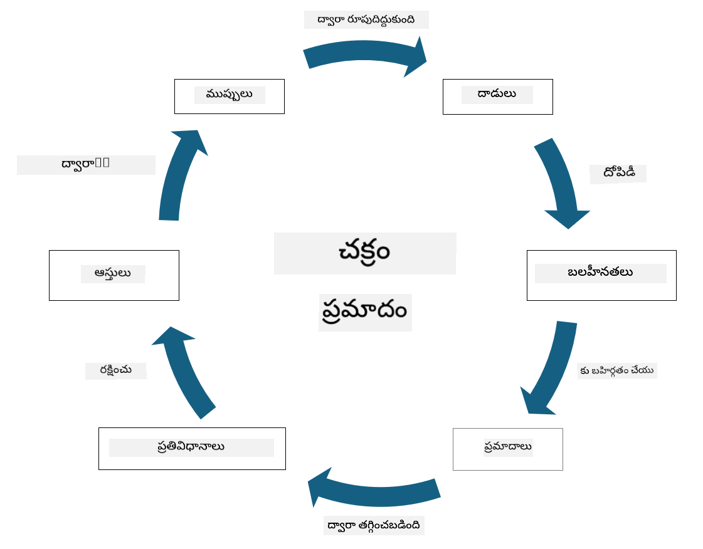

<!--
CO_OP_TRANSLATOR_METADATA:
{
  "original_hash": "fcca304f072cabf206388199e8e2e578",
  "translation_date": "2025-12-19T13:17:43+00:00",
  "source_file": "1.3 Understanding risk management.md",
  "language_code": "te"
}
-->
# రిస్క్ మేనేజ్‌మెంట్‌ను అర్థం చేసుకోవడం

## పరిచయం

ఈ పాఠంలో, మనం కవర్ చేయబోతున్న అంశాలు:

 - సాధారణంగా ఉపయోగించే భద్రతా పదజాలాల నిర్వచనాలు
   
 - భద్రతా నియంత్రణల రకాలు

 - భద్రతా రిస్క్‌లను అంచనా వేయడం

## సాధారణంగా ఉపయోగించే భద్రతా పదజాలాల నిర్వచనాలు

ఈ పదాలు సైబర్ భద్రత మరియు రిస్క్ మేనేజ్‌మెంట్ రంగంలో ప్రాథమిక భావనలు. ప్రతి పదాన్ని మరియు అవి ఒకదానితో ఒకటి ఎలా సంబంధం కలిగి ఉంటాయో చూద్దాం:

1. **తమకు ప్రమాదం కలిగించే ఏజెంట్**:

తమకు ప్రమాదం కలిగించే ఏజెంట్ అనేది వ్యక్తి, సమూహం, సంస్థ లేదా ఆటోమేటెడ్ సిస్టమ్, ఇది సిస్టమ్ లేదా నెట్‌వర్క్‌లోని లోపాలను ఉపయోగించి హాని లేదా నష్టం కలిగించే సామర్థ్యం కలిగి ఉంటుంది. తమకు ప్రమాదం కలిగించే ఏజెంట్లు హ్యాకర్లు, మాల్వేర్ రచయితలు, అసంతృప్త ఉద్యోగులు లేదా సమాచార మరియు సాంకేతిక వ్యవస్థలకు ప్రమాదం కలిగించే ఏదైనా ఎంటిటీ కావచ్చు.

2. **తమకు ప్రమాదం**:

తమకు ప్రమాదం అనేది ఒక సంఘటన లేదా చర్య, ఇది సిస్టమ్‌లోని లోపాలను ఉపయోగించి ఆస్తికి హాని కలిగించగలదు. తమకు ప్రమాదాలు హ్యాకింగ్, డేటా బ్రీచ్‌లు, డినైల్-ఆఫ్-సర్వీస్ దాడులు మరియు మరెన్నో చర్యలను కలిగి ఉంటాయి. తమకు ప్రమాదాలు సంస్థ ఆస్తులపై హాని కలిగించే "ఏమిటి" అనే అంశాన్ని సూచిస్తాయి.

3. **లోపం**:

లోపం అనేది సిస్టమ్ డిజైన్, అమలు లేదా కాన్ఫిగరేషన్‌లోని బలహీనత లేదా లోపం, ఇది తమకు ప్రమాదం కలిగించే ఏజెంట్ ద్వారా సిస్టమ్ భద్రతను కాంప్రమైజ్ చేయడానికి ఉపయోగించబడుతుంది. లోపాలు సాఫ్ట్‌వేర్, హార్డ్‌వేర్, ప్రక్రియలు లేదా మానవ ప్రవర్తనలో ఉండవచ్చు. విజయవంతమైన దాడులను తగ్గించడానికి లోపాలను గుర్తించడం మరియు పరిష్కరించడం చాలా అవసరం.

4. **ప్రమాదం**:

ప్రమాదం అనేది తమకు ప్రమాదం మరియు లోపం మధ్య పరస్పర చర్యల ఫలితంగా నష్టం, హాని లేదా నష్టానికి అవకాశం. ఇది తమకు ప్రమాదం కలిగించే ఏజెంట్ ఒక లోపాన్ని ఉపయోగించి ప్రతికూల ప్రభావాన్ని కలిగించే అవకాశం. ప్రమాదాలను సాధారణంగా వాటి ప్రభావం మరియు సంభవించే అవకాశం పరంగా అంచనా వేస్తారు.

5. **ఆస్తి**:

ఆస్తి అనేది సంస్థ రక్షించదలచిన విలువైన ఏదైనా వస్తువు. ఆస్తులు భౌతిక వస్తువులు (కంప్యూటర్లు మరియు సర్వర్లు), డేటా (కస్టమర్ సమాచారం, ఆర్థిక రికార్డులు), మేధో సంపత్తి (ట్రేడ్ సీక్రెట్స్, పేటెంట్లు) మరియు మానవ వనరులు (ఉద్యోగుల నైపుణ్యాలు మరియు జ్ఞానం) వంటి వాటిని కలిగి ఉంటాయి. ఆస్తులను రక్షించడం సైబర్ భద్రత యొక్క ముఖ్యమైన లక్ష్యం.

6. **ఎక్స్‌పోజర్**:

ఎక్స్‌పోజర్ అనేది తమకు ప్రమాదం కలిగించే అవకాశం ఉన్న స్థితిని సూచిస్తుంది. ఇది తమకు ప్రమాదం కలిగించే ఏజెంట్ ద్వారా ఉపయోగించబడగల లోపం ఉన్నప్పుడు సంభవిస్తుంది. ఎక్స్‌పోజర్ సిస్టమ్ లేదా నెట్‌వర్క్‌లో లోపాలు ఉన్నప్పుడు సంభవించే ప్రమాదాన్ని హైలైట్ చేస్తుంది.

7. **నియంత్రణ**:

నియంత్రణ అనేది తమకు ప్రమాదాలు మరియు లోపాలకు సంబంధించిన ప్రమాదాన్ని తగ్గించడానికి అమలు చేయబడిన చర్య. నియంత్రణలు సాంకేతిక, విధానాత్మక లేదా పరిపాలనా స్వభావం కలిగి ఉంటాయి. అవి తమకు ప్రమాదాలు మరియు లోపాలను నివారించడానికి, గుర్తించడానికి లేదా తగ్గించడానికి రూపొందించబడ్డాయి. ఉదాహరణలు: ఫైర్‌వాల్స్, యాక్సెస్ నియంత్రణలు, ఎన్‌క్రిప్షన్, భద్రతా విధానాలు మరియు ఉద్యోగుల శిక్షణ.

ఈ పదాల మధ్య సంబంధాన్ని సారాంశంగా చెప్పాలంటే: తమకు ప్రమాదం కలిగించే ఏజెంట్లు లోపాలను ఉపయోగించి తమకు ప్రమాదాలను అమలు చేస్తారు, ఇవి ఆస్తులకు హాని కలిగించే ప్రమాదాలను కలిగిస్తాయి. లోపాలు ఉన్నప్పుడు ఎక్స్‌పోజర్ సంభవిస్తుంది, మరియు నియంత్రణలు ఆస్తులపై తమకు ప్రమాదాల ప్రభావాన్ని నివారించడం లేదా తగ్గించడం ద్వారా ప్రమాదాన్ని తగ్గించడానికి అమలు చేయబడతాయి. ఈ ఫ్రేమ్‌వర్క్ సైబర్ భద్రతా రిస్క్ మేనేజ్‌మెంట్‌కు పునాది, సంస్థలను వారి సమాచార వ్యవస్థలు మరియు ఆస్తులకు సంభవించే ప్రమాదాలను గుర్తించడం, అంచనా వేయడం మరియు పరిష్కరించడంలో మార్గనిర్దేశం చేస్తుంది.

## భద్రతా నియంత్రణల రకాలు

భద్రతా నియంత్రణలు అనేవి సమాచార వ్యవస్థలు మరియు ఆస్తులను వివిధ ప్రమాదాలు మరియు లోపాల నుండి రక్షించడానికి అమలు చేయబడిన చర్యలు లేదా రక్షణలు. అవి వాటి దృష్టి మరియు ఉద్దేశం ఆధారంగా అనేక వర్గాలుగా వర్గీకరించబడతాయి. ఇక్కడ కొన్ని సాధారణ భద్రతా నియంత్రణ రకాలు ఉన్నాయి:

1. **పరిపాలనా నియంత్రణలు**:

ఈ నియంత్రణలు సంస్థ భద్రతా ఆచరణలు మరియు వినియోగదారుల ప్రవర్తనను పరిపాలించే విధానాలు, ప్రక్రియలు మరియు మార్గదర్శకాలకు సంబంధించినవి.

- భద్రతా విధానాలు మరియు ప్రక్రియలు: సంస్థలో భద్రత ఎలా నిర్వహించబడుతుందో నిర్వచించే డాక్యుమెంట్ మార్గదర్శకాలు.

- భద్రతా అవగాహన మరియు శిక్షణ: ఉద్యోగులను భద్రతా ఉత్తమ ఆచరణలు మరియు సంభవించే ప్రమాదాల గురించి విద్యా కార్యక్రమాలు.

- సంఘటనల ప్రతిస్పందన మరియు నిర్వహణ: భద్రతా సంఘటనలకు ప్రతిస్పందించడానికి మరియు తగ్గించడానికి ప్రణాళికలు.

2. **సాంకేతిక నియంత్రణలు**:

సాంకేతిక నియంత్రణలు భద్రతా చర్యలను అమలు చేయడానికి మరియు వ్యవస్థలు మరియు డేటాను రక్షించడానికి సాంకేతికతను ఉపయోగించడం కలిగి ఉంటాయి. సాంకేతిక నియంత్రణల ఉదాహరణలు:

- యాక్సెస్ నియంత్రణలు: వినియోగదారుల పాత్రలు మరియు అనుమతుల ఆధారంగా వనరులకు యాక్సెస్‌ను పరిమితం చేసే చర్యలు.

- ఎన్‌క్రిప్షన్: అనధికార యాక్సెస్‌ను నివారించడానికి డేటాను సురక్షిత ఫార్మాట్‌లోకి మార్చడం.

- ఫైర్‌వాల్స్: నెట్‌వర్క్ భద్రతా పరికరాలు, ఇవి ఇన్‌కమింగ్ మరియు అవుట్‌గోయింగ్ ట్రాఫిక్‌ను ఫిల్టర్ చేసి నియంత్రిస్తాయి.

- ఇన్‌ట్రూజన్ డిటెక్షన్ మరియు ప్రివెన్షన్ సిస్టమ్స్ (IDPS): అనుమానాస్పద కార్యకలాపాల కోసం నెట్‌వర్క్ ట్రాఫిక్‌ను పర్యవేక్షించే సాధనాలు.

- యాంటీవైరస్ మరియు యాంటీ-మాల్వేర్ సాఫ్ట్‌వేర్: హానికరమైన సాఫ్ట్‌వేర్‌ను గుర్తించి తొలగించే ప్రోగ్రామ్‌లు.

- ఆథెంటికేషన్ మెకానిజం: వినియోగదారుల గుర్తింపును ధృవీకరించడానికి పాస్‌వర్డ్‌లు, బయోమెట్రిక్స్ మరియు మల్టీ-ఫ్యాక్టర్ ఆథెంటికేషన్ వంటి పద్ధతులు.

- ప్యాచ్ మేనేజ్‌మెంట్: తెలిసిన లోపాలను పరిష్కరించడానికి సాఫ్ట్‌వేర్‌ను క్రమం తప్పకుండా నవీకరించడం.

3. **భౌతిక నియంత్రణలు**:

భౌతిక నియంత్రణలు భౌతిక ఆస్తులు మరియు సౌకర్యాలను రక్షించడానికి చర్యలు.

- భద్రతా గార్డులు మరియు యాక్సెస్ నియంత్రణ సిబ్బంది: భౌతిక ప్రాంగణానికి యాక్సెస్‌ను పర్యవేక్షించి నియంత్రించే సిబ్బంది.

- సర్వైలెన్స్ కెమెరాలు: కార్యకలాపాలను పర్యవేక్షించి రికార్డ్ చేసే వీడియో మానిటరింగ్ సిస్టమ్స్.

- తాళాలు మరియు భౌతిక అవరోధాలు: సున్నితమైన ప్రాంతాలకు యాక్సెస్‌ను పరిమితం చేసే భౌతిక చర్యలు.

- పర్యావరణ నియంత్రణలు: పరికరాలు మరియు డేటా సెంటర్లపై ప్రభావం చూపే ఉష్ణోగ్రత, ఆర్ద్రత మరియు ఇతర పర్యావరణ కారకాలను నియంత్రించే చర్యలు.

4. **ఆపరేషనల్ నియంత్రణలు**:

ఈ నియంత్రణలు వ్యవస్థల నిరంతర భద్రతను నిర్ధారించే రోజువారీ కార్యకలాపాలు మరియు కార్యకలాపాలకు సంబంధించినవి.

- మార్పు నిర్వహణ: వ్యవస్థలు మరియు కాన్ఫిగరేషన్‌లకు మార్పులను ట్రాక్ చేసి ఆమోదించే ప్రక్రియలు.

- బ్యాకప్ మరియు విపత్తు పునరుద్ధరణ: వ్యవస్థ వైఫల్యాలు లేదా విపత్తుల సందర్భంలో డేటా బ్యాకప్ మరియు పునరుద్ధరణ ప్రణాళికలు.

- లాగింగ్ మరియు ఆడిటింగ్: భద్రత మరియు అనుగుణత కోసం వ్యవస్థ కార్యకలాపాలను పర్యవేక్షించి రికార్డ్ చేయడం.

- సురక్షిత కోడింగ్ ఆచరణలు: లోపాలను తగ్గించడానికి సాఫ్ట్‌వేర్ రాయడానికి మార్గదర్శకాలు.

5. **చట్టపరమైన మరియు నియంత్రణ నియంత్రణలు**:

ఈ నియంత్రణలు సంబంధిత చట్టాలు, నియమాలు మరియు పరిశ్రమ ప్రమాణాలకు అనుగుణంగా ఉండేలా చేస్తాయి. సంస్థ అనుసరించాల్సిన ప్రమాణాలు జురిస్డిక్షన్, పరిశ్రమ వర్టికల్ మరియు ఇతర కారకాలపై ఆధారపడి ఉంటాయి.

- డేటా రక్షణ నియమాలు: GDPR, HIPAA, మరియు CCPA వంటి చట్టాలకు అనుగుణంగా ఉండడం.

- పరిశ్రమ-స్పెసిఫిక్ ప్రమాణాలు: PCI DSS వంటి చెల్లింపు కార్డ్ డేటా భద్రత కోసం ప్రమాణాలను పాటించడం.

ఈ భద్రతా నియంత్రణ వర్గాలు సంస్థల కోసం సమగ్ర భద్రతా స్థితిని సృష్టించడానికి కలిసి పనిచేస్తాయి, వారి వ్యవస్థలు, డేటా మరియు ఆస్తులను విస్తృత శ్రేణి ప్రమాదాల నుండి రక్షించడంలో సహాయపడతాయి.

## భద్రతా రిస్క్‌లను అంచనా వేయడం

కొంతమంది భద్రతా నిపుణులు రిస్క్ మేనేజ్‌మెంట్‌ను రిస్క్ ప్రొఫెషనల్స్‌కి వదిలివేయాలని భావిస్తారు, కానీ భద్రతా రిస్క్‌ను నిర్వహించే ప్రక్రియను అర్థం చేసుకోవడం భద్రతా నిపుణులందరికీ ముఖ్యమైనది, ఎందుకంటే భద్రతా రిస్క్‌ను సంస్థ మిగతా భాగం అర్థం చేసుకుని చర్యలు తీసుకునే భాషలో వ్యక్తీకరించడంలో ఇది సహాయపడుతుంది.

సంస్థలు భద్రతా రిస్క్‌లను నిరంతరం అంచనా వేయాలి మరియు వ్యాపారానికి ప్రమాదాలపై చర్య (లేదా చర్య తీసుకోకపోవడం) తీసుకోవాలి. ఈ ప్రక్రియ సాధారణంగా సంస్థలోని అనేక విభాగాల ద్వారా నిర్వహించబడుతుంది, ఒకే టీమ్ మొత్తం రిస్క్ మేనేజ్‌మెంట్‌ను నిర్వహించడం అరుదు.

1. **ఆస్తులు మరియు ప్రమాదాలను గుర్తించడం**:

సంస్థ రక్షించదలచిన ఆస్తులను గుర్తిస్తుంది. ఇవి డేటా, వ్యవస్థలు, హార్డ్‌వేర్, సాఫ్ట్‌వేర్, మేధో సంపత్తి మరియు మరెన్నో వంటి వాటిని కలిగి ఉంటాయి. తరువాత, ఈ ఆస్తులను లక్ష్యంగా చేసుకునే సంభవించే ప్రమాదాలను గుర్తిస్తారు.

2. **లోపాలను అంచనా వేయడం**:

సంస్థలు తరువాత లోపాలు లేదా ప్రక్రియలలో బలహీనతలను గుర్తిస్తాయి, ఇవి ప్రమాదాల ద్వారా ఉపయోగించబడగలవు. ఈ లోపాలు సాఫ్ట్‌వేర్ లోపాలు, తప్పు కాన్ఫిగరేషన్‌లు, భద్రతా నియంత్రణల లోపం మరియు మానవ తప్పిదం నుండి ఉత్పన్నమవుతాయి.

3. **సంభవించే అవకాశం అంచనా**:

సంస్థ ప్రతి ప్రమాదం సంభవించే అవకాశాన్ని అంచనా వేస్తుంది. ఇది చారిత్రక డేటా, ప్రమాదాల ఇంటెలిజెన్స్, పరిశ్రమ ధోరణులు మరియు అంతర్గత కారకాలను పరిగణనలోకి తీసుకోవడం ద్వారా జరుగుతుంది. సంభవించే అవకాశం తక్కువ, మధ్యస్థ లేదా ఎక్కువగా వర్గీకరించబడుతుంది.

4. **ప్రభావం అంచనా**:

తరువాత, సంస్థ ప్రతి ప్రమాదం ఒక లోపాన్ని ఉపయోగిస్తే కలిగే ప్రభావాన్ని నిర్ణయిస్తుంది. ప్రభావం ఆర్థిక నష్టాలు, ఆపరేషనల్ అంతరాయాలు, ప్రతిష్ట నష్టం, చట్టపరమైన పరిణామాలు మరియు మరెన్నో అంశాలను కలిగి ఉంటుంది. ప్రభావం తక్కువ, మధ్యస్థ లేదా ఎక్కువగా వర్గీకరించబడుతుంది.

5. **ప్రమాదం లెక్కింపు**:

సంభవించే అవకాశం మరియు ప్రభావం అంచనాలను కలిపి ప్రతి గుర్తించిన ప్రమాదానికి మొత్తం ప్రమాద స్థాయిని లెక్కిస్తారు. ఇది సాధారణంగా ప్రమాద మ్యాట్రిక్స్‌ను ఉపయోగించి జరుగుతుంది, ఇది సంభవించే అవకాశం మరియు ప్రభావ స్థాయిలకు సంఖ్యాత్మక విలువలు లేదా గుణాత్మక వివరణలను కేటాయిస్తుంది. ఫలితంగా వచ్చే ప్రమాద స్థాయి అత్యవసరంగా దృష్టి పెట్టాల్సిన ప్రమాదాలను ప్రాధాన్యత ఇవ్వడంలో సహాయపడుతుంది.

6. **ప్రాధాన్యత మరియు నిర్ణయం తీసుకోవడం**:

సంస్థ తరువాత సంభవించే అవకాశం మరియు ప్రభావ విలువలతో కలిపి ఉన్న అత్యధిక ప్రమాదాలను ప్రాధాన్యత ఇస్తుంది. ఇది వనరులను కేటాయించడానికి మరియు నియంత్రణలను మరింత సమర్థవంతంగా అమలు చేయడానికి వీలు కల్పిస్తుంది. అధిక-ప్రమాద ప్రమాదాలు తక్షణ చర్య అవసరం, తక్కువ-ప్రమాద ప్రమాదాలు ఎక్కువ కాలంలో పరిష్కరించబడవచ్చు.

7. **ప్రమాద చికిత్స**:

ప్రమాద అంచనా ఆధారంగా, సంస్థ ప్రతి ప్రమాదాన్ని తగ్గించడానికి లేదా నిర్వహించడానికి ఎలా నిర్ణయిస్తుంది. ఇది భద్రతా నియంత్రణలను అమలు చేయడం, బీమా ద్వారా ప్రమాదాన్ని బదిలీ చేయడం లేదా పరిష్కరించడానికి చాలా ఖర్చుతో కూడుకున్న/నిర్వహించదగిన మిగిలిన ప్రమాద స్థాయిలను అంగీకరించడం వంటి వాటిని కలిగి ఉంటుంది.

8. **నిరంతర పర్యవేక్షణ మరియు సమీక్ష**:

ప్రమాద అంచనా ఒకసారి మాత్రమే జరిగే ప్రక్రియ కాదు. ఇది సంస్థ వాతావరణంలో ముఖ్యమైన మార్పులు సంభవించినప్పుడు లేదా కాలానుగుణంగా నిర్వహించబడాలి. నిరంతర పర్యవేక్షణ కొత్త ప్రమాదాలు, లోపాలు లేదా వ్యాపార దృశ్యంలోని మార్పులను పరిగణనలోకి తీసుకోవడం నిర్ధారిస్తుంది.

ఈ నిర్మిత విధానంలో భద్రతా ప్రమాదాలను అంచనా వేయడం ద్వారా, సంస్థలు వనరుల కేటాయింపు, భద్రతా నియంత్రణలు మరియు మొత్తం ప్రమాద నిర్వహణ వ్యూహాలపై సమాచారం ఆధారంగా నిర్ణయాలు తీసుకోవచ్చు. సంస్థ యొక్క మొత్తం ప్రమాద ఎక్స్‌పోజర్‌ను తగ్గించడం, భద్రతా ప్రయత్నాలను సంస్థ వ్యాపార లక్ష్యాలు మరియు లక్ష్యాలతో సరిపోల్చడం లక్ష్యం.

---

<!-- CO-OP TRANSLATOR DISCLAIMER START -->
**అస్వీకరణ**:  
ఈ పత్రం AI అనువాద సేవ [Co-op Translator](https://github.com/Azure/co-op-translator) ఉపయోగించి అనువదించబడింది. మేము ఖచ్చితత్వానికి ప్రయత్నిస్తున్నప్పటికీ, ఆటోమేటెడ్ అనువాదాలు తప్పులు లేదా అసమగ్రతలను కలిగి ఉండవచ్చు. దాని స్వదేశ భాషలో ఉన్న అసలు పత్రాన్ని అధికారం కలిగిన మూలంగా పరిగణించాలి. కీలకమైన సమాచారం కోసం, ప్రొఫెషనల్ మానవ అనువాదాన్ని సిఫారసు చేస్తాము. ఈ అనువాదాన్ని ఉపయోగించడం వల్ల కలిగే ఏవైనా అపార్థాలు లేదా తప్పుదారులు కోసం మేము బాధ్యత వహించము.
<!-- CO-OP TRANSLATOR DISCLAIMER END -->