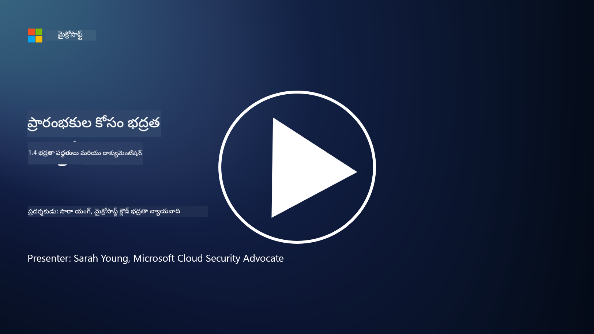

<!--
CO_OP_TRANSLATOR_METADATA:
{
  "original_hash": "d33500902124e52870935bdce4546fcc",
  "translation_date": "2025-12-19T12:31:38+00:00",
  "source_file": "1.4 Security practices and documentation.md",
  "language_code": "te"
}
-->
# భద్రతా ఆచరణలు మరియు డాక్యుమెంటేషన్

మీరు "భద్రతా విధానం", "భద్రతా ప్రమాణం" వంటి పదాలను వినే ఉంటారు, కానీ వాస్తవానికి చాలా సైబర్‌సెక్యూరిటీ నిపుణులు వీటిని సరిగ్గా ఉపయోగించరు. కాబట్టి, ఈ విభాగంలో ఈ పదాలు ఏమి సూచిస్తాయో మరియు ఒక సంస్థ వీటిని ఎందుకు ఉపయోగిస్తుందో వివరించబడుతుంది.

## పరిచయం

ఈ పాఠంలో, మనం కవర్ చేయబోతున్న అంశాలు:

 - భద్రతా విధానం అంటే ఏమిటి?
   
 - భద్రతా ప్రమాణం అంటే ఏమిటి?

 - భద్రతా బేస్‌లైన్ అంటే ఏమిటి?

 - భద్రతా మార్గదర్శకం అంటే ఏమిటి?
 
 - భద్రతా ప్రక్రియ అంటే ఏమిటి?

 - సైబర్‌సెక్యూరిటీ సందర్భంలో చట్టాలు మరియు నిబంధనలు ఏమిటి?

ఈ పదాలు సాధారణంగా సైబర్‌సెక్యూరిటీ సందర్భంలో ఒక సంస్థలో భద్రతా డాక్యుమెంటేషన్ మరియు ఆచరణల వివిధ స్థాయిలను నిర్వచించడానికి ఉపయోగిస్తారు. ప్రతి పదాన్ని స్పష్టంగా అర్థం చేసుకుందాం:

## భద్రతా విధానం అంటే ఏమిటి?

భద్రతా విధానం అనేది ఒక సంస్థ యొక్క సమగ్ర భద్రతా లక్ష్యాలు, సూత్రాలు, మరియు మార్గదర్శకాలను వివరించే ఉన్నత స్థాయి డాక్యుమెంట్. ఇది భద్రతా సంబంధిత నిర్ణయాలను తీసుకోవడానికి ఒక ఫ్రేమ్‌వర్క్‌ను అందిస్తుంది మరియు సంస్థ యొక్క భద్రతా వైఖరికి దిశానిర్దేశం చేస్తుంది. భద్రతా విధానాలు సాధారణంగా వనరుల అనుమతించదగిన వినియోగం, డేటా రక్షణ, యాక్సెస్ కంట్రోల్, సంఘటనల ప్రతిస్పందన వంటి అంశాలను కవర్ చేస్తాయి. విధానం పరిష్కారం మరియు సాంకేతికతకు స్వతంత్రంగా ఉంటుంది. చాలా మందికి పరిచయమైన భద్రతా విధానం ఉదాహరణగా ఒక సంస్థ యొక్క అనుమతించదగిన వినియోగ విధానం ఉంటుంది.

## భద్రతా ప్రమాణం అంటే ఏమిటి?

భద్రతా ప్రమాణం అనేది మరింత వివరమైన మరియు నిర్దిష్టమైన డాక్యుమెంట్, ఇది ఒక సంస్థలో భద్రతా నియంత్రణలు మరియు చర్యలను అమలు చేయడానికి మార్గదర్శకాలు మరియు అవసరాలను అందిస్తుంది. ప్రమాణాలు విధానాల కంటే మరింత స్పష్టమైనవి మరియు సాంకేతికంగా ఉంటాయి, భద్రతా లక్ష్యాలను చేరుకోవడానికి వ్యవస్థలు, నెట్‌వర్క్‌లు, మరియు ప్రక్రియలను ఆకృతీకరించడానికి మరియు నిర్వహించడానికి నిర్దిష్టమైన సూచనలు మరియు సిఫార్సులను అందిస్తాయి. ఉదాహరణకు, _“అన్ని అంతర్గత డేటా నిల్వలో మరియు ప్రసారంలో గుప్తీకరించబడాలి”_ అనే భద్రతా ప్రమాణం.

## భద్రతా బేస్‌లైన్ అంటే ఏమిటి?

భద్రతా బేస్‌లైన్ అనేది ఒక నిర్దిష్ట వ్యవస్థ, అప్లికేషన్, లేదా వాతావరణానికి అవసరమైన కనీస భద్రతా ఆకృతీకరణల సమితి. ఇది ఒక నిర్దిష్ట సమయంలో అమలు చేయవలసిన భద్రతకు ప్రారంభ స్థాయిని నిర్వచిస్తుంది. భద్రతా బేస్‌లైన్‌లు ఒక సంస్థ యొక్క ఐటీ మౌలిక సదుపాయాల అంతటా స్థిరత్వం మరియు ఒక నిర్దిష్ట స్థాయి భద్రతను నిర్ధారించడంలో సహాయపడతాయి. ఉదాహరణకు, _“Azure VMs నేరుగా ఇంటర్నెట్ యాక్సెస్ కలిగి ఉండకూడదు”_ అనే భద్రతా బేస్‌లైన్.

## భద్రతా మార్గదర్శకం అంటే ఏమిటి?

భద్రతా మార్గదర్శకం అనేది ఒక నిర్దిష్ట భద్రతా ప్రమాణం వర్తించని సందర్భంలో సిఫార్సులు మరియు మార్గదర్శకాలను అందించే డాక్యుమెంట్. మార్గదర్శకాలు ప్రమాణం పూర్తిగా లేదా భాగంగా కవర్ చేయని విషయాలను పరిష్కరించడానికి ప్రయత్నిస్తాయి.

## భద్రతా ప్రక్రియ అంటే ఏమిటి?

భద్రతా ప్రక్రియ అనేది ఒక భద్రతా సంబంధిత ప్రక్రియ లేదా పనిని అమలు చేయడానికి అవసరమైన నిర్దిష్ట చర్యలు మరియు పనులను వివరించే దశల వారీ మార్గదర్శకం. ప్రక్రియలు ఆచరణాత్మక మరియు అమలు చేయదగిన డాక్యుమెంట్లు, సంఘటనల ప్రతిస్పందన, వ్యవస్థ నిర్వహణ, వినియోగదారుల ఆన్‌బోర్డింగ్, మరియు ఇతర భద్రతా సంబంధిత కార్యకలాపాల సమయంలో అనుసరించాల్సిన స్పష్టమైన చర్యల క్రమాన్ని అందిస్తాయి. ఉదాహరణకు, _“Microsoft Sentinel ద్వారా P1 భద్రతా సంఘటన ఉత్పత్తి అయినప్పుడు, భద్రతా ఆపరేషన్స్ సెంటర్ (SOC) వెంటనే ఆన్-కాల్ భద్రతా మేనేజర్‌ను తెలియజేయాలి మరియు సంఘటన వివరాలను వారికి పంపాలి”_ అనే భద్రతా ప్రక్రియ.

సారాంశంగా, ఈ పదాలు ఒక సంస్థ యొక్క సైబర్‌సెక్యూరిటీ ఫ్రేమ్‌వర్క్‌లో వివిధ స్థాయిల డాక్యుమెంటేషన్ మరియు మార్గదర్శకాలను సూచిస్తాయి. భద్రతా విధానాలు ఉన్నత స్థాయి లక్ష్యాలను సెట్ చేస్తాయి, ప్రమాణాలు వివరమైన అవసరాలను అందిస్తాయి, బేస్‌లైన్‌లు కనీస భద్రతా ఆకృతీకరణలను స్థాపిస్తాయి, మార్గదర్శకాలు ఉత్తమ ఆచరణలను అందిస్తాయి, మరియు ప్రక్రియలు భద్రతా ప్రక్రియల కోసం అమలు చేయదగిన దశలను అందిస్తాయి.

## సైబర్‌సెక్యూరిటీ సందర్భంలో చట్టాలు/నిబంధనలు ఏమిటి?

చట్టాలు మరియు నిబంధనలు అనేవి ప్రభుత్వాలు మరియు నియంత్రణ సంస్థలు డిజిటల్ వ్యవస్థలు, డేటా, మరియు సమాచారాన్ని రక్షించడానికి నియమాలు, ప్రమాణాలు, మరియు అవసరాలను నిర్వచించడానికి మరియు అమలు చేయడానికి స్థాపించిన చట్టపరమైన ఫ్రేమ్‌వర్క్‌లను సూచిస్తాయి. ఈ చట్టాలు మరియు నిబంధనలు ప్రదేశానుసారం మారుతాయి మరియు సైబర్‌సెక్యూరిటీ యొక్క వివిధ అంశాలపై దృష్టి పెడతాయి, అందులో డేటా రక్షణ, గోప్యత, సంఘటనల నివేదిక, మరియు కీలక మౌలిక సదుపాయాల భద్రత ఉన్నాయి. సైబర్‌సెక్యూరిటీకి సంబంధించిన కొన్ని చట్టాలు మరియు నిబంధనల ఉదాహరణలు: ఉదా. జనరల్ డేటా ప్రొటెక్షన్ రెగ్యులేషన్ (GDPR), హెల్త్ ఇన్సూరెన్స్ పోర్టబిలిటీ అండ్ అకౌంటబిలిటీ యాక్ట్ (HIPAA), కాలిఫోర్నియా కన్స్యూమర్ ప్రైవసీ యాక్ట్ (CCPA), పేమెంట్ కార్డ్ ఇండస్ట్రీ డేటా సెక్యూరిటీ స్టాండర్డ్ (PCI DSS).

## మరింత చదవండి

[Information Security Policy Templates | SANS Institute](https://www.sans.org/information-security-policy/)

[Compliance with Cybersecurity and Privacy Laws and Regulations | NIST](https://www.nist.gov/mep/cybersecurity-resources-manufacturers/compliance-cybersecurity-and-privacy-laws-and-regulations)

---

<!-- CO-OP TRANSLATOR DISCLAIMER START -->
**అస్వీకరణ**:  
ఈ పత్రం AI అనువాద సేవ [Co-op Translator](https://github.com/Azure/co-op-translator) ఉపయోగించి అనువదించబడింది. మేము ఖచ్చితత్వానికి ప్రయత్నిస్తున్నప్పటికీ, ఆటోమేటెడ్ అనువాదాలు తప్పులు లేదా అసమగ్రతలను కలిగి ఉండవచ్చు. దాని స్వదేశ భాషలో ఉన్న అసలు పత్రాన్ని అధికారం కలిగిన మూలంగా పరిగణించాలి. కీలకమైన సమాచారం కోసం, ప్రొఫెషనల్ మానవ అనువాదాన్ని సిఫారసు చేస్తాము. ఈ అనువాదాన్ని ఉపయోగించడం వల్ల కలిగే ఏవైనా అపార్థాలు లేదా తప్పుదారులు కోసం మేము బాధ్యత వహించము.
<!-- CO-OP TRANSLATOR DISCLAIMER END -->