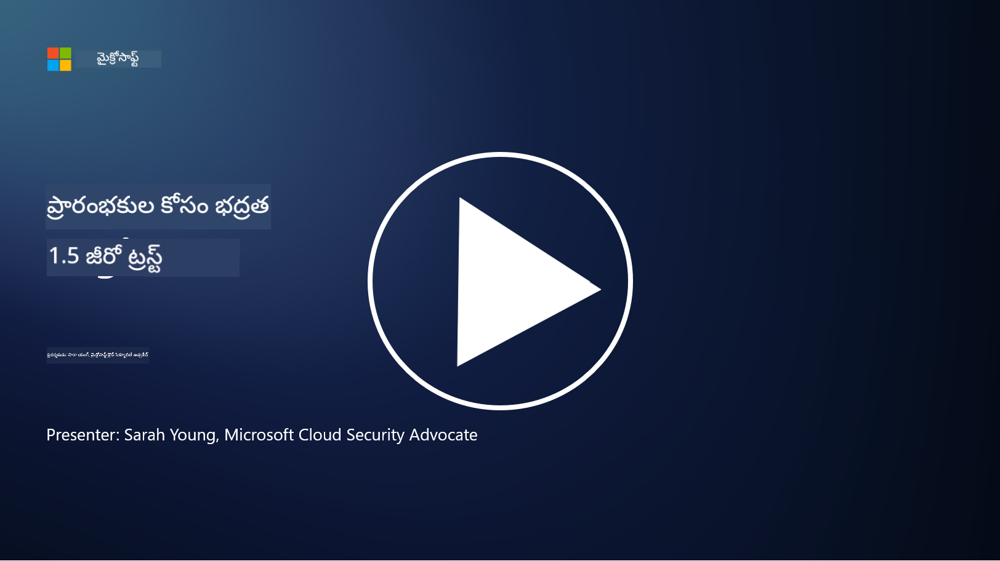
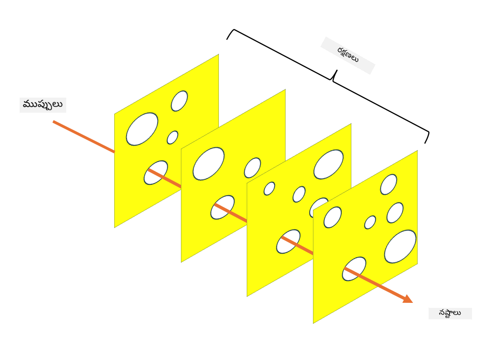

<!--
CO_OP_TRANSLATOR_METADATA:
{
  "original_hash": "75f77f972d2233c584f87c1eb96c983b",
  "translation_date": "2025-12-19T13:06:51+00:00",
  "source_file": "1.5 Zero trust.md",
  "language_code": "te"
}
-->
# జీరో ట్రస్ట్

“జీరో ట్రస్ట్” అనేది ప్రస్తుతం భద్రతా వర్గాల్లో ఎక్కువగా వినిపించే పదం. కానీ దీని అర్థం ఏమిటి, ఇది కేవలం ఒక బజ్‌వర్డ్ మాత్రమేనా? ఈ పాఠంలో, జీరో ట్రస్ట్ అంటే ఏమిటి అనేది లోతుగా తెలుసుకుందాం.

## పరిచయం

 - ఈ పాఠంలో, మనం కవర్ చేయబోయేది:
   
   
 - జీరో ట్రస్ట్ అంటే ఏమిటి?

   
  

 - జీరో ట్రస్ట్ సంప్రదాయ భద్రతా నిర్మాణాల నుండి ఎలా భిన్నంగా ఉంటుంది?

   
   

 - డిఫెన్స్ ఇన్ డెప్త్ అంటే ఏమిటి?

## జీరో ట్రస్ట్

జీరో ట్రస్ట్ అనేది సైబర్‌సెక్యూరిటీ విధానం, ఇది "నమ్మండి కానీ ధృవీకరించండి" అనే సంప్రదాయ భావనను సవాలు చేస్తుంది. ఇది సంస్థ నెట్‌వర్క్ లోపల లేదా వెలుపల ఉన్న ఏదైనా ఎంటిటీని సహజంగా నమ్మకంగా భావించకూడదని భావిస్తుంది. బదులుగా, జీరో ట్రస్ట్ ప్రతి యూజర్, పరికరం, మరియు అప్లికేషన్‌ను, అవి ఎక్కడ ఉన్నా సరే, వనరులకు యాక్సెస్ పొందడానికి ధృవీకరించమని సూచిస్తుంది. జీరో ట్రస్ట్ యొక్క ప్రధాన సూత్రం "ఆటాక్ సర్ఫేస్" ను తగ్గించడం మరియు భద్రతా ఉల్లంఘనల ప్రభావాన్ని తగ్గించడం.

జీరో ట్రస్ట్ మోడల్‌లో, ఈ క్రింది సూత్రాలను ప్రాముఖ్యతనిస్తారు:

1. **ఐడెంటిటీని ధృవీకరించండి**: యూజర్లు మరియు పరికరాలపై, అవి ఎక్కడ ఉన్నా సరే, ధృవీకరణ మరియు అనుమతిని కఠినంగా అమలు చేస్తారు. గుర్తింపు అనేది తప్పనిసరిగా మనిషి కావాల్సిన అవసరం లేదు: అది పరికరం, అప్లికేషన్ మొదలైనవి కావచ్చు.

2. **లీస్ట్ ప్రివిలేజ్**: యూజర్లు మరియు పరికరాలకు వారి పనులను నిర్వహించడానికి అవసరమైన కనిష్ట స్థాయి యాక్సెస్ మాత్రమే ఇస్తారు, ఇది హానికరమైన పరిణామాలను తగ్గిస్తుంది.

3. **మైక్రో-సెగ్మెంటేషన్**: నెట్‌వర్క్ వనరులను చిన్న సెగ్మెంట్లుగా విభజించడం ద్వారా ఉల్లంఘన జరిగినప్పుడు నెట్‌వర్క్‌లో లాటరల్ మూవ్‌మెంట్‌ను పరిమితం చేస్తారు.

4. **కంటిన్యూయస్ మానిటరింగ్**: యూజర్ మరియు పరికరాల ప్రవర్తనను నిరంతరం పర్యవేక్షించి, అసాధారణాలు మరియు భద్రతా ముప్పులను గుర్తిస్తారు. ఆధునిక పర్యవేక్షణ పద్ధతులు మెషిన్ లెర్నింగ్, AI మరియు థ్రెట్ ఇంటెలిజెన్స్‌ను ఉపయోగించి మరింత వివరాలు మరియు సందర్భాన్ని అందిస్తాయి.

5. **డేటా ఎన్‌క్రిప్షన్**: డేటాను ట్రాన్సిట్‌లో మరియు రెస్ట్‌లో ఎన్‌క్రిప్ట్ చేయడం ద్వారా అనధికార యాక్సెస్‌ను నివారిస్తారు.

6. **కఠినమైన యాక్సెస్ కంట్రోల్**: యాక్సెస్ కంట్రోల్స్‌ను యూజర్ రోల్స్, పరికర ఆరోగ్యం, మరియు నెట్‌వర్క్ స్థానం వంటి సందర్భాల ఆధారంగా అమలు చేస్తారు.

మైక్రోసాఫ్ట్ జీరో ట్రస్ట్‌ను ఐదు పిలర్స్‌గా విభజిస్తుంది, వీటిని మనం తరువాతి పాఠంలో చర్చిస్తాము.

## సంప్రదాయ భద్రతా నిర్మాణాల నుండి తేడాలు

జీరో ట్రస్ట్ సంప్రదాయ భద్రతా నిర్మాణాల నుండి, ఉదాహరణకు పీరిమీటర్ ఆధారిత మోడల్స్, అనేక మార్గాల్లో భిన్నంగా ఉంటుంది:

1. **పీరిమీటర్ vs. ఐడెంటిటీ-సెంట్రిక్**: సంప్రదాయ మోడల్స్ నెట్‌వర్క్ పీరిమీటర్‌ను భద్రపరచడంపై దృష్టి సారిస్తాయి మరియు లోపల ఉన్న యూజర్లు మరియు పరికరాలను నమ్మదగినవిగా భావిస్తాయి. జీరో ట్రస్ట్, అయితే, ముప్పులు నెట్‌వర్క్ లోపల మరియు వెలుపల నుండి ఉద్భవించవచ్చని భావించి, కఠినమైన ఐడెంటిటీ ఆధారిత నియంత్రణలను అమలు చేస్తుంది.

2. **ఇంప్లిసిట్ vs. ఎక్స్‌ప్లిసిట్ ట్రస్ట్**: సంప్రదాయ మోడల్స్ నెట్‌వర్క్‌లోని పరికరాలు మరియు యూజర్లను నిరూపించేవరకు సహజంగా నమ్ముతాయి. జీరో ట్రస్ట్ స్పష్టంగా ఐడెంటిటీలను ధృవీకరించి, అసాధారణాలను నిరంతరం పర్యవేక్షిస్తుంది.

3. **ఫ్లాట్ vs. సెగ్మెంటెడ్ నెట్‌వర్క్**: సంప్రదాయ నిర్మాణాలు తరచుగా ఫ్లాట్ నెట్‌వర్క్‌లను కలిగి ఉంటాయి, అక్కడ లోపల ఉన్న యూజర్లకు విస్తృత యాక్సెస్ ఉంటుంది. జీరో ట్రస్ట్ నెట్‌వర్క్‌ను చిన్న, వేరుచేసిన జోన్లుగా విభజించడం ద్వారా ఉల్లంఘనలను నియంత్రిస్తుంది.

4. **రియాక్టివ్ vs. ప్రొయాక్టివ్**: సంప్రదాయ భద్రత తరచుగా పీరిమీటర్ ఫైర్‌వాల్స్ మరియు ఇన్‌ట్రూజన్ డిటెక్షన్ వంటి ప్రతిస్పందన చర్యలపై ఆధారపడి ఉంటుంది. జీరో ట్రస్ట్ ఉల్లంఘనలు సంభవించే అవకాశం ఉందని భావించి, వాటి ప్రభావాన్ని తగ్గించడంలో ప్రొయాక్టివ్ దృక్పథాన్ని తీసుకుంటుంది.

## డిఫెన్స్ ఇన్ డెప్త్

డిఫెన్స్ ఇన్ డెప్త్, లేదా లేయర్డ్ సెక్యూరిటీ, అనేది ఒక సైబర్‌సెక్యూరిటీ వ్యూహం, ఇది ఒక సంస్థ యొక్క ఆస్తులను రక్షించడానికి అనేక భద్రతా నియంత్రణలు మరియు చర్యలను అమలు చేయడాన్ని సూచిస్తుంది. లక్ష్యం ఒకటి ఉల్లంఘించబడితే, ఇతరులు ఇంకా రక్షణను అందించగలిగే విధంగా ఓవర్లాపింగ్ లేయర్లను సృష్టించడం. ప్రతి లేయర్ భద్రత యొక్క వేర్వేరు అంశంపై దృష్టి సారించి, ఒక సంస్థ యొక్క మొత్తం భద్రతా స్థాయిని పెంచుతుంది.

డిఫెన్స్ ఇన్ డెప్త్‌లో సాంకేతిక, విధానపరమైన, మరియు భౌతిక భద్రతా చర్యల కలయిక ఉంటుంది. వీటిలో ఫైర్‌వాల్స్, ఇన్‌ట్రూజన్ డిటెక్షన్ సిస్టమ్స్, యాక్సెస్ కంట్రోల్స్, ఎన్‌క్రిప్షన్, యూజర్ ట్రైనింగ్, భద్రతా విధానాలు మరియు మరెన్నో ఉంటాయి. లక్ష్యం అనేక అడ్డంకులను సృష్టించడం, ఇవి కలిపి దాడి చేసే వారికి సంస్థ యొక్క వ్యవస్థలు మరియు నెట్‌వర్క్‌లను చొరబడడం కష్టతరం చేస్తాయి. ఇది ఇతర పరిశ్రమలలో (ఉదా: రవాణా) ప్రమాద నివారణలో ఉపయోగించే "స్విస్ చీజ్" మోడల్‌గా కూడా పిలుస్తారు.

## మరింత చదవండి

[జీరో ట్రస్ట్ అంటే ఏమిటి?](https://learn.microsoft.com/security/zero-trust/zero-trust-overview?WT.mc_id=academic-96948-sayoung)

[జీరో ట్రస్ట్ అభివృద్ధి – మైక్రోసాఫ్ట్ స్థానం పేపర్](https://query.prod.cms.rt.microsoft.com/cms/api/am/binary/RWJJdT?WT.mc_id=academic-96948-sayoung)

[జీరో ట్రస్ట్ మరియు బియాండ్‌కార్ప్ గూగుల్ క్లౌడ్ | గూగుల్ క్లౌడ్ బ్లాగ్](https://cloud.google.com/blog/topics/developers-practitioners/zero-trust-and-beyondcorp-google-cloud)

---

<!-- CO-OP TRANSLATOR DISCLAIMER START -->
**విమర్శ**:  
ఈ పత్రాన్ని AI అనువాద సేవ [Co-op Translator](https://github.com/Azure/co-op-translator) ఉపయోగించి అనువదించారు. మేము ఖచ్చితత్వానికి ప్రయత్నిస్తున్నప్పటికీ, ఆటోమేటెడ్ అనువాదాలలో తప్పులు లేదా అసమానతలు ఉండవచ్చు. దాని స్వదేశీ భాషలోని అసలు పత్రాన్ని అధికారం కలిగిన మూలంగా పరిగణించాలి. కీలకమైన సమాచారం కోసం, ప్రొఫెషనల్ మానవ అనువాదాన్ని సిఫారసు చేస్తాము. ఈ అనువాదాన్ని ఉపయోగించడం వల్ల కలిగే ఏవైనా అపార్థాలు లేదా తప్పుదారులు కోసం మేము బాధ్యత వహించము.
<!-- CO-OP TRANSLATOR DISCLAIMER END -->