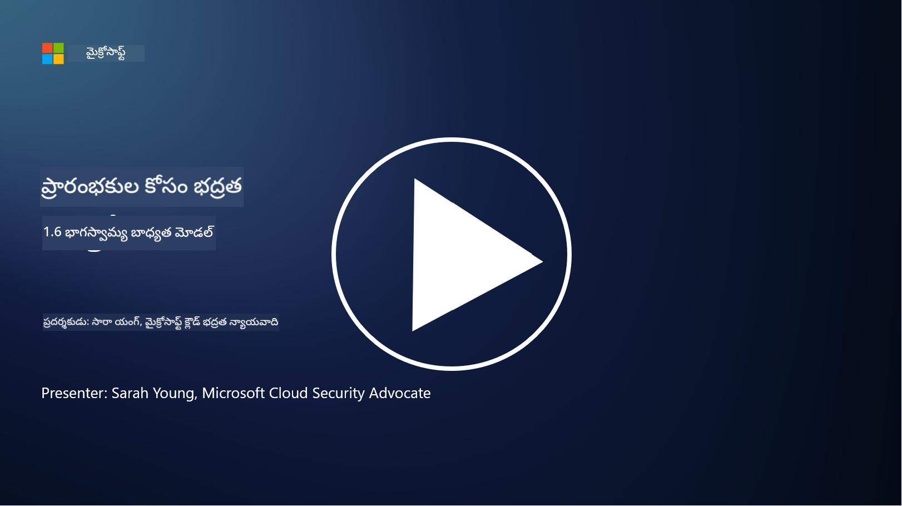

<!--
CO_OP_TRANSLATOR_METADATA:
{
  "original_hash": "a48db640d80c786b928ca178c414f084",
  "translation_date": "2025-12-19T13:01:21+00:00",
  "source_file": "1.6 Shared responsibility model.md",
  "language_code": "te"
}
-->
# భాగస్వామ్య బాధ్యత మోడల్

భాగస్వామ్య బాధ్యత అనేది ఐటీ రంగంలో కొత్తగా వచ్చిన భావన, ఇది క్లౌడ్ కంప్యూటింగ్ ప్రారంభంతో ఉద్భవించింది. సైబర్‌సెక్యూరిటీ దృష్టికోణంలో, రక్షణలో ఎలాంటి లోపాలు లేకుండా ఏ భద్రతా నియంత్రణలను ఎవరు అందిస్తున్నారో అర్థం చేసుకోవడం చాలా ముఖ్యం.

## పరిచయం

ఈ పాఠంలో, మనం కవర్ చేయబోతున్న అంశాలు:

 - సైబర్‌సెక్యూరిటీ సందర్భంలో భాగస్వామ్య బాధ్యత అంటే ఏమిటి?
   
 - IaaS, PaaS మరియు SaaS మధ్య భద్రతా నియంత్రణల కోసం భాగస్వామ్య బాధ్యతలో తేడా ఏమిటి?

 - మీ క్లౌడ్ ప్లాట్‌ఫారమ్ ఏ భద్రతా నియంత్రణలను అందిస్తున్నదో ఎక్కడ తెలుసుకోవచ్చు?

 - “నమ్మండి కానీ ధృవీకరించండి” అంటే ఏమిటి?

## సైబర్‌సెక్యూరిటీ సందర్భంలో భాగస్వామ్య బాధ్యత అంటే ఏమిటి?

సైబర్‌సెక్యూరిటీలో భాగస్వామ్య బాధ్యత అనేది క్లౌడ్ సర్వీస్ ప్రొవైడర్ (CSP) మరియు దాని కస్టమర్ల మధ్య భద్రతా బాధ్యతల పంపిణీకి సూచిస్తుంది. IaaS, PaaS, SaaS వంటి క్లౌడ్ కంప్యూటింగ్ వాతావరణాల్లో, డేటా, అప్లికేషన్లు మరియు సిస్టమ్స్ భద్రతను నిర్ధారించడంలో CSP మరియు కస్టమర్ రెండింటికీ పాత్రలు ఉంటాయి.

## IaaS, PaaS మరియు SaaS మధ్య భద్రతా నియంత్రణల కోసం భాగస్వామ్య బాధ్యతలో తేడా ఏమిటి?

బాధ్యతల విభజన సాధారణంగా ఉపయోగిస్తున్న క్లౌడ్ సేవ రకంపై ఆధారపడి ఉంటుంది:

 - **IaaS (ఇన్‌ఫ్రాస్ట్రక్చర్ ఎస్ ఎ సర్వీస్)**: CSP ప్రాథమిక మౌలిక సదుపాయాలను (సర్వర్లు, నెట్‌వర్కింగ్, స్టోరేజ్) అందిస్తుంది, అయితే కస్టమర్ ఆ మౌలిక సదుపాయాలపై ఆపరేటింగ్ సిస్టమ్స్, అప్లికేషన్లు మరియు భద్రతా కాన్ఫిగరేషన్లను నిర్వహించాల్సి ఉంటుంది.
   
 - **PaaS (ప్లాట్‌ఫార్మ్ ఎస్ ఎ సర్వీస్)**: CSP ఒక ప్లాట్‌ఫార్మ్‌ను అందిస్తుంది, దీనిపై కస్టమర్లు అప్లికేషన్లను నిర్మించి అమలు చేయవచ్చు. CSP మౌలిక సదుపాయాలను నిర్వహిస్తుంది, కస్టమర్ అప్లికేషన్ అభివృద్ధి మరియు డేటా భద్రతపై దృష్టి పెట్టాలి.

 - **SaaS (సాఫ్ట్‌వేర్ ఎస్ ఎ సర్వీస్)**: CSP పూర్తిస్థాయి ఫంక్షనల్ అప్లికేషన్లను ఇంటర్నెట్ ద్వారా అందిస్తుంది. ఈ సందర్భంలో, అప్లికేషన్ భద్రత మరియు మౌలిక సదుపాయాల బాధ్యత CSPదే, అయితే కస్టమర్ యూజర్ యాక్సెస్ మరియు డేటా వినియోగాన్ని నిర్వహించాలి.

భాగస్వామ్య బాధ్యతను అర్థం చేసుకోవడం చాలా ముఖ్యం, ఎందుకంటే ఇది CSP కవర్ చేసే భద్రతా అంశాలు మరియు కస్టమర్ చూసుకోవాల్సిన అంశాలను స్పష్టంగా చేస్తుంది. ఇది అపార్థాలను నివారించడంలో మరియు భద్రతా చర్యలను సమగ్రంగా అమలు చేయడంలో సహాయపడుతుంది.

## మీ క్లౌడ్ ప్లాట్‌ఫారమ్ ఏ భద్రతా నియంత్రణలను అందిస్తున్నదో ఎక్కడ తెలుసుకోవచ్చు?

మీ క్లౌడ్ ప్లాట్‌ఫారమ్ ఏ భద్రతా నియంత్రణలను అందిస్తున్నదో తెలుసుకోవాలంటే, క్లౌడ్ సర్వీస్ ప్రొవైడర్ డాక్యుమెంటేషన్ మరియు వనరులను చూడాలి. వీటిలో ఉన్నాయి:

 - **CSP వెబ్‌సైట్ మరియు డాక్యుమెంటేషన్**: CSP వెబ్‌సైట్‌లో వారి సేవల భాగంగా అందించే భద్రతా లక్షణాలు మరియు నియంత్రణల గురించి సమాచారం ఉంటుంది. CSPలు సాధారణంగా వారి భద్రతా ఆచరణలు, నియంత్రణలు మరియు సిఫార్సులను వివరించే వివరమైన డాక్యుమెంటేషన్ అందిస్తారు. ఇందులో వైట్‌పేపర్లు, భద్రతా గైడ్లు మరియు సాంకేతిక డాక్యుమెంటేషన్ ఉండవచ్చు.
   
 - **భద్రతా అంచనాలు మరియు ఆడిట్లు**: చాలా CSPలు తమ భద్రతా నియంత్రణలను స్వతంత్ర భద్రతా నిపుణులు మరియు సంస్థల ద్వారా అంచనా వేయిస్తారు. ఈ సమీక్షలు CSP భద్రతా చర్యల నాణ్యతపై అవగాహన కల్పిస్తాయి. కొన్నిసార్లు ఇది CSP భద్రతా అనుగుణత సర్టిఫికేట్ పొందడానికి దారితీస్తుంది (తదుపరి పాయింట్ చూడండి).
   
 - **భద్రతా అనుగుణత సర్టిఫికేషన్లు**: చాలా CSPలు ISO:27001, SOC 2, FedRAMP వంటి సర్టిఫికేషన్లను పొందుతారు. ఈ సర్టిఫికేషన్లు ప్రొవైడర్ నిర్దిష్ట భద్రత మరియు అనుగుణత ప్రమాణాలను పాటిస్తున్నారని చూపిస్తాయి.

క్లౌడ్ ప్రొవైడర్ల మధ్య సమాచారం స్థాయి మరియు లభ్యత మారవచ్చు. మీ క్లౌడ్ ఆధారిత ఆస్తుల భద్రతపై సమాచారం తీసుకోవడానికి ఎల్లప్పుడూ అధికారిక మరియు తాజా వనరులను సంప్రదించండి.

## “నమ్మండి కానీ ధృవీకరించండి” అంటే ఏమిటి?

CSP, మూడవ పక్ష సాఫ్ట్‌వేర్ లేదా ఇతర ఐటీ భద్రతా సేవను ఉపయోగించే సందర్భంలో, ఒక సంస్థ మొదట ప్రొవైడర్ భద్రతా చర్యలపై నమ్మకం ఉంచవచ్చు. అయితే, వారి డేటా మరియు సిస్టమ్స్ భద్రతను నిజంగా నిర్ధారించడానికి, భద్రతా అంచనాలు, పెనిట్రేషన్ టెస్టింగ్ మరియు బాహ్య పక్ష భద్రతా నియంత్రణల సమీక్ష ద్వారా ఈ నమ్మకాన్ని ధృవీకరించాలి. వారు బాధ్యత వహించని భద్రతా నియంత్రణలను నమ్మండి కానీ ధృవీకరించండి అనే దృక్పథాన్ని అనుసరించాలి.

## సంస్థలో భాగస్వామ్య బాధ్యత

గమనించండి, భద్రత కోసం సంస్థలోని వివిధ బృందాల మధ్య భాగస్వామ్య బాధ్యతను కూడా పరిగణనలోకి తీసుకోవాలి. భద్రతా బృందం సాధారణంగా అన్ని నియంత్రణలను స్వయంగా అమలు చేయదు మరియు సంస్థను భద్రతగా ఉంచడానికి అవసరమైన అన్ని నియంత్రణలను అమలు చేయడానికి ఆపరేషన్స్ బృందాలు, డెవలపర్లు మరియు వ్యాపారంలోని ఇతర భాగాలతో సహకరించాల్సి ఉంటుంది.

## మరింత చదవండి
- [క్లౌడ్‌లో భాగస్వామ్య బాధ్యత - మైక్రోసాఫ్ట్ ఆజూర్ | మైక్రోసాఫ్ట్ లెర్న్](https://learn.microsoft.com/azure/security/fundamentals/shared-responsibility?WT.mc_id=academic-96948-sayoung)
- [భాగస్వామ్య బాధ్యత మోడల్ అంటే ఏమిటి? – TechTarget.com నుండి నిర్వచనం](https://www.techtarget.com/searchcloudcomputing/definition/shared-responsibility-model)
- [భాగస్వామ్య బాధ్యత మోడల్ వివరణ మరియు క్లౌడ్ భద్రతకు ఇది ఏమి సూచిస్తుంది | CSO ఆన్‌లైన్](https://www.csoonline.com/article/570779/the-shared-responsibility-model-explained-and-what-it-means-for-cloud-security.html)
- [క్లౌడ్ భద్రత కోసం భాగస్వామ్య బాధ్యత: మీకు తెలుసుకోవలసినవి (cisecurity.org)](https://www.cisecurity.org/insights/blog/shared-responsibility-cloud-security-what-you-need-to-know)

---

<!-- CO-OP TRANSLATOR DISCLAIMER START -->
**అస్వీకరణ**:  
ఈ పత్రం AI అనువాద సేవ [Co-op Translator](https://github.com/Azure/co-op-translator) ఉపయోగించి అనువదించబడింది. మేము ఖచ్చితత్వానికి ప్రయత్నిస్తున్నప్పటికీ, ఆటోమేటెడ్ అనువాదాలు తప్పులు లేదా అసమగ్రతలను కలిగి ఉండవచ్చు. దయచేసి, దాని స్వస్థల భాషలో ఉన్న అసలు పత్రాన్ని అధికారం కలిగిన మూలంగా పరిగణించండి. కీలకమైన సమాచారం కోసం, ప్రొఫెషనల్ మానవ అనువాదాన్ని సిఫారసు చేస్తాము. ఈ అనువాదం ఉపయోగం వల్ల కలిగే ఏవైనా అపార్థాలు లేదా తప్పుదారులు కోసం మేము బాధ్యత వహించము.
<!-- CO-OP TRANSLATOR DISCLAIMER END -->