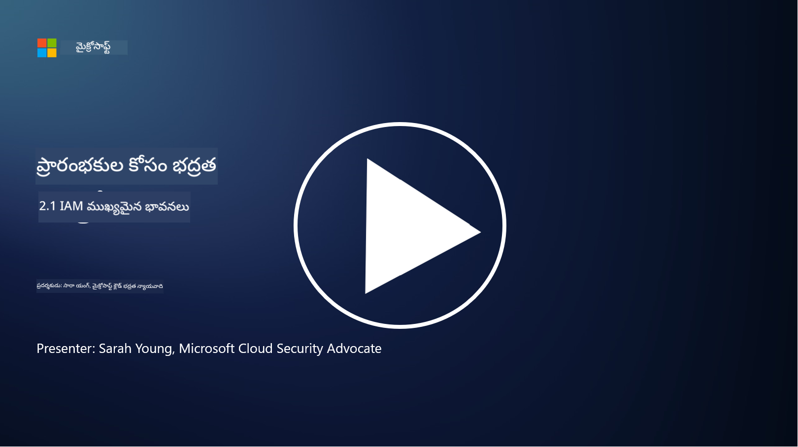

<!--
CO_OP_TRANSLATOR_METADATA:
{
  "original_hash": "2e3864e3d579f0dbb4ac2ec8c5f82acf",
  "translation_date": "2025-12-19T13:20:38+00:00",
  "source_file": "2.1 IAM key concepts.md",
  "language_code": "te"
}
-->
# IAM ముఖ్యమైన అంశాలు

మీరు ఎప్పుడైనా కంప్యూటర్ లేదా వెబ్‌సైట్‌లో లాగిన్ అయ్యారా? ఖచ్చితంగా చేసారు! అంటే మీరు మీ రోజువారీ జీవితంలో ఇప్పటికే ఐడెంటిటీ కంట్రోల్స్ ఉపయోగించారు. ఐడెంటిటీ మరియు యాక్సెస్ మేనేజ్‌మెంట్ (IAM) భద్రతకు కీలకమైన అంశం, దీని గురించి మరింత తెలుసుకోవడానికి తదుపరి పాఠాల్లో నేర్చుకుందాం.

**పరిచయం**

ఈ పాఠంలో, మనం కవర్ చేయబోతున్న అంశాలు:

- సైబర్‌సెక్యూరిటీ సందర్భంలో ఐడెంటిటీ మరియు యాక్సెస్ మేనేజ్‌మెంట్ (IAM) అంటే ఏమిటి?

- లీస్ట్ ప్రివిలేజ్ సూత్రం అంటే ఏమిటి?

- డ్యూటీస్ విభజన అంటే ఏమిటి?

- ఆథెంటికేషన్ మరియు ఆథరైజేషన్ అంటే ఏమిటి?

## సైబర్‌సెక్యూరిటీ సందర్భంలో ఐడెంటిటీ మరియు యాక్సెస్ మేనేజ్‌మెంట్ (IAM) అంటే ఏమిటి?

ఐడెంటిటీ మరియు యాక్సెస్ మేనేజ్‌మెంట్ (IAM) అనేది ఒక సంస్థ యొక్క డిజిటల్ వాతావరణంలో సరైన వ్యక్తులు సరైన వనరులకు సరైన యాక్సెస్ కలిగి ఉండేలా చూసే ప్రక్రియలు, సాంకేతికతలు, విధానాల సమాహారం. IAM డిజిటల్ ఐడెంటిటీలను (వినియోగదారులు, ఉద్యోగులు, భాగస్వాములు) మరియు వాటి యాక్సెస్‌ను సిస్టమ్స్, అప్లికేషన్స్, డేటా, నెట్‌వర్క్‌లకు నిర్వహించడంలో సహాయపడుతుంది. IAM యొక్క ప్రధాన లక్ష్యం భద్రతను మెరుగుపరచడం, వినియోగదారుల యాక్సెస్‌ను సులభతరం చేయడం, మరియు సంస్థ విధానాలు, నియమావళి పాటించడాన్ని నిర్ధారించడం. IAM పరిష్కారాలు సాధారణంగా యూజర్ ఆథెంటికేషన్, ఆథరైజేషన్, ఐడెంటిటీ ప్రొవిజనింగ్, యాక్సెస్ కంట్రోల్, మరియు యూజర్ లైఫ్‌సైకిల్ మేనేజ్‌మెంట్ (యాకౌంట్లు ఉపయోగించబడటం ఆగినప్పుడు వాటిని తొలగించడం) ను కలిగి ఉంటాయి.

## లీస్ట్ ప్రివిలేజ్ సూత్రం అంటే ఏమిటి?

లీస్ట్ ప్రివిలేజ్ సూత్రం అనేది వినియోగదారులు మరియు సిస్టమ్స్‌కు వారి పనులు లేదా పాత్రలు నిర్వహించడానికి అవసరమైన కనీస ప్రివిలేజ్‌లను మాత్రమే ఇవ్వాలని సూచించే ప్రాథమిక భావన. ఈ సూత్రం భద్రతా ఉల్లంఘన లేదా లోపం సంభవించినప్పుడు కలిగే నష్టాన్ని పరిమితం చేయడంలో సహాయపడుతుంది. లీస్ట్ ప్రివిలేజ్ సూత్రాన్ని పాటించడం ద్వారా, సంస్థలు దాడి ఉపరితలాన్ని తగ్గిస్తాయి మరియు అనధికార యాక్సెస్, డేటా ఉల్లంఘనలు, మరియు ప్రివిలేజ్‌ల దుర్వినియోగం ప్రమాదాన్ని తగ్గిస్తాయి. ప్రాక్టికల్‌గా, ఇది వినియోగదారులకు వారి ఉద్యోగ పాత్రలకు అవసరమైన ప్రత్యేక వనరులు మరియు ఫంక్షనాలిటీలు మాత్రమే యాక్సెస్ ఇవ్వడం, అంతకంటే ఎక్కువ కాదు. ఉదాహరణకు, మీరు ఒక డాక్యుమెంట్‌ను చదవడం మాత్రమే అవసరమైతే, ఆ డాక్యుమెంట్‌కు పూర్తి అడ్మిన్ ప్రివిలేజ్‌లు ఇవ్వడం అనవసరం.

## డ్యూటీస్ విభజన అంటే ఏమిటి?

డ్యూటీస్ విభజన అనేది ఆసక్తుల ఘర్షణలను నివారించడం మరియు మోసం మరియు పొరపాట్ల ప్రమాదాన్ని తగ్గించడం కోసం ముఖ్యమైన పనులు మరియు బాధ్యతలను సంస్థలోని వివిధ వ్యక్తుల మధ్య విభజించడంపై దృష్టి పెట్టే సూత్రం. సైబర్‌సెక్యూరిటీ సందర్భంలో, డ్యూటీస్ విభజన అనేది ఒక ముఖ్యమైన ప్రక్రియ లేదా సిస్టమ్ యొక్క అన్ని అంశాలపై ఏకైక వ్యక్తికి నియంత్రణ ఉండకుండా చూసుకోవడం. లక్ష్యం ఒక చెక్ మరియు బ్యాలెన్స్ వ్యవస్థను సృష్టించడం, ఇది ఒక వ్యక్తి ప్రక్రియ యొక్క సెటప్ మరియు ఆమోద దశలను నిర్వహించగల సామర్థ్యాన్ని నిరోధిస్తుంది. ఉదాహరణకు, ఆర్థిక వ్యవస్థలలో, లావాదేవీలను సిస్టమ్‌లో నమోదు చేసే వ్యక్తి ఆ లావాదేవీలను ఆమోదించే వ్యక్తి కాకూడదు. ఇది అనధికార లేదా మోసపూరిత చర్యలు గుర్తించబడకుండా ఉండే ప్రమాదాన్ని తగ్గిస్తుంది.

## ఆథెంటికేషన్ మరియు ఆథరైజేషన్ అంటే ఏమిటి?

ఆథెంటికేషన్ మరియు ఆథరైజేషన్ అనేవి సైబర్‌సెక్యూరిటీలో రెండు ప్రాథమిక భావనలు, ఇవి కంప్యూటర్ సిస్టమ్స్ మరియు డేటా భద్రత మరియు సమగ్రతను నిర్ధారించడంలో కీలక పాత్ర పోషిస్తాయి. వనరులకు యాక్సెస్‌ను నియంత్రించడానికి మరియు సున్నితమైన సమాచారాన్ని రక్షించడానికి వీటిని తరచుగా కలిపి ఉపయోగిస్తారు.

**1. ఆథెంటికేషన్**:  
ఆథెంటికేషన్ అనేది కంప్యూటర్ సిస్టమ్ లేదా నిర్దిష్ట వనరుకు యాక్సెస్ పొందడానికి ప్రయత్నిస్తున్న వినియోగదారు, సిస్టమ్, లేదా ఎంటిటీ యొక్క ఐడెంటిటీని ధృవీకరించే ప్రక్రియ. ఇది పేర్కొన్న ఐడెంటిటీ నిజమైనదని మరియు ఖచ్చితమైనదని నిర్ధారిస్తుంది. ఆథెంటికేషన్ పద్ధతులు సాధారణంగా క్రింది అంశాలలో ఒకటి లేదా అంతకంటే ఎక్కువను ఉపయోగిస్తాయి:

   a. మీకు తెలిసినది: పాస్‌వర్డ్‌లు, పిన్‌లు లేదా అనధికార వినియోగదారుడు కలిగి ఉండకూడని రహస్య సమాచారం.  
   b. మీ వద్ద ఉన్నది: స్మార్ట్ కార్డులు, భద్రతా టోకెన్లు లేదా మొబైల్ ఫోన్లు వంటి భౌతిక టోకెన్లు లేదా పరికరాలు.  
   c. మీరు ఏమిటి: ఫింగర్‌ప్రింట్లు, ముఖ గుర్తింపు లేదా రేటినల్ స్కాన్‌లు వంటి బయోమెట్రిక్ అంశాలు.  

ఆథెంటికేషన్ మెకానిజమ్‌లు వినియోగదారు వారు చెప్పినట్లుగా ఉన్నారని నిర్ధారించడానికి ఉపయోగిస్తారు, తద్వారా అనధికార యాక్సెస్‌ను నివారించడంలో సహాయపడతాయి.

**2. ఆథరైజేషన్**:  
ఆథరైజేషన్ అనేది ధృవీకరించబడిన వినియోగదారులు లేదా ఎంటిటీలకు నిర్దిష్ట అనుమతులు మరియు ప్రివిలేజ్‌లను మంజూరు చేయడం లేదా నిరాకరించడం. ఇది వినియోగదారులు సిస్టమ్‌లో లేదా నిర్దిష్ట వనరులపై ఏ చర్యలు లేదా ఆపరేషన్లు చేయగలరో నిర్ణయిస్తుంది. ఆథరైజేషన్ సాధారణంగా ముందుగా నిర్వచించిన విధానాలు, యాక్సెస్ కంట్రోల్ నియమాలు, మరియు వినియోగదారులకు కేటాయించిన పాత్రల ఆధారంగా ఉంటుంది.

ఆథరైజేషన్ అనేది "ధృవీకరించబడిన వినియోగదారు ఏమి చేయగలరు?" అనే ప్రశ్నకు సమాధానం ఇవ్వడం లాంటిది. ఇది సున్నితమైన డేటా మరియు వనరులను అనధికార యాక్సెస్ లేదా మార్పుల నుండి రక్షించడానికి యాక్సెస్ కంట్రోల్ విధానాలను నిర్వచించడం మరియు అమలు చేయడం.

**సారాంశంగా:**

- ఆథెంటికేషన్ వినియోగదారుల లేదా ఎంటిటీల ఐడెంటిటీని స్థాపిస్తుంది.  
- ఆథరైజేషన్ ధృవీకరించబడిన వినియోగదారులు లేదా ఎంటిటీలు ఏ చర్యలు మరియు వనరులను యాక్సెస్ చేయగలరో నిర్ణయిస్తుంది.

## మరింత చదవండి

- [Describe identity concepts - Training | Microsoft Learn](https://learn.microsoft.com/training/modules/describe-identity-principles-concepts/?WT.mc_id=academic-96948-sayoung)  
- [Introduction to identity - Microsoft Entra | Microsoft Learn](https://learn.microsoft.com/azure/active-directory/fundamentals/identity-fundamental-concepts?WT.mc_id=academic-96948-sayoung)  
- [What is Identity Access Management (IAM)? | Microsoft Security](https://www.microsoft.com/security/business/security-101/what-is-identity-access-management-iam?WT.mc_id=academic-96948-sayoung)  
- [What is IAM? Identity and access management explained | CSO Online](https://www.csoonline.com/article/518296/what-is-iam-identity-and-access-management-explained.html)  
- [What is IAM? (auth0.com)](https://auth0.com/blog/what-is-iam/)  
- [Security+: implementing Identity and Access Management (IAM) controls [updated 2021] | Infosec (infosecinstitute.com)](https://resources.infosecinstitute.com/certifications/securityplus/security-implementing-identity-and-access-management-iam-controls/)  
- [least privilege - Glossary | CSRC (nist.gov)](https://csrc.nist.gov/glossary/term/least_privilege)  
- [Security: The Principle of Least Privilege (POLP) - Microsoft Community Hub](https://techcommunity.microsoft.com/t5/azure-sql-blog/security-the-principle-of-least-privilege-polp/ba-p/2067390?WT.mc_id=academic-96948-sayoung)  
- [Principle of least privilege | CERT NZ](https://www.cert.govt.nz/it-specialists/critical-controls/principle-of-least-privilege/)  
- [Why is separation of duties required by NIST 800-171 and CMMC? - (totem.tech)](https://www.totem.tech/cmmc-separation-of-duties/)  

---

<!-- CO-OP TRANSLATOR DISCLAIMER START -->
**అస్వీకరణ**:  
ఈ పత్రం AI అనువాద సేవ [Co-op Translator](https://github.com/Azure/co-op-translator) ఉపయోగించి అనువదించబడింది. మేము ఖచ్చితత్వానికి ప్రయత్నిస్తున్నప్పటికీ, ఆటోమేటెడ్ అనువాదాలు తప్పులు లేదా అసమగ్రతలను కలిగి ఉండవచ్చు. దాని స్వదేశ భాషలో ఉన్న అసలు పత్రాన్ని అధికారం కలిగిన మూలంగా పరిగణించాలి. కీలకమైన సమాచారం కోసం, ప్రొఫెషనల్ మానవ అనువాదాన్ని సిఫారసు చేస్తాము. ఈ అనువాదం ఉపయోగం వల్ల కలిగే ఏవైనా అపార్థాలు లేదా తప్పుదారులు కోసం మేము బాధ్యత వహించము.
<!-- CO-OP TRANSLATOR DISCLAIMER END -->