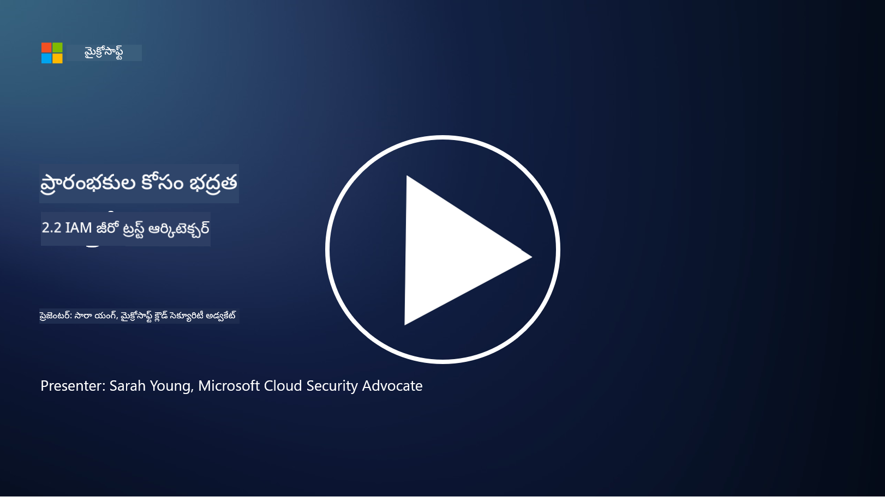

<!--
CO_OP_TRANSLATOR_METADATA:
{
  "original_hash": "4774a978af123f72ebb872199c4c4d4f",
  "translation_date": "2025-12-19T13:04:16+00:00",
  "source_file": "2.2 IAM zero trust architecture.md",
  "language_code": "te"
}
-->
# IAM జీరో ట్రస్ట్ ఆర్కిటెక్చర్

ఒక జీరో ట్రస్ట్ ఆర్కిటెక్చర్ అమలు చేయడంలో మరియు ఏ IT వాతావరణానికి పరిమితిని నిర్మించడంలో ఐడెంటిటీ కీలక భాగం. ఈ విభాగంలో, జీరో ట్రస్ట్ అమలు చేయడానికి ఐడెంటిటీ నియంత్రణలను ఉపయోగించడం ఎందుకు ముఖ్యమో తెలుసుకుందాం.

## పరిచయం

ఈ పాఠంలో, మనం కవర్ చేయబోయేది:

 - ఆధునిక IT వాతావరణాల్లో మన పరిమితిగా ఐడెంటిటీని ఎందుకు ఉపయోగించాలి?
   
 - ఇది సంప్రదాయ IT ఆర్కిటెక్చర్లతో ఎలా భిన్నంగా ఉంటుంది?
   
 - జీరో ట్రస్ట్ ఆర్కిటెక్చర్‌ను అమలు చేయడానికి ఐడెంటిటీ ఎలా ఉపయోగించబడుతుంది?

## ఆధునిక IT వాతావరణాల్లో మన పరిమితిగా ఐడెంటిటీని ఎందుకు ఉపయోగించాలి?

ఆధునిక IT వాతావరణాల్లో, సైబర్ ముప్పుల నుండి రక్షణ కోసం ప్రధాన రక్షణ రేఖగా భౌతిక పరిమితి (ఫైర్వాల్స్ మరియు నెట్‌వర్క్ సరిహద్దులను ఉపయోగించడం) యొక్క సంప్రదాయ భావన, సాంకేతికత యొక్క పెరుగుతున్న సంక్లిష్టత, రిమోట్ వర్క్ పెరుగుదల, మరియు క్లౌడ్ సేవల స్వీకరణ కారణంగా తక్కువ ప్రభావవంతంగా మారుతోంది. దాని బదులుగా, సంస్థలు ఐడెంటిటీని కొత్త పరిమితిగా ఉపయోగించడానికి మారుతున్నాయి. అంటే, భౌతిక ప్రదేశం సంబంధం లేకుండా, వనరులను యాక్సెస్ చేయడానికి ప్రయత్నించే వినియోగదారులు, పరికరాలు, మరియు అప్లికేషన్ల ఐడెంటిటీని ధృవీకరించడం మరియు నిర్వహించడం చుట్టూ భద్రత తిరుగుతుంది.

ఇదిగో ఆధునిక IT వాతావరణాల్లో ఐడెంటిటీని పరిమితిగా ఉపయోగించడం ఎందుకు కీలకమో:

**రిమోట్ వర్క్‌ఫోర్స్**: రిమోట్ వర్క్ మరియు మొబైల్ పరికరాలు సాధారణంగా మారడంతో, వినియోగదారులు వివిధ ప్రదేశాలు మరియు పరికరాల నుండి వనరులను యాక్సెస్ చేయగలరు. వినియోగదారులు భౌతిక కార్యాలయంలో ఉండకపోతే సంప్రదాయ పరిమితి విధానం పనిచేయదు.

**క్లౌడ్ మరియు హైబ్రిడ్ వాతావరణాలు**: సంస్థలు క్లౌడ్ సేవలు మరియు హైబ్రిడ్ వాతావరణాలను ఎక్కువగా స్వీకరిస్తున్నాయి. డేటా మరియు అప్లికేషన్లు సంస్థ ప్రాంగణంలో మాత్రమే ఉండవు, సంప్రదాయ పరిమితి రక్షణలు తక్కువ ప్రాముఖ్యతను పొందుతాయి.

**జీరో ట్రస్ట్ భద్రత**: జీరో ట్రస్ట్ భద్రత భావన నెట్‌వర్క్ లోపల లేదా వెలుపల ఉన్న ఏ సంస్థనైనా ఆటోమేటిక్‌గా నమ్మకంగా భావించకూడదని అంగీకరిస్తుంది. ఐడెంటిటీ యాక్సెస్ అభ్యర్థనలను ధృవీకరించడానికి పునాది అవుతుంది, అవి ఎక్కడి నుండి వచ్చినా సంబంధం లేకుండా.

**ముప్పు దృశ్యం**: సైబర్ ముప్పులు అభివృద్ధి చెందుతున్నాయి, మరియు దాడి కర్తలు సంప్రదాయ పరిమితి రక్షణలను దాటడానికి మార్గాలను కనుగొంటున్నారు. ఫిషింగ్, సోషల్ ఇంజనీరింగ్, మరియు ఇన్‌సైడర్ ముప్పులు నెట్‌వర్క్ పరిమితులను దాటడానికి ప్రయత్నించకుండా మానవ లోపాలను ఎక్కువగా ఉపయోగిస్తాయి.

**డేటా-కేంద్రిత దృక్పథం**: సున్నితమైన డేటాను రక్షించడం అత్యంత ముఖ్యమైనది. ఐడెంటిటీపై దృష్టి పెట్టడం ద్వారా, సంస్థలు ఎవరు ఏ డేటాను యాక్సెస్ చేస్తారో నియంత్రించగలవు, డేటా లీక్‌ల ప్రమాదాన్ని తగ్గించగలవు.

## ఇది సంప్రదాయ IT ఆర్కిటెక్చర్లతో ఎలా భిన్నంగా ఉంటుంది?

సంప్రదాయ IT ఆర్కిటెక్చర్లు ప్రధానంగా పరిమితి-ఆధారిత భద్రతా నమూనాలపై ఆధారపడి ఉండేవి, ఫైర్వాల్స్ మరియు నెట్‌వర్క్ సరిహద్దులు ముప్పులను బయట ఉంచడంలో ముఖ్యమైన పాత్ర పోషించేవి. సంప్రదాయ మరియు ఐడెంటిటీ-కేంద్రిత విధానాల మధ్య ప్రధాన తేడాలు:

|      అంశం                 |      సంప్రదాయ IT ఆర్కిటెక్చర్లు                                                                  |      ఐడెంటిటీ-కేంద్రిత విధానం                                                                             |
|-----------------------------|----------------------------------------------------------------------------------------------------|------------------------------------------------------------------------------------------------------------|
|     దృష్టి                   |     పరిమితి దృష్టి: ఫైర్వాల్స్ మరియు యాక్సెస్ కంట్రోల్ వంటి పరిమితి రక్షణలపై ఆధారపడి ఉండేది.             |     ఐడెంటిటీ ధృవీకరణపై దృష్టి: నెట్‌వర్క్ సరిహద్దుల నుండి యూజర్/పరికర ఐడెంటిటీని ధృవీకరించడంపై మార్పు.     |
|     ప్రదేశం                |     ప్రదేశం ఆధారితత: భద్రత భౌతిక కార్యాలయ ప్రదేశాలు మరియు నెట్‌వర్క్ సరిహద్దులకు అనుసంధానించబడేది.    |     ప్రదేశం స్వతంత్రత: భద్రత నిర్దిష్ట ప్రదేశాలకు అనుసంధానించబడదు; ఎక్కడి నుండి అయినా యాక్సెస్.                |
|     నమ్మకం అంచనా        |     నమ్మకం అంచనా: నెట్‌వర్క్ పరిమితిలో ఉన్న వినియోగదారులు/పరికరాలు నమ్మకంగా ఉంటాయని భావించేది.                 |     జీరో ట్రస్ట్ విధానం: నమ్మకం ఎప్పుడూ అంచనా వేయబడదు; యాక్సెస్ ఐడెంటిటీ మరియు సందర్భం ఆధారంగా ధృవీకరించబడుతుంది.       |
|     పరికర పరిశీలన    |     పరికర వైవిధ్యం: నెట్‌వర్క్ పరిమితిలో ఉన్న పరికరాలు సురక్షితంగా ఉంటాయని భావించేది.                  |     పరికర అవగాహన: ప్రదేశం సంబంధం లేకుండా పరికర ఆరోగ్యం మరియు భద్రతా స్థితిని పరిగణనలోకి తీసుకోవడం.               |
|     డేటా రక్షణ         |     డేటా రక్షణ: డేటా రక్షణ కోసం నెట్‌వర్క్ పరిమితులను సురక్షితంగా ఉంచడంపై దృష్టి.                 |     డేటా-కేంద్రిత రక్షణ: ఐడెంటిటీ మరియు డేటా సున్నితత్వం ఆధారంగా డేటా యాక్సెస్ నియంత్రణపై దృష్టి.    |
|                             |                                                                                                    |                                                                                                            |

## జీరో ట్రస్ట్ ఆర్కిటెక్చర్‌ను అమలు చేయడానికి ఐడెంటిటీ ఎలా ఉపయోగించబడుతుంది?

జీరో ట్రస్ట్ ఆర్కిటెక్చర్‌లో, ప్రాథమిక సూత్రం ఏ సంస్థనైనా ఆటోమేటిక్‌గా నమ్మకంగా భావించకూడదని, అది నెట్‌వర్క్ పరిమితిలో లేదా వెలుపల ఉన్నా. ఐడెంటిటీ వనరులను యాక్సెస్ చేయడానికి ప్రయత్నించే సంస్థల నిరంతర ధృవీకరణను సాధించడంలో కేంద్ర పాత్ర పోషిస్తుంది. ఆధునిక ఐడెంటిటీ భద్రత నియంత్రణలు ప్రతి యూజర్, పరికరం, అప్లికేషన్, మరియు సేవను పూర్తిగా గుర్తించి ధృవీకరించడానికి అనుమతిస్తాయి. యాక్సెస్ ఇవ్వబడే ముందు, వారి డిజిటల్ ఐడెంటిటీని యూజర్‌నేమ్/పాస్‌వర్డ్ కాంబినేషన్లు, మల్టీ-ఫ్యాక్టర్ ఆథెంటికేషన్ (MFA), బయోమెట్రిక్స్, మరియు ఇతర బలమైన ధృవీకరణ పద్ధతుల ద్వారా ధృవీకరించడం జరుగుతుంది.

## మరింత చదవండి

- [Securing identity with Zero Trust | Microsoft Learn](https://learn.microsoft.com/security/zero-trust/deploy/identity?WT.mc_id=academic-96948-sayoung)
- [Zero Trust Principles and Guidance for Identity and Access | CSA (cloudsecurityalliance.org)](https://cloudsecurityalliance.org/artifacts/zero-trust-principles-and-guidance-for-iam/)
- [Zero Trust Identity Controls - Essentials Series - Episode 2 - YouTube](https://www.youtube.com/watch?v=fQZQznIKcGM&list=PLXtHYVsvn_b_gtX1-NB62wNervQx1Fhp4&index=13)

---

<!-- CO-OP TRANSLATOR DISCLAIMER START -->
**విమర్శ**:  
ఈ పత్రాన్ని AI అనువాద సేవ [Co-op Translator](https://github.com/Azure/co-op-translator) ఉపయోగించి అనువదించారు. మేము ఖచ్చితత్వానికి ప్రయత్నిస్తున్నప్పటికీ, ఆటోమేటెడ్ అనువాదాలలో తప్పులు లేదా అసమానతలు ఉండవచ్చు. దయచేసి, మూల పత్రాన్ని దాని స్వదేశీ భాషలో అధికారం కలిగిన మూలంగా పరిగణించండి. ముఖ్యమైన సమాచారం కోసం, ప్రొఫెషనల్ మానవ అనువాదాన్ని సిఫారసు చేస్తాము. ఈ అనువాదాన్ని ఉపయోగించడం వల్ల కలిగే ఏవైనా అపార్థాలు లేదా తప్పుదారులు కోసం మేము బాధ్యత వహించము.
<!-- CO-OP TRANSLATOR DISCLAIMER END -->