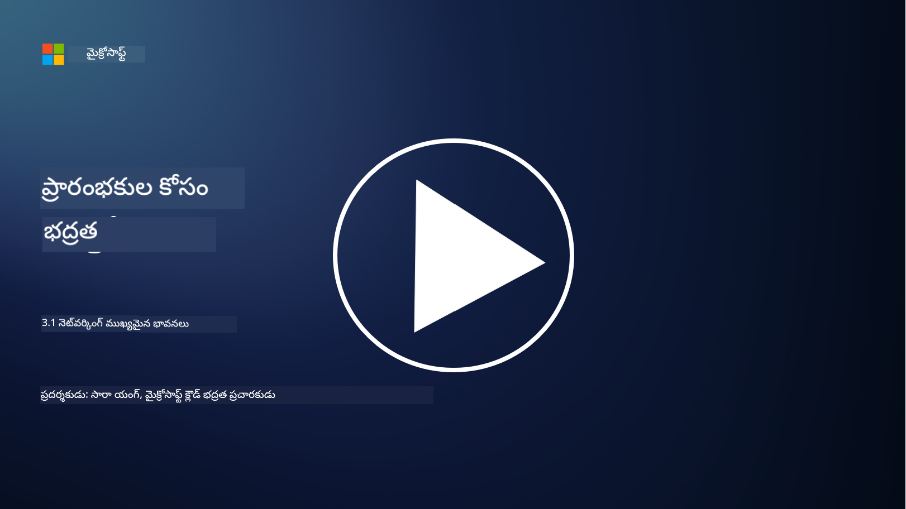
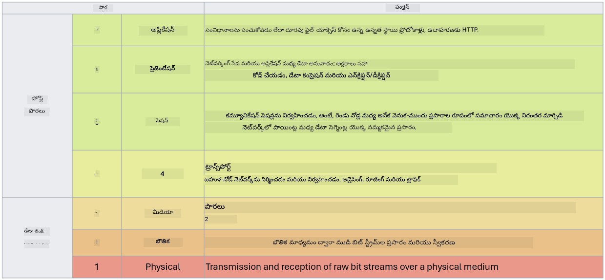

<!--
CO_OP_TRANSLATOR_METADATA:
{
  "original_hash": "252724eceeb183fb9018f88c5e1a3f0c",
  "translation_date": "2025-12-19T12:47:39+00:00",
  "source_file": "3.1 Networking key concepts.md",
  "language_code": "te"
}
-->
# నెట్‌వర్కింగ్ ముఖ్యమైన భావనలు

మీరు ఐటీ రంగంలో ఏదైనా పని చేసి ఉంటే, నెట్‌వర్కింగ్ భావనల గురించి మీరు వినే ఉంటారు. ఆధునిక వాతావరణాల్లో మేము ప్రాథమిక పరిమిత నియంత్రణగా ఐడెంటిటీని ఉపయోగిస్తున్నప్పటికీ, నెట్‌వర్క్ నియంత్రణలు అనవసరమని అర్థం కాదు. ఇది పెద్ద విషయం అయినప్పటికీ, ఈ పాఠంలో కొన్ని ముఖ్యమైన నెట్‌వర్కింగ్ భావనలను కవర్ చేస్తాము.

ఈ పాఠంలో, మేము కవర్ చేస్తాము:

 - IP అడ్రెసింగ్ అంటే ఏమిటి?
   
 - OSI మోడల్ అంటే ఏమిటి?

 - TCP/UDP అంటే ఏమిటి?

 - పోర్ట్ నంబర్లు అంటే ఏమిటి?

 - నిల్వలో మరియు ప్రసారంలో ఎన్‌క్రిప్షన్ అంటే ఏమిటి?

## IP అడ్రెసింగ్ అంటే ఏమిటి?

IP అడ్రెసింగ్ లేదా ఇంటర్నెట్ ప్రోటోకాల్ అడ్రెసింగ్ అనేది, ఇంటర్నెట్ ప్రోటోకాల్‌ను కమ్యూనికేషన్ కోసం ఉపయోగించే కంప్యూటర్ నెట్‌వర్క్‌కు కనెక్ట్ అయిన ప్రతి పరికరానికి కేటాయించిన సంఖ్యా లేబుల్. ఇది నెట్‌వర్క్‌లోని పరికరాలకు ప్రత్యేక గుర్తింపును అందిస్తుంది, వీటిని ఇంటర్నెట్ లేదా ఇతర అనుసంధాన నెట్‌వర్క్‌లలో డేటాను పంపడానికి మరియు స్వీకరించడానికి అనుమతిస్తుంది. IP అడ్రెసింగ్ యొక్క రెండు ప్రధాన వెర్షన్లు ఉన్నాయి: IPv4 (ఇంటర్నెట్ ప్రోటోకాల్ వెర్షన్ 4) మరియు IPv6 (ఇంటర్నెట్ ప్రోటోకాల్ వెర్షన్ 6). IP అడ్రస్ సాధారణంగా IPv4 ఫార్మాట్ (ఉదా: 192.168.1.1) లేదా IPv6 ఫార్మాట్ (ఉదా: 2001:0db8:85a3:0000:0000:8a2e:0370:7334) లో ప్రాతినిధ్యం వహిస్తుంది.

## OSI మోడల్ అంటే ఏమిటి?

OSI (ఓపెన్ సిస్టమ్స్ ఇంటర్‌కనెక్షన్) మోడల్ అనేది కమ్యూనికేషన్ సిస్టమ్ యొక్క ఫంక్షన్లను ఏడు ప్రత్యేక లేయర్లుగా ప్రామాణీకరించే భావనాత్మక ఫ్రేమ్‌వర్క్. ప్రతి లేయర్ నిర్దిష్ట పనులను నిర్వహిస్తుంది మరియు పరికరాల మధ్య సమర్థవంతమైన మరియు నమ్మదగిన డేటా కమ్యూనికేషన్ కోసం సమీప లేయర్లతో కమ్యూనికేట్ చేస్తుంది. ఈ లేయర్లు క్రింద నుండి పైకి ఈ విధంగా ఉంటాయి:

 1. ఫిజికల్ లేయర్
    
 2. డేటా లింక్ లేయర్

 3. నెట్‌వర్క్ లేయర్

 4. ట్రాన్స్‌పోర్ట్ లేయర్

 5. సెషన్ లేయర్

 6. ప్రెజెంటేషన్ లేయర్

 7. అప్లికేషన్ లేయర్

OSI మోడల్ నెట్‌వర్కింగ్ ప్రోటోకాల్‌లు మరియు టెక్నాలజీలు ఎలా పరస్పర చర్య చేస్తాయో అర్థం చేసుకోవడానికి సాధారణ సూచనను అందిస్తుంది, నిర్దిష్ట హార్డ్‌వేర్ లేదా సాఫ్ట్‌వేర్ అమలులపై ఆధారపడకుండా.

_ref: https://en.wikipedia.org/wiki/OSI_model_

## TCP/UDP అంటే ఏమిటి?

TCP (ట్రాన్స్‌మిషన్ కంట్రోల్ ప్రోటోకాల్) మరియు UDP (యూజర్ డాటాగ్రామ్ ప్రోటోకాల్) అనేవి కంప్యూటర్ నెట్‌వర్క్‌లలో పరికరాల మధ్య కమ్యూనికేషన్‌ను సులభతరం చేయడానికి ఉపయోగించే రెండు ప్రాథమిక ట్రాన్స్‌పోర్ట్ లేయర్ ప్రోటోకాల్‌లు. ఇవి డేటాను పంపడానికి ప్యాకెట్లుగా విభజించడం మరియు స్వీకరించే చివరలో ఆ ప్యాకెట్లను మళ్లీ అసెంబుల్ చేయడం బాధ్యత వహిస్తాయి. అయితే, వీటి లక్షణాలు మరియు ఉపయోగాలు భిన్నంగా ఉంటాయి.

**TCP (ట్రాన్స్‌మిషన్ కంట్రోల్ ప్రోటోకాల్)**:

TCP అనేది కనెక్షన్-ఒరియెంటెడ్ ప్రోటోకాల్, ఇది పరికరాల మధ్య నమ్మదగిన మరియు క్రమబద్ధమైన డేటా డెలివరీని అందిస్తుంది. డేటా మార్పిడి ప్రారంభమయ్యే ముందు ఇది పంపినవారు మరియు స్వీకరించినవారికి మధ్య కనెక్షన్‌ను స్థాపిస్తుంది. TCP డేటా ప్యాకెట్లు సరైన క్రమంలో చేరేలా చూసుకుంటుంది మరియు డేటా సమగ్రత మరియు పూర్తి స్థాయిని హామీ ఇవ్వడానికి కోల్పోయిన ప్యాకెట్లను మళ్లీ పంపే సామర్థ్యాన్ని కలిగి ఉంటుంది. ఇది వెబ్ బ్రౌజింగ్, ఇమెయిల్, ఫైల్ ట్రాన్స్‌ఫర్ (FTP), మరియు డేటాబేస్ కమ్యూనికేషన్ వంటి నమ్మదగిన డేటా డెలివరీ అవసరమయ్యే అప్లికేషన్‌లకు అనుకూలంగా ఉంటుంది.

**UDP (యూజర్ డాటాగ్రామ్ ప్రోటోకాల్)**:

UDP అనేది కనెక్షన్‌లెస్ ప్రోటోకాల్, ఇది వేగవంతమైన డేటా ట్రాన్స్‌మిషన్‌ను అందిస్తుంది కానీ TCP వంటి నమ్మదగినతను అందించదు. ఇది డేటాను పంపడానికి ముందు ఫార్మల్ కనెక్షన్‌ను స్థాపించదు మరియు కోల్పోయిన ప్యాకెట్లను గుర్తించడం లేదా మళ్లీ పంపడం వంటి మెకానిజం కలిగి ఉండదు. UDP వేగం మరియు సామర్థ్యానికి ప్రాధాన్యతనిచ్చే అప్లికేషన్‌లకు అనుకూలంగా ఉంటుంది, ఉదా: రియల్-టైమ్ కమ్యూనికేషన్, స్ట్రీమింగ్ మీడియా, ఆన్‌లైన్ గేమింగ్, మరియు DNS క్వెరీలు.

సారాంశంగా, TCP నమ్మదగినత మరియు క్రమబద్ధమైన డెలివరీకి ప్రాధాన్యతనిస్తుంది, ఇది డేటా ఖచ్చితత్వం అవసరమయ్యే అప్లికేషన్‌లకు అనుకూలంగా ఉంటుంది, అయితే UDP వేగం మరియు సామర్థ్యానికి ప్రాధాన్యతనిస్తుంది, ఇది తక్కువ లేటెన్సీ కోసం స్వల్ప డేటా నష్టం లేదా క్రమం మార్పును అంగీకరించగల అప్లికేషన్‌లకు అనుకూలంగా ఉంటుంది. TCP మరియు UDP మధ్య ఎంపిక అప్లికేషన్ లేదా సేవ యొక్క నిర్దిష్ట అవసరాలపై ఆధారపడి ఉంటుంది.

## పోర్ట్ నంబర్లు అంటే ఏమిటి?

నెట్‌వర్కింగ్‌లో, పోర్ట్ నంబర్ అనేది ఒకే పరికరంలో నడుస్తున్న వివిధ సేవలు లేదా అప్లికేషన్‌లను వేరు చేయడానికి ఉపయోగించే సంఖ్యా గుర్తింపు. పోర్ట్‌లు వచ్చే డేటాను తగిన అప్లికేషన్‌కు రూట్ చేయడంలో సహాయపడతాయి. పోర్ట్ నంబర్లు 16-బిట్ అన్‌సైన్‌డ్ ఇంటిజర్‌లు, అంటే ఇవి 0 నుండి 65535 వరకు ఉంటాయి. ఇవి మూడు శ్రేణులుగా విభజించబడ్డాయి:

- వెల్-నోన్ పోర్ట్‌లు (0-1023): HTTP (పోర్ట్ 80) మరియు FTP (పోర్ట్ 21) వంటి ప్రామాణిక సేవల కోసం రిజర్వ్ చేయబడ్డాయి.

- రిజిస్టర్డ్ పోర్ట్‌లు (1024-49151): వెల్-నోన్ శ్రేణిలో భాగం కాని, అధికారికంగా రిజిస్టర్ చేయబడిన అప్లికేషన్‌లు మరియు సేవల కోసం ఉపయోగిస్తారు.

- డైనమిక్/ప్రైవేట్ పోర్ట్‌లు (49152-65535): అప్లికేషన్‌లు తాత్కాలిక లేదా ప్రైవేట్ ఉపయోగం కోసం అందుబాటులో ఉంటాయి.

## నిల్వలో మరియు ప్రసారంలో ఎన్‌క్రిప్షన్ అంటే ఏమిటి?

ఎన్‌క్రిప్షన్ అనేది అనధికార ప్రాప్యత లేదా మార్పిడిని నివారించడానికి డేటాను సురక్షితమైన ఫార్మాట్‌గా మార్చే ప్రక్రియ. ఎన్‌క్రిప్షన్ "నిల్వలో" (పరికరం లేదా సర్వర్‌లో నిల్వ చేయబడినప్పుడు) మరియు "ప్రసారంలో" (పరికరాల మధ్య లేదా నెట్‌వర్క్‌లపై ప్రసారం చేయబడినప్పుడు) డేటాకు వర్తించవచ్చు.

**నిల్వలో ఎన్‌క్రిప్షన్**: ఇది పరికరాలు, సర్వర్‌లు లేదా నిల్వ వ్యవస్థలలో నిల్వ చేయబడిన డేటాను ఎన్‌క్రిప్ట్ చేయడాన్ని సూచిస్తుంది. దొంగతనం, డేటా ఉల్లంఘన లేదా అనధికార ప్రాప్యత వంటి సందర్భాల్లో సున్నితమైన డేటాను రక్షించడానికి ఇది కీలకమైనది.

**ప్రసారంలో ఎన్‌క్రిప్షన్**: ఇది పరికరాల మధ్య లేదా నెట్‌వర్క్‌లపై ప్రయాణించే డేటాను ఎన్‌క్రిప్ట్ చేయడాన్ని సూచిస్తుంది. ఇది ప్రసార సమయంలో డేటా చోరీ మరియు అనధికార జోక్యాన్ని నివారిస్తుంది. ప్రసారంలో ఎన్‌క్రిప్షన్ కోసం సాధారణ ప్రోటోకాల్‌లు వెబ్ కమ్యూనికేషన్ కోసం HTTPS మరియు వివిధ రకాల నెట్‌వర్క్ ట్రాఫిక్‌ను సురక్షితం చేయడానికి TLS/SSL.

## మరింత చదవండి
- [IP అడ్రెసులు ఎలా పనిచేస్తాయి? (howtogeek.com)](https://www.howtogeek.com/341307/how-do-ip-addresses-work/)
- [IP అడ్రెస్ అర్థం చేసుకోవడం: ఒక పరిచయ గైడ్ (geekflare.com)](https://geekflare.com/understanding-ip-address/)
- [OSI మోడల్ అంటే ఏమిటి? OSI యొక్క 7 లేయర్లు వివరించబడ్డాయి (techtarget.com)](https://www.techtarget.com/searchnetworking/definition/OSI)
- [OSI మోడల్ – నెట్‌వర్కింగ్ యొక్క 7 లేయర్లు సులభమైన ఇంగ్లీష్‌లో వివరించబడ్డాయి (freecodecamp.org)](https://www.freecodecamp.org/news/osi-model-networking-layers-explained-in-plain-english/)
- [TCP/IP ప్రోటోకాల్‌లు - IBM డాక్యుమెంటేషన్](https://www.ibm.com/docs/en/aix/7.3?topic=protocol-tcpip-protocols)
- [సాధారణ పోర్ట్‌ల చీట్ షీట్: అల్టిమేట్ పోర్ట్‌లు & ప్రోటోకాల్‌ల జాబితా (stationx.net)](https://www.stationx.net/common-ports-cheat-sheet/)
- [Azure డేటా ఎన్‌క్రిప్షన్-అట్-రెస్ట్ - Azure సెక్యూరిటీ | Microsoft Learn](https://learn.microsoft.com/azure/security/fundamentals/encryption-atrest?WT.mc_id=academic-96948-sayoung)

---

<!-- CO-OP TRANSLATOR DISCLAIMER START -->
**అస్వీకరణ**:  
ఈ పత్రం AI అనువాద సేవ [Co-op Translator](https://github.com/Azure/co-op-translator) ఉపయోగించి అనువదించబడింది. మేము ఖచ్చితత్వానికి ప్రయత్నిస్తున్నప్పటికీ, ఆటోమేటెడ్ అనువాదాలు తప్పులు లేదా అసమగ్రతలను కలిగి ఉండవచ్చు. దాని స్వదేశ భాషలోని అసలు పత్రాన్ని అధికారం కలిగిన మూలంగా పరిగణించాలి. కీలకమైన సమాచారం కోసం, ప్రొఫెషనల్ మానవ అనువాదాన్ని సిఫారసు చేస్తాము. ఈ అనువాదం ఉపయోగం వల్ల కలిగే ఏవైనా అపార్థాలు లేదా తప్పుదారులు కోసం మేము బాధ్యత వహించము.
<!-- CO-OP TRANSLATOR DISCLAIMER END -->