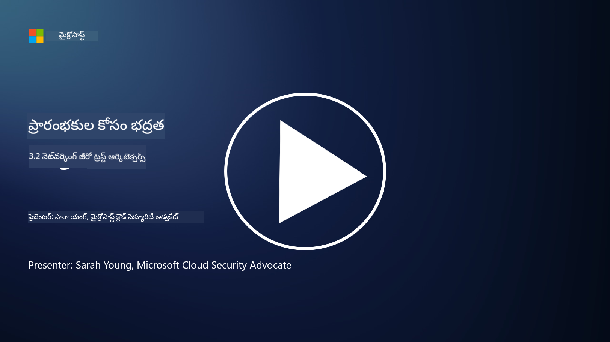

<!--
CO_OP_TRANSLATOR_METADATA:
{
  "original_hash": "680d6e14d9d33fc471c22f44679713f8",
  "translation_date": "2025-12-19T12:54:22+00:00",
  "source_file": "3.2 Networking zero trust architecture.md",
  "language_code": "te"
}
-->
# నెట్‌వర్కింగ్ జీరో ట్రస్ట్ ఆర్కిటెక్చర్స్

జీరో ట్రస్ట్ నియంత్రణల్లో నెట్‌వర్క్ కీలకమైన పొరను అందిస్తుంది, ఈ పాఠంలో మనం దీని గురించి మరింత తెలుసుకుంటాము:

 - నెట్‌వర్క్ సెగ్మెంటేషన్ అంటే ఏమిటి?  
 - నెట్‌వర్క్ సెగ్మెంటేషన్ జీరో ట్రస్ట్ అమలులో ఎలా సహాయపడుతుంది?  
 - ఎండ్-టు-ఎండ్ ఎన్‌క్రిప్షన్ అంటే ఏమిటి?

## నెట్‌వర్క్ సెగ్మెంటేషన్ అంటే ఏమిటి?

నెట్‌వర్క్ సెగ్మెంటేషన్ అనేది నెట్‌వర్క్‌ను చిన్న, వేరు చేసిన సెగ్మెంట్లు లేదా సబ్‌నెట్‌వర్క్‌లుగా విభజించే ఆచారం. ప్రతి సెగ్మెంట్ ఇతర సెగ్మెంట్ల నుండి వేరు చేయబడుతుంది, మరియు సెగ్మెంట్ల మధ్య యాక్సెస్‌ను నిర్దిష్ట భద్రతా విధానాల ఆధారంగా నియంత్రించి పరిమితం చేస్తారు. నెట్‌వర్క్ సెగ్మెంటేషన్ భద్రతను మెరుగుపరచడానికి ఉపయోగించబడుతుంది, ఇది సంభవించే ఉల్లంఘనల ప్రభావాన్ని తగ్గిస్తుంది మరియు నెట్‌వర్క్‌లో దాడి చేసే వారి పక్కదారి కదలికను పరిమితం చేస్తుంది.

నెట్‌వర్క్ సెగ్మెంటేషన్ అమలు చేయడం ద్వారా, ఒక సంస్థ వేర్వేరు రకాల వినియోగదారులు, అప్లికేషన్లు మరియు డేటాను వేరు చేసే "జోన్లు" సృష్టించవచ్చు. ఇది దాడి ఉపరితలాన్ని తగ్గిస్తుంది మరియు భద్రతా సంఘటన కారణంగా సంభవించే నష్టాన్ని తగ్గిస్తుంది. నెట్‌వర్క్ సెగ్మెంటేషన్ వర్చువల్ ల్యాన్‌లు (VLANలు), ఫైర్‌వాల్‌లు మరియు యాక్సెస్ నియంత్రణల వంటి టెక్నాలజీల ద్వారా సాధించవచ్చు.

## నెట్‌వర్క్ సెగ్మెంటేషన్ జీరో ట్రస్ట్ అమలులో ఎలా సహాయపడుతుంది?

నెట్‌వర్క్ సెగ్మెంటేషన్ జీరో ట్రస్ట్ మోడల్ యొక్క సూత్రాలకు దగ్గరగా సరిపోతుంది. జీరో ట్రస్ట్ ఆర్కిటెక్చర్‌లో, నెట్‌వర్క్ సెగ్మెంటేషన్ "తక్కువ ప్రివిలేజ్" సూత్రాన్ని అమలు చేయడంలో సహాయపడుతుంది, ఇది వినియోగదారులు మరియు పరికరాలు తమ పనులను నిర్వహించడానికి అవసరమైన నిర్దిష్ట వనరులు మరియు సేవలకు మాత్రమే యాక్సెస్ కలిగి ఉంటాయి. నెట్‌వర్క్‌ను చిన్న జోన్లుగా విభజించడం ద్వారా, సంస్థలు కఠినమైన యాక్సెస్ నియంత్రణలను అమలు చేయవచ్చు, కీలకమైన ఆస్తులను వేరు చేయవచ్చు మరియు దాడి చేసే వారి పక్కదారి కదలికను నివారించవచ్చు.

నెట్‌వర్క్ సెగ్మెంటేషన్ ఐడెంటిటీ ఆధారిత యాక్సెస్ నియంత్రణలను అమలు చేయడంలో కూడా సహాయపడుతుంది, ఇక్కడ వినియోగదారులు మరియు పరికరాలు నిర్దిష్ట సెగ్మెంట్లను యాక్సెస్ చేయడానికి ముందు పూర్తిగా ధృవీకరించబడతాయి మరియు అనుమతించబడతాయి. ఇది సున్నితమైన వనరులకు అనధికార యాక్సెస్‌ను నివారిస్తుంది మరియు కాంప్రమైజ్ అయిన క్రెడెన్షియల్స్ ప్రభావాన్ని తగ్గిస్తుంది.

## ఎండ్-టు-ఎండ్ ఎన్‌క్రిప్షన్ అంటే ఏమిటి?

ఎండ్-టు-ఎండ్ (E2E) ఎన్‌క్రిప్షన్ అనేది డేటా పంపిన వ్యక్తి నుండి స్వీకరించిన వ్యక్తి వరకు మొత్తం ప్రయాణంలో ఎన్‌క్రిప్ట్ చేయబడేలా చూసే భద్రతా చర్య. ఈ ప్రక్రియలో, డేటా పంపిన వ్యక్తి వద్ద ఎన్‌క్రిప్ట్ చేయబడుతుంది, మరియు స్వీకరించిన వ్యక్తి మాత్రమే డీక్రిప్షన్ కీని కలిగి ఉంటారు, తద్వారా డేటాను అన్‌లాక్ చేసి చదవగలుగుతారు. ఎన్‌క్రిప్షన్ మరియు డీక్రిప్షన్ ప్రక్రియలు ఎండ్‌పాయింట్ల వద్ద జరుగుతాయి, ఇది అనధికార పార్టీలు, సేవా ప్రదాతలు మరియు మధ్యవర్తులు ప్లెయిన్‌టెక్స్ట్ డేటాను యాక్సెస్ చేయడం చాలా కష్టం చేస్తుంది.

E2E ఎన్‌క్రిప్షన్ డేటా ప్రసారానికి అధిక స్థాయి గోప్యత మరియు భద్రతను అందిస్తుంది, డేటా వివిధ మధ్యవర్తి వ్యవస్థలు లేదా నెట్‌వర్క్‌ల ద్వారా వెళ్ళినా కూడా. ఇది సురక్షిత సందేశ అప్లికేషన్లు, ఇమెయిల్ సేవలు మరియు ఇతర కమ్యూనికేషన్ ప్లాట్‌ఫారమ్‌లలో సున్నితమైన సమాచారాన్ని చొరబాట్లు మరియు అనధికార యాక్సెస్ నుండి రక్షించడానికి సాధారణంగా ఉపయోగించబడుతుంది.

ఈ ఎన్‌క్రిప్షన్ పద్ధతి దాడి చేసే వారు ట్రాన్సిట్‌లో డేటాను యాక్సెస్ చేయగలిగితే కూడా, వారు డీక్రిప్షన్ కీ లేకుండా అర్థం లేని ఎన్‌క్రిప్ట్ చేసిన కంటెంట్‌ను మాత్రమే చూస్తారు. ఎండ్-టు-ఎండ్ ఎన్‌క్రిప్షన్ వినియోగదారుల గోప్యతను రక్షించడంలో మరియు సున్నితమైన సమాచారాన్ని అనధికార పార్టీలు బయటపెట్టకుండా రక్షించడంలో కీలక పాత్ర పోషిస్తుంది.

## SASE అంటే ఏమిటి?

SASE అంటే "సెక్యూర్ యాక్సెస్ సర్వీస్ ఎడ్జ్," ఇది నెట్‌వర్క్ భద్రత మరియు వైడ్-ఏరియా నెట్‌వర్కింగ్ (WAN) సామర్థ్యాలను ఒకే క్లౌడ్-ఆధారిత సేవలో కలిపే సైబర్‌సెక్యూరిటీ ఫ్రేమ్‌వర్క్ మరియు ఆర్కిటెక్చర్. SASE రిమోట్ మరియు మొబైల్ వినియోగదారుల కోసం నెట్‌వర్క్ వనరులు, అప్లికేషన్లు మరియు డేటాకు సురక్షితమైన మరియు స్కేలబుల్ యాక్సెస్‌ను అందించడానికి రూపొందించబడింది, అదే సమయంలో నెట్‌వర్క్ నిర్వహణను సరళతరం చేయడం మరియు సంప్రదాయ నెట్‌వర్క్ మరియు భద్రతా ఆర్కిటెక్చర్‌ల సంక్లిష్టతను తగ్గించడం.

SASE యొక్క ముఖ్యమైన లక్షణాలు మరియు భాగాలు:

1. **క్లౌడ్-ఆధారిత:** SASE క్లౌడ్ సేవగా అందించబడుతుంది, అంటే భద్రత మరియు నెట్‌వర్కింగ్ ఫంక్షన్లు సంప్రదాయ ఆన్-ప్రెమైసెస్ హార్డ్‌వేర్ మరియు అప్లయన్సెస్‌పై ఆధారపడకుండా క్లౌడ్ నుండి అందించబడతాయి.

2. **భద్రత మరియు నెట్‌వర్కింగ్ సమీకరణ:** SASE వివిధ భద్రతా సేవలను సమీకరిస్తుంది, ఉదాహరణకు సురక్షిత వెబ్ గేట్వేలు (SWG), ఫైర్‌వాల్ ఆన్ సర్వీస్ (FWaaS), డేటా లాస్ ప్రివెన్షన్ (DLP), జీరో-ట్రస్ట్ నెట్‌వర్క్ యాక్సెస్ (ZTNA), మరియు వైడ్-ఏరియా నెట్‌వర్కింగ్ సామర్థ్యాలతో WAN ఆప్టిమైజేషన్. ఈ సమీకరణ భద్రత మరియు నెట్‌వర్కింగ్ ఆపరేషన్లను సరళతరం చేయడంలో సహాయపడుతుంది.

3. **జీరో ట్రస్ట్:** SASE జీరో ట్రస్ట్ సూత్రంపై పనిచేస్తుంది, అంటే ఇది కఠినమైన యాక్సెస్ నియంత్రణలను మరియు తక్కువ ప్రివిలేజ్ యాక్సెస్ విధానాలను అమలు చేస్తుంది. వినియోగదారులు మరియు పరికరాలు డిఫాల్ట్‌గా నమ్మదగినవి కాదు, మరియు వనరులను యాక్సెస్ చేయడానికి ముందు ధృవీకరించబడాలి మరియు అనుమతించబడాలి.

4. **ఐడెంటిటీ-కేంద్రిత:** SASE యాక్సెస్ నియంత్రణకు ఆధారంగా వినియోగదారు మరియు పరికర ఐడెంటిటీలను ఫోకస్ చేస్తుంది. ఐడెంటిటీ మరియు కాంటెక్స్ట్-ఆధారిత విధానాలు యాక్సెస్ అనుమతులను నిర్ణయించడానికి ఉపయోగించబడతాయి, మరియు ఈ విధానాలు వినియోగదారు ప్రవర్తన మరియు కాంటెక్స్ట్ ఆధారంగా డైనమిక్‌గా అనుకూలిస్తాయి.

5. **స్కేలబిలిటీ మరియు ఫ్లెక్సిబిలిటీ:** SASE అనేక వినియోగదారులు మరియు పరికరాలను సులభంగా అనుసంధానించగలదు, ఇది విభిన్న మరియు అభివృద్ధి చెందుతున్న నెట్‌వర్కింగ్ మరియు భద్రతా అవసరాలు ఉన్న సంస్థలకు అనుకూలంగా ఉంటుంది.

SASE ఆధునిక రిమోట్ వర్క్ మరియు క్లౌడ్ స్వీకరణ యుగంలో ప్రత్యేకంగా సంబంధితది, ఎందుకంటే ఇది నెట్‌వర్క్ యాక్సెస్‌ను సురక్షితంగా మరియు సమర్థవంతంగా నిర్వహించడానికి సమగ్ర మరియు చురుకైన దృక్పథాన్ని అందిస్తుంది. ఇది వినియోగదారు-కేంద్రిత మరియు జీరో-ట్రస్ట్ భద్రతా మోడళ్లపై బలమైన దృష్టిని కొనసాగిస్తూ మారుతున్న భద్రత మరియు నెట్‌వర్కింగ్ అవసరాలకు సంస్థలు అనుగుణంగా ఉండటానికి సహాయపడుతుంది.

## మరింత చదవండి

- [What Is Network Segmentation? - Cisco](https://www.cisco.com/c/en/us/products/security/what-is-network-segmentation.html#~benefits)  
- [What Is Micro-Segmentation? - Cisco](https://www.cisco.com/c/en/us/products/security/what-is-microsegmentation.html)  
- [Implementing Network Segmentation and Segregation | Cyber.gov.au](https://www.cyber.gov.au/resources-business-and-government/maintaining-devices-and-systems/system-hardening-and-administration/network-hardening/implementing-network-segmentation-and-segregation)  
- [What Is Network Segmentation and Why It Matters | CompTIA](https://www.comptia.org/blog/security-awareness-training-network-segmentation)  
- [Network Segmentation: Concepts and Practices (cmu.edu)](https://insights.sei.cmu.edu/blog/network-segmentation-concepts-and-practices/)  
- [Secure networks with Zero Trust | Microsoft Learn](https://learn.microsoft.com/security/zero-trust/deploy/networks?WT.mc_id=academic-96948-sayoung)  
- [What is end-to-end encryption? | IBM](https://www.ibm.com/topics/end-to-end-encryption)  
- [What Is End-to-End Encryption, and Why Does It Matter? (howtogeek.com)](https://www.howtogeek.com/711656/what-is-end-to-end-encryption-and-why-does-it-matter/)  
- [Definition of Secure Access Service Edge (SASE) - Gartner Information Technology Glossary](https://www.gartner.com/en/information-technology/glossary/secure-access-service-edge-sase)  
- [What Is Secure Access Service Edge (SASE)? | Microsoft Security](https://www.microsoft.com/security/business/security-101/what-is-sase?WT.mc_id=academic-96948-sayoung)  

---

<!-- CO-OP TRANSLATOR DISCLAIMER START -->
**విమర్శ**:  
ఈ పత్రాన్ని AI అనువాద సేవ [Co-op Translator](https://github.com/Azure/co-op-translator) ఉపయోగించి అనువదించారు. మేము ఖచ్చితత్వానికి ప్రయత్నిస్తున్నప్పటికీ, ఆటోమేటెడ్ అనువాదాలలో తప్పులు లేదా అసమానతలు ఉండవచ్చు. దయచేసి, దాని స్వదేశీ భాషలోని అసలు పత్రాన్ని అధికారం కలిగిన మూలంగా పరిగణించండి. ముఖ్యమైన సమాచారం కోసం, ప్రొఫెషనల్ మానవ అనువాదాన్ని సిఫారసు చేస్తాము. ఈ అనువాదం ఉపయోగం వల్ల కలిగే ఏవైనా అపార్థాలు లేదా తప్పుదారులు కోసం మేము బాధ్యత వహించము.
<!-- CO-OP TRANSLATOR DISCLAIMER END -->