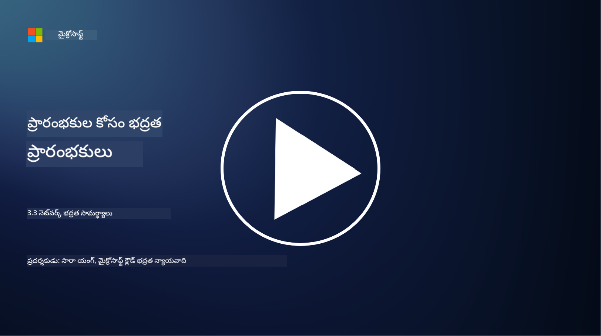

<!--
CO_OP_TRANSLATOR_METADATA:
{
  "original_hash": "c3aba077bb98eebc925dd58d870229ab",
  "translation_date": "2025-12-19T13:34:39+00:00",
  "source_file": "3.3 Network security capabilities.md",
  "language_code": "te"
}
-->
# నెట్‌వర్క్ భద్రతా సామర్థ్యాలు

ఈ పాఠంలో, నెట్‌వర్క్‌ను భద్రపరచడానికి ఉపయోగించగల సామర్థ్యాల గురించి నేర్చుకుంటాము:

 - సంప్రదాయ ఫైర్వాల్స్
 - వెబ్ అప్లికేషన్ ఫైర్వాల్స్
 - క్లౌడ్ సెక్యూరిటీ గ్రూప్స్
 - CDN
 - లోడ్ బలాన్సర్లు
 - బాష్టియన్ హోస్ట్స్
 - VPNలు
 - DDoS రక్షణ

## సంప్రదాయ ఫైర్వాల్స్

సంప్రదాయ ఫైర్వాల్స్ అనేవి భద్రతా పరికరాలు, ఇవి ముందుగా నిర్వచించిన భద్రతా నియమాల ఆధారంగా నెట్‌వర్క్ ట్రాఫిక్‌ను నియంత్రించి, పర్యవేక్షిస్తాయి. ఇవి నమ్మకమైన అంతర్గత నెట్‌వర్క్ మరియు నమ్మదగని బాహ్య నెట్‌వర్క్‌ల మధ్య ఒక అవరోధంగా పనిచేస్తాయి, అనధికార ప్రాప్యత మరియు ముప్పులను నివారించడానికి ట్రాఫిక్‌ను ఫిల్టర్ చేస్తాయి.

## వెబ్ అప్లికేషన్ ఫైర్వాల్స్

వెబ్ అప్లికేషన్ ఫైర్వాల్స్ (WAFs) అనేవి ప్రత్యేకమైన ఫైర్వాల్స్, ఇవి SQL ఇంజెక్షన్, క్రాస్-సైట్ స్క్రిప్టింగ్ వంటి దాడుల నుండి వెబ్ అప్లికేషన్లను రక్షించడానికి రూపొందించబడ్డాయి. ఇవి HTTP అభ్యర్థనలు మరియు ప్రతిస్పందనలను విశ్లేషించి, వెబ్ అప్లికేషన్లను లక్ష్యంగా చేసుకున్న దుష్ట ట్రాఫిక్‌ను గుర్తించి, నిరోధిస్తాయి.

## క్లౌడ్ సెక్యూరిటీ గ్రూప్స్

సెక్యూరిటీ గ్రూప్స్ అనేవి క్లౌడ్ సేవల ప్రదాతలు అందించే ప్రాథమిక నెట్‌వర్క్ భద్రతా లక్షణాలు. ఇవి వర్చువల్ ఫైర్వాల్స్‌లా పనిచేస్తూ, క్లౌడ్ వనరులు (వర్చువల్ మెషీన్లు మరియు ఇన్‌స్టాన్సులు వంటి) లోపలికి మరియు బయటకు వెళ్లే ట్రాఫిక్‌ను నియంత్రిస్తాయి. సెక్యూరిటీ గ్రూప్స్ సంస్థలకు అనుమతించబడిన మరియు నిరాకరించబడిన ట్రాఫిక్ రకాలను నిర్ణయించే నియమాలను నిర్వచించడానికి అనుమతిస్తాయి, క్లౌడ్ అమలులకు అదనపు రక్షణ పొరను అందిస్తాయి.

## కంటెంట్ డెలివరీ నెట్‌వర్క్ (CDN)

కంటెంట్ డెలివరీ నెట్‌వర్క్ అనేది వివిధ భౌగోళిక ప్రదేశాల్లో ఉన్న సర్వర్ల పంపిణీ నెట్‌వర్క్. CDNs వెబ్‌సైట్‌ల పనితీరు మరియు లభ్యతను మెరుగుపరచడానికి కంటెంట్‌ను క్యాష్ చేసి, వినియోగదారుని దగ్గరలో ఉన్న సర్వర్‌ల నుండి అందిస్తాయి. ఇవి DDoS దాడుల నుండి కొంతమేర రక్షణను కూడా అందిస్తాయి, ట్రాఫిక్‌ను అనేక సర్వర్ ప్రదేశాల మధ్య పంపిణీ చేస్తూ.

## లోడ్ బలాన్సర్లు

లోడ్ బలాన్సర్లు నెట్‌వర్క్‌లోకి వచ్చే ట్రాఫిక్‌ను అనేక సర్వర్ల మధ్య పంపిణీ చేస్తాయి, వనరుల వినియోగాన్ని ఆప్టిమైజ్ చేయడానికి, అధిక లభ్యతను నిర్ధారించడానికి మరియు అప్లికేషన్ పనితీరును మెరుగుపరచడానికి. ఇవి సర్వర్ ఓవర్‌లోడ్‌ను నివారించి, సమర్థవంతమైన ప్రతిస్పందన సమయాలను నిర్వహించడంలో సహాయపడతాయి, నెట్‌వర్క్ స్థిరత్వాన్ని పెంచుతాయి.

## బాష్టియన్ హోస్ట్స్

బాష్టియన్ హోస్ట్స్ అనేవి అత్యంత భద్రత కలిగిన, వేరుచేసిన సర్వర్లు, ఇవి బాహ్య, నమ్మదగని నెట్‌వర్క్ (ఇంటర్నెట్ వంటి) నుండి నెట్‌వర్క్‌కు నియంత్రిత ప్రాప్యతను అందిస్తాయి. ఇవి అడ్మినిస్ట్రేటర్లకు అంతర్గత వ్యవస్థలను భద్రంగా ప్రాప్యత చేయడానికి ప్రవేశ ద్వారాలుగా పనిచేస్తాయి. బాష్టియన్ హోస్ట్స్ సాధారణంగా దాడి ఉపరితలాన్ని తగ్గించడానికి బలమైన భద్రతా చర్యలతో కాన్ఫిగర్ చేయబడతాయి.

## వర్చువల్ ప్రైవేట్ నెట్‌వర్క్స్ (VPNs)

VPNలు వినియోగదారు పరికరం మరియు రిమోట్ సర్వర్ మధ్య గుప్తీకరించిన టన్నెల్‌లను సృష్టిస్తాయి, ఇంటర్నెట్ వంటి భద్రత లేని నెట్‌వర్క్‌లపై భద్రతా మరియు ప్రైవేట్ కమ్యూనికేషన్‌ను నిర్ధారిస్తాయి. VPNలు సాధారణంగా అంతర్గత నెట్‌వర్క్‌లకు రిమోట్ ప్రాప్యతను అందించడానికి ఉపయోగించబడతాయి, వినియోగదారులు అదే నెట్‌వర్క్‌లో భౌతికంగా ఉన్నట్లుగా వనరులను ప్రాప్యత చేయడానికి అనుమతిస్తాయి.

## DDoS రక్షణ పరికరాలు

DDoS (డిస్ట్రిబ్యూటెడ్ డినైల్ ఆఫ్ సర్వీస్) రక్షణ పరికరాలు మరియు సేవలు DDoS దాడుల ప్రభావాన్ని తగ్గించడానికి రూపొందించబడ్డాయి, ఇక్కడ అనేక హ్యాకింగ్ పరికరాలు నెట్‌వర్క్ లేదా సేవను అధికంగా ట్రాఫిక్‌తో ముంచెత్తుతాయి. DDoS రక్షణ పరిష్కారాలు దుష్ట ట్రాఫిక్‌ను గుర్తించి, ఫిల్టర్ చేస్తాయి, చట్టబద్ధమైన ట్రాఫిక్ తన లక్ష్య గమ్యానికి చేరుకోవడానికి నిర్ధారిస్తాయి.

## మరింత చదవండి

- [ఫైర్వాల్ అంటే ఏమిటి? - సిస్కో](https://www.cisco.com/c/en/us/products/security/firewalls/what-is-a-firewall.html#~types-of-firewalls)
- [ఫైర్వాల్ వాస్తవానికి ఏమి చేస్తుంది? (howtogeek.com)](https://www.howtogeek.com/144269/htg-explains-what-firewalls-actually-do/)
- [ఫైర్వాల్ అంటే ఏమిటి? ఫైర్వాల్స్ ఎలా పనిచేస్తాయి & ఫైర్వాల్స్ రకాలు (kaspersky.com)](https://www.kaspersky.com/resource-center/definitions/firewall)
- [నెట్‌వర్క్ సెక్యూరిటీ గ్రూప్ - ఇది ఎలా పనిచేస్తుంది | Microsoft Learn](https://learn.microsoft.com/azure/virtual-network/network-security-group-how-it-works)
- [Azure కంటెంట్ డెలివరీ నెట్‌వర్క్ (CDN) పరిచయం - శిక్షణ | Microsoft Learn](https://learn.microsoft.com/training/modules/intro-to-azure-content-delivery-network/?WT.mc_id=academic-96948-sayoung)
- [కంటెంట్ డెలివరీ నెట్‌వర్క్ (CDN) అంటే ఏమిటి? - Azure | Microsoft Learn](https://learn.microsoft.com/azure/cdn/cdn-overview?WT.mc_id=academic-96948-sayoung)
- [లోడ్ బలాన్సింగ్ అంటే ఏమిటి? లోడ్ బలాన్సర్లు ఎలా పనిచేస్తాయి (nginx.com)](https://www.nginx.com/resources/glossary/load-balancing/)
- [బాష్టియన్ హోస్ట్స్ vs. VPNలు · Tailscale](https://tailscale.com/learn/bastion-hosts-vs-vpns/)
- [VPN అంటే ఏమిటి? ఇది ఎలా పనిచేస్తుంది, VPN రకాలు (kaspersky.com)](https://www.kaspersky.com/resource-center/definitions/what-is-a-vpn)
- [Azure DDoS రక్షణకు పరిచయం - శిక్షణ | Microsoft Learn](https://learn.microsoft.com/training/modules/introduction-azure-ddos-protection/?WT.mc_id=academic-96948-sayoung)
- [DDoS దాడి అంటే ఏమిటి? | Microsoft Security](https://www.microsoft.com/security/business/security-101/what-is-a-ddos-attack?WT.mc_id=academic-96948-sayoung)

---

<!-- CO-OP TRANSLATOR DISCLAIMER START -->
**అస్వీకరణ**:  
ఈ పత్రం AI అనువాద సేవ [Co-op Translator](https://github.com/Azure/co-op-translator) ఉపయోగించి అనువదించబడింది. మేము ఖచ్చితత్వానికి ప్రయత్నిస్తున్నప్పటికీ, ఆటోమేటెడ్ అనువాదాలు తప్పులు లేదా అసమగ్రతలను కలిగి ఉండవచ్చు. దాని స్వదేశ భాషలో ఉన్న అసలు పత్రాన్ని అధికారం కలిగిన మూలంగా పరిగణించాలి. కీలకమైన సమాచారం కోసం, ప్రొఫెషనల్ మానవ అనువాదాన్ని సిఫారసు చేస్తాము. ఈ అనువాదం ఉపయోగం వల్ల కలిగే ఏవైనా అపార్థాలు లేదా తప్పుదారులు కోసం మేము బాధ్యత వహించము.
<!-- CO-OP TRANSLATOR DISCLAIMER END -->