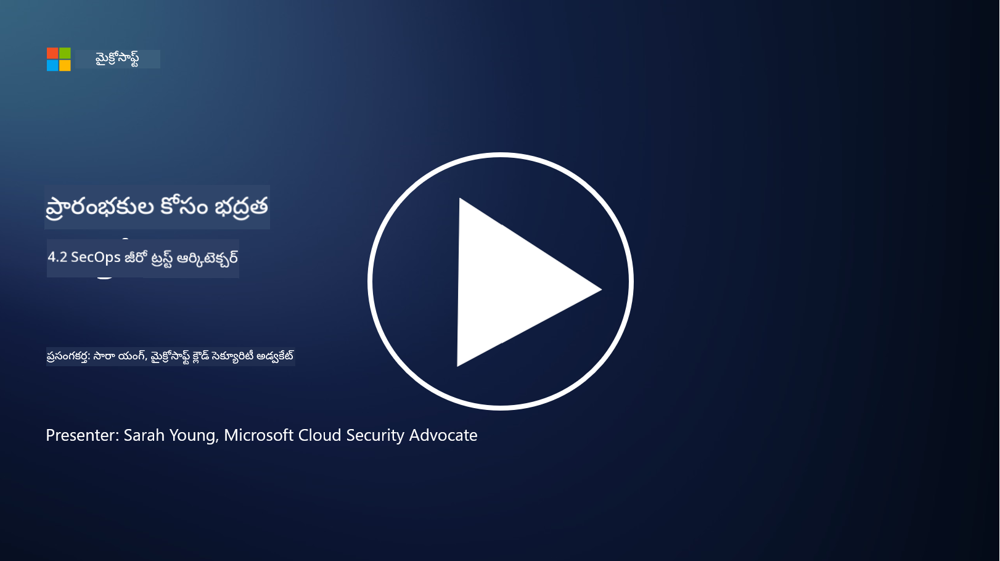

<!--
CO_OP_TRANSLATOR_METADATA:
{
  "original_hash": "45bbdc114e70936816b0b3e7c40189cf",
  "translation_date": "2025-12-19T13:28:58+00:00",
  "source_file": "4.2 SecOps zero trust architecture.md",
  "language_code": "te"
}
-->
# SecOps జీరో ట్రస్ట్ ఆర్కిటెక్చర్

సెక్యూరిటీ ఆపరేషన్స్ జీరో ట్రస్ట్ ఆర్కిటెక్చర్‌లో రెండు భాగాలుగా ఉంటుంది, ఈ పాఠంలో మనం ఈ రెండింటి గురించి తెలుసుకుంటాం:

- కేంద్రీకృత లాగ్ సేకరణకు IT ఆర్కిటెక్చర్లు ఎలా నిర్మించబడాలి?

- ఆధునిక IT వాతావరణాల్లో సెక్యూరిటీ ఆపరేషన్స్ కోసం ఉత్తమ పద్ధతులు ఏమిటి?

## కేంద్రీకృత లాగ్ సేకరణకు IT ఆర్కిటెక్చర్లు ఎలా నిర్మించబడాలి?

కేంద్రీకృత లాగ్ సేకరణ ఆధునిక సెక్యూరిటీ ఆపరేషన్స్‌లో కీలకమైన భాగం. ఇది సంస్థలకు సర్వర్లు, అప్లికేషన్లు, నెట్‌వర్క్ పరికరాలు, మరియు సెక్యూరిటీ టూల్స్ వంటి వివిధ మూలాల నుండి లాగ్‌లు మరియు డేటాను సేకరించి, విశ్లేషణ, మానిటరింగ్, మరియు సంఘటనల ప్రతిస్పందన కోసం ఒక కేంద్ర నిల్వలోకి సమీకరించడానికి అనుమతిస్తుంది. కేంద్రీకృత లాగ్ సేకరణకు మద్దతు ఇచ్చే IT ఆర్కిటెక్చర్లను నిర్మించడానికి కొన్ని ఉత్తమ పద్ధతులు ఇవి:

1. **లాగ్ సోర్స్ ఇంటిగ్రేషన్**:

- అన్ని సంబంధిత పరికరాలు మరియు వ్యవస్థలు లాగ్‌లు ఉత్పత్తి చేయడానికి కాన్ఫిగర్ చేయబడినట్లు నిర్ధారించండి. ఇందులో సర్వర్లు, ఫైర్వాల్స్, రౌటర్లు, స్విచ్‌లు, అప్లికేషన్లు, మరియు సెక్యూరిటీ పరికరాలు ఉంటాయి.

- లాగ్ మూలాలను కేంద్ర లాగ్ కలెక్టర్ లేదా మేనేజ్‌మెంట్ సిస్టమ్‌కు లాగ్‌లు ఫార్వార్డ్ చేయడానికి కాన్ఫిగర్ చేయండి.

2. **సరైన SIEM (సెక్యూరిటీ ఇన్ఫర్మేషన్ మరియు ఈవెంట్ మేనేజ్‌మెంట్) టూల్‌ను ఎంచుకోండి**:

- మీ సంస్థ అవసరాలు మరియు స్కేల్‌కు అనుగుణంగా ఉండే SIEM (సెక్యూరిటీ ఇన్ఫర్మేషన్ మరియు ఈవెంట్ మేనేజ్‌మెంట్) పరిష్కారాన్ని ఎంచుకోండి.

- ఎంచుకున్న పరిష్కారం లాగ్ సేకరణ, సమీకరణ, విశ్లేషణ, మరియు రిపోర్టింగ్‌కు మద్దతు ఇస్తుందో లేదో నిర్ధారించండి.

3. **స్కేలబిలిటీ మరియు రిడండెన్సీ**:

- పెరుగుతున్న లాగ్ మూలాల సంఖ్య మరియు పెరిగిన లాగ్ వాల్యూమ్‌ను నిర్వహించడానికి స్కేలబిలిటీ కోసం ఆర్కిటెక్చర్‌ను డిజైన్ చేయండి.

- హార్డ్‌వేర్ లేదా నెట్‌వర్క్ వైఫల్యాల కారణంగా అంతరాయాలను నివారించడానికి అధిక లభ్యత కోసం రిడండెన్సీని అమలు చేయండి.

4. **లాగ్‌లను సురక్షితంగా రవాణా చేయండి**:

- లాగ్‌లను మూలాల నుండి కేంద్ర నిల్వకు రవాణా చేయడానికి TLS/SSL లేదా IPsec వంటి సురక్షిత ప్రోటోకాల్స్‌ను ఉపయోగించండి.

- లాగ్‌లను పంపడానికి కేవలం అధికారం కలిగిన పరికరాలు మాత్రమే అనుమతించబడేలా ధృవీకరణ మరియు యాక్సెస్ నియంత్రణలను అమలు చేయండి.

5. **నార్మలైజేషన్**:

- లాగ్ ఫార్మాట్లను ప్రామాణీకరించి, డేటాను నార్మలైజ్ చేయండి, తద్వారా విశ్లేషణ సులభంగా మరియు సుసంగతంగా ఉంటుంది.

6. **స్టోరేజ్ మరియు రిటెన్షన్**:

- కంప్లయన్స్ మరియు సెక్యూరిటీ అవసరాల ఆధారంగా లాగ్‌లకు సరైన నిల్వ కాలాన్ని నిర్ణయించండి.

- లాగ్‌లను సురక్షితంగా నిల్వ చేయండి, అవాంఛిత యాక్సెస్ మరియు టాంపరింగ్ నుండి రక్షించండి.

## ఆధునిక IT వాతావరణాల్లో సెక్యూరిటీ ఆపరేషన్స్ కోసం ఉత్తమ పద్ధతులు ఏమిటి?

కేంద్రీకృత లాగ్ సేకరణకు అదనంగా, ఆధునిక IT వాతావరణాల్లో సెక్యూరిటీ ఆపరేషన్స్ కోసం కొన్ని ఉత్తమ పద్ధతులు ఇవి:

1. **నిరంతర మానిటరింగ్**: నెట్‌వర్క్ మరియు వ్యవస్థ కార్యకలాపాలను నిరంతరం పర్యవేక్షించి, రియల్ టైమ్‌లో ముప్పులను గుర్తించి, ప్రతిస్పందించండి.

2. **థ్రెట్ ఇంటెలిజెన్స్**: థ్రెట్ ఇంటెలిజెన్స్ ఫీడ్స్ మరియు సేవలను ఉపయోగించి, కొత్త ముప్పులు మరియు భద్రతా లోపాల గురించి అప్రమత్తంగా ఉండండి.

3. **యూజర్ ట్రైనింగ్**: సామాజిక ఇంజనీరింగ్ మరియు ఫిషింగ్ దాడులతో సంబంధిత ప్రమాదాలను తగ్గించడానికి ఉద్యోగులకు రెగ్యులర్ భద్రతా అవగాహన శిక్షణను నిర్వహించండి.

4. **ఇన్సిడెంట్ రెస్పాన్స్ ప్లాన్**: భద్రతా సంఘటనలకు వేగవంతమైన మరియు సమర్థవంతమైన ప్రతిస్పందనను నిర్ధారించడానికి ఒక సంఘటన ప్రతిస్పందన ప్రణాళికను అభివృద్ధి చేసి, పరీక్షించండి.

5. **సెక్యూరిటీ ఆటోమేషన్**: సంఘటనల ప్రతిస్పందన మరియు పునరావృత పనులను సులభతరం చేయడానికి భద్రతా ఆటోమేషన్ మరియు ఆర్కెస్ట్రేషన్ టూల్స్‌ను ఉపయోగించండి.

6. **బ్యాకప్ మరియు రికవరీ**: డేటా నష్టానికి లేదా ర్యాన్సమ్‌వేర్ దాడులకు గురైనప్పుడు డేటా లభ్యతను నిర్ధారించడానికి బలమైన బ్యాకప్ మరియు డిజాస్టర్ రికవరీ పరిష్కారాలను అమలు చేయండి.

## మరింత చదవండి

- [Microsoft Security Best Practices module: Security operations | Microsoft Learn](https://learn.microsoft.com/security/operations/security-operations-videos-and-decks?WT.mc_id=academic-96948-sayoung)
- [Security operations - Cloud Adoption Framework | Microsoft Learn](https://learn.microsoft.com/azure/cloud-adoption-framework/secure/security-operations?WT.mc_id=academic-96948-sayoung)
- [What is Security Operations and Analytics Platform Architecture? A Definition of SOAPA, How It Works, Benefits, and More (digitalguardian.com)](https://www.digitalguardian.com/blog/what-security-operations-and-analytics-platform-architecture-definition-soapa-how-it-works#:~:text=All%20in%20all%2C%20security%20operations%20and%20analytics%20platform,become%20more%20efficient%20and%20operative%20with%20your%20security.)

---

<!-- CO-OP TRANSLATOR DISCLAIMER START -->
**విమర్శ**:  
ఈ పత్రాన్ని AI అనువాద సేవ [Co-op Translator](https://github.com/Azure/co-op-translator) ఉపయోగించి అనువదించారు. మేము ఖచ్చితత్వానికి ప్రయత్నిస్తున్నప్పటికీ, ఆటోమేటెడ్ అనువాదాలలో తప్పులు లేదా అసమానతలు ఉండవచ్చు. దయచేసి, దాని స్వదేశీ భాషలోని అసలు పత్రాన్ని అధికారం కలిగిన మూలంగా పరిగణించండి. ముఖ్యమైన సమాచారం కోసం, ప్రొఫెషనల్ మానవ అనువాదాన్ని సిఫారసు చేస్తాము. ఈ అనువాదాన్ని ఉపయోగించడం వల్ల కలిగే ఏవైనా అపార్థాలు లేదా తప్పుదారులు కోసం మేము బాధ్యత వహించము.
<!-- CO-OP TRANSLATOR DISCLAIMER END -->