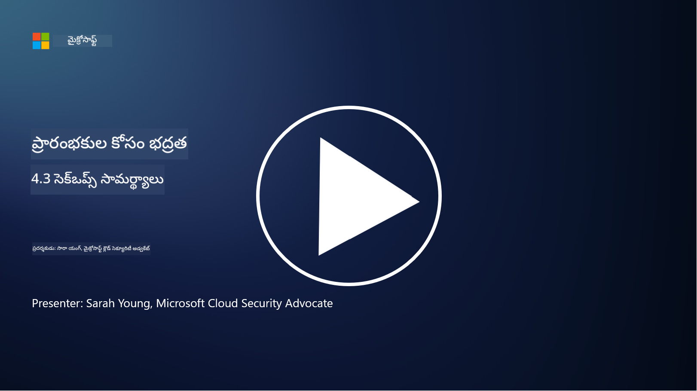

<!--
CO_OP_TRANSLATOR_METADATA:
{
  "original_hash": "553eb694c89f1caca0694e8d8ab89e0e",
  "translation_date": "2025-12-19T13:26:39+00:00",
  "source_file": "4.3 SecOps capabilities.md",
  "language_code": "te"
}
-->
# SecOps సామర్థ్యాలు

ఈ విభాగంలో, భద్రతా ఆపరేషన్లలో ఉపయోగించగల ముఖ్యమైన టూల్స్ మరియు సామర్థ్యాల గురించి మరింత వివరాలు తెలుసుకుంటాము.

ఈ పాఠంలో, మేము కవర్ చేస్తాము:

- భద్రతా సమాచారం మరియు ఈవెంట్ మేనేజ్‌మెంట్ (SIEM) టూల్ అంటే ఏమిటి?

- XDR అంటే ఏమిటి?

- భద్రతా ఆపరేషన్లను మెరుగుపరచడానికి ఉపయోగించగల సామర్థ్యాలు ఏమిటి?

## భద్రతా సమాచారం మరియు ఈవెంట్ మేనేజ్‌మెంట్ (SIEM) టూల్ అంటే ఏమిటి?

భద్రతా సమాచారం మరియు ఈవెంట్ మేనేజ్‌మెంట్ (SIEM) టూల్ అనేది సంస్థ యొక్క IT వాతావరణంలో ఉత్పత్తి అయ్యే భద్రతా అలర్ట్‌లను విశ్లేషించడానికి ఉపయోగిస్తారు. ఇవి నెట్‌వర్క్ పరికరాలు, సర్వర్లు, అప్లికేషన్లు మరియు భద్రతా వ్యవస్థల వంటి వివిధ వనరుల నుండి లాగ్ డేటా మరియు భద్రతా ఈవెంట్‌లను సేకరించి, సమీకరించి, సంబంధం కలిగి, విశ్లేషిస్తాయి.

SIEM టూల్స్ యొక్క ముఖ్యమైన ఫంక్షన్లు మరియు సామర్థ్యాలు:

1. **లాగ్ సేకరణ**: SIEM టూల్స్ ఫైర్‌వాల్‌లు, ఇన్‌ట్రూజన్ డిటెక్షన్ సిస్టమ్‌లు, యాంటీవైరస్ సాఫ్ట్‌వేర్ మరియు మరిన్ని వంటి పరికరాలు, వ్యవస్థలు మరియు అప్లికేషన్ల నుండి లాగ్‌లు మరియు భద్రతా ఈవెంట్ డేటాను సేకరిస్తాయి.

2. **డేటా సాధారణీకరణ**: విశ్లేషణ మరియు సంబంధం సులభతరం చేయడానికి లాగ్ డేటాను సాధారణ ఫార్మాట్‌లోకి మార్చుతాయి.

3. **ఈవెంట్ సంబంధం**: SIEM టూల్స్ ఈవెంట్‌లను సంబంధం కలిగి, భద్రతా సంఘటనలు లేదా ముప్పులను సూచించే నమూనాలు మరియు అసాధారణతలను గుర్తిస్తాయి.

4. **అలర్టింగ్ మరియు నోటిఫికేషన్**: అనుమానాస్పద కార్యకలాపాలు లేదా భద్రతా ఉల్లంఘనలు గుర్తించినప్పుడు SIEM టూల్స్ రియల్ టైమ్‌లో అలర్ట్‌లు మరియు నోటిఫికేషన్‌లు ఉత్పత్తి చేస్తాయి, వెంటనే స్పందించడానికి అనుమతిస్తాయి.

5. **సంఘటన గుర్తింపు**: అనధికార ప్రాప్యత, డేటా బ్రీచ్‌లు, మాల్వేర్ ఇన్ఫెక్షన్‌లు మరియు ఇన్‌సైడర్ ముప్పులు వంటి భద్రతా సంఘటనలను గుర్తించడంలో సహాయపడతాయి.

6. **యూజర్ మరియు ఎంటిటీ బిహేవియర్ అనలిటిక్స్ (UEBA)**: UEBA సామర్థ్యాలను SIEM టూల్స్‌లో చేర్చడం ద్వారా అసాధారణ యూజర్ మరియు ఎంటిటీ ప్రవర్తనలను గుర్తించవచ్చు.

7. **ముప్పు ఇంటెలిజెన్స్ ఇంటిగ్రేషన్**: SIEM టూల్స్ ముప్పు గుర్తింపు మెరుగుపరచడానికి ముప్పు ఇంటెలిజెన్స్ ఫీడ్‌లతో ఇంటిగ్రేట్ అవుతాయి.

8. **ఆటోమేషన్ మరియు ఆర్కెస్ట్రేషన్**: సాధారణ భద్రతా సంఘటనలకు స్పందనలను ఆటోమేట్ చేయడానికి SIEM టూల్స్ ఆటోమేషన్ ఫీచర్‌లను అందిస్తాయి.

9. **డాష్‌బోర్డ్ మరియు విజువలైజేషన్**: భద్రతా డేటాను మానిటర్ చేయడానికి మరియు కస్టమ్ రిపోర్ట్‌లను సృష్టించడానికి డాష్‌బోర్డ్‌లు మరియు విజువలైజేషన్ టూల్స్ అందిస్తాయి.

10. **ఇతర భద్రతా టూల్స్‌తో ఇంటిగ్రేషన్**: SIEM టూల్స్ EDR సొల్యూషన్‌ల వంటి ఇతర భద్రతా టూల్స్ మరియు టెక్నాలజీలతో ఇంటిగ్రేట్ అవుతాయి.

## XDR అంటే ఏమిటి?

XDR (ఎక్స్‌టెండెడ్ డిటెక్షన్ మరియు రెస్పాన్స్) అనేది సంప్రదాయ EDR సామర్థ్యాలను విస్తరించి, వివిధ వనరుల నుండి భద్రతా టెలిమెట్రీతో కలిపి సంస్థ యొక్క భద్రతా స్థితిని సమగ్రంగా చూడటానికి ఉపయోగించే టెక్నాలజీ. XDR EDR, SIEM లేదా ఇతర వ్యక్తిగత భద్రతా టూల్స్‌పై ఆధారపడే పరిమితులను పరిష్కరించడం ద్వారా ముప్పు గుర్తింపు, సంఘటన స్పందన మరియు మొత్తం భద్రతను మెరుగుపరచడానికి లక్ష్యంగా ఉంది.

XDR యొక్క ముఖ్యమైన లక్షణాలు మరియు భాగాలు:

1. **డేటా ఇంటిగ్రేషన్**: XDR ఎండ్పాయింట్లు, నెట్‌వర్క్ ట్రాఫిక్, క్లౌడ్ సర్వీసులు, ఇమెయిల్ మరియు మరిన్ని వంటి అనేక వనరుల నుండి డేటాను సమీకరిస్తుంది.

2. **అడ్వాన్స్‌డ్ అనలిటిక్స్**: XDR అధునాతన అనలిటిక్స్, మెషిన్ లెర్నింగ్ మరియు ప్రవర్తనా విశ్లేషణను ఉపయోగించి భద్రతా ముప్పులను గుర్తిస్తుంది.

3. **ఆటోమేటెడ్ ముప్పు గుర్తింపు**: XDR వివిధ వనరుల నుండి సమాచారం సంబంధం కలిగి, భద్రతా ముప్పులను ఆటోమేట్‌గా గుర్తిస్తుంది.

4. **సంఘటన పరిశోధన మరియు స్పందన**: XDR సంఘటనల పరిధి మరియు ప్రభావాన్ని త్వరగా అంచనా వేయడానికి మరియు తగిన చర్యలు తీసుకోవడానికి టూల్స్ అందిస్తుంది.

5. **ముప్పు ఇంటెలిజెన్స్ ఇంటిగ్రేషన్**: XDR ముప్పు ఇంటెలిజెన్స్ ఫీడ్‌లను ఇంటిగ్రేట్ చేస్తుంది.

6. **యునిఫైడ్ కన్సోల్**: XDR సాధారణంగా భద్రతా అలర్ట్‌లు మరియు సంఘటనలను కేంద్రీకృతంగా నిర్వహించడానికి యునిఫైడ్ కన్సోల్ అందిస్తుంది.

7. **క్రాస్-ప్లాట్‌ఫారమ్ కవరేజ్**: XDR పరిష్కారాలు ఎండ్పాయింట్లు, సర్వర్లు, క్లౌడ్ వాతావరణాలు మరియు మొబైల్ పరికరాలను కవర్ చేస్తాయి.

## భద్రతా ఆపరేషన్లను మెరుగుపరచడానికి ఉపయోగించగల సామర్థ్యాలు ఏమిటి?

భద్రతా ఆపరేషన్లను మెరుగుపరచడానికి, SIEM టూల్స్‌తో పాటు సంస్థలు అనేక సామర్థ్యాలను ఉపయోగించవచ్చు:

1. **మెషిన్ లెర్నింగ్ మరియు ఆర్టిఫిషియల్ ఇంటెలిజెన్స్**: అభివృద్ధి చెందుతున్న ముప్పులను గుర్తించడానికి మరియు ఆటోమేట్ చేయడానికి మెషిన్ లెర్నింగ్ మరియు AI అమలు చేయండి.

2. **యూజర్ మరియు ఎంటిటీ బిహేవియర్ అనలిటిక్స్ (UEBA)**: యూజర్ మరియు ఎంటిటీ ప్రవర్తనను విశ్లేషించి అసాధారణతలను గుర్తించండి.

3. **ముప్పు ఇంటెలిజెన్స్ ఫీడ్‌లు**: తాజా ముప్పులు మరియు సూచనల గురించి అప్డేట్‌గా ఉండటానికి ముప్పు ఇంటెలిజెన్స్ ఫీడ్‌లను ఇంటిగ్రేట్ చేయండి.

4. **సెక్యూరిటీ ఆర్కెస్ట్రేషన్, ఆటోమేషన్ మరియు రెస్పాన్స్ (SOAR)**: సంఘటనల స్పందనను ఆటోమేట్ చేయడానికి మరియు భద్రతా ఆపరేషన్ల వర్క్‌ఫ్లోలను సులభతరం చేయడానికి SOAR ప్లాట్‌ఫారమ్‌లను అమలు చేయండి.

5. **డెసెప్షన్ టెక్నాలజీస్**: నెట్‌వర్క్‌లో దాడి చేయడానికి మరియు దాడి చేసిన వారిని గుర్తించడానికి డెసెప్షన్ టెక్నాలజీలను అమలు చేయండి.

## మరింత చదవండి

- [SIEM అంటే ఏమిటి? | Microsoft Security](https://www.microsoft.com/security/business/security-101/what-is-siem?WT.mc_id=academic-96948-sayoung)
- [SIEM అంటే ఏమిటి? - భద్రతా సమాచారం మరియు ఈవెంట్ మేనేజ్‌మెంట్ - Cisco](https://www.cisco.com/c/en/us/products/security/what-is-siem.html)
- [భద్రతా సమాచారం మరియు ఈవెంట్ మేనేజ్‌మెంట్ - వికీపీడియా](https://en.wikipedia.org/wiki/Security_information_and_event_management)
- [XDR అంటే ఏమిటి? | Microsoft Security](https://www.microsoft.com/security/business/security-101/what-is-xdr?WT.mc_id=academic-96948-sayoung)
- [XDR & XDR Security (kaspersky.com.au)](https://www.kaspersky.com.au/resource-center/definitions/what-is-xdr)
- [SecOps శక్తి: ముఖ్య భద్రతా సామర్థ్యాలను పునర్నిర్వచించడం - The New Stack](https://thenewstack.io/the-power-of-secops-redefining-core-security-capabilities/)
- [మీ భద్రతా ఆపరేషన్లు మరియు స్పందనను మెరుగుపరచడానికి ఏడు దశలు (securityintelligence.com)](https://securityintelligence.com/seven-steps-to-improve-your-security-operations-and-response/)

---

<!-- CO-OP TRANSLATOR DISCLAIMER START -->
**విమర్శ**:  
ఈ పత్రాన్ని AI అనువాద సేవ [Co-op Translator](https://github.com/Azure/co-op-translator) ఉపయోగించి అనువదించారు. మేము ఖచ్చితత్వానికి ప్రయత్నిస్తున్నప్పటికీ, ఆటోమేటెడ్ అనువాదాలలో తప్పులు లేదా అసమానతలు ఉండవచ్చు. దాని స్వదేశీ భాషలోని అసలు పత్రాన్ని అధికారం కలిగిన మూలంగా పరిగణించాలి. కీలకమైన సమాచారం కోసం, ప్రొఫెషనల్ మానవ అనువాదాన్ని సిఫారసు చేస్తాము. ఈ అనువాదాన్ని ఉపయోగించడం వల్ల కలిగే ఏవైనా అపార్థాలు లేదా తప్పుదారులు కోసం మేము బాధ్యత వహించము.
<!-- CO-OP TRANSLATOR DISCLAIMER END -->