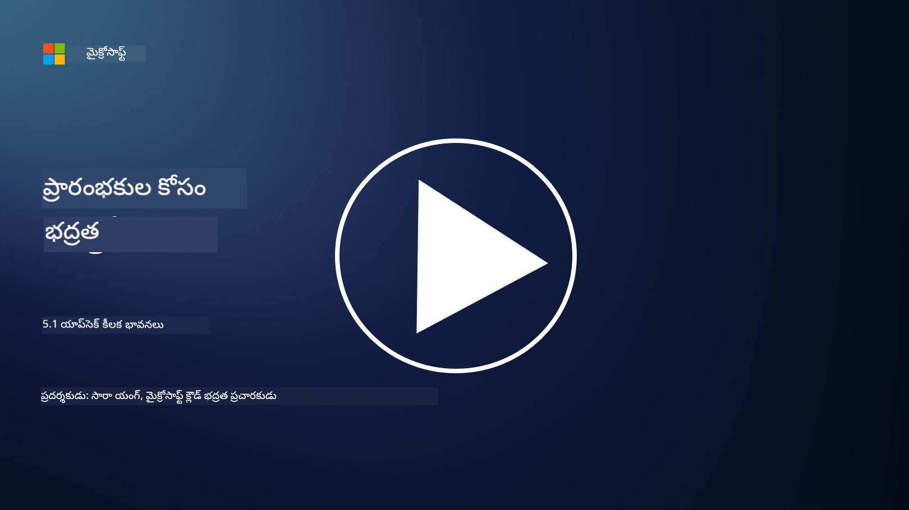

<!--
CO_OP_TRANSLATOR_METADATA:
{
  "original_hash": "e4b56bb23078d3ffb7ad407d280b0c36",
  "translation_date": "2025-12-19T13:00:17+00:00",
  "source_file": "5.1 AppSec key concepts.md",
  "language_code": "te"
}
-->
# AppSec ముఖ్యమైన భావనలు

అనువర్తన భద్రత అనేది స్వతంత్ర భద్రతా ప్రత్యేకత. ఈ కోర్సు భాగంలో, అనువర్తన భద్రత గురించి మరింత తెలుసుకుందాం.

## పరిచయం

ఈ పాఠంలో, మనం కవర్ చేయబోయేది:

- అనువర్తన భద్రత అంటే ఏమిటి?

- అనువర్తన భద్రత యొక్క ముఖ్యమైన భావనలు/సూత్రాలు ఏమిటి?

## అనువర్తన భద్రత అంటే ఏమిటి?

అనువర్తన భద్రత, సాధారణంగా "AppSec" అని పిలుస్తారు, అనువర్తనాలను భద్రతా ముప్పులు, లోపాలు మరియు దాడుల నుండి రక్షించే అభ్యాసాన్ని సూచిస్తుంది. ఇది అనువర్తన అభివృద్ధి, అమలు మరియు నిర్వహణ జీవనచక్రం అంతటా భద్రతా ప్రమాదాలను గుర్తించడం, తగ్గించడం మరియు నివారించడానికి ఉపయోగించే ప్రక్రియలు, సాంకేతికతలు మరియు సాధనాలను కలిగి ఉంటుంది.

అనువర్తన భద్రత చాలా ముఖ్యమైనది ఎందుకంటే అనువర్తనాలు సైబర్ దాడుల కోసం సాధారణ లక్ష్యాలు. దుష్ట వ్యక్తులు అనువర్తనంలోని లోపాలు మరియు బలహీనతలను ఉపయోగించి అనధికార ప్రాప్యత పొందడం, డేటాను దొంగతనం చేయడం, సేవలను భంగం చేయడం లేదా ఇతర దుష్ట కార్యకలాపాలను అమలు చేయడం చేస్తారు. సమర్థవంతమైన అనువర్తన భద్రత అనువర్తనం మరియు దానికి సంబంధించిన డేటా యొక్క గోప్యత, సమగ్రత మరియు లభ్యతను నిర్ధారించడంలో సహాయపడుతుంది.

## అనువర్తన భద్రత యొక్క ముఖ్యమైన భావనలు/సూత్రాలు ఏమిటి?

అనువర్తన భద్రతను ఆధారంగా చేసుకున్న ముఖ్యమైన భావనలు మరియు సూత్రాలు:

1. **డిజైన్ ద్వారా భద్రత**:

- భద్రత అనువర్తన డిజైన్ మరియు నిర్మాణంలో ప్రారంభం నుండి సమగ్రంగా ఉండాలి, తరువాత అదనంగా చేర్చబడకుండా.

2. **ఇన్‌పుట్ ధృవీకరణ**:

- అన్ని వినియోగదారు ఇన్‌పుట్‌లు నిర్దేశించిన ఫార్మాట్‌లకు అనుగుణంగా ఉండేలా మరియు దుష్ట కోడ్ లేదా డేటా నుండి స్వేచ్ఛగా ఉండేలా ధృవీకరించాలి.

3. **అవుట్‌పుట్ ఎన్‌కోడింగ్**:

- క్లయింట్‌కు పంపే డేటాను సరైన విధంగా ఎన్‌కోడ్ చేయాలి, క్రాస్-సైట్ స్క్రిప్టింగ్ (XSS) వంటి లోపాలను నివారించడానికి.

4. **ఆథెంటికేషన్ మరియు ఆథరైజేషన్**:

- వినియోగదారులను ధృవీకరించండి మరియు వారి పాత్రలు మరియు అనుమతుల ఆధారంగా వనరులకు ప్రాప్యతను అనుమతించండి.

5. **డేటా రక్షణ**:

- సున్నితమైన డేటాను నిల్వ చేయడం, ప్రసారం చేయడం మరియు ప్రాసెస్ చేయడం సమయంలో గోప్యతా ఉల్లంఘనలను నివారించడానికి ఎన్‌క్రిప్ట్ చేయాలి.

6. **సెషన్ నిర్వహణ**:

- భద్రతా సెషన్ నిర్వహణ వినియోగదారు సెషన్‌లను హైజాకింగ్ మరియు అనధికార ప్రాప్యత నుండి రక్షిస్తుంది.

7. **భద్రతా ఆధారాలు**:

- సాఫ్ట్‌వేర్ ఆధారాలను భద్రతా ప్యాచ్‌లతో నవీకరించండి, లోపాలను నివారించడానికి.

8. **లోపాల నిర్వహణ మరియు లాగింగ్**:

- సున్నితమైన సమాచారాన్ని వెల్లడించకుండా భద్రతా లోపాల నిర్వహణను అమలు చేయండి మరియు భద్రతా లాగింగ్ పద్ధతులను పాటించండి.

9. **భద్రతా పరీక్ష**:

- పెనిట్రేషన్ టెస్టింగ్, కోడ్ రివ్యూలు మరియు ఆటోమేటెడ్ స్కానింగ్ టూల్స్ వంటి పద్ధతులను ఉపయోగించి అనువర్తనాలను తరచుగా పరీక్షించండి.

10. **భద్రతా సాఫ్ట్‌వేర్ అభివృద్ధి జీవనచక్రం (SDLC)**:

- అవసరాలు నుండి అమలు మరియు నిర్వహణ వరకు సాఫ్ట్‌వేర్ అభివృద్ధి జీవనచక్రం యొక్క ప్రతి దశలో భద్రతా పద్ధతులను సమగ్రంగా చేర్చండి.

## మరింత చదవండి

- [SheHacksPurple: What is Application Security? - YouTube](https://www.youtube.com/watch?v=eNmccQNzSSY)
- [What Is Application Security? - Cisco](https://www.cisco.com/c/en/us/solutions/security/application-first-security/what-is-application-security.html#~how-does-it-work)
- [What is application security? A process and tools for securing software | CSO Online](https://www.csoonline.com/article/566471/what-is-application-security-a-process-and-tools-for-securing-software.html)
- [OWASP Cheat Sheet Series | OWASP Foundation](https://owasp.org/www-project-cheat-sheets/)

---

<!-- CO-OP TRANSLATOR DISCLAIMER START -->
**అస్వీకరణ**:  
ఈ పత్రం AI అనువాద సేవ [Co-op Translator](https://github.com/Azure/co-op-translator) ఉపయోగించి అనువదించబడింది. మేము ఖచ్చితత్వానికి ప్రయత్నిస్తున్నప్పటికీ, ఆటోమేటెడ్ అనువాదాలు తప్పులు లేదా అసమగ్రతలను కలిగి ఉండవచ్చు. దాని స్వదేశ భాషలో ఉన్న అసలు పత్రాన్ని అధికారం కలిగిన మూలంగా పరిగణించాలి. కీలకమైన సమాచారం కోసం, ప్రొఫెషనల్ మానవ అనువాదాన్ని సిఫారసు చేస్తాము. ఈ అనువాదాన్ని ఉపయోగించడం వల్ల కలిగే ఏవైనా అపార్థాలు లేదా తప్పుదారులు కోసం మేము బాధ్యత వహించము.
<!-- CO-OP TRANSLATOR DISCLAIMER END -->