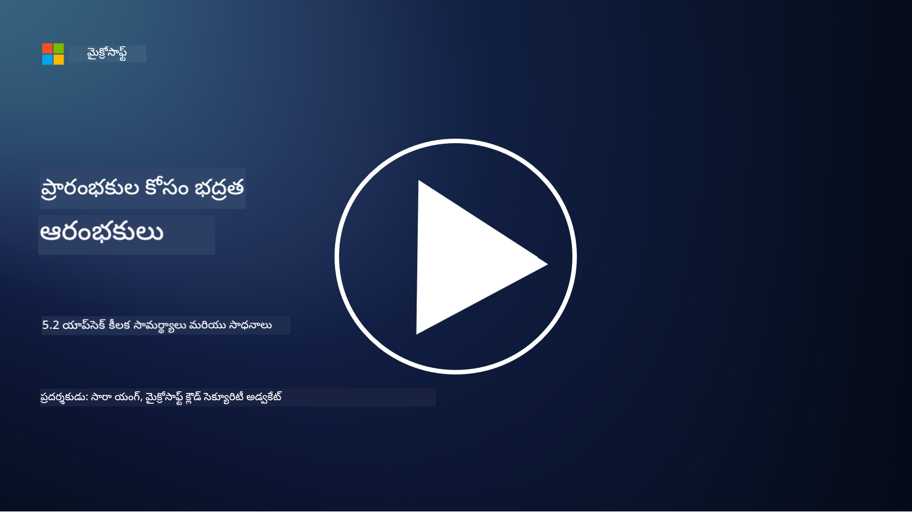

<!--
CO_OP_TRANSLATOR_METADATA:
{
  "original_hash": "790a3fa7e535ec60bb51bde13e759781",
  "translation_date": "2025-12-19T13:38:44+00:00",
  "source_file": "5.2 AppSec key capabilities.md",
  "language_code": "te"
}
-->
ఈ విభాగంలో, అప్లికేషన్ భద్రతలో ఉపయోగించే ప్రధాన సాధనాలు మరియు సామర్థ్యాల గురించి మరింత వివరాలు తెలుసుకుందాం:

## పరిచయం

ఈ పాఠంలో, అప్లికేషన్ భద్రతలో ఉపయోగించే ముఖ్యమైన సామర్థ్యాలు మరియు సాధనాలు ఏమిటి అనే విషయాన్ని తెలుసుకుంటాం.

## అప్లికేషన్ భద్రత ముఖ్య సామర్థ్యాలు మరియు సాధనాలు

సాఫ్ట్‌వేర్ అప్లికేషన్లలో భద్రతా లోపాలు మరియు ముప్పులను గుర్తించడం, తగ్గించడం, మరియు నివారించడానికి అప్లికేషన్ భద్రతలో ఉపయోగించే ముఖ్య సామర్థ్యాలు మరియు సాధనాలు చాలా అవసరం. ఇక్కడ కొన్ని ముఖ్యమైనవి ఉన్నాయి:

**1. స్టాటిక్ అప్లికేషన్ సెక్యూరిటీ టెస్టింగ్ (SAST)**:

- **సామర్థ్యాలు**: అప్లికేషన్ కోడ్‌బేస్‌లో భద్రతా లోపాలను గుర్తించడానికి సోర్స్ కోడ్, బైట్‌కోడ్ లేదా బైనరీ కోడ్‌ను విశ్లేషిస్తుంది.

- **సాధనాలు**: ఉదాహరణలు: Fortify, Checkmarx, Veracode.

**2. డైనమిక్ అప్లికేషన్ సెక్యూరిటీ టెస్టింగ్ (DAST)**:

- **సామర్థ్యాలు**: రన్నింగ్ అప్లికేషన్‌ను స్కాన్ చేసి, ఇన్‌పుట్ రిక్వెస్టులు పంపడం మరియు స్పందనలను విశ్లేషించడం ద్వారా లోపాలను గుర్తిస్తుంది.

- **సాధనాలు**: ఉదాహరణలు: ZAP, Burp Suite, Qualys Web Application Scanning.

**3. ఇంటరాక్టివ్ అప్లికేషన్ సెక్యూరిటీ టెస్టింగ్ (IAST)**:

- **సామర్థ్యాలు**: SAST మరియు DAST అంశాలను కలిపి రన్‌టైమ్‌లో కోడ్‌ను విశ్లేషిస్తుంది, మరింత ఖచ్చితమైన ఫలితాలను అందిస్తుంది మరియు తప్పుడు పాజిటివ్‌లను తగ్గిస్తుంది.

- **సాధనాలు**: ఉదాహరణలు: Contrast Security, HCL AppScan.

**4. రన్‌టైమ్ అప్లికేషన్ సెల్ఫ్-ప్రొటెక్షన్ (RASP)**:

- **సామర్థ్యాలు**: రియల్-టైమ్‌లో అప్లికేషన్లను పర్యవేక్షించి, భద్రతా ముప్పులను గుర్తించి, వాటికి స్పందిస్తుంది.

- **సాధనాలు**: ఉదాహరణలు: Veracode Runtime Protection, F5 Advanced WAF with RASP.

**5. వెబ్ అప్లికేషన్ ఫైర్వాల్స్ (WAFs)**:

- **సామర్థ్యాలు**: అప్లికేషన్ మరియు ఇంటర్నెట్ మధ్య రక్షణ పొరను అందించి, ఇన్‌కమింగ్ ట్రాఫిక్‌ను ఫిల్టర్ చేసి, దుష్ట రిక్వెస్టులను బ్లాక్ చేస్తుంది.

- **సాధనాలు**: ఉదాహరణలు: ModSecurity, AWS WAF, Akamai Kona Site Defender.

**6. డిపెండెన్సీ స్కానింగ్**:

- **సామర్థ్యాలు**: అప్లికేషన్‌లో ఉపయోగించే థర్డ్-పార్టీ లైబ్రరీలు మరియు భాగాల్లో భద్రతా లోపాలను గుర్తిస్తుంది.

- **సాధనాలు**: ఉదాహరణలు: OWASP Dependency-Check, Snyk.

**7. పెనిట్రేషన్ టెస్టింగ్ (పెన్ టెస్టింగ్)**:

- **సామర్థ్యాలు**: వాస్తవ ప్రపంచ దాడులను అనుకరించి, అప్లికేషన్ భద్రతను అంచనా వేయడం.

- **సాధనాలు**: సర్టిఫైడ్ ఎథికల్ హ్యాకర్లు మరియు భద్రతా నిపుణులు Metasploit, Nmap వంటి సాధనాలను ఉపయోగిస్తారు.

**8. భద్రతా స్కానింగ్ మరియు విశ్లేషణ**:

- **సామర్థ్యాలు**: తెలిసిన లోపాలు, కాన్ఫిగరేషన్ పొరపాట్లు, మరియు భద్రతా తప్పుల కోసం స్కాన్ చేస్తుంది.

- **సాధనాలు**: ఉదాహరణలు: Nessus, Qualys Vulnerability Management, OpenVAS.

**9. కంటైనర్ భద్రత సాధనాలు**:

- **సామర్థ్యాలు**: కంటైనర్‌లలో అప్లికేషన్లు మరియు వాటి పరిసరాలను భద్రత కల్పించడంపై దృష్టి సారిస్తుంది.

- **సాధనాలు**: ఉదాహరణలు: Docker Security Scanning, Aqua Security.

**10. భద్రతా అభివృద్ధి శిక్షణ**:

- **సామర్థ్యాలు**: అభివృద్ధి బృందాలకు భద్రతా కోడింగ్ పద్ధతులపై శిక్షణ మరియు అవగాహన కార్యక్రమాలను అందిస్తుంది.

- **సాధనాలు**: అనుకూల శిక్షణా కార్యక్రమాలు మరియు ప్లాట్‌ఫారమ్‌లు.

**11. భద్రతా టెస్టింగ్ ఫ్రేమ్‌వర్క్‌లు**:

- **సామర్థ్యాలు**: వివిధ అప్లికేషన్ భద్రతా టెస్టింగ్ అవసరాలకు సమగ్ర టెస్టింగ్ ఫ్రేమ్‌వర్క్‌లను అందిస్తుంది.

- **సాధనాలు**: OWASP Amass, OWASP OWTF, FrAppSec.

**12. సురక్షిత కోడ్ రివ్యూ సాధనాలు**:

- **సామర్థ్యాలు**: భద్రతా లోపాలు మరియు కోడింగ్ ఉత్తమ పద్ధతుల కోసం సోర్స్ కోడ్‌ను సమీక్షిస్తుంది.

- **సాధనాలు**: ఉదాహరణలు: SonarQube, Checkmarx.

**13. సురక్షిత APIs మరియు మైక్రోసర్వీసెస్ సాధనాలు**:

- **సామర్థ్యాలు**: APIs మరియు మైక్రోసర్వీసెస్ భద్రతపై దృష్టి సారించి, ఆథెంటికేషన్, ఆథరైజేషన్, మరియు డేటా రక్షణను అందిస్తుంది.

- **సాధనాలు**: ఉదాహరణలు: Apigee, AWS API Gateway, Istio.

## మరింత చదవండి

- [What Is Application Security? Concepts, Tools & Best Practices | HackerOne](https://www.hackerone.com/knowledge-center/what-application-security-concepts-tools-best-practices)  
- [What is IAST? (Interactive Application Security Testing) (comparitech.com)](https://www.comparitech.com/net-admin/what-is-iast/)  
- [10 Types of Application Security Testing Tools: When and How to Use Them (cmu.edu)](https://insights.sei.cmu.edu/blog/10-types-of-application-security-testing-tools-when-and-how-to-use-them/)  
- [Shifting the Balance of Cybersecurity Risk: Principles and Approaches for Security-by-Design and Default | Cyber.gov.au](https://www.cyber.gov.au/about-us/view-all-content/publications/principles-and-approaches-for-security-by-design-and-default)  

---

<!-- CO-OP TRANSLATOR DISCLAIMER START -->
**అస్వీకరణ**:  
ఈ పత్రాన్ని AI అనువాద సేవ [Co-op Translator](https://github.com/Azure/co-op-translator) ఉపయోగించి అనువదించారు. మేము ఖచ్చితత్వానికి ప్రయత్నిస్తున్నప్పటికీ, ఆటోమేటెడ్ అనువాదాలు తప్పులు లేదా అసమగ్రతలను కలిగి ఉండవచ్చు. దయచేసి, దాని స్వస్థల భాషలో ఉన్న అసలు పత్రాన్ని అధికారం కలిగిన మూలంగా పరిగణించండి. కీలకమైన సమాచారం కోసం, ప్రొఫెషనల్ మానవ అనువాదాన్ని సిఫారసు చేస్తాము. ఈ అనువాదాన్ని ఉపయోగించడం వల్ల కలిగే ఏవైనా అపార్థాలు లేదా తప్పుదారులు కోసం మేము బాధ్యత వహించము.
<!-- CO-OP TRANSLATOR DISCLAIMER END -->