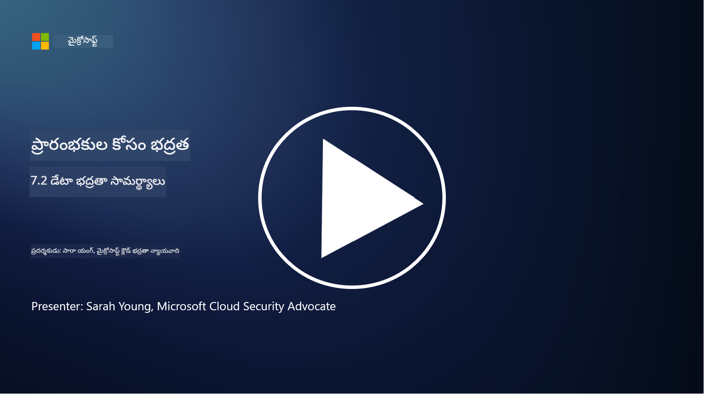

<!--
CO_OP_TRANSLATOR_METADATA:
{
  "original_hash": "50697add9758e54693442d502d2d5f8a",
  "translation_date": "2025-12-19T13:10:35+00:00",
  "source_file": "7.2 Data security capabilities.md",
  "language_code": "te"
}
-->
# డేటా భద్రత సామర్థ్యాలు

ఈ విభాగంలో, డేటా భద్రతలో ఉపయోగించే ప్రధాన సాధనాలు మరియు సామర్థ్యాల గురించి మరింత వివరాలు తెలుసుకుంటాము:

**పరిచయం**

ఈ పాఠంలో, మనం కవర్ చేయబోయేది:

- డేటా లాస్ ప్రివెన్షన్ టూలింగ్ అంటే ఏమిటి?

- ఇన్‌సైడర్ రిస్క్ మేనేజ్‌మెంట్ టూలింగ్ అంటే ఏమిటి?

- డేటా రిటెన్షన్ టూలింగ్ ఏవి అందుబాటులో ఉన్నాయి?

## డేటా లాస్ ప్రివెన్షన్ టూలింగ్ అంటే ఏమిటి?

డేటా లాస్ ప్రివెన్షన్ (DLP) టూలింగ్ అనేది సంస్థలో సున్నితమైన లేదా గోప్యమైన డేటాను అనధికార ప్రాప్యత, పంచుకోవడం లేదా లీక్ చేయడం నుండి నివారించడానికి రూపొందించిన సాఫ్ట్‌వేర్ పరిష్కారాలు మరియు సాంకేతికతల సమితి. ఈ సాధనాలు కంటెంట్ తనిఖీ, పాలసీ అమలు మరియు మానిటరింగ్‌ను ఉపయోగించి సున్నితమైన డేటాను గుర్తించి రక్షించడానికి సహాయపడతాయి. ఉదాహరణ DLP ఉత్పత్తులు: Symantec Data Loss Prevention, McAfee Total Protection for Data Loss Prevention, Microsoft 365 DLP**: Microsoft 365 అప్లికేషన్లతో సమగ్రీకరించి, సంస్థలు ఇమెయిల్స్, డాక్యుమెంట్లు మరియు సందేశాలలో సున్నితమైన డేటాను గుర్తించి రక్షించడానికి సహాయపడుతుంది.

## ఇన్‌సైడర్ రిస్క్ మేనేజ్‌మెంట్ టూలింగ్ అంటే ఏమిటి?

ఇన్‌సైడర్ రిస్క్ మేనేజ్‌మెంట్ టూలింగ్ అనేది ఉద్యోగులు, కాంట్రాక్టర్లు లేదా భాగస్వాములు ఉద్దేశపూర్వకంగా లేదా అనుకోకుండా డేటా భద్రతను కాంప్రమైజ్ చేయవచ్చు అనే ప్రమాదాలను గుర్తించి తగ్గించడానికి సంస్థలకు సహాయపడుతుంది. ఈ సాధనాలు వినియోగదారు ప్రవర్తన, ప్రాప్యత నమూనాలు మరియు డేటా వినియోగాన్ని పర్యవేక్షించి అనుమానాస్పద కార్యకలాపాలు మరియు సంభావ్య ఇన్‌సైడర్ ముప్పులను గుర్తిస్తాయి. ఉదాహరణ ఇన్‌సైడర్ రిస్క్ మేనేజ్‌మెంట్ ఉత్పత్తులు: Microsoft Insider Risk Management (Microsoft 365లో భాగం), Forcepoint Insider Threat Data Protection, Varonis Insider Threat Detection.

## డేటా రిటెన్షన్ టూలింగ్ ఏవి అందుబాటులో ఉన్నాయి?

డేటా రిటెన్షన్ టూలింగ్ అనేది సంస్థ యొక్క డేటా రిటెన్షన్ పాలసీలు మరియు చట్టపరమైన అవసరాలకు అనుగుణంగా డేటాను నిల్వ చేయడం మరియు తొలగించడం నిర్వహించడానికి రూపొందించిన సాఫ్ట్‌వేర్ మరియు పరిష్కారాలను కలిగి ఉంటుంది. ఈ సాధనాలు నిర్దిష్ట వ్యవధుల కోసం డేటాను నిల్వ చేయడం మరియు అవసరం లేకపోయినప్పుడు సురక్షితంగా తొలగించడం ప్రక్రియను ఆటోమేట్ చేయడానికి సహాయపడతాయి. ఉదాహరణ డేటా రిటెన్షన్ ఉత్పత్తులు: Veritas Enterprise Vault, Commvault Complete Data Protection, Microsoft data lifecycle management. ఈ టూలింగ్ పరిష్కారాలు సంస్థలు డేటా రిటెన్షన్ మరియు డిస్పోజల్‌పై నియంత్రణను నిర్వహించడానికి, డేటా రక్షణ నిబంధనలకు అనుగుణంగా ఉండటానికి మరియు డేటా జీవితచక్రం అంతటా సమర్థవంతంగా నిర్వహించడానికి సహాయపడతాయి.

## మరింత చదవండి

- [Guide to Data Security Posture Management (DSPM) | CSA (cloudsecurityalliance.org)](https://cloudsecurityalliance.org/blog/2023/03/31/the-big-guide-to-data-security-posture-management-dspm/)
- [Data Loss Prevention across endpoints, apps, & services | Microsoft Purview](https://youtu.be/hvqq8L_0kgI)
- [18 Best Data Loss Prevention Software Tools 2023 (Free + Paid) (comparitech.com)](https://www.comparitech.com/data-privacy-management/data-loss-prevention-tools-software/)
- [Data Loss Prevention (nist.gov)](https://tsapps.nist.gov/publication/get_pdf.cfm?pub_id=904672)
- [Learn about insider risk management | Microsoft Learn](https://learn.microsoft.com/purview/insider-risk-management?WT.mc_id=academic-96948-sayoung)
- [Data Lifecycle Management | IBM](https://www.ibm.com/topics/data-lifecycle-management)
- [What Is Data Lifecycle Management (DLM)? | 2023 Best Practices (selecthub.com)](https://www.selecthub.com/big-data-analytics/data-lifecycle-management/)

---

<!-- CO-OP TRANSLATOR DISCLAIMER START -->
**విమర్శ**:  
ఈ పత్రాన్ని AI అనువాద సేవ [Co-op Translator](https://github.com/Azure/co-op-translator) ఉపయోగించి అనువదించారు. మేము ఖచ్చితత్వానికి ప్రయత్నిస్తున్నప్పటికీ, ఆటోమేటెడ్ అనువాదాలలో తప్పులు లేదా అసమానతలు ఉండవచ్చు. దాని స్వదేశీ భాషలోని అసలు పత్రాన్ని అధికారం కలిగిన మూలంగా పరిగణించాలి. కీలకమైన సమాచారం కోసం, ప్రొఫెషనల్ మానవ అనువాదాన్ని సిఫారసు చేస్తాము. ఈ అనువాదాన్ని ఉపయోగించడం వల్ల కలిగే ఏవైనా అపార్థాలు లేదా తప్పుదారులు కోసం మేము బాధ్యత వహించము.
<!-- CO-OP TRANSLATOR DISCLAIMER END -->