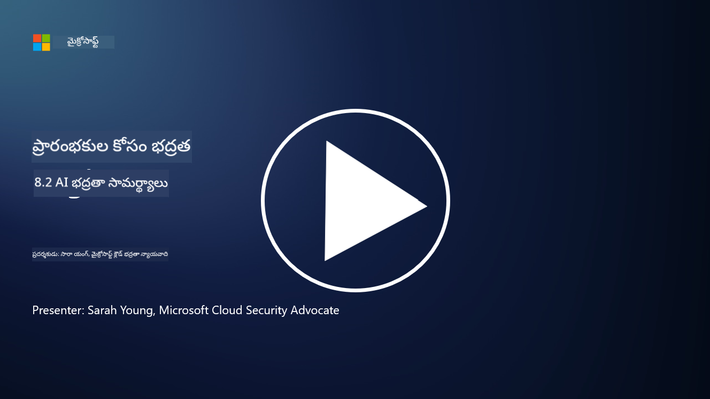

<!--
CO_OP_TRANSLATOR_METADATA:
{
  "original_hash": "b6bb7175672298d1e2f73ba7e0006f95",
  "translation_date": "2025-12-19T13:24:53+00:00",
  "source_file": "8.2 AI security capabilities.md",
  "language_code": "te"
}
-->
# AI భద్రతా సామర్థ్యాలు

## ప్రస్తుతం AI వ్యవస్థలను భద్రపరచడానికి మనకు ఏ సాధనాలు మరియు సామర్థ్యాలు ఉన్నాయి?

ప్రస్తుతం, AI వ్యవస్థలను భద్రపరచడానికి అనేక సాధనాలు మరియు సామర్థ్యాలు అందుబాటులో ఉన్నాయి:

-   **Counterfit**: AI వ్యవస్థల భద్రతా పరీక్షల కోసం రూపొందించిన ఓపెన్-సోర్స్ ఆటోమేషన్ సాధనం. ఇది సంస్థలకు AI భద్రతా ప్రమాదాల అంచనాలు నిర్వహించడంలో మరియు వారి అల్గోరిథమ్‌ల బలాన్ని నిర్ధారించడంలో సహాయపడుతుంది.
-   **Adversarial Machine Learning Tools**: ఈ సాధనాలు మెషిన్ లెర్నింగ్ మోడళ్లను ప్రతికూల దాడులపై పరీక్షించి, లోపాలను గుర్తించి వాటిని తగ్గించడంలో సహాయపడతాయి.
-   **AI భద్రతా టూల్‌కిట్లు**: AI వ్యవస్థలను భద్రపరచడానికి అవసరమైన వనరులను అందించే ఓపెన్-సోర్స్ టూల్‌కిట్లు అందుబాటులో ఉన్నాయి, వీటిలో భద్రతా చర్యలను అమలు చేయడానికి లైబ్రరీలు మరియు ఫ్రేమ్‌వర్క్‌లు ఉన్నాయి.
-   **సహకార వేదికలు**: AI సరఫరా గొలుసును భద్రపరచడానికి AI కమ్యూనిటీలతో కలిసి కంపెనీలు అభివృద్ధి చేసే AI-స్పెసిఫిక్ భద్రతా స్కానర్లు మరియు ఇతర సాధనాలు.

ఈ సాధనాలు మరియు సామర్థ్యాలు వివిధ ముప్పుల నుండి AI వ్యవస్థల భద్రతను మెరుగుపరచడానికి అంకితమైన పెరుగుతున్న రంగంలో భాగంగా ఉన్నాయి. ఇవి పరిశోధన, ప్రాక్టికల్ టూల్స్, మరియు పరిశ్రమ సహకారాల కలయికను ప్రతిబింబిస్తాయి, AI టెక్నాలజీల వల్ల కలిగే ప్రత్యేకమైన సవాళ్లను ఎదుర్కోవడంపై దృష్టి సారించాయి.

## AI రెడ్ టీమింగ్ గురించి ఏమిటి? ఇది సంప్రదాయ భద్రతా రెడ్ టీమింగ్‌తో ఎలా భిన్నంగా ఉంటుంది?

AI రెడ్ టీమింగ్ సంప్రదాయ భద్రతా రెడ్ టీమింగ్‌తో కొన్ని ముఖ్యమైన అంశాలలో భిన్నంగా ఉంటుంది:

-   **AI వ్యవస్థలపై దృష్టి**: AI రెడ్ టీమింగ్ ప్రత్యేకంగా మెషిన్ లెర్నింగ్ మోడళ్లు మరియు డేటా పైప్లైన్ల వంటి AI వ్యవస్థల ప్రత్యేకమైన లోపాలను లక్ష్యంగా చేసుకుంటుంది, సంప్రదాయ IT మౌలిక సదుపాయాలను కాకుండా.
-   **AI ప్రవర్తనను పరీక్షించడం**: ఇది AI వ్యవస్థలు అసాధారణ లేదా అనూహ్యమైన ఇన్‌పుట్‌లకు ఎలా స్పందిస్తాయో పరీక్షించడం, ఇది దాడిదారులు ఉపయోగించగల లోపాలను వెల్లడించగలదు.
-   **AI వైఫల్యాలను అన్వేషించడం**: AI రెడ్ టీమింగ్ దుష్టమైన మరియు నిర్దోషమైన వైఫల్యాలను పరిశీలిస్తుంది, భద్రతా ఉల్లంఘనలకు మించి విస్తృతమైన వ్యక్తిత్వాలు మరియు వ్యవస్థ వైఫల్యాలను పరిగణనలోకి తీసుకుంటుంది.
-   **ప్రాంప్ట్ ఇంజెక్షన్ మరియు కంటెంట్ జనరేషన్**: AI రెడ్ టీమింగ్ ప్రాంప్ట్ ఇంజెక్షన్ వంటి వైఫల్యాలను కూడా పరిశీలిస్తుంది, ఇక్కడ దాడిదారులు AI వ్యవస్థలను హానికరమైన లేదా అసంబద్ధమైన కంటెంట్ ఉత్పత్తి చేయడానికి మోసగించగలరు.
-   **నైతిక మరియు బాధ్యతాయుత AI**: ఇది బాధ్యతాయుత AI రూపకల్పనలో భాగం, AI వ్యవస్థలు అవాంఛిత మార్గాల్లో ప్రవర్తించకుండా నిరోధించడానికి బలంగా ఉండేలా చూసుకోవడం.

మొత్తం మీద, AI రెడ్ టీమింగ్ భద్రతా లోపాలను పరిశీలించడమే కాకుండా, AI టెక్నాలజీలకు ప్రత్యేకమైన ఇతర రకాల వ్యవస్థ వైఫల్యాలను పరీక్షించడాన్ని కూడా కలిగి ఉంటుంది. AI అమలుకు సంబంధించిన కొత్త ప్రమాదాలను అర్థం చేసుకోవడం మరియు తగ్గించడం ద్వారా సురక్షితమైన AI వ్యవస్థలను అభివృద్ధి చేయడంలో ఇది కీలకమైన భాగం.

## మరింత చదవండి

 - [Microsoft AI Red Team building future of safer AI | Microsoft Security Blog](https://www.microsoft.com/en-us/security/blog/2023/08/07/microsoft-ai-red-team-building-future-of-safer-ai/?WT.mc_id=academic-96948-sayoung)
 - [Announcing Microsoft’s open automation framework to red team generative AI Systems | Microsoft Security Blog](https://www.microsoft.com/en-us/security/blog/2024/02/22/announcing-microsofts-open-automation-framework-to-red-team-generative-ai-systems/?WT.mc_id=academic-96948-sayoung)
 - [AI Security Tools: The Open-Source Toolkit | Wiz](https://www.wiz.io/academy/ai-security-tools)

---

<!-- CO-OP TRANSLATOR DISCLAIMER START -->
**అస్వీకరణ**:  
ఈ పత్రం AI అనువాద సేవ [Co-op Translator](https://github.com/Azure/co-op-translator) ఉపయోగించి అనువదించబడింది. మేము ఖచ్చితత్వానికి ప్రయత్నిస్తున్నప్పటికీ, ఆటోమేటెడ్ అనువాదాలు తప్పులు లేదా అసమగ్రతలను కలిగి ఉండవచ్చు. దాని స్వదేశ భాషలో ఉన్న అసలు పత్రాన్ని అధికారం కలిగిన మూలంగా పరిగణించాలి. కీలకమైన సమాచారం కోసం, ప్రొఫెషనల్ మానవ అనువాదం సిఫార్సు చేయబడుతుంది. ఈ అనువాదం ఉపయోగం వల్ల కలిగే ఏవైనా అపార్థాలు లేదా తప్పుదారులు కోసం మేము బాధ్యత వహించము.
<!-- CO-OP TRANSLATOR DISCLAIMER END -->