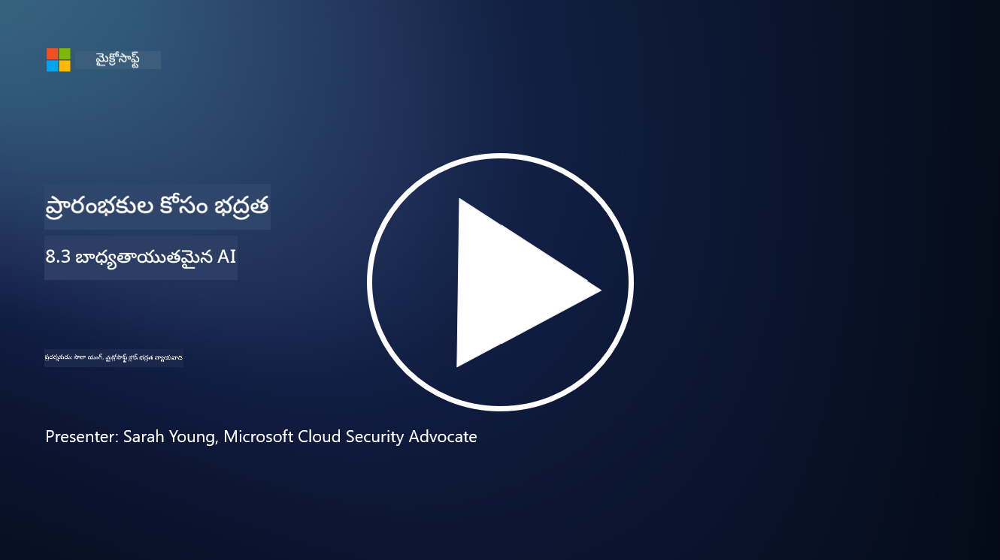

<!--
CO_OP_TRANSLATOR_METADATA:
{
  "original_hash": "5e9775ee91bde7d44577891d5f11c4c5",
  "translation_date": "2025-12-19T13:13:05+00:00",
  "source_file": "8.3 Responsible AI.md",
  "language_code": "te"
}
-->
# బాధ్యతాయుత AI

## బాధ్యతాయుత AI అంటే ఏమిటి? ఇది AI భద్రతకు ఎలా సంబంధించింది?

బాధ్యతాయుత AI అనేది నైతికత, పారదర్శకత మరియు సమాజపు విలువలకు అనుగుణంగా కృత్రిమ మేధస్సు అభివృద్ధి మరియు వినియోగం. ఇది న్యాయం, బాధ్యత మరియు బలమైనతనం వంటి సూత్రాలను కలిగి ఉంటుంది, AI వ్యవస్థలు వ్యక్తులు, సముదాయాలు మరియు సమాజానికి ప్రయోజనం కలిగించేలా రూపొందించబడినట్లు మరియు నిర్వహించబడినట్లు నిర్ధారిస్తుంది.

బాధ్యతాయుత AI మరియు AI భద్రత మధ్య సంబంధం ముఖ్యమైనది ఎందుకంటే:

- **నైతిక అంశాలు**: బాధ్యతాయుత AI నైతిక అంశాలను కలిగి ఉంటుంది, ఇవి భద్రతపై నేరుగా ప్రభావం చూపుతాయి, ఉదాహరణకు గోప్యత మరియు డేటా రక్షణ. AI వ్యవస్థలు వినియోగదారుల గోప్యతను గౌరవించి, వ్యక్తిగత డేటాను రక్షించడాన్ని నిర్ధారించడం బాధ్యతాయుత AI యొక్క ముఖ్యమైన భాగం.

- **బలమైనతనం మరియు నమ్మకత**: AI వ్యవస్థలు మోసపూరిత చర్యలు మరియు దాడులపై బలంగా ఉండాలి, ఇది బాధ్యతాయుత AI మరియు AI భద్రత యొక్క ప్రధాన సూత్రం. దీనిలో ప్రతికూల దాడుల నుండి రక్షణ మరియు AI నిర్ణయాల సమగ్రతను నిర్ధారించడం కూడా ఉంటుంది.

- **పారదర్శకత మరియు వివరణాత్మకత**: బాధ్యతాయుత AIలో భాగంగా AI వ్యవస్థలు పారదర్శకంగా ఉండి, వాటి నిర్ణయాలను వివరణాత్మకంగా చేయగలగాలి. ఇది భద్రతకు కీలకమైనది, ఎందుకంటే వాటి భద్రతా చర్యలను నమ్మడానికి వాటి ఆపరేషన్‌ను అర్థం చేసుకోవడం అవసరం.

- **బాధ్యత**: AI వ్యవస్థలు తమ చర్యలకు బాధ్యత వహించాలి, అంటే నిర్ణయాలను ట్రేస్ చేయడానికి మరియు ఏదైనా సమస్యలను సరిదిద్దడానికి మెకానిజంలు ఉండాలి. ఇది వ్యవస్థ కార్యకలాపాలను పర్యవేక్షించి, ఉల్లంఘనలను నివారించి, స్పందించడానికి భద్రతా ఆచరణలతో అనుగుణంగా ఉంటుంది.

సారాంశంగా, బాధ్యతాయుత AI మరియు AI భద్రత పరస్పరం అనుసంధానంగా ఉంటాయి, బాధ్యతాయుత AI ఆచరణలు AI వ్యవస్థల భద్రతను మెరుగుపరుస్తాయి మరియు దానికి విరుద్ధంగా ఉంటుంది. బాధ్యతాయుత AI సూత్రాలను అమలు చేయడం ద్వారా నైతికంగా సరైన మరియు భద్రతా ముప్పుల నుండి రక్షణ కలిగించే AI వ్యవస్థలను సృష్టించవచ్చు.

## నా AI వ్యవస్థను భద్రతతో పాటు నైతికంగా ఎలా నిర్ధారించగలవు?

మీ AI వ్యవస్థను భద్రతతో పాటు నైతికంగా నిర్ధారించడానికి అనేక దశలను కలిగి ఉన్న సమగ్ర దృక్పథం అవసరం:

- **నైతిక సూత్రాలను పాటించండి**: మానవ, సమాజ మరియు పర్యావరణ సంక్షేమం; న్యాయం; గోప్యత రక్షణ; నమ్మకత; పారదర్శకత; పోటీ సామర్థ్యం; మరియు బాధ్యతను ప్రాముఖ్యత కలిగించే స్థాపిత నైతిక మార్గదర్శకాలను అనుసరించండి.

- **బలమైన భద్రతా చర్యలను అమలు చేయండి**: ముప్పులు మరియు లోపాలను నివారించడానికి ప్రాక్టివ్ భద్రతా పరీక్షలు మరియు AI నమ్మకం, ప్రమాదం, భద్రతా నిర్వహణ కార్యక్రమాలను ఉపయోగించండి.

- **వివిధ స్టేక్‌హోల్డర్లను చేర్చండి**: AI అభివృద్ధి ప్రక్రియలో నైతికవేత్తలు, సామాజిక శాస్త్రవేత్తలు మరియు ప్రభావిత సముదాయాల ప్రతినిధులు వంటి విస్తృత శ్రేణి పాల్గొనేవారిని చేర్చండి, వివిధ దృక్పథాలు మరియు విలువలు పరిగణనలోకి తీసుకోబడేలా చూడండి.

- **పారదర్శకత మరియు వివరణాత్మకతను నిర్ధారించండి**: AI యొక్క నిర్ణయాల ప్రక్రియలు పారదర్శకంగా ఉండి, వివరణాత్మకంగా చేయగలగాలి, ఇది ఎక్కువ నమ్మకాన్ని మరియు పక్షపాతాలు లేదా పొరపాట్లను గుర్తించడం సులభతరం చేస్తుంది.

- **డేటా గోప్యతను నిర్వహించండి**: వినియోగదారుల గోప్యత హక్కులను గౌరవించడానికి డేటా యొక్క గోప్యత మరియు ప్రామాణికతను ఎన్‌క్రిప్షన్ మరియు ఇతర డేటా రక్షణ చర్యల ద్వారా రక్షించండి.

- **మానవ పర్యవేక్షణను ప్రారంభించండి**: AI వ్యవస్థలు చేసిన నిర్ణయాలను పోటీ చేయడానికి మరియు బాధ్యతను నిర్ధారించడానికి మానవ పర్యవేక్షణ మెకానిజంలను అమలు చేయండి.

- **AI భద్రతపై సమాచారం పొందండి**: AI భద్రత మరియు నైతికత యొక్క అభివృద్ధి చెందుతున్న దృశ్యాన్ని అర్థం చేసుకోవడానికి తాజా పరిశోధనలు మరియు చర్చలతో అప్రమత్తంగా ఉండండి.

- **నియమాలను పాటించండి**: మీ AI వ్యవస్థ సంబంధిత చట్టాలు మరియు నియమాలను పాటించడాన్ని నిర్ధారించండి, వీటిలో డేటా రక్షణ చట్టాలు, వివక్ష వ్యతిరేక చట్టాలు మరియు పరిశ్రమ-నిర్దిష్ట మార్గదర్శకాలు ఉండవచ్చు.

## నైతికంగా AIను ఉపయోగించకపోవడం వల్ల భద్రతా సమస్యకు కొన్ని ఉదాహరణలు ఇవ్వగలరా?

AIను నైతికంగా ఉపయోగించకపోవడం వల్ల ఏర్పడే భద్రతా సమస్యల కొన్ని ఉదాహరణలు ఇక్కడ ఉన్నాయి:

- **పక్షపాత నిర్ణయాలు**: AI వ్యవస్థలు పక్షపాత డేటా సెట్‌లపై శిక్షణ పొందితే, అవి ఉన్న పక్షపాతాలను కొనసాగించి పెంచవచ్చు. ఉదాహరణకు, ఒక సెర్చ్ ఇంజిన్ సమాజపు మూసలను ప్రతిబింబించే డేటాపై శిక్షణ పొందితే, అది పక్షపాత సెర్చ్ ఫలితాలను ప్రదర్శించవచ్చు, ఇది అన్యాయమైన ప్రవర్తన లేదా వివక్షకు దారితీస్తుంది.

- **న్యాయ వ్యవస్థల్లో AI**: న్యాయ నిర్ణయాలలో AI వినియోగం నైతిక ఆందోళనలను పెంచవచ్చు, ముఖ్యంగా AI యొక్క నిర్ణయ ప్రక్రియ పారదర్శకత లేకపోతే లేదా పక్షపాత డేటా ప్రభావితమైతే. ఇది అన్యాయమైన న్యాయ ఫలితాలకు మరియు వ్యక్తుల హక్కుల ఉల్లంఘనకు దారితీస్తుంది.

- **AI వ్యవస్థల మోసపూరితత**: AI వ్యవస్థలు ప్రతికూల దాడులకు లోనవుతాయి, ఇన్‌పుట్ డేటాలో స్వల్ప మార్పులు తప్పు ఫలితాలను కలిగించవచ్చు. ఉదాహరణకు, స్వయంచాలక వాహనాలు ట్రాఫిక్ సైన్‌లను తప్పుగా అర్థం చేసుకోవడానికి మోసపూరితంగా మార్పు చేయబడవచ్చు, ఇది భద్రతా ప్రమాదాలకు దారితీస్తుంది.

- **AI ఆధారిత నిఘా**: నిఘా ప్రయోజనాల కోసం AI వినియోగం గోప్యత ఉల్లంఘనలకు దారితీస్తుంది, ముఖ్యంగా సరైన అనుమతి లేకుండా లేదా వ్యక్తిగత స్వేచ్ఛలను ఉల్లంఘించే విధంగా ఉపయోగిస్తే. ఇది అధికారం కలిగిన పాలనలలో ప్రత్యేకంగా సమస్యాత్మకంగా ఉంటుంది, ఇవి AIను ఉపయోగించి వ్యతిరేకతను పర్యవేక్షించి అణచివేయవచ్చు.

ఈ ఉదాహరణలు AI వ్యవస్థల అభివృద్ధి మరియు అమలులో నైతిక అంశాల ప్రాముఖ్యతను, భద్రతా సమస్యలను నివారించడానికి మరియు వ్యక్తుల హక్కులు మరియు గోప్యతను రక్షించడానికి అవసరమైన నైతికతను హైలైట్ చేస్తాయి.

## మరింత చదవండి

 - [Microsoft Responsible AI Standard v2 General Requirements](https://query.prod.cms.rt.microsoft.com/cms/api/am/binary/RE5cmFl?culture=en-us&country=us&WT.mc_id=academic-96948-sayoung)
 - [Responsible AI (mit.edu)](https://sloanreview.mit.edu/big-ideas/responsible-ai/)
 - [13 Principles for Using AI Responsibly (hbr.org)](https://hbr.org/2023/06/13-principles-for-using-ai-responsibly)

---

<!-- CO-OP TRANSLATOR DISCLAIMER START -->
**అస్వీకరణ**:  
ఈ పత్రం AI అనువాద సేవ [Co-op Translator](https://github.com/Azure/co-op-translator) ఉపయోగించి అనువదించబడింది. మేము ఖచ్చితత్వానికి ప్రయత్నిస్తున్నప్పటికీ, ఆటోమేటెడ్ అనువాదాలు తప్పులు లేదా అసమగ్రతలను కలిగి ఉండవచ్చు. దయచేసి, దాని స్వస్థల భాషలో ఉన్న అసలు పత్రాన్ని అధికారం కలిగిన మూలంగా పరిగణించండి. కీలకమైన సమాచారం కోసం, ప్రొఫెషనల్ మానవ అనువాదాన్ని సిఫారసు చేస్తాము. ఈ అనువాదాన్ని ఉపయోగించడం వల్ల కలిగే ఏవైనా అపార్థాలు లేదా తప్పుదారులు కోసం మేము బాధ్యత వహించము.
<!-- CO-OP TRANSLATOR DISCLAIMER END -->